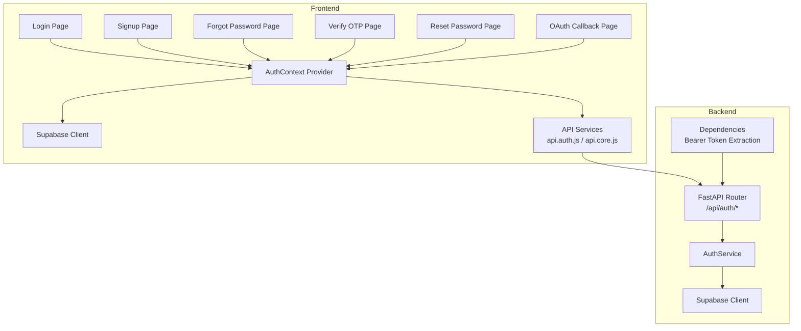
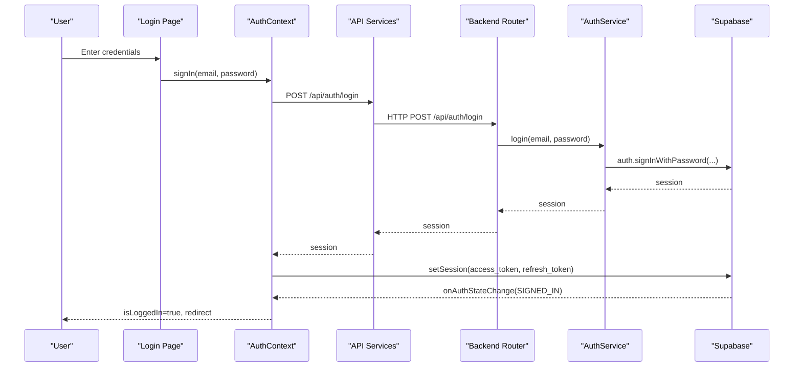
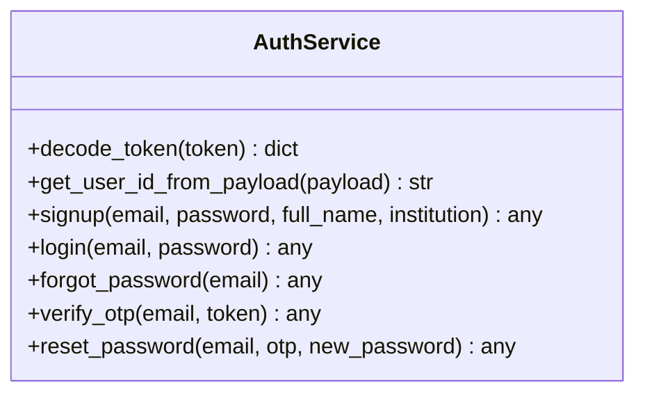
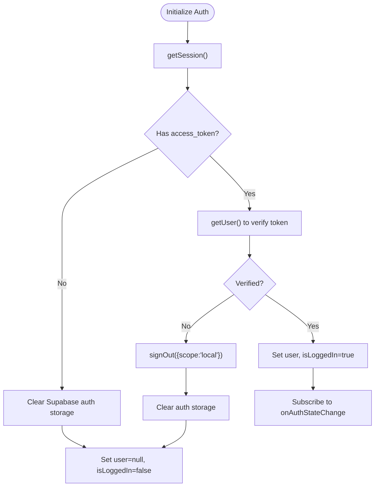
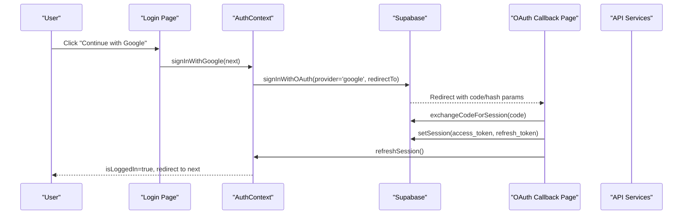
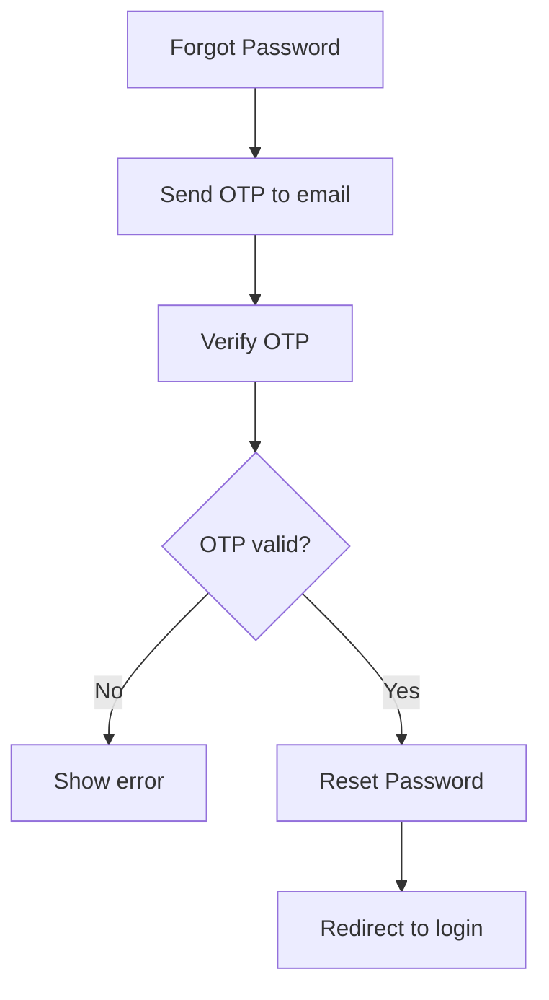
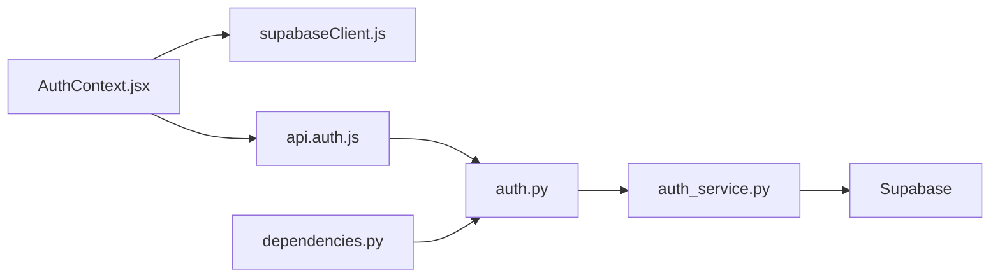

# Authentication Services

<cite>
**Referenced Files in This Document**
- [auth.py](file://backend/app/routers/auth.py)
- [auth_service.py](file://backend/app/services/auth_service.py)
- [auth.py](file://backend/app/schemas/auth.py)
- [dependencies.py](file://backend/app/utils/dependencies.py)
- [AuthContext.jsx](file://frontend/src/context/AuthContext.jsx)
- [supabaseClient.js](file://frontend/src/lib/supabaseClient.js)
- [api.auth.js](file://frontend/src/services/api.auth.js)
- [api.core.js](file://frontend/src/services/api.core.js)
- [page.jsx](file://frontend/app/(shared)/auth/callback/page.jsx)
- [page.jsx](file://frontend/app/(shared)/login/page.jsx)
- [page.jsx](file://frontend/app/(shared)/signup/page.jsx)
- [page.jsx](file://frontend/app/(shared)/forgot-password/page.jsx)
- [page.jsx](file://frontend/app/(shared)/reset-password/page.jsx)
- [page.jsx](file://frontend/app/(shared)/verify-otp/page.jsx)
</cite>

## Table of Contents
1. [Introduction](#introduction)
2. [Project Structure](#project-structure)
3. [Core Components](#core-components)
4. [Architecture Overview](#architecture-overview)
5. [Detailed Component Analysis](#detailed-component-analysis)
6. [Dependency Analysis](#dependency-analysis)
7. [Performance Considerations](#performance-considerations)
8. [Troubleshooting Guide](#troubleshooting-guide)
9. [Conclusion](#conclusion)

## Introduction
This document explains the authentication service implementation and user management across the backend and frontend. It covers the complete authentication lifecycle including signup, login, password reset, and OTP verification. It also documents Supabase integration patterns, OAuth authentication with Google, redirect path sanitization, token management, session handling, automatic refresh mechanisms, error handling, account verification workflows, and security considerations. Finally, it details the AuthContext provider implementation and authentication state management across the application.

## Project Structure
Authentication spans both backend and frontend:
- Backend FastAPI routes expose /api/auth endpoints and delegate to AuthService for Supabase operations.
- Frontend provides AuthContext for state management, integrates with Supabase client, and coordinates OAuth callbacks.
- Shared frontend pages implement the user-facing flows for login, signup, forgot password, OTP verification, and password reset.

**Diagram sources**
- [auth.py:1-59](file://backend/app/routers/auth.py#L1-L59)
- [auth_service.py:56-183](file://backend/app/services/auth_service.py#L56-L183)
- [AuthContext.jsx:16-340](file://frontend/src/context/AuthContext.jsx#L16-L340)
- [supabaseClient.js:1-24](file://frontend/src/lib/supabaseClient.js#L1-L24)
- [api.auth.js:1-39](file://frontend/src/services/api.auth.js#L1-L39)
- [api.core.js:307-362](file://frontend/src/services/api.core.js#L307-L362)
- [page.jsx](file://frontend/app/(shared)/auth/callback/page.jsx#L10-L94)

**Section sources**
- [auth.py:1-59](file://backend/app/routers/auth.py#L1-L59)
- [auth_service.py:56-183](file://backend/app/services/auth_service.py#L56-L183)
- [AuthContext.jsx:16-340](file://frontend/src/context/AuthContext.jsx#L16-L340)
- [supabaseClient.js:1-24](file://frontend/src/lib/supabaseClient.js#L1-L24)
- [api.auth.js:1-39](file://frontend/src/services/api.auth.js#L1-L39)
- [api.core.js:307-362](file://frontend/src/services/api.core.js#L307-L362)
- [page.jsx](file://frontend/app/(shared)/auth/callback/page.jsx#L10-L94)

## Core Components
- Backend authentication router: Exposes endpoints for /api/auth/signup, /api/auth/login, /api/auth/forgot-password, /api/auth/verify-otp, and /api/auth/reset-password.
- Backend AuthService: Wraps Supabase client operations, validates environment configuration, decodes and verifies JWTs, and raises appropriate HTTP exceptions.
- Frontend AuthContext: Centralizes authentication state, manages Supabase sessions, handles OAuth redirects, sanitizes redirect paths, and exposes actions for sign-up, sign-in, sign-out, password reset, and session refresh.
- Frontend Supabase client: Initializes Supabase with environment variables and avoids overriding storage to prevent SSR issues.
- Frontend API services: Provide typed wrappers around /api/auth endpoints and inject Authorization headers using Supabase session tokens.
- Frontend pages: Implement user-facing flows for login, signup, forgot password, OTP verification, and password reset.

**Section sources**
- [auth.py:23-58](file://backend/app/routers/auth.py#L23-L58)
- [auth_service.py:56-183](file://backend/app/services/auth_service.py#L56-L183)
- [AuthContext.jsx:16-340](file://frontend/src/context/AuthContext.jsx#L16-L340)
- [supabaseClient.js:1-24](file://frontend/src/lib/supabaseClient.js#L1-L24)
- [api.auth.js:18-38](file://frontend/src/services/api.auth.js#L18-L38)
- [api.core.js:307-362](file://frontend/src/services/api.core.js#L307-L362)

## Architecture Overview
The authentication architecture follows a clear separation of concerns:
- Frontend pages trigger actions via AuthContext and API services.
- AuthContext persists Supabase sessions and listens to onAuthStateChange for real-time updates.
- API services inject Authorization headers using Supabase session tokens.
- Backend routes delegate to AuthService, which interacts with Supabase to perform authentication operations.
- Dependencies extract and validate JWTs for protected endpoints.

**Diagram sources**
- [page.jsx](file://frontend/app/(shared)/login/page.jsx#L27-L65)
- [AuthContext.jsx:214-249](file://frontend/src/context/AuthContext.jsx#L214-L249)
- [api.auth.js:20-21](file://frontend/src/services/api.auth.js#L20-L21)
- [auth.py:31-36](file://backend/app/routers/auth.py#L31-L36)
- [auth_service.py:102-121](file://backend/app/services/auth_service.py#L102-L121)
- [supabaseClient.js:1-24](file://frontend/src/lib/supabaseClient.js#L1-L24)

## Detailed Component Analysis

### Backend Authentication Router
- Defines endpoints for user registration, login, forgot password, OTP verification, and password reset.
- Uses AuthService methods to perform Supabase operations.
- Returns structured responses suitable for frontend consumption.

**Section sources**
- [auth.py:23-58](file://backend/app/routers/auth.py#L23-L58)

### Backend AuthService
- Initializes Supabase client with environment variables and guards against misconfiguration.
- Provides methods for signup, login, forgot password, verify OTP, and reset password.
- Encodes and verifies JWTs, extracting user identity and metadata.
- Raises HTTP exceptions on failures with appropriate status codes.

**Diagram sources**
- [auth_service.py:56-183](file://backend/app/services/auth_service.py#L56-L183)

**Section sources**
- [auth_service.py:56-183](file://backend/app/services/auth_service.py#L56-L183)

### Frontend AuthContext Provider
- Manages authentication state: user, isLoggedIn, loading.
- Initializes Supabase session on mount, verifies tokens, and clears invalid storage.
- Subscribes to onAuthStateChange for SIGNED_IN, SIGNED_OUT, and TOKEN_REFRESHED events.
- Implements sign-up, sign-in, sign-in with Google, sign-out, session refresh, and password reset helpers.
- Sanitizes redirect paths to prevent open redirect vulnerabilities.
- Clears Supabase auth storage and application sessionStorage on logout.

**Diagram sources**
- [AuthContext.jsx:65-178](file://frontend/src/context/AuthContext.jsx#L65-L178)

**Section sources**
- [AuthContext.jsx:16-340](file://frontend/src/context/AuthContext.jsx#L16-L340)

### Frontend Supabase Client
- Creates Supabase client only when environment variables are present.
- Avoids overriding storage to prevent SSR issues; lets Supabase manage storage automatically.

**Section sources**
- [supabaseClient.js:1-24](file://frontend/src/lib/supabaseClient.js#L1-L24)

### Frontend API Services
- Provide typed wrappers for /api/auth endpoints.
- Inject Authorization headers using Supabase session tokens.
- Sanitize redirect paths for OAuth flows.

**Section sources**
- [api.auth.js:1-39](file://frontend/src/services/api.auth.js#L1-L39)
- [api.core.js:307-362](file://frontend/src/services/api.core.js#L307-L362)

### OAuth with Google
- Frontend triggers signInWithOAuth with provider 'google' and a sanitized redirect path.
- Backend callback page exchanges authorization code for a session and refreshes AuthContext state.
- Redirects to the intended destination after successful authentication.

**Diagram sources**
- [page.jsx](file://frontend/app/(shared)/login/page.jsx#L67-L74)
- [AuthContext.jsx:251-260](file://frontend/src/context/AuthContext.jsx#L251-L260)
- [page.jsx](file://frontend/app/(shared)/auth/callback/page.jsx#L19-L94)
- [api.auth.js:28-38](file://frontend/src/services/api.auth.js#L28-L38)

**Section sources**
- [page.jsx](file://frontend/app/(shared)/login/page.jsx#L67-L74)
- [AuthContext.jsx:251-260](file://frontend/src/context/AuthContext.jsx#L251-L260)
- [page.jsx](file://frontend/app/(shared)/auth/callback/page.jsx#L19-L94)
- [api.auth.js:28-38](file://frontend/src/services/api.auth.js#L28-L38)

### Redirect Path Sanitization
- Both AuthContext and API services sanitize redirect paths to ensure they are absolute and safe.
- Rejects non-prefixed or double-prefixed paths to mitigate open redirect risks.

**Section sources**
- [AuthContext.jsx:59-63](file://frontend/src/context/AuthContext.jsx#L59-L63)
- [api.auth.js:12-16](file://frontend/src/services/api.auth.js#L12-L16)

### Token Management and Session Handling
- Frontend sets Supabase session after successful backend login/signup.
- AuthContext listens to onAuthStateChange for SIGNED_IN and TOKEN_REFRESHED events.
- refreshSession retrieves the latest user from Supabase to keep state synchronized.
- Supabase storage is cleared on sign-out to prevent stale tokens.

**Section sources**
- [AuthContext.jsx:180-291](file://frontend/src/context/AuthContext.jsx#L180-L291)

### Password Reset Workflow
- Forgot Password: Sends OTP to the user’s email.
- Verify OTP: Validates the 6-digit code.
- Reset Password: Updates the user’s password using the OTP.

**Diagram sources**
- [page.jsx](file://frontend/app/(shared)/forgot-password/page.jsx#L26-L51)
- [page.jsx](file://frontend/app/(shared)/verify-otp/page.jsx#L67-L86)
- [page.jsx](file://frontend/app/(shared)/reset-password/page.jsx#L39-L67)

**Section sources**
- [page.jsx](file://frontend/app/(shared)/forgot-password/page.jsx#L26-L51)
- [page.jsx](file://frontend/app/(shared)/verify-otp/page.jsx#L67-L86)
- [page.jsx](file://frontend/app/(shared)/reset-password/page.jsx#L39-L67)

### Protected Routes and Bearer Token Extraction
- Backend dependencies extract the Authorization Bearer token or fall back to a query parameter for SSE compatibility.
- Validates JWTs and constructs a User object for protected endpoints.

**Section sources**
- [dependencies.py:15-60](file://backend/app/utils/dependencies.py#L15-L60)

## Dependency Analysis
- Backend router depends on AuthService for all authentication operations.
- AuthService depends on Supabase client initialized from environment variables.
- Frontend AuthContext depends on Supabase client and API services.
- API services depend on Supabase session tokens injected via withAuthHeader.
- Frontend pages depend on AuthContext for authentication actions.

**Diagram sources**
- [AuthContext.jsx:1-11](file://frontend/src/context/AuthContext.jsx#L1-L11)
- [supabaseClient.js:1-24](file://frontend/src/lib/supabaseClient.js#L1-L24)
- [api.auth.js:1-10](file://frontend/src/services/api.auth.js#L1-L10)
- [auth.py:1-13](file://backend/app/routers/auth.py#L1-L13)
- [auth_service.py:21-44](file://backend/app/services/auth_service.py#L21-L44)
- [dependencies.py:1-13](file://backend/app/utils/dependencies.py#L1-L13)

**Section sources**
- [AuthContext.jsx:1-11](file://frontend/src/context/AuthContext.jsx#L1-L11)
- [supabaseClient.js:1-24](file://frontend/src/lib/supabaseClient.js#L1-L24)
- [api.auth.js:1-10](file://frontend/src/services/api.auth.js#L1-L10)
- [auth.py:1-13](file://backend/app/routers/auth.py#L1-L13)
- [auth_service.py:21-44](file://backend/app/services/auth_service.py#L21-L44)
- [dependencies.py:1-13](file://backend/app/utils/dependencies.py#L1-L13)

## Performance Considerations
- Session verification on initialization uses a two-stage getSession/getUser pattern to avoid unnecessary network calls when no session exists.
- onAuthStateChange avoids heavy async operations to prevent race conditions and ensure timely state updates.
- API services use exponential backoff for retryable errors and inject Authorization headers lazily to minimize overhead.
- Supabase storage is managed automatically to reduce memory churn and improve reliability.

[No sources needed since this section provides general guidance]

## Troubleshooting Guide
Common issues and resolutions:
- Supabase client not initialized: Frontend logs a warning and exports null; ensure NEXT_PUBLIC_SUPABASE_URL and NEXT_PUBLIC_SUPABASE_ANON_KEY are set.
- Missing Supabase credentials: Backend returns HTTP 503 for auth endpoints until credentials are configured.
- Invalid or expired tokens: Backend raises HTTP 401; frontend clears local auth state and redirects to login.
- Network errors: API services detect network failures and provide user-friendly messages.
- OAuth callback errors: Callback page surfaces errors from Supabase and redirects to login on failure.

**Section sources**
- [supabaseClient.js:8-10](file://frontend/src/lib/supabaseClient.js#L8-L10)
- [auth_service.py:46-53](file://backend/app/services/auth_service.py#L46-L53)
- [dependencies.py:31-59](file://backend/app/utils/dependencies.py#L31-L59)
- [api.core.js:85-97](file://frontend/src/services/api.core.js#L85-L97)
- [page.jsx](file://frontend/app/(shared)/auth/callback/page.jsx#L38-L87)

## Conclusion
The authentication system combines a robust backend built on FastAPI and Supabase with a resilient frontend provider and services. It supports comprehensive flows for user registration, login, OAuth with Google, and password reset with OTP verification. Redirect path sanitization, token management, session handling, and automatic refresh mechanisms ensure a secure and reliable user experience. The AuthContext provider centralizes state management and integrates seamlessly with Supabase, while backend dependencies enforce secure token validation for protected resources.