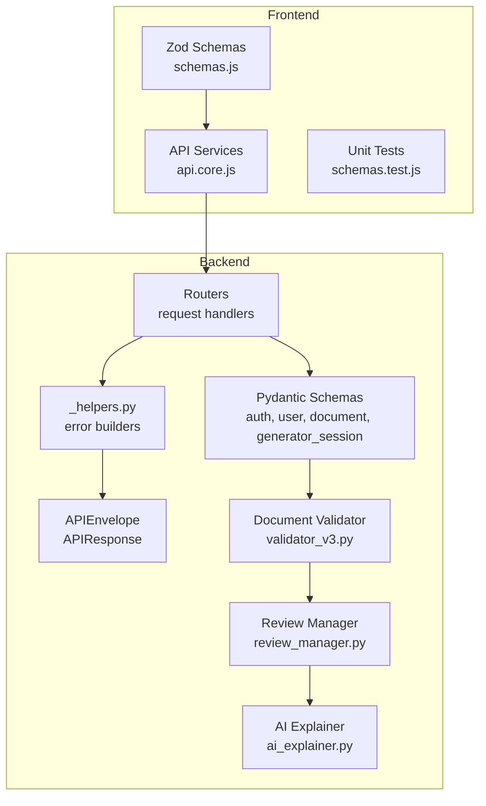
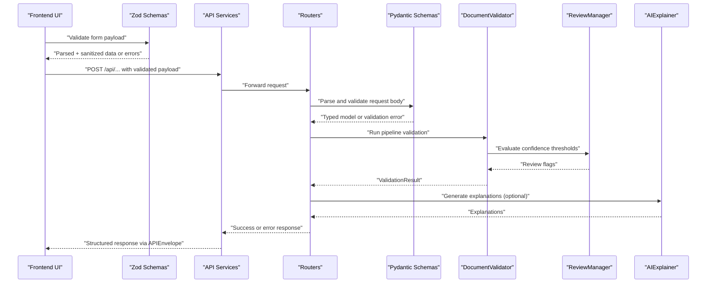
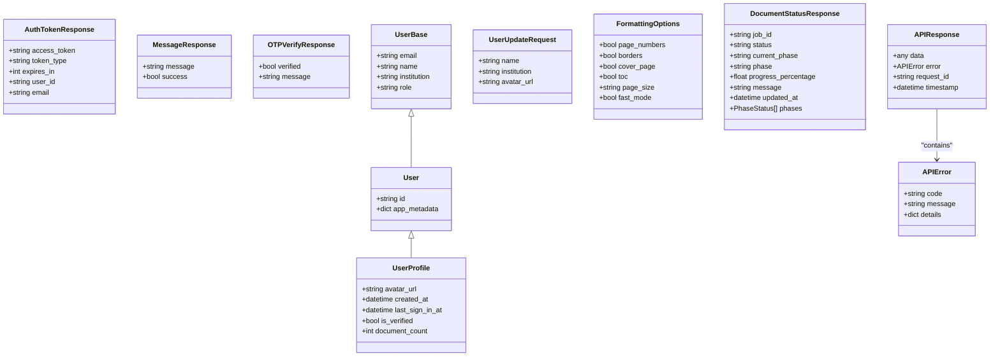
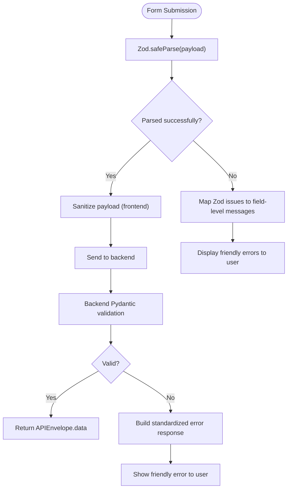
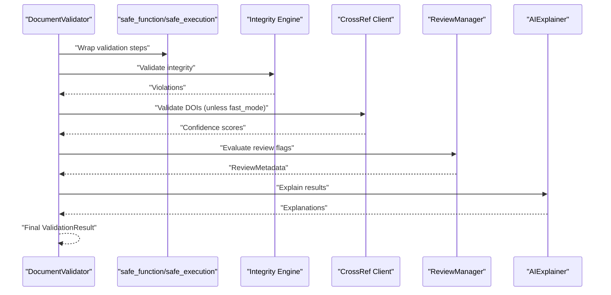
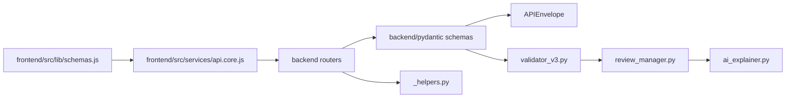

# Schema Validation & Type Safety

<cite>
**Referenced Files in This Document**
- [backend/app/schemas/__init__.py](file://backend/app/schemas/__init__.py)
- [backend/app/schemas/auth.py](file://backend/app/schemas/auth.py)
- [backend/app/schemas/user.py](file://backend/app/schemas/user.py)
- [backend/app/schemas/document.py](file://backend/app/schemas/document.py)
- [backend/app/schemas/generator_session.py](file://backend/app/schemas/generator_session.py)
- [backend/app/schemas/api_envelope.py](file://backend/app/schemas/api_envelope.py)
- [backend/app/routers/v1/_helpers.py](file://backend/app/routers/v1/_helpers.py)
- [backend/app/pipeline/validation/validator_v3.py](file://backend/app/pipeline/validation/validator_v3.py)
- [backend/app/pipeline/validation/review_manager.py](file://backend/app/pipeline/validation/review_manager.py)
- [backend/app/pipeline/validation/ai_explainer.py](file://backend/app/pipeline/validation/ai_explainer.py)
- [backend/app/pipeline/safety/validator_guard.py](file://backend/app/pipeline/safety/validator_guard.py)
- [frontend/src/lib/schemas.js](file://frontend/src/lib/schemas.js)
- [frontend/src/lib/schemas.test.js](file://frontend/src/lib/schemas.test.js)
- [frontend/src/services/api.core.js](file://frontend/src/services/api.core.js)
</cite>

## Table of Contents
1. [Introduction](#introduction)
2. [Project Structure](#project-structure)
3. [Core Components](#core-components)
4. [Architecture Overview](#architecture-overview)
5. [Detailed Component Analysis](#detailed-component-analysis)
6. [Dependency Analysis](#dependency-analysis)
7. [Performance Considerations](#performance-considerations)
8. [Troubleshooting Guide](#troubleshooting-guide)
9. [Conclusion](#conclusion)
10. [Appendices](#appendices)

## Introduction
This document explains the schema validation implementation and type safety strategy used across the backend and frontend of the Automated Academic Docx Manuscript Formatter. It focuses on:
- Backend request/response schemas built with Pydantic v2
- Frontend form validation using Zod
- Error handling and response envelopes
- Validation patterns, conditional rules, and custom validators
- Type inference benefits and integration with TypeScript
- Testing strategies for schema validation
- Practical examples for form validation, API response parsing, and error message formatting

## Project Structure
The validation strategy spans two primary layers:
- Backend: Pydantic models define strict request/response contracts and enforce domain rules.
- Frontend: Zod schemas mirror backend constraints for client-side validation and user experience.

**Diagram sources**
- [backend/app/schemas/auth.py:32-79](file://backend/app/schemas/auth.py#L32-L79)
- [backend/app/schemas/user.py:15-67](file://backend/app/schemas/user.py#L15-L67)
- [backend/app/schemas/document.py:43-155](file://backend/app/schemas/document.py#L43-L155)
- [backend/app/schemas/generator_session.py:9-41](file://backend/app/schemas/generator_session.py#L9-L41)
- [backend/app/schemas/api_envelope.py:18-46](file://backend/app/schemas/api_envelope.py#L18-L46)
- [backend/app/routers/v1/_helpers.py:44-88](file://backend/app/routers/v1/_helpers.py#L44-L88)
- [backend/app/pipeline/validation/validator_v3.py:34-146](file://backend/app/pipeline/validation/validator_v3.py#L34-L146)
- [backend/app/pipeline/validation/review_manager.py:7-117](file://backend/app/pipeline/validation/review_manager.py#L7-L117)
- [backend/app/pipeline/validation/ai_explainer.py:3-47](file://backend/app/pipeline/validation/ai_explainer.py#L3-L47)
- [frontend/src/lib/schemas.js:1-235](file://frontend/src/lib/schemas.js#L1-L235)
- [frontend/src/services/api.core.js:83-133](file://frontend/src/services/api.core.js#L83-L133)
- [frontend/src/lib/schemas.test.js:1-133](file://frontend/src/lib/schemas.test.js#L1-L133)

**Section sources**
- [backend/app/schemas/__init__.py:12-85](file://backend/app/schemas/__init__.py#L12-L85)
- [frontend/src/lib/schemas.js:1-235](file://frontend/src/lib/schemas.js#L1-L235)

## Core Components
- Backend Pydantic Schemas:
  - Authentication: SignupRequest, LoginRequest, ForgotPasswordRequest, VerifyOTPRequest, ResetPasswordRequest, AuthTokenResponse, MessageResponse, OTPVerifyResponse
  - User: UserBase, User, UserProfile, UserUpdateRequest
  - Documents: FormattingOptions, DocumentUploadResponse, PhaseStatus, DocumentStatusResponse, DocumentBase, Document, DocumentListItem, DocumentListResponse, DocumentMetaSummary, DocumentPreviewResponse, DocumentCompareResponse, GenerationOptions, GenerateRequest, GenerateResponse, GenerateStatusResponse
  - Generator sessions: CreateSessionRequest, SessionResponse, MessageRequest, MessageResponse, StageEvent
  - API Envelope: APIResponse, APIError, success_response, error_response
- Frontend Zod Schemas:
  - User profile, authentication, settings, upload/start, feedback, agent session, synthesis session, generator start
  - Utilities: getFirstZodError
- Validation orchestration:
  - DocumentValidator pipeline with safe execution wrappers
  - ReviewManager threshold-based flags
  - AIExplainer for friendly explanations
- Error handling helpers:
  - build_error_response and http_exception_to_response
  - Frontend sanitization and friendly error extraction

**Section sources**
- [backend/app/schemas/auth.py:32-165](file://backend/app/schemas/auth.py#L32-L165)
- [backend/app/schemas/user.py:15-67](file://backend/app/schemas/user.py#L15-L67)
- [backend/app/schemas/document.py:43-266](file://backend/app/schemas/document.py#L43-L266)
- [backend/app/schemas/generator_session.py:9-41](file://backend/app/schemas/generator_session.py#L9-L41)
- [backend/app/schemas/api_envelope.py:9-46](file://backend/app/schemas/api_envelope.py#L9-L46)
- [frontend/src/lib/schemas.js:7-235](file://frontend/src/lib/schemas.js#L7-L235)
- [backend/app/pipeline/validation/validator_v3.py:34-146](file://backend/app/pipeline/validation/validator_v3.py#L34-L146)
- [backend/app/pipeline/validation/review_manager.py:7-117](file://backend/app/pipeline/validation/review_manager.py#L7-L117)
- [backend/app/pipeline/validation/ai_explainer.py:3-47](file://backend/app/pipeline/validation/ai_explainer.py#L3-L47)
- [backend/app/routers/v1/_helpers.py:44-88](file://backend/app/routers/v1/_helpers.py#L44-L88)
- [frontend/src/services/api.core.js:83-133](file://frontend/src/services/api.core.js#L83-L133)

## Architecture Overview
The system enforces validation at the boundaries:
- Frontend validates user input with Zod before sending requests.
- Backend validates incoming requests with Pydantic and returns structured responses via APIEnvelope.
- Pipeline stages apply domain-specific validations with graceful failure handling.
- Error responses are standardized and surfaced consistently to the client.

**Diagram sources**
- [frontend/src/lib/schemas.js:31-57](file://frontend/src/lib/schemas.js#L31-L57)
- [frontend/src/services/api.core.js:83-133](file://frontend/src/services/api.core.js#L83-L133)
- [backend/app/schemas/api_envelope.py:18-46](file://backend/app/schemas/api_envelope.py#L18-L46)
- [backend/app/pipeline/validation/validator_v3.py:68-146](file://backend/app/pipeline/validation/validator_v3.py#L68-L146)
- [backend/app/pipeline/validation/review_manager.py:29-117](file://backend/app/pipeline/validation/review_manager.py#L29-L117)
- [backend/app/pipeline/validation/ai_explainer.py:18-47](file://backend/app/pipeline/validation/ai_explainer.py#L18-L47)

## Detailed Component Analysis

### Backend Pydantic Schemas
- Authentication schemas enforce strong constraints (length limits, regex patterns, required booleans) and custom validators for password strength and term acceptance.
- User schemas separate safe base fields from full records and include optional metadata for profiles.
- Document schemas define enums for export formats, statuses, and templates, plus comprehensive upload/status/preview/compare models.
- Generator session schemas encapsulate multi-doc and agent chat flows with typed messages and outlines.
- APIEnvelope centralizes success/error payloads with request_id and timestamps.

**Diagram sources**
- [backend/app/schemas/auth.py:141-165](file://backend/app/schemas/auth.py#L141-L165)
- [backend/app/schemas/user.py:15-67](file://backend/app/schemas/user.py#L15-L67)
- [backend/app/schemas/document.py:43-155](file://backend/app/schemas/document.py#L43-L155)
- [backend/app/schemas/api_envelope.py:9-46](file://backend/app/schemas/api_envelope.py#L9-L46)

**Section sources**
- [backend/app/schemas/auth.py:32-165](file://backend/app/schemas/auth.py#L32-L165)
- [backend/app/schemas/user.py:15-67](file://backend/app/schemas/user.py#L15-L67)
- [backend/app/schemas/document.py:43-266](file://backend/app/schemas/document.py#L43-L266)
- [backend/app/schemas/generator_session.py:9-41](file://backend/app/schemas/generator_session.py#L9-L41)
- [backend/app/schemas/api_envelope.py:9-46](file://backend/app/schemas/api_envelope.py#L9-L46)

### Frontend Zod Schemas
- Zod mirrors backend constraints for signup, login, reset password, settings, upload/start, feedback, agent session, synthesis session, and generator start.
- Conditional validation uses superRefine to enforce metadata requirements based on doc_type.
- Custom refinements validate file sizes, extensions, and presence of required fields.
- Utility getFirstZodError extracts a concise user-facing message from Zod issues.

**Diagram sources**
- [frontend/src/lib/schemas.js:31-57](file://frontend/src/lib/schemas.js#L31-L57)
- [frontend/src/lib/schemas.js:201-231](file://frontend/src/lib/schemas.js#L201-L231)
- [frontend/src/lib/schemas.js:233-235](file://frontend/src/lib/schemas.js#L233-L235)
- [frontend/src/services/api.core.js:83-133](file://frontend/src/services/api.core.js#L83-L133)
- [backend/app/routers/v1/_helpers.py:44-88](file://backend/app/routers/v1/_helpers.py#L44-L88)

**Section sources**
- [frontend/src/lib/schemas.js:7-235](file://frontend/src/lib/schemas.js#L7-L235)
- [frontend/src/lib/schemas.test.js:1-133](file://frontend/src/lib/schemas.test.js#L1-L133)

### Validation Pipeline and Error Handling
- DocumentValidator runs multiple checks (sections, figures, references, tables, integrity, CrossRef) with safe_function wrappers to prevent crashes from aborting the pipeline.
- ReviewManager evaluates confidence thresholds and flags sections requiring review or critical attention.
- AIExplainer translates validation results into human-friendly explanations.
- Backend helpers build standardized error responses and convert HTTP exceptions to consistent envelopes.
- Frontend sanitization and friendly error extraction improve UX for network and server errors.

**Diagram sources**
- [backend/app/pipeline/validation/validator_v3.py:68-146](file://backend/app/pipeline/validation/validator_v3.py#L68-L146)
- [backend/app/pipeline/validation/review_manager.py:29-117](file://backend/app/pipeline/validation/review_manager.py#L29-L117)
- [backend/app/pipeline/validation/ai_explainer.py:18-47](file://backend/app/pipeline/validation/ai_explainer.py#L18-L47)
- [backend/app/pipeline/safety/validator_guard.py:33-50](file://backend/app/pipeline/safety/validator_guard.py#L33-L50)

**Section sources**
- [backend/app/pipeline/validation/validator_v3.py:34-277](file://backend/app/pipeline/validation/validator_v3.py#L34-L277)
- [backend/app/pipeline/validation/review_manager.py:7-117](file://backend/app/pipeline/validation/review_manager.py#L7-L117)
- [backend/app/pipeline/validation/ai_explainer.py:3-47](file://backend/app/pipeline/validation/ai_explainer.py#L3-L47)
- [backend/app/routers/v1/_helpers.py:44-88](file://backend/app/routers/v1/_helpers.py#L44-L88)
- [frontend/src/services/api.core.js:83-133](file://frontend/src/services/api.core.js#L83-L133)

## Dependency Analysis
- Frontend Zod schemas depend on backend schema semantics to maintain parity.
- Backend routers depend on Pydantic schemas for request parsing and on helpers for error formatting.
- Validation pipeline depends on integrity engines, clients, and managers; all guarded by safe execution decorators.
- APIEnvelope provides a uniform response shape across endpoints.

**Diagram sources**
- [frontend/src/lib/schemas.js:1-235](file://frontend/src/lib/schemas.js#L1-L235)
- [frontend/src/services/api.core.js:83-133](file://frontend/src/services/api.core.js#L83-L133)
- [backend/app/schemas/api_envelope.py:18-46](file://backend/app/schemas/api_envelope.py#L18-L46)
- [backend/app/routers/v1/_helpers.py:44-88](file://backend/app/routers/v1/_helpers.py#L44-L88)
- [backend/app/pipeline/validation/validator_v3.py:34-146](file://backend/app/pipeline/validation/validator_v3.py#L34-L146)
- [backend/app/pipeline/validation/review_manager.py:7-117](file://backend/app/pipeline/validation/review_manager.py#L7-L117)
- [backend/app/pipeline/validation/ai_explainer.py:3-47](file://backend/app/pipeline/validation/ai_explainer.py#L3-L47)

**Section sources**
- [backend/app/schemas/__init__.py:12-85](file://backend/app/schemas/__init__.py#L12-L85)
- [backend/app/schemas/api_envelope.py:18-46](file://backend/app/schemas/api_envelope.py#L18-L46)
- [backend/app/routers/v1/_helpers.py:44-88](file://backend/app/routers/v1/_helpers.py#L44-L88)

## Performance Considerations
- Fast mode toggles optional validations (e.g., skipping DOI checks) to reduce latency.
- Safe execution wrappers prevent cascading failures and degrade gracefully.
- Threshold-based review flags minimize manual review overhead while preserving quality.
- Frontend sanitization reduces unnecessary server round trips by catching obvious client-side errors early.

[No sources needed since this section provides general guidance]

## Troubleshooting Guide
- Backend error responses:
  - Use build_error_response and http_exception_to_response to ensure consistent error payloads with code, message, and optional details.
  - Extract friendly messages on the frontend using getFriendlyErrorMessage and sanitize server error details.
- Frontend sanitization:
  - sanitizePayload removes control characters and trims sensitive inputs; apply to all outgoing payloads.
- Validation guard:
  - Validator Guard logs missing keys and returns safe defaults to protect downstream consumers.

**Section sources**
- [backend/app/routers/v1/_helpers.py:44-88](file://backend/app/routers/v1/_helpers.py#L44-L88)
- [frontend/src/services/api.core.js:83-133](file://frontend/src/services/api.core.js#L83-L133)
- [backend/app/pipeline/safety/validator_guard.py:33-50](file://backend/app/pipeline/safety/validator_guard.py#L33-L50)

## Conclusion
The system achieves robust type safety and validation by aligning frontend Zod schemas with backend Pydantic models, enforcing strict request/response contracts, and applying layered validation in the pipeline. Standardized error envelopes and friendly error extraction improve reliability and user experience. Safe execution and threshold-based review further strengthen resilience and quality control.

[No sources needed since this section summarizes without analyzing specific files]

## Appendices

### Example Workflows

- Form validation (frontend)
  - Use Zod schemas to validate user input before submission.
  - Map Zod issues to field-level messages and show getFirstZodError for fallback.
  - Reference: [frontend/src/lib/schemas.js:31-57](file://frontend/src/lib/schemas.js#L31-L57), [frontend/src/lib/schemas.js:233-235](file://frontend/src/lib/schemas.js#L233-L235)

- API response parsing (backend)
  - Build APIResponse with success_response or error_response.
  - Reference: [backend/app/schemas/api_envelope.py:31-46](file://backend/app/schemas/api_envelope.py#L31-L46)

- Error message formatting (frontend)
  - Extract friendly messages from server responses and handle network errors.
  - Reference: [frontend/src/services/api.core.js:83-133](file://frontend/src/services/api.core.js#L83-L133)

- Testing strategies
  - Validate Zod schemas with Vitest assertions for positive and negative cases.
  - Reference: [frontend/src/lib/schemas.test.js:1-133](file://frontend/src/lib/schemas.test.js#L1-L133)