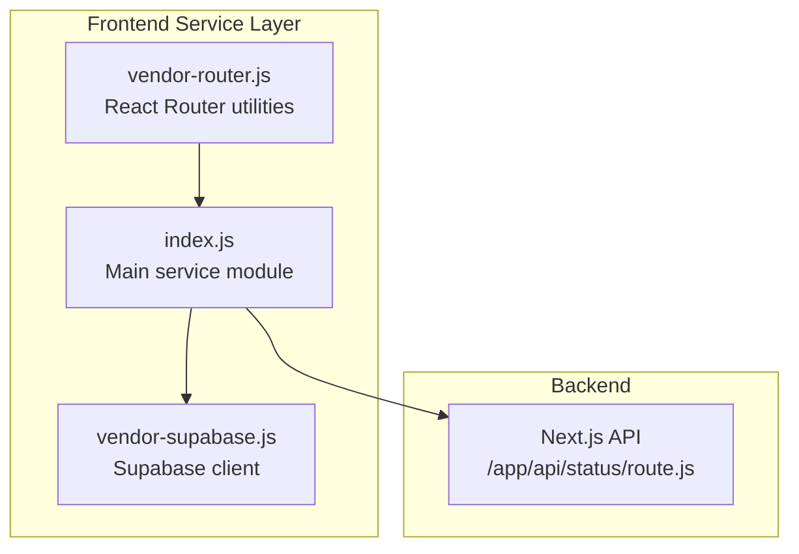
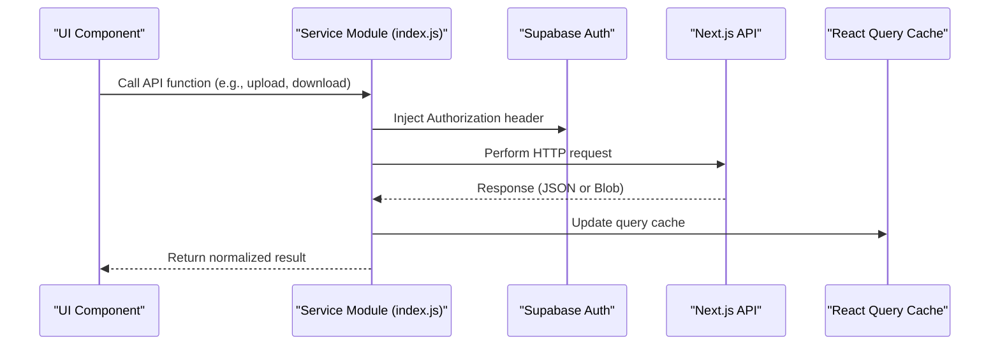
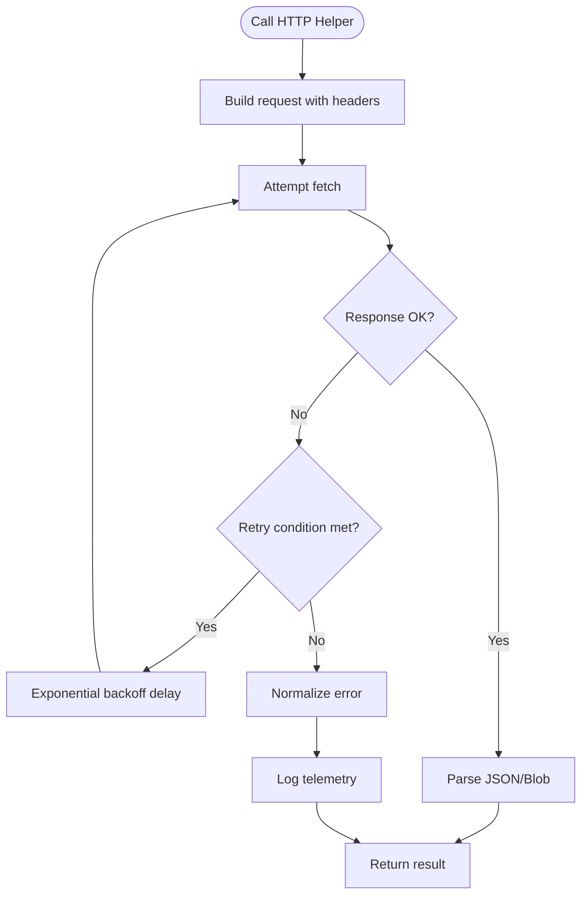
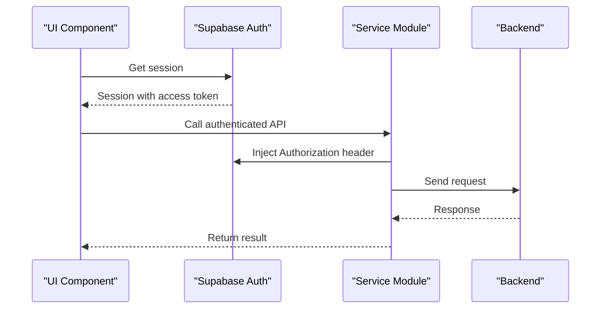
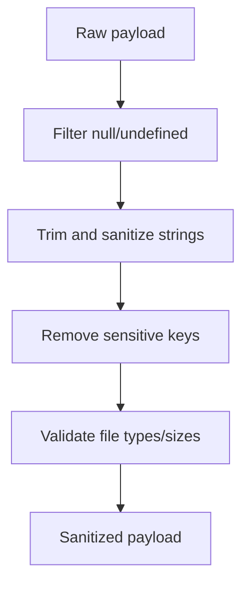
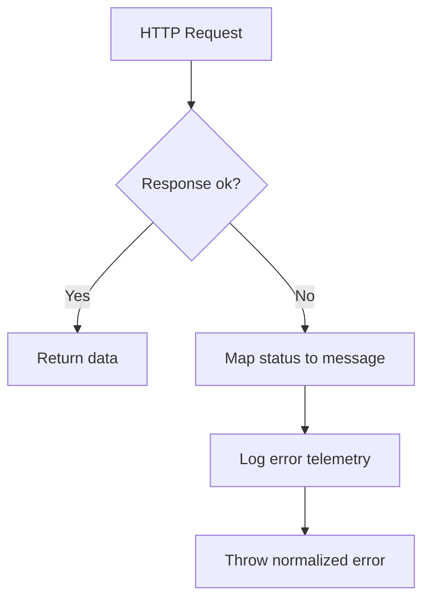
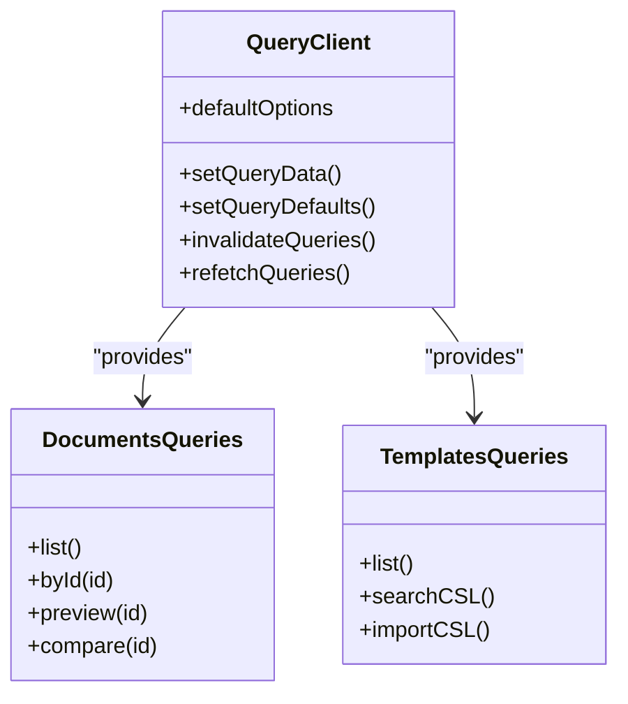
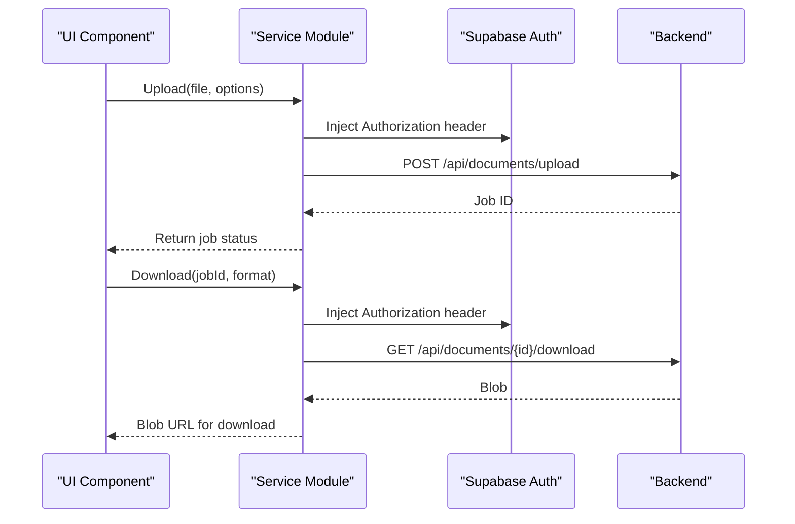
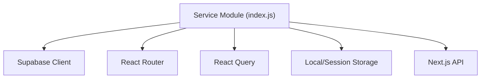

# Service Layer Implementation

<cite>
**Referenced Files in This Document**
- [index.js](file://frontend/dist/assets/index-J_KwUon_.js)
- [vendor-router.js](file://frontend/dist/assets/vendor-router-naU-wgR8.js)
- [vendor-supabase.js](file://frontend/dist/assets/vendor-supabase-CZ7auGd3.js)
- [route.js](file://frontend/app/api/status/route.js)
</cite>

## Table of Contents
1. [Introduction](#introduction)
2. [Project Structure](#project-structure)
3. [Core Components](#core-components)
4. [Architecture Overview](#architecture-overview)
5. [Detailed Component Analysis](#detailed-component-analysis)
6. [Dependency Analysis](#dependency-analysis)
7. [Performance Considerations](#performance-considerations)
8. [Troubleshooting Guide](#troubleshooting-guide)
9. [Conclusion](#conclusion)

## Introduction
This document describes the frontend service layer architecture used by the application. It focuses on the API service patterns, request/response handling, error management, caching, retry mechanisms, and integration with React Query for state management. The service layer centralizes HTTP communication, authentication headers, payload sanitization, and robust error reporting.

## Project Structure
The service layer is implemented as a cohesive module that exports a set of typed API functions and React Query hooks. It integrates with Supabase for authentication and with a Next.js API for health checks and metrics. The module exposes:
- HTTP client helpers for GET/POST/DELETE with retry and debounced requests
- Authentication-aware fetch wrappers
- Payload sanitization utilities
- React Query hooks for document and template operations
- Error normalization and logging
- Integration points for Supabase Auth and Realtime

**Diagram sources**
- [index.js:1-200](file://frontend/dist/assets/index-J_KwUon_.js#L1-L200)
- [vendor-router.js:66-120](file://frontend/dist/assets/vendor-router-naU-wgR8.js#L66-L120)
- [vendor-supabase.js:1-120](file://frontend/dist/assets/vendor-supabase-CZ7auGd3.js#L1-L120)
- [route.js:1-20](file://frontend/app/api/status/route.js#L1-L20)

**Section sources**
- [index.js:1-200](file://frontend/dist/assets/index-J_KwUon_.js#L1-L200)
- [vendor-router.js:66-120](file://frontend/dist/assets/vendor-router-naU-wgR8.js#L66-L120)
- [vendor-supabase.js:1-120](file://frontend/dist/assets/vendor-supabase-CZ7auGd3.js#L1-L120)
- [route.js:1-20](file://frontend/app/api/status/route.js#L1-L20)

## Core Components
The service layer centers around a primary module exporting:
- HTTP helpers: `_`, `Z`, `C`, `$`, `X`
- Upload helpers: `Ot`, `It`
- Document operations: `te`, `vt`, `Ae`, `Rt`, `Ct`, `At`, `Dt`, `De`, `Lt`
- Template operations: `Mt`, `Ht`, `Bt`, `Nt`, `zt`
- Auth operations: `Le`, `Ne`, `ze`, `$e`, `Ue`
- Metrics and health: `Vt`, `qt`, `Gt`
- React Query integration: `vt`, `Rt`, `Ct`, `At`, `Rt`
- Utilities: `ee`, `Re`, `Ce`, `k`, `Q`, `Oe`, `M`

Key responsibilities:
- Centralized HTTP client with retry/backoff and exponential backoff
- Authentication header injection via Supabase session
- Request debouncing for frequent polling endpoints
- Payload sanitization and validation helpers
- Error normalization and telemetry logging
- React Query defaults and caching strategies

**Section sources**
- [index.js:1-200](file://frontend/dist/assets/index-J_KwUon_.js#L1-L200)

## Architecture Overview
The service layer composes several libraries and utilities:
- Supabase client for authentication and session management
- React Router for navigation and route handling
- React Query for caching, refetching, and state synchronization
- Local storage/session storage for hydration and persistence
- Next.js API routes for backend health and metrics

**Diagram sources**
- [index.js:1-200](file://frontend/dist/assets/index-J_KwUon_.js#L1-L200)
- [vendor-supabase.js:1-120](file://frontend/dist/assets/vendor-supabase-CZ7auGd3.js#L1-L120)
- [route.js:1-20](file://frontend/app/api/status/route.js#L1-L20)

## Detailed Component Analysis

### HTTP Client and Retry Strategy
The service layer defines a robust HTTP client with:
- Exponential backoff retry for transient failures
- Network-aware retry conditions
- Timeout and cancellation support
- Error normalization and logging

**Diagram sources**
- [index.js:1-200](file://frontend/dist/assets/index-J_KwUon_.js#L1-L200)

**Section sources**
- [index.js:1-200](file://frontend/dist/assets/index-J_KwUon_.js#L1-L200)

### Authentication and Authorization
Authentication is handled centrally:
- Supabase session retrieval and access token injection
- Automatic Authorization header addition to outgoing requests
- Auth state change listeners for real-time updates
- Sign-in/sign-out flows and OTP verification

**Diagram sources**
- [index.js:1-200](file://frontend/dist/assets/index-J_KwUon_.js#L1-L200)
- [vendor-supabase.js:1-120](file://frontend/dist/assets/vendor-supabase-CZ7auGd3.js#L1-L120)

**Section sources**
- [index.js:1-200](file://frontend/dist/assets/index-J_KwUon_.js#L1-L200)
- [vendor-supabase.js:1-120](file://frontend/dist/assets/vendor-supabase-CZ7auGd3.js#L1-L120)

### Payload Sanitization and Validation
The service layer includes utilities for:
- Removing sensitive keys from payloads
- Normalizing strings and trimming whitespace
- Filtering out null/undefined values
- Validating file types and sizes for uploads

**Diagram sources**
- [index.js:1-200](file://frontend/dist/assets/index-J_KwUon_.js#L1-L200)

**Section sources**
- [index.js:1-200](file://frontend/dist/assets/index-J_KwUon_.js#L1-L200)

### Error Handling and Logging
Error handling follows a consistent pattern:
- Normalize HTTP errors and network failures
- Map common status codes to user-friendly messages
- Log frontend errors to backend metrics endpoint
- Surface meaningful errors to UI components

**Diagram sources**
- [index.js:1-200](file://frontend/dist/assets/index-J_KwUon_.js#L1-L200)

**Section sources**
- [index.js:1-200](file://frontend/dist/assets/index-J_KwUon_.js#L1-L200)

### React Query Integration and Caching
React Query is configured globally with:
- Default staleTime and refetchOnWindowFocus behavior
- Retry configuration for queries
- Query builders for documents, templates, and status
- Debounced polling for long-running jobs

**Diagram sources**
- [index.js:1-200](file://frontend/dist/assets/index-J_KwUon_.js#L1-L200)

**Section sources**
- [index.js:1-200](file://frontend/dist/assets/index-J_KwUon_.js#L1-L200)

### Upload and Download Workflows
Upload and download operations include:
- Chunked upload support for large files
- Progress callbacks for upload status
- Blob downloads with automatic URL revocation
- Format validation for download targets

**Diagram sources**
- [index.js:1-200](file://frontend/dist/assets/index-J_KwUon_.js#L1-L200)

**Section sources**
- [index.js:1-200](file://frontend/dist/assets/index-J_KwUon_.js#L1-L200)

### Health Checks and Metrics
Health checks and metrics endpoints:
- Health status polling via Next.js API
- Metrics dashboard and database health endpoints
- Error logging to backend metrics

**Section sources**
- [route.js:1-20](file://frontend/app/api/status/route.js#L1-L20)
- [index.js:1-200](file://frontend/dist/assets/index-J_KwUon_.js#L1-L200)

## Dependency Analysis
The service layer depends on:
- Supabase for authentication and session management
- React Router for navigation and route handling
- React Query for caching and state management
- Local/session storage for hydration and persistence
- Next.js API routes for backend integration

**Diagram sources**
- [index.js:1-200](file://frontend/dist/assets/index-J_KwUon_.js#L1-L200)
- [vendor-supabase.js:1-120](file://frontend/dist/assets/vendor-supabase-CZ7auGd3.js#L1-L120)
- [vendor-router.js:66-120](file://frontend/dist/assets/vendor-router-naU-wgR8.js#L66-L120)
- [route.js:1-20](file://frontend/app/api/status/route.js#L1-L20)

**Section sources**
- [index.js:1-200](file://frontend/dist/assets/index-J_KwUon_.js#L1-L200)
- [vendor-supabase.js:1-120](file://frontend/dist/assets/vendor-supabase-CZ7auGd3.js#L1-L120)
- [vendor-router.js:66-120](file://frontend/dist/assets/vendor-router-naU-wgR8.js#L66-L120)
- [route.js:1-20](file://frontend/app/api/status/route.js#L1-L20)

## Performance Considerations
- Use React Query’s staleTime to minimize redundant network calls
- Enable retry with exponential backoff for transient failures
- Debounce frequent polling endpoints to reduce load
- Utilize chunked uploads for large files to improve reliability
- Cache blobs and revoke URLs promptly to free memory

## Troubleshooting Guide
Common issues and resolutions:
- Authentication errors: Verify session validity and re-authenticate if needed
- Network failures: Inspect retry logs and adjust retry configuration
- Upload/download failures: Validate file types, sizes, and format parameters
- Polling errors: Confirm job IDs and endpoint availability
- Error telemetry: Use backend metrics to diagnose service issues

**Section sources**
- [index.js:1-200](file://frontend/dist/assets/index-J_KwUon_.js#L1-L200)

## Conclusion
The frontend service layer provides a robust, centralized foundation for API interactions. It encapsulates authentication, error handling, retry logic, and React Query integration, enabling scalable and maintainable frontend development. The architecture supports efficient caching, reliable uploads/downloads, and seamless integration with backend services.