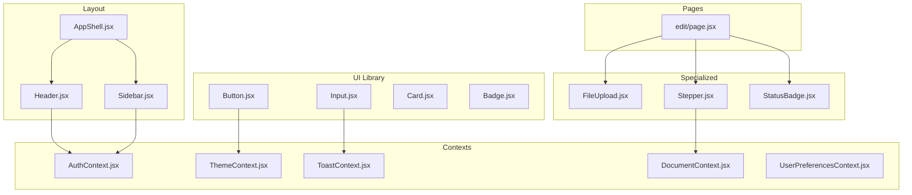
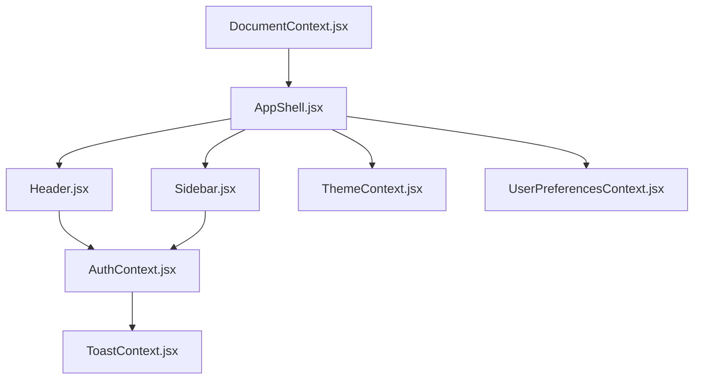
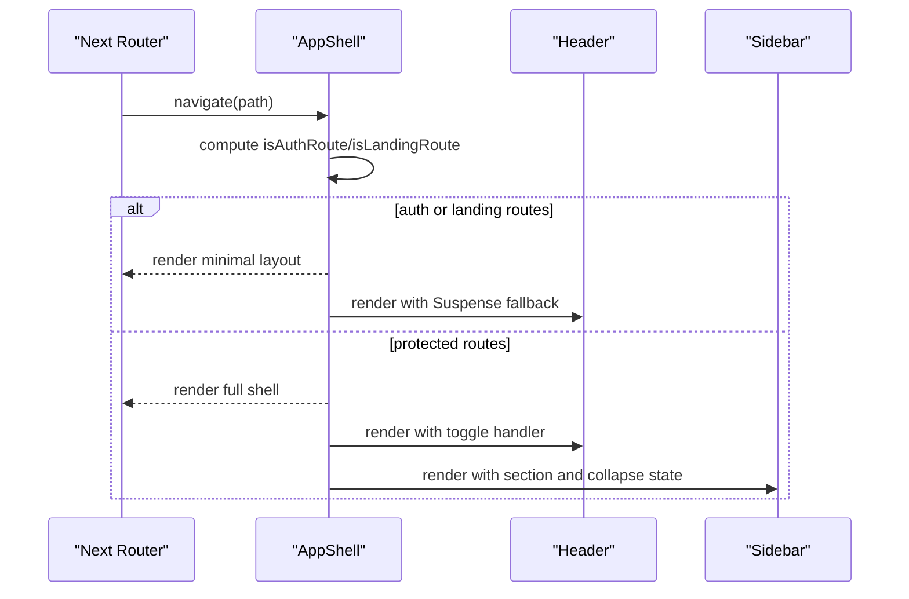
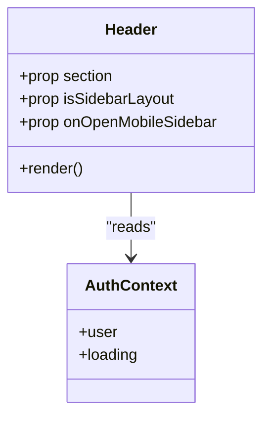
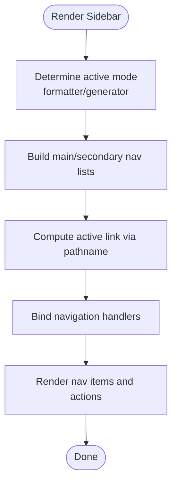
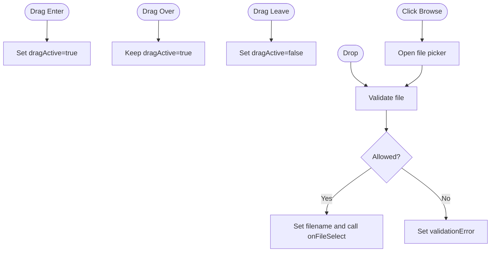
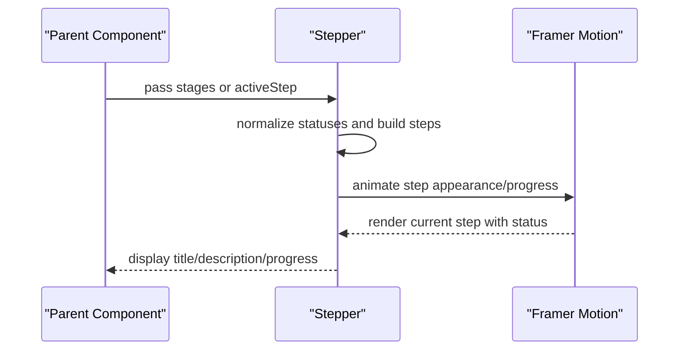
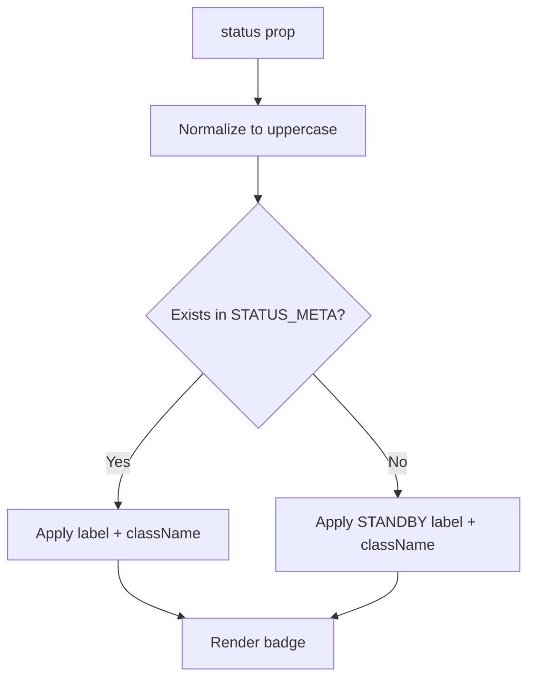
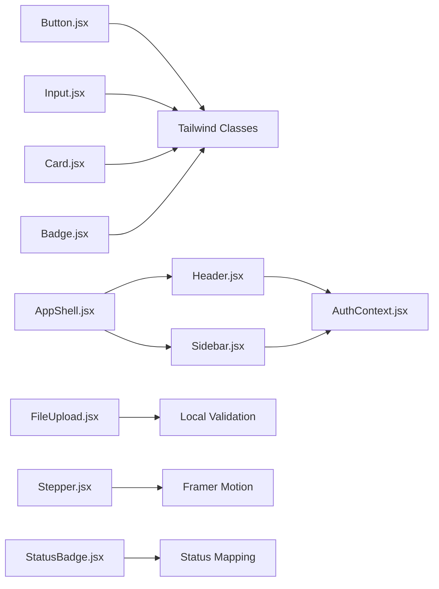

# Component Architecture

<cite>
**Referenced Files in This Document**
- [Button.jsx](file://frontend/src/components/ui/Button.jsx)
- [Input.jsx](file://frontend/src/components/ui/Input.jsx)
- [Card.jsx](file://frontend/src/components/ui/Card.jsx)
- [Badge.jsx](file://frontend/src/components/ui/Badge.jsx)
- [AppShell.jsx](file://frontend/src/components/layout/AppShell.jsx)
- [Header.jsx](file://frontend/src/components/layout/Header.jsx)
- [Sidebar.jsx](file://frontend/src/components/layout/Sidebar.jsx)
- [FileUpload.jsx](file://frontend/src/components/FileUpload.jsx)
- [Stepper.jsx](file://frontend/src/components/Stepper.jsx)
- [StatusBadge.jsx](file://frontend/src/components/StatusBadge.jsx)
- [FeedbackForm.jsx](file://frontend/src/components/FeedbackForm.jsx)
- [page.jsx](file://frontend/app/(formatter)/edit/page.jsx)
- [index.js](file://frontend/src/components/ui/index.js)
- [tailwind.config.js](file://frontend/tailwind.config.js)
- [globals.css](file://frontend/app/globals.css)
- [AuthContext.jsx](file://frontend/src/context/AuthContext.jsx)
- [ThemeContext.jsx](file://frontend/src/context/ThemeContext.jsx)
- [ToastContext.jsx](file://frontend/src/context/ToastContext.jsx)
- [DocumentContext.jsx](file://frontend/src/context/DocumentContext.jsx)
- [UserPreferencesContext.jsx](file://frontend/src/context/UserPreferencesContext.jsx)
- [useGeneratorState.js](file://frontend/coverage/components/generate/_components/useGeneratorState.js)
- [StatusBadge.test.jsx](file://frontend/src/test/StatusBadge.test.jsx)
- [ErrorBoundary.jsx](file://frontend/src/components/ErrorBoundary.jsx)
- [AuthGuard.test.jsx](file://frontend/src/test/AppShell.auth-redirect.test.jsx)
- [Footer.test.jsx](file://frontend/src/test/Footer.test.jsx)
- [Header.auth-state.test.jsx](file://frontend/src/test/Header.auth-state.test.jsx)
- [AuthContext.initialization.test.jsx](file://frontend/src/test/AuthContext.initialization.test.jsx)
- [ErrorBoundary.test.jsx](file://frontend/src/test/ErrorBoundary.test.jsx)
</cite>

## Table of Contents
1. [Introduction](#introduction)
2. [Project Structure](#project-structure)
3. [Core Components](#core-components)
4. [Architecture Overview](#architecture-overview)
5. [Detailed Component Analysis](#detailed-component-analysis)
6. [Dependency Analysis](#dependency-analysis)
7. [Performance Considerations](#performance-considerations)
8. [Troubleshooting Guide](#troubleshooting-guide)
9. [Conclusion](#conclusion)
10. [Appendices](#appendices)

## Introduction
This document describes the component architecture and UI component library for the frontend of the Automated Academic Manuscript Formatter. It focuses on reusable UI components (Button, Input, Card, Badge), layout components (AppShell, Header, Sidebar), and specialized components (FileUpload, Stepper, StatusBadge). It explains composition patterns, prop interfaces, styling via TailwindCSS, form validation patterns, accessibility, state management, event handling, testing strategies, and reusability.

## Project Structure
The UI component library is organized under frontend/src/components with two primary categories:
- ui: reusable atomic components (Button, Input, Card, Badge)
- layout: shell and navigation scaffolding (AppShell, Header, Sidebar)
- specialized: domain-specific components (FileUpload, Stepper, StatusBadge)
- contexts: shared application state (Auth, Theme, Toast, Document, UserPreferences)
- pages: route-level compositions integrating components

**Diagram sources**
- [AppShell.jsx:12-161](file://frontend/src/components/layout/AppShell.jsx#L12-L161)
- [Header.jsx:29-101](file://frontend/src/components/layout/Header.jsx#L29-L101)
- [Sidebar.jsx:62-192](file://frontend/src/components/layout/Sidebar.jsx#L62-L192)
- [Button.jsx:23-55](file://frontend/src/components/ui/Button.jsx#L23-L55)
- [Input.jsx:7-47](file://frontend/src/components/ui/Input.jsx#L7-L47)
- [Card.jsx:7-23](file://frontend/src/components/ui/Card.jsx#L7-L23)
- [Badge.jsx:14-30](file://frontend/src/components/ui/Badge.jsx#L14-L30)
- [FileUpload.jsx:23-109](file://frontend/src/components/FileUpload.jsx#L23-L109)
- [Stepper.jsx:24-166](file://frontend/src/components/Stepper.jsx#L24-L166)
- [StatusBadge.jsx:36-45](file://frontend/src/components/StatusBadge.jsx#L36-L45)
- [AuthContext.jsx](file://frontend/src/context/AuthContext.jsx)
- [ThemeContext.jsx](file://frontend/src/context/ThemeContext.jsx)
- [ToastContext.jsx](file://frontend/src/context/ToastContext.jsx)
- [DocumentContext.jsx](file://frontend/src/context/DocumentContext.jsx)
- [UserPreferencesContext.jsx](file://frontend/src/context/UserPreferencesContext.jsx)
- [page.jsx](file://frontend/app/(formatter)/edit/page.jsx#L301-L316)

**Section sources**
- [index.js:1-8](file://frontend/src/components/ui/index.js#L1-L8)
- [tailwind.config.js](file://frontend/tailwind.config.js)
- [globals.css](file://frontend/app/globals.css)

## Core Components
Reusable UI components provide consistent styling and behavior across the application. They are built with forwardRef, Tailwind classes, and controlled by props.

- Button
  - Props: className, variant, size, loading, disabled, type, children, plus native button attributes
  - Variants: primary, secondary, danger
  - Sizes: sm, md, lg
  - Behavior: disables on loading, applies spinners, composes Tailwind classes
  - Accessibility: inherits native button semantics; disabled state managed internally
  - Example usage: [Button.jsx:23-55](file://frontend/src/components/ui/Button.jsx#L23-L55)

- Input
  - Props: className, label, error, helperText, id, plus native input attributes
  - Behavior: renders label, input, and either error or helper text; applies focus/error styles
  - Accessibility: associates label with input via htmlFor/id
  - Example usage: [Input.jsx:7-47](file://frontend/src/components/ui/Input.jsx#L7-L47)

- Card
  - Props: className, glass, children
  - Behavior: renders container with rounded borders; supports glassmorphism mode
  - Example usage: [Card.jsx:7-23](file://frontend/src/components/ui/Card.jsx#L7-L23)

- Badge
  - Props: className, status, children
  - Statuses: completed, failed, processing, pending
  - Behavior: maps status to color classes; defaults to pending
  - Example usage: [Badge.jsx:14-30](file://frontend/src/components/ui/Badge.jsx#L14-L30)

Styling approach
- Tailwind utilities compose component classes; variants and sizes are maps keyed by prop values
- Dark mode support via dark: prefixes
- Utility class composition helper merges optional overrides

**Section sources**
- [Button.jsx:7-17](file://frontend/src/components/ui/Button.jsx#L7-L17)
- [Button.jsx:23-55](file://frontend/src/components/ui/Button.jsx#L23-L55)
- [Input.jsx:7-47](file://frontend/src/components/ui/Input.jsx#L7-L47)
- [Card.jsx:7-23](file://frontend/src/components/ui/Card.jsx#L7-L23)
- [Badge.jsx:7-12](file://frontend/src/components/ui/Badge.jsx#L7-L12)
- [Badge.jsx:14-30](file://frontend/src/components/ui/Badge.jsx#L14-L30)

## Architecture Overview
The layout system centers around AppShell, which orchestrates Header and Sidebar, and integrates with contexts for authentication, theme, and preferences. Pages compose specialized components for workflows like editing and formatting.

**Diagram sources**
- [AppShell.jsx:12-161](file://frontend/src/components/layout/AppShell.jsx#L12-L161)
- [Header.jsx:29-101](file://frontend/src/components/layout/Header.jsx#L29-L101)
- [Sidebar.jsx:62-192](file://frontend/src/components/layout/Sidebar.jsx#L62-L192)
- [AuthContext.jsx](file://frontend/src/context/AuthContext.jsx)
- [ThemeContext.jsx](file://frontend/src/context/ThemeContext.jsx)
- [ToastContext.jsx](file://frontend/src/context/ToastContext.jsx)
- [DocumentContext.jsx](file://frontend/src/context/DocumentContext.jsx)
- [UserPreferencesContext.jsx](file://frontend/src/context/UserPreferencesContext.jsx)

## Detailed Component Analysis

### Layout Components

#### AppShell
- Responsibilities
  - Manages sidebar visibility and breakpoints
  - Handles auth route gating and redirects
  - Provides glassmorphic header and background layers
  - Suspense-fallback for Header rendering
- State and effects
  - Tracks desktop/mobile sidebar open/collapsed states
  - Media query listener updates desktop flag
  - Redirects authenticated users away from landing page
- Composition
  - Conditionally renders full shell vs minimal header-only layout
  - Passes toggle handler to Header; passes section to Header/Sidebar
- Accessibility
  - Focus management via tabindex on main content
  - Suspense fallback ensures header skeleton during hydration

**Diagram sources**
- [AppShell.jsx:12-161](file://frontend/src/components/layout/AppShell.jsx#L12-L161)
- [Header.jsx:29-101](file://frontend/src/components/layout/Header.jsx#L29-L101)
- [Sidebar.jsx:62-192](file://frontend/src/components/layout/Sidebar.jsx#L62-L192)

**Section sources**
- [AppShell.jsx:12-161](file://frontend/src/components/layout/AppShell.jsx#L12-L161)

#### Header
- Responsibilities
  - Renders logo and navigation actions
  - Provides theme toggle, notifications, settings, and user menu
  - Computes dashboard link based on section and user role
- Interactions
  - Uses AuthContext for user state
  - Exposes onOpenMobileSidebar callback to AppShell
- Accessibility
  - Uses aria-labels for interactive elements
  - Ensures keyboard navigable controls

**Diagram sources**
- [Header.jsx:29-101](file://frontend/src/components/layout/Header.jsx#L29-L101)
- [AuthContext.jsx](file://frontend/src/context/AuthContext.jsx)

**Section sources**
- [Header.jsx:29-101](file://frontend/src/components/layout/Header.jsx#L29-L101)

#### Sidebar
- Responsibilities
  - Renders navigation items grouped by main and secondary sections
  - Supports mode switching between formatter and generator
  - Handles sign out and guest mode behavior
- Active link detection
  - Uses pathname and alias prefixes to highlight active nav items
- Accessibility
  - Uses buttons for navigation items with titles for collapsed mode
  - Keyboard-friendly interactions

**Diagram sources**
- [Sidebar.jsx:62-192](file://frontend/src/components/layout/Sidebar.jsx#L62-L192)

**Section sources**
- [Sidebar.jsx:62-192](file://frontend/src/components/layout/Sidebar.jsx#L62-L192)

### Specialized Components

#### FileUpload
- Purpose
  - Drag-and-drop file selection with validation
  - Supported formats and size limits
- Validation
  - Checks extension and size; sets validation error state
- UX
  - Visual feedback for drag state and selected file
  - Button to trigger native file picker

**Diagram sources**
- [FileUpload.jsx:23-109](file://frontend/src/components/FileUpload.jsx#L23-L109)

**Section sources**
- [FileUpload.jsx:23-109](file://frontend/src/components/FileUpload.jsx#L23-L109)

#### Stepper
- Purpose
  - Visualize multi-step processing with statuses and optional progress
- Modes
  - Accepts backend stages with normalized status mapping
  - Fallback to static steps with activeStep index
- Animation
  - Uses motion/AnimatePresence for smooth transitions
  - Progress bars and status icons per step

**Diagram sources**
- [Stepper.jsx:24-166](file://frontend/src/components/Stepper.jsx#L24-L166)

**Section sources**
- [Stepper.jsx:24-166](file://frontend/src/components/Stepper.jsx#L24-L166)

#### StatusBadge
- Purpose
  - Display normalized status with consistent color classes
- Normalization
  - Uppercases and trims input; falls back to STANDBY
- Usage
  - Suitable for job status, validation results, and pipeline states

**Diagram sources**
- [StatusBadge.jsx:36-45](file://frontend/src/components/StatusBadge.jsx#L36-L45)

**Section sources**
- [StatusBadge.jsx:36-45](file://frontend/src/components/StatusBadge.jsx#L36-L45)

### Form Components and Validation Patterns
- Input component
  - Supports label, error, and helperText for inline validation messaging
  - Applies focus and error border classes based on error prop
  - Example integration: [Input.jsx:7-47](file://frontend/src/components/ui/Input.jsx#L7-L47)
- FeedbackForm
  - Demonstrates async submission, error/success states, and controlled resets
  - Keyboard shortcut handling for submission
  - Example integration: [FeedbackForm.jsx:30-54](file://frontend/src/components/FeedbackForm.jsx#L30-L54)
- Page-level validation banner
  - Conditional rendering of success/warning banners with icons and messages
  - Example integration: [page.jsx](file://frontend/app/(formatter)/edit/page.jsx#L301-L316)

Accessibility considerations
- Associate labels with inputs via htmlFor/id
- Provide visible error text and helper text
- Use semantic buttons and proper aria-labels for interactive icons

**Section sources**
- [Input.jsx:7-47](file://frontend/src/components/ui/Input.jsx#L7-L47)
- [FeedbackForm.jsx:30-54](file://frontend/src/components/FeedbackForm.jsx#L30-L54)
- [page.jsx](file://frontend/app/(formatter)/edit/page.jsx#L301-L316)

### Component Composition Patterns
- ForwardRef pattern
  - All UI components expose refs for imperative focus and input targeting
  - Example: [Button.jsx:23-55](file://frontend/src/components/ui/Button.jsx#L23-L55), [Input.jsx:7-47](file://frontend/src/components/ui/Input.jsx#L7-L47)
- Prop-driven styling
  - Variants and sizes mapped to Tailwind classes
  - Example: [Button.jsx:7-17](file://frontend/src/components/ui/Button.jsx#L7-L17), [Card.jsx:7-23](file://frontend/src/components/ui/Card.jsx#L7-L23)
- Context integration
  - Layout components consume AuthContext for user state and navigation decisions
  - Example: [Header.jsx:29-101](file://frontend/src/components/layout/Header.jsx#L29-L101), [Sidebar.jsx:62-192](file://frontend/src/components/layout/Sidebar.jsx#L62-L192)

**Section sources**
- [Button.jsx:23-55](file://frontend/src/components/ui/Button.jsx#L23-L55)
- [Input.jsx:7-47](file://frontend/src/components/ui/Input.jsx#L7-L47)
- [Card.jsx:7-23](file://frontend/src/components/ui/Card.jsx#L7-L23)
- [Header.jsx:29-101](file://frontend/src/components/layout/Header.jsx#L29-L101)
- [Sidebar.jsx:62-192](file://frontend/src/components/layout/Sidebar.jsx#L62-L192)

### State Management and Event Handling
- AppShell manages local state for sidebar toggles, desktop mode, and guest mode flags
- Header and Sidebar rely on AuthContext for user-aware navigation
- FileUpload maintains internal state for drag, filename, and validation errors
- Stepper receives external stage data or uses legacy activeStep

Integration points
- AuthContext drives navigation and guest/admin behavior
- ThemeContext influences visual themes across components
- ToastContext coordinates global notifications

**Section sources**
- [AppShell.jsx:12-161](file://frontend/src/components/layout/AppShell.jsx#L12-L161)
- [Header.jsx:29-101](file://frontend/src/components/layout/Header.jsx#L29-L101)
- [Sidebar.jsx:62-192](file://frontend/src/components/layout/Sidebar.jsx#L62-L192)
- [FileUpload.jsx:23-109](file://frontend/src/components/FileUpload.jsx#L23-L109)
- [Stepper.jsx:24-166](file://frontend/src/components/Stepper.jsx#L24-L166)

## Dependency Analysis
Component dependencies and coupling:
- UI components depend on Tailwind utilities and forwardRef
- Layout components depend on Next.js routing and contexts
- Specialized components encapsulate domain logic (validation, status mapping)
- Contexts provide decoupled state for auth, theme, and preferences

**Diagram sources**
- [Button.jsx:23-55](file://frontend/src/components/ui/Button.jsx#L23-L55)
- [Input.jsx:7-47](file://frontend/src/components/ui/Input.jsx#L7-L47)
- [Card.jsx:7-23](file://frontend/src/components/ui/Card.jsx#L7-L23)
- [Badge.jsx:14-30](file://frontend/src/components/ui/Badge.jsx#L14-L30)
- [AppShell.jsx:12-161](file://frontend/src/components/layout/AppShell.jsx#L12-L161)
- [Header.jsx:29-101](file://frontend/src/components/layout/Header.jsx#L29-L101)
- [Sidebar.jsx:62-192](file://frontend/src/components/layout/Sidebar.jsx#L62-L192)
- [FileUpload.jsx:23-109](file://frontend/src/components/FileUpload.jsx#L23-L109)
- [Stepper.jsx:24-166](file://frontend/src/components/Stepper.jsx#L24-L166)
- [StatusBadge.jsx:36-45](file://frontend/src/components/StatusBadge.jsx#L36-L45)

**Section sources**
- [index.js:1-8](file://frontend/src/components/ui/index.js#L1-L8)

## Performance Considerations
- Memoization
  - Header and Sidebar use memo to prevent unnecessary re-renders
  - Example: [Header.jsx:17-27](file://frontend/src/components/layout/Header.jsx#L17-L27), [Sidebar.jsx:62-192](file://frontend/src/components/layout/Sidebar.jsx#L62-L192)
- Animations
  - Stepper uses motion animations; keep steps count reasonable to avoid layout thrashing
- Rendering
  - AppShell conditionally renders full shell vs minimal layout to reduce DOM
  - Suspense fallbacks improve perceived performance during hydration

[No sources needed since this section provides general guidance]

## Troubleshooting Guide
Common issues and resolutions:
- Button disabled unexpectedly
  - Loading prop triggers disabled state; ensure loading is reset after async operation
  - Reference: [Button.jsx:36-37](file://frontend/src/components/ui/Button.jsx#L36-L37)
- Input label not associated with field
  - Provide id/name or pass explicit id to associate label
  - Reference: [Input.jsx:18-28](file://frontend/src/components/ui/Input.jsx#L18-L28)
- Sidebar navigation not updating active state
  - Verify pathname and alias prefixes; ensure isLinkActive logic matches routes
  - Reference: [Sidebar.jsx:37-45](file://frontend/src/components/layout/Sidebar.jsx#L37-L45)
- FileUpload not accepting files
  - Confirm supported extensions and size limits; check validationError messages
  - Reference: [FileUpload.jsx:3-5](file://frontend/src/components/FileUpload.jsx#L3-L5)
- Stepper not showing progress
  - Ensure stages include progress values; fallback mode requires activeStep updates
  - Reference: [Stepper.jsx:134-143](file://frontend/src/components/Stepper.jsx#L134-L143)
- StatusBadge not displaying expected label
  - Normalize status to uppercase; unknown statuses fall back to STANDBY
  - Reference: [StatusBadge.jsx:34-38](file://frontend/src/components/StatusBadge.jsx#L34-L38)

Testing strategies
- Unit tests for pure components (e.g., StatusBadge)
  - Reference: [StatusBadge.test.jsx](file://frontend/src/test/StatusBadge.test.jsx)
- Integration tests for layout and auth flows
  - References: [AuthGuard.test.jsx](file://frontend/src/test/AppShell.auth-redirect.test.jsx), [Header.auth-state.test.jsx](file://frontend/src/test/Header.auth-state.test.jsx), [AuthContext.initialization.test.jsx](file://frontend/src/test/AuthContext.initialization.test.jsx)
- Boundary and error handling
  - Reference: [ErrorBoundary.jsx](file://frontend/src/components/ErrorBoundary.jsx), [ErrorBoundary.test.jsx](file://frontend/src/test/ErrorBoundary.test.jsx)
- UI regression checks
  - References: [Footer.test.jsx](file://frontend/src/test/Footer.test.jsx)

**Section sources**
- [Button.jsx:36-37](file://frontend/src/components/ui/Button.jsx#L36-L37)
- [Input.jsx:18-28](file://frontend/src/components/ui/Input.jsx#L18-L28)
- [Sidebar.jsx:37-45](file://frontend/src/components/layout/Sidebar.jsx#L37-L45)
- [FileUpload.jsx:3-5](file://frontend/src/components/FileUpload.jsx#L3-L5)
- [Stepper.jsx:134-143](file://frontend/src/components/Stepper.jsx#L134-L143)
- [StatusBadge.jsx:34-38](file://frontend/src/components/StatusBadge.jsx#L34-L38)
- [StatusBadge.test.jsx](file://frontend/src/test/StatusBadge.test.jsx)
- [AuthGuard.test.jsx](file://frontend/src/test/AppShell.auth-redirect.test.jsx)
- [Header.auth-state.test.jsx](file://frontend/src/test/Header.auth-state.test.jsx)
- [AuthContext.initialization.test.jsx](file://frontend/src/test/AuthContext.initialization.test.jsx)
- [ErrorBoundary.jsx](file://frontend/src/components/ErrorBoundary.jsx)
- [ErrorBoundary.test.jsx](file://frontend/src/test/ErrorBoundary.test.jsx)
- [Footer.test.jsx](file://frontend/src/test/Footer.test.jsx)

## Conclusion
The component architecture emphasizes composability, consistent styling with Tailwind, and clear separation of concerns between layout, UI primitives, and specialized components. Contexts enable flexible state management without tight coupling. The design supports accessibility and performance through memoization, suspense fallbacks, and controlled animations. Extensive testing across unit, integration, and boundary scenarios ensures reliability.

[No sources needed since this section summarizes without analyzing specific files]

## Appendices

### Styling and Theming
- Tailwind configuration and global CSS define base styles and theme tokens
- Components apply dark mode variants using dark: prefixes
- Glassmorphism effects achieved via backdrop filters and translucent backgrounds

**Section sources**
- [tailwind.config.js](file://frontend/tailwind.config.js)
- [globals.css](file://frontend/app/globals.css)
- [AppShell.jsx:86-109](file://frontend/src/components/layout/AppShell.jsx#L86-L109)

### Component Index
- UI components exported for centralized imports
- Enables consistent usage across pages and modules

**Section sources**
- [index.js:1-8](file://frontend/src/components/ui/index.js#L1-L8)