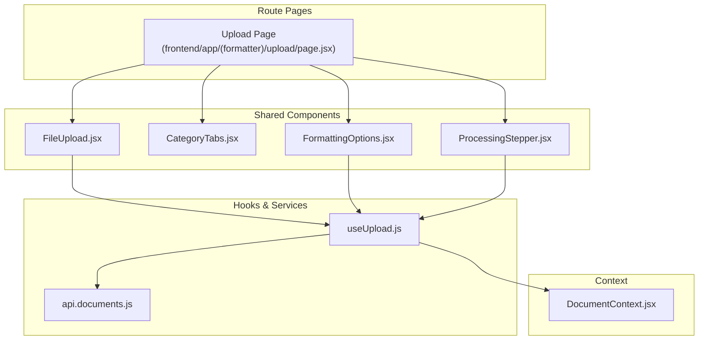
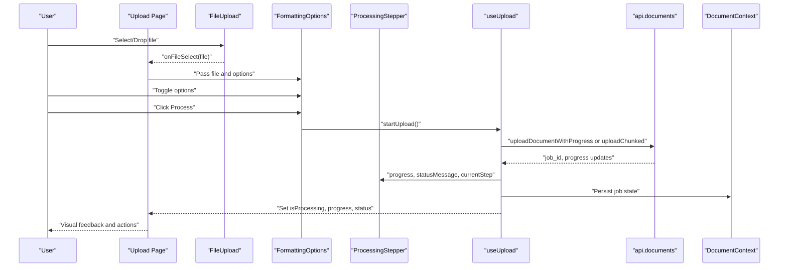
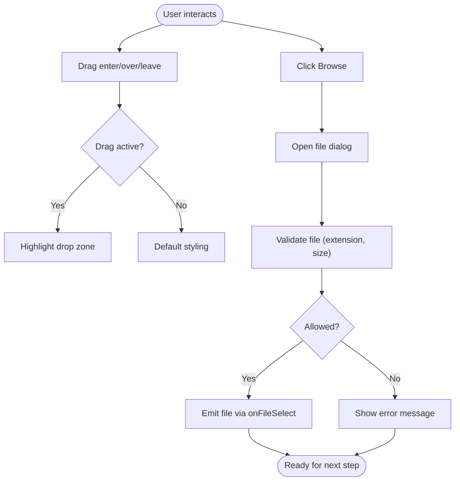
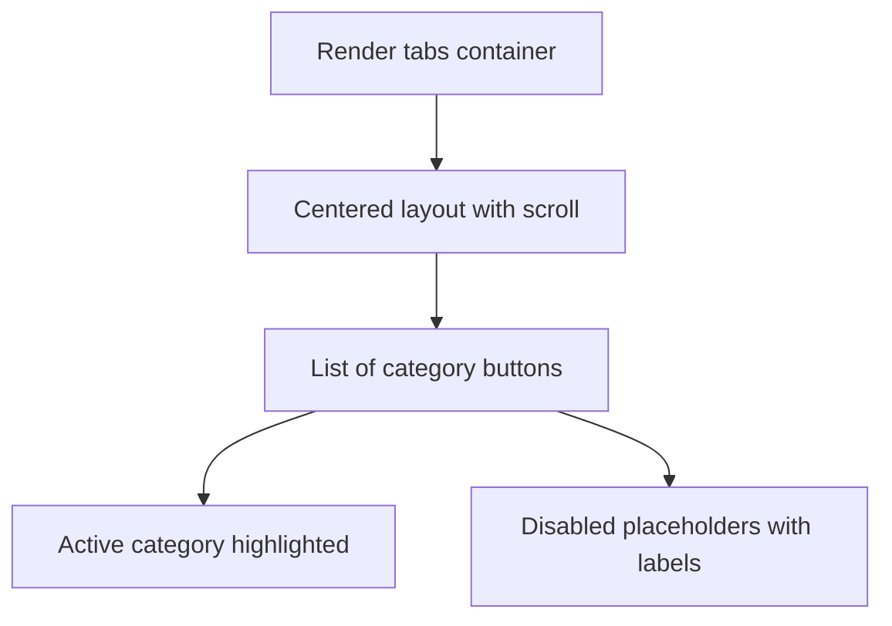
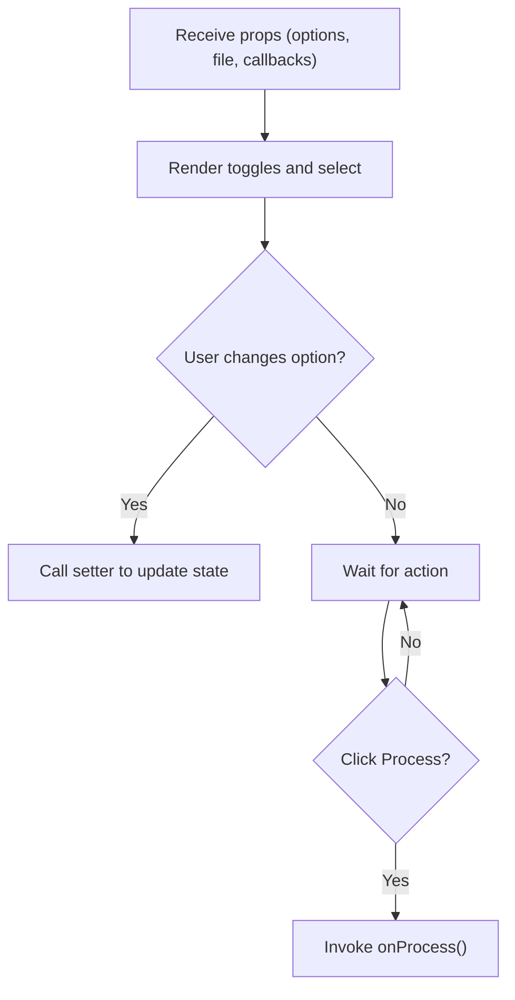
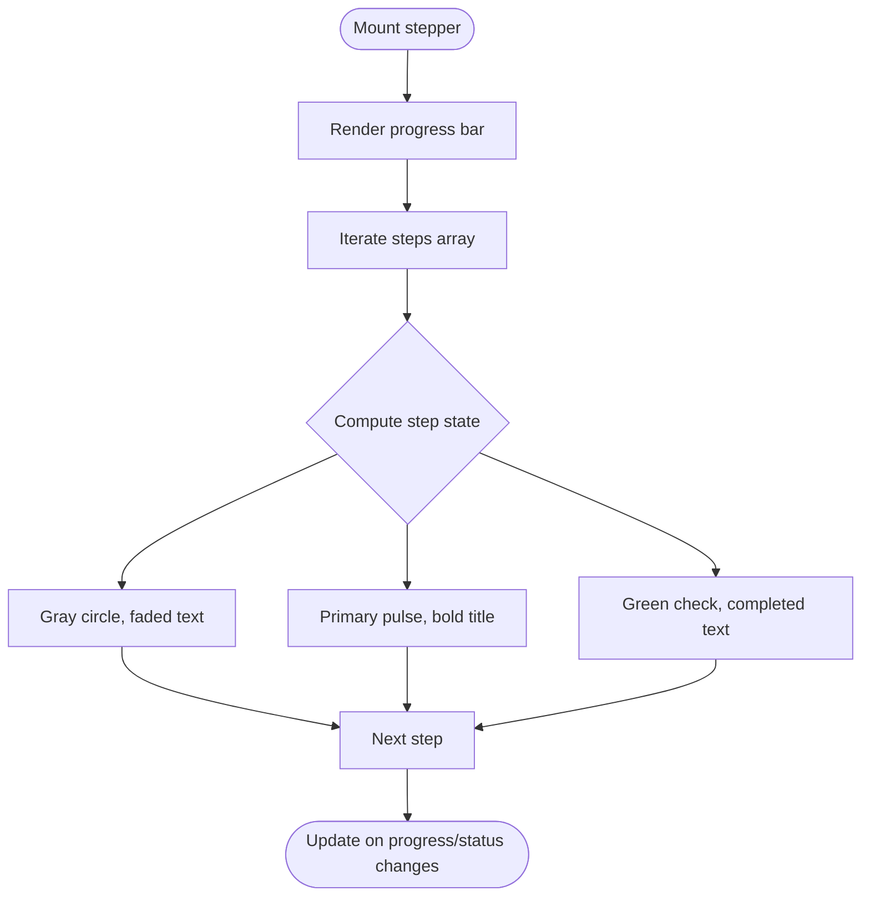
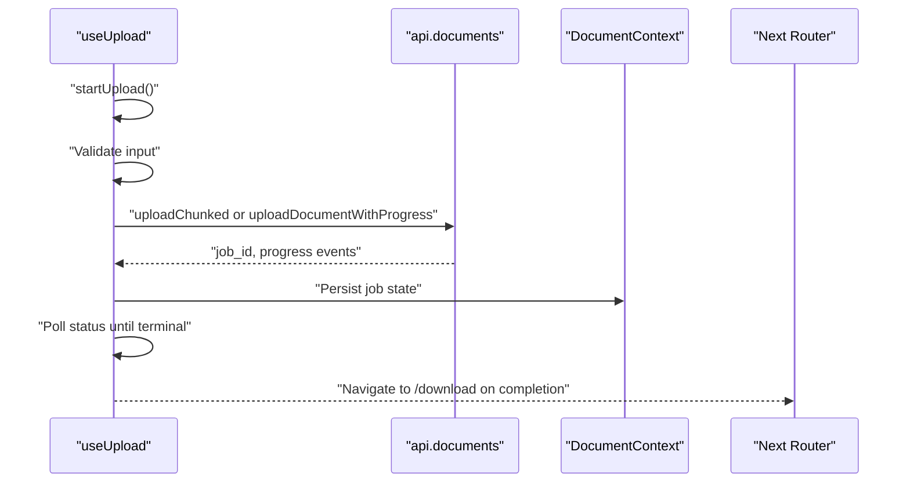
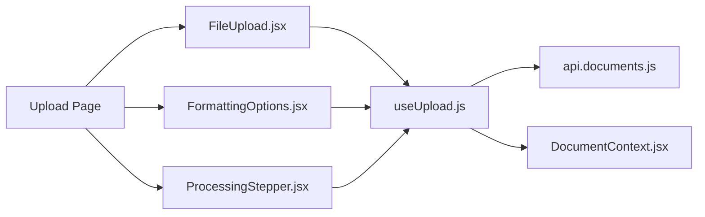

# Form Components

<cite>
**Referenced Files in This Document**
- [FileUpload.jsx](file://frontend/src/components/FileUpload.jsx)
- [CategoryTabs.jsx](file://frontend/src/components/upload/CategoryTabs.jsx)
- [FormattingOptions.jsx](file://frontend/src/components/upload/FormattingOptions.jsx)
- [ProcessingStepper.jsx](file://frontend/src/components/upload/ProcessingStepper.jsx)
- [useUpload.js](file://frontend/src/hooks/useUpload.js)
- [api.documents.js](file://frontend/src/services/api.documents.js)
- [DocumentContext.jsx](file://frontend/src/context/DocumentContext.jsx)
- [status.js](file://frontend/src/constants/status.js)
- [page.jsx](file://frontend/app/(formatter)/upload/page.jsx)
</cite>

## Table of Contents
1. [Introduction](#introduction)
2. [Project Structure](#project-structure)
3. [Core Components](#core-components)
4. [Architecture Overview](#architecture-overview)
5. [Detailed Component Analysis](#detailed-component-analysis)
6. [Dependency Analysis](#dependency-analysis)
7. [Performance Considerations](#performance-considerations)
8. [Troubleshooting Guide](#troubleshooting-guide)
9. [Conclusion](#conclusion)
10. [Appendices](#appendices)

## Introduction
This document explains the form and input components used in the document upload and processing workflow. It focuses on:
- FileUpload with drag-and-drop and file selection
- CategoryTabs for document type selection
- FormattingOptions for processing preferences
- ProcessingStepper for multi-step workflow visibility

It also covers validation patterns, error handling, user feedback, state management, asynchronous operations, and integration with backend APIs. Accessibility, internationalization, and responsive design considerations are included.

## Project Structure
The upload and processing UI is organized under the frontend application routes and shared components:
- Route pages orchestrate the workflow (e.g., upload page)
- Shared components encapsulate UI logic (FileUpload, CategoryTabs, FormattingOptions, ProcessingStepper)
- Hooks centralize async state and API interactions (useUpload)
- Services define backend integration (api.documents)
- Context manages global document state (DocumentContext)

**Diagram sources**
- [page.jsx](file://frontend/app/(formatter)/upload/page.jsx)
- [FileUpload.jsx](file://frontend/src/components/FileUpload.jsx)
- [CategoryTabs.jsx](file://frontend/src/components/upload/CategoryTabs.jsx)
- [FormattingOptions.jsx](file://frontend/src/components/upload/FormattingOptions.jsx)
- [ProcessingStepper.jsx](file://frontend/src/components/upload/ProcessingStepper.jsx)
- [useUpload.js](file://frontend/src/hooks/useUpload.js)
- [api.documents.js](file://frontend/src/services/api.documents.js)
- [DocumentContext.jsx](file://frontend/src/context/DocumentContext.jsx)

**Section sources**
- [page.jsx](file://frontend/app/(formatter)/upload/page.jsx)

## Core Components
This section introduces each component’s role and primary props/functions.

- FileUpload
  - Purpose: Accepts a single file via click or drag-and-drop, validates supported formats and size, and emits the selected file to parent handlers.
  - Key props: onFileSelect callback
  - Validation: Extension whitelist and size threshold
  - Feedback: Visual state (drag active, selected file), error message, and button label change

- CategoryTabs
  - Purpose: Allows selecting document categories; currently exposes “Documents” and placeholders for “Resume” and “Portfolio”
  - Interaction: Buttons for categories; disabled placeholders indicate upcoming features

- FormattingOptions
  - Purpose: Configures processing preferences (page numbers, borders, cover page, TOC, page size) and initiates processing
  - Key props: addPageNumbers, setAddPageNumbers, addBorders, setAddBorders, addCoverPage, setAddCoverPage, generateTOC, setGenerateTOC, pageSize, setPageSize, isProcessing, progress, file, onProcess
  - Behavior: Disables controls during processing or when complete; triggers onProcess to start workflow

- ProcessingStepper
  - Purpose: Visualizes multi-step processing status, progress percentage, and live status messages
  - Key props: isProcessing, progress, statusMessage, currentStep, steps

**Section sources**
- [FileUpload.jsx](file://frontend/src/components/FileUpload.jsx)
- [CategoryTabs.jsx](file://frontend/src/components/upload/CategoryTabs.jsx)
- [FormattingOptions.jsx](file://frontend/src/components/upload/FormattingOptions.jsx)
- [ProcessingStepper.jsx](file://frontend/src/components/upload/ProcessingStepper.jsx)

## Architecture Overview
The upload and processing flow integrates UI components with a custom hook that manages async operations and state synchronization with the backend.

**Diagram sources**
- [page.jsx](file://frontend/app/(formatter)/upload/page.jsx)
- [FileUpload.jsx](file://frontend/src/components/FileUpload.jsx)
- [FormattingOptions.jsx](file://frontend/src/components/upload/FormattingOptions.jsx)
- [ProcessingStepper.jsx](file://frontend/src/components/upload/ProcessingStepper.jsx)
- [useUpload.js](file://frontend/src/hooks/useUpload.js)
- [api.documents.js](file://frontend/src/services/api.documents.js)
- [DocumentContext.jsx](file://frontend/src/context/DocumentContext.jsx)

## Detailed Component Analysis

### FileUpload Component
- Drag-and-drop handling: Tracks drag state and applies visual feedback; prevents default browser behavior on drag events
- File selection: Uses hidden input to trigger native selection; validates against accepted extensions and size limits
- Validation: Checks extension presence, non-empty size, and upper bound; sets localized error message
- User feedback: Shows selected filename, supported formats hint, and conditional error display; button text adapts to selection state

**Diagram sources**
- [FileUpload.jsx](file://frontend/src/components/FileUpload.jsx)

**Section sources**
- [FileUpload.jsx](file://frontend/src/components/FileUpload.jsx)

### CategoryTabs Component
- Purpose: Provides category selection UI with a centered horizontal layout and responsive width
- State: Exposes category state to parent; placeholders indicate upcoming categories
- Accessibility: Disabled buttons include aria-disabled attributes

**Diagram sources**
- [CategoryTabs.jsx](file://frontend/src/components/upload/CategoryTabs.jsx)

**Section sources**
- [CategoryTabs.jsx](file://frontend/src/components/upload/CategoryTabs.jsx)

### FormattingOptions Component
- Controls: Toggles for page numbers, borders, cover page, TOC; dropdown for page size; a process button
- State binding: Two-way binding to parent state via setters; disabled when processing or complete
- Actions: Calls onProcess to start workflow; integrates with useUpload hook for validation and upload initiation

**Diagram sources**
- [FormattingOptions.jsx](file://frontend/src/components/upload/FormattingOptions.jsx)

**Section sources**
- [FormattingOptions.jsx](file://frontend/src/components/upload/FormattingOptions.jsx)

### ProcessingStepper Component
- Progress bar: Reflects percentage with smooth transitions
- Steps: Renders step indicators with distinct states (pending, active, completed)
- Status messaging: Displays live status messages and final completion notice
- Sticky positioning: Remains visible while scrolling for long documents

**Diagram sources**
- [ProcessingStepper.jsx](file://frontend/src/components/upload/ProcessingStepper.jsx)

**Section sources**
- [ProcessingStepper.jsx](file://frontend/src/components/upload/ProcessingStepper.jsx)

### useUpload Hook: State Management and Async Operations
- Responsibilities:
  - Manage file selection, processing state, progress, current step, and status messages
  - Integrate with backend APIs for upload and status polling
  - Persist and hydrate active job state in session storage
  - Provide cancellation and retry logic
  - Enforce quota checks and validation before upload
- Key behaviors:
  - Validates upload start with a schema; surfaces first validation error
  - Chooses chunked or single upload based on file size and authentication
  - Adjusts polling interval dynamically based on pipeline phase
  - Handles terminal states (completed, failed) and navigates to results
  - Emits analytics events for upload lifecycle

**Diagram sources**
- [useUpload.js](file://frontend/src/hooks/useUpload.js)
- [api.documents.js](file://frontend/src/services/api.documents.js)
- [DocumentContext.jsx](file://frontend/src/context/DocumentContext.jsx)

**Section sources**
- [useUpload.js](file://frontend/src/hooks/useUpload.js)
- [api.documents.js](file://frontend/src/services/api.documents.js)
- [DocumentContext.jsx](file://frontend/src/context/DocumentContext.jsx)
- [status.js](file://frontend/src/constants/status.js)

## Dependency Analysis
- Component-to-hook coupling:
  - FileUpload delegates file selection to parent via onFileSelect; parent coordinates with useUpload
  - FormattingOptions delegates processing initiation to parent; parent invokes useUpload.startUpload
  - ProcessingStepper receives derived state from useUpload and displays progress
- Hook-to-service coupling:
  - useUpload orchestrates uploads and status polling via api.documents
- Context integration:
  - DocumentContext persists and hydrates job state; useUpload writes to and reads from it

**Diagram sources**
- [FileUpload.jsx](file://frontend/src/components/FileUpload.jsx)
- [FormattingOptions.jsx](file://frontend/src/components/upload/FormattingOptions.jsx)
- [ProcessingStepper.jsx](file://frontend/src/components/upload/ProcessingStepper.jsx)
- [useUpload.js](file://frontend/src/hooks/useUpload.js)
- [api.documents.js](file://frontend/src/services/api.documents.js)
- [DocumentContext.jsx](file://frontend/src/context/DocumentContext.jsx)
- [page.jsx](file://frontend/app/(formatter)/upload/page.jsx)

**Section sources**
- [useUpload.js](file://frontend/src/hooks/useUpload.js)
- [api.documents.js](file://frontend/src/services/api.documents.js)
- [DocumentContext.jsx](file://frontend/src/context/DocumentContext.jsx)
- [page.jsx](file://frontend/app/(formatter)/upload/page.jsx)

## Performance Considerations
- Upload strategies:
  - Chunked upload is automatically selected for large files when authenticated, reducing memory pressure and enabling resumability
  - Single upload with progress reporting supports smaller files efficiently
- Polling intervals:
  - Dynamic intervals reduce unnecessary requests during early phases and increase frequency near completion
- Debouncing:
  - Preview and comparison endpoints use debounced requests to avoid redundant calls during rapid user interactions
- Rendering:
  - Memoized components prevent unnecessary re-renders for static UI elements

[No sources needed since this section provides general guidance]

## Troubleshooting Guide
- File validation errors:
  - Symptom: Error message appears after selecting unsupported file
  - Cause: Extension not in accepted list or file size exceeds limit
  - Resolution: Select a supported format within the size limit
  - Section sources
    - [FileUpload.jsx](file://frontend/src/components/FileUpload.jsx)
- Upload failures:
  - Symptom: Failure message after retries
  - Causes: Network error, server-side rejection, or aborted request
  - Resolution: Retry, check connectivity, or cancel and restart
  - Section sources
    - [useUpload.js](file://frontend/src/hooks/useUpload.js)
    - [api.documents.js](file://frontend/src/services/api.documents.js)
- Processing stuck or slow:
  - Symptom: Steady progress or delayed status updates
  - Causes: Large file chunking, heavy processing phase, or network latency
  - Resolution: Allow time for completion; monitor status messages
  - Section sources
    - [useUpload.js](file://frontend/src/hooks/useUpload.js)
    - [ProcessingStepper.jsx](file://frontend/src/components/upload/ProcessingStepper.jsx)
- Navigation to results:
  - Symptom: No automatic redirect after completion
  - Cause: Terminal state handling or router issues
  - Resolution: Verify completion state and manual navigation to results/download
  - Section sources
    - [useUpload.js](file://frontend/src/hooks/useUpload.js)
    - [page.jsx](file://frontend/app/(formatter)/upload/page.jsx)

## Conclusion
The form and input components provide a cohesive, accessible, and responsive upload and processing experience. They integrate tightly with a robust hook that manages async operations, validation, and state synchronization with backend services. Users receive clear feedback through visual indicators, progress bars, and status messages, while developers benefit from modular components and well-defined APIs.

[No sources needed since this section summarizes without analyzing specific files]

## Appendices

### Accessibility Features
- Focus management: Interactive elements (buttons, toggles, selects) remain keyboard accessible
- ARIA attributes: Disabled buttons include aria-disabled for screen readers
- Visual contrast: Dark mode variants maintain readability and contrast
- Live regions: Status messages update dynamically for assistive technologies

[No sources needed since this section provides general guidance]

### Internationalization Support
- Text strings are rendered as-is; no i18n library is imported in the analyzed components
- Recommendation: Extract UI strings into translation keys and load locale-specific resources for multi-language support

[No sources needed since this section provides general guidance]

### Responsive Design Considerations
- Flexible layouts: Components adapt widths and spacing across breakpoints
- Scrollable containers: Category tabs enable horizontal scrolling on small screens
- Sticky stepper: Processing panel remains visible while scrolling long pages

[No sources needed since this section provides general guidance]