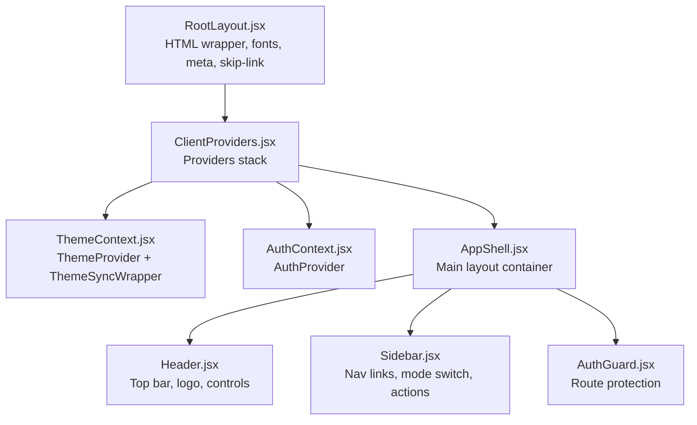
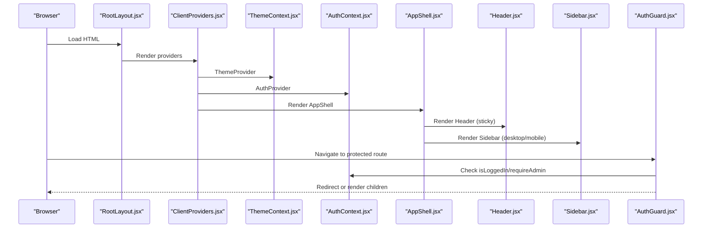
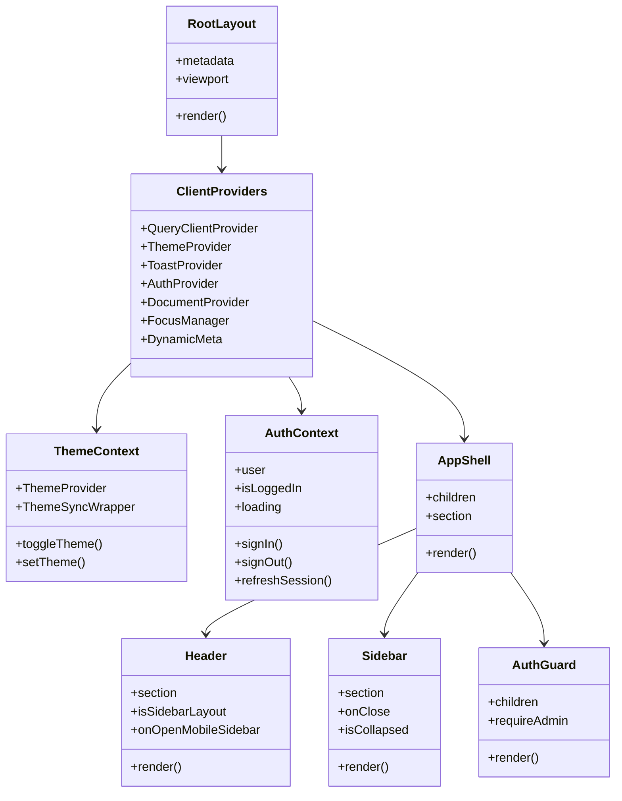
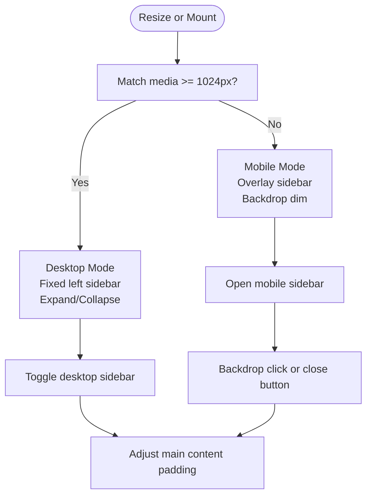
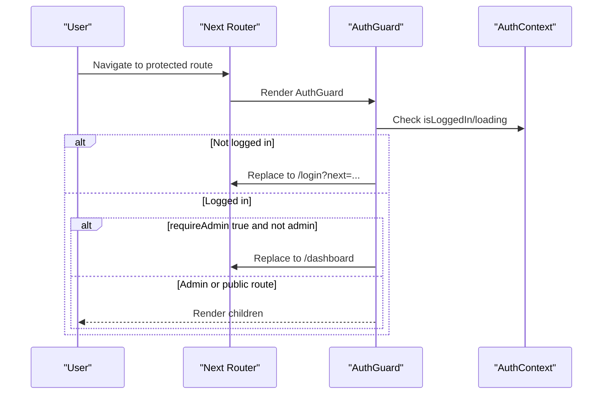
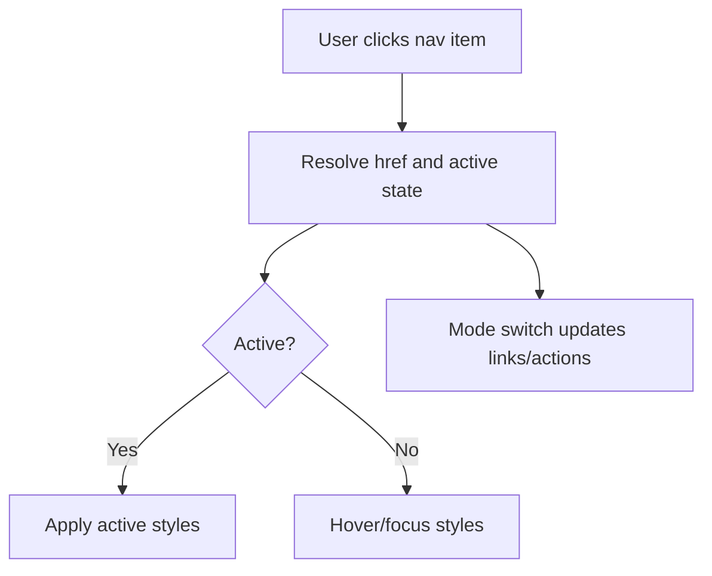
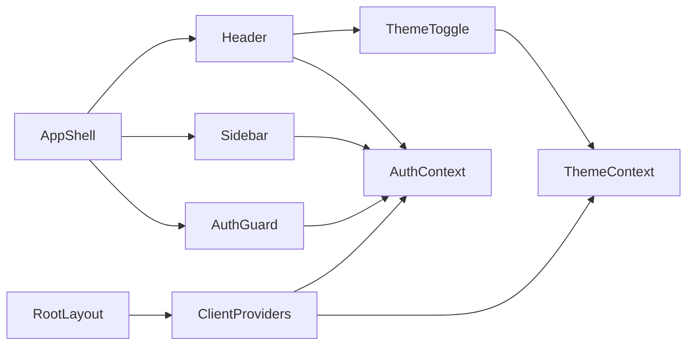

# Layout Components

<cite>
**Referenced Files in This Document**
- [AppShell.jsx](file://frontend/src/components/layout/AppShell.jsx)
- [Header.jsx](file://frontend/src/components/layout/Header.jsx)
- [Sidebar.jsx](file://frontend/src/components/layout/Sidebar.jsx)
- [AuthGuard.jsx](file://frontend/src/components/layout/AuthGuard.jsx)
- [ThemeContext.jsx](file://frontend/src/context/ThemeContext.jsx)
- [AuthContext.jsx](file://frontend/src/context/AuthContext.jsx)
- [ClientProviders.jsx](file://frontend/src/components/layout/ClientProviders.jsx)
- [RootLayout.jsx](file://frontend/app/layout.jsx)
- [ThemeToggle.jsx](file://frontend/src/components/layout/header/ThemeToggle.jsx)
</cite>

## Table of Contents
1. [Introduction](#introduction)
2. [Project Structure](#project-structure)
3. [Core Components](#core-components)
4. [Architecture Overview](#architecture-overview)
5. [Detailed Component Analysis](#detailed-component-analysis)
6. [Dependency Analysis](#dependency-analysis)
7. [Performance Considerations](#performance-considerations)
8. [Troubleshooting Guide](#troubleshooting-guide)
9. [Conclusion](#conclusion)

## Introduction
This document explains the layout and structural components that form the application shell and navigation framework. It focuses on:
- AppShell as the main container coordinating global layout, responsive behavior, and background theming
- Header with navigation and authentication controls
- Sidebar for primary navigation and actions
- AuthGuard for route protection and admin gating
It also covers component hierarchy, prop interfaces, integration patterns, responsive design, mobile navigation, accessibility, layout customization, theme integration, and state management coordination.

## Project Structure
The layout system is built around a client-side shell with providers for theme, auth, and state. The root HTML layout initializes fonts, meta tags, and accessibility helpers, while ClientProviders wraps the app with QueryClient, ThemeProvider, ToastProvider, AuthProvider, and DocumentProvider. AppShell composes Header and Sidebar, conditionally rendering them based on route contexts.

**Diagram sources**
- [RootLayout.jsx:32-84](file://frontend/app/layout.jsx#L32-L84)
- [ClientProviders.jsx:14-51](file://frontend/src/components/layout/ClientProviders.jsx#L14-L51)
- [ThemeContext.jsx:57-70](file://frontend/src/context/ThemeContext.jsx#L57-L70)
- [AuthContext.jsx:16-340](file://frontend/src/context/AuthContext.jsx#L16-L340)
- [AppShell.jsx:12-162](file://frontend/src/components/layout/AppShell.jsx#L12-L162)
- [Header.jsx:29-105](file://frontend/src/components/layout/Header.jsx#L29-L105)
- [Sidebar.jsx:62-196](file://frontend/src/components/layout/Sidebar.jsx#L62-L196)
- [AuthGuard.jsx:58-72](file://frontend/src/components/layout/AuthGuard.jsx#L58-L72)

**Section sources**
- [RootLayout.jsx:32-84](file://frontend/app/layout.jsx#L32-L84)
- [ClientProviders.jsx:14-51](file://frontend/src/components/layout/ClientProviders.jsx#L14-L51)

## Core Components
- AppShell: Central layout container that decides whether to show the sidebar layout or a minimal header-only layout. Handles responsive breakpoints, guest mode overrides, sidebar toggles, and background theming.
- Header: Top navigation bar with logo, theme toggle, notifications, settings, user profile or login/signup CTA, and optional mobile menu button.
- Sidebar: Collapsible navigation drawer with mode switching (formatter/generator), main and secondary links, action buttons, and sign out.
- AuthGuard: Route guard that redirects unauthenticated users to login with a next target, optionally restricts access to admins, and renders a loading spinner while session state resolves.

**Section sources**
- [AppShell.jsx:12-162](file://frontend/src/components/layout/AppShell.jsx#L12-L162)
- [Header.jsx:29-105](file://frontend/src/components/layout/Header.jsx#L29-L105)
- [Sidebar.jsx:62-196](file://frontend/src/components/layout/Sidebar.jsx#L62-L196)
- [AuthGuard.jsx:58-72](file://frontend/src/components/layout/AuthGuard.jsx#L58-L72)

## Architecture Overview
The layout architecture follows a layered pattern:
- Root HTML layer sets fonts, meta, and accessibility skip link
- Providers layer manages theme, auth, and global state
- AppShell composes Header and Sidebar and applies responsive behavior
- AuthGuard enforces permissions per route
- ThemeToggle integrates with ThemeContext for theme switching

**Diagram sources**
- [RootLayout.jsx:32-84](file://frontend/app/layout.jsx#L32-L84)
- [ClientProviders.jsx:14-51](file://frontend/src/components/layout/ClientProviders.jsx#L14-L51)
- [ThemeContext.jsx:57-70](file://frontend/src/context/ThemeContext.jsx#L57-L70)
- [AuthContext.jsx:16-340](file://frontend/src/context/AuthContext.jsx#L16-L340)
- [AppShell.jsx:12-162](file://frontend/src/components/layout/AppShell.jsx#L12-L162)
- [Header.jsx:29-105](file://frontend/src/components/layout/Header.jsx#L29-L105)
- [Sidebar.jsx:62-196](file://frontend/src/components/layout/Sidebar.jsx#L62-L196)
- [AuthGuard.jsx:58-72](file://frontend/src/components/layout/AuthGuard.jsx#L58-L72)

## Detailed Component Analysis

### AppShell
Responsibilities:
- Decide layout mode based on route (landing, auth, or sidebar-enabled)
- Manage desktop vs mobile sidebar visibility and collapse state
- Apply responsive breakpoint detection and adjust sidebar width
- Provide themed background and glassmorphism styling
- Handle guest mode override via query parameter
- Redirect authenticated users away from landing to dashboard

Key props:
- children: Page content to render inside main area
- section: Layout section hint ('shared' | 'formatter' | 'generator')

Responsive behavior:
- Desktop: Fixed left sidebar with expand/collapse animation
- Mobile: Slide-in overlay sidebar with backdrop dimming
- Breakpoint: 1024px triggers desktop behavior

Integration points:
- Uses AuthContext for isLoggedIn and loading state
- Uses Header and Sidebar components
- Applies theme-aware background gradients and glass classes

Accessibility:
- Focus management via skip-to-main-content link in RootLayout
- Proper focus order and keyboard navigation supported by child components

Customization examples:
- Modify sidebar width constants and header height to fit brand guidelines
- Adjust glassmorphism classes for different opacity or blur values
- Add additional background shapes or gradients in the background layer

**Section sources**
- [AppShell.jsx:12-162](file://frontend/src/components/layout/AppShell.jsx#L12-L162)

### Header
Responsibilities:
- Display application logo and navigation to dashboard/home
- Provide theme toggle, notification bell, settings, and user profile controls
- Adapt height and layout depending on sidebar presence
- Show login/signup CTAs when user is not authenticated

Key props:
- section: Section hint for dashboard link resolution
- isSidebarLayout: Whether to show the hamburger menu button
- onOpenMobileSidebar: Callback to toggle mobile sidebar

User state handling:
- Resolves dashboard link based on user role and current section
- Displays user name and role badge when authenticated

Integration points:
- Uses ThemeToggle and NotificationBell
- Reads AuthContext for user state
- Uses Next.js Link for internal navigation

Accessibility:
- Uses aria-labels for interactive elements
- Ensures focusable elements are reachable via keyboard

**Section sources**
- [Header.jsx:29-105](file://frontend/src/components/layout/Header.jsx#L29-L105)

### Sidebar
Responsibilities:
- Provide primary navigation links for formatter or generator modes
- Offer secondary links (batch upload, template editor, validation results, feedback)
- Allow switching between formatter and generator modes
- Provide action buttons and sign out
- Support collapsed mode for compact desktop layout

Key props:
- section: Section hint for mode resolution
- onClose: Optional callback invoked after navigation or sign out
- isCollapsed: Whether to render compact icons-only layout

Navigation logic:
- Active link detection supports nested routes and alias prefixes
- Admin users gain access to admin dashboard link
- Guest mode limits visible links to upload, templates, and template editor

Integration points:
- Uses AuthContext for user state and sign out
- Uses Next.js router for navigation
- Uses useSearchParams for guest mode override

Accessibility:
- Uses title attributes for collapsed mode tooltips
- Clear focus states and keyboard operability

**Section sources**
- [Sidebar.jsx:62-196](file://frontend/src/components/layout/Sidebar.jsx#L62-L196)

### AuthGuard
Responsibilities:
- Enforce authentication for protected routes
- Capture next target for post-authentication redirect
- Optionally enforce admin-only access
- Render a loading spinner while session state resolves

Key props:
- children: Protected content
- requireAdmin: Boolean flag to gate admin-only routes

Behavior:
- Redirects to login with encoded next target when not authenticated
- Redirects to dashboard when requireAdmin is true and user is not admin
- Returns null while loading to avoid flicker

Integration points:
- Uses AuthContext for isLoggedIn, loading, and user
- Uses Next.js router and useSearchParams for navigation and next target

**Section sources**
- [AuthGuard.jsx:58-72](file://frontend/src/components/layout/AuthGuard.jsx#L58-L72)

### Theme Integration
ThemeContext provides:
- ThemeProvider wrapping with next-themes
- ThemeSyncWrapper to synchronize theme with Supabase user metadata
- Public API: theme, systemTheme, toggleTheme, setTheme

Header’s ThemeToggle:
- Reads current theme and system theme
- Toggles between light/dark modes
- Provides accessible labels

ClientProviders:
- Wraps the app with ThemeProvider and other providers
- Initializes analytics and page view tracking

**Section sources**
- [ThemeContext.jsx:57-70](file://frontend/src/context/ThemeContext.jsx#L57-L70)
- [ThemeToggle.jsx:6-34](file://frontend/src/components/layout/header/ThemeToggle.jsx#L6-L34)
- [ClientProviders.jsx:14-51](file://frontend/src/components/layout/ClientProviders.jsx#L14-L51)

### State Management Coordination
AuthContext coordinates:
- Session initialization and verification
- Auth state change subscriptions
- Sign-in/sign-up flows with Supabase
- Sign-out and storage cleanup
- Password reset and OTP flows

AppShell coordinates:
- Uses AuthContext to decide redirects and guest mode
- Manages responsive sidebar state and layout adjustments

ClientProviders:
- Initializes QueryClient with caching defaults
- Provides global state providers (Theme, Auth, Toast, Document)

**Section sources**
- [AuthContext.jsx:16-340](file://frontend/src/context/AuthContext.jsx#L16-L340)
- [AppShell.jsx:12-162](file://frontend/src/components/layout/AppShell.jsx#L12-L162)
- [ClientProviders.jsx:14-51](file://frontend/src/components/layout/ClientProviders.jsx#L14-L51)

## Architecture Overview

**Diagram sources**
- [RootLayout.jsx:32-84](file://frontend/app/layout.jsx#L32-L84)
- [ClientProviders.jsx:14-51](file://frontend/src/components/layout/ClientProviders.jsx#L14-L51)
- [ThemeContext.jsx:57-70](file://frontend/src/context/ThemeContext.jsx#L57-L70)
- [AuthContext.jsx:16-340](file://frontend/src/context/AuthContext.jsx#L16-L340)
- [AppShell.jsx:12-162](file://frontend/src/components/layout/AppShell.jsx#L12-L162)
- [Header.jsx:29-105](file://frontend/src/components/layout/Header.jsx#L29-L105)
- [Sidebar.jsx:62-196](file://frontend/src/components/layout/Sidebar.jsx#L62-L196)
- [AuthGuard.jsx:58-72](file://frontend/src/components/layout/AuthGuard.jsx#L58-L72)

## Detailed Component Analysis

### Responsive Design and Mobile Navigation
- Breakpoint: Desktop behavior activates at 1024px; below that, mobile sidebar slides in with backdrop dimming
- Collapsed desktop sidebar: Reduces width to compact icons-only mode
- Mobile overlay: Full-height sidebar with animated slide-in and backdrop click-to-close
- Accessibility: Skip-to-main-content link and focus management

**Diagram sources**
- [AppShell.jsx:49-71](file://frontend/src/components/layout/AppShell.jsx#L49-L71)
- [AppShell.jsx:73-79](file://frontend/src/components/layout/AppShell.jsx#L73-L79)
- [AppShell.jsx:122-132](file://frontend/src/components/layout/AppShell.jsx#L122-L132)
- [AppShell.jsx:134-144](file://frontend/src/components/layout/AppShell.jsx#L134-L144)
- [AppShell.jsx:146-157](file://frontend/src/components/layout/AppShell.jsx#L146-L157)

**Section sources**
- [AppShell.jsx:49-71](file://frontend/src/components/layout/AppShell.jsx#L49-L71)
- [AppShell.jsx:73-79](file://frontend/src/components/layout/AppShell.jsx#L73-L79)
- [AppShell.jsx:122-157](file://frontend/src/components/layout/AppShell.jsx#L122-L157)

### Authentication Flow and Route Protection
- AuthGuard captures next target and redirects unauthenticated users to login with next parameter
- Admin-only routes are gated by requireAdmin flag
- Loading state prevents flicker while session resolves

**Diagram sources**
- [AuthGuard.jsx:18-34](file://frontend/src/components/layout/AuthGuard.jsx#L18-L34)
- [AuthGuard.jsx:58-72](file://frontend/src/components/layout/AuthGuard.jsx#L58-L72)
- [AuthContext.jsx:16-340](file://frontend/src/context/AuthContext.jsx#L16-L340)

**Section sources**
- [AuthGuard.jsx:18-34](file://frontend/src/components/layout/AuthGuard.jsx#L18-L34)
- [AuthGuard.jsx:58-72](file://frontend/src/components/layout/AuthGuard.jsx#L58-L72)

### Navigation and Active States
- Sidebar links support exact match and prefix-based active states
- Special handling for results and related aliases
- Mode switching updates active links and action buttons

**Diagram sources**
- [Sidebar.jsx:37-45](file://frontend/src/components/layout/Sidebar.jsx#L37-L45)
- [Sidebar.jsx:83-92](file://frontend/src/components/layout/Sidebar.jsx#L83-L92)
- [Sidebar.jsx:101-113](file://frontend/src/components/layout/Sidebar.jsx#L101-L113)

**Section sources**
- [Sidebar.jsx:37-45](file://frontend/src/components/layout/Sidebar.jsx#L37-L45)
- [Sidebar.jsx:83-92](file://frontend/src/components/layout/Sidebar.jsx#L83-L92)
- [Sidebar.jsx:101-113](file://frontend/src/components/layout/Sidebar.jsx#L101-L113)

## Dependency Analysis
- AppShell depends on Header, Sidebar, AuthContext, and Next.js navigation APIs
- Header depends on ThemeToggle, NotificationBell, and AuthContext
- Sidebar depends on AuthContext, Next.js router/searchParams, and navigation helpers
- AuthGuard depends on AuthContext, Next.js router/searchParams
- ThemeToggle depends on ThemeContext
- ClientProviders composes all providers and initializes analytics

**Diagram sources**
- [AppShell.jsx:3-8](file://frontend/src/components/layout/AppShell.jsx#L3-L8)
- [Header.jsx:6-8](file://frontend/src/components/layout/Header.jsx#L6-L8)
- [Sidebar.jsx:5-6](file://frontend/src/components/layout/Sidebar.jsx#L5-L6)
- [AuthGuard.jsx:4-5](file://frontend/src/components/layout/AuthGuard.jsx#L4-L5)
- [ThemeToggle.jsx:3](file://frontend/src/components/layout/header/ThemeToggle.jsx#L3)
- [ClientProviders.jsx:3-8](file://frontend/src/components/layout/ClientProviders.jsx#L3-L8)
- [RootLayout.jsx:3-4](file://frontend/app/layout.jsx#L3-L4)

**Section sources**
- [AppShell.jsx:3-8](file://frontend/src/components/layout/AppShell.jsx#L3-L8)
- [Header.jsx:6-8](file://frontend/src/components/layout/Header.jsx#L6-L8)
- [Sidebar.jsx:5-6](file://frontend/src/components/layout/Sidebar.jsx#L5-L6)
- [AuthGuard.jsx:4-5](file://frontend/src/components/layout/AuthGuard.jsx#L4-L5)
- [ThemeToggle.jsx:3](file://frontend/src/components/layout/header/ThemeToggle.jsx#L3)
- [ClientProviders.jsx:3-8](file://frontend/src/components/layout/ClientProviders.jsx#L3-L8)
- [RootLayout.jsx:3-4](file://frontend/app/layout.jsx#L3-L4)

## Performance Considerations
- Memoization: Header, Sidebar, and NavItem use memoization to avoid unnecessary re-renders
- Suspense: AppShell and AuthGuard wrap heavy sections in Suspense to improve perceived performance
- Responsive detection: Uses matchMedia listeners with cleanup to avoid leaks
- Lazy loading: Material Symbols are loaded dynamically to reduce initial payload
- QueryClient defaults: Configured with conservative staleTime and retries to balance freshness and performance

[No sources needed since this section provides general guidance]

## Troubleshooting Guide
Common issues and resolutions:
- Auth redirect loops: Verify Supabase session initialization and onAuthStateChange handling; ensure signingInRef guards are respected
- Guest mode not applying: Confirm guest query parameter is present and forceGuestMode is propagated to Sidebar
- Sidebar not collapsing on mobile: Check overlay backdrop click handler and onClose callback invocation
- Theme not syncing: Ensure ThemeSyncWrapper fetches and updates user metadata and that toggleTheme persists changes
- Loading spinner stuck: Ensure AuthGuard loading state transitions properly and that AuthContext completes initialization

**Section sources**
- [AuthContext.jsx:140-178](file://frontend/src/context/AuthContext.jsx#L140-L178)
- [AppShell.jsx:36-47](file://frontend/src/components/layout/AppShell.jsx#L36-L47)
- [Sidebar.jsx:68-69](file://frontend/src/components/layout/Sidebar.jsx#L68-L69)
- [ThemeContext.jsx:10-22](file://frontend/src/context/ThemeContext.jsx#L10-L22)
- [AuthGuard.jsx:36-45](file://frontend/src/components/layout/AuthGuard.jsx#L36-L45)

## Conclusion
The layout system centers on AppShell as the orchestration layer, with Header and Sidebar providing cohesive navigation and actions. AuthGuard ensures secure access to protected areas, while ThemeContext and ClientProviders integrate theme and state management. The design emphasizes responsiveness, accessibility, and maintainable composition, enabling straightforward customization for branding, navigation, and user workflows.