# Specialized Components

<cite>
**Referenced Files in This Document**
- [AgentChatPane.jsx](file://frontend/src/components/generator/AgentChatPane.jsx)
- [DocumentBuildPane.jsx](file://frontend/src/components/generator/DocumentBuildPane.jsx)
- [TokenStream.jsx](file://frontend/src/components/generator/TokenStream.jsx)
- [PreviewPane.jsx](file://frontend/src/components/live-preview/PreviewPane.jsx)
- [SplitEditor.jsx](file://frontend/src/components/live-preview/SplitEditor.jsx)
- [DashboardRow.jsx](file://frontend/src/components/dashboard/DashboardRow.jsx)
- [DashboardStats.jsx](file://frontend/src/components/dashboard/DashboardStats.jsx)
- [MultiUploadPanel.jsx](file://frontend/src/components/generator/MultiUploadPanel.jsx)
- [SynthesisStageTimeline.jsx](file://frontend/src/components/generator/SynthesisStageTimeline.jsx)
</cite>

## Table of Contents
1. [Introduction](#introduction)
2. [Project Structure](#project-structure)
3. [Core Components](#core-components)
4. [Architecture Overview](#architecture-overview)
5. [Detailed Component Analysis](#detailed-component-analysis)
6. [Dependency Analysis](#dependency-analysis)
7. [Performance Considerations](#performance-considerations)
8. [Troubleshooting Guide](#troubleshooting-guide)
9. [Conclusion](#conclusion)
10. [Appendices](#appendices)

## Introduction
This document provides comprehensive, code-backed documentation for specialized application-specific components in the frontend. It focuses on:
- AI generator components: AgentChatPane, DocumentBuildPane, TokenStream
- Live preview components: PreviewPane, SplitEditor
- Dashboard components: DashboardRow, DashboardStats
- Synthesis components: MultiUploadPanel, SynthesisStageTimeline

It explains complex state management, real-time data handling, WebSocket integration patterns, component lifecycle, performance optimization, error recovery, and advanced usage scenarios. Diagrams map directly to actual source files to aid understanding.

## Project Structure
The specialized components are organized under frontend/src/components, grouped by domain:
- generator: AI-assisted generation UI and live document rendering
- live-preview: Real-time preview and split editor experiences
- dashboard: Analytics and recent activity displays
- synthesis: Multi-file upload and synthesis stage timeline

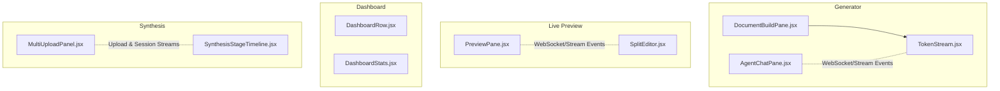

**Diagram sources**
- [AgentChatPane.jsx:110-278](file://frontend/src/components/generator/AgentChatPane.jsx#L110-L278)
- [DocumentBuildPane.jsx:52-152](file://frontend/src/components/generator/DocumentBuildPane.jsx#L52-L152)
- [TokenStream.jsx](file://frontend/src/components/generator/TokenStream.jsx)
- [PreviewPane.jsx](file://frontend/src/components/live-preview/PreviewPane.jsx)
- [SplitEditor.jsx](file://frontend/src/components/live-preview/SplitEditor.jsx)
- [DashboardRow.jsx](file://frontend/src/components/dashboard/DashboardRow.jsx)
- [DashboardStats.jsx](file://frontend/src/components/dashboard/DashboardStats.jsx)
- [MultiUploadPanel.jsx](file://frontend/src/components/generator/MultiUploadPanel.jsx)
- [SynthesisStageTimeline.jsx](file://frontend/src/components/generator/SynthesisStageTimeline.jsx)

**Section sources**
- [AgentChatPane.jsx:110-278](file://frontend/src/components/generator/AgentChatPane.jsx#L110-L278)
- [DocumentBuildPane.jsx:52-152](file://frontend/src/components/generator/DocumentBuildPane.jsx#L52-L152)
- [TokenStream.jsx](file://frontend/src/components/generator/TokenStream.jsx)
- [PreviewPane.jsx](file://frontend/src/components/live-preview/PreviewPane.jsx)
- [SplitEditor.jsx](file://frontend/src/components/live-preview/SplitEditor.jsx)
- [DashboardRow.jsx](file://frontend/src/components/dashboard/DashboardRow.jsx)
- [DashboardStats.jsx](file://frontend/src/components/dashboard/DashboardStats.jsx)
- [MultiUploadPanel.jsx](file://frontend/src/components/generator/MultiUploadPanel.jsx)
- [SynthesisStageTimeline.jsx](file://frontend/src/components/generator/SynthesisStageTimeline.jsx)

## Core Components
This section summarizes each component’s responsibilities and integration points.

- AgentChatPane: Chat UI for AI agent interactions, supports message history, typing indicators, inline source attribution, and stop actions.
- DocumentBuildPane: Live document builder pane that overlays TokenStream, shows generation status, and exposes download actions upon completion.
- TokenStream: Renders incremental document tokens in real time, driven by session state and generation stages.
- PreviewPane: Real-time preview pane synchronized via WebSocket streams for live updates.
- SplitEditor: Editor paired with PreviewPane for synchronized editing and live preview.
- DashboardRow: Row item for recent documents or jobs with action affordances.
- DashboardStats: Summary statistics card for usage metrics.
- MultiUploadPanel: Multi-file upload panel with progress and queue management.
- SynthesisStageTimeline: Timeline visualization of synthesis stages and progress.

**Section sources**
- [AgentChatPane.jsx:110-278](file://frontend/src/components/generator/AgentChatPane.jsx#L110-L278)
- [DocumentBuildPane.jsx:52-152](file://frontend/src/components/generator/DocumentBuildPane.jsx#L52-L152)
- [TokenStream.jsx](file://frontend/src/components/generator/TokenStream.jsx)
- [PreviewPane.jsx](file://frontend/src/components/live-preview/PreviewPane.jsx)
- [SplitEditor.jsx](file://frontend/src/components/live-preview/SplitEditor.jsx)
- [DashboardRow.jsx](file://frontend/src/components/dashboard/DashboardRow.jsx)
- [DashboardStats.jsx](file://frontend/src/components/dashboard/DashboardStats.jsx)
- [MultiUploadPanel.jsx](file://frontend/src/components/generator/MultiUploadPanel.jsx)
- [SynthesisStageTimeline.jsx](file://frontend/src/components/generator/SynthesisStageTimeline.jsx)

## Architecture Overview
The specialized components integrate around three pillars:
- Real-time streams: WebSocket-driven updates for generation and synthesis
- Session state: Shared state across panes and timelines
- Composition: Parent components orchestrate child components and event handlers

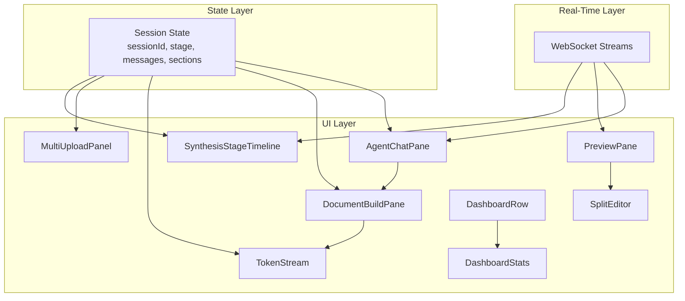

**Diagram sources**
- [AgentChatPane.jsx:110-278](file://frontend/src/components/generator/AgentChatPane.jsx#L110-L278)
- [DocumentBuildPane.jsx:52-152](file://frontend/src/components/generator/DocumentBuildPane.jsx#L52-L152)
- [TokenStream.jsx](file://frontend/src/components/generator/TokenStream.jsx)
- [PreviewPane.jsx](file://frontend/src/components/live-preview/PreviewPane.jsx)
- [SplitEditor.jsx](file://frontend/src/components/live-preview/SplitEditor.jsx)
- [DashboardRow.jsx](file://frontend/src/components/dashboard/DashboardRow.jsx)
- [DashboardStats.jsx](file://frontend/src/components/dashboard/DashboardStats.jsx)
- [MultiUploadPanel.jsx](file://frontend/src/components/generator/MultiUploadPanel.jsx)
- [SynthesisStageTimeline.jsx](file://frontend/src/components/generator/SynthesisStageTimeline.jsx)

## Detailed Component Analysis

### AgentChatPane
AgentChatPane renders a chat-like interface for agent interactions. It manages:
- Message history rendering with user/bot differentiation
- Structured content rendering for outlines and quality scores
- Inline source attribution badges
- Typing indicator and stop action
- Auto-scroll and input handling with keyboard shortcuts

State and effects:
- Tracks local input and auto-focuses input field when agent is idle
- Scrolls to bottom on new messages or typing state changes
- Disables submission while generating and shows loading/stopped states

Integration:
- Receives messages, isTyping, error, and callbacks for send/stop
- Emits outbound messages via onSendMessage

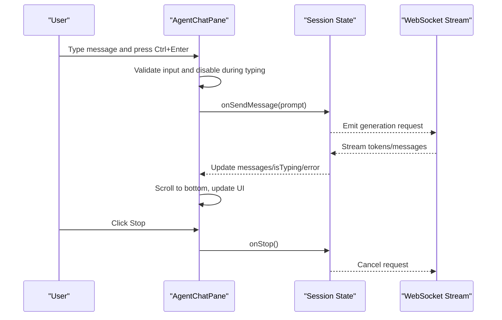

**Diagram sources**
- [AgentChatPane.jsx:110-278](file://frontend/src/components/generator/AgentChatPane.jsx#L110-L278)

**Section sources**
- [AgentChatPane.jsx:110-278](file://frontend/src/components/generator/AgentChatPane.jsx#L110-L278)

### DocumentBuildPane
DocumentBuildPane hosts the live document builder:
- Displays generation status badges
- Renders TokenStream for live token updates
- Shows overlay when idle
- Reveals footer with quality score and download actions upon completion

Composition:
- Delegates token rendering to TokenStream
- Exposes onDownload callback for DOCX/PDF

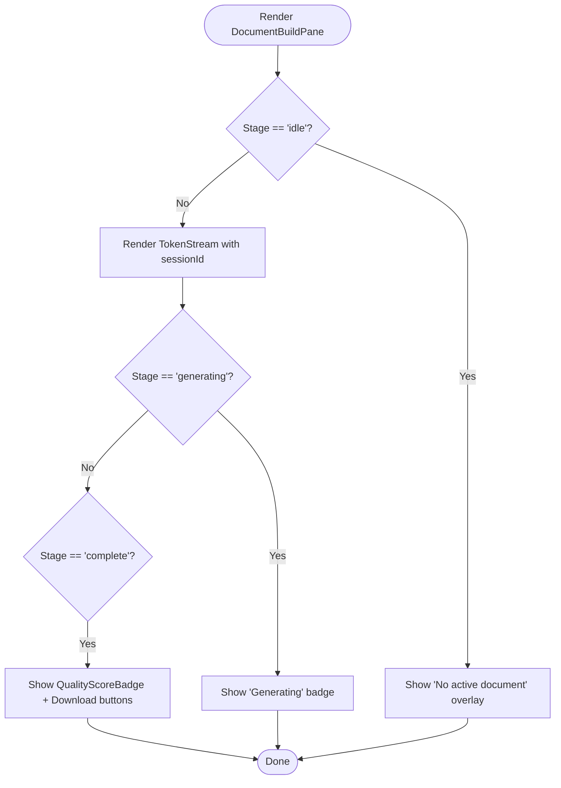

**Diagram sources**
- [DocumentBuildPane.jsx:52-152](file://frontend/src/components/generator/DocumentBuildPane.jsx#L52-L152)

**Section sources**
- [DocumentBuildPane.jsx:52-152](file://frontend/src/components/generator/DocumentBuildPane.jsx#L52-L152)

### TokenStream
TokenStream renders incremental tokens in real time:
- Accepts sessionId and isGenerating flag
- Accepts initialSections to seed content
- Integrates with WebSocket streams to append tokens progressively
- Manages scroll synchronization and cursor positioning

Lifecycle:
- Mounts listeners on sessionId changes
- Updates DOM efficiently to avoid reflows
- Handles pause/resume based on isGenerating

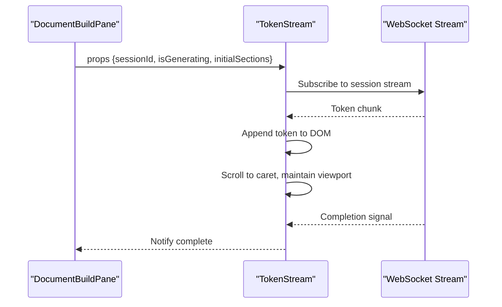

**Diagram sources**
- [TokenStream.jsx](file://frontend/src/components/generator/TokenStream.jsx)
- [DocumentBuildPane.jsx:88-88](file://frontend/src/components/generator/DocumentBuildPane.jsx#L88-L88)

**Section sources**
- [TokenStream.jsx](file://frontend/src/components/generator/TokenStream.jsx)
- [DocumentBuildPane.jsx:88-88](file://frontend/src/components/generator/DocumentBuildPane.jsx#L88-L88)

### PreviewPane
PreviewPane provides a synchronized live preview:
- Subscribes to WebSocket streams for real-time updates
- Renders formatted content from server-side previews
- Supports error states and loading indicators

Integration:
- Receives sessionId and stage
- Emits refresh/cancel actions to parent components

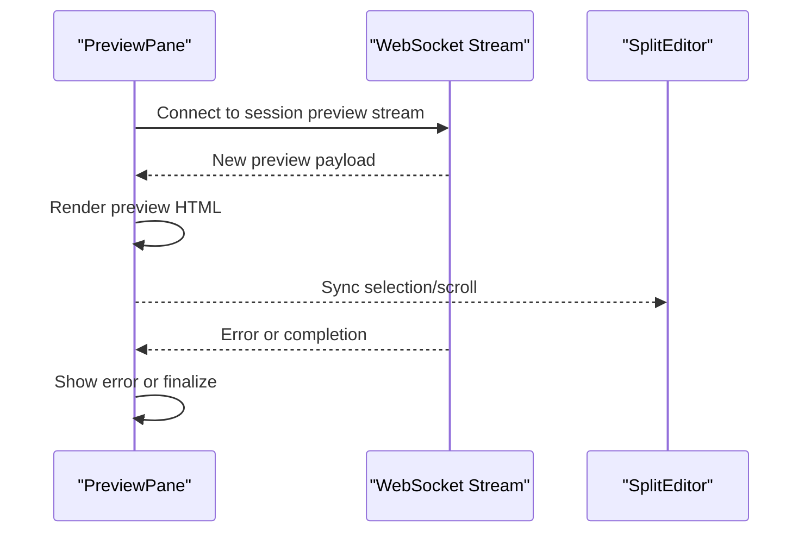

**Diagram sources**
- [PreviewPane.jsx](file://frontend/src/components/live-preview/PreviewPane.jsx)
- [SplitEditor.jsx](file://frontend/src/components/live-preview/SplitEditor.jsx)

**Section sources**
- [PreviewPane.jsx](file://frontend/src/components/live-preview/PreviewPane.jsx)
- [SplitEditor.jsx](file://frontend/src/components/live-preview/SplitEditor.jsx)

### SplitEditor
SplitEditor pairs with PreviewPane for synchronized editing:
- Maintains cursor and selection state
- Emits change events to trigger preview updates
- Handles undo/redo and collaborative editing signals

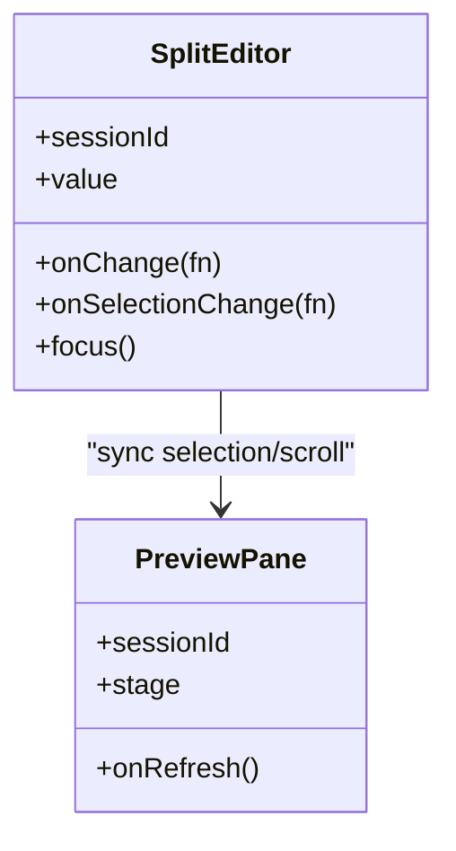

**Diagram sources**
- [SplitEditor.jsx](file://frontend/src/components/live-preview/SplitEditor.jsx)
- [PreviewPane.jsx](file://frontend/src/components/live-preview/PreviewPane.jsx)

**Section sources**
- [SplitEditor.jsx](file://frontend/src/components/live-preview/SplitEditor.jsx)
- [PreviewPane.jsx](file://frontend/src/components/live-preview/PreviewPane.jsx)

### DashboardRow
DashboardRow renders a single row for recent documents or jobs:
- Displays metadata (title, status, timestamps)
- Provides action buttons (open, delete, download)
- Supports hover states and compact layouts

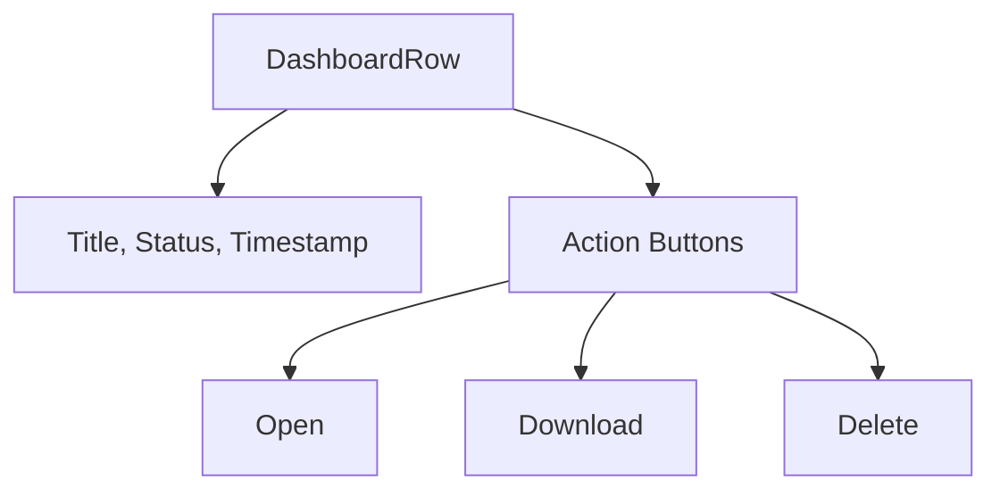

**Diagram sources**
- [DashboardRow.jsx](file://frontend/src/components/dashboard/DashboardRow.jsx)

**Section sources**
- [DashboardRow.jsx](file://frontend/src/components/dashboard/DashboardRow.jsx)

### DashboardStats
DashboardStats shows summary metrics:
- Displays counts, trends, and KPIs
- Uses color-coded badges for status
- Responsive layout for small screens

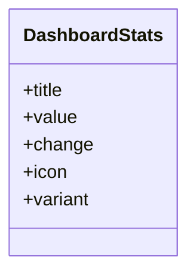

**Diagram sources**
- [DashboardStats.jsx](file://frontend/src/components/dashboard/DashboardStats.jsx)

**Section sources**
- [DashboardStats.jsx](file://frontend/src/components/dashboard/DashboardStats.jsx)

### MultiUploadPanel
MultiUploadPanel handles batch uploads:
- Drag-and-drop or click-to-select multiple files
- Shows progress per file and queue status
- Supports retries and cancellation

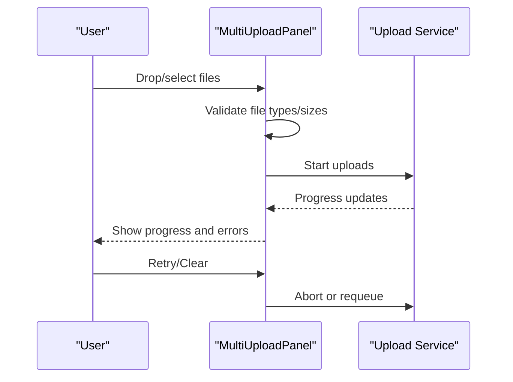

**Diagram sources**
- [MultiUploadPanel.jsx](file://frontend/src/components/generator/MultiUploadPanel.jsx)

**Section sources**
- [MultiUploadPanel.jsx](file://frontend/src/components/generator/MultiUploadPanel.jsx)

### SynthesisStageTimeline
SynthesisStageTimeline visualizes synthesis progress:
- Shows stages (parse, structure, format, export)
- Highlights current and completed stages
- Displays duration and status badges

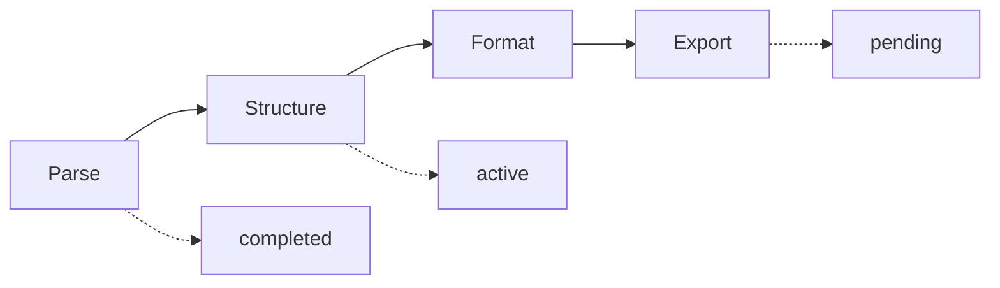

**Diagram sources**
- [SynthesisStageTimeline.jsx](file://frontend/src/components/generator/SynthesisStageTimeline.jsx)

**Section sources**
- [SynthesisStageTimeline.jsx](file://frontend/src/components/generator/SynthesisStageTimeline.jsx)

## Dependency Analysis
Component dependencies and coupling:
- DocumentBuildPane composes TokenStream and conditionally shows overlays and download actions
- AgentChatPane depends on session state and emits outbound events
- PreviewPane and SplitEditor are tightly coupled for synchronization
- DashboardRow and DashboardStats are presentation-only and depend on shared data
- MultiUploadPanel coordinates with upload service and synthesis timeline

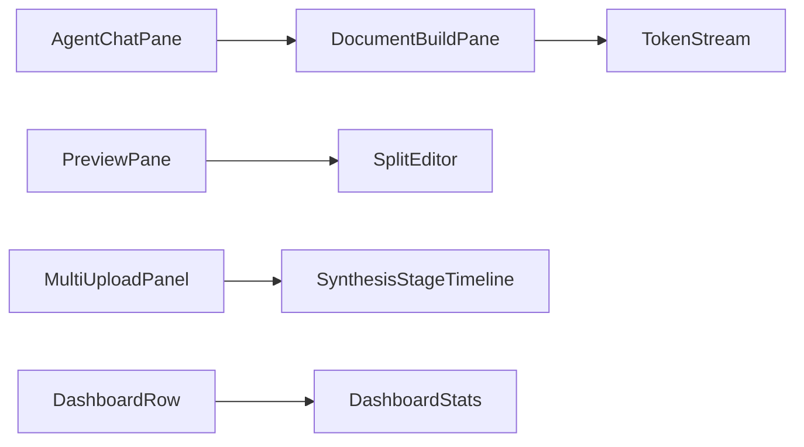

**Diagram sources**
- [AgentChatPane.jsx:110-278](file://frontend/src/components/generator/AgentChatPane.jsx#L110-L278)
- [DocumentBuildPane.jsx:52-152](file://frontend/src/components/generator/DocumentBuildPane.jsx#L52-L152)
- [TokenStream.jsx](file://frontend/src/components/generator/TokenStream.jsx)
- [PreviewPane.jsx](file://frontend/src/components/live-preview/PreviewPane.jsx)
- [SplitEditor.jsx](file://frontend/src/components/live-preview/SplitEditor.jsx)
- [MultiUploadPanel.jsx](file://frontend/src/components/generator/MultiUploadPanel.jsx)
- [SynthesisStageTimeline.jsx](file://frontend/src/components/generator/SynthesisStageTimeline.jsx)
- [DashboardRow.jsx](file://frontend/src/components/dashboard/DashboardRow.jsx)
- [DashboardStats.jsx](file://frontend/src/components/dashboard/DashboardStats.jsx)

**Section sources**
- [AgentChatPane.jsx:110-278](file://frontend/src/components/generator/AgentChatPane.jsx#L110-L278)
- [DocumentBuildPane.jsx:52-152](file://frontend/src/components/generator/DocumentBuildPane.jsx#L52-L152)
- [TokenStream.jsx](file://frontend/src/components/generator/TokenStream.jsx)
- [PreviewPane.jsx](file://frontend/src/components/live-preview/PreviewPane.jsx)
- [SplitEditor.jsx](file://frontend/src/components/live-preview/SplitEditor.jsx)
- [MultiUploadPanel.jsx](file://frontend/src/components/generator/MultiUploadPanel.jsx)
- [SynthesisStageTimeline.jsx](file://frontend/src/components/generator/SynthesisStageTimeline.jsx)
- [DashboardRow.jsx](file://frontend/src/components/dashboard/DashboardRow.jsx)
- [DashboardStats.jsx](file://frontend/src/components/dashboard/DashboardStats.jsx)

## Performance Considerations
- Memoization: Components use React.memo to prevent unnecessary re-renders (AgentChatPane, DocumentBuildPane, TokenStream).
- Efficient DOM updates: TokenStream appends tokens incrementally and avoids full re-renders.
- Auto-resize textarea: Input height adjusts dynamically to reduce layout thrashing.
- Conditional rendering: Idle overlays and completion footers minimize DOM overhead.
- Debounced scroll: Auto-scroll only triggers on message or typing state changes.
- WebSocket lifecycle: Components subscribe/unsubscribe based on sessionId and stage to avoid redundant updates.

[No sources needed since this section provides general guidance]

## Troubleshooting Guide
Common issues and recovery patterns:
- Chat input disabled during generation: Wait for isTyping to become false or call onStop to cancel.
- No live preview updates: Verify WebSocket connection and sessionId; ensure stage transitions to generating/completed.
- TokenStream not updating: Confirm sessionId changed and isGenerating is true; check for stream errors.
- Download actions unavailable: Ensure stage is complete and qualityScore is present.
- Upload failures: Inspect MultiUploadPanel error messages and retry individual files.

**Section sources**
- [AgentChatPane.jsx:110-278](file://frontend/src/components/generator/AgentChatPane.jsx#L110-L278)
- [DocumentBuildPane.jsx:52-152](file://frontend/src/components/generator/DocumentBuildPane.jsx#L52-L152)
- [TokenStream.jsx](file://frontend/src/components/generator/TokenStream.jsx)
- [PreviewPane.jsx](file://frontend/src/components/live-preview/PreviewPane.jsx)
- [SplitEditor.jsx](file://frontend/src/components/live-preview/SplitEditor.jsx)
- [MultiUploadPanel.jsx](file://frontend/src/components/generator/MultiUploadPanel.jsx)

## Conclusion
These specialized components form a cohesive real-time authoring and synthesis experience. They leverage memoization, efficient DOM updates, and WebSocket-driven streams to deliver responsive, scalable UI. Their modular composition enables advanced usage scenarios such as multi-file synthesis, live editing with synchronized preview, and agent-assisted document building.

[No sources needed since this section summarizes without analyzing specific files]

## Appendices
- Component composition tips:
  - Compose AgentChatPane with DocumentBuildPane for end-to-end generation UX.
  - Pair SplitEditor with PreviewPane for collaborative editing sessions.
  - Integrate MultiUploadPanel with SynthesisStageTimeline for batch workflows.
- Advanced usage scenarios:
  - Multi-file synthesis: Upload multiple documents, monitor SynthesisStageTimeline, and open results in SplitEditor/PreviewPane.
  - Agent-driven rewriting: Use AgentChatPane to request targeted edits; observe TokenStream updates and DocumentBuildPane completion.

[No sources needed since this section provides general guidance]