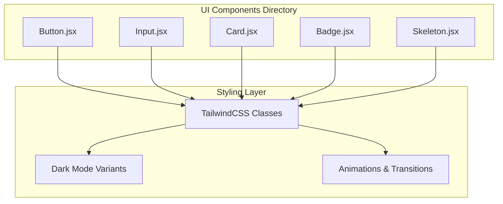
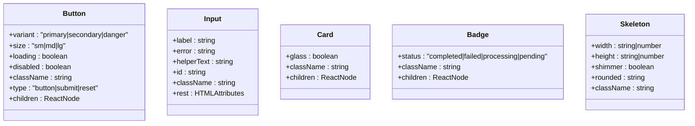
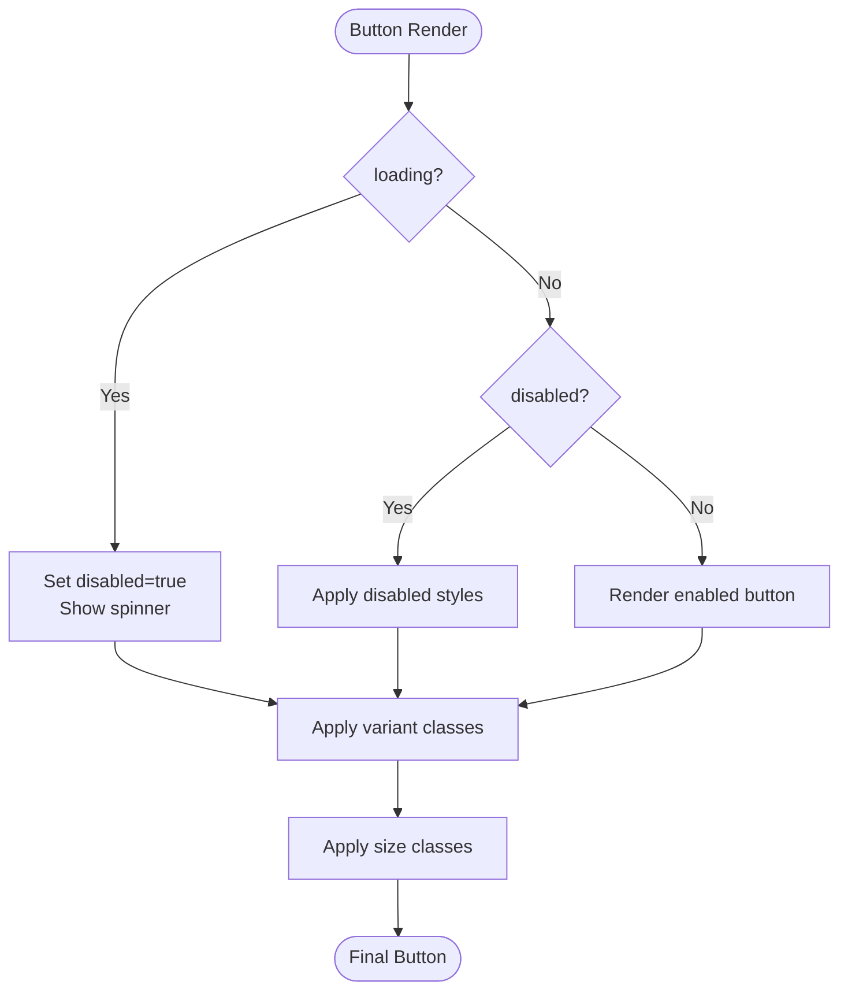
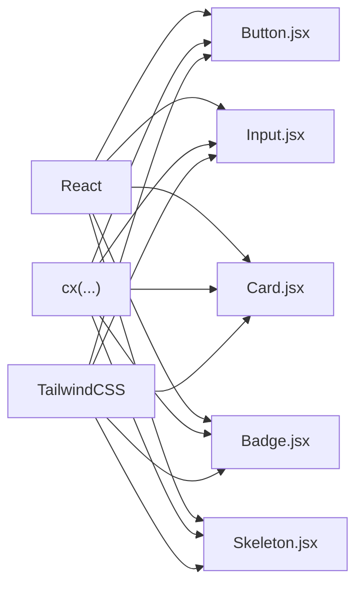

# UI Components

<cite>
**Referenced Files in This Document**
- [Button.jsx](file://frontend/src/components/ui/Button.jsx)
- [Input.jsx](file://frontend/src/components/ui/Input.jsx)
- [Card.jsx](file://frontend/src/components/ui/Card.jsx)
- [Badge.jsx](file://frontend/src/components/ui/Badge.jsx)
- [Skeleton.jsx](file://frontend/src/components/ui/Skeleton.jsx)
</cite>

## Table of Contents
1. [Introduction](#introduction)
2. [Project Structure](#project-structure)
3. [Core Components](#core-components)
4. [Architecture Overview](#architecture-overview)
5. [Detailed Component Analysis](#detailed-component-analysis)
6. [Dependency Analysis](#dependency-analysis)
7. [Performance Considerations](#performance-considerations)
8. [Accessibility and Keyboard Navigation](#accessibility-and-keyboard-navigation)
9. [Responsive Design Patterns](#responsive-design-patterns)
10. [TailwindCSS Integration and Theming](#tailwindcss-integration-and-theming)
11. [Testing Approaches](#testing-approaches)
12. [Form Validation Integration](#form-validation-integration)
13. [Troubleshooting Guide](#troubleshooting-guide)
14. [Conclusion](#conclusion)

## Introduction
This document provides comprehensive documentation for the reusable UI component library used in the frontend application. It covers five core components: Button, Input, Card, Badge, and Skeleton. For each component, we detail props, styling variants, usage patterns, composition strategies, TailwindCSS integration, theme customization, accessibility features, keyboard navigation, responsive design, testing approaches, and integration with form validation systems.

## Project Structure
The UI components are located under the frontend/src/components/ui directory. Each component is implemented as a React forwardRef component to support ref forwarding and controlled styling via TailwindCSS classes.

**Diagram sources**
- [Button.jsx:1-58](file://frontend/src/components/ui/Button.jsx#L1-L58)
- [Input.jsx:1-50](file://frontend/src/components/ui/Input.jsx#L1-L50)
- [Card.jsx:1-26](file://frontend/src/components/ui/Card.jsx#L1-L26)
- [Badge.jsx:1-33](file://frontend/src/components/ui/Badge.jsx#L1-L33)
- [Skeleton.jsx:1-41](file://frontend/src/components/ui/Skeleton.jsx#L1-L41)

**Section sources**
- [Button.jsx:1-58](file://frontend/src/components/ui/Button.jsx#L1-L58)
- [Input.jsx:1-50](file://frontend/src/components/ui/Input.jsx#L1-L50)
- [Card.jsx:1-26](file://frontend/src/components/ui/Card.jsx#L1-L26)
- [Badge.jsx:1-33](file://frontend/src/components/ui/Badge.jsx#L1-L33)
- [Skeleton.jsx:1-41](file://frontend/src/components/ui/Skeleton.jsx#L1-L41)

## Core Components
This section introduces each component, its purpose, and key characteristics.

- Button: A versatile button component supporting multiple variants, sizes, loading states, and disabled states. It integrates a spinner component for loading feedback.
- Input: A labeled input field with integrated error and helper text messaging, focus styling, and dark mode support.
- Card: A flexible container with optional glassmorphism effect, suitable for grouping related content.
- Badge: A status indicator with predefined semantic color schemes for common statuses.
- Skeleton: A lightweight placeholder element with configurable shimmer animation and sizing.

**Section sources**
- [Button.jsx:23-55](file://frontend/src/components/ui/Button.jsx#L23-L55)
- [Input.jsx:7-47](file://frontend/src/components/ui/Input.jsx#L7-L47)
- [Card.jsx:7-23](file://frontend/src/components/ui/Card.jsx#L7-L23)
- [Badge.jsx:14-30](file://frontend/src/components/ui/Badge.jsx#L14-L30)
- [Skeleton.jsx:7-38](file://frontend/src/components/ui/Skeleton.jsx#L7-L38)

## Architecture Overview
The components share a consistent pattern:
- Use forwardRef to expose DOM refs to parent components.
- Accept a className prop to allow external styling overrides.
- Apply TailwindCSS utility classes for base styles, variants, and responsive adjustments.
- Support dark mode through dark:* variants in Tailwind classes.
- Provide controlled states (disabled, loading) and accessibility attributes where applicable.

**Diagram sources**
- [Button.jsx:23-55](file://frontend/src/components/ui/Button.jsx#L23-L55)
- [Input.jsx:7-47](file://frontend/src/components/ui/Input.jsx#L7-L47)
- [Card.jsx:7-23](file://frontend/src/components/ui/Card.jsx#L7-L23)
- [Badge.jsx:14-30](file://frontend/src/components/ui/Badge.jsx#L14-L30)
- [Skeleton.jsx:7-38](file://frontend/src/components/ui/Skeleton.jsx#L7-L38)

## Detailed Component Analysis

### Button Component
Purpose: Render interactive buttons with consistent styling and behavior across the application.

Props:
- variant: Controls background, border, and text color. Options include primary, secondary, and danger.
- size: Controls height, padding, and text size. Options include sm, md, and lg.
- loading: Displays a spinner and disables interaction.
- disabled: Disables interaction and reduces opacity.
- type: HTML button type attribute.
- className: Additional TailwindCSS classes to override defaults.
- children: Button content.
- ref: Forwarded DOM reference.

Styling Variants:
- Primary: Emphasized action with shadow and transparent borders.
- Secondary: Subtle background with light/dark variants and subtle hover.
- Danger: Red palette for destructive actions.

States and Behaviors:
- Loading: Adds a spinner and sets disabled state automatically.
- Disabled: Prevents interaction and applies reduced opacity.
- Focus/Active: Smooth transitions and slight scaling on press.

Usage Patterns:
- Submit forms with type="submit".
- Trigger destructive actions with variant="danger".
- Indicate async operations with loading=true.

Accessibility:
- Inherits native button semantics.
- Disabled state ensures no pointer events.
- Spinner marked as aria-hidden.

**Diagram sources**
- [Button.jsx:36-54](file://frontend/src/components/ui/Button.jsx#L36-L54)

**Section sources**
- [Button.jsx:7-17](file://frontend/src/components/ui/Button.jsx#L7-L17)
- [Button.jsx:19-21](file://frontend/src/components/ui/Button.jsx#L19-L21)
- [Button.jsx:23-55](file://frontend/src/components/ui/Button.jsx#L23-L55)

### Input Component
Purpose: Provide a labeled input field with integrated error and helper text messaging.

Props:
- label: Optional label text.
- error: Error message to display below the input.
- helperText: Helper text to display below the input when no error.
- id: Explicit id for the input element.
- className: Additional TailwindCSS classes.
- rest: All other HTML input attributes are spread to the input element.

Styling and Behavior:
- Focus state: Changes border color to primary when not in error.
- Error state: Uses red border and text for error messaging.
- Dark mode: Adjusts background, text, and border colors for dark themes.
- Label: Associated with the input via htmlFor.

Accessibility:
- Proper label association via htmlFor=id.
- Error messages are conveyed to assistive technologies via paragraph text.

```mermaid
flowchart TD
Start(["Input Render"]) --> HasLabel{"label provided?"}
HasLabel --> |Yes| RenderLabel["Render <label> with htmlFor"]
HasLabel --> |No| SkipLabel["Skip label"]
RenderLabel --> RenderInput["Render <input> with classes"]
SkipLabel --> RenderInput
RenderInput --> HasError{"error provided?"}
HasError --> |Yes| ErrorStyles["Apply error border & text"]
HasError --> |No| FocusStyles["Apply focus border to primary"]
ErrorStyles --> MaybeHelper{"helperText?"}
FocusStyles --> MaybeHelper
MaybeHelper --> |Yes| HelperText["Render helper text"]
MaybeHelper --> |No| End(["End"])
HelperText --> End
```

**Diagram sources**
- [Input.jsx:20-46](file://frontend/src/components/ui/Input.jsx#L20-L46)

**Section sources**
- [Input.jsx:7-47](file://frontend/src/components/ui/Input.jsx#L7-L47)

### Card Component
Purpose: Provide a flexible container for grouping related content, optionally with a glassmorphism effect.

Props:
- glass: Enables a frosted-glass appearance with backdrop blur.
- className: Additional TailwindCSS classes.
- children: Card content.

Styling:
- Default: White background in light mode, dark background in dark mode.
- Glass: Background with backdrop blur and translucent border for a frosted effect.
- Responsive padding increases on small screens.

Accessibility:
- No special accessibility concerns; ensure child content remains accessible.

**Section sources**
- [Card.jsx:7-23](file://frontend/src/components/ui/Card.jsx#L7-L23)

### Badge Component
Purpose: Display status indicators with semantic colors.

Props:
- status: One of completed, failed, processing, pending. Defaults to pending.
- className: Additional TailwindCSS classes.
- children: Badge content; falls back to normalized status if empty.

Styling:
- Each status maps to a distinct color palette optimized for light and dark modes.
- Rounded pill shape with compact padding and uppercase text.

Usage Patterns:
- Job status badges in dashboards.
- Validation result indicators.
- Workflow step markers.

**Section sources**
- [Badge.jsx:7-12](file://frontend/src/components/ui/Badge.jsx#L7-L12)
- [Badge.jsx:14-30](file://frontend/src/components/ui/Badge.jsx#L14-L30)

### Skeleton Component
Purpose: Provide lightweight placeholders during asynchronous content loading.

Props:
- width/height: Inline dimensions.
- shimmer: Enables animated pulse effect.
- rounded: Tailwind border-radius class.
- className: Additional TailwindCSS classes.
- ref: Forwarded DOM reference.

Behavior:
- Renders a div with background appropriate for light/dark modes.
- Applies animation class conditionally.
- Marks itself as aria-hidden to avoid screen reader announcements.

Accessibility:
- aria-hidden prevents redundant announcements while content loads.

**Section sources**
- [Skeleton.jsx:18-38](file://frontend/src/components/ui/Skeleton.jsx#L18-L38)

## Dependency Analysis
Each component depends on:
- React forwardRef for ref forwarding.
- A local cx utility to merge TailwindCSS classes.
- TailwindCSS classes for styling and dark mode variants.

**Diagram sources**
- [Button.jsx:3-5](file://frontend/src/components/ui/Button.jsx#L3-L5)
- [Input.jsx:3-5](file://frontend/src/components/ui/Input.jsx#L3-L5)
- [Card.jsx:3-5](file://frontend/src/components/ui/Card.jsx#L3-L5)
- [Badge.jsx:3-5](file://frontend/src/components/ui/Badge.jsx#L3-L5)
- [Skeleton.jsx:3-5](file://frontend/src/components/ui/Skeleton.jsx#L3-L5)

**Section sources**
- [Button.jsx:3-5](file://frontend/src/components/ui/Button.jsx#L3-L5)
- [Input.jsx:3-5](file://frontend/src/components/ui/Input.jsx#L3-L5)
- [Card.jsx:3-5](file://frontend/src/components/ui/Card.jsx#L3-L5)
- [Badge.jsx:3-5](file://frontend/src/components/ui/Badge.jsx#L3-L5)
- [Skeleton.jsx:3-5](file://frontend/src/components/ui/Skeleton.jsx#L3-L5)

## Performance Considerations
- Prefer minimal re-renders by passing stable refs and avoiding unnecessary prop churn.
- Use the glass variant judiciously as it relies on backdrop blur, which can be expensive on low-end devices.
- Avoid excessive shimmer animations; disable shimmer when not needed.
- Keep className merges concise to reduce DOM class computation overhead.

## Accessibility and Keyboard Navigation
- Buttons: Native button semantics ensure keyboard operability (Enter/Space). Disabled states prevent interaction and are announced appropriately by assistive technologies.
- Inputs: Proper label association via htmlFor/id ensures screen readers announce labels. Error messages are conveyed via adjacent paragraph text.
- Badges: Static indicators; ensure sufficient color contrast for status meanings.
- Skeletons: Marked as aria-hidden to avoid interrupting screen reader flow during loading.

## Responsive Design Patterns
- Inputs and Cards increase internal padding on small screens for better touch target sizing.
- Buttons adapt height and padding across sizes (sm/md/lg) for consistent spacing.
- Skeleton supports inline width/height for flexible layouts.

## TailwindCSS Integration and Theming
- Dark Mode: All components apply dark:* variants for backgrounds, borders, and text.
- Semantic Colors: Primary, secondary, and danger variants use semantic color tokens.
- Utility-First: Components rely on Tailwind utilities for consistent spacing, typography, and transitions.
- Extensibility: className prop allows overriding defaults without modifying component internals.

## Testing Approaches
Recommended testing strategies:
- Unit Tests: Verify rendering with different props (variants, sizes, loading, disabled, error states).
- Accessibility Tests: Ensure labels, roles, and disabled states are correctly applied.
- Snapshot Tests: Capture baseline renders for regression detection.
- Integration Tests: Test composition patterns (e.g., Button inside Card, Input with Badge).

Example test scenarios (descriptive):
- Button: Assert correct variant classes applied, spinner visibility when loading, disabled opacity.
- Input: Assert label association, error text visibility, focus border change.
- Card: Assert glass effect classes when enabled, dark mode background.
- Badge: Assert status-specific color classes, fallback text when children are empty.
- Skeleton: Assert shimmer animation class presence/absence, aria-hidden attribute.

## Form Validation Integration
- Input integrates with validation by accepting an error prop and displaying contextual messaging.
- Combine Input with Badge to indicate validation status (e.g., pending, failed, completed).
- Use Button with loading to reflect submission state and prevent double-clicks.

## Troubleshooting Guide
Common issues and resolutions:
- Button not responding: Ensure disabled is not set and loading is false.
- Input label not associated: Provide id or rely on name fallback; ensure htmlFor matches.
- Card looks flat in dark mode: Confirm dark mode is enabled and dark:* variants are present.
- Badge color incorrect: Verify status value is one of the supported statuses.
- Skeleton not animating: Ensure shimmer is true and animation utilities are available.

## Conclusion
The UI component library provides a cohesive, accessible, and theme-aware set of primitives built with TailwindCSS. By leveraging consistent props, variants, and composition patterns, teams can build reliable interfaces quickly while maintaining design system alignment.