# Utility Components

<cite>
**Referenced Files in This Document**
- [DeleteConfirmDialog.jsx](file://frontend/src/components/DeleteConfirmDialog.jsx)
- [ErrorBoundary.jsx](file://frontend/src/components/ErrorBoundary.jsx)
- [ExportDialog.jsx](file://frontend/src/components/ExportDialog.jsx)
- [FeedbackForm.jsx](file://frontend/src/components/FeedbackForm.jsx)
- [HealthStatusIndicator.jsx](file://frontend/src/components/HealthStatusIndicator.jsx)
- [MetricsCard.jsx](file://frontend/src/components/MetricsCard.jsx)
- [NotificationBell.jsx](file://frontend/src/components/NotificationBell.jsx)
- [OnboardingTour.jsx](file://frontend/src/components/OnboardingTour.jsx)
- [Preview.jsx](file://frontend/src/components/Preview.jsx)
- [StatusBadge.jsx](file://frontend/src/components/StatusBadge.jsx)
- [ValidationCard.jsx](file://frontend/src/components/ValidationCard.jsx)
- [UpgradeModal.jsx](file://frontend/src/components/UpgradeModal.jsx)
- [ToastContext.jsx](file://frontend/src/context/ToastContext.jsx)
- [ThemeContext.jsx](file://frontend/src/context/ThemeContext.jsx)
- [AuthContext.jsx](file://frontend/src/context/AuthContext.jsx)
- [DocumentContext.jsx](file://frontend/src/context/DocumentContext.jsx)
- [useGeneratorSessionStream.js](file://frontend/src/hooks/useGeneratorSessionStream.js)
- [useSessionEventStream.js](file://frontend/src/hooks/useSessionEventStream.js)
- [useLivePreviewSocket.js](file://frontend/src/hooks/useLivePreviewSocket.js)
- [analytics.js](file://frontend/src/lib/analytics.js)
- [posthog.js](file://frontend/src/lib/posthog.js)
- [status.js](file://frontend/src/constants/status.js)
- [notifications.js](file://frontend/src/utils/notifications.js)
</cite>

## Table of Contents
1. [Introduction](#introduction)
2. [Project Structure](#project-structure)
3. [Core Components](#core-components)
4. [Architecture Overview](#architecture-overview)
5. [Detailed Component Analysis](#detailed-component-analysis)
6. [Dependency Analysis](#dependency-analysis)
7. [Performance Considerations](#performance-considerations)
8. [Accessibility and UX](#accessibility-and-ux)
9. [Troubleshooting Guide](#troubleshooting-guide)
10. [Conclusion](#conclusion)

## Introduction
This document describes the utility and helper components that power user interactions, feedback collection, health monitoring, notifications, onboarding, previews, status reporting, validation, upgrades, and export workflows. It explains reusability patterns, configuration options, integration with global state, accessibility, animations, responsiveness, and advanced customization approaches.

## Project Structure
Utility components are located under the frontend application’s components directory and integrate with shared contexts, hooks, analytics libraries, and constants. They are designed for composability and reuse across pages and views.

```mermaid
graph TB
subgraph "Components"
DCD["DeleteConfirmDialog.jsx"]
EBD["ErrorBoundary.jsx"]
EXD["ExportDialog.jsx"]
FBF["FeedbackForm.jsx"]
HSI["HealthStatusIndicator.jsx"]
MET["MetricsCard.jsx"]
NFB["NotificationBell.jsx"]
OT["OnboardingTour.jsx"]
PRE["Preview.jsx"]
SBA["StatusBadge.jsx"]
VAL["ValidationCard.jsx"]
UPM["UpgradeModal.jsx"]
end
subgraph "Contexts"
TCTX["ToastContext.jsx"]
THEME["ThemeContext.jsx"]
AUTH["AuthContext.jsx"]
DOCX["DocumentContext.jsx"]
end
subgraph "Hooks"
GSS["useGeneratorSessionStream.js"]
SES["useSessionEventStream.js"]
LPS["useLivePreviewSocket.js"]
end
subgraph "Libraries & Utils"
ANA["analytics.js"]
PH["posthog.js"]
STAT["status.js"]
NOTIF["notifications.js"]
end
DCD --> TCTX
EXD --> TCTX
FBF --> AUTH
HSI --> STAT
MET --> ANA
NFB --> TCTX
OT --> THEME
PRE --> LPS
SBA --> STAT
VAL --> ANA
UPM --> AUTH
MET --> PH
VAL --> PH
```

**Diagram sources**
- [DeleteConfirmDialog.jsx](file://frontend/src/components/DeleteConfirmDialog.jsx)
- [ErrorBoundary.jsx](file://frontend/src/components/ErrorBoundary.jsx)
- [ExportDialog.jsx](file://frontend/src/components/ExportDialog.jsx)
- [FeedbackForm.jsx](file://frontend/src/components/FeedbackForm.jsx)
- [HealthStatusIndicator.jsx](file://frontend/src/components/HealthStatusIndicator.jsx)
- [MetricsCard.jsx](file://frontend/src/components/MetricsCard.jsx)
- [NotificationBell.jsx](file://frontend/src/components/NotificationBell.jsx)
- [OnboardingTour.jsx](file://frontend/src/components/OnboardingTour.jsx)
- [Preview.jsx](file://frontend/src/components/Preview.jsx)
- [StatusBadge.jsx](file://frontend/src/components/StatusBadge.jsx)
- [ValidationCard.jsx](file://frontend/src/components/ValidationCard.jsx)
- [UpgradeModal.jsx](file://frontend/src/components/UpgradeModal.jsx)
- [ToastContext.jsx](file://frontend/src/context/ToastContext.jsx)
- [ThemeContext.jsx](file://frontend/src/context/ThemeContext.jsx)
- [AuthContext.jsx](file://frontend/src/context/AuthContext.jsx)
- [DocumentContext.jsx](file://frontend/src/context/DocumentContext.jsx)
- [useGeneratorSessionStream.js](file://frontend/src/hooks/useGeneratorSessionStream.js)
- [useSessionEventStream.js](file://frontend/src/hooks/useSessionEventStream.js)
- [useLivePreviewSocket.js](file://frontend/src/hooks/useLivePreviewSocket.js)
- [analytics.js](file://frontend/src/lib/analytics.js)
- [posthog.js](file://frontend/src/lib/posthog.js)
- [status.js](file://frontend/src/constants/status.js)
- [notifications.js](file://frontend/src/utils/notifications.js)

**Section sources**
- [DeleteConfirmDialog.jsx](file://frontend/src/components/DeleteConfirmDialog.jsx)
- [ExportDialog.jsx](file://frontend/src/components/ExportDialog.jsx)
- [FeedbackForm.jsx](file://frontend/src/components/FeedbackForm.jsx)
- [HealthStatusIndicator.jsx](file://frontend/src/components/HealthStatusIndicator.jsx)
- [MetricsCard.jsx](file://frontend/src/components/MetricsCard.jsx)
- [NotificationBell.jsx](file://frontend/src/components/NotificationBell.jsx)
- [OnboardingTour.jsx](file://frontend/src/components/OnboardingTour.jsx)
- [Preview.jsx](file://frontend/src/components/Preview.jsx)
- [StatusBadge.jsx](file://frontend/src/components/StatusBadge.jsx)
- [ValidationCard.jsx](file://frontend/src/components/ValidationCard.jsx)
- [UpgradeModal.jsx](file://frontend/src/components/UpgradeModal.jsx)
- [ToastContext.jsx](file://frontend/src/context/ToastContext.jsx)
- [ThemeContext.jsx](file://frontend/src/context/ThemeContext.jsx)
- [AuthContext.jsx](file://frontend/src/context/AuthContext.jsx)
- [DocumentContext.jsx](file://frontend/src/context/DocumentContext.jsx)
- [useGeneratorSessionStream.js](file://frontend/src/hooks/useGeneratorSessionStream.js)
- [useSessionEventStream.js](file://frontend/src/hooks/useSessionEventStream.js)
- [useLivePreviewSocket.js](file://frontend/src/hooks/useLivePreviewSocket.js)
- [analytics.js](file://frontend/src/lib/analytics.js)
- [posthog.js](file://frontend/src/lib/posthog.js)
- [status.js](file://frontend/src/constants/status.js)
- [notifications.js](file://frontend/src/utils/notifications.js)

## Core Components
This section outlines the primary utility components and their responsibilities, configuration options, and integration touchpoints.

- Confirmation Dialogs
  - DeleteConfirmDialog: Presents a modal to confirm destructive actions, integrates with toast notifications for feedback.
  - Configuration: Accepts title, description, confirm callback, cancel callback, and button labels.
  - Integration: Uses ToastContext for success/error messaging after action completion.

- Error Boundaries
  - ErrorBoundary: Catches JavaScript errors in descendant components and renders a fallback UI.
  - Configuration: Accepts optional fallback UI props and logs errors via analytics.
  - Integration: Works with analytics and error tracking libraries.

- Export Functionality
  - ExportDialog: Allows users to select export formats and options, triggers download or external processing.
  - Configuration: Accepts supported formats, metadata, and callbacks for success/error.
  - Integration: Uses document context and analytics for export events.

- Feedback Forms
  - FeedbackForm: Collects user feedback with categorization and optional attachments.
  - Configuration: Accepts categories, required fields, submission endpoint, and success/error handlers.
  - Integration: Uses AuthContext for user identity and analytics for event tracking.

- Health Indicators
  - HealthStatusIndicator: Visual indicator of system/service health with status mapping from constants.
  - Configuration: Accepts status value, tooltip text, and size variants.
  - Integration: Uses status constants and theme-aware rendering.

- Metrics Displays
  - MetricsCard: Renders KPI-style metrics with trend indicators and tooltips.
  - Configuration: Accepts metric label/value, trend direction, color scheme, and click handler.
  - Integration: Uses analytics and PostHog for event tracking and insights.

- Notifications
  - NotificationBell: Triggers notification center and badge count updates.
  - Configuration: Accepts unread count, click handler, and menu items.
  - Integration: Uses ToastContext for persistent notifications and theme context for appearance.

- Onboarding Tours
  - OnboardingTour: Guides users through key features with guided steps and tips.
  - Configuration: Accepts steps array, current step index, and completion callback.
  - Integration: Uses ThemeContext for styling and analytics for tour progress.

- Previews
  - Preview: Live preview pane synchronized with real-time updates via WebSocket.
  - Configuration: Accepts document ID, render mode, and scroll synchronization options.
  - Integration: Uses live preview socket hook and document context.

- Status Badges
  - StatusBadge: Lightweight status display with color-coded states.
  - Configuration: Accepts status enum, label text, and icon option.
  - Integration: Uses status constants and theme context.

- Validation Cards
  - ValidationCard: Summarizes validation results with actionable insights.
  - Configuration: Accepts results array, summary text, and remediation suggestions.
  - Integration: Uses analytics and PostHog for validation events.

- Upgrade Modals
  - UpgradeModal: Prompts users to upgrade plans with feature highlights and CTA.
  - Configuration: Accepts plan tiers, features list, and redirect URL.
  - Integration: Uses AuthContext for user state and analytics for conversion tracking.

**Section sources**
- [DeleteConfirmDialog.jsx](file://frontend/src/components/DeleteConfirmDialog.jsx)
- [ErrorBoundary.jsx](file://frontend/src/components/ErrorBoundary.jsx)
- [ExportDialog.jsx](file://frontend/src/components/ExportDialog.jsx)
- [FeedbackForm.jsx](file://frontend/src/components/FeedbackForm.jsx)
- [HealthStatusIndicator.jsx](file://frontend/src/components/HealthStatusIndicator.jsx)
- [MetricsCard.jsx](file://frontend/src/components/MetricsCard.jsx)
- [NotificationBell.jsx](file://frontend/src/components/NotificationBell.jsx)
- [OnboardingTour.jsx](file://frontend/src/components/OnboardingTour.jsx)
- [Preview.jsx](file://frontend/src/components/Preview.jsx)
- [StatusBadge.jsx](file://frontend/src/components/StatusBadge.jsx)
- [ValidationCard.jsx](file://frontend/src/components/ValidationCard.jsx)
- [UpgradeModal.jsx](file://frontend/src/components/UpgradeModal.jsx)

## Architecture Overview
The utility components follow a pattern of:
- Stateless or minimally stateful React components
- Composition with shared contexts for state and persistence
- Event-driven integrations via hooks and analytics
- Accessibility-first markup with keyboard navigation and ARIA attributes
- Responsive design with Tailwind utilities and theme-aware variants

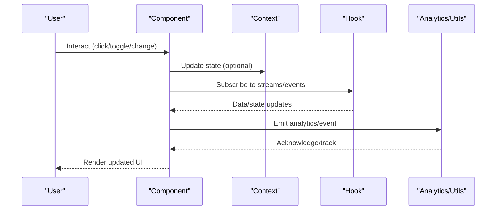

[No sources needed since this diagram shows conceptual workflow, not actual code structure]

## Detailed Component Analysis

### Confirmation Dialogs
- Purpose: Provide a safe, explicit confirmation for irreversible actions.
- Reusability: Accepts callbacks and labels, enabling reuse across delete, archive, and reset actions.
- Integration: Emits success/failure notifications via ToastContext.

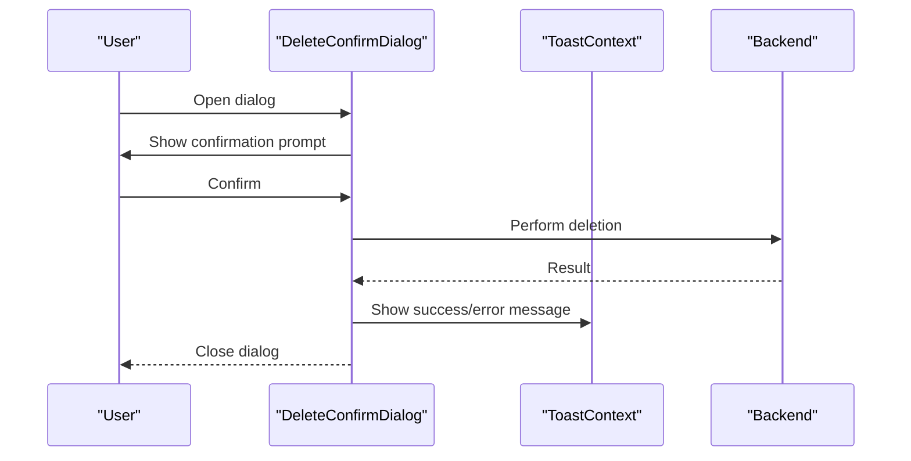

**Diagram sources**
- [DeleteConfirmDialog.jsx](file://frontend/src/components/DeleteConfirmDialog.jsx)
- [ToastContext.jsx](file://frontend/src/context/ToastContext.jsx)

**Section sources**
- [DeleteConfirmDialog.jsx](file://frontend/src/components/DeleteConfirmDialog.jsx)
- [ToastContext.jsx](file://frontend/src/context/ToastContext.jsx)

### Error Boundaries
- Purpose: Gracefully handle runtime errors and present a fallback UI.
- Reusability: Wrap critical sections; configure fallback UI per module.
- Integration: Logs errors to analytics and provides recovery actions.

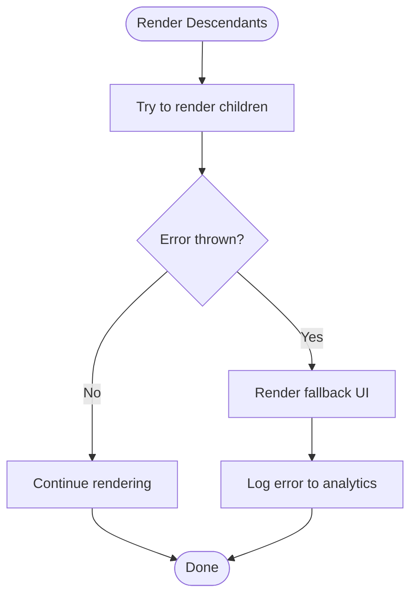

**Diagram sources**
- [ErrorBoundary.jsx](file://frontend/src/components/ErrorBoundary.jsx)
- [analytics.js](file://frontend/src/lib/analytics.js)

**Section sources**
- [ErrorBoundary.jsx](file://frontend/src/components/ErrorBoundary.jsx)
- [analytics.js](file://frontend/src/lib/analytics.js)

### Export Functionality
- Purpose: Enable users to export formatted content in various formats.
- Reusability: Supports configurable formats and metadata; reusable across document and synthesis flows.
- Integration: Uses document context and analytics for export tracking.

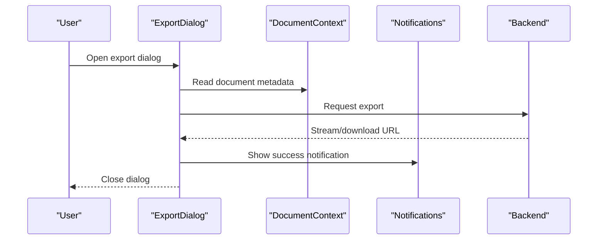

**Diagram sources**
- [ExportDialog.jsx](file://frontend/src/components/ExportDialog.jsx)
- [DocumentContext.jsx](file://frontend/src/context/DocumentContext.jsx)
- [notifications.js](file://frontend/src/utils/notifications.js)

**Section sources**
- [ExportDialog.jsx](file://frontend/src/components/ExportDialog.jsx)
- [DocumentContext.jsx](file://frontend/src/context/DocumentContext.jsx)
- [notifications.js](file://frontend/src/utils/notifications.js)

### Feedback Forms
- Purpose: Capture structured feedback with categorization and optional attachments.
- Reusability: Configurable categories and submission endpoints; supports inline validation.
- Integration: Uses AuthContext for user identity and analytics for event tracking.

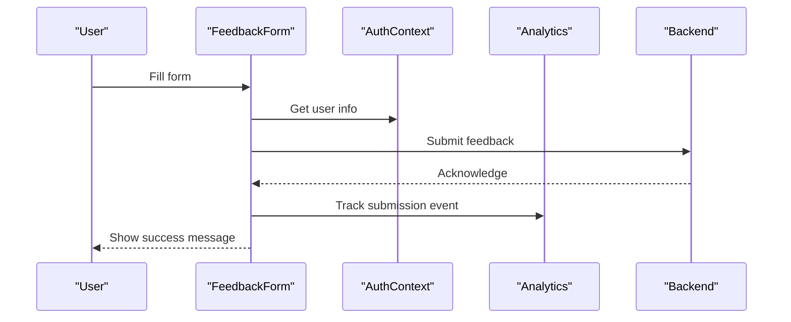

**Diagram sources**
- [FeedbackForm.jsx](file://frontend/src/components/FeedbackForm.jsx)
- [AuthContext.jsx](file://frontend/src/context/AuthContext.jsx)
- [analytics.js](file://frontend/src/lib/analytics.js)

**Section sources**
- [FeedbackForm.jsx](file://frontend/src/components/FeedbackForm.jsx)
- [AuthContext.jsx](file://frontend/src/context/AuthContext.jsx)
- [analytics.js](file://frontend/src/lib/analytics.js)

### Health Indicators
- Purpose: Visually communicate system/service health status.
- Reusability: Accepts status enum and renders consistent icons/badges.
- Integration: Uses status constants and theme-aware rendering.

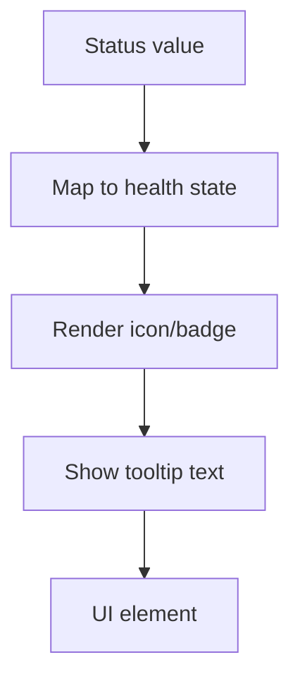

**Diagram sources**
- [HealthStatusIndicator.jsx](file://frontend/src/components/HealthStatusIndicator.jsx)
- [status.js](file://frontend/src/constants/status.js)

**Section sources**
- [HealthStatusIndicator.jsx](file://frontend/src/components/HealthStatusIndicator.jsx)
- [status.js](file://frontend/src/constants/status.js)

### Metrics Displays
- Purpose: Present KPIs with trend indicators and interactive tooltips.
- Reusability: Accepts label/value/trend and supports click handlers for drill-down.
- Integration: Tracks interactions via analytics and PostHog.

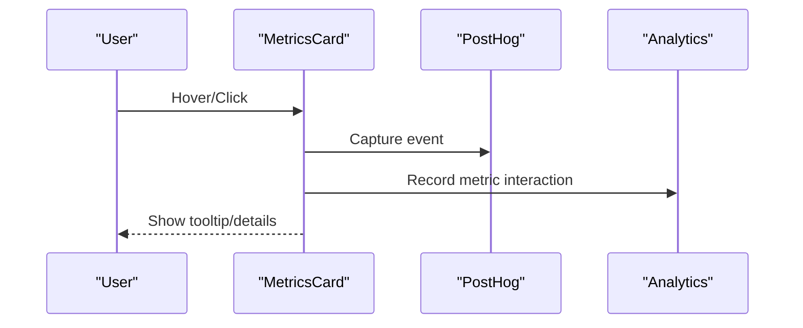

**Diagram sources**
- [MetricsCard.jsx](file://frontend/src/components/MetricsCard.jsx)
- [posthog.js](file://frontend/src/lib/posthog.js)
- [analytics.js](file://frontend/src/lib/analytics.js)

**Section sources**
- [MetricsCard.jsx](file://frontend/src/components/MetricsCard.jsx)
- [posthog.js](file://frontend/src/lib/posthog.js)
- [analytics.js](file://frontend/src/lib/analytics.js)

### Notifications
- Purpose: Surface alerts and updates with badge counts and quick actions.
- Reusability: Configurable menu items and click handlers; integrates with toast system.
- Integration: Uses ToastContext and ThemeContext for appearance and behavior.

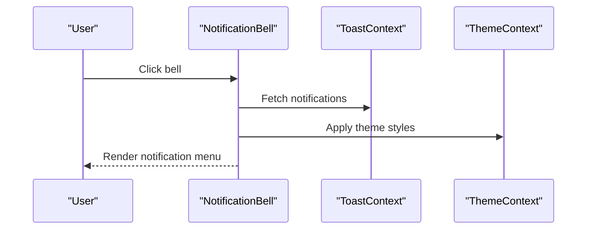

**Diagram sources**
- [NotificationBell.jsx](file://frontend/src/components/NotificationBell.jsx)
- [ToastContext.jsx](file://frontend/src/context/ToastContext.jsx)
- [ThemeContext.jsx](file://frontend/src/context/ThemeContext.jsx)

**Section sources**
- [NotificationBell.jsx](file://frontend/src/components/NotificationBell.jsx)
- [ToastContext.jsx](file://frontend/src/context/ToastContext.jsx)
- [ThemeContext.jsx](file://frontend/src/context/ThemeContext.jsx)

### Onboarding Tours
- Purpose: Guide users through key workflows with contextual steps.
- Reusability: Steps array and current index enable incremental tours.
- Integration: Uses ThemeContext for styling and analytics for progress tracking.

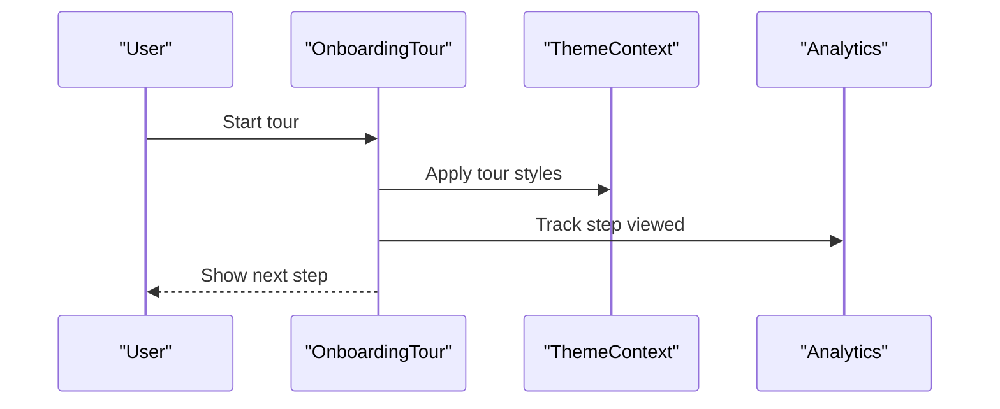

**Diagram sources**
- [OnboardingTour.jsx](file://frontend/src/components/OnboardingTour.jsx)
- [ThemeContext.jsx](file://frontend/src/context/ThemeContext.jsx)
- [analytics.js](file://frontend/src/lib/analytics.js)

**Section sources**
- [OnboardingTour.jsx](file://frontend/src/components/OnboardingTour.jsx)
- [ThemeContext.jsx](file://frontend/src/context/ThemeContext.jsx)
- [analytics.js](file://frontend/src/lib/analytics.js)

### Previews
- Purpose: Provide live, synchronized preview of formatted content.
- Reusability: Accepts document ID and render mode; supports scroll sync.
- Integration: Uses live preview socket hook and document context.

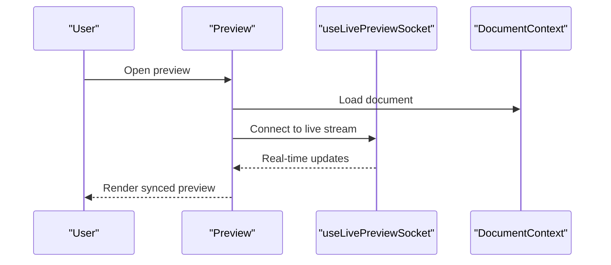

**Diagram sources**
- [Preview.jsx](file://frontend/src/components/Preview.jsx)
- [useLivePreviewSocket.js](file://frontend/src/hooks/useLivePreviewSocket.js)
- [DocumentContext.jsx](file://frontend/src/context/DocumentContext.jsx)

**Section sources**
- [Preview.jsx](file://frontend/src/components/Preview.jsx)
- [useLivePreviewSocket.js](file://frontend/src/hooks/useLivePreviewSocket.js)
- [DocumentContext.jsx](file://frontend/src/context/DocumentContext.jsx)

### Status Badges
- Purpose: Display concise status information with color coding.
- Reusability: Accepts status enum and optional icon; consistent across UI.
- Integration: Uses status constants and theme context.

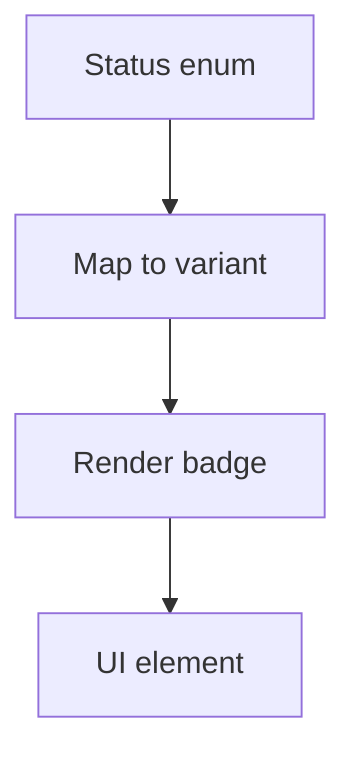

**Diagram sources**
- [StatusBadge.jsx](file://frontend/src/components/StatusBadge.jsx)
- [status.js](file://frontend/src/constants/status.js)

**Section sources**
- [StatusBadge.jsx](file://frontend/src/components/StatusBadge.jsx)
- [status.js](file://frontend/src/constants/status.js)

### Validation Cards
- Purpose: Summarize validation outcomes and suggest remediations.
- Reusability: Accepts results array and summary text; supports expandable details.
- Integration: Uses analytics and PostHog for validation events.

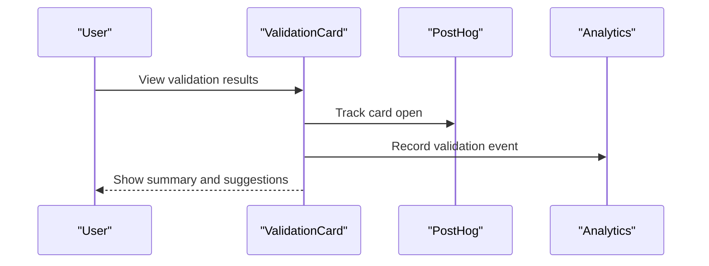

**Diagram sources**
- [ValidationCard.jsx](file://frontend/src/components/ValidationCard.jsx)
- [posthog.js](file://frontend/src/lib/posthog.js)
- [analytics.js](file://frontend/src/lib/analytics.js)

**Section sources**
- [ValidationCard.jsx](file://frontend/src/components/ValidationCard.jsx)
- [posthog.js](file://frontend/src/lib/posthog.js)
- [analytics.js](file://frontend/src/lib/analytics.js)

### Upgrade Modals
- Purpose: Encourage plan upgrades with feature comparisons and CTAs.
- Reusability: Accepts plan tiers and features; supports redirection after upgrade.
- Integration: Uses AuthContext for user state and analytics for conversion tracking.

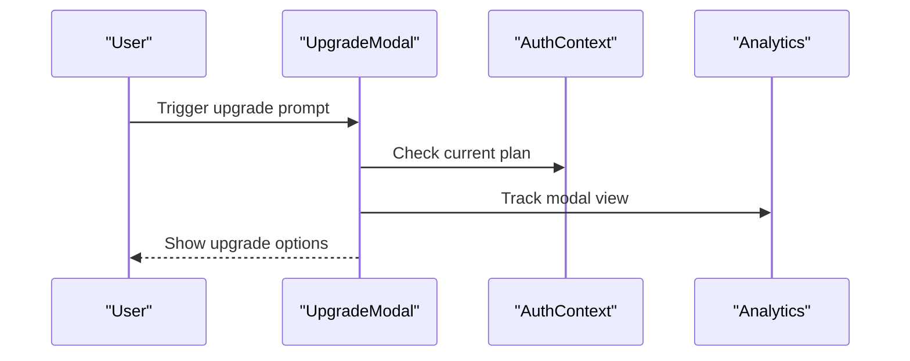

**Diagram sources**
- [UpgradeModal.jsx](file://frontend/src/components/UpgradeModal.jsx)
- [AuthContext.jsx](file://frontend/src/context/AuthContext.jsx)
- [analytics.js](file://frontend/src/lib/analytics.js)

**Section sources**
- [UpgradeModal.jsx](file://frontend/src/components/UpgradeModal.jsx)
- [AuthContext.jsx](file://frontend/src/context/AuthContext.jsx)
- [analytics.js](file://frontend/src/lib/analytics.js)

## Dependency Analysis
Utility components depend on shared contexts, hooks, and utilities. The following diagram shows key dependencies:

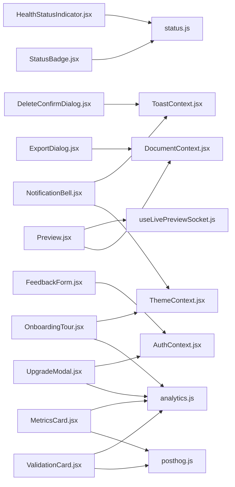

**Diagram sources**
- [DeleteConfirmDialog.jsx](file://frontend/src/components/DeleteConfirmDialog.jsx)
- [ExportDialog.jsx](file://frontend/src/components/ExportDialog.jsx)
- [FeedbackForm.jsx](file://frontend/src/components/FeedbackForm.jsx)
- [HealthStatusIndicator.jsx](file://frontend/src/components/HealthStatusIndicator.jsx)
- [MetricsCard.jsx](file://frontend/src/components/MetricsCard.jsx)
- [NotificationBell.jsx](file://frontend/src/components/NotificationBell.jsx)
- [OnboardingTour.jsx](file://frontend/src/components/OnboardingTour.jsx)
- [Preview.jsx](file://frontend/src/components/Preview.jsx)
- [StatusBadge.jsx](file://frontend/src/components/StatusBadge.jsx)
- [ValidationCard.jsx](file://frontend/src/components/ValidationCard.jsx)
- [UpgradeModal.jsx](file://frontend/src/components/UpgradeModal.jsx)
- [ToastContext.jsx](file://frontend/src/context/ToastContext.jsx)
- [ThemeContext.jsx](file://frontend/src/context/ThemeContext.jsx)
- [AuthContext.jsx](file://frontend/src/context/AuthContext.jsx)
- [DocumentContext.jsx](file://frontend/src/context/DocumentContext.jsx)
- [useLivePreviewSocket.js](file://frontend/src/hooks/useLivePreviewSocket.js)
- [analytics.js](file://frontend/src/lib/analytics.js)
- [posthog.js](file://frontend/src/lib/posthog.js)
- [status.js](file://frontend/src/constants/status.js)

**Section sources**
- [DeleteConfirmDialog.jsx](file://frontend/src/components/DeleteConfirmDialog.jsx)
- [ExportDialog.jsx](file://frontend/src/components/ExportDialog.jsx)
- [FeedbackForm.jsx](file://frontend/src/components/FeedbackForm.jsx)
- [HealthStatusIndicator.jsx](file://frontend/src/components/HealthStatusIndicator.jsx)
- [MetricsCard.jsx](file://frontend/src/components/MetricsCard.jsx)
- [NotificationBell.jsx](file://frontend/src/components/NotificationBell.jsx)
- [OnboardingTour.jsx](file://frontend/src/components/OnboardingTour.jsx)
- [Preview.jsx](file://frontend/src/components/Preview.jsx)
- [StatusBadge.jsx](file://frontend/src/components/StatusBadge.jsx)
- [ValidationCard.jsx](file://frontend/src/components/ValidationCard.jsx)
- [UpgradeModal.jsx](file://frontend/src/components/UpgradeModal.jsx)
- [ToastContext.jsx](file://frontend/src/context/ToastContext.jsx)
- [ThemeContext.jsx](file://frontend/src/context/ThemeContext.jsx)
- [AuthContext.jsx](file://frontend/src/context/AuthContext.jsx)
- [DocumentContext.jsx](file://frontend/src/context/DocumentContext.jsx)
- [useLivePreviewSocket.js](file://frontend/src/hooks/useLivePreviewSocket.js)
- [analytics.js](file://frontend/src/lib/analytics.js)
- [posthog.js](file://frontend/src/lib/posthog.js)
- [status.js](file://frontend/src/constants/status.js)

## Performance Considerations
- Prefer memoization for frequently rendered lists (metrics, notifications).
- Debounce or throttle real-time updates in preview and metrics components.
- Lazy-load heavy assets (PDFs, images) in export and preview flows.
- Use virtualized lists for long notification histories.
- Minimize re-renders by isolating state in local component state vs. global contexts.

## Accessibility and UX
- Keyboard navigation: Ensure focus order and trap focus in modals.
- ARIA: Use aria-live regions for dynamic metrics and notifications.
- Screen reader: Announce status changes and validation outcomes.
- Animations: Keep transitions subtle; respect motion preferences.
- Responsiveness: Use mobile-first breakpoints and touch-friendly targets.

## Troubleshooting Guide
- Export fails silently: Verify document context availability and network connectivity; check notifications for error messages.
- Preview not updating: Confirm WebSocket connection via live preview hook; verify document ID correctness.
- Tour not starting: Ensure steps array is properly configured and theme context is initialized.
- Validation card shows outdated results: Refresh validation stream and confirm analytics events are being emitted.
- Upgrade modal does not show: Check AuthContext for user plan and analytics integration.

**Section sources**
- [ExportDialog.jsx](file://frontend/src/components/ExportDialog.jsx)
- [Preview.jsx](file://frontend/src/components/Preview.jsx)
- [OnboardingTour.jsx](file://frontend/src/components/OnboardingTour.jsx)
- [ValidationCard.jsx](file://frontend/src/components/ValidationCard.jsx)
- [UpgradeModal.jsx](file://frontend/src/components/UpgradeModal.jsx)

## Conclusion
These utility components provide a cohesive, accessible, and reusable foundation for user interactions, feedback, health monitoring, notifications, onboarding, previews, status reporting, validation, upgrades, and exports. Their integration with global contexts, hooks, and analytics ensures consistent behavior and extensibility across the application.