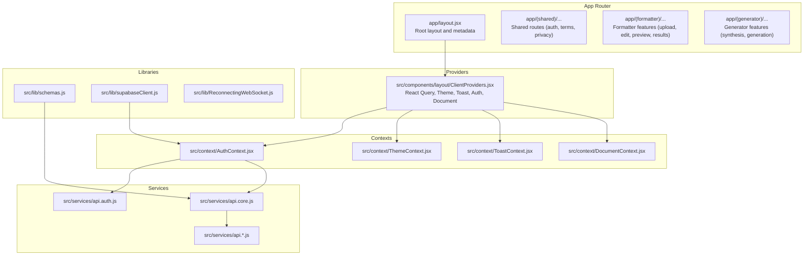
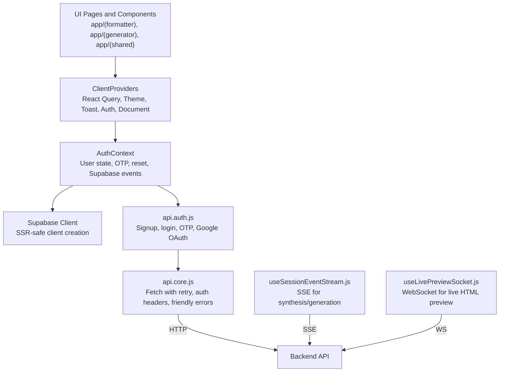
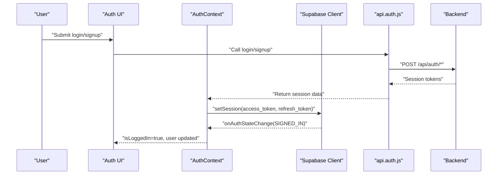
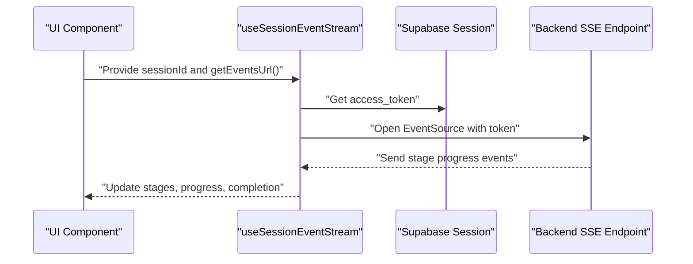
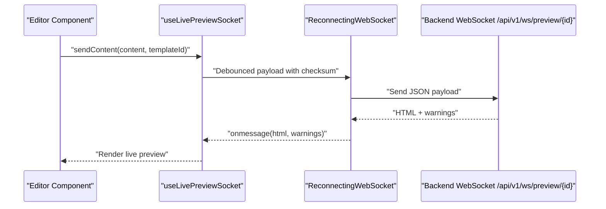
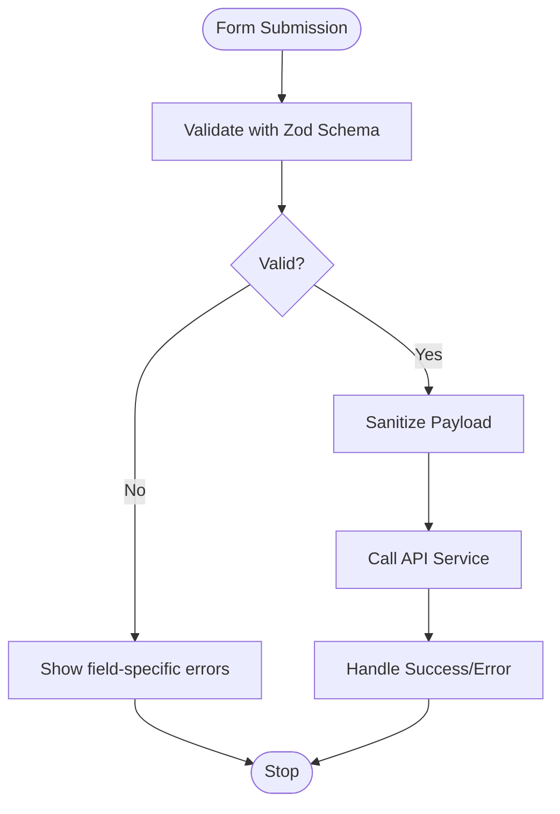
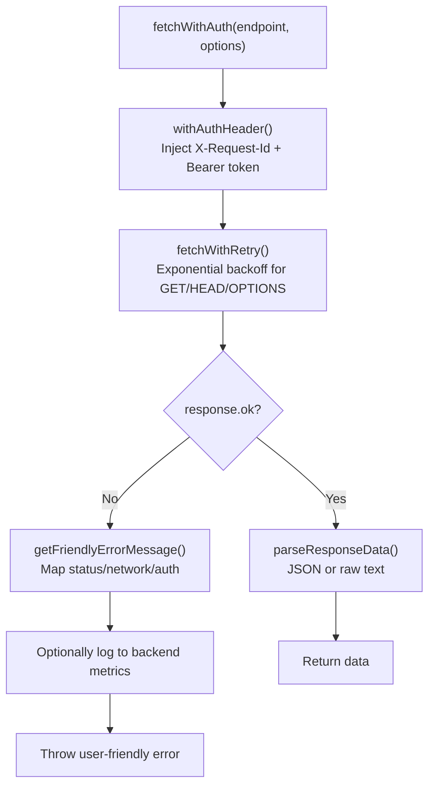
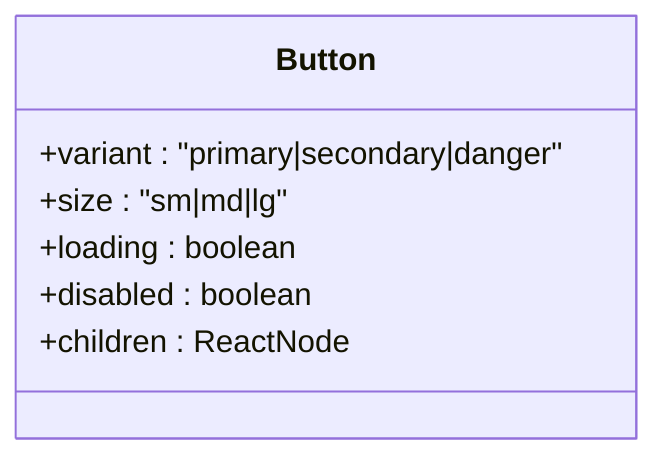
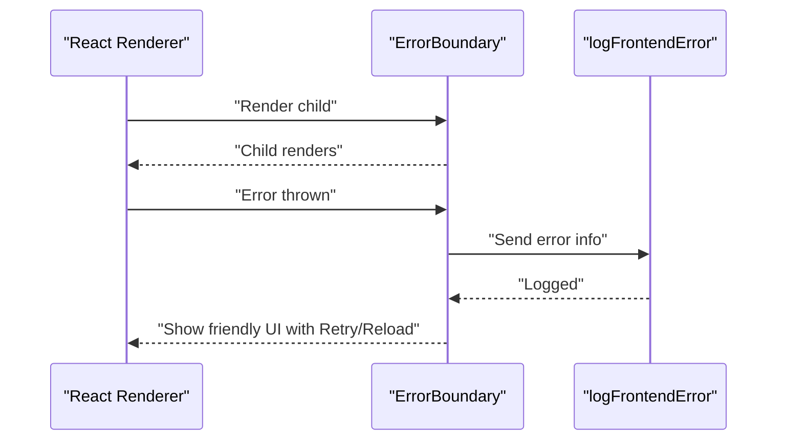
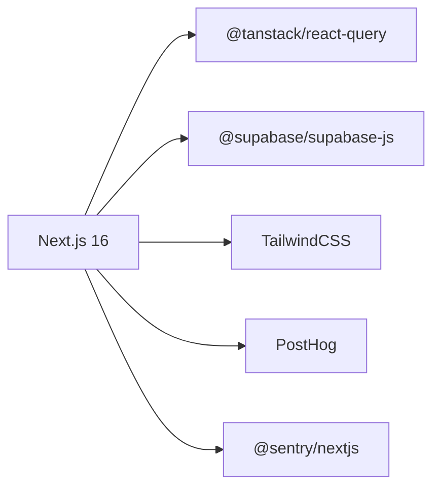

# Frontend Development

<cite>
**Referenced Files in This Document**
- [package.json](file://frontend/package.json)
- [next.config.mjs](file://frontend/next.config.mjs)
- [tailwind.config.js](file://frontend/tailwind.config.js)
- [RootLayout](file://frontend/app/layout.jsx)
- [ClientProviders](file://frontend/src/components/layout/ClientProviders.jsx)
- [AuthContext](file://frontend/src/context/AuthContext.jsx)
- [supabaseClient](file://frontend/src/lib/supabaseClient.js)
- [api.auth](file://frontend/src/services/api.auth.js)
- [api.core](file://frontend/src/services/api.core.js)
- [schemas](file://frontend/src/lib/schemas.js)
- [ErrorBoundary](file://frontend/src/components/ErrorBoundary.jsx)
- [useLivePreviewSocket](file://frontend/src/hooks/useLivePreviewSocket.js)
- [useSessionEventStream](file://frontend/src/hooks/useSessionEventStream.js)
- [useGeneratorSessionStream](file://frontend/src/hooks/useGeneratorSessionStream.js)
- [Button](file://frontend/src/components/ui/Button.jsx)
- [AuthCallback](file://frontend/app/(shared)/auth/callback/page.jsx)
</cite>

## Table of Contents
1. [Introduction](#introduction)
2. [Project Structure](#project-structure)
3. [Core Components](#core-components)
4. [Architecture Overview](#architecture-overview)
5. [Detailed Component Analysis](#detailed-component-analysis)
6. [Dependency Analysis](#dependency-analysis)
7. [Performance Considerations](#performance-considerations)
8. [Troubleshooting Guide](#troubleshooting-guide)
9. [Conclusion](#conclusion)
10. [Appendices](#appendices)

## Introduction
This document provides comprehensive frontend development guidance for the Next.js 14 application. It covers the App Router structure, page organization, component architecture, state management patterns, UI component library, form handling, real-time features, API integration strategies, authentication flow, context providers, React Query integration, and error boundary handling. It also includes component composition patterns, styling approaches with TailwindCSS, responsive design considerations, performance optimization techniques, accessibility compliance, cross-browser compatibility, and guidelines for extending the UI and adding new features.

## Project Structure
The frontend is organized under the Next.js App Router with route groups and shared pages. Key areas:
- app/: App Router pages and route groups for shared, formatter, and generator sections
- src/components/: Shared UI components and layout providers
- src/context/: Application-wide contexts (Auth, Theme, Toast, Document)
- src/hooks/: Custom hooks for real-time streams and uploads
- src/services/: API service modules for auth, core, documents, generation, and metrics
- src/lib/: Utility libraries (schemas, Supabase client, analytics)
- Styles: TailwindCSS configuration and global CSS

**Diagram sources**
- [RootLayout:32-83](file://frontend/app/layout.jsx#L32-L83)
- [ClientProviders:14-50](file://frontend/src/components/layout/ClientProviders.jsx#L14-L50)
- [AuthContext:16-339](file://frontend/src/context/AuthContext.jsx#L16-L339)
- [api.auth:1-39](file://frontend/src/services/api.auth.js#L1-L39)
- [api.core:1-368](file://frontend/src/services/api.core.js#L1-L368)
- [supabaseClient:1-24](file://frontend/src/lib/supabaseClient.js#L1-L24)
- [schemas:1-235](file://frontend/src/lib/schemas.js#L1-L235)

**Section sources**
- [RootLayout:1-84](file://frontend/app/layout.jsx#L1-L84)
- [ClientProviders:1-51](file://frontend/src/components/layout/ClientProviders.jsx#L1-L51)

## Core Components
- Root layout and metadata define fonts, theme color, OpenGraph/Twitter metadata, and accessibility skip link.
- ClientProviders initializes React Query, theme, toast, auth, document contexts, and analytics on route changes.
- AuthContext manages user session lifecycle, OTP flows, password reset, and Supabase integration with guarded auth state changes.
- Supabase client is conditionally exported based on environment variables to prevent SSR crashes.
- API core encapsulates request ID generation, sanitized payloads, retry logic, friendly error messages, and auth header injection.
- Real-time hooks support SSE-based event streams and WebSocket-based live preview with reconnection and debounced updates.

**Section sources**
- [RootLayout:12-83](file://frontend/app/layout.jsx#L12-L83)
- [ClientProviders:14-50](file://frontend/src/components/layout/ClientProviders.jsx#L14-L50)
- [AuthContext:16-339](file://frontend/src/context/AuthContext.jsx#L16-L339)
- [supabaseClient:1-24](file://frontend/src/lib/supabaseClient.js#L1-L24)
- [api.core:1-368](file://frontend/src/services/api.core.js#L1-L368)
- [useSessionEventStream:1-101](file://frontend/src/hooks/useSessionEventStream.js#L1-L101)
- [useLivePreviewSocket:1-137](file://frontend/src/hooks/useLivePreviewSocket.js#L1-L137)

## Architecture Overview
The frontend follows a layered architecture:
- Presentation Layer: App Router pages and UI components
- Provider Layer: ClientProviders composes contexts and React Query
- Services Layer: API modules encapsulate HTTP calls and retry logic
- Utilities Layer: Zod schemas, Supabase client, analytics, and helpers
- Real-time Layer: SSE and WebSocket integrations for streaming synthesis and live preview

**Diagram sources**
- [RootLayout:32-83](file://frontend/app/layout.jsx#L32-L83)
- [ClientProviders:14-50](file://frontend/src/components/layout/ClientProviders.jsx#L14-L50)
- [AuthContext:16-339](file://frontend/src/context/AuthContext.jsx#L16-L339)
- [supabaseClient:1-24](file://frontend/src/lib/supabaseClient.js#L1-L24)
- [api.auth:1-39](file://frontend/src/services/api.auth.js#L1-L39)
- [api.core:1-368](file://frontend/src/services/api.core.js#L1-L368)
- [useSessionEventStream:1-101](file://frontend/src/hooks/useSessionEventStream.js#L1-L101)
- [useLivePreviewSocket:1-137](file://frontend/src/hooks/useLivePreviewSocket.js#L1-L137)

## Detailed Component Analysis

### Authentication Flow and Context Providers
The authentication system integrates Supabase with a custom AuthContext to manage user state, OTP flows, and password resets. It listens to Supabase auth state changes, guards against race conditions during sign-in, and synchronizes local and Supabase storage.

**Diagram sources**
- [AuthContext:180-249](file://frontend/src/context/AuthContext.jsx#L180-L249)
- [api.auth:18-26](file://frontend/src/services/api.auth.js#L18-L26)
- [supabaseClient:1-24](file://frontend/src/lib/supabaseClient.js#L1-L24)

**Section sources**
- [AuthContext:16-339](file://frontend/src/context/AuthContext.jsx#L16-L339)
- [api.auth:1-39](file://frontend/src/services/api.auth.js#L1-L39)
- [supabaseClient:1-24](file://frontend/src/lib/supabaseClient.js#L1-L24)
- [AuthCallback](file://frontend/app/(shared)/auth/callback/page.jsx#L1-L121)

### Real-Time Features: SSE Streams and WebSocket Live Preview
Two real-time mechanisms are implemented:
- SSE-based synthesis/generation streams via useSessionEventStream
- WebSocket-based live preview via useLivePreviewSocket with exponential backoff and debounced content sending

**Diagram sources**
- [useSessionEventStream:1-101](file://frontend/src/hooks/useSessionEventStream.js#L1-L101)

**Diagram sources**
- [useLivePreviewSocket:1-137](file://frontend/src/hooks/useLivePreviewSocket.js#L1-L137)

**Section sources**
- [useSessionEventStream:1-101](file://frontend/src/hooks/useSessionEventStream.js#L1-L101)
- [useGeneratorSessionStream:1-12](file://frontend/src/hooks/useGeneratorSessionStream.js#L1-L12)
- [useLivePreviewSocket:1-137](file://frontend/src/hooks/useLivePreviewSocket.js#L1-L137)

### Form Handling and Validation
Form validation leverages Zod schemas for robust client-side validation aligned with backend expectations. Schemas cover user profiles, authentication, settings, uploads, feedback, agent sessions, synthesis sessions, and generator requests.

**Diagram sources**
- [schemas:1-235](file://frontend/src/lib/schemas.js#L1-L235)
- [api.core:60-83](file://frontend/src/services/api.core.js#L60-L83)

**Section sources**
- [schemas:1-235](file://frontend/src/lib/schemas.js#L1-L235)
- [api.core:60-83](file://frontend/src/services/api.core.js#L60-L83)

### API Integration Strategies
The API layer centralizes:
- Request ID generation for tracing
- Sanitized payloads to mitigate XSS/control chars
- Retry logic for safe HTTP methods and specific status codes
- Friendly error messages mapped from network, server, and auth errors
- Auth header injection using Supabase session with graceful fallback

**Diagram sources**
- [api.core:190-362](file://frontend/src/services/api.core.js#L190-L362)

**Section sources**
- [api.core:1-368](file://frontend/src/services/api.core.js#L1-L368)

### UI Component Library and Composition Patterns
The UI library emphasizes composability and consistency:
- Button component supports variants, sizes, loading states, and disabled states
- Composition pattern: wrap child components in providers to share state and services
- Tailwind utilities enable responsive design and theme-aware styling

**Diagram sources**
- [Button:23-57](file://frontend/src/components/ui/Button.jsx#L23-L57)

**Section sources**
- [Button:1-58](file://frontend/src/components/ui/Button.jsx#L1-L58)
- [ClientProviders:14-50](file://frontend/src/components/layout/ClientProviders.jsx#L14-L50)

### Error Boundary Handling
The ErrorBoundary component captures rendering errors, logs them to backend metrics, and offers user actions to retry or reload.

**Diagram sources**
- [ErrorBoundary:1-91](file://frontend/src/components/ErrorBoundary.jsx#L1-L91)

**Section sources**
- [ErrorBoundary:1-91](file://frontend/src/components/ErrorBoundary.jsx#L1-L91)

## Dependency Analysis
External dependencies and build optimizations:
- Next.js 16 with Sentry integration and Turbopack dev mode
- React Query for caching and background synchronization
- Supabase for auth and SSR-safe client creation
- TailwindCSS with form and container query plugins
- Tooling: Playwright for E2E, Vitest for unit tests, ESLint for linting

**Diagram sources**
- [package.json:17-36](file://frontend/package.json#L17-L36)
- [next.config.mjs:1-27](file://frontend/next.config.mjs#L1-L27)
- [tailwind.config.js:1-55](file://frontend/tailwind.config.js#L1-L55)

**Section sources**
- [package.json:1-62](file://frontend/package.json#L1-L62)
- [next.config.mjs:1-27](file://frontend/next.config.mjs#L1-L27)
- [tailwind.config.js:1-55](file://frontend/tailwind.config.js#L1-L55)

## Performance Considerations
- React Query defaults: short stale time, limited retries, window focus refetch disabled to reduce unnecessary network calls
- Optimizations: tree-shake heavy packages, optimize package imports for lucide-react and react-query
- Build: Sentry configuration with treeshaking and debug logging removal
- Real-time: Debounced WebSocket sends, exponential backoff, and SSE retry with capped attempts
- Accessibility: Skip-to-main-content link, semantic markup, and focus management via FocusManager

**Section sources**
- [ClientProviders:16-24](file://frontend/src/components/layout/ClientProviders.jsx#L16-L24)
- [next.config.mjs:7-11](file://frontend/next.config.mjs#L7-L11)
- [useLivePreviewSocket:48-102](file://frontend/src/hooks/useLivePreviewSocket.js#L48-L102)
- [useSessionEventStream:20-97](file://frontend/src/hooks/useSessionEventStream.js#L20-L97)

## Troubleshooting Guide
Common issues and resolutions:
- Supabase environment variables missing: client is null; guard all Supabase-dependent code
- Auth race conditions: signingInRef prevents clearing state during sign-in/sign-up
- Network errors: friendly messages map to user-friendly strings; inspect status codes and retry behavior
- Real-time connectivity: SSE and WebSocket implement retry/backoff; monitor reconnectAttempt and isReconnecting
- Error boundaries: use Retry/Reload buttons; backend error logs are sent for diagnostics

**Section sources**
- [supabaseClient:1-24](file://frontend/src/lib/supabaseClient.js#L1-L24)
- [AuthContext:23-23](file://frontend/src/context/AuthContext.jsx#L23-L23)
- [api.core:85-188](file://frontend/src/services/api.core.js#L85-L188)
- [useLivePreviewSocket:91-102](file://frontend/src/hooks/useLivePreviewSocket.js#L91-L102)
- [useSessionEventStream:76-97](file://frontend/src/hooks/useSessionEventStream.js#L76-L97)
- [ErrorBoundary:20-30](file://frontend/src/components/ErrorBoundary.jsx#L20-L30)

## Conclusion
The frontend leverages Next.js 14’s App Router, a layered provider architecture, robust API integration with retry and sanitization, and real-time capabilities via SSE and WebSocket. The design emphasizes accessibility, responsive styling with TailwindCSS, and maintainability through Zod schemas and context providers. Extending the UI and adding features should follow established patterns: compose providers, use Zod schemas for validation, integrate APIs via api.core, and implement real-time features with the existing hooks.

## Appendices

### Styling Approaches with TailwindCSS
- Dark mode via class strategy
- Extended theme: custom colors, border radius, transition timing, and display font
- Plugins: forms and container queries
- Global styles: background and text color classes applied at the root body

**Section sources**
- [tailwind.config.js:1-55](file://frontend/tailwind.config.js#L1-L55)
- [RootLayout:61-83](file://frontend/app/layout.jsx#L61-L83)

### Responsive Design Considerations
- Mobile-first approach with Tailwind utilities
- Container queries enabled for flexible layouts
- Accessible focus styles and skip links for keyboard navigation

**Section sources**
- [tailwind.config.js:1-55](file://frontend/tailwind.config.js#L1-L55)
- [RootLayout:71-76](file://frontend/app/layout.jsx#L71-L76)

### Cross-Browser Compatibility
- UUID generation falls back to Math.random() when crypto.randomUUID is unavailable
- WebSocket and EventSource supported across modern browsers; reconnect logic accommodates flaky connections

**Section sources**
- [api.core:21-30](file://frontend/src/services/api.core.js#L21-L30)
- [useLivePreviewSocket:48-102](file://frontend/src/hooks/useLivePreviewSocket.js#L48-L102)
- [useSessionEventStream:38-87](file://frontend/src/hooks/useSessionEventStream.js#L38-L87)

### Guidelines for Extending the UI and Adding New Features
- Add new pages under the appropriate route group (shared/formatter/generator) following the existing patterns
- Wrap new pages/components with ClientProviders to access contexts and React Query
- Define Zod schemas for new forms and reuse sanitizePayload for consistent data hygiene
- Integrate with api.core for HTTP calls; leverage fetchWithRetry and friendly error messages
- For real-time features, choose SSE via useSessionEventStream or WebSocket via useLivePreviewSocket depending on backend endpoints
- Maintain accessibility: semantic HTML, ARIA attributes, focus management, and keyboard navigation
- Keep styling consistent with Tailwind utilities and theme tokens

**Section sources**
- [ClientProviders:14-50](file://frontend/src/components/layout/ClientProviders.jsx#L14-L50)
- [schemas:1-235](file://frontend/src/lib/schemas.js#L1-L235)
- [api.core:190-362](file://frontend/src/services/api.core.js#L190-L362)
- [useSessionEventStream:1-101](file://frontend/src/hooks/useSessionEventStream.js#L1-L101)
- [useLivePreviewSocket:1-137](file://frontend/src/hooks/useLivePreviewSocket.js#L1-L137)