# Next.js Application Structure

<cite>
**Referenced Files in This Document**
- [package.json](file://frontend/package.json)
- [next.config.mjs](file://frontend/next.config.mjs)
- [tsconfig.json](file://frontend/tsconfig.json)
- [.eslintrc.cjs](file://frontend/.eslintrc.cjs)
- [tailwind.config.js](file://frontend/tailwind.config.js)
- [postcss.config.js](file://frontend/postcss.config.js)
- [jsconfig.json](file://frontend/jsconfig.json)
- [app/layout.jsx](file://frontend/app/layout.jsx)
- [app/globals.css](file://frontend/app/globals.css)
- [src/components/layout/ClientProviders.jsx](file://frontend/src/components/layout/ClientProviders.jsx)
- [src/context/ThemeContext.jsx](file://frontend/src/context/ThemeContext.jsx)
- [src/context/AuthContext.jsx](file://frontend/src/context/AuthContext.jsx)
- [src/components/layout/FocusManager.jsx](file://frontend/src/components/layout/FocusManager.jsx)
- [src/components/layout/DynamicMeta.jsx](file://frontend/src/components/layout/DynamicMeta.jsx)
- [app/not-found.jsx](file://frontend/app/not-found.jsx)
- [app/(shared)/layout.jsx](file://frontend/app/(shared)/layout.jsx)
- [app/(shared)/page.jsx](file://frontend/app/(shared)/page.jsx)
</cite>

## Table of Contents
1. [Introduction](#introduction)
2. [Project Structure](#project-structure)
3. [Core Components](#core-components)
4. [Architecture Overview](#architecture-overview)
5. [Detailed Component Analysis](#detailed-component-analysis)
6. [Dependency Analysis](#dependency-analysis)
7. [Performance Considerations](#performance-considerations)
8. [Troubleshooting Guide](#troubleshooting-guide)
9. [Conclusion](#conclusion)
10. [Appendices](#appendices)

## Introduction
This document explains the Next.js 14 application structure for the frontend, focusing on the App Router configuration, page organization patterns, routing architecture, and foundational setup. It covers the root layout, metadata and viewport configuration, font loading strategies, global CSS and theme configuration, accessibility features, TypeScript and ESLint setup, build optimization, client-side providers, hydration handling, SSR/SSG considerations, and practical guidelines for maintaining the structure and adding new pages.

## Project Structure
The frontend follows Next.js App Router conventions with a strict file-based routing hierarchy under the app directory. The project uses:
- App Router with route groups for logical separation of feature areas
- Root layout with metadata, viewport, fonts, and global CSS
- Client providers for state management and analytics
- Tailwind CSS for styling with custom design tokens
- TypeScript and ESLint for type safety and code quality
- Sentry integration for build-time and runtime observability

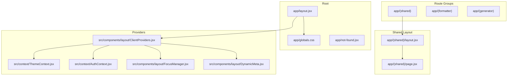

**Diagram sources**
- [app/layout.jsx:1-84](file://frontend/app/layout.jsx#L1-L84)
- [app/globals.css:1-137](file://frontend/app/globals.css#L1-L137)
- [app/not-found.jsx:1-31](file://frontend/app/not-found.jsx#L1-L31)
- [app/(shared)/layout.jsx](file://frontend/app/(shared)/layout.jsx#L1-L6)
- [app/(shared)/page.jsx](file://frontend/app/(shared)/page.jsx#L1-L583)
- [src/components/layout/ClientProviders.jsx:1-51](file://frontend/src/components/layout/ClientProviders.jsx#L1-L51)
- [src/context/ThemeContext.jsx:1-70](file://frontend/src/context/ThemeContext.jsx#L1-L70)
- [src/context/AuthContext.jsx:1-340](file://frontend/src/context/AuthContext.jsx#L1-L340)
- [src/components/layout/FocusManager.jsx:1-22](file://frontend/src/components/layout/FocusManager.jsx#L1-L22)
- [src/components/layout/DynamicMeta.jsx:1-17](file://frontend/src/components/layout/DynamicMeta.jsx#L1-L17)

**Section sources**
- [app/layout.jsx:1-84](file://frontend/app/layout.jsx#L1-L84)
- [app/globals.css:1-137](file://frontend/app/globals.css#L1-L137)
- [app/not-found.jsx:1-31](file://frontend/app/not-found.jsx#L1-L31)
- [app/(shared)/layout.jsx](file://frontend/app/(shared)/layout.jsx#L1-L6)
- [app/(shared)/page.jsx](file://frontend/app/(shared)/page.jsx#L1-L583)

## Core Components
- Root layout and metadata: Defines site-wide metadata, viewport, font loading, and global CSS. Includes a skip link for accessibility and a ClientProviders wrapper for state and analytics.
- Client providers: Compose React Query, Theme, Toast, Auth, and Document contexts, plus focus management and dynamic meta updates.
- Theme context: Integrates next-themes with Supabase user preferences for persistent theme synchronization.
- Auth context: Implements robust session initialization, Supabase auth state synchronization, and secure sign-in/sign-out flows.
- Global CSS and Tailwind: Provides design tokens, dark mode styles, and component-level overrides.
- Routing and fallbacks: Uses route groups for feature separation and a shared layout for common shell. Implements a custom 404 page.

**Section sources**
- [app/layout.jsx:1-84](file://frontend/app/layout.jsx#L1-L84)
- [src/components/layout/ClientProviders.jsx:1-51](file://frontend/src/components/layout/ClientProviders.jsx#L1-L51)
- [src/context/ThemeContext.jsx:1-70](file://frontend/src/context/ThemeContext.jsx#L1-L70)
- [src/context/AuthContext.jsx:1-340](file://frontend/src/context/AuthContext.jsx#L1-L340)
- [app/globals.css:1-137](file://frontend/app/globals.css#L1-L137)
- [tailwind.config.js:1-55](file://frontend/tailwind.config.js#L1-L55)

## Architecture Overview
The application architecture centers around a root layout that injects global assets and a client-side provider stack. Providers encapsulate state and cross-cutting concerns, enabling predictable SSR/SSG behavior and safe client hydration.

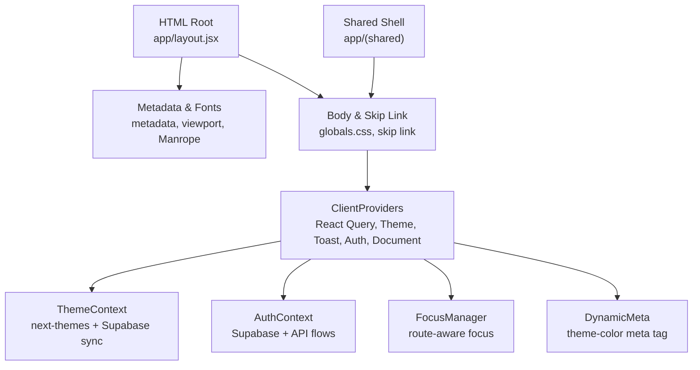

**Diagram sources**
- [app/layout.jsx:1-84](file://frontend/app/layout.jsx#L1-L84)
- [src/components/layout/ClientProviders.jsx:1-51](file://frontend/src/components/layout/ClientProviders.jsx#L1-L51)
- [src/context/ThemeContext.jsx:1-70](file://frontend/src/context/ThemeContext.jsx#L1-L70)
- [src/context/AuthContext.jsx:1-340](file://frontend/src/context/AuthContext.jsx#L1-L340)
- [src/components/layout/FocusManager.jsx:1-22](file://frontend/src/components/layout/FocusManager.jsx#L1-L22)
- [src/components/layout/DynamicMeta.jsx:1-17](file://frontend/src/components/layout/DynamicMeta.jsx#L1-L17)
- [app/(shared)/layout.jsx](file://frontend/app/(shared)/layout.jsx#L1-L6)

## Detailed Component Analysis

### Root Layout and Metadata
- Font loading: Uses next/font/google to self-host Manrope with subset loading and swap display to avoid layout shift.
- Metadata and Open Graph: Centralized metadata and Twitter cards configured at the root level.
- Viewport: Sets themeColor for dynamic meta updates.
- Global CSS: Imports Tailwind directives and project-specific styles.
- Accessibility: Adds a skip-to-main-content link for keyboard/screen reader users.
- Client providers: Wraps children with ClientProviders to enable client-side state and analytics.

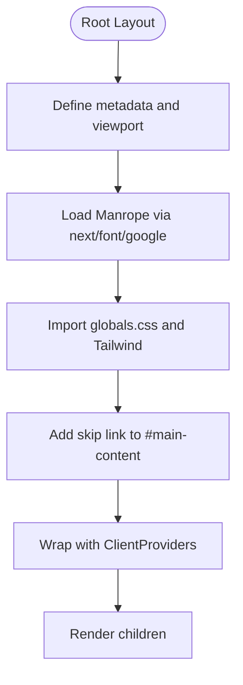

**Diagram sources**
- [app/layout.jsx:1-84](file://frontend/app/layout.jsx#L1-L84)
- [app/globals.css:1-137](file://frontend/app/globals.css#L1-L137)

**Section sources**
- [app/layout.jsx:1-84](file://frontend/app/layout.jsx#L1-L84)
- [app/globals.css:1-137](file://frontend/app/globals.css#L1-L137)

### Client Providers Pattern
- Composition: React Query client, Theme provider, Toast provider, Auth provider, Document provider, FocusManager, and DynamicMeta.
- Query client defaults: Stale time, window focus behavior, and retry policy configured for optimal UX.
- Analytics: Initializes PostHog on mount and tracks page views per pathname.
- Hydration: Provider order ensures proper hydration of theme, auth, and UI state.

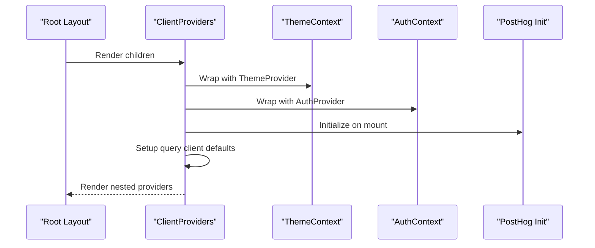

**Diagram sources**
- [src/components/layout/ClientProviders.jsx:1-51](file://frontend/src/components/layout/ClientProviders.jsx#L1-L51)
- [src/context/ThemeContext.jsx:1-70](file://frontend/src/context/ThemeContext.jsx#L1-L70)
- [src/context/AuthContext.jsx:1-340](file://frontend/src/context/AuthContext.jsx#L1-L340)

**Section sources**
- [src/components/layout/ClientProviders.jsx:1-51](file://frontend/src/components/layout/ClientProviders.jsx#L1-L51)

### Theme Context and Supabase Sync
- next-themes integration: Enables light/dark theme switching without system preference reliance.
- Remote sync: Reads user theme preference from Supabase session metadata and synchronizes local theme.
- Persistence: Updates user metadata when toggling themes for cross-session consistency.

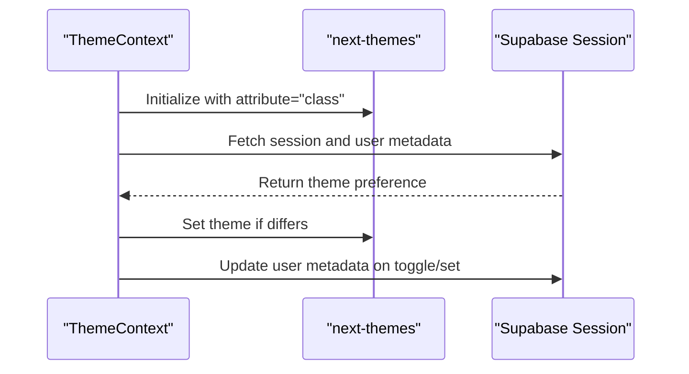

**Diagram sources**
- [src/context/ThemeContext.jsx:1-70](file://frontend/src/context/ThemeContext.jsx#L1-L70)

**Section sources**
- [src/context/ThemeContext.jsx:1-70](file://frontend/src/context/ThemeContext.jsx#L1-L70)

### Authentication Context and Supabase Integration
- Initialization: Validates cached sessions via getSession and getUser to ensure cryptographic trust.
- Auth listeners: Subscribes to onAuthStateChange to keep React state synchronized with Supabase events.
- Sign-in/sign-up: Uses API wrappers and sets Supabase session tokens, managing a guard flag to avoid race conditions.
- Sign-out: Clears local and Supabase auth storage, optionally redirects to login.
- Utilities: OTP flows, password reset, and session refresh helpers.

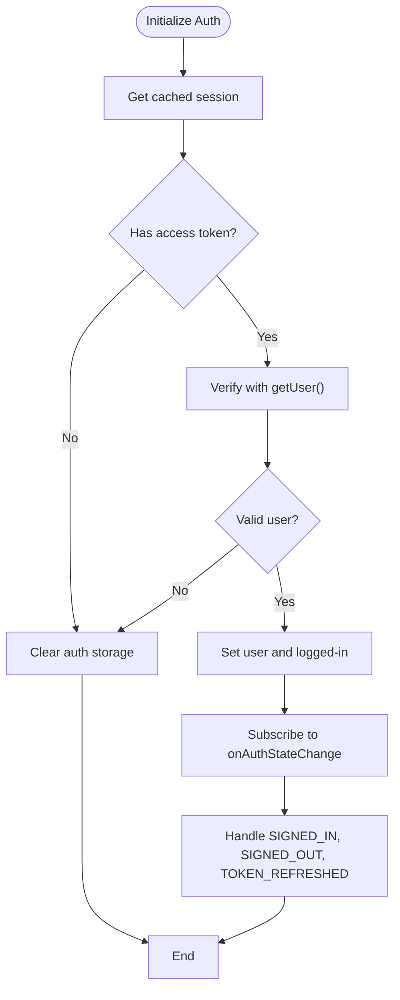

**Diagram sources**
- [src/context/AuthContext.jsx:1-340](file://frontend/src/context/AuthContext.jsx#L1-L340)

**Section sources**
- [src/context/AuthContext.jsx:1-340](file://frontend/src/context/AuthContext.jsx#L1-L340)

### Accessibility: Focus Management and Dynamic Meta
- FocusManager: Shifts focus to the main content element after route transitions to improve screen reader experience.
- DynamicMeta: Updates the theme-color meta tag based on current theme for better mobile browser theming.

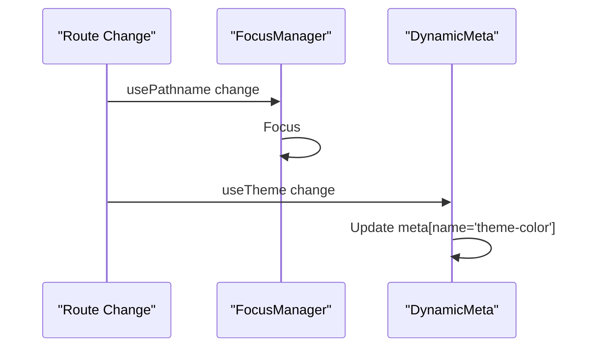

**Diagram sources**
- [src/components/layout/FocusManager.jsx:1-22](file://frontend/src/components/layout/FocusManager.jsx#L1-L22)
- [src/components/layout/DynamicMeta.jsx:1-17](file://frontend/src/components/layout/DynamicMeta.jsx#L1-L17)

**Section sources**
- [src/components/layout/FocusManager.jsx:1-22](file://frontend/src/components/layout/FocusManager.jsx#L1-L22)
- [src/components/layout/DynamicMeta.jsx:1-17](file://frontend/src/components/layout/DynamicMeta.jsx#L1-L17)

### Routing Architecture and Page Organization
- Route groups: Feature-based grouping under (formatter), (generator), and (shared) to organize related routes.
- Shared layout: Wraps common shell components for non-authenticated or shared sections.
- Landing page: Demonstrates client-side interactivity, animations, and scroll-aware effects.
- 404 handling: Custom client component for not-found pages with navigation controls.

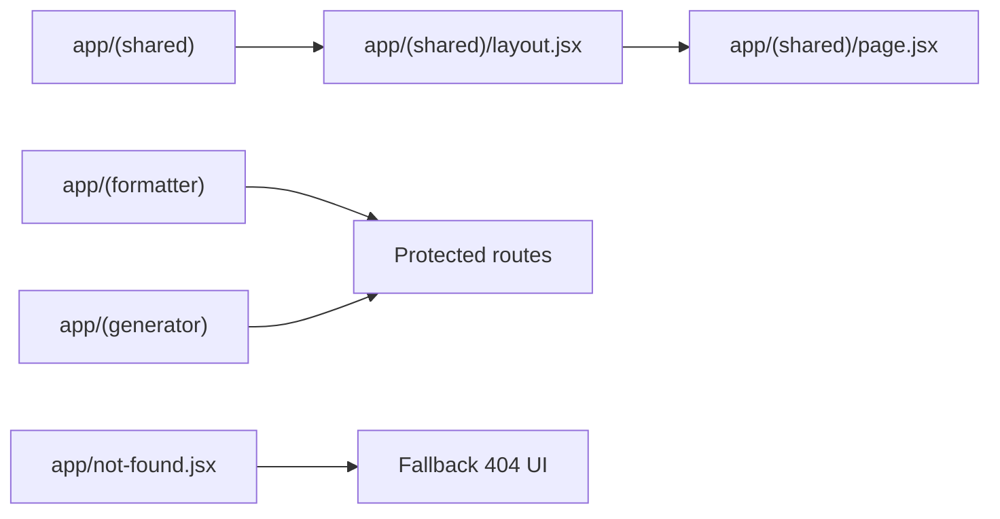

**Diagram sources**
- [app/(shared)/layout.jsx](file://frontend/app/(shared)/layout.jsx#L1-L6)
- [app/(shared)/page.jsx](file://frontend/app/(shared)/page.jsx#L1-L583)
- [app/not-found.jsx:1-31](file://frontend/app/not-found.jsx#L1-L31)

**Section sources**
- [app/(shared)/layout.jsx](file://frontend/app/(shared)/layout.jsx#L1-L6)
- [app/(shared)/page.jsx](file://frontend/app/(shared)/page.jsx#L1-L583)
- [app/not-found.jsx:1-31](file://frontend/app/not-found.jsx#L1-L31)

### Global CSS, Tailwind, and Design Tokens
- Tailwind setup: Content scanning across app, src, and components directories; dark mode via class strategy.
- Design tokens: CSS custom properties for glass surfaces and surface ladder colors; dark mode variants.
- Component-level overrides: Sidebar, appshell, and interactive states tailored for light/dark modes.

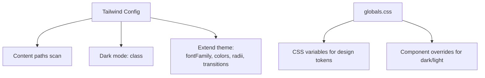

**Diagram sources**
- [tailwind.config.js:1-55](file://frontend/tailwind.config.js#L1-L55)
- [app/globals.css:1-137](file://frontend/app/globals.css#L1-L137)

**Section sources**
- [tailwind.config.js:1-55](file://frontend/tailwind.config.js#L1-L55)
- [app/globals.css:1-137](file://frontend/app/globals.css#L1-L137)

### TypeScript, ESLint, and Build Configuration
- TypeScript: Bundler module resolution, JSX transform, path aliases, and strictness settings.
- ESLint: Recommended base rules, React and React Hooks plugins, ignores dist/node_modules/.next/coverage, and environment overrides for config files and tests.
- Next.js config: React strict mode, transpile specific packages, optimize imports for heavy libraries, Sentry integration with build options.

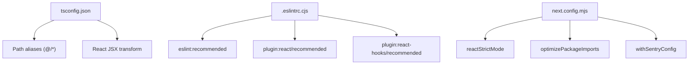

**Diagram sources**
- [tsconfig.json:1-48](file://frontend/tsconfig.json#L1-L48)
- [.eslintrc.cjs:1-65](file://frontend/.eslintrc.cjs#L1-L65)
- [next.config.mjs:1-27](file://frontend/next.config.mjs#L1-L27)

**Section sources**
- [tsconfig.json:1-48](file://frontend/tsconfig.json#L1-L48)
- [.eslintrc.cjs:1-65](file://frontend/.eslintrc.cjs#L1-L65)
- [next.config.mjs:1-27](file://frontend/next.config.mjs#L1-L27)

## Dependency Analysis
Key external dependencies and their roles:
- next: App Router, SSR/SSG, metadata, viewport, font optimization
- next-themes: Client-side theme management with class-based dark mode
- @supabase/supabase-js: Authentication, session management, and user metadata persistence
- @tanstack/react-query: Client-side caching, invalidation, and background updates
- lucide-react, framer-motion, react-resizable-panels: UI primitives and interactions
- tailwindcss, postcss, autoprefixer: Styling pipeline and design system
- @sentry/nextjs: Build-time and runtime error monitoring

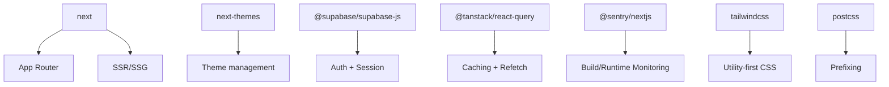

**Diagram sources**
- [package.json:1-62](file://frontend/package.json#L1-L62)
- [next.config.mjs:1-27](file://frontend/next.config.mjs#L1-L27)

**Section sources**
- [package.json:1-62](file://frontend/package.json#L1-L62)
- [next.config.mjs:1-27](file://frontend/next.config.mjs#L1-L27)

## Performance Considerations
- Package optimization: next.config.mjs enables optimizePackageImports for lucide-react, framer-motion, and @tanstack/react-query to tree-shake unused exports.
- Transpilation: Specific packages are transpiled to improve compatibility and reduce bundle size.
- Font strategy: next/font/google with display: swap and subset loading minimizes CLS and improves LCP.
- Client providers: React Query defaults reduce unnecessary refetches and stabilize UI updates.
- Tailwind purging: Content scanning scopes generated CSS to actual usage, reducing payload.

[No sources needed since this section provides general guidance]

## Troubleshooting Guide
- Authentication race condition: AuthContext guards against clearing state during sign-in/sign-up by using a ref flag to ignore SIGNED_OUT events during active auth transitions.
- Session verification: Initialization verifies cached sessions via getUser to prevent stale tokens from persisting.
- Supabase storage cleanup: Dedicated functions clear sb-* auth-token keys from localStorage/sessionStorage to avoid mixed states.
- 404 handling: Custom not-found.jsx provides navigational buttons to return home or go back, improving UX on broken links.
- Hydration warnings: Root layout includes suppressHydrationWarning on html to minimize mismatches when theme or meta tags are applied.

**Section sources**
- [src/context/AuthContext.jsx:1-340](file://frontend/src/context/AuthContext.jsx#L1-L340)
- [app/not-found.jsx:1-31](file://frontend/app/not-found.jsx#L1-L31)
- [app/layout.jsx:1-84](file://frontend/app/layout.jsx#L1-L84)

## Conclusion
The Next.js 14 application employs a clean, scalable structure leveraging the App Router’s route groups, centralized metadata and viewport configuration, and a robust client provider stack. The integration of next-themes, Supabase auth, React Query, and Tailwind establishes a strong foundation for theme persistence, user state management, data caching, and consistent styling. The project’s TypeScript and ESLint configurations enforce code quality, while next.config.mjs and Sentry optimize builds and observability. Following the guidelines below will help maintain and extend the application effectively.

## Appendices

### Guidelines for Maintaining the Application Structure
- Add new pages under appropriate route groups (e.g., (formatter), (generator), (shared)) to preserve logical separation.
- Use the shared layout for common shell components and wrap pages with minimal markup to keep routing predictable.
- Place global styles in app/globals.css and extend Tailwind via tailwind.config.js; avoid ad-hoc CSS in components.
- Introduce new providers in ClientProviders.jsx only when they benefit the entire app; otherwise, scope providers to specific pages or components.
- Keep metadata and viewport in the root layout; override selectively in pages only when necessary.

### Guidelines for Adding New Pages
- Create a new route under the intended group (e.g., app/(formatter)/... or app/(generator)/...).
- Use the shared layout for pages that share common UI shells.
- For authenticated routes, wrap with AuthGuard or similar protection at the route group level.
- Leverage useTheme and useAuth hooks from ThemeContext and AuthContext for theme and auth-aware rendering.
- Add analytics page view tracking in ClientProviders.jsx if the page warrants it.

[No sources needed since this section provides general guidance]