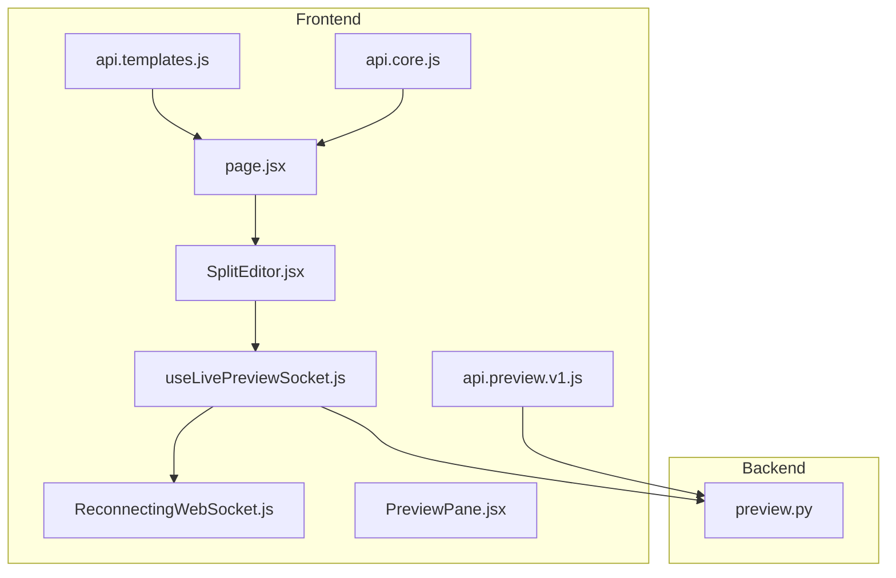
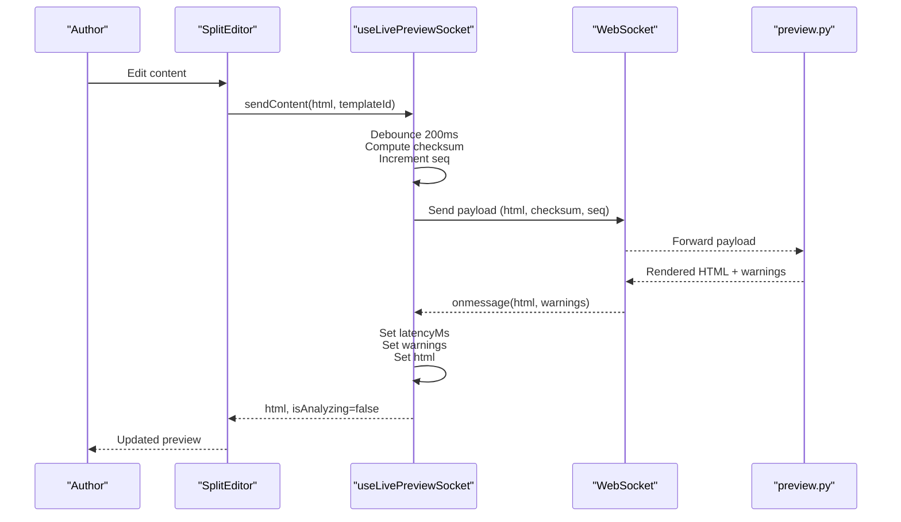
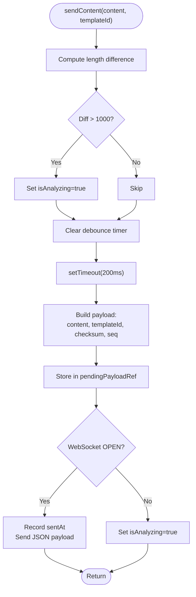
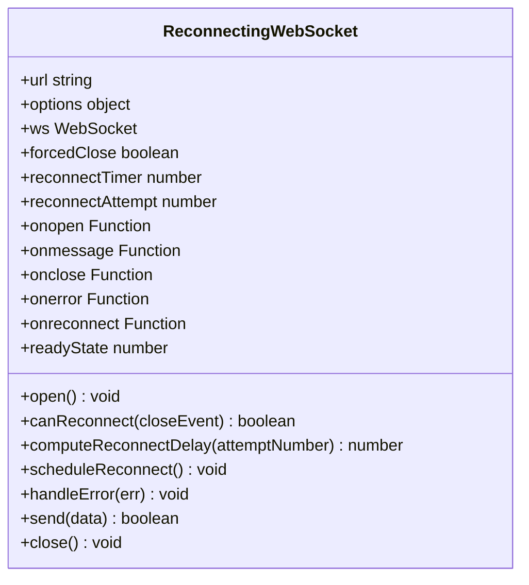
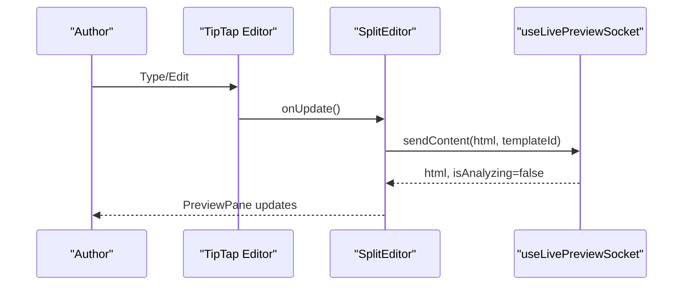
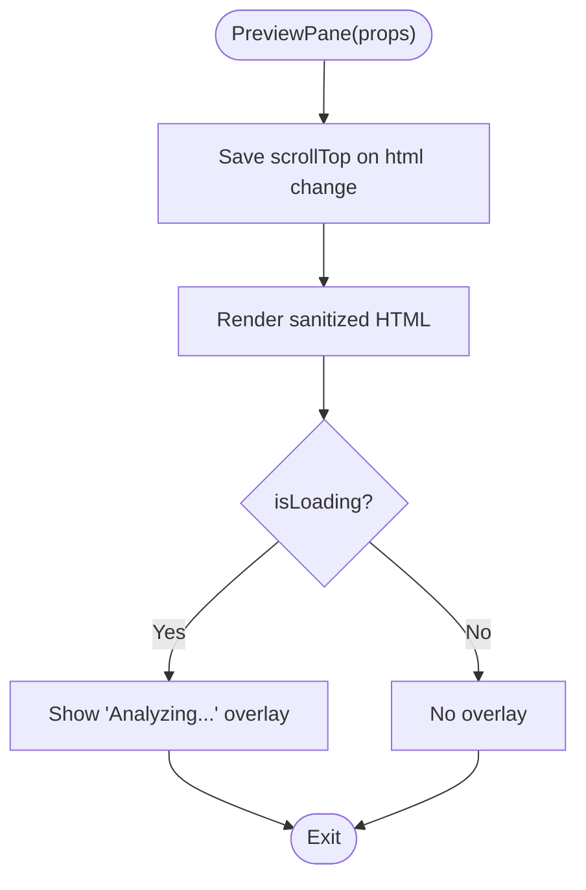
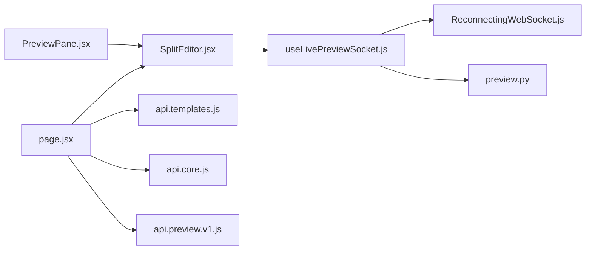

# Live Preview System

<cite>
**Referenced Files in This Document**
- [useLivePreviewSocket.js](file://frontend/src/hooks/useLivePreviewSocket.js)
- [ReconnectingWebSocket.js](file://frontend/src/lib/ReconnectingWebSocket.js)
- [SplitEditor.jsx](file://frontend/src/components/live-preview/SplitEditor.jsx)
- [PreviewPane.jsx](file://frontend/src/components/live-preview/PreviewPane.jsx)
- [page.jsx](file://frontend/app/(formatter)/live/page.jsx)
- [preview.py](file://backend/app/routers/preview.py)
- [api.preview.v1.js](file://frontend/src/services/api.preview.v1.js)
- [api.templates.js](file://frontend/src/services/api.templates.js)
- [api.core.js](file://frontend/src/services/api.core.js)
</cite>

## Table of Contents
1. [Introduction](#introduction)
2. [Project Structure](#project-structure)
3. [Core Components](#core-components)
4. [Architecture Overview](#architecture-overview)
5. [Detailed Component Analysis](#detailed-component-analysis)
6. [Dependency Analysis](#dependency-analysis)
7. [Performance Considerations](#performance-considerations)
8. [Troubleshooting Guide](#troubleshooting-guide)
9. [Conclusion](#conclusion)
10. [Appendices](#appendices)

## Introduction
This document describes the live preview system that powers real-time HTML rendering during manuscript authoring. It covers the WebSocket-based communication, the React hooks and components that manage state and rendering, the debounced content sending mechanism, latency tracking, warning propagation, optimistic rendering, and performance optimizations. It also provides guidance for extending the system and handling edge cases such as large content updates.

## Project Structure
The live preview system spans frontend React components and hooks, a WebSocket client with reconnection logic, and backend endpoints for live preview rendering and event forwarding.

**Diagram sources**
- [useLivePreviewSocket.js:1-137](file://frontend/src/hooks/useLivePreviewSocket.js#L1-L137)
- [ReconnectingWebSocket.js:1-148](file://frontend/src/lib/ReconnectingWebSocket.js#L1-L148)
- [SplitEditor.jsx:1-204](file://frontend/src/components/live-preview/SplitEditor.jsx#L1-L204)
- [PreviewPane.jsx:1-81](file://frontend/src/components/live-preview/PreviewPane.jsx#L1-L81)
- [page.jsx:1-28](file://frontend/app/(formatter)/live/page.jsx#L1-L28)
- [preview.py:51-75](file://backend/app/routers/preview.py#L51-L75)
- [api.preview.v1.js](file://frontend/src/services/api.preview.v1.js)
- [api.templates.js](file://frontend/src/services/api.templates.js)
- [api.core.js](file://frontend/src/services/api.core.js)

**Section sources**
- [useLivePreviewSocket.js:1-137](file://frontend/src/hooks/useLivePreviewSocket.js#L1-L137)
- [ReconnectingWebSocket.js:1-148](file://frontend/src/lib/ReconnectingWebSocket.js#L1-L148)
- [SplitEditor.jsx:1-204](file://frontend/src/components/live-preview/SplitEditor.jsx#L1-L204)
- [PreviewPane.jsx:1-81](file://frontend/src/components/live-preview/PreviewPane.jsx#L1-L81)
- [page.jsx:1-28](file://frontend/app/(formatter)/live/page.jsx#L1-L28)
- [preview.py:51-75](file://backend/app/routers/preview.py#L51-L75)

## Core Components
- useLivePreviewSocket: Manages WebSocket connection, debounced content sending, latency measurement, warnings, and optimistic UI state.
- ReconnectingWebSocket: Provides exponential backoff with jitter and lifecycle callbacks for reconnection.
- SplitEditor: Resizable two-pane editor and preview, integrates with the WebSocket hook and TipTap editor.
- PreviewPane: Renders sanitized HTML in a document-like container with scroll preservation and an "Analyzing" overlay.
- Backend preview router: Exposes live preview rendering and WebSocket channels for real-time updates.

Key responsibilities:
- State management: HTML content, latencyMs, warnings, connection status, reconnect attempts, and analysis state.
- Content synchronization: Debounced sending of HTML content with checksum and sequence number.
- Optimistic rendering: Immediate UI updates while awaiting server response.
- Cursor handling: Placeholder for cursor position in payload (currently null).
- Warning display: Warnings received via WebSocket are surfaced to the UI.

**Section sources**
- [useLivePreviewSocket.js:28-136](file://frontend/src/hooks/useLivePreviewSocket.js#L28-L136)
- [ReconnectingWebSocket.js:5-148](file://frontend/src/lib/ReconnectingWebSocket.js#L5-L148)
- [SplitEditor.jsx:97-204](file://frontend/src/components/live-preview/SplitEditor.jsx#L97-L204)
- [PreviewPane.jsx:20-81](file://frontend/src/components/live-preview/PreviewPane.jsx#L20-L81)
- [preview.py:51-75](file://backend/app/routers/preview.py#L51-L75)

## Architecture Overview
The live preview system uses a WebSocket connection to stream rendered HTML from the backend to the frontend. The frontend sends content periodically (debounced) with metadata, and the backend responds with HTML and optional warnings. The UI remains responsive by optimistic rendering and preserving scroll position.

**Diagram sources**
- [useLivePreviewSocket.js:106-133](file://frontend/src/hooks/useLivePreviewSocket.js#L106-L133)
- [useLivePreviewSocket.js:68-81](file://frontend/src/hooks/useLivePreviewSocket.js#L68-L81)
- [SplitEditor.jsx:115-118](file://frontend/src/components/live-preview/SplitEditor.jsx#L115-L118)
- [preview.py:51-75](file://backend/app/routers/preview.py#L51-L75)

## Detailed Component Analysis

### useLivePreviewSocket Hook
Responsibilities:
- Establishes a WebSocket connection to the backend preview endpoint derived from the API base URL and session ID.
- Maintains internal state for HTML content, latencyMs, warnings, connection status, reconnection state, and analysis state.
- Implements a debounced content sender that batches frequent updates, computes a lightweight checksum, and tracks sequence numbers.
- Measures round-trip latency by recording timestamps around send/receive.
- Queues the latest payload if the socket is not connected and replays it upon reconnect.
- Handles reconnection lifecycle with exponential backoff and jitter.

Implementation highlights:
- WebSocket URL construction converts HTTP(S) to WS(S) and appends the session path.
- A simple hash function avoids external dependencies for content validation.
- The debounce timer clears previous timers to coalesce rapid edits.
- Sequence numbers increment per payload to help track ordering.
- Latency is computed when a response arrives and sentAtRef is set.

**Diagram sources**
- [useLivePreviewSocket.js:106-133](file://frontend/src/hooks/useLivePreviewSocket.js#L106-L133)
- [useLivePreviewSocket.js:8-14](file://frontend/src/hooks/useLivePreviewSocket.js#L8-L14)

**Section sources**
- [useLivePreviewSocket.js:28-136](file://frontend/src/hooks/useLivePreviewSocket.js#L28-L136)
- [useLivePreviewSocket.js:8-14](file://frontend/src/hooks/useLivePreviewSocket.js#L8-L14)

### ReconnectingWebSocket Class
Responsibilities:
- Wraps native WebSocket with automatic reconnection using exponential backoff and jitter.
- Emits lifecycle events: onopen, onmessage, onclose, onerror, onreconnect.
- Prevents reconnect loops by honoring maxRetries and optional shouldReconnect predicate.
- Provides controlled close and send helpers.

Behavior:
- Computes delay with jitter bounded by initialDelay, factor, maxDelay, and jitter ratio.
- Schedules reconnect after close/error unless forced closed.
- Tracks reconnectAttempt and exposes it to consumers.

**Diagram sources**
- [ReconnectingWebSocket.js:5-148](file://frontend/src/lib/ReconnectingWebSocket.js#L5-L148)

**Section sources**
- [ReconnectingWebSocket.js:5-148](file://frontend/src/lib/ReconnectingWebSocket.js#L5-L148)

### SplitEditor Component
Responsibilities:
- Provides a resizable two-pane layout with an editor on the left and a preview pane on the right.
- Integrates TipTap editor with placeholder and starter kit.
- Calls the WebSocket hook’s sendContent on editor updates.
- Persists panel sizes to localStorage and restores them on load.
- Displays analysis indicator in the preview header.

Key interactions:
- Editor onUpdate triggers sendContent with current HTML and templateId.
- PreviewPane receives html and isAnalyzing props to show overlay and preserve scroll.

**Diagram sources**
- [SplitEditor.jsx:106-129](file://frontend/src/components/live-preview/SplitEditor.jsx#L106-L129)
- [SplitEditor.jsx:115-118](file://frontend/src/components/live-preview/SplitEditor.jsx#L115-L118)
- [useLivePreviewSocket.js:106-133](file://frontend/src/hooks/useLivePreviewSocket.js#L106-L133)

**Section sources**
- [SplitEditor.jsx:97-204](file://frontend/src/components/live-preview/SplitEditor.jsx#L97-L204)

### PreviewPane Component
Responsibilities:
- Renders sanitized HTML in a document-like container with Tailwind-based prose styles.
- Preserves and restores scroll position across updates to prevent jank.
- Displays an "Analyzing…" overlay when isLoading is true.
- Sanitizes HTML to remove script tags and event handlers.

Optimizations:
- Scroll restoration uses refs and layout effects to maintain perceived continuity.
- Sanitization reduces XSS risk from backend-generated HTML.

**Diagram sources**
- [PreviewPane.jsx:20-81](file://frontend/src/components/live-preview/PreviewPane.jsx#L20-L81)

**Section sources**
- [PreviewPane.jsx:20-81](file://frontend/src/components/live-preview/PreviewPane.jsx#L20-L81)

### Backend Preview Router
Responsibilities:
- Provides a live preview endpoint that renders HTML from content and templateId.
- Streams warnings and latencyMs in the response.
- Supports WebSocket channels for real-time updates and heartbeats.

Integration:
- The frontend consumes the WebSocket endpoint via useLivePreviewSocket.
- The live endpoint can be used for synchronous preview rendering elsewhere.

**Section sources**
- [preview.py:51-75](file://backend/app/routers/preview.py#L51-L75)

## Dependency Analysis
The live preview system exhibits clear separation of concerns:
- Frontend hooks depend on a WebSocket library and backend routes.
- Components depend on the hook for state and callbacks.
- Backend routes depend on preview rendering services.

**Diagram sources**
- [useLivePreviewSocket.js:1-137](file://frontend/src/hooks/useLivePreviewSocket.js#L1-L137)
- [ReconnectingWebSocket.js:1-148](file://frontend/src/lib/ReconnectingWebSocket.js#L1-L148)
- [SplitEditor.jsx:1-204](file://frontend/src/components/live-preview/SplitEditor.jsx#L1-L204)
- [PreviewPane.jsx:1-81](file://frontend/src/components/live-preview/PreviewPane.jsx#L1-L81)
- [page.jsx:1-28](file://frontend/app/(formatter)/live/page.jsx#L1-L28)
- [preview.py:51-75](file://backend/app/routers/preview.py#L51-L75)
- [api.preview.v1.js](file://frontend/src/services/api.preview.v1.js)
- [api.templates.js](file://frontend/src/services/api.templates.js)
- [api.core.js](file://frontend/src/services/api.core.js)

**Section sources**
- [useLivePreviewSocket.js:1-137](file://frontend/src/hooks/useLivePreviewSocket.js#L1-L137)
- [ReconnectingWebSocket.js:1-148](file://frontend/src/lib/ReconnectingWebSocket.js#L1-L148)
- [SplitEditor.jsx:1-204](file://frontend/src/components/live-preview/SplitEditor.jsx#L1-L204)
- [PreviewPane.jsx:1-81](file://frontend/src/components/live-preview/PreviewPane.jsx#L1-L81)
- [page.jsx:1-28](file://frontend/app/(formatter)/live/page.jsx#L1-L28)
- [preview.py:51-75](file://backend/app/routers/preview.py#L51-L75)

## Performance Considerations
- Debounced content sending: Limits network traffic by aggregating rapid edits over a short interval.
- Lightweight checksum: Detects significant content changes to trigger analysis state without heavy hashing.
- Optimistic rendering: Updates the preview immediately upon user input, improving perceived responsiveness.
- Scroll preservation: Reduces layout thrashing by saving and restoring scroll positions.
- Sanitization: Keeps the DOM safe and prevents expensive script execution.
- Panel resizing persistence: Avoids repeated layout recalculations by restoring saved sizes.
- Reconnection backoff: Balances responsiveness with network stability.

[No sources needed since this section provides general guidance]

## Troubleshooting Guide
Common issues and remedies:
- Socket disconnects: The hook sets connection flags and triggers reconnection. Inspect reconnectAttempt and isReconnecting to diagnose.
- No preview updates: Verify that sendContent is invoked on editor updates and that the WebSocket is OPEN.
- Stuck "Analyzing": Ensure onmessage is received and latencyMs is updated; confirm that isAnalyzing is cleared.
- Large content updates: The hook marks isAnalyzing when content length differs by more than a threshold; expect longer render times.
- Sanitized output: If expected markup is missing, confirm backend HTML generation and frontend sanitization behavior.
- Template mismatch: Ensure templateId is passed correctly to sendContent and the backend renderer.

**Section sources**
- [useLivePreviewSocket.js:44-102](file://frontend/src/hooks/useLivePreviewSocket.js#L44-L102)
- [useLivePreviewSocket.js:106-133](file://frontend/src/hooks/useLivePreviewSocket.js#L106-L133)
- [PreviewPane.jsx:4-11](file://frontend/src/components/live-preview/PreviewPane.jsx#L4-L11)

## Conclusion
The live preview system combines a robust WebSocket transport with a responsive frontend UI to deliver near-instant feedback during manuscript editing. Its debounced updates, optimistic rendering, and scroll-preserving preview pane provide a smooth authoring experience, while checksums and sequence numbers support reliable content validation. The backend route supports both WebSocket streaming and synchronous rendering, enabling flexible integrations.

[No sources needed since this section summarizes without analyzing specific files]

## Appendices

### Extending the Preview System
- Add cursor position tracking: Extend the payload to include cursor coordinates and synchronize them in the backend.
- Implement content diff detection: Compare checksums and send diffs instead of full content for large documents.
- Introduce throttling: Adjust debounce timing and batch sizes based on document size and device capabilities.
- Enhance warnings: Expand warning categories and provide actionable suggestions in the UI.
- Multi-user collaboration: Extend the backend to broadcast updates to collaborators and merge changes safely.

[No sources needed since this section provides general guidance]

### Handling Edge Cases
- Very large content updates: Increase debounce interval and consider chunking content to reduce latency spikes.
- Frequent reconnects: Tune backoff parameters and add retry limits to prevent resource exhaustion.
- Malformed messages: The hook ignores malformed frames; ensure backend consistently sends valid JSON.
- Cross-browser compatibility: Test WebSocket behavior across browsers and polyfill if necessary.

[No sources needed since this section provides general guidance]