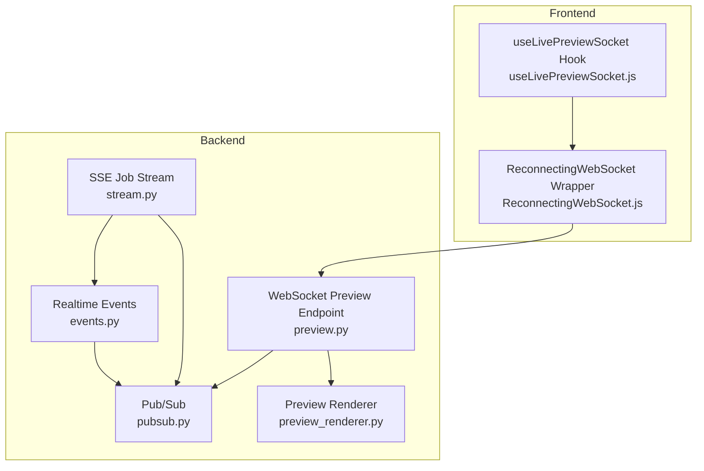
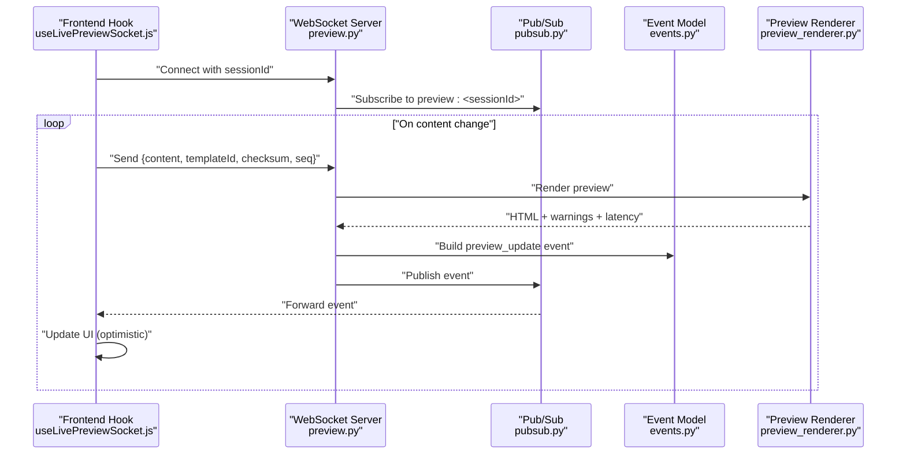
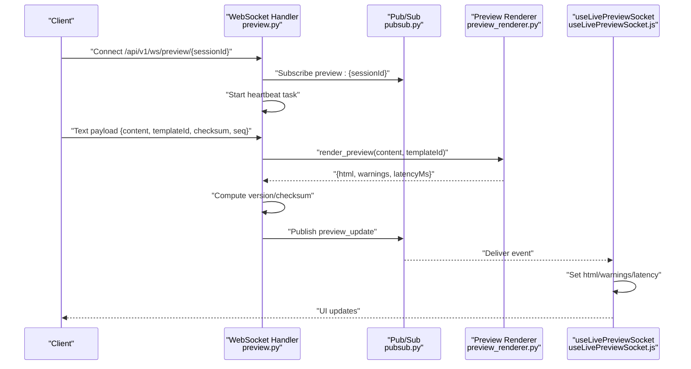
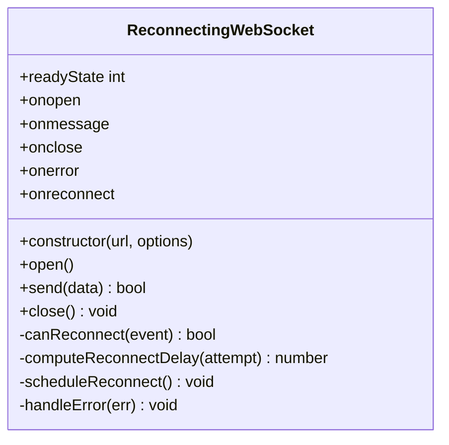
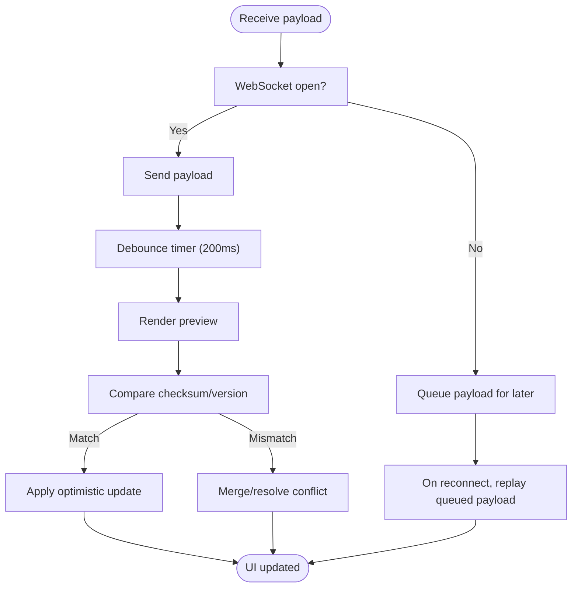
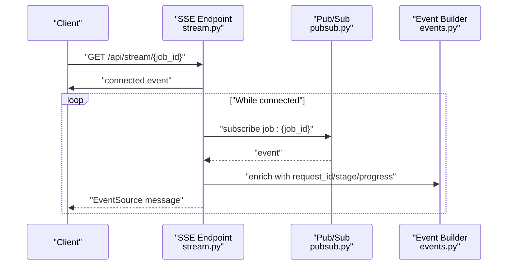
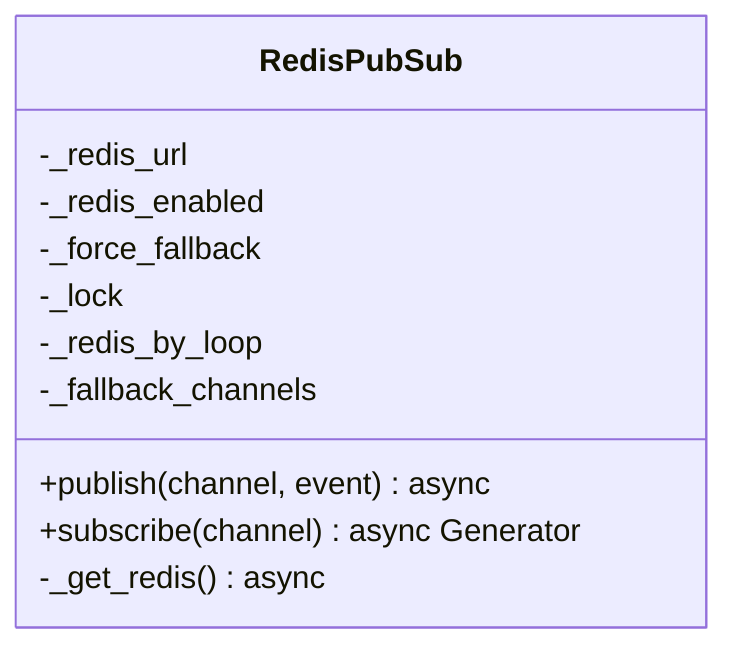
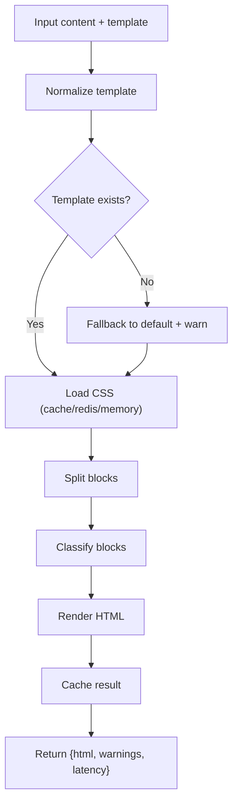
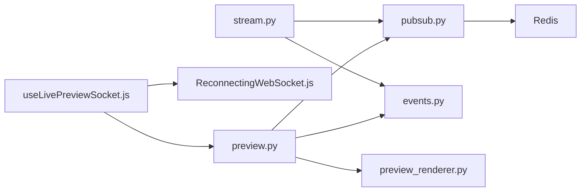

# Real-time Features

<cite>
**Referenced Files in This Document**
- [events.py](file://backend/app/realtime/events.py)
- [pubsub.py](file://backend/app/realtime/pubsub.py)
- [preview.py](file://backend/app/routers/preview.py)
- [stream.py](file://backend/app/routers/stream.py)
- [preview_renderer.py](file://backend/app/services/preview_renderer.py)
- [useLivePreviewSocket.js](file://frontend/src/hooks/useLivePreviewSocket.js)
- [ReconnectingWebSocket.js](file://frontend/src/lib/ReconnectingWebSocket.js)
</cite>

## Table of Contents
1. [Introduction](#introduction)
2. [Project Structure](#project-structure)
3. [Core Components](#core-components)
4. [Architecture Overview](#architecture-overview)
5. [Detailed Component Analysis](#detailed-component-analysis)
6. [Dependency Analysis](#dependency-analysis)
7. [Performance Considerations](#performance-considerations)
8. [Troubleshooting Guide](#troubleshooting-guide)
9. [Conclusion](#conclusion)
10. [Appendices](#appendices)

## Introduction
This document explains the real-time features implementation, focusing on live previews, status updates, and streaming responses. It covers WebSocket integration for live previews, reconnecting WebSocket behavior, message handling, and error recovery strategies. It also documents the live preview system, real-time status indicators, progress tracking, event-driven UI updates, optimistic rendering patterns, conflict resolution, lifecycle management, graceful degradation, and practical guidelines for adding new real-time features and debugging connection issues.

## Project Structure
The real-time system spans backend and frontend:
- Backend:
  - Real-time event model and publisher/subscriber built on Redis with in-memory fallback.
  - WebSocket endpoint for live preview sessions.
  - SSE endpoint for streaming job events.
  - Preview rendering service with caching and template support.
- Frontend:
  - React hook that manages a WebSocket connection with exponential backoff and jitter.
  - ReconnectingWebSocket wrapper for robust reconnection behavior.

**Diagram sources**
- [events.py:1-34](file://backend/app/realtime/events.py#L1-L34)
- [pubsub.py:1-120](file://backend/app/realtime/pubsub.py#L1-L120)
- [preview.py:1-201](file://backend/app/routers/preview.py#L1-L201)
- [stream.py:1-95](file://backend/app/routers/stream.py#L1-L95)
- [preview_renderer.py:1-421](file://backend/app/services/preview_renderer.py#L1-L421)
- [useLivePreviewSocket.js:1-137](file://frontend/src/hooks/useLivePreviewSocket.js#L1-L137)
- [ReconnectingWebSocket.js:1-148](file://frontend/src/lib/ReconnectingWebSocket.js#L1-L148)

**Section sources**
- [events.py:1-34](file://backend/app/realtime/events.py#L1-L34)
- [pubsub.py:1-120](file://backend/app/realtime/pubsub.py#L1-L120)
- [preview.py:1-201](file://backend/app/routers/preview.py#L1-L201)
- [stream.py:1-95](file://backend/app/routers/stream.py#L1-L95)
- [preview_renderer.py:1-421](file://backend/app/services/preview_renderer.py#L1-L421)
- [useLivePreviewSocket.js:1-137](file://frontend/src/hooks/useLivePreviewSocket.js#L1-L137)
- [ReconnectingWebSocket.js:1-148](file://frontend/src/lib/ReconnectingWebSocket.js#L1-L148)

## Core Components
- Realtime event model: A structured event with type, identifiers, stage, progress, timestamp, and payload.
- Redis-backed Pub/Sub with in-memory fallback: Publishes and subscribes to channels for decoupled real-time messaging.
- WebSocket live preview: Bidirectional session-based WebSocket for live HTML rendering and updates.
- SSE job events: Server-Sent Events for progress and status updates.
- Preview renderer: Renders content to HTML with caching and template CSS.

Key responsibilities:
- Event creation and enrichment with request context.
- Reliable delivery via Redis pub/sub and graceful fallback.
- WebSocket lifecycle management, heartbeat, and update forwarding.
- SSE streaming for long-lived status updates.
- Optimistic UI updates with conflict detection and resolution.

**Section sources**
- [events.py:9-34](file://backend/app/realtime/events.py#L9-L34)
- [pubsub.py:18-120](file://backend/app/realtime/pubsub.py#L18-L120)
- [preview.py:78-128](file://backend/app/routers/preview.py#L78-L128)
- [stream.py:32-95](file://backend/app/routers/stream.py#L32-L95)
- [preview_renderer.py:31-421](file://backend/app/services/preview_renderer.py#L31-L421)

## Architecture Overview
The system integrates three real-time mechanisms:
- Live preview over WebSocket: client sends content updates; server responds with rendered HTML and metadata.
- Job status over SSE: server emits structured events for progress and stages.
- Pub/Sub backbone: central bus for publishing events and forwarding updates to clients.

**Diagram sources**
- [useLivePreviewSocket.js:28-137](file://frontend/src/hooks/useLivePreviewSocket.js#L28-L137)
- [preview.py:78-128](file://backend/app/routers/preview.py#L78-L128)
- [pubsub.py:79-120](file://backend/app/realtime/pubsub.py#L79-L120)
- [events.py:21-34](file://backend/app/realtime/events.py#L21-L34)
- [preview_renderer.py:364-406](file://backend/app/services/preview_renderer.py#L364-L406)

## Detailed Component Analysis

### WebSocket Live Preview
The WebSocket endpoint supports:
- Session-based channels for isolation.
- Heartbeat ping frames to detect liveness.
- Forwarding of preview updates to all subscribers.
- Rendering pipeline invoked per message with caching and checksum/versioning.

**Diagram sources**
- [preview.py:78-128](file://backend/app/routers/preview.py#L78-L128)
- [pubsub.py:79-120](file://backend/app/realtime/pubsub.py#L79-L120)
- [preview_renderer.py:364-406](file://backend/app/services/preview_renderer.py#L364-L406)
- [useLivePreviewSocket.js:68-81](file://frontend/src/hooks/useLivePreviewSocket.js#L68-L81)

**Section sources**
- [preview.py:78-128](file://backend/app/routers/preview.py#L78-L128)
- [preview_renderer.py:364-406](file://backend/app/services/preview_renderer.py#L364-L406)
- [useLivePreviewSocket.js:28-137](file://frontend/src/hooks/useLivePreviewSocket.js#L28-L137)

### Reconnecting WebSocket Implementation
The frontend wrapper provides:
- Exponential backoff with jitter.
- Retry limits and configurable thresholds.
- Event callbacks for open, message, close, error, and reconnect attempts.
- Ready state tracking and graceful closure.

**Diagram sources**
- [ReconnectingWebSocket.js:5-148](file://frontend/src/lib/ReconnectingWebSocket.js#L5-L148)

**Section sources**
- [ReconnectingWebSocket.js:5-148](file://frontend/src/lib/ReconnectingWebSocket.js#L5-L148)

### Message Handling and Conflict Resolution
- Content checksum and sequence number enable optimistic updates and conflict detection.
- Version field ensures clients apply updates only when content has changed.
- Debounce reduces redundant renders during rapid edits.
- Warnings and latencyMs inform UI and diagnostics.

**Diagram sources**
- [useLivePreviewSocket.js:106-133](file://frontend/src/hooks/useLivePreviewSocket.js#L106-L133)
- [preview.py:105-115](file://backend/app/routers/preview.py#L105-L115)

**Section sources**
- [useLivePreviewSocket.js:106-133](file://frontend/src/hooks/useLivePreviewSocket.js#L106-L133)
- [preview.py:105-115](file://backend/app/routers/preview.py#L105-L115)

### SSE Job Events
The SSE endpoint streams job-related events:
- Emits a connection confirmation event.
- Streams events published to the job-specific channel.
- Integrates metrics for connection open/close.

**Diagram sources**
- [stream.py:32-95](file://backend/app/routers/stream.py#L32-L95)
- [pubsub.py:79-120](file://backend/app/realtime/pubsub.py#L79-L120)
- [events.py:21-34](file://backend/app/realtime/events.py#L21-L34)

**Section sources**
- [stream.py:32-95](file://backend/app/routers/stream.py#L32-L95)
- [pubsub.py:79-120](file://backend/app/realtime/pubsub.py#L79-L120)
- [events.py:21-34](file://backend/app/realtime/events.py#L21-L34)

### Pub/Sub Backbone and Graceful Degradation
- Redis-backed pub/sub with automatic fallback to in-memory queues.
- Robust subscription and publishing with JSON decoding and error handling.
- Fallback channels keyed by channel name and backed by asyncio queues.

**Diagram sources**
- [pubsub.py:18-120](file://backend/app/realtime/pubsub.py#L18-L120)

**Section sources**
- [pubsub.py:18-120](file://backend/app/realtime/pubsub.py#L18-L120)

### Preview Renderer and Caching
- Template discovery and CSS loading with fallback generation.
- Content classification and HTML rendering with caching.
- Latency measurement and warning propagation.

**Diagram sources**
- [preview_renderer.py:364-406](file://backend/app/services/preview_renderer.py#L364-L406)

**Section sources**
- [preview_renderer.py:31-421](file://backend/app/services/preview_renderer.py#L31-L421)

## Dependency Analysis
- Frontend hook depends on the WebSocket wrapper and preview endpoint.
- WebSocket handler depends on Pub/Sub, event model, and renderer.
- SSE endpoint depends on Pub/Sub and event model.
- Pub/Sub depends on Redis configuration and falls back to in-memory queues.
- Renderer depends on templates and Redis for caching.

**Diagram sources**
- [useLivePreviewSocket.js:1-137](file://frontend/src/hooks/useLivePreviewSocket.js#L1-L137)
- [ReconnectingWebSocket.js:1-148](file://frontend/src/lib/ReconnectingWebSocket.js#L1-L148)
- [preview.py:1-201](file://backend/app/routers/preview.py#L1-L201)
- [pubsub.py:1-120](file://backend/app/realtime/pubsub.py#L1-L120)
- [events.py:1-34](file://backend/app/realtime/events.py#L1-L34)
- [preview_renderer.py:1-421](file://backend/app/services/preview_renderer.py#L1-L421)
- [stream.py:1-95](file://backend/app/routers/stream.py#L1-L95)

**Section sources**
- [preview.py:1-201](file://backend/app/routers/preview.py#L1-L201)
- [stream.py:1-95](file://backend/app/routers/stream.py#L1-L95)
- [pubsub.py:1-120](file://backend/app/realtime/pubsub.py#L1-L120)
- [events.py:1-34](file://backend/app/realtime/events.py#L1-L34)
- [preview_renderer.py:1-421](file://backend/app/services/preview_renderer.py#L1-L421)
- [useLivePreviewSocket.js:1-137](file://frontend/src/hooks/useLivePreviewSocket.js#L1-L137)
- [ReconnectingWebSocket.js:1-148](file://frontend/src/lib/ReconnectingWebSocket.js#L1-L148)

## Performance Considerations
- WebSocket:
  - Use checksum/version to avoid unnecessary DOM updates.
  - Debounce sends to reduce render pressure.
  - Heartbeat keeps connection alive and detects disconnects promptly.
- Pub/Sub:
  - Prefer Redis for multi-instance deployments; fallback to in-memory queues for single-instance.
  - Monitor publish/subscribe latency and queue sizes.
- SSE:
  - Keep event payloads minimal; stream progress updates incrementally.
- Renderer:
  - Leverage caching for templates and rendered HTML.
  - Normalize template names and warn on unknown templates to prevent repeated fallbacks.

[No sources needed since this section provides general guidance]

## Troubleshooting Guide
Common issues and resolutions:
- WebSocket disconnects:
  - Verify session ID format and accept conditions.
  - Inspect heartbeat behavior and reconnection attempts.
  - Check Pub/Sub connectivity and fallback behavior.
- Slow or blocked updates:
  - Confirm debounce timing and payload sizes.
  - Review checksum/version mismatch causing conflicts.
- SSE not receiving events:
  - Ensure client is subscribed to the correct job channel.
  - Validate request ID propagation and event enrichment.
- Redis unavailability:
  - Confirm fallback to in-memory queues is functioning.
  - Monitor logs for Redis ping failures and fallback warnings.

**Section sources**
- [preview.py:78-128](file://backend/app/routers/preview.py#L78-L128)
- [pubsub.py:28-53](file://backend/app/realtime/pubsub.py#L28-L53)
- [useLivePreviewSocket.js:91-95](file://frontend/src/hooks/useLivePreviewSocket.js#L91-L95)
- [stream.py:32-58](file://backend/app/routers/stream.py#L32-L58)

## Conclusion
The real-time system combines a robust WebSocket live preview with SSE job streaming, all powered by a flexible Redis-backed Pub/Sub backbone. The frontend provides resilient reconnection and optimistic rendering with conflict detection. Together, these components deliver responsive, reliable, and scalable real-time experiences.

[No sources needed since this section summarizes without analyzing specific files]

## Appendices

### Guidelines for Implementing New Real-time Features
- Define a clear event model with type, identifiers, stage, progress, and payload.
- Use the Pub/Sub abstraction for publish/subscribe with Redis and in-memory fallback.
- For bidirectional live updates, implement a WebSocket endpoint with:
  - Session/channel scoping.
  - Heartbeat and graceful teardown.
  - Renderer integration with caching and warnings.
- For long-lived status updates, implement an SSE endpoint emitting structured events.
- Frontend:
  - Wrap WebSocket with exponential backoff and jitter.
  - Implement optimistic updates with checksum/version and debouncing.
  - Provide clear UI indicators for connection state and reconnect attempts.
- Testing:
  - Simulate network flakiness and Redis unavailability.
  - Validate event ordering, deduplication, and conflict resolution.

[No sources needed since this section provides general guidance]