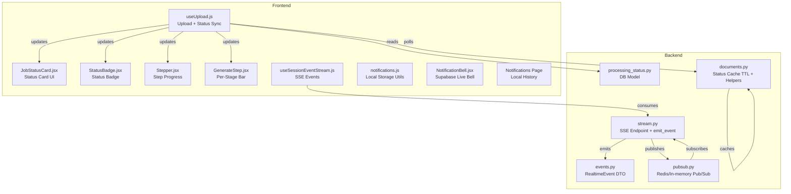
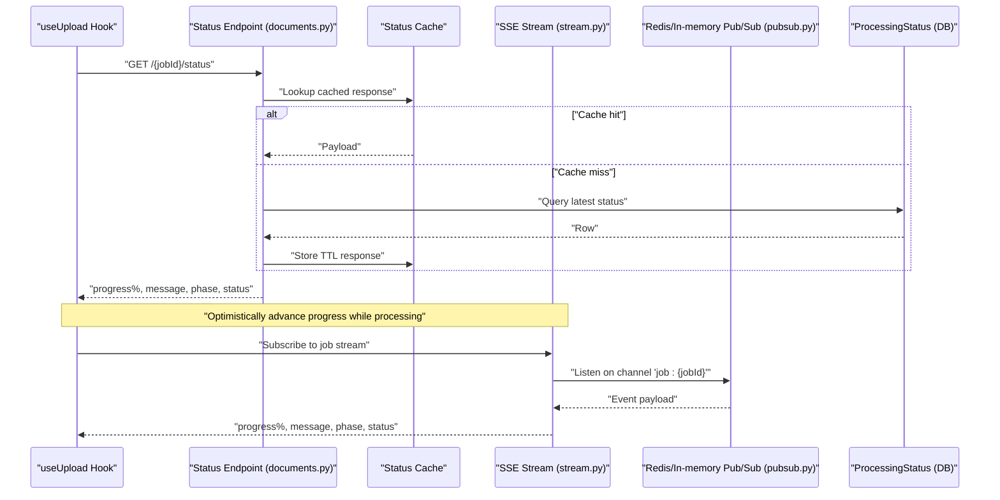
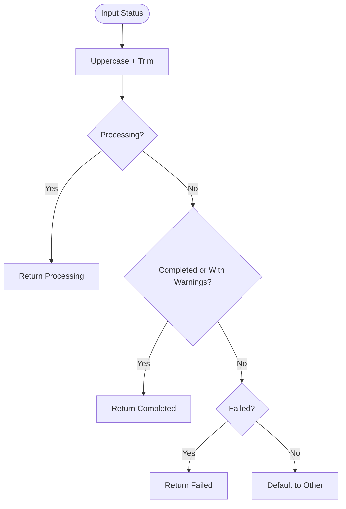
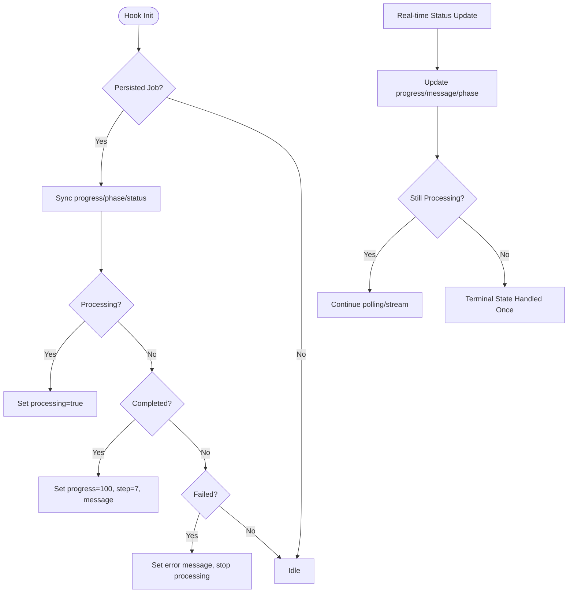
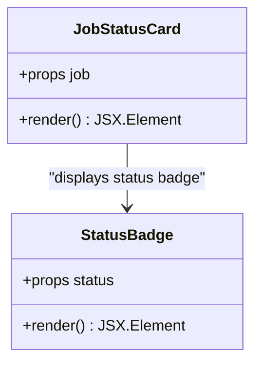
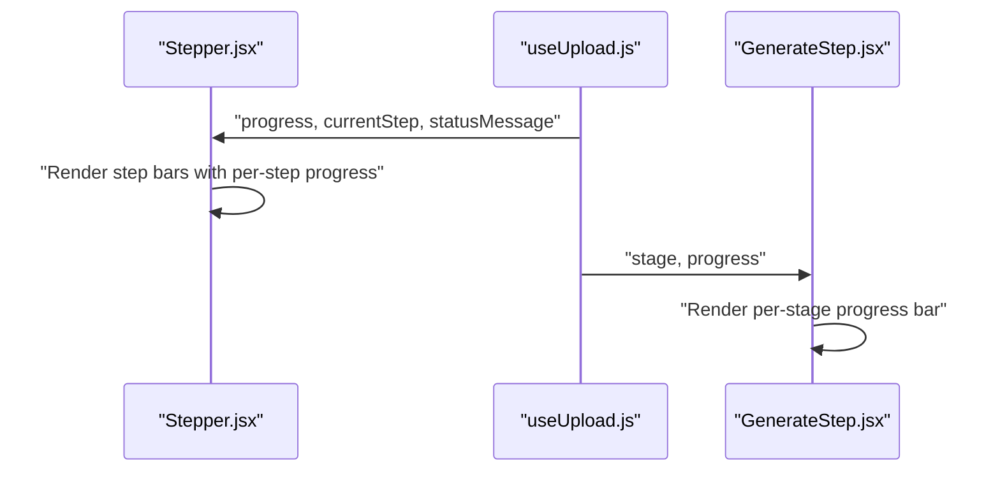
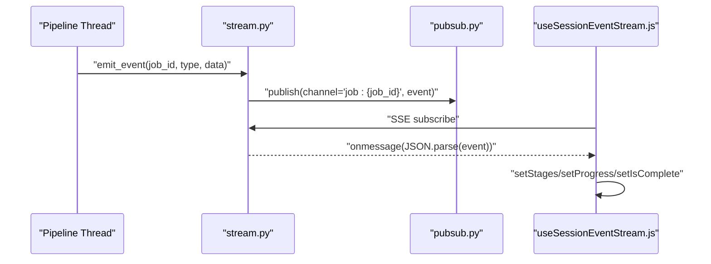
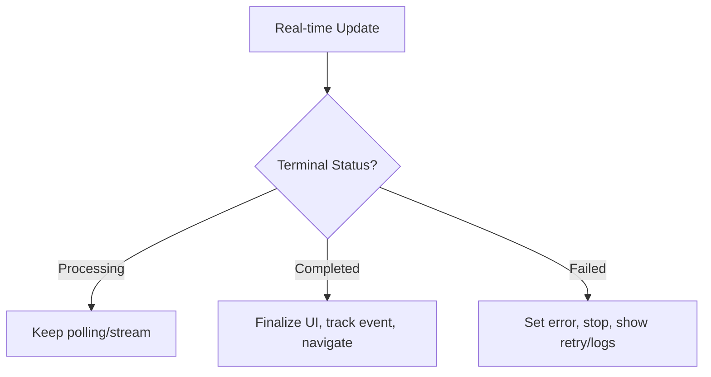
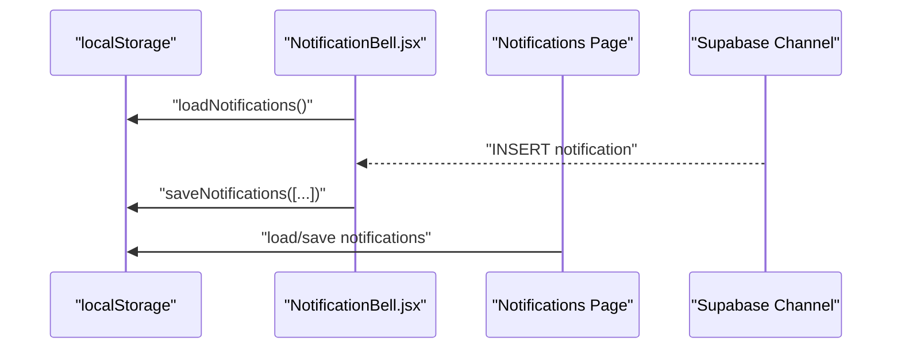
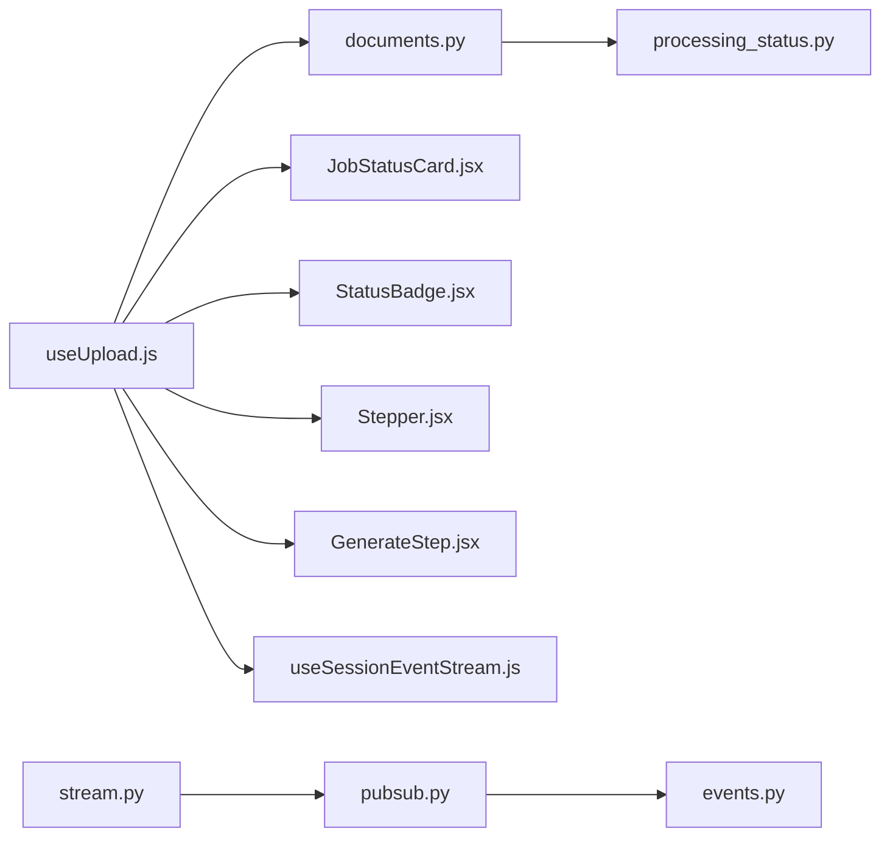

# Status Updates & Progress Tracking

<cite>
**Referenced Files in This Document**
- [status.js](file://frontend/src/constants/status.js)
- [JobStatusCard.jsx](file://frontend/src/components/layout/JobStatusCard.jsx)
- [StatusBadge.jsx](file://frontend/src/components/StatusBadge.jsx)
- [useUpload.js](file://frontend/src/hooks/useUpload.js)
- [Stepper.jsx](file://frontend/src/components/Stepper.jsx)
- [GenerateStep.jsx](file://frontend/app/(generator)/(protected)/generate/_components/GenerateStep.jsx)
- [processing/page.jsx](file://frontend/app/(formatter)/processing/page.jsx)
- [notifications.js](file://frontend/src/utils/notifications.js)
- [NotificationBell.jsx](file://frontend/src/components/NotificationBell.jsx)
- [page.jsx](file://frontend/app/(shared)/(protected)/notifications/page.jsx)
- [useSessionEventStream.js](file://frontend/src/hooks/useSessionEventStream.js)
- [processing_status.py](file://backend/app/models/processing_status.py)
- [events.py](file://backend/app/realtime/events.py)
- [pubsub.py](file://backend/app/realtime/pubsub.py)
- [stream.py](file://backend/app/routers/stream.py)
- [documents.py](file://backend/app/routers/documents.py)
</cite>

## Table of Contents
1. [Introduction](#introduction)
2. [Project Structure](#project-structure)
3. [Core Components](#core-components)
4. [Architecture Overview](#architecture-overview)
5. [Detailed Component Analysis](#detailed-component-analysis)
6. [Dependency Analysis](#dependency-analysis)
7. [Performance Considerations](#performance-considerations)
8. [Troubleshooting Guide](#troubleshooting-guide)
9. [Conclusion](#conclusion)

## Introduction
This document explains the end-to-end status updates and progress tracking implementation for long-running jobs. It covers the frontend status card and progress indicators, status constants and state transitions, backend event publishing and caching, optimistic UI updates, polling fallbacks, and user notification systems. It also provides guidance on performance and memory considerations for frequent updates.

## Project Structure
The status and progress tracking spans frontend components and hooks, backend models and event infrastructure, and notification utilities.

**Diagram sources**
- [useUpload.js:1-361](file://frontend/src/hooks/useUpload.js#L1-L361)
- [JobStatusCard.jsx:1-142](file://frontend/src/components/layout/JobStatusCard.jsx#L1-L142)
- [StatusBadge.jsx:1-48](file://frontend/src/components/StatusBadge.jsx#L1-L48)
- [Stepper.jsx:38-143](file://frontend/src/components/Stepper.jsx#L38-L143)
- [GenerateStep.jsx:23-38](file://frontend/app/(generator)/(protected)/generate/_components/GenerateStep.jsx#L23-L38)
- [useSessionEventStream.js:1-101](file://frontend/src/hooks/useSessionEventStream.js#L1-L101)
- [notifications.js:1-46](file://frontend/src/utils/notifications.js#L1-L46)
- [NotificationBell.jsx:1-75](file://frontend/src/components/NotificationBell.jsx#L1-L75)
- [page.jsx:1-101](file://frontend/app/(shared)/(protected)/notifications/page.jsx#L1-L101)
- [processing_status.py:1-15](file://backend/app/models/processing_status.py#L1-L15)
- [events.py:1-34](file://backend/app/realtime/events.py#L1-L34)
- [pubsub.py:1-120](file://backend/app/realtime/pubsub.py#L1-L120)
- [stream.py:60-94](file://backend/app/routers/stream.py#L60-L94)
- [documents.py:103-156](file://backend/app/routers/documents.py#L103-L156)

**Section sources**
- [useUpload.js:1-361](file://frontend/src/hooks/useUpload.js#L1-L361)
- [processing_status.py:1-15](file://backend/app/models/processing_status.py#L1-L15)
- [events.py:1-34](file://backend/app/realtime/events.py#L1-L34)
- [pubsub.py:1-120](file://backend/app/realtime/pubsub.py#L1-L120)
- [stream.py:60-94](file://backend/app/routers/stream.py#L60-L94)
- [documents.py:103-156](file://backend/app/routers/documents.py#L103-L156)

## Core Components
- Status constants and helpers define canonical states and predicates for UI decisions.
- Frontend hooks orchestrate optimistic updates, polling intervals, and terminal state handling.
- Status cards and badges present progress and status with contextual actions.
- Backend models persist per-job progress and messages; SSE streams events via Redis or in-memory fallback.
- Notification utilities support local storage history and Supabase-based real-time bell.

Key responsibilities:
- Define status constants and predicates for UI logic.
- Compute dynamic polling intervals based on job phase and progress.
- Render per-step progress bars and per-stage progress when provided.
- Publish real-time events and fall back gracefully when Redis is unavailable.
- Persist and cache status responses to reduce load.

**Section sources**
- [status.js:1-23](file://frontend/src/constants/status.js#L1-L23)
- [useUpload.js:75-96](file://frontend/src/hooks/useUpload.js#L75-L96)
- [useUpload.js:127-196](file://frontend/src/hooks/useUpload.js#L127-L196)
- [JobStatusCard.jsx:1-142](file://frontend/src/components/layout/JobStatusCard.jsx#L1-L142)
- [StatusBadge.jsx:1-48](file://frontend/src/components/StatusBadge.jsx#L1-L48)
- [processing_status.py:1-15](file://backend/app/models/processing_status.py#L1-L15)
- [events.py:1-34](file://backend/app/realtime/events.py#L1-L34)
- [pubsub.py:18-120](file://backend/app/realtime/pubsub.py#L18-L120)
- [stream.py:73-94](file://backend/app/routers/stream.py#L73-L94)
- [documents.py:103-156](file://backend/app/routers/documents.py#L103-L156)

## Architecture Overview
The system combines optimistic UI updates with a polling fallback and real-time SSE streaming.

**Diagram sources**
- [useUpload.js:88-96](file://frontend/src/hooks/useUpload.js#L88-L96)
- [documents.py:122-150](file://backend/app/routers/documents.py#L122-L150)
- [processing_status.py:5-14](file://backend/app/models/processing_status.py#L5-L14)
- [stream.py:60-94](file://backend/app/routers/stream.py#L60-L94)
- [pubsub.py:79-120](file://backend/app/realtime/pubsub.py#L79-L120)

## Detailed Component Analysis

### Status Constants and Predicates
- Canonical statuses include pending, processing, completed, completed_with_warnings, failed, and cancelled.
- Predicates normalize input and decide terminal vs. processing states.

**Diagram sources**
- [status.js:10-22](file://frontend/src/constants/status.js#L10-L22)

**Section sources**
- [status.js:1-23](file://frontend/src/constants/status.js#L1-L23)

### Status State Management and Optimistic Updates
- The upload hook manages processing state, progress, current step, and status message.
- It computes dynamic polling intervals based on phase and progress to reduce unnecessary requests.
- On real-time updates, it optimistically advances progress and steps; on terminal states, it finalizes UI and navigates.

**Diagram sources**
- [useUpload.js:98-125](file://frontend/src/hooks/useUpload.js#L98-L125)
- [useUpload.js:127-196](file://frontend/src/hooks/useUpload.js#L127-L196)
- [useUpload.js:75-96](file://frontend/src/hooks/useUpload.js#L75-L96)

**Section sources**
- [useUpload.js:1-361](file://frontend/src/hooks/useUpload.js#L1-L361)

### Job Status Card Component
- Renders a glass-like panel with status-specific styling and actions.
- Shows progress bar for non-terminal states and action buttons for retry/cancel/log viewing.
- Uses status props to toggle visuals and actions.

**Diagram sources**
- [JobStatusCard.jsx:1-142](file://frontend/src/components/layout/JobStatusCard.jsx#L1-L142)
- [StatusBadge.jsx:1-48](file://frontend/src/components/StatusBadge.jsx#L1-L48)

**Section sources**
- [JobStatusCard.jsx:1-142](file://frontend/src/components/layout/JobStatusCard.jsx#L1-L142)
- [StatusBadge.jsx:1-48](file://frontend/src/components/StatusBadge.jsx#L1-L48)

### Progress Indicators and Step Visualization
- Per-job progress percentage is shown in the processing page and stepper.
- Per-step progress bars appear when backend supplies per-stage progress.
- Per-stage progress bars are also rendered in generator components.

**Diagram sources**
- [Stepper.jsx:38-143](file://frontend/src/components/Stepper.jsx#L38-L143)
- [useUpload.js:127-196](file://frontend/src/hooks/useUpload.js#L127-L196)
- [GenerateStep.jsx:23-38](file://frontend/app/(generator)/(protected)/generate/_components/GenerateStep.jsx#L23-L38)
- [processing/page.jsx:265-286](file://frontend/app/(formatter)/processing/page.jsx#L265-L286)

**Section sources**
- [Stepper.jsx:38-143](file://frontend/src/components/Stepper.jsx#L38-L143)
- [GenerateStep.jsx:23-38](file://frontend/app/(generator)/(protected)/generate/_components/GenerateStep.jsx#L23-L38)
- [processing/page.jsx:265-286](file://frontend/app/(formatter)/processing/page.jsx#L265-L286)

### Backend Event System and Real-time Streaming
- RealtimeEvent encapsulates event metadata including job/session/request IDs, stage, progress, and payload.
- emit_event publishes structured events to Redis Pub/Sub or falls back to in-memory queues.
- SSE endpoint streams events to clients; consumers parse and update UI state.

**Diagram sources**
- [events.py:9-33](file://backend/app/realtime/events.py#L9-L33)
- [pubsub.py:55-120](file://backend/app/realtime/pubsub.py#L55-L120)
- [stream.py:73-94](file://backend/app/routers/stream.py#L73-L94)
- [useSessionEventStream.js:20-97](file://frontend/src/hooks/useSessionEventStream.js#L20-L97)

**Section sources**
- [events.py:1-34](file://backend/app/realtime/events.py#L1-L34)
- [pubsub.py:18-120](file://backend/app/realtime/pubsub.py#L18-L120)
- [stream.py:60-94](file://backend/app/routers/stream.py#L60-L94)
- [useSessionEventStream.js:1-101](file://frontend/src/hooks/useSessionEventStream.js#L1-L101)

### Job Completion Tracking and Error Propagation
- Terminal state handling prevents duplicate actions and ensures finalization.
- Error messages propagate from backend to UI; UI displays actionable buttons and logs access.
- Completion triggers analytics and optional browser notifications.

**Diagram sources**
- [useUpload.js:146-195](file://frontend/src/hooks/useUpload.js#L146-L195)
- [JobStatusCard.jsx:117-133](file://frontend/src/components/layout/JobStatusCard.jsx#L117-L133)

**Section sources**
- [useUpload.js:146-195](file://frontend/src/hooks/useUpload.js#L146-L195)
- [JobStatusCard.jsx:117-133](file://frontend/src/components/layout/JobStatusCard.jsx#L117-L133)

### User Notification Systems
- Local notifications history stored in localStorage with a dedicated storage key.
- Notification bell subscribes to Supabase channel for real-time inserts and maintains a recent list.
- Notifications page renders unread counts, icons, timestamps, and actions.

**Diagram sources**
- [notifications.js:19-45](file://frontend/src/utils/notifications.js#L19-L45)
- [NotificationBell.jsx:15-68](file://frontend/src/components/NotificationBell.jsx#L15-L68)
- [page.jsx:7-32](file://frontend/app/(shared)/(protected)/notifications/page.jsx#L7-L32)

**Section sources**
- [notifications.js:1-46](file://frontend/src/utils/notifications.js#L1-L46)
- [NotificationBell.jsx:1-75](file://frontend/src/components/NotificationBell.jsx#L1-L75)
- [page.jsx:1-101](file://frontend/app/(shared)/(protected)/notifications/page.jsx#L1-L101)

## Dependency Analysis
- Frontend depends on backend status endpoints and SSE streams.
- Backend caches status responses and persists progress in the database.
- Redis Pub/Sub provides scalable event distribution with in-memory fallback.

**Diagram sources**
- [useUpload.js:1-361](file://frontend/src/hooks/useUpload.js#L1-L361)
- [JobStatusCard.jsx:1-142](file://frontend/src/components/layout/JobStatusCard.jsx#L1-L142)
- [StatusBadge.jsx:1-48](file://frontend/src/components/StatusBadge.jsx#L1-L48)
- [Stepper.jsx:38-143](file://frontend/src/components/Stepper.jsx#L38-L143)
- [GenerateStep.jsx:23-38](file://frontend/app/(generator)/(protected)/generate/_components/GenerateStep.jsx#L23-L38)
- [useSessionEventStream.js:1-101](file://frontend/src/hooks/useSessionEventStream.js#L1-L101)
- [stream.py:60-94](file://backend/app/routers/stream.py#L60-L94)
- [pubsub.py:18-120](file://backend/app/realtime/pubsub.py#L18-L120)
- [events.py:1-34](file://backend/app/realtime/events.py#L1-L34)
- [processing_status.py:1-15](file://backend/app/models/processing_status.py#L1-L15)

**Section sources**
- [documents.py:103-156](file://backend/app/routers/documents.py#L103-L156)
- [processing_status.py:1-15](file://backend/app/models/processing_status.py#L1-15)
- [pubsub.py:18-120](file://backend/app/realtime/pubsub.py#L18-L120)
- [stream.py:60-94](file://backend/app/routers/stream.py#L60-L94)

## Performance Considerations
- Dynamic polling intervals reduce network load: shorter intervals near completion and for early phases; longer intervals otherwise.
- Status cache TTL minimizes repeated database queries for status responses.
- SSE streaming avoids frequent polling overhead and reduces latency for real-time updates.
- Redis Pub/Sub fallback ensures resilience when Redis is unavailable; in-memory queues maintain basic functionality.
- Memory management: limit retained notifications and staged events; clear timeouts and close SSE connections on unmount.

Recommendations:
- Keep cache TTL aligned with typical job durations.
- Throttle UI updates to avoid excessive re-renders (debounce or batch).
- Prefer SSE for continuous updates; use polling only when SSE is unavailable.
- Monitor SSE reconnect attempts and backoff to prevent thundering herds.

**Section sources**
- [useUpload.js:75-96](file://frontend/src/hooks/useUpload.js#L75-L96)
- [documents.py:103-156](file://backend/app/routers/documents.py#L103-L156)
- [pubsub.py:28-54](file://backend/app/realtime/pubsub.py#L28-L54)
- [useSessionEventStream.js:76-97](file://frontend/src/hooks/useSessionEventStream.js#L76-L97)

## Troubleshooting Guide
Common issues and resolutions:
- No real-time updates:
  - Verify SSE subscription URL and token handling.
  - Confirm Redis availability; fallback to in-memory queues is logged.
- Frequent polling:
  - Adjust dynamic intervals based on phase and progress.
  - Ensure cache TTL is sufficient to avoid constant misses.
- Terminal state not recognized:
  - Normalize status values to uppercase and trim whitespace.
  - Check predicates for completed/failed conditions.
- Notification not appearing:
  - Ensure browser permissions are granted.
  - Confirm localStorage availability and Supabase channel subscription.

**Section sources**
- [useSessionEventStream.js:20-97](file://frontend/src/hooks/useSessionEventStream.js#L20-L97)
- [pubsub.py:40-53](file://backend/app/realtime/pubsub.py#L40-L53)
- [useUpload.js:135-195](file://frontend/src/hooks/useUpload.js#L135-L195)
- [NotificationBell.jsx:15-68](file://frontend/src/components/NotificationBell.jsx#L15-L68)

## Conclusion
The system integrates optimistic UI updates, dynamic polling, and real-time SSE streaming to deliver responsive status and progress feedback. Robust status constants, terminal-state handling, and notification utilities provide a cohesive user experience. Backend caching and resilient Pub/Sub infrastructure ensure scalability and reliability for long-running jobs.