# Streaming Responses

<cite>
**Referenced Files in This Document**
- [stream.py](file://backend/app/routers/stream.py)
- [streaming.py](file://backend/app/pipeline/agents/streaming.py)
- [events.py](file://backend/app/realtime/events.py)
- [pubsub.py](file://backend/app/realtime/pubsub.py)
- [test_stream.py](file://backend/tests/test_stream.py)
- [useSessionEventStream.js](file://frontend/src/hooks/useSessionEventStream.js)
- [useGeneratorSessionStream.js](file://frontend/src/hooks/useGeneratorSessionStream.js)
- [useSynthesisSessionStream.js](file://frontend/src/hooks/useSynthesisSessionStream.js)
- [api.synthesis.js](file://frontend/src/services/api.synthesis.js)
- [api.v1.js](file://frontend/src/services/api.v1.js)
- [TokenStream.jsx](file://frontend/src/components/generator/TokenStream.jsx)
- [useAgentEvents.js](file://frontend/src/hooks/useAgentEvents.js)
- [002-redis-realtime-backbone.md](file://docs/adr/002-redis-realtime-backbone.md)
</cite>

## Table of Contents
1. [Introduction](#introduction)
2. [Project Structure](#project-structure)
3. [Core Components](#core-components)
4. [Architecture Overview](#architecture-overview)
5. [Detailed Component Analysis](#detailed-component-analysis)
6. [Dependency Analysis](#dependency-analysis)
7. [Performance Considerations](#performance-considerations)
8. [Troubleshooting Guide](#troubleshooting-guide)
9. [Conclusion](#conclusion)
10. [Appendices](#appendices)

## Introduction
This document explains the streaming response implementation for real-time updates in the system. It covers the backend streaming endpoints, Server-Sent Events (SSE) infrastructure, and real-time data transmission. It also documents the frontend stream hooks for generator sessions and synthesis sessions, including connection establishment, message parsing, and state updates. The document details the streaming data format, chunk processing, error recovery mechanisms, optimistic UI updates, partial content rendering, completion handling, and provides examples for implementing new streaming endpoints, handling connection interruptions, and managing stream lifecycle. Finally, it addresses performance optimization for large streams and memory management for extended sessions.

## Project Structure
The streaming implementation spans backend and frontend modules:
- Backend:
  - SSE endpoint router under the streaming module
  - Real-time event model and pub/sub abstraction
  - Agent streaming callback for LangChain-based pipelines
- Frontend:
  - React hooks for connecting to session event streams
  - Services for building event URLs
  - UI components that consume SSE for live updates

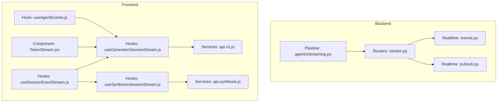

**Diagram sources**
- [stream.py:1-95](file://backend/app/routers/stream.py#L1-L95)
- [events.py:1-34](file://backend/app/realtime/events.py#L1-L34)
- [pubsub.py:1-120](file://backend/app/realtime/pubsub.py#L1-L120)
- [streaming.py:1-147](file://backend/app/pipeline/agents/streaming.py#L1-L147)
- [useSessionEventStream.js:1-101](file://frontend/src/hooks/useSessionEventStream.js#L1-L101)
- [useGeneratorSessionStream.js:1-12](file://frontend/src/hooks/useGeneratorSessionStream.js#L1-L12)
- [useSynthesisSessionStream.js:1-12](file://frontend/src/hooks/useSynthesisSessionStream.js#L1-L12)
- [api.v1.js](file://frontend/src/services/api.v1.js)
- [api.synthesis.js](file://frontend/src/services/api.synthesis.js)
- [TokenStream.jsx:163-181](file://frontend/src/components/generator/TokenStream.jsx#L163-L181)
- [useAgentEvents.js:1-37](file://frontend/src/hooks/useAgentEvents.js#L1-L37)

**Section sources**
- [stream.py:1-95](file://backend/app/routers/stream.py#L1-L95)
- [events.py:1-34](file://backend/app/realtime/events.py#L1-L34)
- [pubsub.py:1-120](file://backend/app/realtime/pubsub.py#L1-L120)
- [streaming.py:1-147](file://backend/app/pipeline/agents/streaming.py#L1-L147)
- [useSessionEventStream.js:1-101](file://frontend/src/hooks/useSessionEventStream.js#L1-L101)
- [useGeneratorSessionStream.js:1-12](file://frontend/src/hooks/useGeneratorSessionStream.js#L1-L12)
- [useSynthesisSessionStream.js:1-12](file://frontend/src/hooks/useSynthesisSessionStream.js#L1-L12)
- [api.v1.js](file://frontend/src/services/api.v1.js)
- [api.synthesis.js](file://frontend/src/services/api.synthesis.js)
- [TokenStream.jsx:163-181](file://frontend/src/components/generator/TokenStream.jsx#L163-L181)
- [useAgentEvents.js:1-37](file://frontend/src/hooks/useAgentEvents.js#L1-L37)

## Core Components
- Backend SSE Endpoint:
  - Exposes a GET endpoint that returns an EventSourceResponse
  - Establishes a Redis-backed pub/sub subscription per job/session
  - Emits a “connected” event immediately upon connection
  - Streams events received from Redis channels
- Real-time Event Model:
  - Defines a structured event shape with type, identifiers, timestamps, and payload
  - Utility to construct events enriched with request context
- Pub/Sub Abstraction:
  - Redis-backed publish/subscribe with graceful fallback to in-memory queues
  - Supports JSON decoding and robust message handling
- Agent Streaming Callback:
  - LangChain callback handler emitting structured events for LLM/tool/agent actions
- Frontend Hooks:
  - Generic session event stream hook with reconnection and error handling
  - Specialized hooks for generator and synthesis sessions
  - UI component consuming generator token streams via SSE

**Section sources**
- [stream.py:32-95](file://backend/app/routers/stream.py#L32-L95)
- [events.py:9-34](file://backend/app/realtime/events.py#L9-L34)
- [pubsub.py:18-120](file://backend/app/realtime/pubsub.py#L18-L120)
- [streaming.py:27-147](file://backend/app/pipeline/agents/streaming.py#L27-L147)
- [useSessionEventStream.js:4-101](file://frontend/src/hooks/useSessionEventStream.js#L4-L101)
- [useGeneratorSessionStream.js:5-11](file://frontend/src/hooks/useGeneratorSessionStream.js#L5-L11)
- [useSynthesisSessionStream.js:5-11](file://frontend/src/hooks/useSynthesisSessionStream.js#L5-L11)
- [TokenStream.jsx:163-181](file://frontend/src/components/generator/TokenStream.jsx#L163-L181)

## Architecture Overview
The streaming architecture uses SSE over HTTP with Redis pub/sub for real-time delivery. The backend emits structured events that the frontend consumes via EventSource. The system supports graceful degradation to in-memory queues when Redis is unavailable.

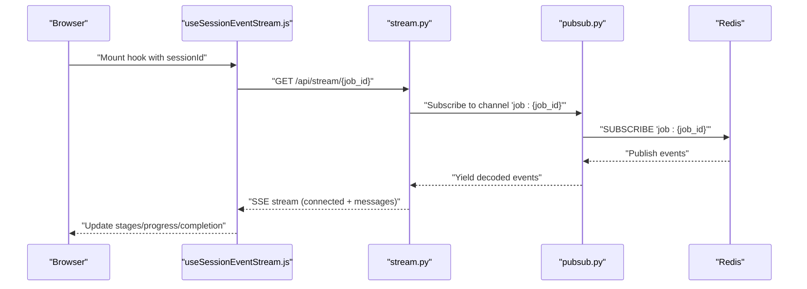

**Diagram sources**
- [stream.py:32-70](file://backend/app/routers/stream.py#L32-L70)
- [pubsub.py:79-119](file://backend/app/realtime/pubsub.py#L79-L119)
- [useSessionEventStream.js:20-90](file://frontend/src/hooks/useSessionEventStream.js#L20-L90)

**Section sources**
- [stream.py:32-70](file://backend/app/routers/stream.py#L32-L70)
- [pubsub.py:79-119](file://backend/app/realtime/pubsub.py#L79-L119)
- [useSessionEventStream.js:20-90](file://frontend/src/hooks/useSessionEventStream.js#L20-L90)

## Detailed Component Analysis

### Backend SSE Endpoint
- Endpoint: GET /api/stream/{job_id}
- Behavior:
  - Emits a “connected” event immediately after connection
  - Subscribes to Redis channel “job:{job_id}”
  - Streams events to clients; stops when client disconnects
  - Tracks connection open/close for metrics
- Event emission:
  - emit_event constructs a structured event and publishes to Redis
  - Uses request context to propagate correlation IDs

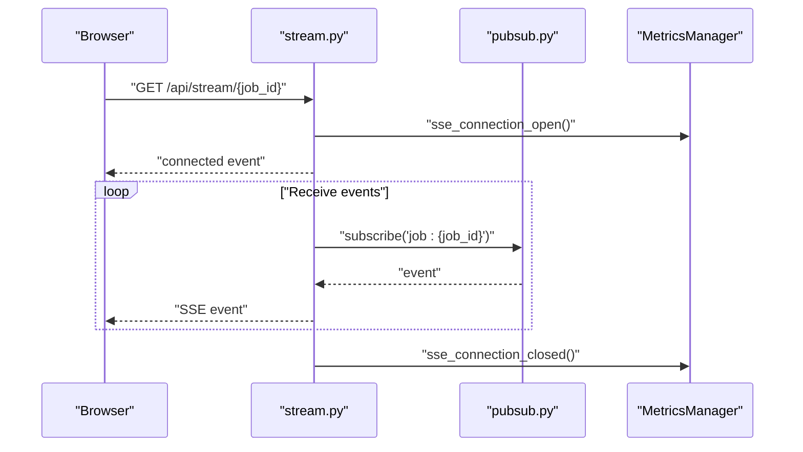

**Diagram sources**
- [stream.py:32-70](file://backend/app/routers/stream.py#L32-L70)
- [pubsub.py:79-119](file://backend/app/realtime/pubsub.py#L79-L119)

**Section sources**
- [stream.py:32-95](file://backend/app/routers/stream.py#L32-L95)
- [pubsub.py:55-119](file://backend/app/realtime/pubsub.py#L55-L119)

### Real-time Event Model and Pub/Sub
- RealtimeEvent:
  - Fields: event_type, job_id, session_id, request_id, stage, progress, timestamp, payload
  - make_event builds a normalized dictionary with ISO timestamp
- RedisPubSub:
  - publish: JSON-encodes and publishes to Redis; falls back to in-memory queues on failure
  - subscribe: Redis listen loop with JSON decoding; fallback to in-memory queue producer/consumer
  - Graceful degradation when Redis is unavailable

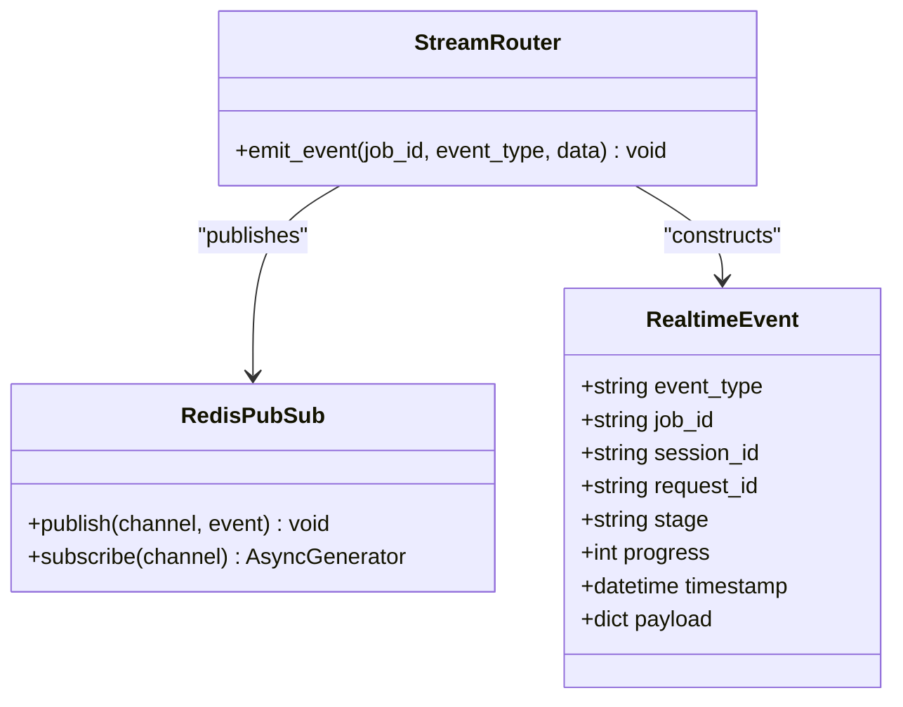

**Diagram sources**
- [events.py:9-34](file://backend/app/realtime/events.py#L9-L34)
- [pubsub.py:18-120](file://backend/app/realtime/pubsub.py#L18-L120)
- [stream.py:73-95](file://backend/app/routers/stream.py#L73-L95)

**Section sources**
- [events.py:9-34](file://backend/app/realtime/events.py#L9-L34)
- [pubsub.py:18-120](file://backend/app/realtime/pubsub.py#L18-L120)
- [stream.py:73-95](file://backend/app/routers/stream.py#L73-L95)

### Agent Streaming Callback
- Purpose: Bridge LangChain callbacks to structured events for SSE
- Emits events for:
  - LLM start/end/error
  - Tool start/end/error
  - Agent action and finish
  - Chain start/end/error
- Stores events locally for inspection and testing

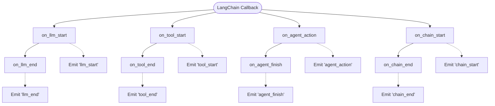

**Diagram sources**
- [streaming.py:27-147](file://backend/app/pipeline/agents/streaming.py#L27-L147)

**Section sources**
- [streaming.py:27-147](file://backend/app/pipeline/agents/streaming.py#L27-L147)

### Frontend Session Event Stream Hook
- Responsibilities:
  - Connects to SSE endpoint with optional auth token
  - Parses incoming events and updates stages, progress, and completion
  - Implements exponential backoff reconnection on error
  - Cleans up resources on unmount
- Data handling:
  - Updates stages array with merged entries keyed by name
  - Progress threshold triggers completion detection
  - Error events surface user-facing errors

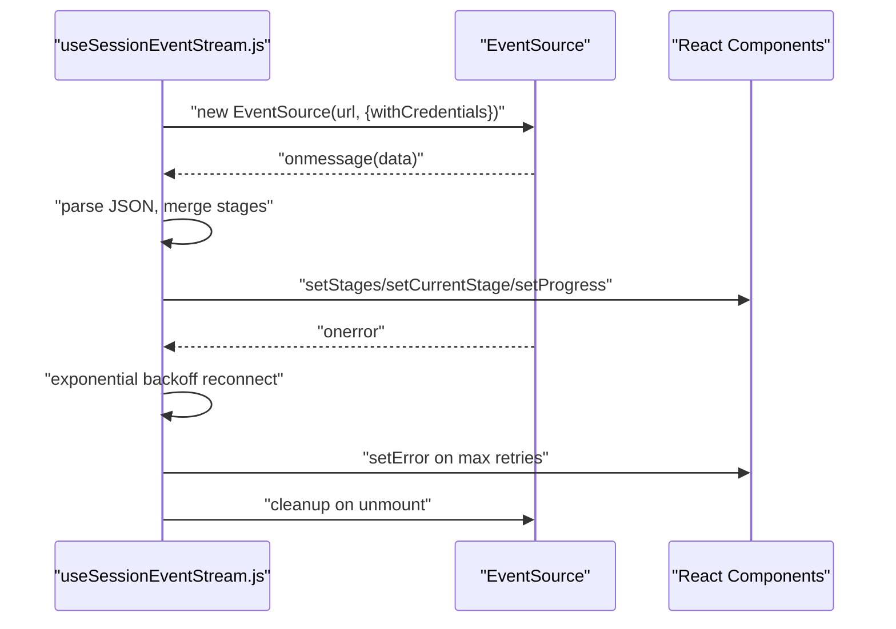

**Diagram sources**
- [useSessionEventStream.js:20-96](file://frontend/src/hooks/useSessionEventStream.js#L20-L96)

**Section sources**
- [useSessionEventStream.js:4-101](file://frontend/src/hooks/useSessionEventStream.js#L4-L101)

### Generator and Synthesis Session Hooks
- Specializations:
  - useGeneratorSessionStream: builds generator events URL via api.v1
  - useSynthesisSessionStream: builds synthesis events URL via api.synthesis
- Both delegate to the generic session event stream hook

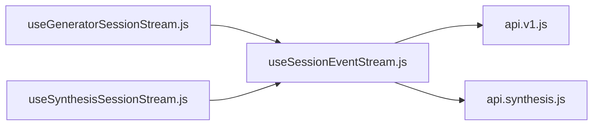

**Diagram sources**
- [useGeneratorSessionStream.js:5-11](file://frontend/src/hooks/useGeneratorSessionStream.js#L5-L11)
- [useSynthesisSessionStream.js:5-11](file://frontend/src/hooks/useSynthesisSessionStream.js#L5-L11)
- [useSessionEventStream.js:4-101](file://frontend/src/hooks/useSessionEventStream.js#L4-L101)
- [api.v1.js](file://frontend/src/services/api.v1.js)
- [api.synthesis.js](file://frontend/src/services/api.synthesis.js)

**Section sources**
- [useGeneratorSessionStream.js:5-11](file://frontend/src/hooks/useGeneratorSessionStream.js#L5-L11)
- [useSynthesisSessionStream.js:5-11](file://frontend/src/hooks/useSynthesisSessionStream.js#L5-L11)
- [useSessionEventStream.js:4-101](file://frontend/src/hooks/useSessionEventStream.js#L4-L101)
- [api.v1.js](file://frontend/src/services/api.v1.js)
- [api.synthesis.js](file://frontend/src/services/api.synthesis.js)

### Token Stream Component (Generator)
- Establishes an EventSource connection to the generator session events endpoint
- Optionally attaches an auth token via query parameter
- Manages connection lifecycle and error handling

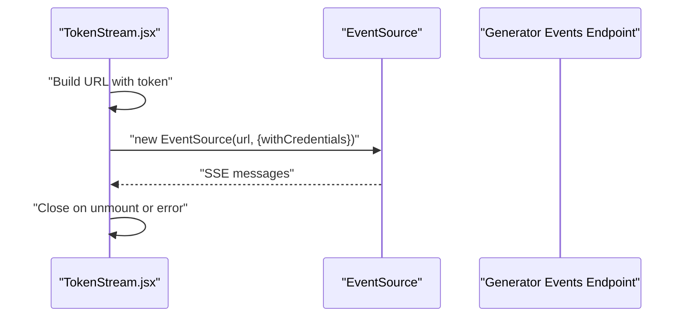

**Diagram sources**
- [TokenStream.jsx:163-181](file://frontend/src/components/generator/TokenStream.jsx#L163-L181)

**Section sources**
- [TokenStream.jsx:163-181](file://frontend/src/components/generator/TokenStream.jsx#L163-L181)

### Agent Events Hook
- Manages agent-specific SSE events for outline and stage updates
- Initializes buffers and last stage tracking
- Creates EventSource connection and cleans up on unmount

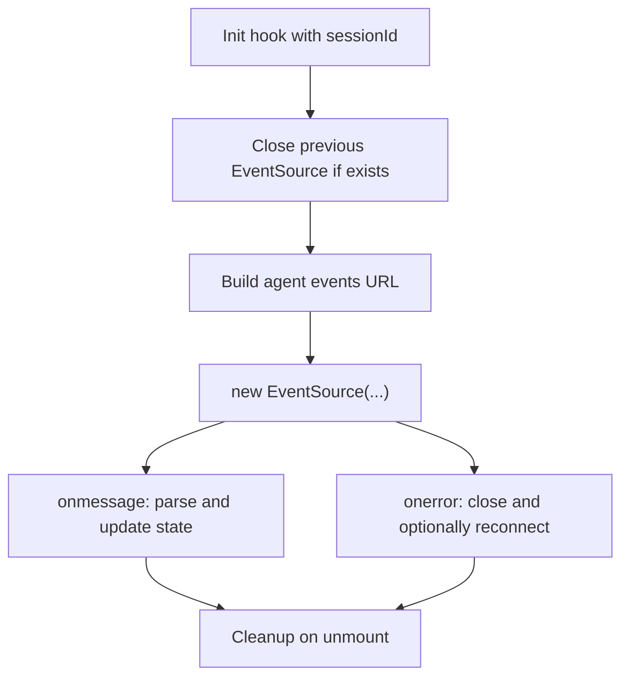

**Diagram sources**
- [useAgentEvents.js:18-36](file://frontend/src/hooks/useAgentEvents.js#L18-L36)

**Section sources**
- [useAgentEvents.js:1-37](file://frontend/src/hooks/useAgentEvents.js#L1-L37)

## Dependency Analysis
- Backend dependencies:
  - stream.py depends on events.py for event construction and pubsub.py for transport
  - RedisPubSub encapsulates Redis availability and fallback behavior
- Frontend dependencies:
  - useSessionEventStream.js composes specialized hooks and service URLs
  - TokenStream.jsx and useAgentEvents.js depend on the generator events endpoint

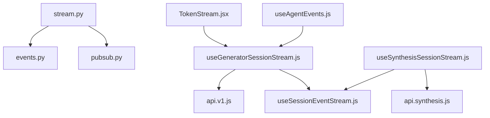

**Diagram sources**
- [stream.py:16-29](file://backend/app/routers/stream.py#L16-L29)
- [events.py:21-33](file://backend/app/realtime/events.py#L21-L33)
- [pubsub.py:18-27](file://backend/app/realtime/pubsub.py#L18-L27)
- [useGeneratorSessionStream.js:5-11](file://frontend/src/hooks/useGeneratorSessionStream.js#L5-L11)
- [useSynthesisSessionStream.js:5-11](file://frontend/src/hooks/useSynthesisSessionStream.js#L5-L11)
- [useSessionEventStream.js:4-101](file://frontend/src/hooks/useSessionEventStream.js#L4-L101)
- [api.v1.js](file://frontend/src/services/api.v1.js)
- [api.synthesis.js](file://frontend/src/services/api.synthesis.js)
- [TokenStream.jsx:163-181](file://frontend/src/components/generator/TokenStream.jsx#L163-L181)
- [useAgentEvents.js:18-36](file://frontend/src/hooks/useAgentEvents.js#L18-L36)

**Section sources**
- [stream.py:16-29](file://backend/app/routers/stream.py#L16-L29)
- [events.py:21-33](file://backend/app/realtime/events.py#L21-L33)
- [pubsub.py:18-27](file://backend/app/realtime/pubsub.py#L18-L27)
- [useGeneratorSessionStream.js:5-11](file://frontend/src/hooks/useGeneratorSessionStream.js#L5-L11)
- [useSynthesisSessionStream.js:5-11](file://frontend/src/hooks/useSynthesisSessionStream.js#L5-L11)
- [useSessionEventStream.js:4-101](file://frontend/src/hooks/useSessionEventStream.js#L4-L101)
- [api.v1.js](file://frontend/src/services/api.v1.js)
- [api.synthesis.js](file://frontend/src/services/api.synthesis.js)
- [TokenStream.jsx:163-181](file://frontend/src/components/generator/TokenStream.jsx#L163-L181)
- [useAgentEvents.js:18-36](file://frontend/src/hooks/useAgentEvents.js#L18-L36)

## Performance Considerations
- Redis pub/sub:
  - Prefer Redis in production for horizontal scaling and queue depth visibility
  - Fallback to in-memory queues is supported but not suitable for multi-instance deployments
- SSE connection lifecycle:
  - Use exponential backoff to avoid thundering herds on server restarts
  - Close connections on unmount to prevent leaks
- Event payload sizes:
  - Keep payloads concise; truncate long inputs/outputs in callbacks
- Memory management:
  - Limit retained event buffers on the backend (e.g., callback event history)
  - Frontend should cap stage arrays and clear buffers on completion or error
- Chunk processing:
  - SSE frames are streamed; ensure parsers handle partial reads safely
- Metrics:
  - Track open/closed connections for capacity planning

**Section sources**
- [pubsub.py:40-53](file://backend/app/realtime/pubsub.py#L40-L53)
- [useSessionEventStream.js:80-87](file://frontend/src/hooks/useSessionEventStream.js#L80-L87)
- [streaming.py:82-92](file://backend/app/pipeline/agents/streaming.py#L82-L92)

## Troubleshooting Guide
- Connection fails immediately:
  - Verify authentication and that the endpoint requires authentication
  - Confirm Redis connectivity; fallback to in-memory queues if Redis is down
- No events received after “connected”:
  - Ensure emit_event is invoked with the correct job_id/channel
  - Check that the pipeline emits events and that the callback forwards them
- Frequent disconnections:
  - Implement exponential backoff and ensure the frontend closes stale connections
  - Validate that the server handles client disconnects gracefully
- Payload parsing errors:
  - Ensure emitted events are valid JSON and include required fields
  - Frontend should guard against malformed messages and continue streaming

**Section sources**
- [stream.py:60-70](file://backend/app/routers/stream.py#L60-L70)
- [pubsub.py:40-53](file://backend/app/realtime/pubsub.py#L40-L53)
- [stream.py:73-95](file://backend/app/routers/stream.py#L73-L95)
- [useSessionEventStream.js:71-74](file://frontend/src/hooks/useSessionEventStream.js#L71-L74)

## Conclusion
The streaming implementation leverages SSE with a Redis-backed pub/sub backbone to deliver real-time updates across generator and synthesis sessions. The backend provides a standardized event model and robust fallback behavior, while the frontend offers resilient hooks with optimistic UI updates and automatic reconnection. Together, these components enable scalable, low-latency streaming for interactive experiences.

## Appendices

### Streaming Data Format
- Event envelope:
  - event_type: string identifying the event category
  - job_id/session_id: identifiers for scoping
  - request_id: correlation ID for tracing
  - stage/progress: optional metadata for UI state
  - timestamp: ISO-formatted UTC timestamp
  - payload: free-form data for the event
- Example fields:
  - llm_start/llm_end/tool_start/tool_end/agent_action/agent_finish/chain_start/chain_end

**Section sources**
- [events.py:9-34](file://backend/app/realtime/events.py#L9-L34)
- [streaming.py:54-116](file://backend/app/pipeline/agents/streaming.py#L54-L116)

### Implementing a New Streaming Endpoint
- Backend steps:
  - Define a new route returning EventSourceResponse
  - Subscribe to a dedicated Redis channel for the resource type
  - Emit a “connected” event and stream subsequent events
  - Use emit_event to publish structured events from background tasks or pipelines
- Frontend steps:
  - Create a new hook similar to useSessionEventStream.js
  - Provide a URL builder for the new endpoint
  - Integrate with UI components to render progress and completion

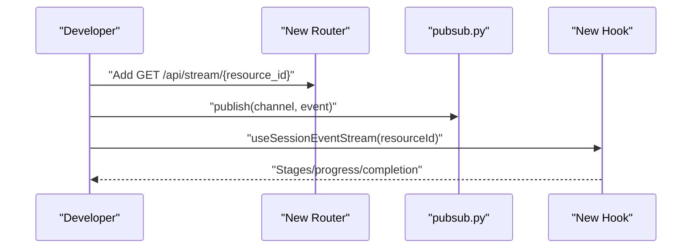

**Diagram sources**
- [stream.py:32-70](file://backend/app/routers/stream.py#L32-L70)
- [pubsub.py:55-78](file://backend/app/realtime/pubsub.py#L55-L78)
- [useSessionEventStream.js:20-90](file://frontend/src/hooks/useSessionEventStream.js#L20-L90)

**Section sources**
- [stream.py:32-70](file://backend/app/routers/stream.py#L32-L70)
- [pubsub.py:55-78](file://backend/app/realtime/pubsub.py#L55-L78)
- [useSessionEventStream.js:20-90](file://frontend/src/hooks/useSessionEventStream.js#L20-L90)

### Handling Connection Interruptions
- Frontend:
  - Implement exponential backoff reconnection
  - Close stale connections and clear timeouts on unmount
  - Surface user-facing errors after max retries
- Backend:
  - Detect client disconnects promptly and stop publishing
  - Track connection open/close for observability

**Section sources**
- [useSessionEventStream.js:76-96](file://frontend/src/hooks/useSessionEventStream.js#L76-L96)
- [stream.py:48-57](file://backend/app/routers/stream.py#L48-L57)

### Optimistic UI Updates and Completion Handling
- Optimistic updates:
  - Update stages and progress immediately upon receiving events
  - Merge stage entries by name to reflect incremental changes
- Completion:
  - Trigger completion when progress reaches threshold or terminal statuses are observed
  - Clear buffers and stop listening after completion

**Section sources**
- [useSessionEventStream.js:40-74](file://frontend/src/hooks/useSessionEventStream.js#L40-L74)

### Performance Optimization and Memory Management
- Backend:
  - Limit event payload sizes; truncate long previews
  - Use request context to correlate events and reduce overhead
- Frontend:
  - Cap stage arrays and clear buffers on completion
  - Avoid retaining large intermediate strings in memory
- Infrastructure:
  - Use Redis in production for scalability and queue depth monitoring
  - Monitor Redis health and queue depths for capacity planning

**Section sources**
- [002-redis-realtime-backbone.md:1-10](file://docs/adr/002-redis-realtime-backbone.md#L1-L10)
- [pubsub.py:40-53](file://backend/app/realtime/pubsub.py#L40-L53)
- [streaming.py:82-92](file://backend/app/pipeline/agents/streaming.py#L82-L92)
- [useSessionEventStream.js:40-74](file://frontend/src/hooks/useSessionEventStream.js#L40-L74)