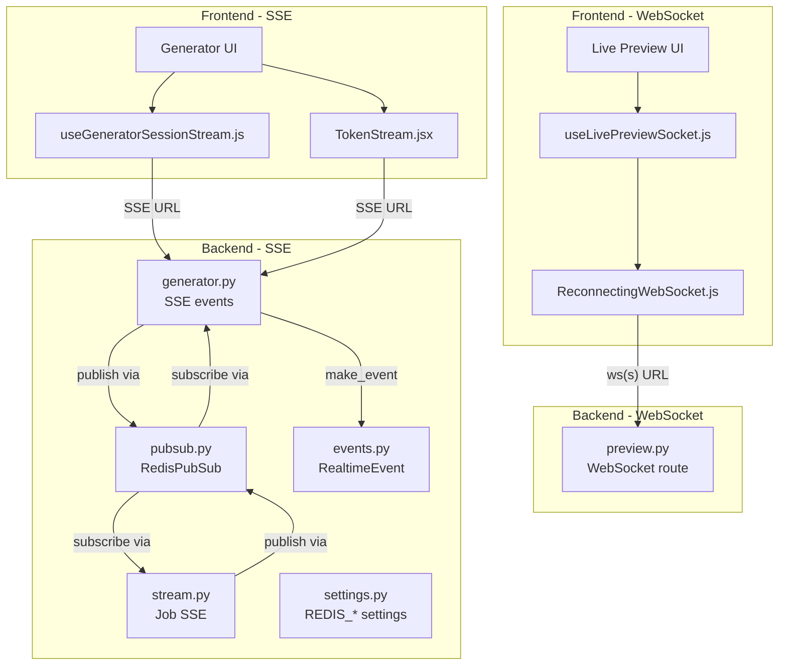
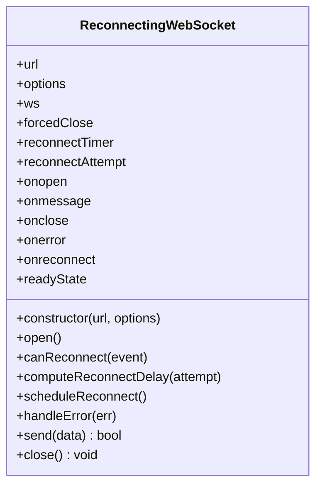
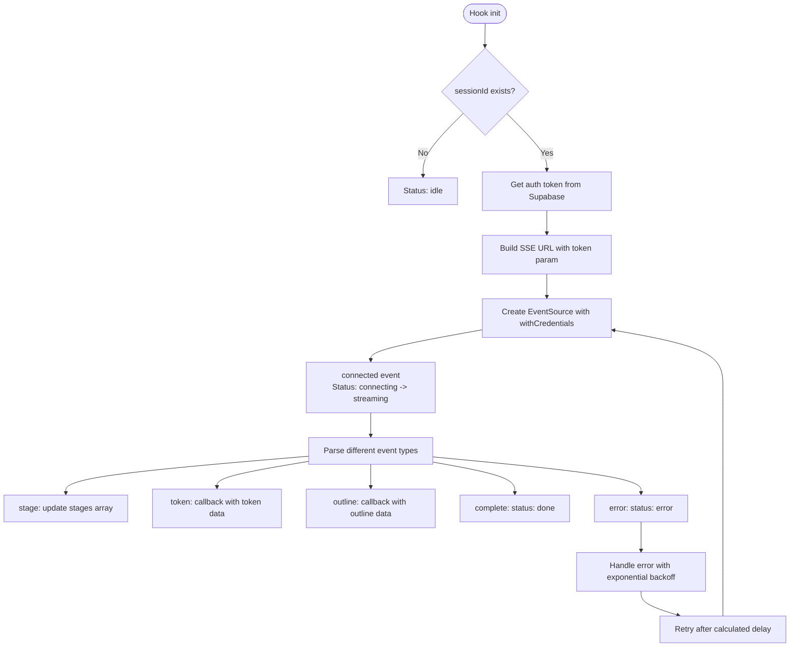
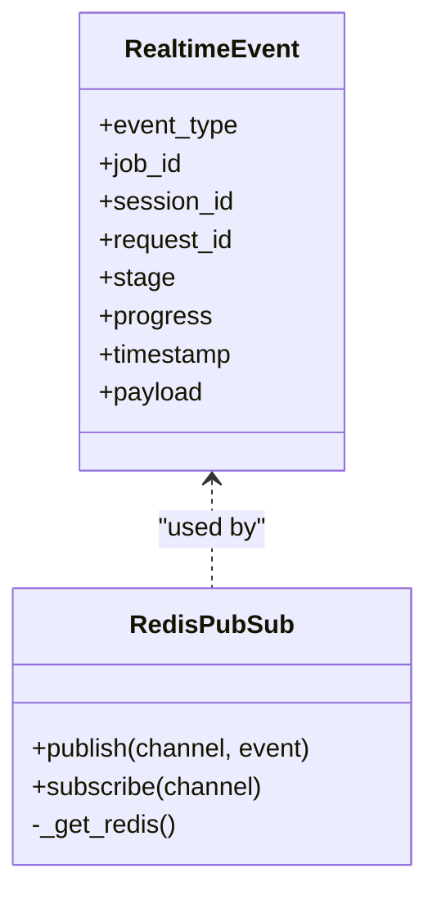
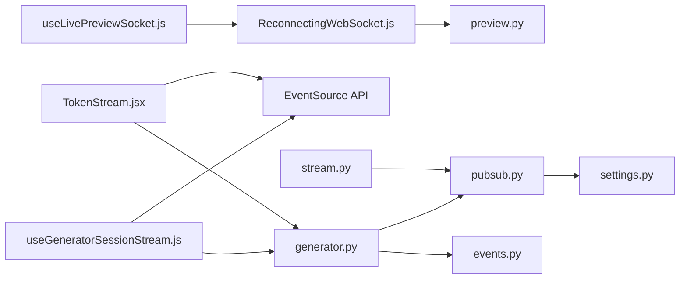

# WebSocket Implementation

<cite>
**Referenced Files in This Document**
- [ReconnectingWebSocket.js](file://frontend/src/lib/ReconnectingWebSocket.js)
- [useLivePreviewSocket.js](file://frontend/src/hooks/useLivePreviewSocket.js)
- [useGeneratorSessionStream.js](file://frontend/src/hooks/useGeneratorSessionStream.js)
- [TokenStream.jsx](file://frontend/src/components/generator/TokenStream.jsx)
- [generator.py](file://backend/app/routers/v1/generator.py)
- [stream.py](file://backend/app/routers/stream.py)
- [events.py](file://backend/app/realtime/events.py)
- [pubsub.py](file://backend/app/realtime/pubsub.py)
- [settings.py](file://backend/app/config/settings.py)
- [002-redis-realtime-backbone.md](file://docs/adr/002-redis-realtime-backbone.md)
</cite>

## Update Summary
**Changes Made**
- Enhanced WebSocket implementation with improved reconnection logic and exponential backoff
- Added comprehensive error handling patterns in useGeneratorSessionStream hook
- Introduced Server-Sent Events (SSE) for real-time streaming in generator sessions
- Updated connection lifecycle management with better state tracking and latency measurement
- Improved automatic reconnection strategies with jitter and retry limits

## Table of Contents
1. [Introduction](#introduction)
2. [Project Structure](#project-structure)
3. [Core Components](#core-components)
4. [Architecture Overview](#architecture-overview)
5. [Detailed Component Analysis](#detailed-component-analysis)
6. [Dependency Analysis](#dependency-analysis)
7. [Performance Considerations](#performance-considerations)
8. [Troubleshooting Guide](#troubleshooting-guide)
9. [Conclusion](#conclusion)

## Introduction
This document explains the WebSocket and Server-Sent Events (SSE) implementation powering real-time features in the application. It covers both WebSocket connections for live preview and SSE streams for generator sessions, focusing on the ReconnectingWebSocket class, connection lifecycle management, automatic reconnection strategies, exponential backoff with jitter, session-based routing, state management, message handling, payload structure, event callbacks, error handling patterns, connection timeout strategies, and graceful degradation when real-time features are unavailable.

## Project Structure
The real-time feature implementation spans both WebSocket and SSE approaches across the frontend and backend:
- Frontend: Reusable WebSocket wrapper, React hooks for different real-time scenarios, and SSE implementations
- Backend: FastAPI routes for both WebSocket and SSE endpoints, Redis-based pub/sub infrastructure, and event data structures



**Diagram sources**
- [useLivePreviewSocket.js:16-20](file://frontend/src/hooks/useLivePreviewSocket.js#L16-L20)
- [ReconnectingWebSocket.js:5-31](file://frontend/src/lib/ReconnectingWebSocket.js#L5-L31)
- [useGeneratorSessionStream.js:15-18](file://frontend/src/hooks/useGeneratorSessionStream.js#L15-L18)
- [TokenStream.jsx:175-181](file://frontend/src/components/generator/TokenStream.jsx#L175-L181)
- [generator.py:479-527](file://backend/app/routers/v1/generator.py#L479-L527)
- [stream.py:60-70](file://backend/app/routers/stream.py#L60-L70)
- [pubsub.py:18-120](file://backend/app/realtime/pubsub.py#L18-L120)
- [events.py:9-34](file://backend/app/realtime/events.py#L9-L34)
- [settings.py:156-162](file://backend/app/config/settings.py#L156-L162)

**Section sources**
- [useLivePreviewSocket.js:16-20](file://frontend/src/hooks/useLivePreviewSocket.js#L16-L20)
- [ReconnectingWebSocket.js:5-31](file://frontend/src/lib/ReconnectingWebSocket.js#L5-L31)
- [useGeneratorSessionStream.js:15-18](file://frontend/src/hooks/useGeneratorSessionStream.js#L15-L18)
- [TokenStream.jsx:175-181](file://frontend/src/components/generator/TokenStream.jsx#L175-L181)
- [generator.py:479-527](file://backend/app/routers/v1/generator.py#L479-L527)
- [stream.py:60-70](file://backend/app/routers/stream.py#L60-L70)
- [pubsub.py:18-120](file://backend/app/realtime/pubsub.py#L18-L120)
- [events.py:9-34](file://backend/app/realtime/events.py#L9-L34)
- [settings.py:156-162](file://backend/app/config/settings.py#L156-L162)

## Core Components
- **ReconnectingWebSocket**: A robust wrapper around the browser's WebSocket API that adds exponential backoff with jitter, retry limits, and reconnect scheduling. It exposes event callbacks and a send method.
- **useLivePreviewSocket**: A React hook that constructs the WebSocket URL from the API base URL, manages connection state flags, debounces and sends payloads, and handles incoming preview updates.
- **useGeneratorSessionStream**: A React hook that implements Server-Sent Events (SSE) for real-time generator session streaming with comprehensive error handling, exponential backoff, and latency measurement.
- **TokenStream**: A component that uses SSE to stream tokenized content in real-time with word-by-word flushing and intelligent section management.
- **Backend SSE Routes**: FastAPI routes that provide real-time event streaming via Server-Sent Events with Redis pub/sub integration.
- **RedisPubSub**: Publish/subscribe layer that uses Redis when available, with in-memory fallback for resilience.
- **RealtimeEvent**: A structured event builder for real-time updates.

Key capabilities:
- Automatic reconnection with exponential backoff and jitter for WebSocket connections
- Comprehensive error handling and retry logic for SSE streams
- Session-based routing via URL path parameters
- Payload structure with content, templateId, optional cursor, checksum, and sequence number
- Event-driven updates with structured payloads and latency measurement
- Graceful degradation when real-time features are unavailable

**Section sources**
- [ReconnectingWebSocket.js:5-31](file://frontend/src/lib/ReconnectingWebSocket.js#L5-L31)
- [useLivePreviewSocket.js:28-102](file://frontend/src/hooks/useLivePreviewSocket.js#L28-L102)
- [useGeneratorSessionStream.js:6-141](file://frontend/src/hooks/useGeneratorSessionStream.js#L6-L141)
- [TokenStream.jsx:151-268](file://frontend/src/components/generator/TokenStream.jsx#L151-L268)
- [generator.py:479-527](file://backend/app/routers/v1/generator.py#L479-L527)
- [pubsub.py:18-120](file://backend/app/realtime/pubsub.py#L18-L120)
- [events.py:9-34](file://backend/app/realtime/events.py#L9-L34)

## Architecture Overview
The real-time feature architecture implements two complementary approaches:
- **WebSocket approach**: Live preview functionality using ReconnectingWebSocket with exponential backoff
- **SSE approach**: Generator session streaming with comprehensive error handling and retry logic

```mermaid
sequenceDiagram
participant FE as "Frontend Hook<br/>useLivePreviewSocket.js"
participant RWS as "ReconnectingWebSocket.js"
participant BE as "FastAPI WebSocket<br/>preview.py"
FE->>RWS : Create WebSocket with backoff options
RWS->>BE : Open WebSocket connection
BE-->>RWS : onopen callback
FE->>RWS : send(JSON payload)
RWS->>BE : Text frame with JSON
BE-->>RWS : Forward event
RWS-->>FE : onmessage callback
sequenceDiagram
participant FE2 as "Frontend Hook<br/>useGeneratorSessionStream.js"
participant SSE as "SSE Client"
participant BE2 as "FastAPI SSE<br/>generator.py"
FE2->>SSE : Create EventSource with auth token
SSE->>BE2 : Connect to /sessions/{sessionId}/events
BE2-->>SSE : connected event
loop Streaming loop
BE2-->>SSE : stage, token, outline, complete events
SSE-->>FE2 : Event callbacks with parsed data
end
SSE->>SSE : Handle error with exponential backoff
SSE->>BE2 : Reconnect after delay
```

**Diagram sources**
- [useLivePreviewSocket.js:44-102](file://frontend/src/hooks/useLivePreviewSocket.js#L44-L102)
- [ReconnectingWebSocket.js:33-67](file://frontend/src/lib/ReconnectingWebSocket.js#L33-L67)
- [useGeneratorSessionStream.js:29-128](file://frontend/src/hooks/useGeneratorSessionStream.js#L29-L128)
- [generator.py:479-527](file://backend/app/routers/v1/generator.py#L479-L527)

## Detailed Component Analysis

### ReconnectingWebSocket Class
Responsibilities:
- Manage WebSocket lifecycle and reconnection with exponential backoff and jitter
- Expose event callbacks: onopen, onmessage, onclose, onerror, onreconnect
- Compute reconnect delay using exponential backoff with configurable jitter
- Track reconnectAttempt and forcedClose flag
- Provide send and close helpers with proper cleanup

Implementation highlights:
- Constructor merges defaults with user options including initialDelay, maxDelay, factor, jitter, and maxRetries
- open() creates a native WebSocket and wires event handlers; resets reconnectAttempt on successful connection
- canReconnect() respects maxRetries and an optional shouldReconnect predicate
- computeReconnectDelay() calculates capped exponential delay with jitter applied to min/max bounds
- scheduleReconnect() triggers onreconnect callback, sets a timer, increments reconnectAttempt, and retries open()
- handleError() invokes onerror and schedules a reconnect
- send() checks readyState before sending; returns whether the send succeeded
- close() cancels timers, clears listeners, closes the underlying socket if needed, and marks forcedClose



**Diagram sources**
- [ReconnectingWebSocket.js:5-147](file://frontend/src/lib/ReconnectingWebSocket.js#L5-L147)

**Section sources**
- [ReconnectingWebSocket.js:5-31](file://frontend/src/lib/ReconnectingWebSocket.js#L5-L31)
- [ReconnectingWebSocket.js:33-67](file://frontend/src/lib/ReconnectingWebSocket.js#L33-L67)
- [ReconnectingWebSocket.js:69-79](file://frontend/src/lib/ReconnectingWebSocket.js#L69-L79)
- [ReconnectingWebSocket.js:81-92](file://frontend/src/lib/ReconnectingWebSocket.js#L81-L92)
- [ReconnectingWebSocket.js:94-109](file://frontend/src/lib/ReconnectingWebSocket.js#L94-L109)
- [ReconnectingWebSocket.js:111-114](file://frontend/src/lib/ReconnectingWebSocket.js#L111-L114)
- [ReconnectingWebSocket.js:116-122](file://frontend/src/lib/ReconnectingWebSocket.js#L116-L122)
- [ReconnectingWebSocket.js:124-142](file://frontend/src/lib/ReconnectingWebSocket.js#L124-L142)
- [ReconnectingWebSocket.js:144-147](file://frontend/src/lib/ReconnectingWebSocket.js#L144-L147)

### Frontend Hook: useLivePreviewSocket
Responsibilities:
- Build ws(s) URL from NEXT_PUBLIC_API_URL and session ID
- Initialize ReconnectingWebSocket with backoff parameters
- Manage connection state flags: isConnected, isReconnecting, reconnectAttempt, isAnalyzing
- Debounce and send content updates with payload structure
- Parse incoming preview updates and compute latency

Key behaviors:
- URL construction converts http(s) to ws(s) and appends the preview WebSocket endpoint with session ID
- onopen resets reconnect state and replays any pending payload
- onmessage parses JSON, updates HTML/warnings, computes latency, and clears analyzing state
- onclose/onerror set isConnected to false
- onreconnect toggles isReconnecting and tracks reconnectAttempt
- sendContent debounces input, computes a lightweight checksum, assigns a sequence number, and sends when the socket is ready

**Section sources**
- [useLivePreviewSocket.js:16-20](file://frontend/src/hooks/useLivePreviewSocket.js#L16-L20)
- [useLivePreviewSocket.js:44-102](file://frontend/src/hooks/useLivePreviewSocket.js#L44-L102)
- [useLivePreviewSocket.js:106-133](file://frontend/src/hooks/useLivePreviewSocket.js#L106-L133)

### Frontend Hook: useGeneratorSessionStream
**Updated** Enhanced with comprehensive error handling and exponential backoff

Responsibilities:
- Establish Server-Sent Events (SSE) connection to generator session events
- Manage connection state with status tracking (idle, connecting, reconnecting, streaming, done, error)
- Implement exponential backoff with jitter for reconnection attempts
- Handle authentication tokens via Supabase session
- Parse and process different event types: connected, stage, token, outline, complete, error
- Measure connection latency and track reconnect counts

Key behaviors:
- URL construction includes authentication token from Supabase session when available
- Initial connection sets status to 'connecting' and measures connection latency
- Event listeners handle different event types with robust JSON parsing
- Error handling includes exponential backoff: 1s → 2s → 4s → 8s → max 30s
- Reconnection logic tracks attempt count and updates reconnectCount state
- Cleanup properly handles component unmount and connection termination



**Diagram sources**
- [useGeneratorSessionStream.js:20-137](file://frontend/src/hooks/useGeneratorSessionStream.js#L20-L137)

**Section sources**
- [useGeneratorSessionStream.js:6-141](file://frontend/src/hooks/useGeneratorSessionStream.js#L6-L141)

### Frontend Component: TokenStream
**Updated** Enhanced with improved SSE implementation and word-by-word streaming

Responsibilities:
- Implement Server-Sent Events for real-time token streaming
- Manage word queue with configurable flush interval
- Handle section-based content streaming with completion detection
- Implement intelligent section management and expansion
- Provide smooth auto-scrolling and word count tracking

Key behaviors:
- Uses EventSource with withCredentials for authenticated connections
- Implements word-by-word flushing with 40ms interval
- Handles writing_chunk and stage_update SSE events
- Manages section creation, rewriting, and completion states
- Implements exponential backoff with maximum 15s delay
- Provides visual feedback for active and completed sections

**Section sources**
- [TokenStream.jsx:151-268](file://frontend/src/components/generator/TokenStream.jsx#L151-L268)

### Backend SSE Routes: Generator Sessions
**Updated** Enhanced with comprehensive error handling and authentication

Responsibilities:
- Validate session ownership and existence
- Establish SSE connections with proper authentication
- Stream real-time events to connected clients
- Handle client disconnection gracefully
- Implement Redis pub/sub integration for event distribution

Key behaviors:
- Authentication via get_current_user dependency
- Session validation with 404 error handling
- Event generator yields connected event immediately
- Subscribes to session-specific channels
- Handles client disconnection detection
- Implements Prometheus metrics for connection tracking

**Section sources**
- [generator.py:479-527](file://backend/app/routers/v1/generator.py#L479-L527)

### Backend SSE Routes: Job Streams
**Updated** Enhanced with comprehensive error handling and metrics

Responsibilities:
- Provide real-time job event streaming for agent feedback
- Implement connection lifecycle management
- Handle multiple event types with structured payloads
- Integrate with Redis pub/sub infrastructure

Key behaviors:
- Uses EventSourceResponse for SSE implementation
- Yields connected event with request_id context
- Subscribes to job-specific channels
- Handles client disconnection detection
- Integrates with Prometheus metrics for monitoring

**Section sources**
- [stream.py:60-70](file://backend/app/routers/stream.py#L60-L70)

### Realtime Event Model and Pub/Sub
- RealtimeEvent defines a typed event with fields such as event_type, session_id, request_id, stage, progress, timestamp, and payload
- make_event() constructs a dictionary suitable for transport, injecting request_id if not present and serializing timestamp
- RedisPubSub supports publish/subscribe with Redis when enabled; otherwise falls back to in-memory queues per loop



**Diagram sources**
- [events.py:9-34](file://backend/app/realtime/events.py#L9-L34)
- [pubsub.py:18-120](file://backend/app/realtime/pubsub.py#L18-L120)

**Section sources**
- [events.py:9-34](file://backend/app/realtime/events.py#L9-L34)
- [pubsub.py:18-120](file://backend/app/realtime/pubsub.py#L18-L120)

## Dependency Analysis
- Frontend depends on:
  - ReconnectingWebSocket for WebSocket connections
  - React hooks for state and lifecycle management
  - EventSource API for SSE connections
  - Supabase for authentication token retrieval
  - Environment variables for API base URLs
- Backend depends on:
  - FastAPI for route definitions
  - RedisPubSub for pub/sub infrastructure
  - RealtimeEvent for structured payloads
  - Settings for Redis configuration
  - Prometheus metrics for monitoring



**Diagram sources**
- [useLivePreviewSocket.js:1-3](file://frontend/src/hooks/useLivePreviewSocket.js#L1-L3)
- [useGeneratorSessionStream.js:1-5](file://frontend/src/hooks/useGeneratorSessionStream.js#L1-L5)
- [TokenStream.jsx:1-6](file://frontend/src/components/generator/TokenStream.jsx#L1-L6)
- [ReconnectingWebSocket.js:5-31](file://frontend/src/lib/ReconnectingWebSocket.js#L5-L31)
- [generator.py:479-527](file://backend/app/routers/v1/generator.py#L479-L527)
- [stream.py:60-70](file://backend/app/routers/stream.py#L60-L70)
- [pubsub.py:18-120](file://backend/app/realtime/pubsub.py#L18-L120)
- [events.py:21-34](file://backend/app/realtime/events.py#L21-L34)
- [settings.py:156-162](file://backend/app/config/settings.py#L156-L162)

**Section sources**
- [useLivePreviewSocket.js:1-3](file://frontend/src/hooks/useLivePreviewSocket.js#L1-L3)
- [useGeneratorSessionStream.js:1-5](file://frontend/src/hooks/useGeneratorSessionStream.js#L1-L5)
- [TokenStream.jsx:1-6](file://frontend/src/components/generator/TokenStream.jsx#L1-L6)
- [ReconnectingWebSocket.js:5-31](file://frontend/src/lib/ReconnectingWebSocket.js#L5-L31)
- [generator.py:479-527](file://backend/app/routers/v1/generator.py#L479-L527)
- [stream.py:60-70](file://backend/app/routers/stream.py#L60-L70)
- [pubsub.py:18-120](file://backend/app/realtime/pubsub.py#L18-L120)
- [events.py:21-34](file://backend/app/realtime/events.py#L21-L34)
- [settings.py:156-162](file://backend/app/config/settings.py#L156-L162)

## Performance Considerations
- **Backoff strategy**: Exponential backoff with jitter reduces thundering herd and stabilizes recovery after transient failures
- **Latency measurement**: Both WebSocket and SSE implementations measure round-trip latency by recording send timestamps and updating upon receiving responses
- **Connection pooling**: RedisPubSub maintains connection pools per event loop for optimal performance
- **Memory management**: SSE implementations properly clean up event listeners and timers on component unmount
- **Rate limiting**: Backend routes implement proper error handling to prevent resource exhaustion during connection storms
- **Graceful degradation**: Both WebSocket and SSE implementations fall back to in-memory queues when Redis is unavailable

## Troubleshooting Guide
Common scenarios and remedies:
- **WebSocket connection fails immediately**:
  - Verify NEXT_PUBLIC_API_URL and that the backend is reachable
  - Check that the WebSocket route path matches the constructed URL
  - Verify SSL certificate validity for secure WebSocket connections
- **Frequent WebSocket reconnections**:
  - Inspect onreconnect callbacks to confirm retry attempts and delays
  - Review shouldReconnect predicate if overridden
  - Check network stability and firewall configurations
- **SSE connection drops frequently**:
  - Verify authentication token validity and refresh mechanism
  - Check exponential backoff configuration (1s → 2s → 4s → 8s → max 30s)
  - Monitor server-side Redis connectivity
- **Messages not received**:
  - Ensure the payload is valid JSON and includes required fields
  - Confirm the session ID is valid and matches the route pattern
  - Verify proper event type handling in event listeners
- **Redis unavailability**:
  - The backend falls back to in-memory queues; expect limited scalability but functional behavior
  - Monitor logs for Redis-related warnings and fallback triggers
- **Memory leaks in SSE**:
  - Ensure proper cleanup of event listeners and timers on component unmount
  - Verify that reconnectTimeoutRef is cleared when components unmount

Operational tips:
- Use onerror and onclose handlers to surface connection issues to users
- Implement maximum retry limits via options.maxRetries to prevent indefinite reconnection loops
- Gracefully degrade by disabling real-time features when WebSocket/SSE is unavailable
- Monitor Prometheus metrics for connection counts and error rates
- Implement proper authentication token refresh for SSE connections

**Section sources**
- [ReconnectingWebSocket.js:69-79](file://frontend/src/lib/ReconnectingWebSocket.js#L69-L79)
- [ReconnectingWebSocket.js:111-114](file://frontend/src/lib/ReconnectingWebSocket.js#L111-L114)
- [useGeneratorSessionStream.js:120-127](file://frontend/src/hooks/useGeneratorSessionStream.js#L120-L127)
- [TokenStream.jsx:245-253](file://frontend/src/components/generator/TokenStream.jsx#L245-L253)
- [generator.py:479-527](file://backend/app/routers/v1/generator.py#L479-L527)
- [pubsub.py:40-53](file://backend/app/realtime/pubsub.py#L40-L53)

## Conclusion
The WebSocket and SSE implementation provides a robust foundation for real-time features in the application. The enhanced ReconnectingWebSocket class offers reliable WebSocket connections with exponential backoff and jitter, while the new SSE implementation for generator sessions provides comprehensive error handling, authentication integration, and intelligent reconnection strategies. Together with Redis-backed pub/sub infrastructure and structured event models, these components deliver predictable behavior under failure conditions while maintaining excellent user experience through graceful degradation and proper resource management.