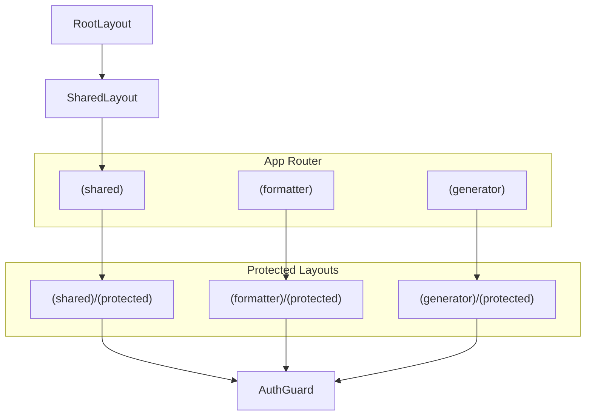
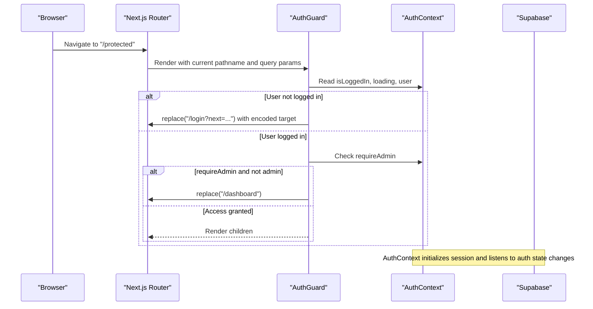
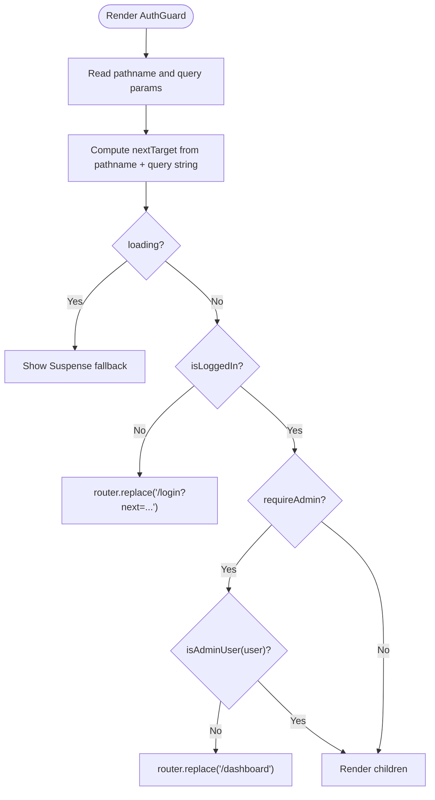
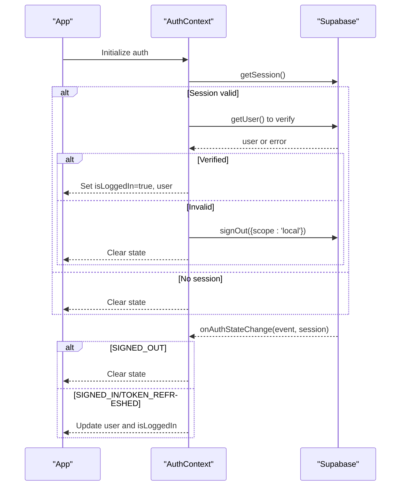
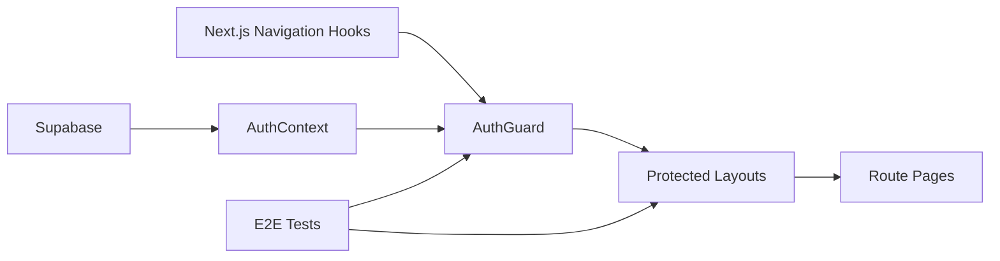

# Routing and Navigation

<cite>
**Referenced Files in This Document**
- [RootLayout](file://frontend/app/layout.jsx)
- [SharedLayout](file://frontend/app/(shared)/layout.jsx)
- [FormatterProtectedLayout](file://frontend/app/(formatter)/(protected)/layout.jsx)
- [GeneratorProtectedLayout](file://frontend/app/(generator)/(protected)/layout.jsx)
- [AuthGuard](file://frontend/src/components/layout/AuthGuard.jsx)
- [AuthGuard.test.jsx](file://frontend/src/test/AuthGuard.test.jsx)
- [AuthContext](file://frontend/src/context/AuthContext.jsx)
- [navigation-sidebar-toggle.spec.js](file://frontend/e2e/navigation-sidebar-toggle.spec.js)
- [protected-routes.spec.js](file://frontend/e2e/protected-routes.spec.js)
- [responsive-mobile.spec.js](file://frontend/e2e/responsive-mobile.spec.js)
- [responsive-tablet.spec.js](file://frontend/e2e/responsive-tablet.spec.js)
- [SharedProtectedLayout](file://frontend/app/(shared)/(protected)/layout.jsx)
- [next.config.mjs](file://frontend/next.config.mjs)
- [package.json](file://frontend/package.json)
</cite>

## Table of Contents
1. [Introduction](#introduction)
2. [Project Structure](#project-structure)
3. [Core Components](#core-components)
4. [Architecture Overview](#architecture-overview)
5. [Detailed Component Analysis](#detailed-component-analysis)
6. [Dependency Analysis](#dependency-analysis)
7. [Performance Considerations](#performance-considerations)
8. [Troubleshooting Guide](#troubleshooting-guide)
9. [Conclusion](#conclusion)
10. [Appendices](#appendices)

## Introduction
This document explains the routing patterns and navigation implementation in the frontend application. It covers the App Router structure with route groups, protected routes, and authentication guards. It also documents the navigation sidebar, breadcrumb systems, and active state management, along with dynamic routing, query parameter handling, and URL state synchronization. Additional topics include navigation guards, redirect logic, route protection mechanisms, responsive navigation, mobile-first design patterns, accessibility considerations, guidelines for adding new routes, implementing nested layouts, and navigation performance optimization.

## Project Structure
The frontend uses Next.js App Router with route groups to organize pages and enforce protection. Route groups are denoted by parentheses in the filesystem (for example, (formatter), (generator), (shared)). Protected areas are wrapped with an AuthGuard component via dedicated protected layouts.

Key routing areas:
- Shared area: public and shared pages under (shared)
- Formatter area: document formatting features under (formatter)
- Generator area: AI content generation under (generator)
- Protected layouts: AuthGuard applied via (protected) layouts per area
- Authentication callbacks and error surfaces: under (shared) for auth flows

**Diagram sources**
- [SharedLayout](file://frontend/app/(shared)/layout.jsx#L1-L6)
- [FormatterProtectedLayout](file://frontend/app/(formatter)/(protected)/layout.jsx#L1-L6)
- [GeneratorProtectedLayout](file://frontend/app/(generator)/(protected)/layout.jsx#L1-L6)
- [AuthGuard:1-71](file://frontend/src/components/layout/AuthGuard.jsx#L1-L71)
- [RootLayout:32-84](file://frontend/app/layout.jsx#L32-L84)

**Section sources**
- [SharedLayout](file://frontend/app/(shared)/layout.jsx#L1-L6)
- [FormatterProtectedLayout](file://frontend/app/(formatter)/(protected)/layout.jsx#L1-L6)
- [GeneratorProtectedLayout](file://frontend/app/(generator)/(protected)/layout.jsx#L1-L6)
- [RootLayout:32-84](file://frontend/app/layout.jsx#L32-L84)

## Core Components
- AuthGuard: Enforces authentication and optional admin-only access. Captures current pathname and query parameters to preserve state during redirects.
- AuthContext: Provides authentication state, lifecycle hooks, and session management with Supabase.
- Protected layouts: Apply AuthGuard to group routes by area.
- RootLayout: Sets global metadata, viewport, fonts, and accessibility skip-link.

Key behaviors:
- Dynamic routing and query parameter handling: AuthGuard composes a next target from pathname and current query parameters.
- URL state synchronization: Redirects preserve the original URL with encoded query parameters.
- Active state management: Not implemented in code; recommended to derive from current route and query parameters.
- Breadcrumb system: Not implemented in code; recommended to derive from route segments and query parameters.

**Section sources**
- [AuthGuard:1-71](file://frontend/src/components/layout/AuthGuard.jsx#L1-L71)
- [AuthContext:1-340](file://frontend/src/context/AuthContext.jsx#L1-L340)
- [SharedProtectedLayout](file://frontend/app/(shared)/(protected)/layout.jsx#L1-L5)
- [RootLayout:12-30](file://frontend/app/layout.jsx#L12-L30)

## Architecture Overview
The routing architecture enforces authentication and admin-only access through route groups and a centralized guard. AuthGuard reads the current route and query parameters, checks authentication state, and performs redirects as needed. AuthContext manages session lifecycle and ensures consistent state across navigation.

**Diagram sources**
- [AuthGuard:12-35](file://frontend/src/components/layout/AuthGuard.jsx#L12-L35)
- [AuthContext:65-178](file://frontend/src/context/AuthContext.jsx#L65-L178)

**Section sources**
- [AuthGuard:12-35](file://frontend/src/components/layout/AuthGuard.jsx#L12-L35)
- [AuthContext:65-178](file://frontend/src/context/AuthContext.jsx#L65-L178)

## Detailed Component Analysis

### AuthGuard
AuthGuard is a client-side guard that:
- Reads current pathname and query parameters to construct a next target.
- Redirects unauthenticated users to the login page with the intended destination as a query parameter.
- Redirects non-admin users away from admin-only routes.
- Suspense fallback displays a loading indicator while session state is being resolved.

**Diagram sources**
- [AuthGuard:12-56](file://frontend/src/components/layout/AuthGuard.jsx#L12-L56)

**Section sources**
- [AuthGuard:12-56](file://frontend/src/components/layout/AuthGuard.jsx#L12-L56)
- [AuthGuard.test.jsx:28-73](file://frontend/src/test/AuthGuard.test.jsx#L28-L73)

### AuthContext
AuthContext manages authentication state and lifecycle:
- Initializes session by verifying cached tokens with Supabase.
- Subscribes to Supabase auth state changes to keep React state synchronized.
- Provides sign-in/sign-up flows, Google OAuth, OTP verification, password reset, and sign-out.
- Sanitizes redirect paths to prevent unsafe redirects.

**Diagram sources**
- [AuthContext:65-178](file://frontend/src/context/AuthContext.jsx#L65-L178)

**Section sources**
- [AuthContext:65-178](file://frontend/src/context/AuthContext.jsx#L65-L178)

### Protected Layouts
Protected layouts apply AuthGuard to route groups:
- (shared)/(protected): Wraps shared protected pages.
- (formatter)/(protected): Wraps formatter protected pages.
- (generator)/(protected): Wraps generator protected pages.

These layouts ensure all child routes inherit the same authentication and admin checks.

**Section sources**
- [SharedProtectedLayout](file://frontend/app/(shared)/(protected)/layout.jsx#L1-L5)
- [FormatterProtectedLayout](file://frontend/app/(formatter)/(protected)/layout.jsx#L1-L6)
- [GeneratorProtectedLayout](file://frontend/app/(generator)/(protected)/layout.jsx#L1-L6)

### RootLayout and Global Metadata
RootLayout sets global metadata, viewport, fonts, and an accessibility “skip to main content” link. It wraps the app with providers and applies global CSS.

**Section sources**
- [RootLayout:12-30](file://frontend/app/layout.jsx#L12-L30)
- [RootLayout:32-84](file://frontend/app/layout.jsx#L32-L84)

## Dependency Analysis
The routing and navigation stack depends on:
- Next.js App Router and navigation hooks (usePathname, useRouter, useSearchParams)
- AuthGuard and AuthContext for authentication and admin checks
- Supabase for session management and auth state subscriptions
- E2E tests validating protected routes and responsive behavior

**Diagram sources**
- [AuthGuard:3-5](file://frontend/src/components/layout/AuthGuard.jsx#L3-L5)
- [AuthContext:1-10](file://frontend/src/context/AuthContext.jsx#L1-L10)
- [FormatterProtectedLayout](file://frontend/app/(formatter)/(protected)/layout.jsx#L1-L6)
- [GeneratorProtectedLayout](file://frontend/app/(generator)/(protected)/layout.jsx#L1-L6)

**Section sources**
- [AuthGuard:3-5](file://frontend/src/components/layout/AuthGuard.jsx#L3-L5)
- [AuthContext:1-10](file://frontend/src/context/AuthContext.jsx#L1-L10)
- [FormatterProtectedLayout](file://frontend/app/(formatter)/(protected)/layout.jsx#L1-L6)
- [GeneratorProtectedLayout](file://frontend/app/(generator)/(protected)/layout.jsx#L1-L6)

## Performance Considerations
- Optimize package imports: Next.js configuration enables optimized imports for selected libraries to reduce bundle size.
- Tree shaking and build optimization: Sentry and Webpack configurations improve production builds.
- Navigation hydration: AuthGuard uses Suspense to avoid blocking renders while resolving session state.

Recommendations:
- Prefer static rendering for public pages; use server-side rendering for authenticated pages only when necessary.
- Defer heavy computations in AuthGuard to avoid blocking navigation.
- Use Next.js prefetching for frequently visited protected routes.

**Section sources**
- [next.config.mjs:7-11](file://frontend/next.config.mjs#L7-L11)
- [AuthGuard:58-71](file://frontend/src/components/layout/AuthGuard.jsx#L58-L71)

## Troubleshooting Guide
Common issues and resolutions:
- Redirect loops after sign-in: AuthContext guards against clearing state during sign-in/sign-out transitions. Verify that onAuthStateChange is not prematurely clearing state.
- Incorrect next target encoding: AuthGuard encodes the next target; ensure query parameters are preserved and sanitized.
- Admin-only access denied: AuthGuard redirects non-admin users to the dashboard; confirm user roles are correctly stored in app_metadata or user_metadata.
- E2E failures for protected routes: Tests assert redirection to login and admin-only route handling; validate AuthGuard behavior and AuthContext state updates.

**Section sources**
- [AuthContext:140-178](file://frontend/src/context/AuthContext.jsx#L140-L178)
- [AuthGuard:18-35](file://frontend/src/components/layout/AuthGuard.jsx#L18-L35)
- [AuthGuard.test.jsx:28-73](file://frontend/src/test/AuthGuard.test.jsx#L28-L73)
- [protected-routes.spec.js](file://frontend/e2e/protected-routes.spec.js)
- [navigation-sidebar-toggle.spec.js](file://frontend/e2e/navigation-sidebar-toggle.spec.js)

## Conclusion
The routing and navigation system leverages Next.js App Router route groups and a centralized AuthGuard to enforce authentication and admin-only access. AuthContext manages session lifecycle and integrates with Supabase for secure authentication. The design supports dynamic routing, preserves URL state via query parameters, and provides a foundation for responsive navigation and accessibility. Extending the system requires consistent use of protected layouts and AuthGuard, careful handling of query parameters, and adherence to admin-role checks.

## Appendices

### Adding New Routes and Nested Layouts
- Create a new page under an appropriate route group (for example, (shared), (formatter), or (generator)).
- Wrap the page in a protected layout if access control is required.
- Use AuthGuard with requireAdmin when restricting to administrators.
- Preserve query parameters by relying on the built-in handling in AuthGuard.

Guidelines:
- Place shared pages under (shared); area-specific pages under (formatter) or (generator).
- Use (protected) layouts to apply AuthGuard consistently.
- Keep query parameters intact by avoiding manual URL manipulation; rely on Next.js navigation APIs.

**Section sources**
- [SharedProtectedLayout](file://frontend/app/(shared)/(protected)/layout.jsx#L1-L5)
- [FormatterProtectedLayout](file://frontend/app/(formatter)/(protected)/layout.jsx#L1-L6)
- [GeneratorProtectedLayout](file://frontend/app/(generator)/(protected)/layout.jsx#L1-L6)
- [AuthGuard:18-21](file://frontend/src/components/layout/AuthGuard.jsx#L18-L21)

### Responsive Navigation and Accessibility
- Mobile-first design: Tailwind and testing suites validate behavior on mobile and tablet devices.
- Accessibility: RootLayout includes a skip-to-main-content link for keyboard navigation.
- E2E tests cover responsive behavior and navigation toggles.

**Section sources**
- [responsive-mobile.spec.js](file://frontend/e2e/responsive-mobile.spec.js)
- [responsive-tablet.spec.js](file://frontend/e2e/responsive-tablet.spec.js)
- [RootLayout:71-76](file://frontend/app/layout.jsx#L71-L76)