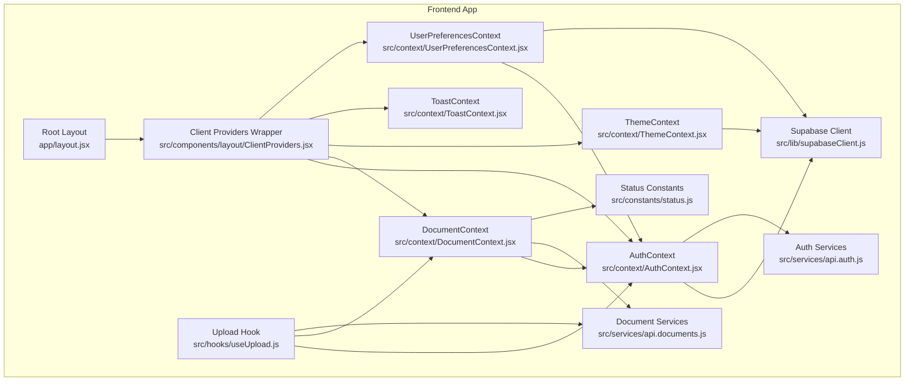
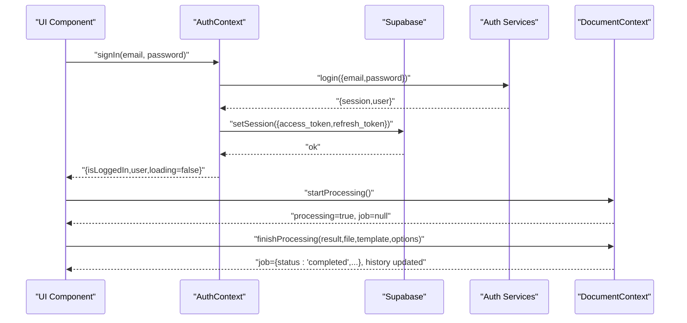
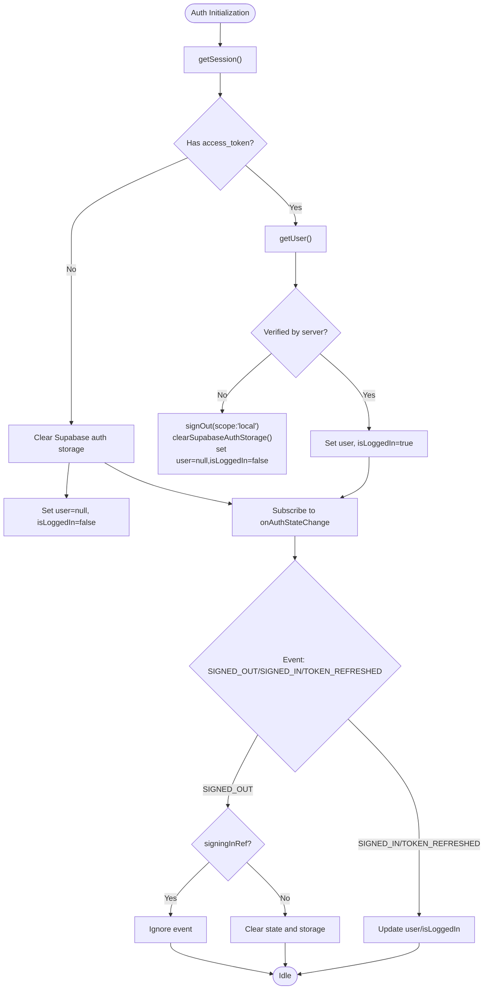
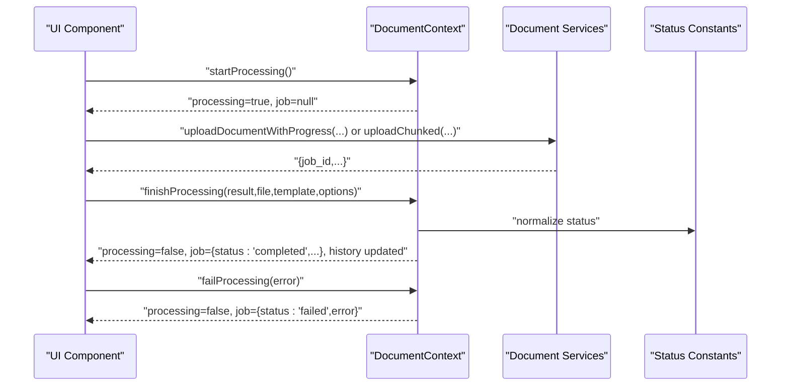
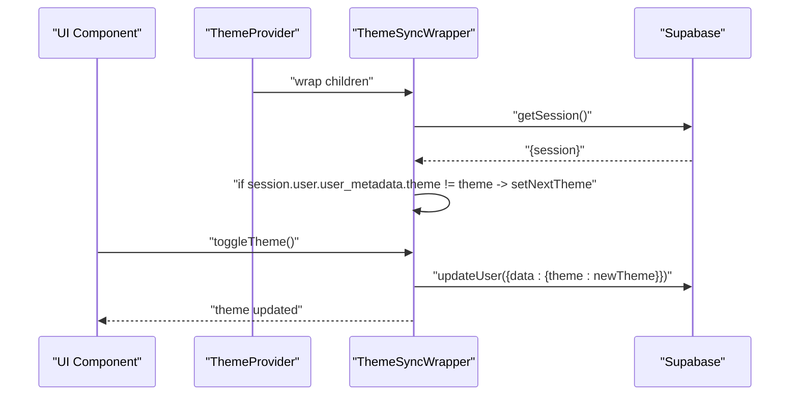
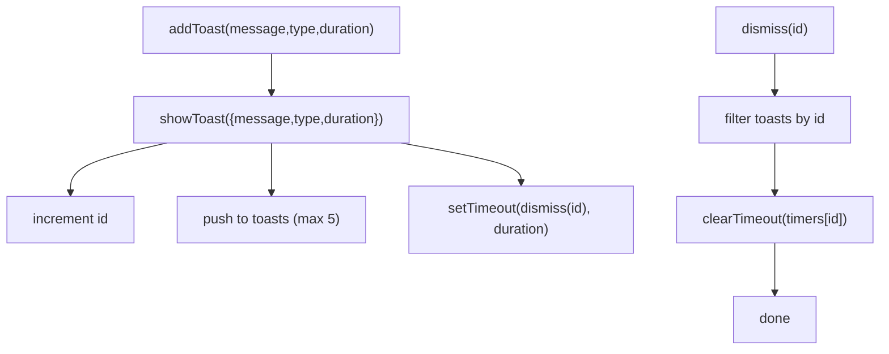
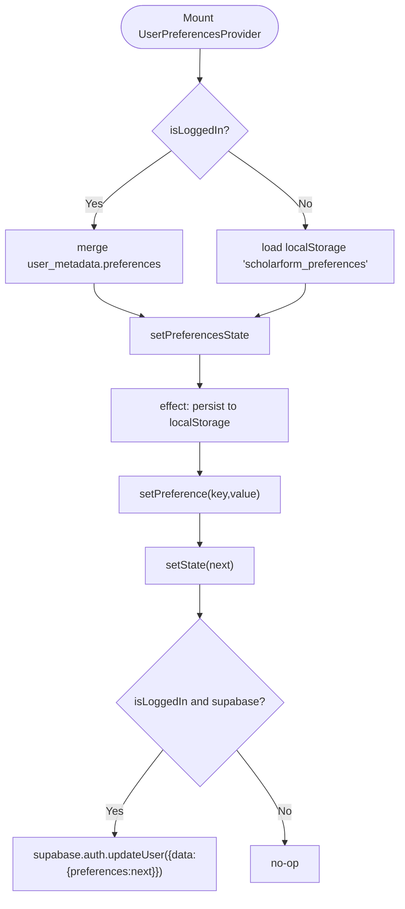
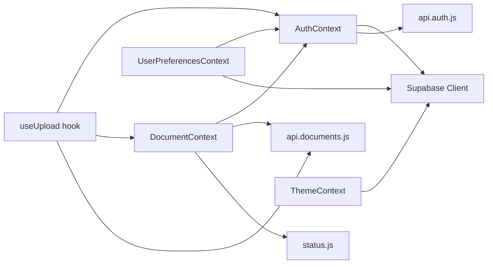

# Context Providers

<cite>
**Referenced Files in This Document**
- [AuthContext.jsx](file://frontend/src/context/AuthContext.jsx)
- [DocumentContext.jsx](file://frontend/src/context/DocumentContext.jsx)
- [ThemeContext.jsx](file://frontend/src/context/ThemeContext.jsx)
- [ToastContext.jsx](file://frontend/src/context/ToastContext.jsx)
- [UserPreferencesContext.jsx](file://frontend/src/context/UserPreferencesContext.jsx)
- [supabaseClient.js](file://frontend/src/lib/supabaseClient.js)
- [status.js](file://frontend/src/constants/status.js)
- [api.auth.js](file://frontend/src/services/api.auth.js)
- [api.documents.js](file://frontend/src/services/api.documents.js)
- [useUpload.js](file://frontend/src/hooks/useUpload.js)
- [layout.jsx](file://frontend/app/layout.jsx)
- [ClientProviders.jsx](file://frontend/src/components/layout/ClientProviders.jsx)
- [ErrorBoundary.jsx](file://frontend/src/components/ErrorBoundary.jsx)
</cite>

## Table of Contents
1. [Introduction](#introduction)
2. [Project Structure](#project-structure)
3. [Core Components](#core-components)
4. [Architecture Overview](#architecture-overview)
5. [Detailed Component Analysis](#detailed-component-analysis)
6. [Dependency Analysis](#dependency-analysis)
7. [Performance Considerations](#performance-considerations)
8. [Troubleshooting Guide](#troubleshooting-guide)
9. [Conclusion](#conclusion)

## Introduction
This document provides comprehensive documentation for all context providers in the frontend application. It covers:
- AuthContext: Authentication state management, user session handling, login/signup flows, and Supabase integration
- DocumentContext: Document processing state, job tracking, processing status, and document metadata
- ThemeContext: Theme switching and user preference persistence
- ToastContext: Notification management and user feedback systems
- UserPreferencesContext: Storing user settings and application preferences

For each provider, we explain implementation patterns, usage guidelines, state persistence strategies, error handling approaches, and best practices. We also include diagrams and references to source files for deeper understanding.

## Project Structure
The context providers are located under the frontend/src/context directory and are composed in the client-side providers wrapper. They integrate with Supabase for authentication and user metadata, and with service modules for API interactions.

**Diagram sources**
- [layout.jsx:32-83](file://frontend/app/layout.jsx#L32-L83)
- [ClientProviders.jsx](file://frontend/src/components/layout/ClientProviders.jsx)
- [AuthContext.jsx:16-339](file://frontend/src/context/AuthContext.jsx#L16-L339)
- [DocumentContext.jsx:17-138](file://frontend/src/context/DocumentContext.jsx#L17-L138)
- [ThemeContext.jsx:57-69](file://frontend/src/context/ThemeContext.jsx#L57-L69)
- [ToastContext.jsx:9-42](file://frontend/src/context/ToastContext.jsx#L9-L42)
- [UserPreferencesContext.jsx:8-63](file://frontend/src/context/UserPreferencesContext.jsx#L8-L63)
- [supabaseClient.js:1-24](file://frontend/src/lib/supabaseClient.js#L1-L24)
- [status.js:1-23](file://frontend/src/constants/status.js#L1-L23)
- [api.auth.js:1-39](file://frontend/src/services/api.auth.js#L1-L39)
- [api.documents.js:1-412](file://frontend/src/services/api.documents.js#L1-L412)
- [useUpload.js:1-361](file://frontend/src/hooks/useUpload.js#L1-L361)

**Section sources**
- [layout.jsx:32-83](file://frontend/app/layout.jsx#L32-L83)

## Core Components
This section summarizes the responsibilities and key behaviors of each context provider.

- AuthContext
  - Manages user session state, login/signup flows, OAuth, password recovery, and session refresh
  - Integrates with Supabase for secure authentication and token lifecycle
  - Provides guards to avoid clearing state during sign-in transitions
  - Clears local and Supabase auth storage on logout and on initialization failures

- DocumentContext
  - Tracks the current active job and historical processing records
  - Persists active job to session storage for hydration across page reloads
  - Normalizes backend status values to frontend-friendly status strings
  - Exposes helpers to start, finish, and fail processing

- ThemeContext
  - Wraps Next Themes to synchronize theme preference with Supabase user metadata
  - Loads remote theme preference on mount and updates local theme accordingly
  - Syncs theme changes back to Supabase when toggled or set programmatically

- ToastContext
  - Provides a toast notification system with auto-dismiss and progress indicators
  - Maintains a capped list of recent toasts and cleans up timers on unmount
  - Offers imperative APIs to show, add, and dismiss toasts

- UserPreferencesContext
  - Stores user preferences (e.g., fastMode, statusUpdates, newsletter)
  - Loads preferences from Supabase user metadata when logged in, otherwise from localStorage for guests
  - Persists preferences to localStorage and syncs to Supabase when authenticated

**Section sources**
- [AuthContext.jsx:16-339](file://frontend/src/context/AuthContext.jsx#L16-L339)
- [DocumentContext.jsx:17-138](file://frontend/src/context/DocumentContext.jsx#L17-L138)
- [ThemeContext.jsx:57-69](file://frontend/src/context/ThemeContext.jsx#L57-L69)
- [ToastContext.jsx:9-42](file://frontend/src/context/ToastContext.jsx#L9-L42)
- [UserPreferencesContext.jsx:8-63](file://frontend/src/context/UserPreferencesContext.jsx#L8-L63)

## Architecture Overview
The contexts form a layered state management system:
- AuthContext is foundational, providing user identity and session state
- DocumentContext depends on AuthContext for user-aware history and persists active job state
- ThemeContext and UserPreferencesContext depend on AuthContext for user-aware persistence
- ToastContext is independent and composable across the app
- The upload workflow integrates AuthContext, DocumentContext, and Document Services

**Diagram sources**
- [AuthContext.jsx:214-249](file://frontend/src/context/AuthContext.jsx#L214-L249)
- [api.auth.js:18-26](file://frontend/src/services/api.auth.js#L18-L26)
- [DocumentContext.jsx:95-121](file://frontend/src/context/DocumentContext.jsx#L95-L121)

## Detailed Component Analysis

### AuthContext
AuthContext manages authentication state and integrates with Supabase for session handling and OAuth.

- Initialization and Session Verification
  - Performs a fast local getSession() check, then verifies tokens via getUser()
  - Clears stale sessions and local storage keys when verification fails
  - Subscribes to onAuthStateChange to react to external auth events

- Login/Signup Flow
  - signIn: Calls API login, sets Supabase session, and immediately updates React state
  - signUp: Calls API signup, sets Supabase session, and updates state
  - signInWithGoogle: Uses Supabase OAuth with sanitized redirect path

- Password Recovery and OTP
  - forgotPassword, verifyOtp, resetPassword delegate to API services

- Session Management
  - refreshSession: Refreshes user from Supabase
  - signOut: Clears Supabase and app session storage, optionally redirects to login

- Persistence and Guards
  - signingInRef guard prevents clearing state during sign-in transitions
  - sanitizeRedirectPath ensures safe redirect URLs

**Diagram sources**
- [AuthContext.jsx:65-178](file://frontend/src/context/AuthContext.jsx#L65-L178)

**Section sources**
- [AuthContext.jsx:16-339](file://frontend/src/context/AuthContext.jsx#L16-L339)
- [supabaseClient.js:1-24](file://frontend/src/lib/supabaseClient.js#L1-L24)
- [api.auth.js:18-38](file://frontend/src/services/api.auth.js#L18-L38)

Best practices and usage patterns:
- Wrap the app with AuthProvider at the top-level
- Use useAuth() to access user state and auth actions
- Always handle loading state during initialization
- Use signingInRef guard when programmatically managing sessions
- Sanitize redirect paths for OAuth providers

Error handling:
- Initialization failures clear local and Supabase auth storage
- onAuthStateChange guards prevent race conditions during sign-in
- API calls return structured {data,error} objects for downstream handling

---

### DocumentContext
DocumentContext tracks document processing state and history, integrating with Supabase-authenticated APIs.

- Active Job Hydration
  - Restores active job from sessionStorage on mount
  - Normalizes backend status values to frontend-friendly statuses

- History Management
  - refreshHistory fetches recent documents from backend
  - addToHistory performs optimistic updates to the top of the list

- Processing Lifecycle
  - startProcessing sets processing flag and clears active job
  - finishProcessing creates a normalized job record and updates history
  - failProcessing marks processing as failed with error message

- Persistence
  - Active job is persisted to sessionStorage and removed when null

**Diagram sources**
- [DocumentContext.jsx:95-121](file://frontend/src/context/DocumentContext.jsx#L95-L121)
- [status.js:10-22](file://frontend/src/constants/status.js#L10-L22)
- [api.documents.js:128-224](file://frontend/src/services/api.documents.js#L128-L224)

**Section sources**
- [DocumentContext.jsx:17-138](file://frontend/src/context/DocumentContext.jsx#L17-L138)
- [status.js:1-23](file://frontend/src/constants/status.js#L1-L23)
- [api.documents.js:121-146](file://frontend/src/services/api.documents.js#L121-L146)

Best practices and usage patterns:
- Use refreshHistory when user logs in or navigates to history views
- Persist active job to sessionStorage for resilience across reloads
- Normalize status values using shared status helpers
- Use addToHistory for optimistic UI updates alongside refetch

Error handling:
- Failures during hydration remove corrupted entries from sessionStorage
- Network errors in refreshHistory are logged and do not crash the UI

---

### ThemeContext
ThemeContext synchronizes theme preference with Supabase user metadata and Next Themes.

- Remote Preference Sync
  - On mount, fetches user session and reads theme from user_metadata
  - If remote theme differs from local, updates local theme

- Local Theme Actions
  - toggleTheme switches between light/dark and syncs to Supabase
  - setTheme parses and applies a theme, then syncs to Supabase

- Provider Composition
  - ThemeProvider wraps children with NextThemes and a ThemeSyncWrapper
  - ThemeSyncWrapper exposes theme, systemTheme, toggleTheme, and setTheme

**Diagram sources**
- [ThemeContext.jsx:7-69](file://frontend/src/context/ThemeContext.jsx#L7-L69)
- [supabaseClient.js:1-24](file://frontend/src/lib/supabaseClient.js#L1-L24)

**Section sources**
- [ThemeContext.jsx:57-69](file://frontend/src/context/ThemeContext.jsx#L57-L69)
- [supabaseClient.js:1-24](file://frontend/src/lib/supabaseClient.js#L1-L24)

Best practices and usage patterns:
- Always wrap the app with ThemeProvider
- Use useTheme() to access theme state and actions
- Avoid forcing theme changes without syncing to Supabase for authenticated users

Error handling:
- Failures to sync theme to Supabase are logged and do not block UI

---

### ToastContext
ToastContext provides a lightweight, animated notification system with auto-dismiss and progress indicators.

- State and Lifecycle
  - Maintains a capped list of recent toasts
  - Dismiss toasts programmatically or via auto-dismiss timers
  - Cleans up timers on unmount to prevent leaks

- Visual Container
  - ToastContainer renders toasts in a fixed bottom-right position
  - ToastItem displays icons, messages, and progress bars

- APIs
  - showToast: accepts {type,message,duration} and returns an id
  - addToast: convenience alias for showToast
  - dismiss: removes a toast by id

**Diagram sources**
- [ToastContext.jsx:9-42](file://frontend/src/context/ToastContext.jsx#L9-L42)

**Section sources**
- [ToastContext.jsx:9-104](file://frontend/src/context/ToastContext.jsx#L9-L104)

Best practices and usage patterns:
- Use addToast for simple info/warning/success/error notifications
- Keep messages concise and actionable
- Avoid excessive toasts; leverage dismiss to keep UI clean

Error handling:
- Timers are cleaned up on unmount; no global error propagation

---

### UserPreferencesContext
UserPreferencesContext stores user settings and persists them across sessions.

- Loading Preferences
  - Logged-in users: merge Supabase user_metadata.preferences into defaults
  - Guest users: load from localStorage

- Saving Preferences
  - Persist to localStorage on every change
  - Sync to Supabase updateUser when authenticated

- Defaults and Keys
  - fastMode: boolean
  - statusUpdates: boolean
  - newsletter: boolean

**Diagram sources**
- [UserPreferencesContext.jsx:8-63](file://frontend/src/context/UserPreferencesContext.jsx#L8-L63)

**Section sources**
- [UserPreferencesContext.jsx:8-63](file://frontend/src/context/UserPreferencesContext.jsx#L8-L63)

Best practices and usage patterns:
- Use setPreference to update individual keys
- Keep preference payloads minimal and typed
- Respect guest vs authenticated differences for persistence

Error handling:
- Parsing failures from localStorage are caught and logged
- Supabase sync errors are caught and logged without blocking UI

---

## Dependency Analysis
The contexts depend on each other and on external libraries/services as follows:

**Diagram sources**
- [AuthContext.jsx:1-11](file://frontend/src/context/AuthContext.jsx#L1-L11)
- [DocumentContext.jsx:3-5](file://frontend/src/context/DocumentContext.jsx#L3-L5)
- [ThemeContext.jsx:1-3](file://frontend/src/context/ThemeContext.jsx#L1-L3)
- [UserPreferencesContext.jsx:3-4](file://frontend/src/context/UserPreferencesContext.jsx#L3-L4)
- [api.auth.js:1-2](file://frontend/src/services/api.auth.js#L1-L2)
- [api.documents.js:1-11](file://frontend/src/services/api.documents.js#L1-L11)
- [status.js:1-8](file://frontend/src/constants/status.js#L1-L8)
- [useUpload.js:3-11](file://frontend/src/hooks/useUpload.js#L3-L11)

**Section sources**
- [AuthContext.jsx:1-11](file://frontend/src/context/AuthContext.jsx#L1-L11)
- [DocumentContext.jsx:3-5](file://frontend/src/context/DocumentContext.jsx#L3-L5)
- [ThemeContext.jsx:1-3](file://frontend/src/context/ThemeContext.jsx#L1-L3)
- [UserPreferencesContext.jsx:3-4](file://frontend/src/context/UserPreferencesContext.jsx#L3-L4)
- [api.auth.js:1-2](file://frontend/src/services/api.auth.js#L1-L2)
- [api.documents.js:1-11](file://frontend/src/services/api.documents.js#L1-L11)
- [status.js:1-8](file://frontend/src/constants/status.js#L1-L8)
- [useUpload.js:3-11](file://frontend/src/hooks/useUpload.js#L3-L11)

## Performance Considerations
- AuthContext
  - Uses getSession() for fast local verification, followed by getUser() for server verification
  - Avoids race conditions during sign-in with signingInRef guard
  - Minimizes re-renders by updating state only on verified events

- DocumentContext
  - Hydration from sessionStorage avoids immediate network requests on mount
  - Optimistic updates to history reduce perceived latency
  - Status normalization prevents redundant re-renders

- ThemeContext
  - Minimal re-renders by updating theme only when remote differs
  - No heavy computations in the provider

- ToastContext
  - Fixed-size toast list prevents memory growth
  - requestAnimationFrame-based progress animation is efficient

- UserPreferencesContext
  - localStorage writes are synchronous; batching updates reduces writes
  - Supabase sync is best-effort and does not block UI

[No sources needed since this section provides general guidance]

## Troubleshooting Guide
Common issues and resolutions:

- AuthContext
  - Symptom: Stuck loading or incorrect isLoggedIn
    - Cause: Unverified cached session
    - Resolution: AuthContext clears stale sessions and resets state; ensure Supabase client is initialized
  - Symptom: Redirect loops during sign-in
    - Cause: SIGNED_OUT event firing mid-sign-in
    - Resolution: signingInRef guard prevents state reset during sign-in

- DocumentContext
  - Symptom: Lost active job after reload
    - Cause: Missing sessionStorage entry
    - Resolution: Hydration logic restores job; ensure sessionStorage is writable
  - Symptom: History not refreshing
    - Cause: Not authenticated
    - Resolution: refreshHistory only runs when user is present

- ThemeContext
  - Symptom: Theme not syncing to Supabase
    - Cause: Supabase client not initialized or user not authenticated
    - Resolution: Ensure Supabase is available and user session exists

- ToastContext
  - Symptom: Toasts not dismissing
    - Cause: Timer cleanup issues
    - Resolution: ToastProvider cleans up timers on unmount; ensure component unmounts properly

- UserPreferencesContext
  - Symptom: Preferences not persisting for guests
    - Cause: localStorage disabled or quota exceeded
    - Resolution: Catch and log errors; gracefully fall back to defaults

**Section sources**
- [AuthContext.jsx:65-178](file://frontend/src/context/AuthContext.jsx#L65-L178)
- [DocumentContext.jsx:57-88](file://frontend/src/context/DocumentContext.jsx#L57-L88)
- [ThemeContext.jsx:10-22](file://frontend/src/context/ThemeContext.jsx#L10-L22)
- [ToastContext.jsx:31-34](file://frontend/src/context/ToastContext.jsx#L31-L34)
- [UserPreferencesContext.jsx:25-33](file://frontend/src/context/UserPreferencesContext.jsx#L25-L33)

## Conclusion
The context providers establish a robust, modular state management foundation:
- AuthContext centralizes authentication with Supabase integration and safe guards
- DocumentContext coordinates processing state and history with resilient hydration
- ThemeContext and UserPreferencesContext persist user preferences across sessions
- ToastContext delivers timely, non-intrusive feedback
Together, they support scalable UI development and maintain consistent user experiences across the application.