# Custom Hooks

<cite>
**Referenced Files in This Document**
- [useGeneratorSessionStream.js](file://frontend/src/hooks/useGeneratorSessionStream.js)
- [useSessionEventStream.js](file://frontend/src/hooks/useSessionEventStream.js)
- [useUpload.js](file://frontend/src/hooks/useUpload.js)
- [useLivePreviewSocket.js](file://frontend/src/hooks/useLivePreviewSocket.js)
- [useAutosave.js](file://frontend/src/hooks/useAutosave.js)
- [useUnsavedChanges.js](file://frontend/src/hooks/useUnsavedChanges.js)
- [useSynthesisSessionStream.js](file://frontend/src/hooks/useSynthesisSessionStream.js)
- [useAgent.js](file://frontend/src/hooks/useAgent.js)
- [useAgentEvents.js](file://frontend/src/hooks/useAgentEvents.js)
- [useJobFromUrl.js](file://frontend/src/hooks/useJobFromUrl.js)
- [ReconnectingWebSocket.js](file://frontend/src/lib/ReconnectingWebSocket.js)
- [api.v1.js](file://frontend/src/services/api.v1.js)
- [api.synthesis.js](file://frontend/src/services/api.synthesis.js)
</cite>

## Table of Contents
1. [Introduction](#introduction)
2. [Project Structure](#project-structure)
3. [Core Components](#core-components)
4. [Architecture Overview](#architecture-overview)
5. [Detailed Component Analysis](#detailed-component-analysis)
6. [Dependency Analysis](#dependency-analysis)
7. [Performance Considerations](#performance-considerations)
8. [Troubleshooting Guide](#troubleshooting-guide)
9. [Conclusion](#conclusion)
10. [Appendices](#appendices)

## Introduction
This document explains the custom React hooks and reusable logic patterns that power real-time AI generation, live preview, uploads, state management, autosave, and change detection. It focuses on:
- useGeneratorSessionStream for real-time AI generation updates via Server-Sent Events (SSE)
- useSessionEventStream for generic pipeline status updates
- useUpload for file upload handling, progress tracking, and error management
- useGeneratorState for managing AI document generation state and workflow
- useLivePreviewSocket for real-time preview updates via WebSocket
- useAutosave for automatic saving mechanisms
- useUnsavedChanges for detecting and handling unsaved modifications

It also covers composition patterns, integration guidelines, performance considerations, and debugging approaches.

## Project Structure
The hooks are located under frontend/src/hooks and are supported by shared services and utilities:
- Services: api.v1.js, api.synthesis.js
- Utilities: ReconnectingWebSocket.js
- Related hooks: useAgent.js, useAgentEvents.js, useJobFromUrl.js

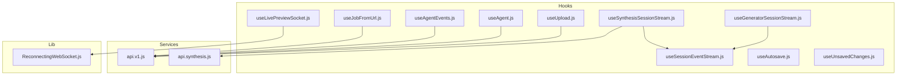

**Diagram sources**
- [useGeneratorSessionStream.js:1-12](file://frontend/src/hooks/useGeneratorSessionStream.js#L1-L12)
- [useSessionEventStream.js:1-101](file://frontend/src/hooks/useSessionEventStream.js#L1-L101)
- [useUpload.js:1-361](file://frontend/src/hooks/useUpload.js#L1-L361)
- [useLivePreviewSocket.js:1-137](file://frontend/src/hooks/useLivePreviewSocket.js#L1-L137)
- [useAutosave.js:1-37](file://frontend/src/hooks/useAutosave.js#L1-L37)
- [useUnsavedChanges.js:1-23](file://frontend/src/hooks/useUnsavedChanges.js#L1-L23)
- [useSynthesisSessionStream.js:1-12](file://frontend/src/hooks/useSynthesisSessionStream.js#L1-L12)
- [useAgent.js:1-292](file://frontend/src/hooks/useAgent.js#L1-L292)
- [useAgentEvents.js:1-163](file://frontend/src/hooks/useAgentEvents.js#L1-L163)
- [useJobFromUrl.js:1-91](file://frontend/src/hooks/useJobFromUrl.js#L1-L91)
- [ReconnectingWebSocket.js:1-148](file://frontend/src/lib/ReconnectingWebSocket.js#L1-L148)
- [api.v1.js:1-164](file://frontend/src/services/api.v1.js#L1-L164)
- [api.synthesis.js:1-51](file://frontend/src/services/api.synthesis.js#L1-L51)

**Section sources**
- [useGeneratorSessionStream.js:1-12](file://frontend/src/hooks/useGeneratorSessionStream.js#L1-L12)
- [useSessionEventStream.js:1-101](file://frontend/src/hooks/useSessionEventStream.js#L1-L101)
- [useUpload.js:1-361](file://frontend/src/hooks/useUpload.js#L1-L361)
- [useLivePreviewSocket.js:1-137](file://frontend/src/hooks/useLivePreviewSocket.js#L1-L137)
- [useAutosave.js:1-37](file://frontend/src/hooks/useAutosave.js#L1-L37)
- [useUnsavedChanges.js:1-23](file://frontend/src/hooks/useUnsavedChanges.js#L1-L23)
- [useSynthesisSessionStream.js:1-12](file://frontend/src/hooks/useSynthesisSessionStream.js#L1-L12)
- [useAgent.js:1-292](file://frontend/src/hooks/useAgent.js#L1-L292)
- [useAgentEvents.js:1-163](file://frontend/src/hooks/useAgentEvents.js#L1-L163)
- [useJobFromUrl.js:1-91](file://frontend/src/hooks/useJobFromUrl.js#L1-L91)
- [ReconnectingWebSocket.js:1-148](file://frontend/src/lib/ReconnectingWebSocket.js#L1-L148)
- [api.v1.js:1-164](file://frontend/src/services/api.v1.js#L1-L164)
- [api.synthesis.js:1-51](file://frontend/src/services/api.synthesis.js#L1-L51)

## Core Components
- useGeneratorSessionStream: Wraps a generator-specific SSE endpoint using useSessionEventStream.
- useSessionEventStream: Generic SSE listener that tracks stages, progress, completion, and errors.
- useUpload: Orchestrates file selection, chunked/large-file uploads, progress, status polling, and completion/cancel flows.
- useLivePreviewSocket: Manages a WebSocket connection for live HTML preview with debounced sends and latency measurement.
- useAutosave: Periodically persists form data to localStorage and restores drafts with expiry.
- useUnsavedChanges: Registers a beforeunload warning when the app state is dirty.

**Section sources**
- [useGeneratorSessionStream.js:1-12](file://frontend/src/hooks/useGeneratorSessionStream.js#L1-L12)
- [useSessionEventStream.js:1-101](file://frontend/src/hooks/useSessionEventStream.js#L1-L101)
- [useUpload.js:1-361](file://frontend/src/hooks/useUpload.js#L1-L361)
- [useLivePreviewSocket.js:1-137](file://frontend/src/hooks/useLivePreviewSocket.js#L1-L137)
- [useAutosave.js:1-37](file://frontend/src/hooks/useAutosave.js#L1-L37)
- [useUnsavedChanges.js:1-23](file://frontend/src/hooks/useUnsavedChanges.js#L1-L23)

## Architecture Overview
The hooks integrate with backend APIs and real-time transports:
- SSE streams for generation and synthesis sessions
- WebSocket for live preview
- REST APIs for uploads and session management
- Shared service utilities for authenticated requests and envelopes

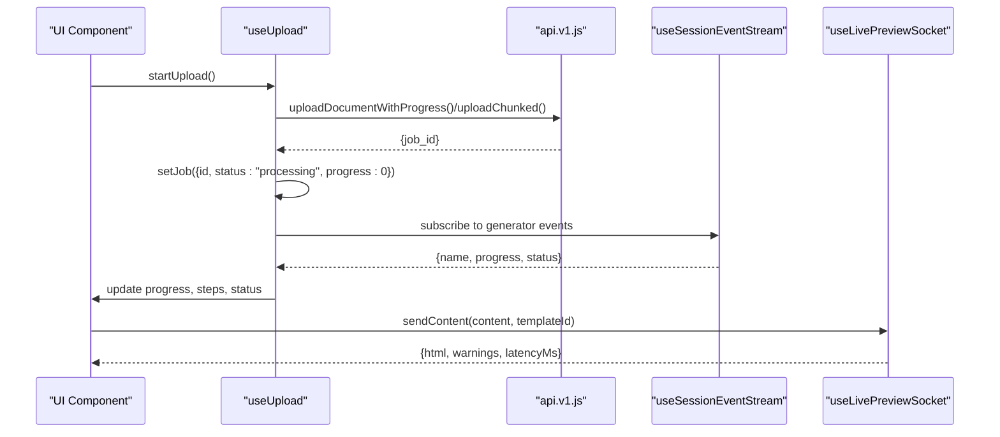

**Diagram sources**
- [useUpload.js:224-342](file://frontend/src/hooks/useUpload.js#L224-L342)
- [api.v1.js:72-147](file://frontend/src/services/api.v1.js#L72-L147)
- [useSessionEventStream.js:20-97](file://frontend/src/hooks/useSessionEventStream.js#L20-L97)
- [useLivePreviewSocket.js:106-133](file://frontend/src/hooks/useLivePreviewSocket.js#L106-L133)

## Detailed Component Analysis

### useGeneratorSessionStream
Purpose: Subscribe to a generator session’s SSE event stream and expose stages, progress, and completion signals.

Key behaviors:
- Builds the SSE URL using a session ID
- Delegates to useSessionEventStream for connection, parsing, and state updates
- Adds token query param if Supabase session exists

Integration pattern:
- Pass sessionId to the hook; it returns stages, currentStage, progress, isComplete, error

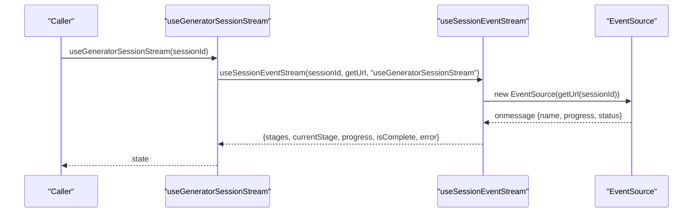

**Diagram sources**
- [useGeneratorSessionStream.js:5-11](file://frontend/src/hooks/useGeneratorSessionStream.js#L5-L11)
- [useSessionEventStream.js:20-97](file://frontend/src/hooks/useSessionEventStream.js#L20-L97)

**Section sources**
- [useGeneratorSessionStream.js:1-12](file://frontend/src/hooks/useGeneratorSessionStream.js#L1-L12)
- [useSessionEventStream.js:1-101](file://frontend/src/hooks/useSessionEventStream.js#L1-L101)

### useSessionEventStream
Purpose: Generic SSE subscription that manages connection lifecycle, retries, and state updates.

Key behaviors:
- Retrieves access token from Supabase if available and appends to URL
- Parses JSON messages, updates stages array, current stage, progress, completion, and error
- Implements exponential backoff with bounded retries on error
- Returns stages, currentStage, progress, isComplete, error

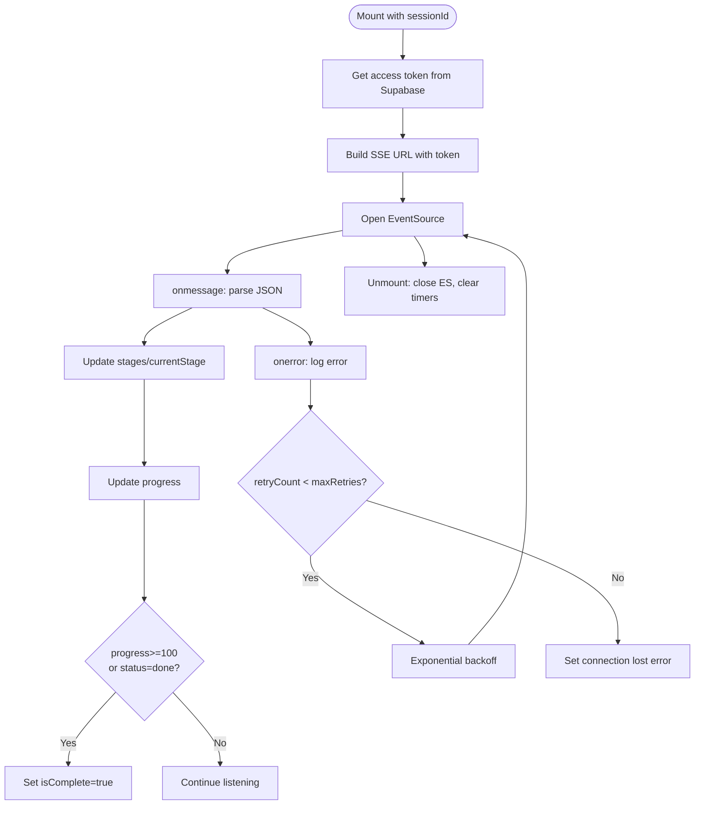

**Diagram sources**
- [useSessionEventStream.js:20-97](file://frontend/src/hooks/useSessionEventStream.js#L20-L97)

**Section sources**
- [useSessionEventStream.js:1-101](file://frontend/src/hooks/useSessionEventStream.js#L1-L101)

### useUpload
Purpose: End-to-end document upload and processing workflow with progress, status polling, and completion handling.

Key behaviors:
- Validates inputs using a schema before upload
- Supports chunked upload for large files when logged in
- Tracks progress via upload callbacks and SSE-like status polling
- Persists job state to context and sessionStorage
- Emits analytics events and optional desktop notifications
- Provides cancellation and retry logic with exponential backoff

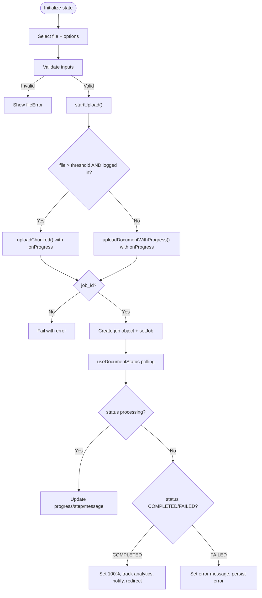

**Diagram sources**
- [useUpload.js:224-342](file://frontend/src/hooks/useUpload.js#L224-L342)
- [useUpload.js:88-196](file://frontend/src/hooks/useUpload.js#L88-L196)

**Section sources**
- [useUpload.js:1-361](file://frontend/src/hooks/useUpload.js#L1-L361)

### useLivePreviewSocket
Purpose: Real-time live preview over WebSocket with debounced sends, latency measurement, and reconnection.

Key behaviors:
- Converts HTTP base URL to WS and connects to /api/v1/ws/preview/{sessionId}
- Debounces sendContent to avoid flooding; tracks sequence numbers and checksums
- Measures latency when receiving responses
- Uses ReconnectingWebSocket with exponential backoff and jitter
- Exposes isConnected, isReconnecting, reconnectAttempt, isAnalyzing, and latencyMs

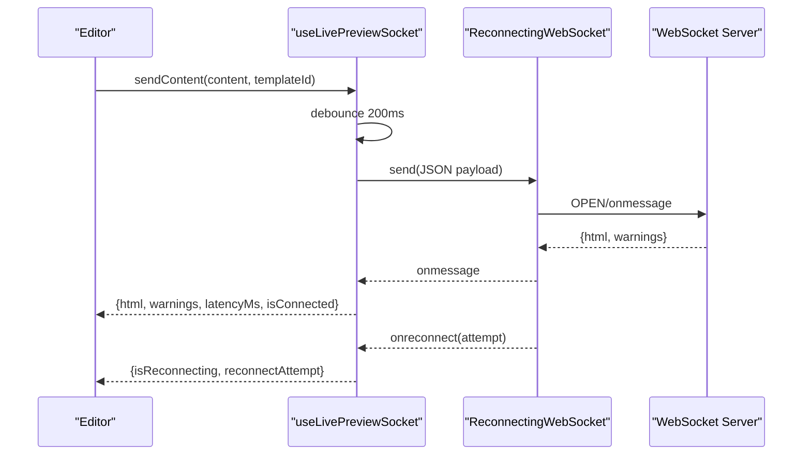

**Diagram sources**
- [useLivePreviewSocket.js:106-133](file://frontend/src/hooks/useLivePreviewSocket.js#L106-L133)
- [ReconnectingWebSocket.js:5-148](file://frontend/src/lib/ReconnectingWebSocket.js#L5-L148)

**Section sources**
- [useLivePreviewSocket.js:1-137](file://frontend/src/hooks/useLivePreviewSocket.js#L1-L137)
- [ReconnectingWebSocket.js:1-148](file://frontend/src/lib/ReconnectingWebSocket.js#L1-L148)

### useAutosave
Purpose: Periodically autosave form data to localStorage and restore drafts with a 24-hour expiry.

Key behaviors:
- Saves every 10 seconds: formData, currentStep, savedAt
- Restores last saved draft if within 24 hours
- Clears draft when explicitly called

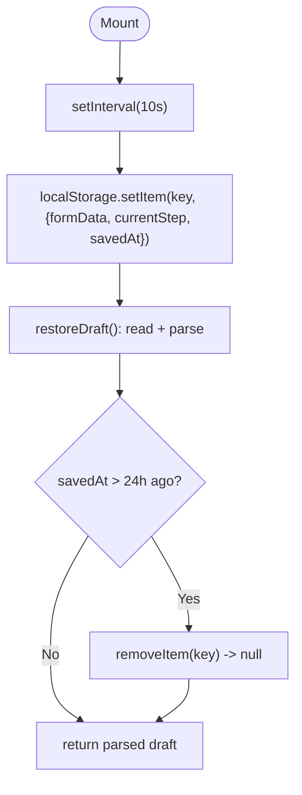

**Diagram sources**
- [useAutosave.js:7-29](file://frontend/src/hooks/useAutosave.js#L7-L29)

**Section sources**
- [useAutosave.js:1-37](file://frontend/src/hooks/useAutosave.js#L1-L37)

### useUnsavedChanges
Purpose: Prevent accidental navigation away from unsaved edits by showing a browser-native dialog.

Key behaviors:
- Subscribes to beforeunload when isDirty is true
- Removes listener on unmount

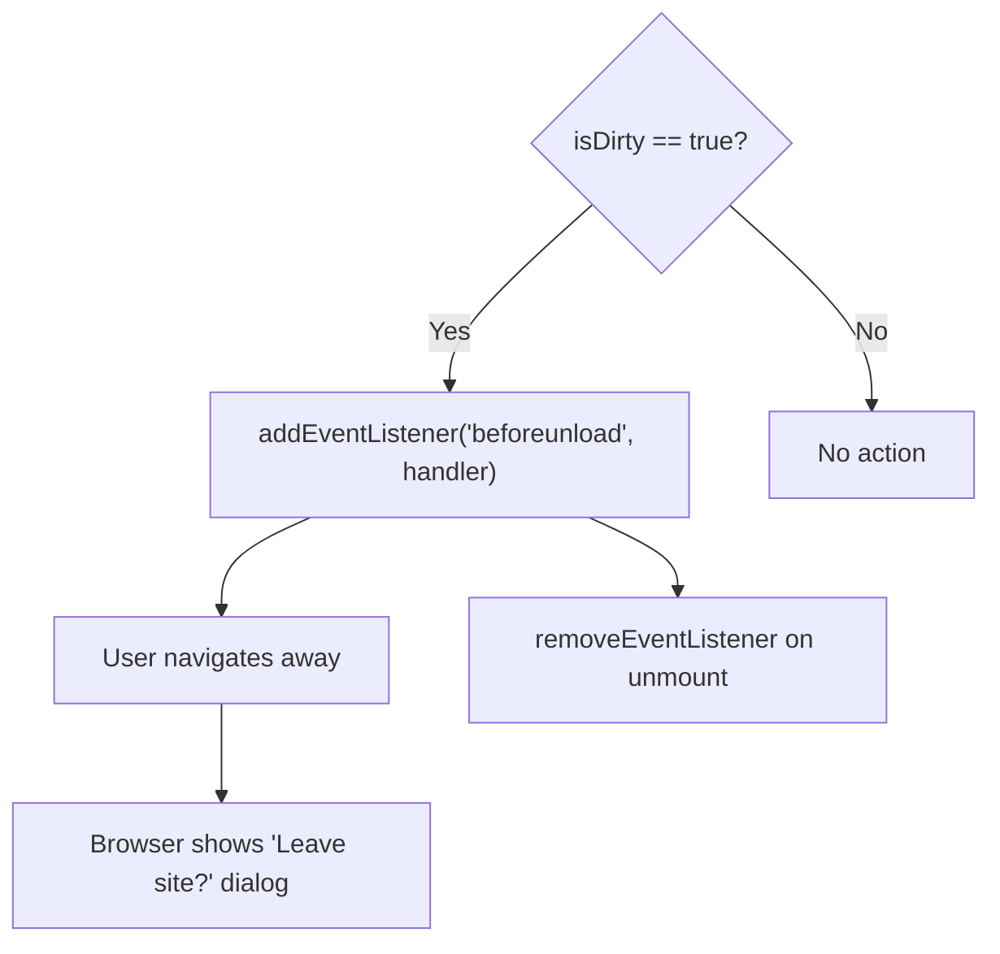

**Diagram sources**
- [useUnsavedChanges.js:9-22](file://frontend/src/hooks/useUnsavedChanges.js#L9-L22)

**Section sources**
- [useUnsavedChanges.js:1-23](file://frontend/src/hooks/useUnsavedChanges.js#L1-L23)

### useSynthesisSessionStream
Purpose: Subscribe to synthesis session SSE events using the same generic SSE logic.

Key behaviors:
- Constructs the synthesis events endpoint URL
- Delegates to useSessionEventStream

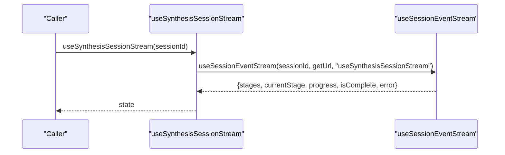

**Diagram sources**
- [useSynthesisSessionStream.js:5-11](file://frontend/src/hooks/useSynthesisSessionStream.js#L5-L11)
- [useSessionEventStream.js:20-97](file://frontend/src/hooks/useSessionEventStream.js#L20-L97)

**Section sources**
- [useSynthesisSessionStream.js:1-12](file://frontend/src/hooks/useSynthesisSessionStream.js#L1-L12)
- [useSessionEventStream.js:1-101](file://frontend/src/hooks/useSessionEventStream.js#L1-L101)

### useAgent and useAgentEvents
Purpose: Manage agent-driven generation sessions, outline approval, and real-time SSE updates.

Key behaviors:
- useAgent: Creates sessions, loads messages/documents, sends messages, approves outlines, stops sessions, derives session state
- useAgentEvents: Subscribes to outline_chunk and stage_update SSE events, buffers outline JSON, transitions states

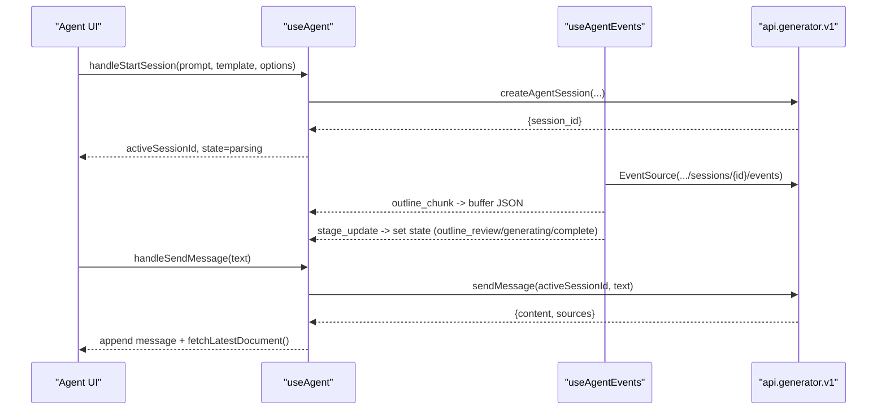

**Diagram sources**
- [useAgent.js:145-216](file://frontend/src/hooks/useAgent.js#L145-L216)
- [useAgentEvents.js:36-134](file://frontend/src/hooks/useAgentEvents.js#L36-L134)

**Section sources**
- [useAgent.js:1-292](file://frontend/src/hooks/useAgent.js#L1-L292)
- [useAgentEvents.js:1-163](file://frontend/src/hooks/useAgentEvents.js#L1-L163)

### useJobFromUrl
Purpose: Load a job summary from the URL jobId and normalize it into a job object.

Key behaviors:
- Normalizes fields (id, filename, timestamps, outputPath)
- Avoids refetching if the context already matches
- Sets loading/error states and cleans up on unmount

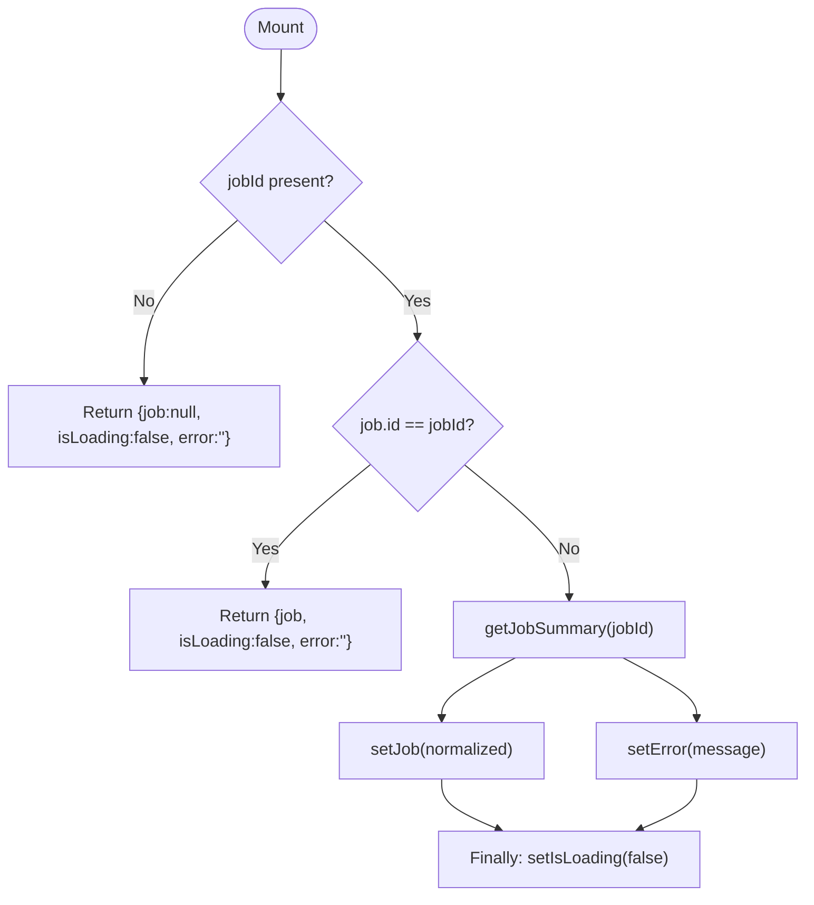

**Diagram sources**
- [useJobFromUrl.js:36-79](file://frontend/src/hooks/useJobFromUrl.js#L36-L79)

**Section sources**
- [useJobFromUrl.js:1-91](file://frontend/src/hooks/useJobFromUrl.js#L1-L91)

## Dependency Analysis
- useGeneratorSessionStream depends on useSessionEventStream and API base URL resolution
- useSessionEventStream depends on Supabase for auth tokens and EventSource
- useUpload depends on api.v1.js for authenticated fetch, status polling, and analytics
- useLivePreviewSocket depends on ReconnectingWebSocket and WebSocket
- useSynthesisSessionStream depends on api.synthesis.js and useSessionEventStream
- useAgent and useAgentEvents depend on api.generator.v1 endpoints and SSE
- useJobFromUrl depends on api core and DocumentContext

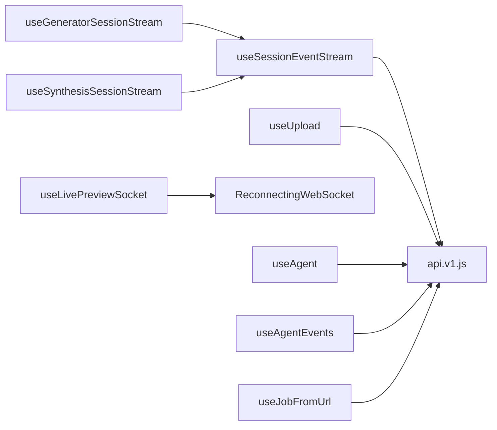

**Diagram sources**
- [useGeneratorSessionStream.js:1-12](file://frontend/src/hooks/useGeneratorSessionStream.js#L1-L12)
- [useSessionEventStream.js:1-101](file://frontend/src/hooks/useSessionEventStream.js#L1-L101)
- [useSynthesisSessionStream.js:1-12](file://frontend/src/hooks/useSynthesisSessionStream.js#L1-L12)
- [useUpload.js:1-15](file://frontend/src/hooks/useUpload.js#L1-L15)
- [useLivePreviewSocket.js:1-5](file://frontend/src/hooks/useLivePreviewSocket.js#L1-L5)
- [useAgent.js:1-12](file://frontend/src/hooks/useAgent.js#L1-L12)
- [useAgentEvents.js:1-17](file://frontend/src/hooks/useAgentEvents.js#L1-L17)
- [useJobFromUrl.js:1-4](file://frontend/src/hooks/useJobFromUrl.js#L1-L4)
- [api.v1.js:1-5](file://frontend/src/services/api.v1.js#L1-L5)
- [api.synthesis.js:1-5](file://frontend/src/services/api.synthesis.js#L1-L5)
- [ReconnectingWebSocket.js:1-5](file://frontend/src/lib/ReconnectingWebSocket.js#L1-L5)

**Section sources**
- [useGeneratorSessionStream.js:1-12](file://frontend/src/hooks/useGeneratorSessionStream.js#L1-L12)
- [useSessionEventStream.js:1-101](file://frontend/src/hooks/useSessionEventStream.js#L1-L101)
- [useUpload.js:1-15](file://frontend/src/hooks/useUpload.js#L1-L15)
- [useLivePreviewSocket.js:1-5](file://frontend/src/hooks/useLivePreviewSocket.js#L1-L5)
- [useSynthesisSessionStream.js:1-12](file://frontend/src/hooks/useSynthesisSessionStream.js#L1-L12)
- [useAgent.js:1-12](file://frontend/src/hooks/useAgent.js#L1-L12)
- [useAgentEvents.js:1-17](file://frontend/src/hooks/useAgentEvents.js#L1-L17)
- [useJobFromUrl.js:1-4](file://frontend/src/hooks/useJobFromUrl.js#L1-L4)
- [api.v1.js:1-5](file://frontend/src/services/api.v1.js#L1-L5)
- [api.synthesis.js:1-5](file://frontend/src/services/api.synthesis.js#L1-L5)
- [ReconnectingWebSocket.js:1-5](file://frontend/src/lib/ReconnectingWebSocket.js#L1-L5)

## Performance Considerations
- SSE and WebSocket:
  - useSessionEventStream and useLivePreviewSocket implement exponential backoff and jitter to reduce thundering herds and server load.
  - Debounce sendContent in useLivePreviewSocket reduces payload volume and latency spikes.
- Upload:
  - Chunked upload is conditionally enabled for large files when logged in to improve reliability.
  - Progress callbacks are throttled by upload implementation; consider adding UI-level debouncing if needed.
- Autosave:
  - 10-second intervals balance persistence frequency with storage writes; ensure formData is lightweight.
- Status polling:
  - useUpload adjusts refetch intervals based on phase to reduce unnecessary network calls.

[No sources needed since this section provides general guidance]

## Troubleshooting Guide
- SSE connection fails:
  - Verify sessionId is truthy and URL is constructed correctly.
  - Check console logs for “SSE Error” and retry attempts; confirm network connectivity and CORS.
  - Ensure Supabase session retrieval succeeds and token is appended to URL.
- WebSocket disconnects:
  - Inspect isReconnecting and reconnectAttempt; confirm backend WS endpoint availability.
  - Validate that ReconnectingWebSocket receives onclose/onerror and schedules reconnection.
- Upload stuck at 0%:
  - Confirm upload callbacks fire and progress is updated; check abortController state.
  - For chunked uploads, verify chunk sizes and thresholds.
- Live preview not updating:
  - Ensure sendContent is invoked with content changes; check debounce timing.
  - Confirm checksum differences trigger analysis; verify server responds with html/warnings.
- Autosave not restoring:
  - Check localStorage quota and expiry (24h); verify key correctness.
- Unsaved changes warning not appearing:
  - Ensure isDirty toggles appropriately; confirm beforeunload handler is attached.

**Section sources**
- [useSessionEventStream.js:76-87](file://frontend/src/hooks/useSessionEventStream.js#L76-L87)
- [useLivePreviewSocket.js:83-95](file://frontend/src/hooks/useLivePreviewSocket.js#L83-L95)
- [useUpload.js:224-342](file://frontend/src/hooks/useUpload.js#L224-L342)
- [useAutosave.js:17-29](file://frontend/src/hooks/useAutosave.js#L17-L29)
- [useUnsavedChanges.js:9-22](file://frontend/src/hooks/useUnsavedChanges.js#L9-L22)

## Conclusion
These hooks provide a cohesive, reusable foundation for real-time AI workflows:
- useGeneratorSessionStream and useSynthesisSessionStream standardize SSE consumption
- useUpload integrates uploads, progress, and terminal states
- useLivePreviewSocket enables interactive, low-latency previews
- useAutosave and useUnsavedChanges protect user work and guide navigation
- useAgent and useAgentEvents coordinate complex generation lifecycles

Adopt the documented composition patterns and integration guidelines to build robust, maintainable features.

[No sources needed since this section summarizes without analyzing specific files]

## Appendices

### Hook Composition Patterns
- Generator pipeline:
  - useGeneratorSessionStream -> useSessionEventStream
  - useUpload -> status polling + SSE
- Live editing:
  - useLivePreviewSocket -> sendContent on change
- Agent collaboration:
  - useAgent + useAgentEvents -> SSE-driven state transitions

[No sources needed since this section provides general guidance]