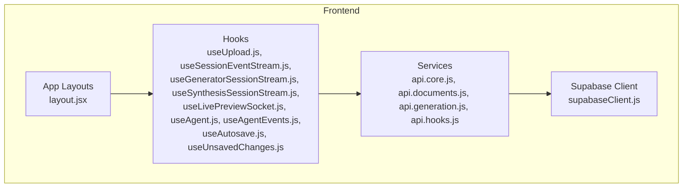
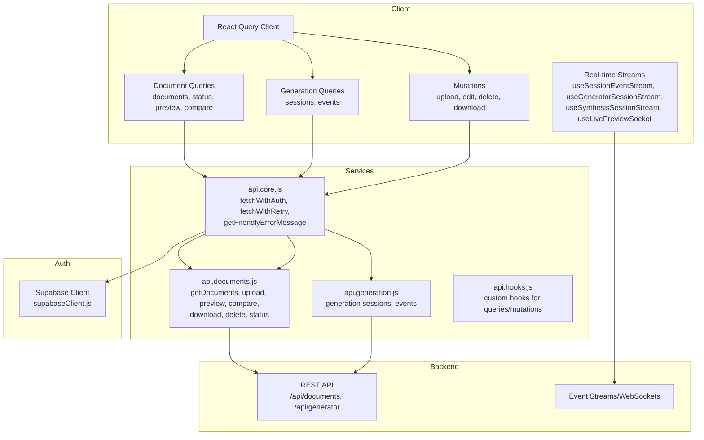
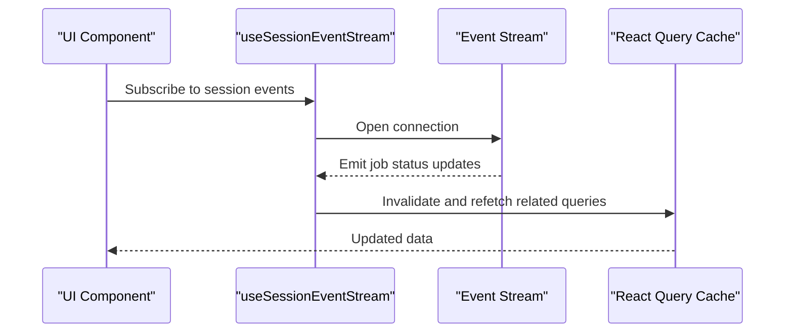
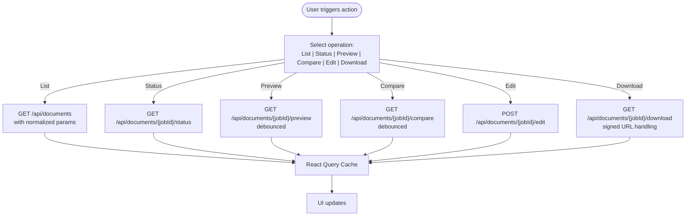
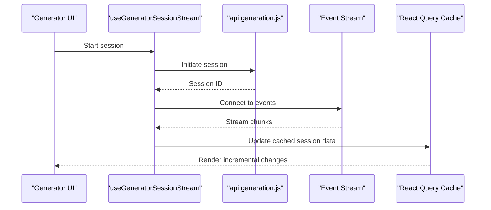
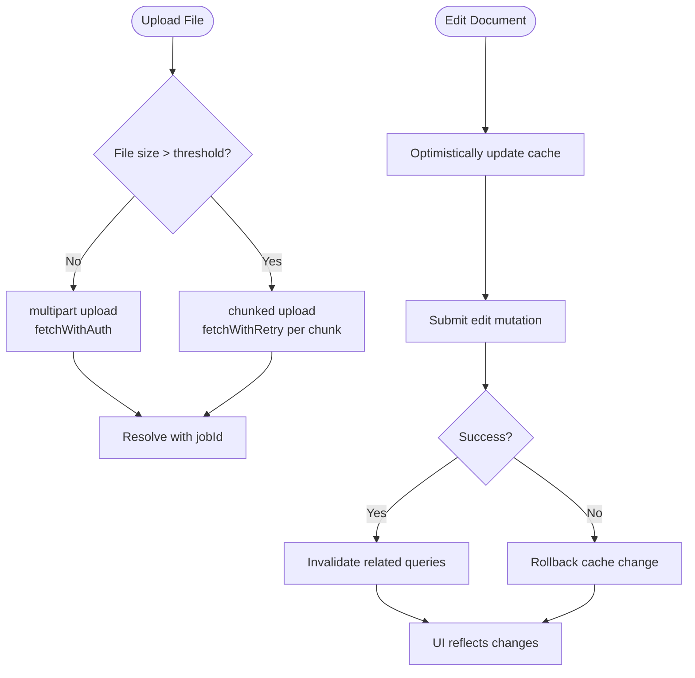
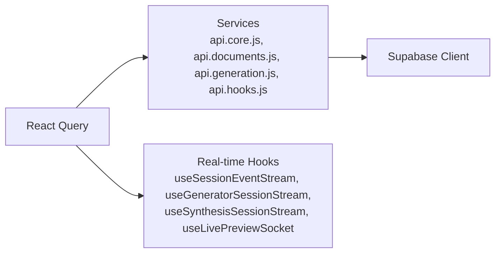

# React Query Integration

<cite>
**Referenced Files in This Document**
- [package.json](file://frontend/package.json)
- [api.core.js](file://frontend/src/services/api.core.js)
- [api.documents.js](file://frontend/src/services/api.documents.js)
- [api.generation.js](file://frontend/src/services/api.generation.js)
- [api.hooks.js](file://frontend/src/services/api.hooks.js)
- [useGeneratorState.js](file://frontend/app/(generator)/(protected)/generate/_components/useGeneratorState.js)
- [useSessionEventStream.js](file://frontend/src/hooks/useSessionEventStream.js)
- [useGeneratorSessionStream.js](file://frontend/src/hooks/useGeneratorSessionStream.js)
- [useSynthesisSessionStream.js](frontend/src/hooks/useSynthesisSessionStream.js)
- [useLivePreviewSocket.js](frontend/src/hooks/useLivePreviewSocket.js)
- [useUpload.js](frontend/src/hooks/useUpload.js)
- [useAgent.js](frontend/src/hooks/useAgent.js)
- [useAgentEvents.js](frontend/src/hooks/useAgentEvents.js)
- [useAutosave.js](frontend/src/hooks/useAutosave.js)
- [useUnsavedChanges.js](frontend/src/hooks/useUnsavedChanges.js)
- [supabaseClient.js](file://frontend/src/lib/supabaseClient.js)
- [layout.jsx](file://frontend/app/layout.jsx)
- [layout.jsx](file://frontend/app/(shared)/layout.jsx)
- [layout.jsx](file://frontend/app/(formatter)/(protected)/layout.jsx)
- [layout.jsx](file://frontend/app/(generator)/(protected)/layout.jsx)
- [layout.jsx](file://frontend/app/(shared)/(protected)/layout.jsx)
- [status.js](file://frontend/src/constants/status.js)
</cite>

## Table of Contents
1. [Introduction](#introduction)
2. [Project Structure](#project-structure)
3. [Core Components](#core-components)
4. [Architecture Overview](#architecture-overview)
5. [Detailed Component Analysis](#detailed-component-analysis)
6. [Dependency Analysis](#dependency-analysis)
7. [Performance Considerations](#performance-considerations)
8. [Troubleshooting Guide](#troubleshooting-guide)
9. [Conclusion](#conclusion)

## Introduction
This document explains how React Query is integrated into the frontend to manage server state for document processing and AI generation workflows. It covers query client configuration, caching strategies, data synchronization, and mutation patterns. It also documents real-time updates via event streams, optimistic updates, error handling, loading states, query invalidation, refetching strategies, and performance optimization techniques.

## Project Structure
The frontend uses Next.js App Router with shared layouts and feature-specific pages. Services under src/services encapsulate API calls, while hooks orchestrate React Query and real-time integrations. Supabase provides authentication and session management.

**Diagram sources**
- [layout.jsx](file://frontend/app/layout.jsx)
- [layout.jsx](file://frontend/app/(shared)/layout.jsx)
- [layout.jsx](file://frontend/app/(formatter)/(protected)/layout.jsx)
- [layout.jsx](file://frontend/app/(generator)/(protected)/layout.jsx)
- [layout.jsx](file://frontend/app/(shared)/(protected)/layout.jsx)
- [useUpload.js](file://frontend/src/hooks/useUpload.js)
- [useSessionEventStream.js](file://frontend/src/hooks/useSessionEventStream.js)
- [useGeneratorSessionStream.js](file://frontend/src/hooks/useGeneratorSessionStream.js)
- [useSynthesisSessionStream.js](file://frontend/src/hooks/useSynthesisSessionStream.js)
- [useLivePreviewSocket.js](file://frontend/src/hooks/useLivePreviewSocket.js)
- [useAgent.js](file://frontend/src/hooks/useAgent.js)
- [useAgentEvents.js](file://frontend/src/hooks/useAgentEvents.js)
- [useAutosave.js](file://frontend/src/hooks/useAutosave.js)
- [useUnsavedChanges.js](file://frontend/src/hooks/useUnsavedChanges.js)
- [api.core.js](file://frontend/src/services/api.core.js)
- [api.documents.js](file://frontend/src/services/api.documents.js)
- [api.generation.js](file://frontend/src/services/api.generation.js)
- [api.hooks.js](file://frontend/src/services/api.hooks.js)
- [supabaseClient.js](file://frontend/src/lib/supabaseClient.js)

**Section sources**
- [package.json:17-36](file://frontend/package.json#L17-L36)
- [layout.jsx](file://frontend/app/layout.jsx)
- [layout.jsx](file://frontend/app/(shared)/layout.jsx)
- [layout.jsx](file://frontend/app/(formatter)/(protected)/layout.jsx)
- [layout.jsx](file://frontend/app/(generator)/(protected)/layout.jsx)
- [layout.jsx](file://frontend/app/(shared)/(protected)/layout.jsx)

## Core Components
- Query Client and Provider: The application uses React Query v5. Configure the QueryClient and wrap the app with QueryClientProvider in the root layout. Set default staleTime, gcTime, and retry policies appropriate for document and generation workflows.
- Services Layer: Centralized API functions in api.core.js and feature-specific modules (api.documents.js, api.generation.js, api.hooks.js) handle authentication headers, retries, sanitization, and response parsing.
- Hooks: React Query hooks orchestrate queries, mutations, and subscriptions. Real-time updates are handled via event streams and websockets.

Key responsibilities:
- Authentication: Inject Authorization headers via Supabase session.
- Retries: Automatic retry for transient errors on safe HTTP methods.
- Sanitization: Input sanitization to prevent XSS and malformed payloads.
- Debouncing: Debounced requests for preview/compare to reduce network load.
- Chunked Uploads: Large file handling with progress callbacks.
- Export and Download: Signed URL handling for secure downloads.

**Section sources**
- [package.json:22-22](file://frontend/package.json#L22-L22)
- [api.core.js:190-218](file://frontend/src/services/api.core.js#L190-L218)
- [api.core.js:220-255](file://frontend/src/services/api.core.js#L220-L255)
- [api.core.js:307-362](file://frontend/src/services/api.core.js#L307-L362)
- [api.documents.js:121-146](file://frontend/src/services/api.documents.js#L121-L146)
- [api.documents.js:148-224](file://frontend/src/services/api.documents.js#L148-L224)
- [api.documents.js:226-300](file://frontend/src/services/api.documents.js#L226-L300)
- [api.documents.js:302-320](file://frontend/src/services/api.documents.js#L302-L320)
- [api.documents.js:334-395](file://frontend/src/services/api.documents.js#L334-L395)

## Architecture Overview
The frontend integrates React Query with Supabase for authentication and with backend APIs for document and generation workflows. Real-time updates are achieved via event streams and websockets.

**Diagram sources**
- [api.core.js:307-362](file://frontend/src/services/api.core.js#L307-L362)
- [api.documents.js:121-146](file://frontend/src/services/api.documents.js#L121-L146)
- [api.documents.js:302-320](file://frontend/src/services/api.documents.js#L302-L320)
- [api.generation.js](file://frontend/src/services/api.generation.js)
- [api.hooks.js](file://frontend/src/services/api.hooks.js)
- [supabaseClient.js](file://frontend/src/lib/supabaseClient.js)
- [useSessionEventStream.js](file://frontend/src/hooks/useSessionEventStream.js)
- [useGeneratorSessionStream.js](file://frontend/src/hooks/useGeneratorSessionStream.js)
- [useSynthesisSessionStream.js](file://frontend/src/hooks/useSynthesisSessionStream.js)
- [useLivePreviewSocket.js](file://frontend/src/hooks/useLivePreviewSocket.js)

## Detailed Component Analysis

### Query Client Configuration
- Initialize QueryClient with defaults:
  - staleTime: Allow cached data to remain fresh for moderate durations to reduce redundant network calls.
  - gcTime: Garbage collection time to free inactive queries.
  - defaultOptions.queries.retry: Conservative retry for transient failures on GET/HEAD/OPTIONS.
  - defaultOptions.queries.refetchOnWindowFocus: Disable to avoid unwanted refetches during editing.
  - defaultOptions.queries.refetchOnMount: Enable for recent data on mount.
  - defaultOptions.mutations.retry: Retry mutations that fail due to network errors.
- Wrap the app with QueryClientProvider in the root layout.

Best practices:
- Keep retry count low for mutations to prevent duplicate side effects.
- Use selective invalidation to refresh only affected queries.

**Section sources**
- [api.core.js:168-188](file://frontend/src/services/api.core.js#L168-L188)
- [layout.jsx](file://frontend/app/layout.jsx)

### Caching Strategies
- Document Lists:
  - Use query keys that encode filters and pagination to avoid cache collisions.
  - Normalize query params to ensure deterministic keys.
- Real-time Updates:
  - Invalidate related queries upon mutation completion to force refetch.
  - Use optimistic updates for immediate UI feedback.
- Debounced Requests:
  - Preview and comparison endpoints use debounced fetch to coalesce rapid updates.

**Section sources**
- [api.documents.js:61-95](file://frontend/src/services/api.documents.js#L61-L95)
- [api.documents.js:22-59](file://frontend/src/services/api.documents.js#L22-L59)
- [api.documents.js:302-320](file://frontend/src/services/api.documents.js#L302-L320)

### Data Synchronization Patterns
- Event-driven updates:
  - useSessionEventStream, useGeneratorSessionStream, useSynthesisSessionStream listen to server-sent events and update local cache accordingly.
- WebSocket-based live preview:
  - useLivePreviewSocket maintains a persistent connection for live diffs and collaborative editing.

**Diagram sources**
- [useSessionEventStream.js](file://frontend/src/hooks/useSessionEventStream.js)
- [api.documents.js:302-304](file://frontend/src/services/api.documents.js#L302-L304)

**Section sources**
- [useSessionEventStream.js](file://frontend/src/hooks/useSessionEventStream.js)
- [useGeneratorSessionStream.js](file://frontend/src/hooks/useGeneratorSessionStream.js)
- [useSynthesisSessionStream.js](file://frontend/src/hooks/useSynthesisSessionStream.js)
- [useLivePreviewSocket.js](file://frontend/src/hooks/useLivePreviewSocket.js)

### Document-Related Queries
- Fetch Documents List:
  - Endpoint: GET /api/documents with normalized query params (limit, offset, filters).
  - Query key: [“documents”, params].
- Job Status:
  - Endpoint: GET /api/documents/{jobId}/status.
  - Query key: [“documents”, jobId, “status”].
- Preview and Comparison:
  - Endpoints: GET /api/documents/{jobId}/preview, /api/documents/{jobId}/compare.
  - Debounced fetch to reduce churn.
- Edit Submission:
  - Endpoint: POST /api/documents/{jobId}/edit with structured data payload.
- Export and Download:
  - Endpoint: GET /api/documents/{jobId}/download?format={docx|pdf|tex}.
  - Handles signed URLs for secure downloads.

**Diagram sources**
- [api.documents.js:121-126](file://frontend/src/services/api.documents.js#L121-L126)
- [api.documents.js:302-304](file://frontend/src/services/api.documents.js#L302-L304)
- [api.documents.js:306-320](file://frontend/src/services/api.documents.js#L306-L320)
- [api.documents.js:322-330](file://frontend/src/services/api.documents.js#L322-L330)
- [api.documents.js:334-395](file://frontend/src/services/api.documents.js#L334-L395)

**Section sources**
- [api.documents.js:121-146](file://frontend/src/services/api.documents.js#L121-L146)
- [api.documents.js:302-320](file://frontend/src/services/api.documents.js#L302-L320)
- [api.documents.js:322-330](file://frontend/src/services/api.documents.js#L322-L330)
- [api.documents.js:334-395](file://frontend/src/services/api.documents.js#L334-L395)

### Generation Session Queries
- Session Management:
  - Retrieve generation sessions and associated metadata.
  - Use event streams to receive incremental updates.
- Streaming:
  - useGeneratorSessionStream and useSynthesisSessionStream consume server-sent events to update UI in real time.

**Diagram sources**
- [useGeneratorSessionStream.js](file://frontend/src/hooks/useGeneratorSessionStream.js)
- [api.generation.js](file://frontend/src/services/api.generation.js)
- [useSynthesisSessionStream.js](file://frontend/src/hooks/useSynthesisSessionStream.js)

**Section sources**
- [useGeneratorSessionStream.js](file://frontend/src/hooks/useGeneratorSessionStream.js)
- [useSynthesisSessionStream.js](file://frontend/src/hooks/useSynthesisSessionStream.js)
- [api.generation.js](file://frontend/src/services/api.generation.js)

### Mutation Patterns
- Document Upload:
  - Single-shot multipart upload with progress via fetchWithAuth.
  - Chunked upload for large files with progress and abort support.
- Edit Submission:
  - Optimistic update: immediately reflect edits in cache, rollback on failure.
- Delete:
  - Invalidate related queries after deletion.
- Download:
  - Handle signed URLs and blob downloads.

**Diagram sources**
- [api.documents.js:128-146](file://frontend/src/services/api.documents.js#L128-L146)
- [api.documents.js:226-300](file://frontend/src/services/api.documents.js#L226-L300)
- [api.documents.js:322-330](file://frontend/src/services/api.documents.js#L322-L330)

**Section sources**
- [api.documents.js:128-146](file://frontend/src/services/api.documents.js#L128-L146)
- [api.documents.js:226-300](file://frontend/src/services/api.documents.js#L226-L300)
- [api.documents.js:322-330](file://frontend/src/services/api.documents.js#L322-L330)
- [useUpload.js](file://frontend/src/hooks/useUpload.js)

### Error Handling and Loading States
- Friendly Error Messages:
  - getFriendlyErrorMessage maps HTTP statuses and network errors to user-friendly messages.
- Network Error Detection:
  - isNetworkError detects browser/network failures to enable retries.
- Loading States:
  - Use isLoading, isFetching, and error states from React Query to render skeletons and error banners.
- Abort Handling:
  - Respect AbortSignal for uploads and chunked uploads to cancel ongoing requests.

**Section sources**
- [api.core.js:85-97](file://frontend/src/services/api.core.js#L85-L97)
- [api.core.js:121-166](file://frontend/src/services/api.core.js#L121-L166)
- [api.documents.js:186-223](file://frontend/src/services/api.documents.js#L186-L223)

### Optimistic Updates
- Apply optimistic updates for mutations that do not require server acknowledgment before reflecting UI changes.
- Use mutation.onMutate to snapshot previous values; onSettled to invalidate queries; onError to revert on failure.

**Section sources**
- [api.documents.js:322-330](file://frontend/src/services/api.documents.js#L322-L330)

### Query Invalidation and Refetching
- Invalidate specific query keys after mutations to force refetch.
- Use refetchQueries selectively for long-running operations.
- Use refetchOnWindowFocus judiciously to avoid unnecessary refetches during editing.

**Section sources**
- [api.documents.js:401-405](file://frontend/src/services/api.documents.js#L401-L405)

### Cache Persistence
- React Query’s in-memory cache persists across navigations by default.
- For extended persistence across browser sessions, integrate a persistence layer (e.g., local storage) around the cache.

**Section sources**
- [api.documents.js:121-126](file://frontend/src/services/api.documents.js#L121-L126)

## Dependency Analysis
React Query depends on:
- Services for HTTP communication and authentication.
- Supabase for session management.
- Real-time hooks for event-driven updates.

**Diagram sources**
- [api.core.js:307-362](file://frontend/src/services/api.core.js#L307-L362)
- [api.documents.js:121-146](file://frontend/src/services/api.documents.js#L121-L146)
- [api.generation.js](file://frontend/src/services/api.generation.js)
- [api.hooks.js](file://frontend/src/services/api.hooks.js)
- [supabaseClient.js](file://frontend/src/lib/supabaseClient.js)
- [useSessionEventStream.js](file://frontend/src/hooks/useSessionEventStream.js)
- [useGeneratorSessionStream.js](file://frontend/src/hooks/useGeneratorSessionStream.js)
- [useSynthesisSessionStream.js](file://frontend/src/hooks/useSynthesisSessionStream.js)
- [useLivePreviewSocket.js](file://frontend/src/hooks/useLivePreviewSocket.js)

**Section sources**
- [api.core.js:307-362](file://frontend/src/services/api.core.js#L307-L362)
- [supabaseClient.js](file://frontend/src/lib/supabaseClient.js)
- [useSessionEventStream.js](file://frontend/src/hooks/useSessionEventStream.js)
- [useGeneratorSessionStream.js](file://frontend/src/hooks/useGeneratorSessionStream.js)
- [useSynthesisSessionStream.js](file://frontend/src/hooks/useSynthesisSessionStream.js)
- [useLivePreviewSocket.js](file://frontend/src/hooks/useLivePreviewSocket.js)

## Performance Considerations
- Debounce preview/compare requests to reduce network load.
- Use infinite query patterns for paginated document lists.
- Prefer selective invalidation over global refetches.
- Use background refetching sparingly; disable refetchOnWindowFocus for long editing sessions.
- Monitor cache sizes and adjust gcTime to balance memory and freshness.
- Use streaming for large downloads and real-time updates to improve perceived performance.

[No sources needed since this section provides general guidance]

## Troubleshooting Guide
Common issues and resolutions:
- Authentication Failures:
  - Ensure Supabase session is present and headers are injected automatically.
- Network Errors:
  - Verify retry logic for transient failures; inspect isNetworkError detection.
- Download Failures:
  - Confirm signed URL expiry and re-fetch if needed.
- Real-time Updates Not Reflecting:
  - Check event stream connections and query invalidation after mutations.

**Section sources**
- [api.core.js:220-255](file://frontend/src/services/api.core.js#L220-L255)
- [api.core.js:85-97](file://frontend/src/services/api.core.js#L85-L97)
- [api.documents.js:334-395](file://frontend/src/services/api.documents.js#L334-L395)
- [useSessionEventStream.js](file://frontend/src/hooks/useSessionEventStream.js)

## Conclusion
The frontend leverages React Query to provide robust, efficient, and user-friendly server state management for document processing and AI generation. By combining centralized services, real-time event streams, and thoughtful caching and mutation strategies, the system delivers responsive interactions while maintaining data consistency and reliability.