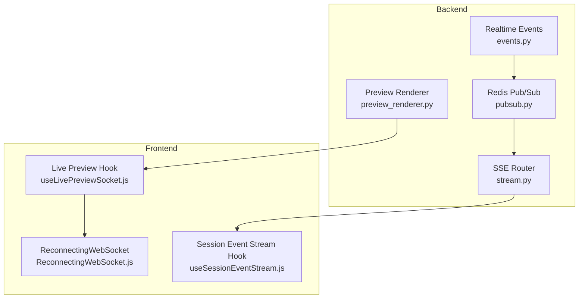
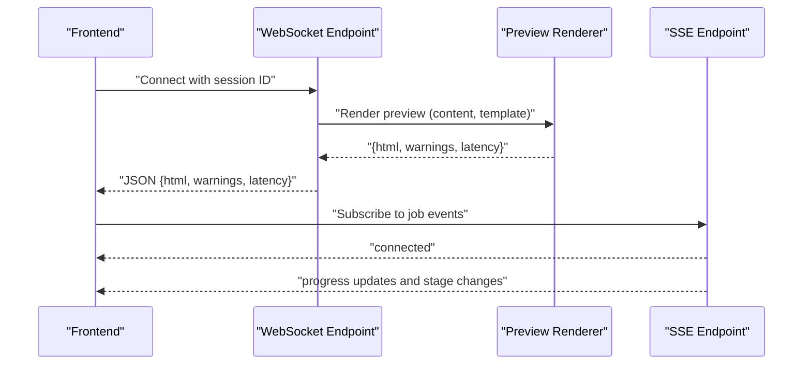
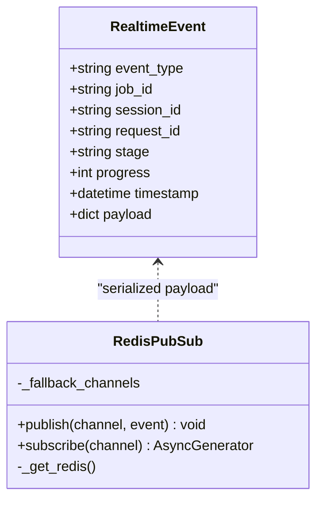
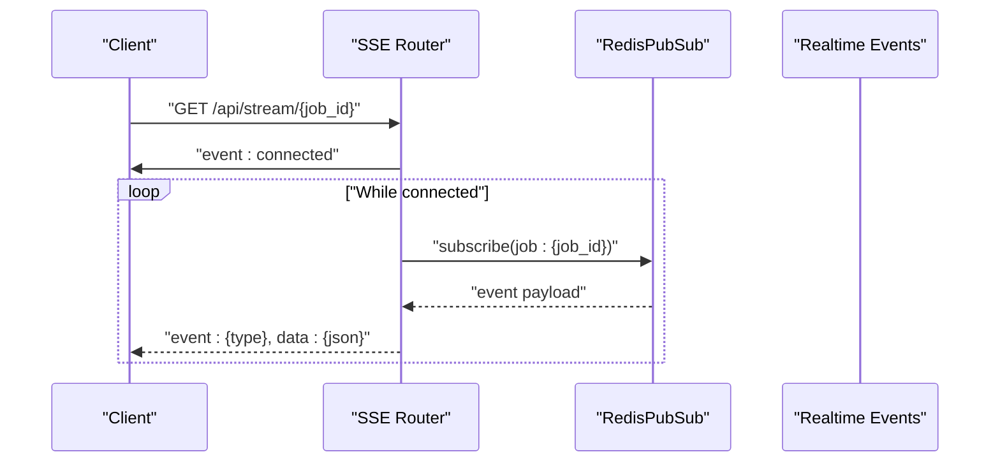
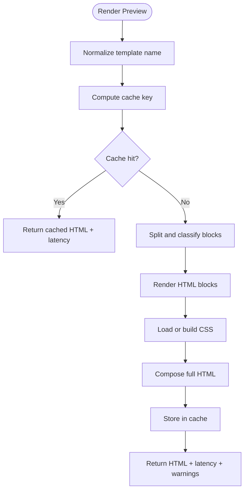
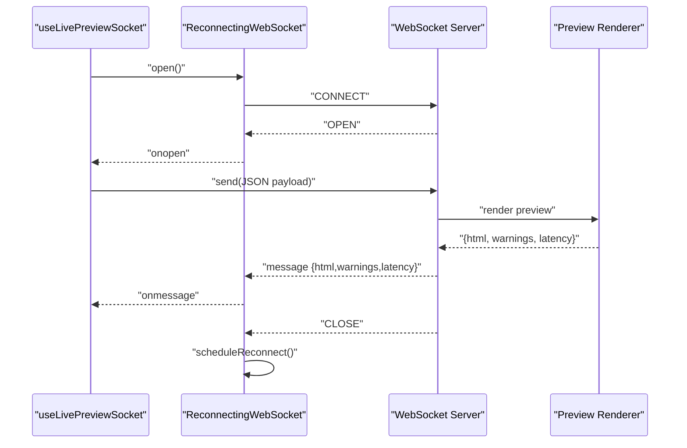
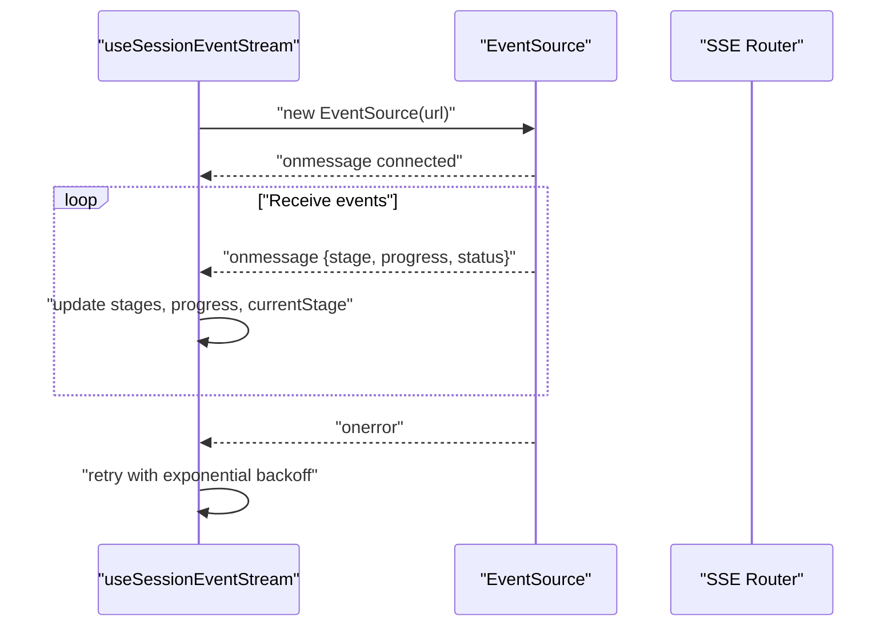
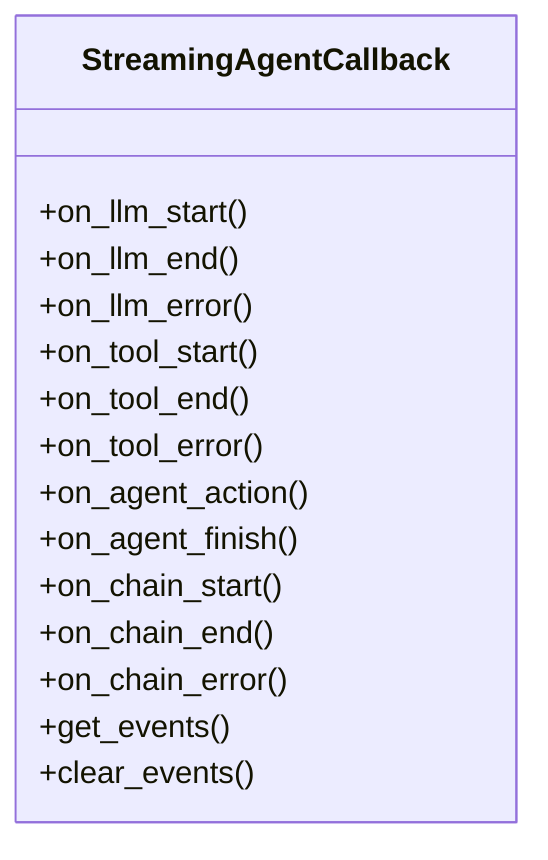
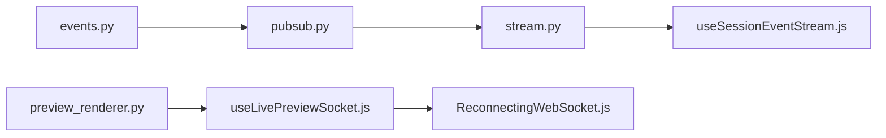

# Real-time State Management

<cite>
**Referenced Files in This Document**
- [events.py](file://backend/app/realtime/events.py)
- [pubsub.py](file://backend/app/realtime/pubsub.py)
- [stream.py](file://backend/app/routers/stream.py)
- [streaming.py](file://backend/app/pipeline/agents/streaming.py)
- [preview_renderer.py](file://backend/app/services/preview_renderer.py)
- [ReconnectingWebSocket.js](file://frontend/src/lib/ReconnectingWebSocket.js)
- [useLivePreviewSocket.js](file://frontend/src/hooks/useLivePreviewSocket.js)
- [useSessionEventStream.js](file://frontend/src/hooks/useSessionEventStream.js)
- [test_stream.py](file://backend/tests/test_stream.py)
</cite>

## Table of Contents
1. [Introduction](#introduction)
2. [Project Structure](#project-structure)
3. [Core Components](#core-components)
4. [Architecture Overview](#architecture-overview)
5. [Detailed Component Analysis](#detailed-component-analysis)
6. [Dependency Analysis](#dependency-analysis)
7. [Performance Considerations](#performance-considerations)
8. [Troubleshooting Guide](#troubleshooting-guide)
9. [Conclusion](#conclusion)

## Introduction
This document explains the real-time state management and WebSocket integration in the system. It covers:
- WebSocket connection handling and reconnection logic
- Message streaming patterns for progress and synthesis events
- Live preview updates for document formatting and generation
- Token streaming for AI-generated content and incremental updates
- State synchronization between client and server, including optimistic updates and conflict resolution
- Error handling for network interruptions, connection failures, and message queuing
- Examples of real-time UI updates, progress tracking, and user feedback
- Performance optimization strategies and debugging approaches for WebSocket communication

## Project Structure
The real-time capabilities span backend streaming and caching, and frontend WebSocket and SSE integrations:
- Backend streaming and pub/sub: Real-time events, Redis-backed pub/sub, SSE router
- Backend preview rendering: Template-aware HTML rendering with caching
- Frontend WebSocket and SSE: Reconnecting WebSocket wrapper, live preview hook, session event stream hook

**Diagram sources**
- [events.py:1-34](file://backend/app/realtime/events.py#L1-L34)
- [pubsub.py:1-120](file://backend/app/realtime/pubsub.py#L1-L120)
- [stream.py:1-95](file://backend/app/routers/stream.py#L1-L95)
- [preview_renderer.py:1-421](file://backend/app/services/preview_renderer.py#L1-L421)
- [ReconnectingWebSocket.js:1-148](file://frontend/src/lib/ReconnectingWebSocket.js#L1-L148)
- [useLivePreviewSocket.js:1-137](file://frontend/src/hooks/useLivePreviewSocket.js#L1-L137)
- [useSessionEventStream.js:1-101](file://frontend/src/hooks/useSessionEventStream.js#L1-L101)

**Section sources**
- [events.py:1-34](file://backend/app/realtime/events.py#L1-L34)
- [pubsub.py:1-120](file://backend/app/realtime/pubsub.py#L1-L120)
- [stream.py:1-95](file://backend/app/routers/stream.py#L1-L95)
- [preview_renderer.py:1-421](file://backend/app/services/preview_renderer.py#L1-L421)
- [ReconnectingWebSocket.js:1-148](file://frontend/src/lib/ReconnectingWebSocket.js#L1-L148)
- [useLivePreviewSocket.js:1-137](file://frontend/src/hooks/useLivePreviewSocket.js#L1-L137)
- [useSessionEventStream.js:1-101](file://frontend/src/hooks/useSessionEventStream.js#L1-L101)

## Core Components
- Realtime event model and factory for structured event payloads
- Redis-backed pub/sub with in-memory fallback for resilience
- SSE endpoint for job-specific event streams
- Preview renderer with caching for live HTML previews
- Frontend WebSocket wrapper with exponential backoff and jitter
- Hooks for live preview and session event streams

Key responsibilities:
- Backend: Build and publish structured events; stream progress and synthesis stages; render live previews
- Frontend: Manage WebSocket connections and SSE subscriptions; debounce and queue messages; update UI state

**Section sources**
- [events.py:9-34](file://backend/app/realtime/events.py#L9-L34)
- [pubsub.py:18-120](file://backend/app/realtime/pubsub.py#L18-L120)
- [stream.py:32-95](file://backend/app/routers/stream.py#L32-L95)
- [preview_renderer.py:31-421](file://backend/app/services/preview_renderer.py#L31-L421)
- [ReconnectingWebSocket.js:5-148](file://frontend/src/lib/ReconnectingWebSocket.js#L5-L148)
- [useLivePreviewSocket.js:28-137](file://frontend/src/hooks/useLivePreviewSocket.js#L28-L137)
- [useSessionEventStream.js:4-101](file://frontend/src/hooks/useSessionEventStream.js#L4-L101)

## Architecture Overview
The system supports two complementary real-time channels:
- WebSocket for live preview: bidirectional, low-latency updates with checksum and sequencing
- SSE for synthesis progress: unidirectional, server-to-client progress and stage updates

**Diagram sources**
- [useLivePreviewSocket.js:44-102](file://frontend/src/hooks/useLivePreviewSocket.js#L44-L102)
- [preview_renderer.py:364-406](file://backend/app/services/preview_renderer.py#L364-L406)
- [useSessionEventStream.js:20-97](file://frontend/src/hooks/useSessionEventStream.js#L20-L97)
- [stream.py:32-70](file://backend/app/routers/stream.py#L32-L70)

## Detailed Component Analysis

### Realtime Events and Pub/Sub
- Event model captures type, identifiers, stage, progress, timestamp, and payload
- Factory ensures request correlation and ISO timestamp formatting
- Pub/Sub supports Redis-backed channels with in-memory fallback queues
- Publish/subscribe handle JSON decoding and graceful fallback

**Diagram sources**
- [events.py:9-34](file://backend/app/realtime/events.py#L9-L34)
- [pubsub.py:18-120](file://backend/app/realtime/pubsub.py#L18-L120)

**Section sources**
- [events.py:9-34](file://backend/app/realtime/events.py#L9-L34)
- [pubsub.py:18-120](file://backend/app/realtime/pubsub.py#L18-L120)

### SSE Router for Job Streams
- Exposes GET /api/stream/{job_id} returning Server-Sent Events
- Emits a connected event immediately upon subscription
- Streams events from Redis pub/sub channel per job
- Tracks connection lifecycle for metrics

**Diagram sources**
- [stream.py:32-70](file://backend/app/routers/stream.py#L32-L70)
- [pubsub.py:79-120](file://backend/app/realtime/pubsub.py#L79-L120)
- [events.py:21-34](file://backend/app/realtime/events.py#L21-L34)

**Section sources**
- [stream.py:32-95](file://backend/app/routers/stream.py#L32-L95)
- [test_stream.py:26-51](file://backend/tests/test_stream.py#L26-L51)

### Preview Renderer and Live HTML
- Renders content into styled HTML using template CSS
- Caches rendered HTML and CSS with Redis or in-memory fallback
- Returns warnings for unknown templates and empty content
- Used by the live preview WebSocket flow

**Diagram sources**
- [preview_renderer.py:364-406](file://backend/app/services/preview_renderer.py#L364-L406)
- [preview_renderer.py:89-98](file://backend/app/services/preview_renderer.py#L89-L98)

**Section sources**
- [preview_renderer.py:31-421](file://backend/app/services/preview_renderer.py#L31-L421)

### WebSocket Live Preview with Reconnection
- Frontend WebSocket wrapper with exponential backoff and jitter
- Live preview hook manages connection state, latency measurement, and debounced sends
- Payload includes content, templateId, cursor, checksum, and sequence number
- On reconnect, pending payload is replayed

**Diagram sources**
- [useLivePreviewSocket.js:44-102](file://frontend/src/hooks/useLivePreviewSocket.js#L44-L102)
- [ReconnectingWebSocket.js:33-109](file://frontend/src/lib/ReconnectingWebSocket.js#L33-L109)
- [preview_renderer.py:364-406](file://backend/app/services/preview_renderer.py#L364-L406)

**Section sources**
- [useLivePreviewSocket.js:28-137](file://frontend/src/hooks/useLivePreviewSocket.js#L28-L137)
- [ReconnectingWebSocket.js:5-148](file://frontend/src/lib/ReconnectingWebSocket.js#L5-L148)

### Session Event Stream (SSE) for Progress
- Hook subscribes to SSE endpoint with token injection from Supabase session
- Parses stage updates, progress, and completion signals
- Implements exponential backoff retries on connection loss
- Supports error propagation to UI

**Diagram sources**
- [useSessionEventStream.js:20-97](file://frontend/src/hooks/useSessionEventStream.js#L20-L97)
- [stream.py:32-70](file://backend/app/routers/stream.py#L32-L70)

**Section sources**
- [useSessionEventStream.js:4-101](file://frontend/src/hooks/useSessionEventStream.js#L4-L101)
- [stream.py:32-95](file://backend/app/routers/stream.py#L32-L95)

### AI Agent Streaming Callbacks
- Streaming callback handler emits granular agent lifecycle events
- Bridges LangChain callbacks to real-time event emission
- Enables UI to reflect LLM thinking, tool execution, and final results

**Diagram sources**
- [streaming.py:27-147](file://backend/app/pipeline/agents/streaming.py#L27-L147)

**Section sources**
- [streaming.py:27-147](file://backend/app/pipeline/agents/streaming.py#L27-L147)

## Dependency Analysis
- Backend depends on Redis for scalable pub/sub; falls back to in-memory queues when unavailable
- SSE router depends on RedisPubSub and event factory
- Live preview WebSocket depends on PreviewRenderer and ReconnectingWebSocket
- Session event stream depends on Supabase session tokens and SSE endpoint

**Diagram sources**
- [events.py:1-34](file://backend/app/realtime/events.py#L1-L34)
- [pubsub.py:1-120](file://backend/app/realtime/pubsub.py#L1-L120)
- [stream.py:1-95](file://backend/app/routers/stream.py#L1-L95)
- [preview_renderer.py:1-421](file://backend/app/services/preview_renderer.py#L1-L421)
- [useLivePreviewSocket.js:1-137](file://frontend/src/hooks/useLivePreviewSocket.js#L1-L137)
- [useSessionEventStream.js:1-101](file://frontend/src/hooks/useSessionEventStream.js#L1-L101)
- [ReconnectingWebSocket.js:1-148](file://frontend/src/lib/ReconnectingWebSocket.js#L1-L148)

**Section sources**
- [pubsub.py:18-120](file://backend/app/realtime/pubsub.py#L18-L120)
- [stream.py:32-95](file://backend/app/routers/stream.py#L32-L95)
- [preview_renderer.py:31-421](file://backend/app/services/preview_renderer.py#L31-L421)
- [useLivePreviewSocket.js:28-137](file://frontend/src/hooks/useLivePreviewSocket.js#L28-L137)
- [useSessionEventStream.js:4-101](file://frontend/src/hooks/useSessionEventStream.js#L4-L101)
- [ReconnectingWebSocket.js:5-148](file://frontend/src/lib/ReconnectingWebSocket.js#L5-L148)

## Performance Considerations
- Caching
  - Preview renderer caches rendered HTML and CSS with TTL to reduce repeated computation
  - Redis fallback gracefully degrades to in-memory cache
- Backpressure and debouncing
  - Live preview hook debounces frequent updates and measures latency
  - WebSocket wrapper avoids sending when closed and replays pending payloads on reconnect
- Efficient eventing
  - SSE streams minimal JSON payloads with essential fields
  - Pub/Sub decodes JSON once per message and yields parsed dictionaries
- Latency visibility
  - Live preview computes and returns latency for user feedback
  - SSE progress updates enable real-time progress bars and stage indicators

[No sources needed since this section provides general guidance]

## Troubleshooting Guide
Common issues and remedies:
- Redis unavailability
  - Pub/Sub falls back to in-memory queues; verify logs for warnings
  - Ensure Redis connectivity and credentials
- SSE disconnections
  - Client-side exponential backoff retries; confirm token presence and session validity
  - Inspect server metrics for connection open/close counts
- WebSocket reconnection storms
  - Verify jitter and max delay parameters; inspect reconnect attempts
  - Confirm payload checksum and sequence to avoid duplicate processing
- Preview rendering errors
  - Unknown templates trigger fallback and warnings
  - Empty content renders placeholder text

Operational checks:
- Backend
  - Validate Redis ping and pub/sub subscribe/publish flows
  - Confirm SSE endpoint returns connected event and subsequent updates
- Frontend
  - Monitor reconnect attempts and latencyMs
  - Ensure debounce timer does not starve updates for large diffs

**Section sources**
- [pubsub.py:40-53](file://backend/app/realtime/pubsub.py#L40-L53)
- [pubsub.py:63-77](file://backend/app/realtime/pubsub.py#L63-L77)
- [useSessionEventStream.js:76-87](file://frontend/src/hooks/useSessionEventStream.js#L76-L87)
- [useLivePreviewSocket.js:91-102](file://frontend/src/hooks/useLivePreviewSocket.js#L91-L102)
- [preview_renderer.py:369-374](file://backend/app/services/preview_renderer.py#L369-L374)

## Conclusion
The system integrates robust real-time capabilities across SSE and WebSocket channels:
- SSE delivers structured progress and stage updates for synthesis sessions
- WebSocket enables low-latency, bidirectional live preview with reconnection and optimistic updates
- Backend caching and resilient pub/sub ensure performance and reliability
- Frontend hooks provide user feedback, progress tracking, and fault tolerance

These patterns support scalable, responsive real-time experiences for document formatting and AI-assisted generation.