# State Management

<cite>
**Referenced Files in This Document**
- [AuthContext.jsx](file://frontend/src/context/AuthContext.jsx)
- [DocumentContext.jsx](file://frontend/src/context/DocumentContext.jsx)
- [ThemeContext.jsx](file://frontend/src/context/ThemeContext.jsx)
- [ToastContext.jsx](file://frontend/src/context/ToastContext.jsx)
- [UserPreferencesContext.jsx](file://frontend/src/context/UserPreferencesContext.jsx)
- [useAgent.js](file://frontend/src/hooks/useAgent.js)
- [useAgentEvents.js](file://frontend/src/hooks/useAgentEvents.js)
- [useGeneratorSessionStream.js](file://frontend/src/hooks/useGeneratorSessionStream.js)
- [useSessionEventStream.js](file://frontend/src/hooks/useSessionEventStream.js)
- [useSynthesisSessionStream.js](file://frontend/src/hooks/useSynthesisSessionStream.js)
- [useLivePreviewSocket.js](file://frontend/src/hooks/useLivePreviewSocket.js)
- [useUpload.js](file://frontend/src/hooks/useUpload.js)
- [useAutosave.js](file://frontend/src/hooks/useAutosave.js)
- [useUnsavedChanges.js](file://frontend/src/hooks/useUnsavedChanges.js)
- [ErrorBoundary.jsx](file://frontend/src/components/ErrorBoundary.jsx)
</cite>

## Table of Contents
1. [Introduction](#introduction)
2. [Project Structure](#project-structure)
3. [Core Components](#core-components)
4. [Architecture Overview](#architecture-overview)
5. [Detailed Component Analysis](#detailed-component-analysis)
6. [Dependency Analysis](#dependency-analysis)
7. [Performance Considerations](#performance-considerations)
8. [Troubleshooting Guide](#troubleshooting-guide)
9. [Conclusion](#conclusion)

## Introduction
This document explains the state management patterns and data flow across the frontend. It covers:
- Context providers for authentication, document processing, theme, toasts, and user preferences
- Local state management with useState/useReducer
- Real-time integrations via Server-Sent Events (SSE) and WebSockets
- Session and job state hydration/persistence
- Error boundaries and debugging strategies
- Synchronization across components and performance optimizations

## Project Structure
The frontend organizes state around React Context providers and custom hooks:
- Context providers encapsulate global state and expose actions
- Hooks orchestrate API calls, SSE/WebSocket streams, and local state
- Services abstract API endpoints and utilities
- Components consume contexts and hooks to render UI and drive flows

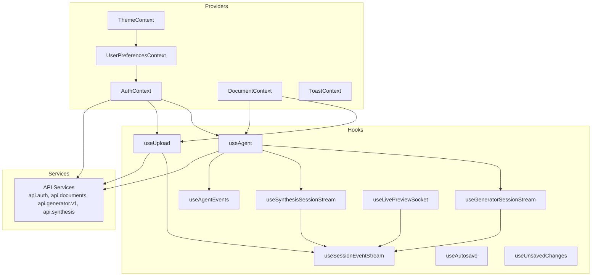

**Diagram sources**
- [AuthContext.jsx:16-340](file://frontend/src/context/AuthContext.jsx#L16-L340)
- [DocumentContext.jsx:17-139](file://frontend/src/context/DocumentContext.jsx#L17-L139)
- [ThemeContext.jsx:57-70](file://frontend/src/context/ThemeContext.jsx#L57-L70)
- [ToastContext.jsx:9-104](file://frontend/src/context/ToastContext.jsx#L9-L104)
- [UserPreferencesContext.jsx:8-66](file://frontend/src/context/UserPreferencesContext.jsx#L8-L66)
- [useAgent.js:18-292](file://frontend/src/hooks/useAgent.js#L18-L292)
- [useAgentEvents.js:7-163](file://frontend/src/hooks/useAgentEvents.js#L7-L163)
- [useGeneratorSessionStream.js:5-12](file://frontend/src/hooks/useGeneratorSessionStream.js#L5-L12)
- [useSessionEventStream.js:4-101](file://frontend/src/hooks/useSessionEventStream.js#L4-L101)
- [useSynthesisSessionStream.js:5-12](file://frontend/src/hooks/useSynthesisSessionStream.js#L5-L12)
- [useLivePreviewSocket.js:28-137](file://frontend/src/hooks/useLivePreviewSocket.js#L28-L137)
- [useUpload.js:22-361](file://frontend/src/hooks/useUpload.js#L22-L361)
- [useAutosave.js:5-37](file://frontend/src/hooks/useAutosave.js#L5-L37)
- [useUnsavedChanges.js:9-23](file://frontend/src/hooks/useUnsavedChanges.js#L9-L23)

**Section sources**
- [AuthContext.jsx:16-340](file://frontend/src/context/AuthContext.jsx#L16-L340)
- [DocumentContext.jsx:17-139](file://frontend/src/context/DocumentContext.jsx#L17-L139)
- [ThemeContext.jsx:57-70](file://frontend/src/context/ThemeContext.jsx#L57-L70)
- [ToastContext.jsx:9-104](file://frontend/src/context/ToastContext.jsx#L9-L104)
- [UserPreferencesContext.jsx:8-66](file://frontend/src/context/UserPreferencesContext.jsx#L8-L66)
- [useAgent.js:18-292](file://frontend/src/hooks/useAgent.js#L18-L292)
- [useAgentEvents.js:7-163](file://frontend/src/hooks/useAgentEvents.js#L7-L163)
- [useGeneratorSessionStream.js:5-12](file://frontend/src/hooks/useGeneratorSessionStream.js#L5-L12)
- [useSessionEventStream.js:4-101](file://frontend/src/hooks/useSessionEventStream.js#L4-L101)
- [useSynthesisSessionStream.js:5-12](file://frontend/src/hooks/useSynthesisSessionStream.js#L5-L12)
- [useLivePreviewSocket.js:28-137](file://frontend/src/hooks/useLivePreviewSocket.js#L28-L137)
- [useUpload.js:22-361](file://frontend/src/hooks/useUpload.js#L22-L361)
- [useAutosave.js:5-37](file://frontend/src/hooks/useAutosave.js#L5-L37)
- [useUnsavedChanges.js:9-23](file://frontend/src/hooks/useUnsavedChanges.js#L9-L23)

## Core Components
- Authentication state: centralized in AuthContext with Supabase integration, session guards, and OTP/passwordless flows
- Document processing state: managed in DocumentContext with hydration from sessionStorage and optimistic updates
- Theme and user preferences: synchronized with Supabase user metadata and persisted locally for guests
- Notifications: ToastContext provides transient, auto-dismissing notifications with progress indicators
- Real-time streams: SSE/WebSocket hooks for agent sessions, synthesis, and live preview
- Upload workflow: useUpload orchestrates file selection, chunked uploads, progress, and status polling

**Section sources**
- [AuthContext.jsx:16-340](file://frontend/src/context/AuthContext.jsx#L16-L340)
- [DocumentContext.jsx:17-139](file://frontend/src/context/DocumentContext.jsx#L17-L139)
- [ThemeContext.jsx:57-70](file://frontend/src/context/ThemeContext.jsx#L57-L70)
- [ToastContext.jsx:9-104](file://frontend/src/context/ToastContext.jsx#L9-L104)
- [UserPreferencesContext.jsx:8-66](file://frontend/src/context/UserPreferencesContext.jsx#L8-L66)
- [useAgent.js:18-292](file://frontend/src/hooks/useAgent.js#L18-L292)
- [useAgentEvents.js:7-163](file://frontend/src/hooks/useAgentEvents.js#L7-L163)
- [useGeneratorSessionStream.js:5-12](file://frontend/src/hooks/useGeneratorSessionStream.js#L5-L12)
- [useSessionEventStream.js:4-101](file://frontend/src/hooks/useSessionEventStream.js#L4-L101)
- [useSynthesisSessionStream.js:5-12](file://frontend/src/hooks/useSynthesisSessionStream.js#L5-L12)
- [useLivePreviewSocket.js:28-137](file://frontend/src/hooks/useLivePreviewSocket.js#L28-L137)
- [useUpload.js:22-361](file://frontend/src/hooks/useUpload.js#L22-L361)
- [useAutosave.js:5-37](file://frontend/src/hooks/useAutosave.js#L5-L37)
- [useUnsavedChanges.js:9-23](file://frontend/src/hooks/useUnsavedChanges.js#L9-L23)

## Architecture Overview
The system combines:
- Context providers for global state
- Custom hooks for domain-specific flows (agent, uploads, streams)
- Supabase for authentication and user metadata
- SSE/WebSocket for real-time updates
- Local/session storage for hydration and persistence

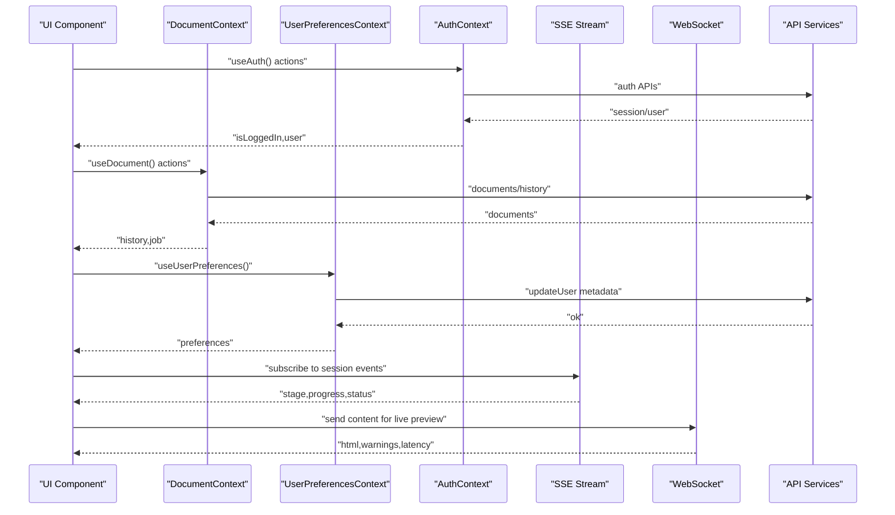

**Diagram sources**
- [AuthContext.jsx:16-340](file://frontend/src/context/AuthContext.jsx#L16-L340)
- [DocumentContext.jsx:17-139](file://frontend/src/context/DocumentContext.jsx#L17-L139)
- [UserPreferencesContext.jsx:8-66](file://frontend/src/context/UserPreferencesContext.jsx#L8-L66)
- [useSessionEventStream.js:4-101](file://frontend/src/hooks/useSessionEventStream.js#L4-L101)
- [useLivePreviewSocket.js:28-137](file://frontend/src/hooks/useLivePreviewSocket.js#L28-L137)

## Detailed Component Analysis

### Authentication State Management (AuthContext)
AuthContext centralizes authentication state and integrates with Supabase:
- Initializes from cached session and verifies tokens
- Guards against race conditions during sign-in/sign-up
- Manages OTP/passwordless flows and redirects
- Clears local auth storage and resets state on logout

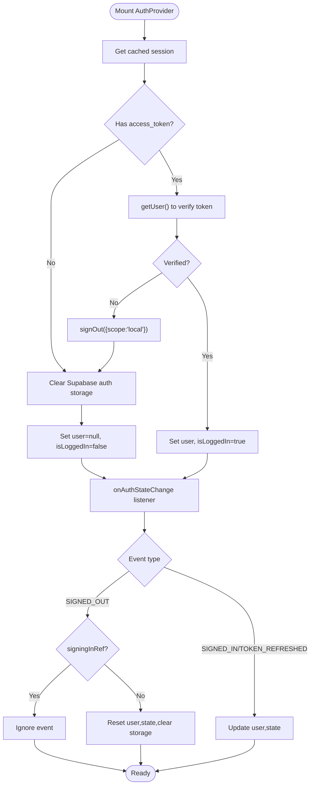

**Diagram sources**
- [AuthContext.jsx:65-178](file://frontend/src/context/AuthContext.jsx#L65-L178)

**Section sources**
- [AuthContext.jsx:16-340](file://frontend/src/context/AuthContext.jsx#L16-L340)

### Document Processing State (DocumentContext)
DocumentContext manages the active job and history:
- Hydrates active job from sessionStorage on mount
- Persists job to sessionStorage on changes
- Optimistically updates history on new jobs
- Normalizes backend statuses to frontend-friendly values

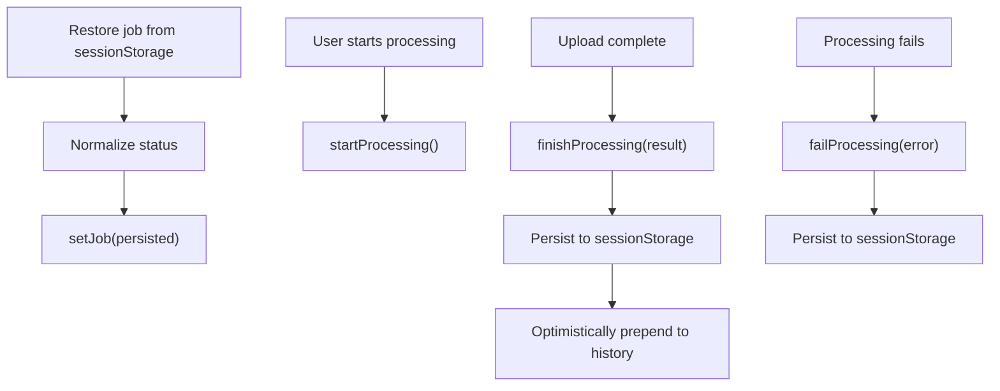

**Diagram sources**
- [DocumentContext.jsx:57-88](file://frontend/src/context/DocumentContext.jsx#L57-L88)
- [DocumentContext.jsx:90-121](file://frontend/src/context/DocumentContext.jsx#L90-L121)

**Section sources**
- [DocumentContext.jsx:17-139](file://frontend/src/context/DocumentContext.jsx#L17-L139)

### Theme and Preferences (ThemeContext, UserPreferencesContext)
- ThemeContext synchronizes UI theme with user metadata and persists changes back to Supabase
- UserPreferencesContext loads preferences from Supabase metadata for logged-in users or localStorage for guests, and syncs changes back to Supabase when available

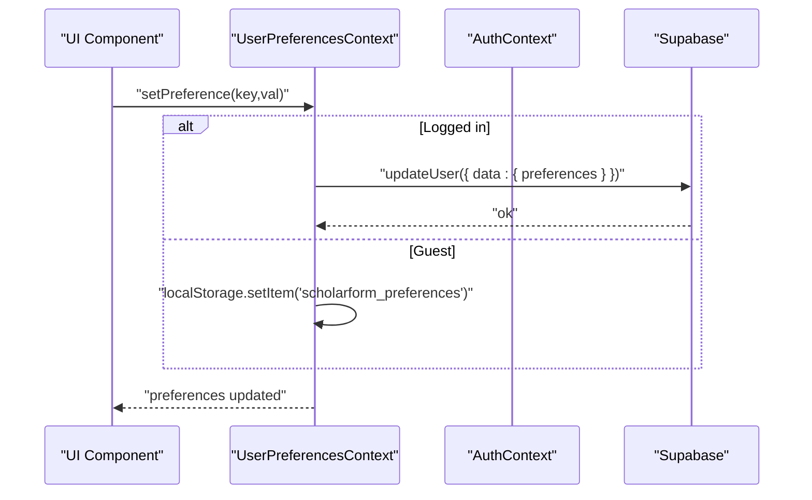

**Diagram sources**
- [UserPreferencesContext.jsx:41-56](file://frontend/src/context/UserPreferencesContext.jsx#L41-L56)
- [ThemeContext.jsx:24-48](file://frontend/src/context/ThemeContext.jsx#L24-L48)

**Section sources**
- [ThemeContext.jsx:57-70](file://frontend/src/context/ThemeContext.jsx#L57-L70)
- [UserPreferencesContext.jsx:8-66](file://frontend/src/context/UserPreferencesContext.jsx#L8-L66)

### Notifications (ToastContext)
ToastContext provides a queue of transient notifications with auto-dismiss and progress indication:
- Enforces a cap on concurrent toasts
- Manages per-toast timers and cleanup
- Renders a container and individual toast items

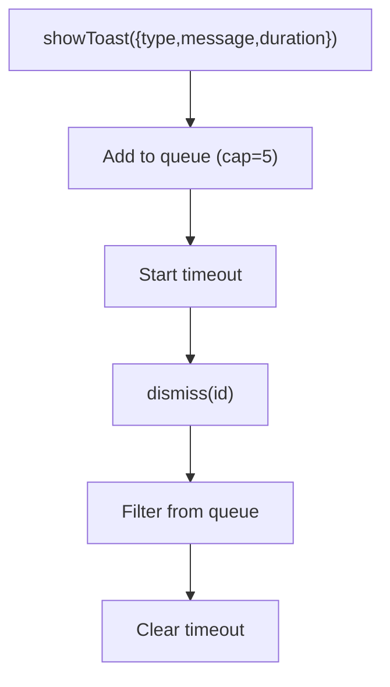

**Diagram sources**
- [ToastContext.jsx:19-34](file://frontend/src/context/ToastContext.jsx#L19-L34)

**Section sources**
- [ToastContext.jsx:9-104](file://frontend/src/context/ToastContext.jsx#L9-L104)

### Real-Time Streams and Sessions

#### SSE Streams (useSessionEventStream, useGeneratorSessionStream, useSynthesisSessionStream)
- useSessionEventStream connects to SSE endpoints, tracks stages, progress, and completion
- useGeneratorSessionStream and useSynthesisSessionStream reuse the generic stream hook with specific endpoints
- Implements exponential backoff and error propagation

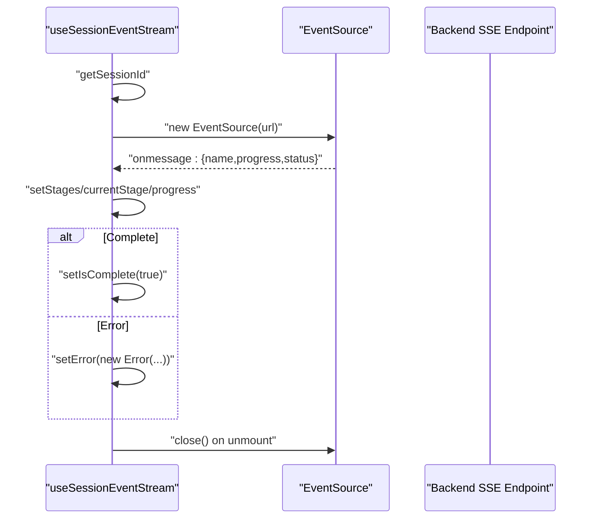

**Diagram sources**
- [useSessionEventStream.js:20-96](file://frontend/src/hooks/useSessionEventStream.js#L20-L96)
- [useGeneratorSessionStream.js:5-12](file://frontend/src/hooks/useGeneratorSessionStream.js#L5-L12)
- [useSynthesisSessionStream.js:5-12](file://frontend/src/hooks/useSynthesisSessionStream.js#L5-L12)

**Section sources**
- [useSessionEventStream.js:4-101](file://frontend/src/hooks/useSessionEventStream.js#L4-L101)
- [useGeneratorSessionStream.js:5-12](file://frontend/src/hooks/useGeneratorSessionStream.js#L5-L12)
- [useSynthesisSessionStream.js:5-12](file://frontend/src/hooks/useSynthesisSessionStream.js#L5-L12)

#### Agent Session Events (useAgentEvents)
- Subscribes to SSE events for outline chunks and stage updates
- Parses incremental outline JSON and transitions session state accordingly
- Integrates with agent session lifecycle

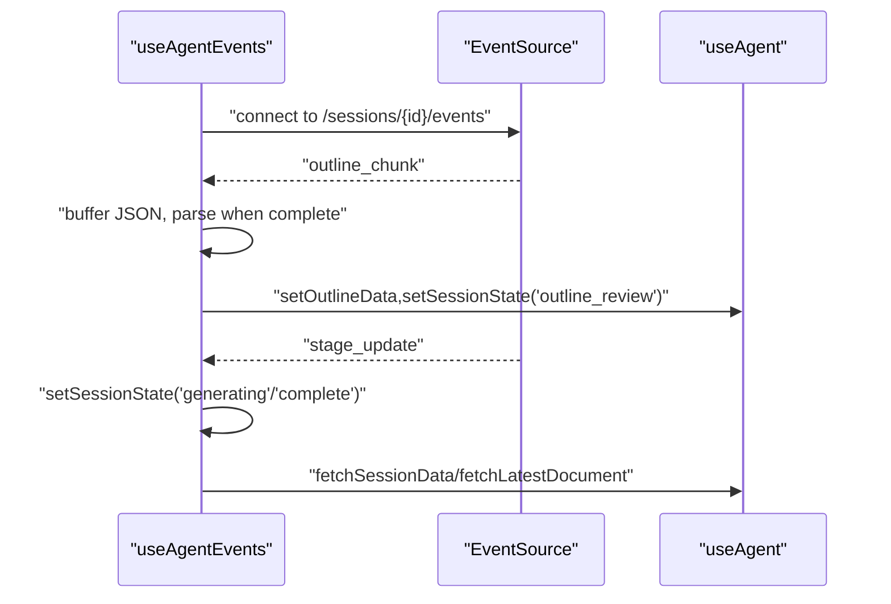

**Diagram sources**
- [useAgentEvents.js:23-156](file://frontend/src/hooks/useAgentEvents.js#L23-L156)

**Section sources**
- [useAgentEvents.js:7-163](file://frontend/src/hooks/useAgentEvents.js#L7-L163)

#### Live Preview WebSocket (useLivePreviewSocket)
- Establishes a WebSocket connection for live HTML previews
- Implements debounced sending with checksums and reconnect logic
- Tracks latency and warnings

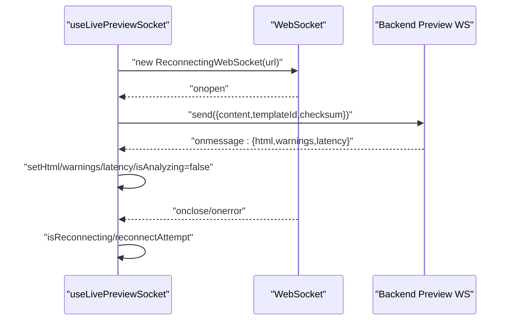

**Diagram sources**
- [useLivePreviewSocket.js:44-133](file://frontend/src/hooks/useLivePreviewSocket.js#L44-L133)

**Section sources**
- [useLivePreviewSocket.js:28-137](file://frontend/src/hooks/useLivePreviewSocket.js#L28-L137)

### Upload Workflow and Job State (useUpload)
- Validates inputs, handles chunked uploads for large files, and progressive uploads for small files
- Polls job status via a dedicated hook and updates UI state
- Persists active job to sessionStorage and navigates on completion
- Integrates with DocumentContext to maintain history and job state

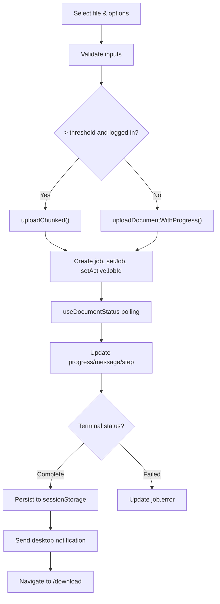

**Diagram sources**
- [useUpload.js:224-342](file://frontend/src/hooks/useUpload.js#L224-L342)
- [useUpload.js:89-196](file://frontend/src/hooks/useUpload.js#L89-L196)

**Section sources**
- [useUpload.js:22-361](file://frontend/src/hooks/useUpload.js#L22-L361)

### Local State Utilities
- useAutosave: periodically saves form data and step to localStorage with expiry
- useUnsavedChanges: warns users on unload when there are unsaved changes

**Section sources**
- [useAutosave.js:5-37](file://frontend/src/hooks/useAutosave.js#L5-L37)
- [useUnsavedChanges.js:9-23](file://frontend/src/hooks/useUnsavedChanges.js#L9-L23)

## Dependency Analysis
- Contexts depend on each other indirectly via shared services and hooks
- Hooks depend on Supabase for auth tokens and on API services for data
- SSE/WebSocket hooks depend on Supabase session tokens when present
- Persistence relies on sessionStorage/localStorage for hydration and offline continuity

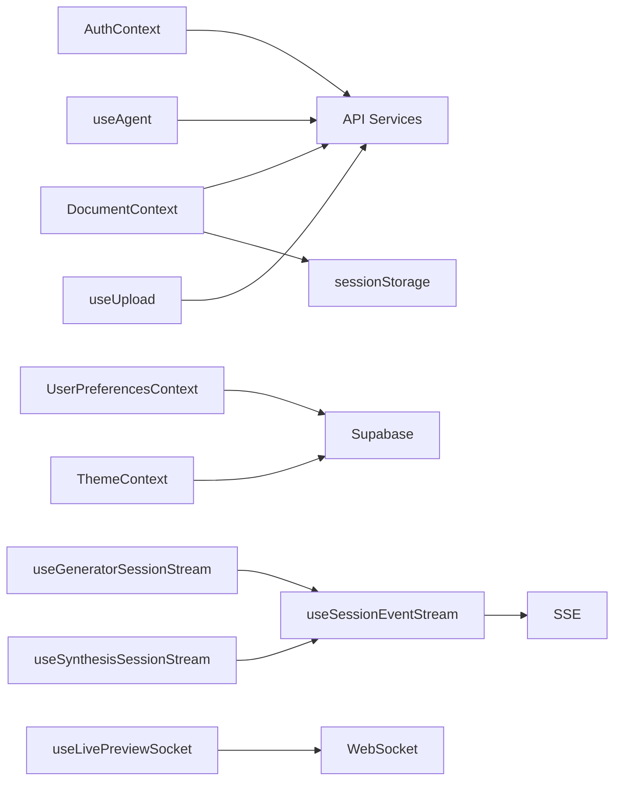

**Diagram sources**
- [AuthContext.jsx:16-340](file://frontend/src/context/AuthContext.jsx#L16-L340)
- [DocumentContext.jsx:17-139](file://frontend/src/context/DocumentContext.jsx#L17-L139)
- [UserPreferencesContext.jsx:8-66](file://frontend/src/context/UserPreferencesContext.jsx#L8-L66)
- [ThemeContext.jsx:57-70](file://frontend/src/context/ThemeContext.jsx#L57-L70)
- [useAgent.js:18-292](file://frontend/src/hooks/useAgent.js#L18-L292)
- [useUpload.js:22-361](file://frontend/src/hooks/useUpload.js#L22-L361)
- [useGeneratorSessionStream.js:5-12](file://frontend/src/hooks/useGeneratorSessionStream.js#L5-L12)
- [useSynthesisSessionStream.js:5-12](file://frontend/src/hooks/useSynthesisSessionStream.js#L5-L12)
- [useSessionEventStream.js:4-101](file://frontend/src/hooks/useSessionEventStream.js#L4-L101)
- [useLivePreviewSocket.js:28-137](file://frontend/src/hooks/useLivePreviewSocket.js#L28-L137)

**Section sources**
- [AuthContext.jsx:16-340](file://frontend/src/context/AuthContext.jsx#L16-L340)
- [DocumentContext.jsx:17-139](file://frontend/src/context/DocumentContext.jsx#L17-L139)
- [UserPreferencesContext.jsx:8-66](file://frontend/src/context/UserPreferencesContext.jsx#L8-L66)
- [ThemeContext.jsx:57-70](file://frontend/src/context/ThemeContext.jsx#L57-L70)
- [useAgent.js:18-292](file://frontend/src/hooks/useAgent.js#L18-L292)
- [useUpload.js:22-361](file://frontend/src/hooks/useUpload.js#L22-L361)
- [useGeneratorSessionStream.js:5-12](file://frontend/src/hooks/useGeneratorSessionStream.js#L5-L12)
- [useSynthesisSessionStream.js:5-12](file://frontend/src/hooks/useSynthesisSessionStream.js#L5-L12)
- [useSessionEventStream.js:4-101](file://frontend/src/hooks/useSessionEventStream.js#L4-L101)
- [useLivePreviewSocket.js:28-137](file://frontend/src/hooks/useLivePreviewSocket.js#L28-L137)

## Performance Considerations
- Minimize re-renders by memoizing callbacks with useCallback and avoiding unnecessary object/array allocations
- Use shallow comparisons for props and state to reduce downstream re-renders
- Debounce high-frequency updates (e.g., live preview content) to balance responsiveness and throughput
- Prefer optimistic UI updates for immediate feedback, with reconciliation on server confirmation
- Limit concurrent notifications and toast lifetimes to avoid UI thrashing
- Use exponential backoff for SSE/WebSocket reconnections and cap retry attempts
- Persist only essential state to sessionStorage/localStorage to avoid quota issues

## Troubleshooting Guide
- Authentication loops or stale state:
  - Verify onAuthStateChange guards and signingInRef usage
  - Confirm getSession/getUser verification and local storage cleanup
- SSE/WebSocket disconnections:
  - Inspect error handlers and exponential backoff logic
  - Ensure token injection via query param when applicable
- Upload stalls or incorrect progress:
  - Validate refetch intervals and polling logic
  - Check chunked upload thresholds and abort controller usage
- Toast not dismissing:
  - Confirm timer cleanup and queue limits
- Live preview not updating:
  - Verify checksum differences and debounce timing
  - Check reconnect attempts and pending payload replay

**Section sources**
- [AuthContext.jsx:140-178](file://frontend/src/context/AuthContext.jsx#L140-L178)
- [useSessionEventStream.js:76-96](file://frontend/src/hooks/useSessionEventStream.js#L76-L96)
- [useUpload.js:75-96](file://frontend/src/hooks/useUpload.js#L75-L96)
- [ToastContext.jsx:31-34](file://frontend/src/context/ToastContext.jsx#L31-L34)
- [useLivePreviewSocket.js:91-102](file://frontend/src/hooks/useLivePreviewSocket.js#L91-L102)

## Conclusion
The frontend employs a layered state management strategy:
- Context providers encapsulate cross-cutting concerns (auth, theme, preferences, notifications)
- Document and upload workflows combine local state with server-driven updates
- Real-time integrations (SSE/WebSocket) provide responsive feedback with robust reconnection
- Persistence ensures continuity across sessions and page reloads
- Hooks abstract complex flows and promote reuse across components