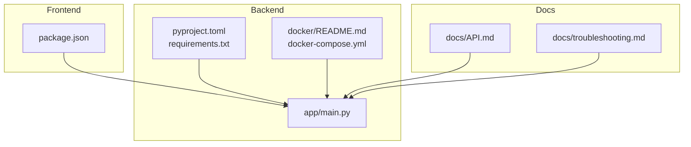
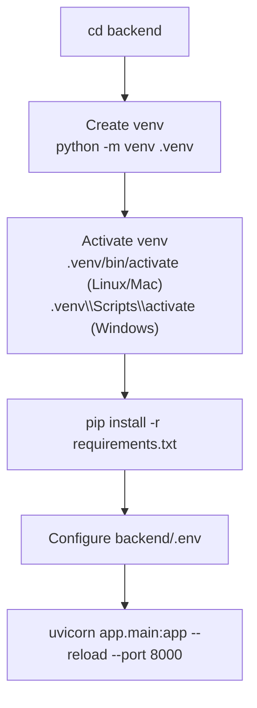
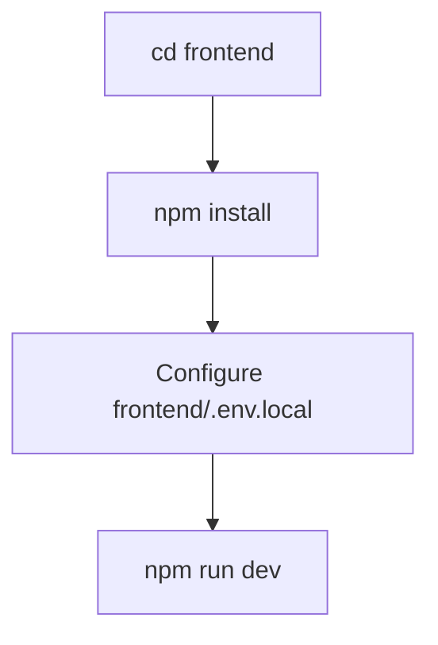
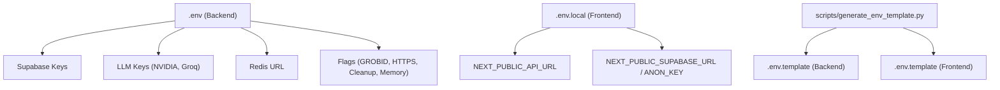
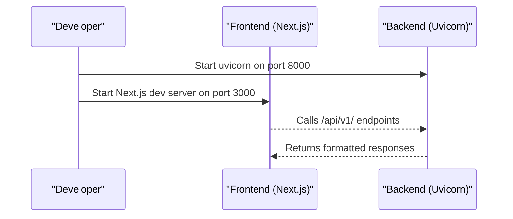
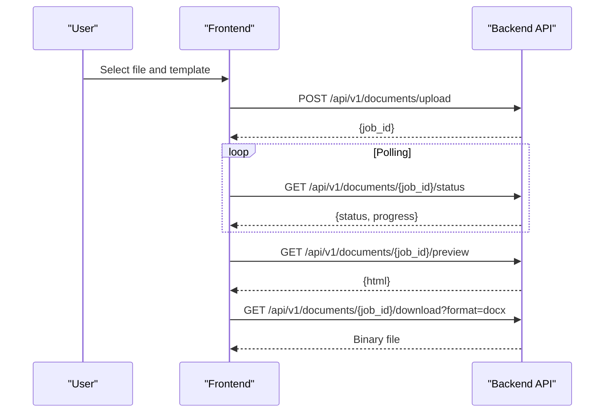
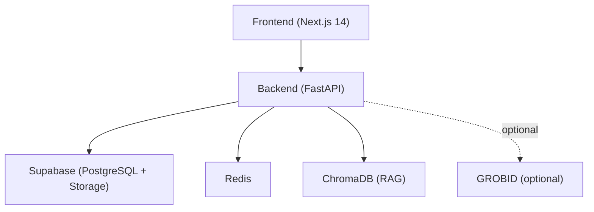

# Getting Started

<cite>
**Referenced Files in This Document**
- [README.md](file://README.md)
- [backend/README.md](file://backend/README.md)
- [backend/pyproject.toml](file://backend/pyproject.toml)
- [backend/requirements.txt](file://backend/requirements.txt)
- [backend/app/main.py](file://backend/app/main.py)
- [backend/docker/README.md](file://backend/docker/README.md)
- [backend/docker/docker-compose.yml](file://backend/docker/docker-compose.yml)
- [scripts/generate_env_template.py](file://scripts/generate_env_template.py)
- [frontend/package.json](file://frontend/package.json)
- [docs/API.md](file://docs/API.md)
- [docs/troubleshooting.md](file://docs/troubleshooting.md)
</cite>

## Table of Contents
1. [Introduction](#introduction)
2. [Prerequisites](#prerequisites)
3. [Quick Links](#quick-links)
4. [Project Structure](#project-structure)
5. [Backend Setup](#backend-setup)
6. [Frontend Setup](#frontend-setup)
7. [Environment Variables](#environment-variables)
8. [Development Server Startup](#development-server-startup)
9. [Basic Usage Examples](#basic-usage-examples)
10. [Verification Steps](#verification-steps)
11. [Architecture Overview](#architecture-overview)
12. [Troubleshooting Guide](#troubleshooting-guide)
13. [Conclusion](#conclusion)

## Introduction
This guide helps you quickly set up and run the Automated Academic Manuscript Formatter locally. It covers prerequisites, environment configuration, backend and frontend startup, and basic usage for uploading documents, generating formatted outputs, and using AI agent features. It also includes verification steps and troubleshooting tips to resolve common setup issues.

## Prerequisites
- Python 3.12.x (required for backend)
- Node.js 18+ (required for frontend)
- Docker (optional, recommended for full local stack)
- Git (recommended for cloning the repository)

Notes:
- The backend enforces Python 3.12 via project configuration.
- The frontend uses Next.js 14 with the App Router and requires Node.js 18+.

**Section sources**
- [backend/pyproject.toml:8](file://backend/pyproject.toml#L8)
- [README.md:13](file://README.md#L13)
- [backend/README.md:56](file://backend/README.md#L56)

## Quick Links
- Frontend: http://localhost:3000
- Backend API: http://localhost:8000
- OpenAPI Docs: http://localhost:8000/docs
- Framework: Next.js 14 (App Router), not Vite

**Section sources**
- [README.md:9](file://README.md#L9)
- [README.md:10](file://README.md#L10)
- [README.md:12](file://README.md#L12)

## Project Structure
The repository is organized into:
- backend: FastAPI application, database, middleware, pipelines, and Docker configuration
- frontend: Next.js 14 application with TypeScript, Tailwind CSS, and E2E tests
- docs: API reference, architecture, deployment, and troubleshooting guides
- scripts: Utilities for environment template generation

**Diagram sources**
- [backend/app/main.py:263](file://backend/app/main.py#L263)
- [backend/pyproject.toml:1](file://backend/pyproject.toml#L1)
- [backend/requirements.txt:1](file://backend/requirements.txt#L1)
- [backend/docker/README.md:1](file://backend/docker/README.md#L1)
- [backend/docker/docker-compose.yml:1](file://backend/docker/docker-compose.yml#L1)
- [frontend/package.json:1](file://frontend/package.json#L1)
- [docs/API.md:1](file://docs/API.md#L1)
- [docs/troubleshooting.md:1](file://docs/troubleshooting.md#L1)

**Section sources**
- [README.md:1](file://README.md#L1)
- [backend/README.md:1](file://backend/README.md#L1)
- [frontend/package.json:1](file://frontend/package.json#L1)

## Backend Setup
Follow these steps to prepare and run the backend:

1. Navigate to the backend directory
2. Create and activate a Python 3.12 virtual environment
3. Install dependencies from requirements.txt
4. Configure environment variables in backend/.env
5. Start the development server with Uvicorn

**Diagram sources**
- [README.md:87](file://README.md#L87)
- [README.md:105](file://README.md#L105)
- [backend/README.md:58](file://backend/README.md#L58)

**Section sources**
- [README.md:87](file://README.md#L87)
- [README.md:105](file://README.md#L105)
- [backend/README.md:58](file://backend/README.md#L58)
- [backend/requirements.txt:1](file://backend/requirements.txt#L1)

## Frontend Setup
Follow these steps to prepare and run the frontend:

1. Navigate to the frontend directory
2. Install dependencies using npm
3. Configure environment variables in frontend/.env.local
4. Start the development server

**Diagram sources**
- [README.md:113](file://README.md#L113)
- [README.md:117](file://README.md#L117)

**Section sources**
- [README.md:113](file://README.md#L113)
- [README.md:117](file://README.md#L117)
- [frontend/package.json:6](file://frontend/package.json#L6)

## Environment Variables
Configure environment variables for both backend and frontend.

Backend (.env):
- Supabase credentials and JWT secret
- NVIDIA and Groq API keys
- Redis URL
- GROBID toggle and other flags
- HTTPS enforcement, cleanup, and memory-related settings
- Antivirus host

Frontend (.env.local):
- NEXT_PUBLIC_API_URL pointing to backend
- Supabase public URL and anonymous key

Syncing templates:
- Use the provided script to generate .env.template files from code usage and .env.example defaults.

**Diagram sources**
- [README.md:35](file://README.md#L35)
- [README.md:59](file://README.md#L59)
- [scripts/generate_env_template.py:1](file://scripts/generate_env_template.py#L1)

**Section sources**
- [README.md:35](file://README.md#L35)
- [README.md:59](file://README.md#L59)
- [README.md:70](file://README.md#L70)
- [README.md:72](file://README.md#L72)
- [scripts/generate_env_template.py:210](file://scripts/generate_env_template.py#L210)

## Development Server Startup
Start both backend and frontend servers:

Backend:
- Use the uvicorn command with reload enabled on port 8000.

Frontend:
- Use the Next.js dev server on port 3000.

**Diagram sources**
- [README.md:105](file://README.md#L105)
- [README.md:117](file://README.md#L117)

**Section sources**
- [README.md:105](file://README.md#L105)
- [README.md:117](file://README.md#L117)

## Basic Usage Examples
This section demonstrates common workflows using the API and UI.

Upload and format a document:
- Use the upload endpoint to submit a supported file format.
- Poll the status endpoint to track processing.
- View a preview and download the formatted output.

AI agent and synthesis:
- Create a generator session (agent or synthesis).
- Stream progress via the events endpoint.
- Approve outlines and receive generated content.

**Diagram sources**
- [docs/API.md:34](file://docs/API.md#L34)
- [docs/API.md:46](file://docs/API.md#L46)
- [docs/API.md:54](file://docs/API.md#L54)
- [docs/API.md:66](file://docs/API.md#L66)

**Section sources**
- [docs/API.md:34](file://docs/API.md#L34)
- [docs/API.md:46](file://docs/API.md#L46)
- [docs/API.md:54](file://docs/API.md#L54)
- [docs/API.md:66](file://docs/API.md#L66)

## Verification Steps
After starting both servers, verify the setup:

- Backend health: GET /health should return OK and list Redis, DB, and ChromaDB statuses.
- OpenAPI docs: Visit /docs to confirm endpoint availability.
- Frontend: Open http://localhost:3000 and ensure the app loads without errors.
- Environment variables: Confirm NEXT_PUBLIC_API_URL points to http://localhost:8000.

**Section sources**
- [docs/API.md:192](file://docs/API.md#L192)
- [README.md:109](file://README.md#L109)
- [README.md:121](file://README.md#L121)

## Architecture Overview
High-level architecture for local development:

**Diagram sources**
- [README.md:145](file://README.md#L145)
- [backend/app/main.py:263](file://backend/app/main.py#L263)

**Section sources**
- [README.md:145](file://README.md#L145)
- [backend/app/main.py:263](file://backend/app/main.py#L263)

## Troubleshooting Guide
Common setup and runtime issues with resolutions:

- Upload errors
  - Invalid file type: Ensure the file is DOCX, PDF, or TEX.
  - File too large: Reduce image sizes or split appendices.

- Processing issues
  - Status stuck on RUNNING: Refresh the page, check backend logs, and retry.
  - Formatting failure: Try the “None” template, then retry with the target template.

- Preview and download problems
  - Empty or partial preview: Confirm the job reached COMPLETED status and retry.
  - Download button fails: Ensure COMPLETED status, retry from the Download page, and try DOCX first.

- Authentication and security
  - 401 Unauthorized: Log out and log in again.
  - CSRF token mismatch: Clear site cookies, refresh, and retry.

- Debug commands
  - Frontend: Run tests and build locally.
  - Backend: Run targeted tests for template rendering and export pipeline.

Escalation checklist:
- Include input file type and size, selected template, exact error message, job ID, browser and OS.

**Section sources**
- [docs/troubleshooting.md:5](file://docs/troubleshooting.md#L5)
- [docs/troubleshooting.md:16](file://docs/troubleshooting.md#L16)
- [docs/troubleshooting.md:29](file://docs/troubleshooting.md#L29)
- [docs/troubleshooting.md:42](file://docs/troubleshooting.md#L42)
- [docs/troubleshooting.md:55](file://docs/troubleshooting.md#L55)
- [docs/troubleshooting.md:70](file://docs/troubleshooting.md#L70)
- [docs/troubleshooting.md:95](file://docs/troubleshooting.md#L95)
- [docs/troubleshooting.md:122](file://docs/troubleshooting.md#L122)
- [docs/troubleshooting.md:140](file://docs/troubleshooting.md#L140)

## Conclusion
You are now ready to develop and run the Automated Academic Manuscript Formatter locally. Use the backend and frontend development servers, configure environment variables, and follow the usage examples to upload documents, generate formatted outputs, and explore AI agent features. Refer to the troubleshooting guide for resolving common issues.