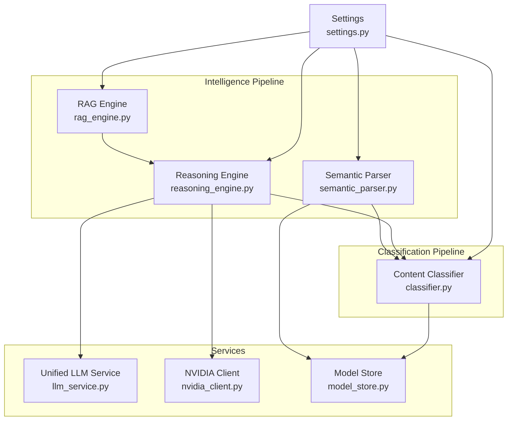
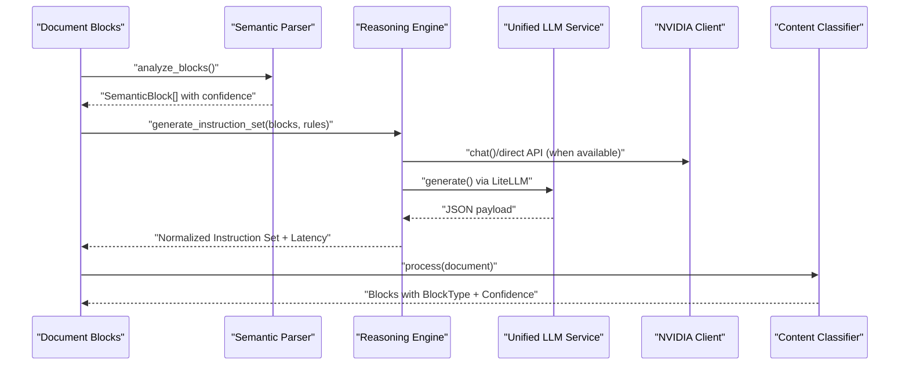
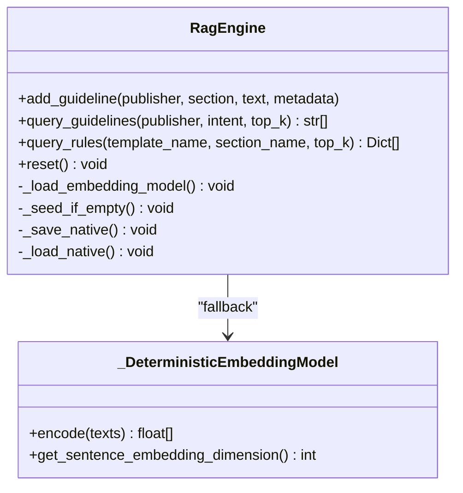
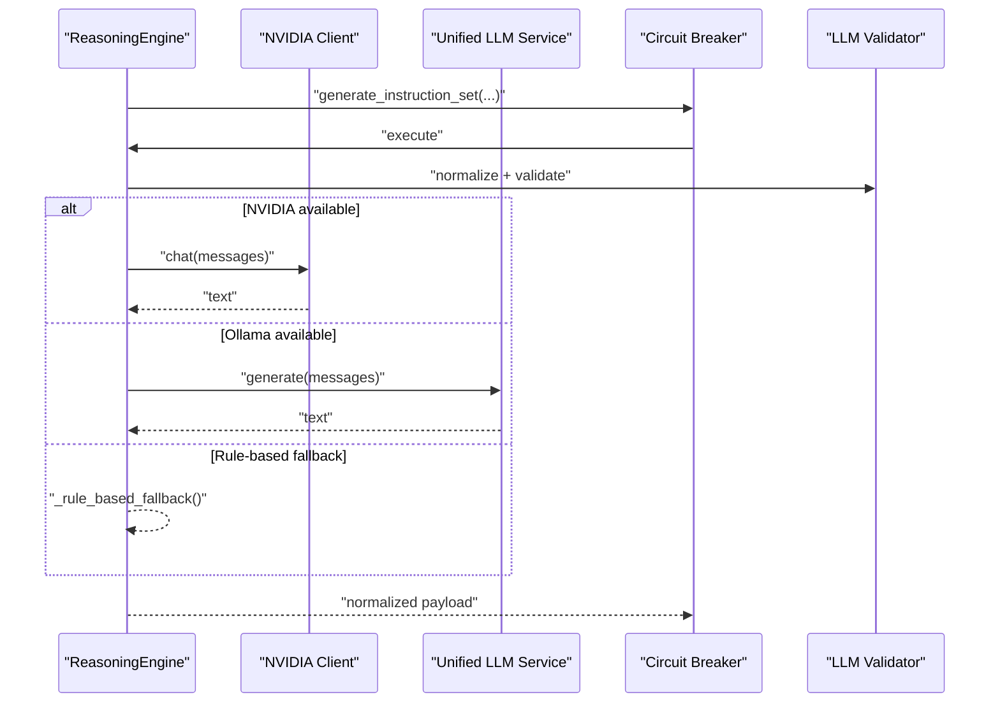
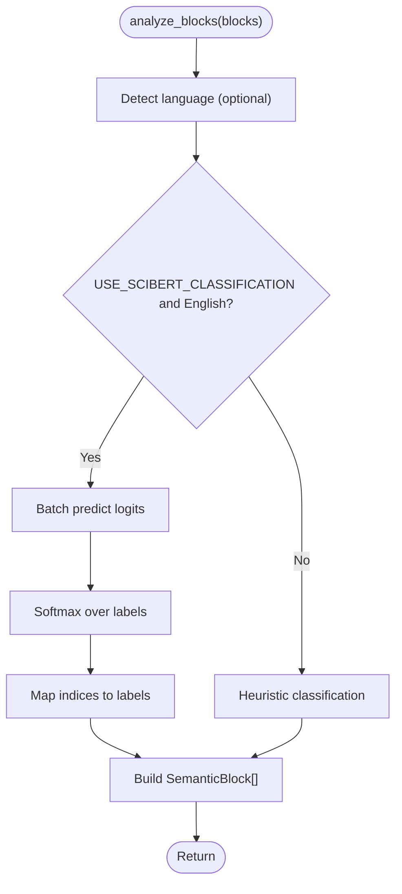
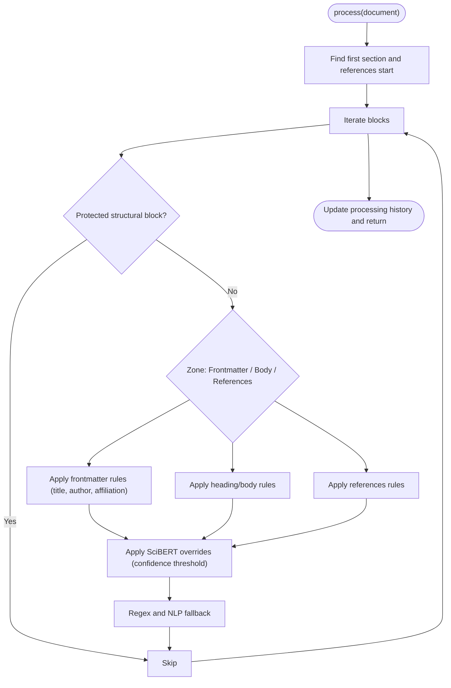
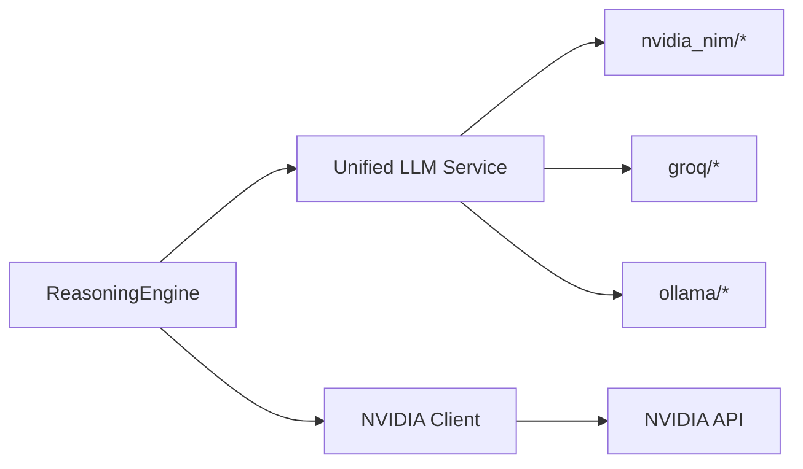
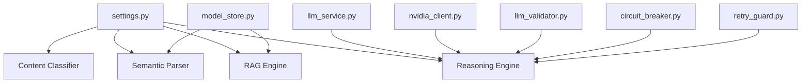

# AI Analysis

<cite>
**Referenced Files in This Document**
- [rag_engine.py](file://backend/app/pipeline/intelligence/rag_engine.py)
- [reasoning_engine.py](file://backend/app/pipeline/intelligence/reasoning_engine.py)
- [semantic_parser.py](file://backend/app/pipeline/intelligence/semantic_parser.py)
- [classifier.py](file://backend/app/pipeline/classification/classifier.py)
- [nvidia_client.py](file://backend/app/services/nvidia_client.py)
- [llm_service.py](file://backend/app/services/llm_service.py)
- [settings.py](file://backend/app/config/settings.py)
- [model_store.py](file://backend/app/services/model_store.py)
- [default_guidelines.json](file://backend/app/pipeline/intelligence/default_guidelines.json)
- [test_rag_engine.py](file://backend/tests/test_rag_engine.py)
- [test_reasoning_engine.py](file://backend/tests/test_reasoning_engine.py)
- [test_scibert_benchmark.py](file://backend/tests/test_scibert_benchmark.py)
- [llm_validator.py](file://backend/app/pipeline/safety/llm_validator.py)
- [circuit_breaker.py](file://backend/app/pipeline/safety/circuit_breaker.py)
- [retry_guard.py](file://backend/app/pipeline/safety/retry_guard.py)
</cite>

## Table of Contents
1. [Introduction](#introduction)
2. [Project Structure](#project-structure)
3. [Core Components](#core-components)
4. [Architecture Overview](#architecture-overview)
5. [Detailed Component Analysis](#detailed-component-analysis)
6. [Dependency Analysis](#dependency-analysis)
7. [Performance Considerations](#performance-considerations)
8. [Troubleshooting Guide](#troubleshooting-guide)
9. [Conclusion](#conclusion)
10. [Appendices](#appendices)

## Introduction
This document explains the AI analysis subsystem powering automated academic manuscript formatting. It covers the content analysis engine, semantic parsing, classification systems, RAG (Retrieval-Augmented Generation) engine, reasoning engine, and SciBERT-based classification. It also documents integration with external AI services (NVIDIA NIM, Groq, and Ollama), configuration options, performance optimization strategies, and troubleshooting approaches.

## Project Structure
The AI analysis components are organized into three main areas:
- Intelligence pipeline: RAG engine, reasoning engine, and semantic parser
- Classification pipeline: rule-based and transformer-driven classification
- Services: unified LLM access, NVIDIA client, and model store

**Diagram sources**
- [rag_engine.py:106-528](file://backend/app/pipeline/intelligence/rag_engine.py#L106-L528)
- [reasoning_engine.py:83-774](file://backend/app/pipeline/intelligence/reasoning_engine.py#L83-L774)
- [semantic_parser.py:32-306](file://backend/app/pipeline/intelligence/semantic_parser.py#L32-L306)
- [classifier.py:22-830](file://backend/app/pipeline/classification/classifier.py#L22-L830)
- [llm_service.py:1-393](file://backend/app/services/llm_service.py#L1-L393)
- [nvidia_client.py:30-260](file://backend/app/services/nvidia_client.py#L30-L260)
- [model_store.py:4-33](file://backend/app/services/model_store.py#L4-L33)
- [settings.py:73-422](file://backend/app/config/settings.py#L73-L422)

**Section sources**
- [rag_engine.py:1-528](file://backend/app/pipeline/intelligence/rag_engine.py#L1-L528)
- [reasoning_engine.py:1-774](file://backend/app/pipeline/intelligence/reasoning_engine.py#L1-L774)
- [semantic_parser.py:1-306](file://backend/app/pipeline/intelligence/semantic_parser.py#L1-L306)
- [classifier.py:1-830](file://backend/app/pipeline/classification/classifier.py#L1-L830)
- [llm_service.py:1-393](file://backend/app/services/llm_service.py#L1-L393)
- [nvidia_client.py:1-260](file://backend/app/services/nvidia_client.py#L1-L260)
- [model_store.py:1-33](file://backend/app/services/model_store.py#L1-L33)
- [settings.py:1-422](file://backend/app/config/settings.py#L1-L422)

## Core Components
- RAG Engine: Local retrieval with ChromaDB-backed embeddings and a deterministic fallback. Seeds default academic formatting guidelines and supports publisher-aware retrieval.
- Reasoning Engine: Multi-tier LLM orchestration (NVIDIA NIM primary, Ollama fallback, rule-based safety net). Normalizes outputs into a canonical instruction set with confidence scoring.
- Semantic Parser: SciBERT-based classification of document blocks with heuristic fallback and language detection.
- Content Classifier: Rule-based classification enriched with SciBERT predictions and GROBID metadata.
- Unified LLM Service: Provider-agnostic access to NVIDIA NIM, Groq, and Ollama with caching and health checks.
- NVIDIA Client: Thin wrapper around NVIDIA APIs with LiteLLM integration and fallbacks.
- Model Store: Global registry for preloaded AI models to reduce cold-start costs.

**Section sources**
- [rag_engine.py:106-528](file://backend/app/pipeline/intelligence/rag_engine.py#L106-L528)
- [reasoning_engine.py:83-774](file://backend/app/pipeline/intelligence/reasoning_engine.py#L83-L774)
- [semantic_parser.py:32-306](file://backend/app/pipeline/intelligence/semantic_parser.py#L32-L306)
- [classifier.py:22-830](file://backend/app/pipeline/classification/classifier.py#L22-L830)
- [llm_service.py:1-393](file://backend/app/services/llm_service.py#L1-L393)
- [nvidia_client.py:30-260](file://backend/app/services/nvidia_client.py#L30-L260)
- [model_store.py:4-33](file://backend/app/services/model_store.py#L4-L33)

## Architecture Overview
The AI analysis pipeline integrates external LLM providers and local models to deliver robust, resilient classification and reasoning.

**Diagram sources**
- [semantic_parser.py:107-159](file://backend/app/pipeline/intelligence/semantic_parser.py#L107-L159)
- [reasoning_engine.py:463-571](file://backend/app/pipeline/intelligence/reasoning_engine.py#L463-L571)
- [llm_service.py:91-203](file://backend/app/services/llm_service.py#L91-L203)
- [nvidia_client.py:68-140](file://backend/app/services/nvidia_client.py#L68-L140)
- [classifier.py:237-638](file://backend/app/pipeline/classification/classifier.py#L237-L638)

## Detailed Component Analysis

### RAG Engine
The RAG Engine provides local retrieval of academic formatting guidelines with a robust fallback strategy:
- Embedding models: BGE-M3 (primary, 1024d), BGE-small (fallback, 384d), and a deterministic hash-based fallback for environments without transformers.
- Storage backends: ChromaDB persistent store (preferred) with a native JSON fallback for resilience.
- Auto-seeding: Loads default guidelines from a bundled JSON file when the knowledge base is empty.
- Publisher-aware retrieval: Filters results by publisher and returns top-k relevant guidelines.

**Diagram sources**
- [rag_engine.py:106-528](file://backend/app/pipeline/intelligence/rag_engine.py#L106-L528)

Key behaviors:
- Embedding model selection prioritizes reusable models from the ModelStore and gracefully falls back to transformers or deterministic hashing.
- ChromaDB compatibility is handled with NumPy compatibility patches and graceful fallback to native storage.
- Auto-seeding ensures the system has default guidelines when no external data is present.

**Section sources**
- [rag_engine.py:106-528](file://backend/app/pipeline/intelligence/rag_engine.py#L106-L528)
- [default_guidelines.json:1-59](file://backend/app/pipeline/intelligence/default_guidelines.json#L1-L59)
- [model_store.py:4-33](file://backend/app/services/model_store.py#L4-L33)

### Reasoning Engine
The Reasoning Engine orchestrates LLM reasoning with multi-tier fallback and safety guards:
- Tiers: NVIDIA NIM (primary), Ollama (DeepSeek), and rule-based heuristics.
- Output normalization: Converts diverse JSON schemas into a canonical instruction set with confidence aggregation.
- Safety: JSON schema validation, circuit breaker, retry logic, and cancellation support.
- Metrics: Tracks latency and fallbacks when metrics are available.

**Diagram sources**
- [reasoning_engine.py:457-571](file://backend/app/pipeline/intelligence/reasoning_engine.py#L457-L571)
- [llm_service.py:205-274](file://backend/app/services/llm_service.py#L205-L274)
- [nvidia_client.py:68-140](file://backend/app/services/nvidia_client.py#L68-L140)
- [llm_validator.py:46-122](file://backend/app/pipeline/safety/llm_validator.py#L46-L122)
- [circuit_breaker.py:29-98](file://backend/app/pipeline/safety/circuit_breaker.py#L29-L98)

Operational highlights:
- Batch processing of blocks with configurable batch size and per-call timeouts.
- Robust JSON parsing with fallback to regex extraction when API returns malformed JSON.
- Deterministic rule-based fallback preserves pipeline progress even under provider outages.

**Section sources**
- [reasoning_engine.py:83-774](file://backend/app/pipeline/intelligence/reasoning_engine.py#L83-L774)
- [llm_service.py:1-393](file://backend/app/services/llm_service.py#L1-L393)
- [nvidia_client.py:30-260](file://backend/app/services/nvidia_client.py#L30-L260)
- [llm_validator.py:1-122](file://backend/app/pipeline/safety/llm_validator.py#L1-L122)
- [circuit_breaker.py:1-164](file://backend/app/pipeline/safety/circuit_breaker.py#L1-L164)
- [retry_guard.py:1-63](file://backend/app/pipeline/safety/retry_guard.py#L1-L63)

### Semantic Parser (SciBERT)
The Semantic Parser performs transformer-based classification of document blocks:
- SciBERT model loading with lazy initialization and ModelStore reuse.
- Language detection to restrict transformer inference to English documents.
- Batch and single-block classification with softmax-based confidence.
- Heuristic fallback when transformer inference is disabled or unavailable.

**Diagram sources**
- [semantic_parser.py:107-225](file://backend/app/pipeline/intelligence/semantic_parser.py#L107-L225)

**Section sources**
- [semantic_parser.py:32-306](file://backend/app/pipeline/intelligence/semantic_parser.py#L32-L306)
- [model_store.py:4-33](file://backend/app/services/model_store.py#L4-L33)

### Content Classifier
The Content Classifier assigns BlockType to blocks using:
- Structure-detected headings and sections
- GROBID metadata integration (titles, authors, affiliations)
- SciBERT batch predictions with confidence thresholds
- Extensive rule sets for headings, references, footnotes, and appendices
- NLP confidence integration to refine confidence scoring

**Diagram sources**
- [classifier.py:237-638](file://backend/app/pipeline/classification/classifier.py#L237-L638)

**Section sources**
- [classifier.py:22-830](file://backend/app/pipeline/classification/classifier.py#L22-L830)

### Integration with External AI Services
- NVIDIA NIM: Primary reasoning tier via unified LLM service or direct client with LiteLLM fallback.
- Groq: Secondary tier in the unified LLM service with automatic fallback.
- Ollama: Local DeepSeek model with health checks and model auto-selection.

**Diagram sources**
- [reasoning_engine.py:54-82](file://backend/app/pipeline/intelligence/reasoning_engine.py#L54-L82)
- [llm_service.py:39-52](file://backend/app/services/llm_service.py#L39-L52)
- [nvidia_client.py:30-67](file://backend/app/services/nvidia_client.py#L30-L67)

**Section sources**
- [reasoning_engine.py:116-176](file://backend/app/pipeline/intelligence/reasoning_engine.py#L116-L176)
- [llm_service.py:205-274](file://backend/app/services/llm_service.py#L205-L274)
- [nvidia_client.py:30-140](file://backend/app/services/nvidia_client.py#L30-L140)

## Dependency Analysis
The AI components depend on configuration, caching, and safety layers:
- Settings drive feature toggles (USE_SCIBERT_CLASSIFICATION, LOW_MEMORY_MODE, RAG_USE_TRANSFORMERS, ENABLE_NVIDIA_REASONER) and timeouts.
- Unified LLM service centralizes provider configuration and caching.
- Safety decorators enforce schema compliance and resilience.

**Diagram sources**
- [settings.py:73-422](file://backend/app/config/settings.py#L73-L422)
- [llm_service.py:1-393](file://backend/app/services/llm_service.py#L1-L393)
- [nvidia_client.py:30-260](file://backend/app/services/nvidia_client.py#L30-L260)
- [model_store.py:4-33](file://backend/app/services/model_store.py#L4-L33)
- [llm_validator.py:1-122](file://backend/app/pipeline/safety/llm_validator.py#L1-L122)
- [circuit_breaker.py:1-164](file://backend/app/pipeline/safety/circuit_breaker.py#L1-L164)
- [retry_guard.py:1-63](file://backend/app/pipeline/safety/retry_guard.py#L1-L63)

**Section sources**
- [settings.py:175-221](file://backend/app/config/settings.py#L175-L221)
- [llm_service.py:1-393](file://backend/app/services/llm_service.py#L1-L393)
- [llm_validator.py:1-122](file://backend/app/pipeline/safety/llm_validator.py#L1-L122)
- [circuit_breaker.py:1-164](file://backend/app/pipeline/safety/circuit_breaker.py#L1-L164)
- [retry_guard.py:1-63](file://backend/app/pipeline/safety/retry_guard.py#L1-L63)

## Performance Considerations
- Model preloading: Enable PRELOAD_AI_MODELS to load models at startup and reuse via ModelStore.
- Low-memory mode: Set LOW_MEMORY_MODE to force deterministic embeddings and disable transformers in RAG.
- SciBERT gating: Toggle USE_SCIBERT_CLASSIFICATION to balance accuracy and speed.
- RAG transformers: Disable RAG_USE_TRANSFORMERS to avoid heavy transformers in RAG.
- LLM caching: Unified LLM service caches responses keyed by prompt/model/temperature to reduce latency.
- Batch sizes: ReasoningEngine processes blocks in batches to optimize throughput.
- Timeouts: Tune PIPELINE_REASONING_TIMEOUT_SECONDS and related pipeline timeouts to match workload characteristics.

[No sources needed since this section provides general guidance]

## Troubleshooting Guide
Common issues and resolutions:
- RAG initialization failures:
  - Symptom: RAG falls back to native backend.
  - Cause: ChromaDB import or compatibility errors.
  - Resolution: Install compatible versions or rely on native JSON store.
  - Evidence: [rag_engine.py:172-196](file://backend/app/pipeline/intelligence/rag_engine.py#L172-L196)
- Empty knowledge base:
  - Symptom: No guidelines retrieved.
  - Cause: Missing seeded data or reset.
  - Resolution: Ensure auto-seeding runs or manually add guidelines.
  - Evidence: [rag_engine.py:202-244](file://backend/app/pipeline/intelligence/rag_engine.py#L202-L244)
- ReasoningEngine provider outages:
  - Symptom: Falls back to rule-based classification.
  - Cause: NVIDIA API key missing or Ollama unreachable.
  - Resolution: Configure ENABLE_NVIDIA_REASONER, NVIDIA_API_KEY, OLLAMA_BASE_URL.
  - Evidence: [reasoning_engine.py:136-172](file://backend/app/pipeline/intelligence/reasoning_engine.py#L136-L172)
- LLM schema validation failures:
  - Symptom: Invalid JSON payloads rejected.
  - Cause: Non-conforming LLM output.
  - Resolution: Enable guardrails or adjust prompts; fallback returns structured payloads.
  - Evidence: [llm_validator.py:46-122](file://backend/app/pipeline/safety/llm_validator.py#L46-L122)
- Circuit breaker tripping:
  - Symptom: Calls blocked after repeated failures.
  - Cause: Excessive provider errors.
  - Resolution: Monitor recovery_timeout, adjust failure_threshold, or use fallback.
  - Evidence: [circuit_breaker.py:29-98](file://backend/app/pipeline/safety/circuit_breaker.py#L29-L98)
- SciBERT inference errors:
  - Symptom: Fallback to heuristics.
  - Cause: Missing transformers or non-English documents.
  - Resolution: Ensure USE_SCIBERT_CLASSIFICATION and English language detection.
  - Evidence: [semantic_parser.py:116-132](file://backend/app/pipeline/intelligence/semantic_parser.py#L116-L132)

**Section sources**
- [rag_engine.py:172-244](file://backend/app/pipeline/intelligence/rag_engine.py#L172-L244)
- [reasoning_engine.py:136-172](file://backend/app/pipeline/intelligence/reasoning_engine.py#L136-L172)
- [llm_validator.py:46-122](file://backend/app/pipeline/safety/llm_validator.py#L46-L122)
- [circuit_breaker.py:29-98](file://backend/app/pipeline/safety/circuit_breaker.py#L29-L98)
- [semantic_parser.py:116-132](file://backend/app/pipeline/intelligence/semantic_parser.py#L116-L132)

## Conclusion
The AI analysis subsystem combines local RAG, robust reasoning, and transformer-based classification to deliver accurate, resilient manuscript formatting. Its multi-tier provider strategy, safety guards, and configuration flexibility ensure reliable operation across varied environments.

[No sources needed since this section summarizes without analyzing specific files]

## Appendices

### Configuration Options
Key settings affecting AI behavior:
- USE_SCIBERT_CLASSIFICATION: Enable/disable SciBERT classification.
- LOW_MEMORY_MODE: Force deterministic embeddings and disable transformers.
- RAG_USE_TRANSFORMERS: Enable/disable transformers in RAG.
- ENABLE_NVIDIA_REASONER: Enable NVIDIA NIM for reasoning.
- NVIDIA_API_KEY, NVIDIA_MODEL: Configure NVIDIA access.
- OLLAMA_BASE_URL: Configure Ollama endpoint.
- GROQ_API_KEY, GROQ_MODEL, GROQ_API_BASE: Configure Groq access.
- PIPELINE_REASONING_TIMEOUT_SECONDS: Control LLM call timeouts.
- LLM_CACHE_TTL_SECONDS: Cache TTL for LLM responses.

**Section sources**
- [settings.py:175-221](file://backend/app/config/settings.py#L175-L221)
- [settings.py:346-349](file://backend/app/config/settings.py#L346-L349)
- [settings.py:383-384](file://backend/app/config/settings.py#L383-L384)
- [settings.py:164-167](file://backend/app/config/settings.py#L164-L167)

### Tests and Benchmarks
- RAG Engine tests validate ChromaDB/native fallback, persistence, and query ranking.
- Reasoning Engine tests validate health checks, fallbacks, retries, and schema validation.
- SciBERT benchmark evaluates macro-F1 against labeled fixtures.

**Section sources**
- [test_rag_engine.py:1-355](file://backend/tests/test_rag_engine.py#L1-L355)
- [test_reasoning_engine.py:1-220](file://backend/tests/test_reasoning_engine.py#L1-L220)
- [test_scibert_benchmark.py:1-92](file://backend/tests/test_scibert_benchmark.py#L1-L92)