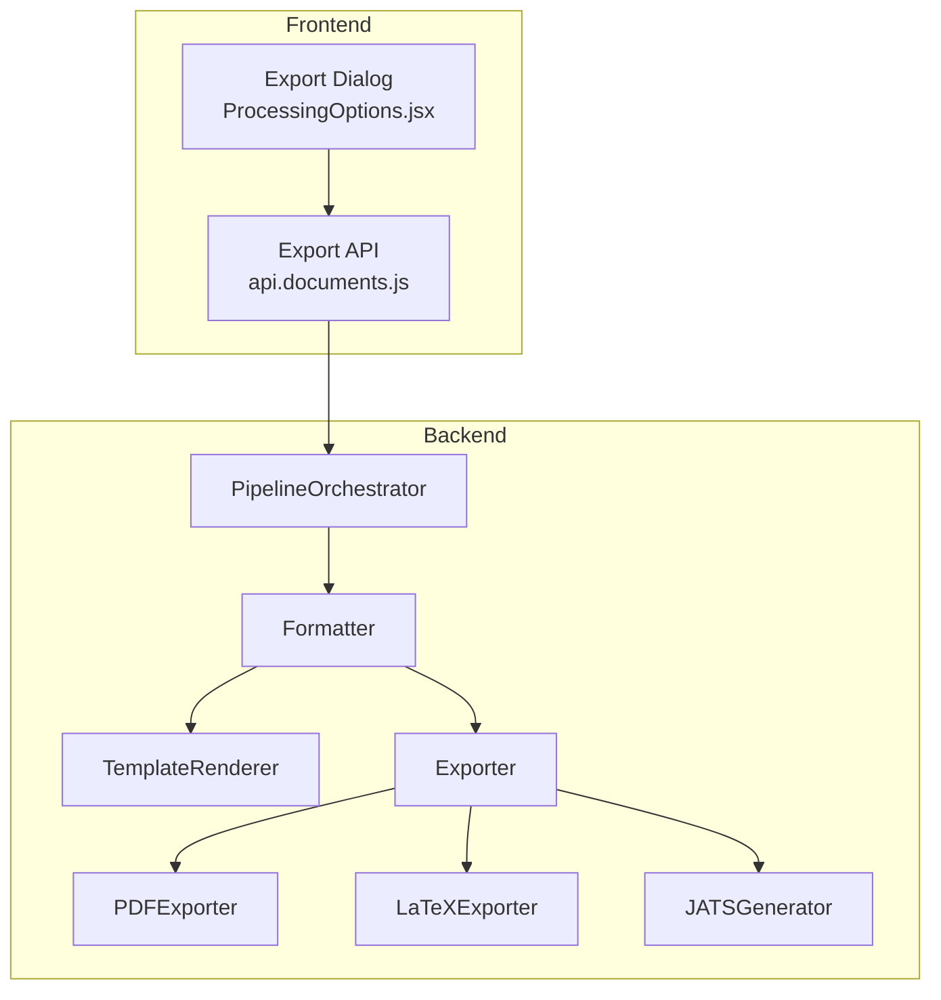
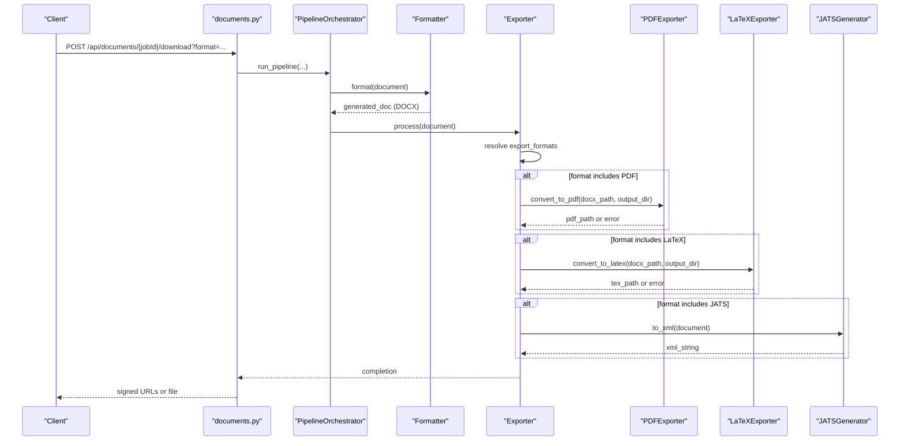
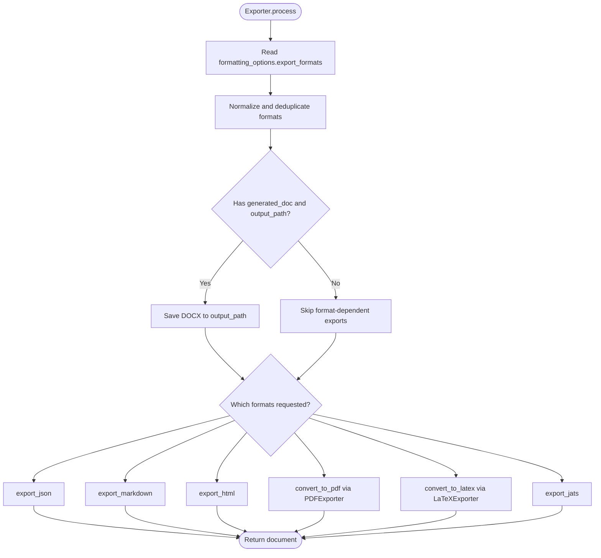
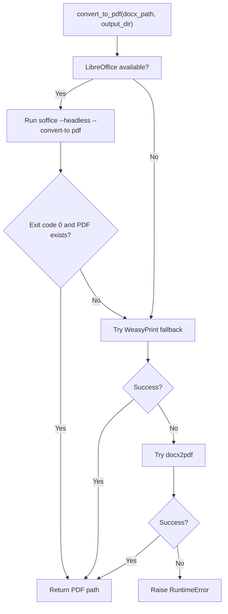
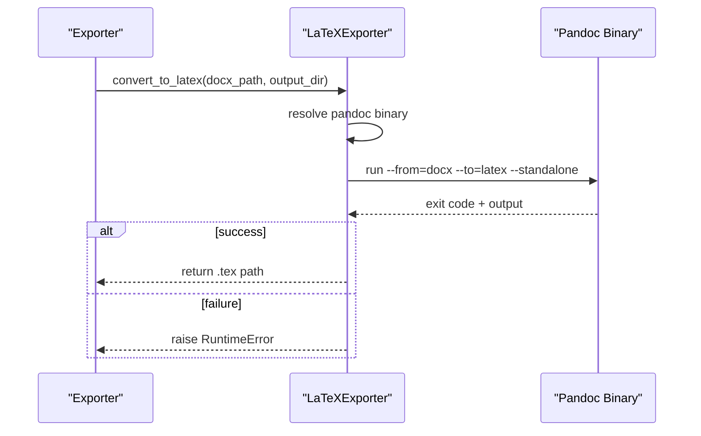
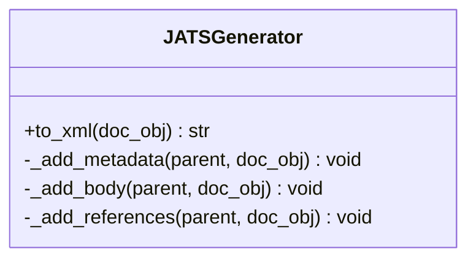
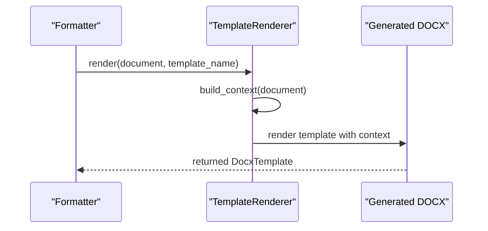
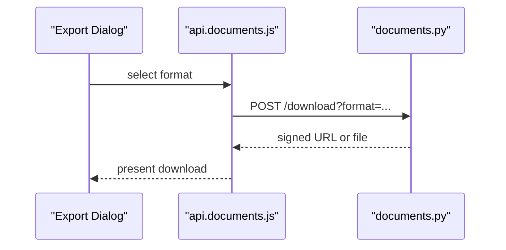
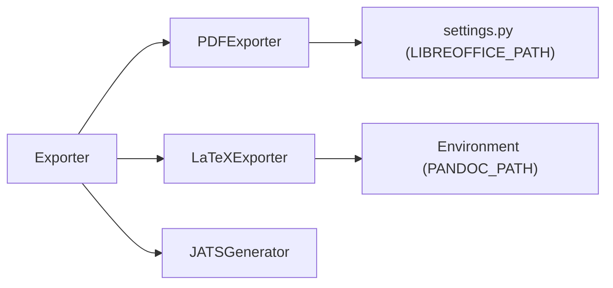

# Export System

<cite>
**Referenced Files in This Document**
- [exporter.py](file://backend/app/pipeline/export/exporter.py)
- [pdf_exporter.py](file://backend/app/pipeline/export/pdf_exporter.py)
- [latex_exporter.py](file://backend/app/pipeline/export/latex_exporter.py)
- [jats_generator.py](file://backend/app/pipeline/export/jats_generator.py)
- [formatter.py](file://backend/app/pipeline/formatting/formatter.py)
- [template_renderer.py](file://backend/app/pipeline/formatting/template_renderer.py)
- [orchestrator.py](file://backend/app/pipeline/orchestrator.py)
- [settings.py](file://backend/app/config/settings.py)
- [documents.py](file://backend/app/routers/documents.py)
- [ProcessingOptions.jsx](file://frontend/src/components/ProcessingOptions.jsx)
- [api.documents.js](file://frontend/src/services/api.documents.js)
- [test_export_pipeline.py](file://backend/tests/test_export_pipeline.py)
- [test_jats_export.py](file://backend/tests/test_jats_export.py)
</cite>

## Table of Contents
1. [Introduction](#introduction)
2. [Project Structure](#project-structure)
3. [Core Components](#core-components)
4. [Architecture Overview](#architecture-overview)
5. [Detailed Component Analysis](#detailed-component-analysis)
6. [Dependency Analysis](#dependency-analysis)
7. [Performance Considerations](#performance-considerations)
8. [Troubleshooting Guide](#troubleshooting-guide)
9. [Conclusion](#conclusion)
10. [Appendices](#appendices)

## Introduction
This document describes the export system that transforms formatted academic manuscripts into multiple output formats. It covers multi-format export capabilities (DOCX, PDF, LaTeX, JATS XML, and others), the export pipeline, format-specific processing, quality assurance, integration with external services, template-based exports, and batch processing. It also documents configuration options, validation, troubleshooting, customization, and performance optimization techniques.

## Project Structure
The export system spans backend pipeline modules and frontend integration:
- Backend pipeline stages produce a DOCX document, then export to secondary formats.
- External tools are invoked for PDF and LaTeX conversions.
- JATS XML is generated programmatically from the pipeline document model.
- Frontend exposes export format selection and integrates with backend endpoints.

**Diagram sources**
- [ProcessingOptions.jsx:1-39](file://frontend/src/components/ProcessingOptions.jsx#L1-L39)
- [api.documents.js:13-13](file://frontend/src/services/api.documents.js#L13-L13)
- [orchestrator.py:504-520](file://backend/app/pipeline/orchestrator.py#L504-L520)
- [formatter.py:49-58](file://backend/app/pipeline/formatting/formatter.py#L49-L58)
- [template_renderer.py:65-82](file://backend/app/pipeline/formatting/template_renderer.py#L65-L82)
- [exporter.py:30-66](file://backend/app/pipeline/export/exporter.py#L30-L66)
- [pdf_exporter.py:74-131](file://backend/app/pipeline/export/pdf_exporter.py#L74-L131)
- [latex_exporter.py:26-77](file://backend/app/pipeline/export/latex_exporter.py#L26-L77)
- [jats_generator.py:20-43](file://backend/app/pipeline/export/jats_generator.py#L20-L43)

**Section sources**
- [exporter.py:19-66](file://backend/app/pipeline/export/exporter.py#L19-L66)
- [pdf_exporter.py:12-35](file://backend/app/pipeline/export/pdf_exporter.py#L12-L35)
- [latex_exporter.py:13-25](file://backend/app/pipeline/export/latex_exporter.py#L13-L25)
- [jats_generator.py:8-24](file://backend/app/pipeline/export/jats_generator.py#L8-L24)
- [ProcessingOptions.jsx:1-39](file://frontend/src/components/ProcessingOptions.jsx#L1-L39)
- [api.documents.js:13-13](file://frontend/src/services/api.documents.js#L13-L13)

## Core Components
- Exporter: Central coordinator that decides which formats to generate based on formatting options and orchestrates per-format exporters.
- PDFExporter: Converts DOCX to PDF using LibreOffice, with WeasyPrint and docx2pdf as fallbacks.
- LaTeXExporter: Converts DOCX to LaTeX via Pandoc with environment configuration and timeouts.
- JATSGenerator: Produces JATS XML from the pipeline document model, including metadata, sections, and references.
- Formatter and TemplateRenderer: Produce the initial DOCX artifact using templates and context.
- PipelineOrchestrator: Executes the pipeline and invokes the Exporter stage.
- Frontend Export UI and API: Allows selecting export formats and invoking backend endpoints.

**Section sources**
- [exporter.py:19-282](file://backend/app/pipeline/export/exporter.py#L19-L282)
- [pdf_exporter.py:12-131](file://backend/app/pipeline/export/pdf_exporter.py#L12-L131)
- [latex_exporter.py:13-77](file://backend/app/pipeline/export/latex_exporter.py#L13-L77)
- [jats_generator.py:8-157](file://backend/app/pipeline/export/jats_generator.py#L8-L157)
- [formatter.py:35-58](file://backend/app/pipeline/formatting/formatter.py#L35-L58)
- [template_renderer.py:29-82](file://backend/app/pipeline/formatting/template_renderer.py#L29-L82)
- [orchestrator.py:504-520](file://backend/app/pipeline/orchestrator.py#L504-L520)

## Architecture Overview
The export pipeline begins after the document is formatted into a DOCX. The Exporter inspects formatting options to determine requested formats and performs conversions accordingly. PDF generation relies on external tools with layered fallbacks. LaTeX generation uses Pandoc. JATS XML is built programmatically from the document model.

**Diagram sources**
- [documents.py:67-67](file://backend/app/routers/documents.py#L67-L67)
- [orchestrator.py:504-520](file://backend/app/pipeline/orchestrator.py#L504-L520)
- [formatter.py:49-58](file://backend/app/pipeline/formatting/formatter.py#L49-L58)
- [exporter.py:30-66](file://backend/app/pipeline/export/exporter.py#L30-L66)
- [pdf_exporter.py:74-131](file://backend/app/pipeline/export/pdf_exporter.py#L74-L131)
- [latex_exporter.py:26-77](file://backend/app/pipeline/export/latex_exporter.py#L26-L77)
- [jats_generator.py:20-43](file://backend/app/pipeline/export/jats_generator.py#L20-L43)

## Detailed Component Analysis

### Exporter: Multi-format Coordinator
Responsibilities:
- Reads export formats from formatting options.
- Saves the primary DOCX output.
- Generates JSON, Markdown, HTML, PDF, LaTeX, and JATS based on request.
- Handles errors per format without failing the whole pipeline.

Key behaviors:
- Default export formats include DOCX, JSON, and Markdown.
- PDF requires a prior DOCX save and uses PDFExporter.
- LaTeX conversion uses LaTeXExporter with DOCX as input.
- JATS is generated independently and placed alongside the DOCX.

**Diagram sources**
- [exporter.py:30-66](file://backend/app/pipeline/export/exporter.py#L30-L66)
- [exporter.py:173-194](file://backend/app/pipeline/export/exporter.py#L173-L194)

**Section sources**
- [exporter.py:19-282](file://backend/app/pipeline/export/exporter.py#L19-L282)

### PDF Export: LibreOffice, WeasyPrint, docx2pdf Chain
- Uses LibreOffice headless conversion by default.
- Falls back to WeasyPrint (lightweight HTML conversion) if LibreOffice is not found or fails.
- Final fallback uses docx2pdf.
- Enforces a timeout and raises a clear error if all engines fail.

**Diagram sources**
- [pdf_exporter.py:74-131](file://backend/app/pipeline/export/pdf_exporter.py#L74-L131)

**Section sources**
- [pdf_exporter.py:12-131](file://backend/app/pipeline/export/pdf_exporter.py#L12-L131)
- [settings.py:125-127](file://backend/app/config/settings.py#L125-L127)

### LaTeX Export: Pandoc Integration
- Resolves Pandoc binary from environment or PATH.
- Executes Pandoc with docx input and LaTeX output.
- Applies a configurable timeout and validates output presence.
- Logs detailed diagnostics on failure.

**Diagram sources**
- [latex_exporter.py:26-77](file://backend/app/pipeline/export/latex_exporter.py#L26-L77)

**Section sources**
- [latex_exporter.py:13-77](file://backend/app/pipeline/export/latex_exporter.py#L13-L77)

### JATS XML Generation: Structured Academic Metadata
- Builds an article with front matter (metadata), body (sections), and back matter (references).
- Ensures DOCTYPE declaration and namespace mapping.
- Adds authors, publication date, volume/issue, abstract, and reference list with DOI support when available.

**Diagram sources**
- [jats_generator.py:8-157](file://backend/app/pipeline/export/jats_generator.py#L8-L157)

**Section sources**
- [jats_generator.py:8-157](file://backend/app/pipeline/export/jats_generator.py#L8-L157)

### Template-Based DOCX Export
- Formatter selects a template and renders a DOCX using TemplateRenderer.
- Supports Jinja2-style docxtpl templates and a fallback mechanism.
- Builds a context from document metadata, sections, and references.

**Diagram sources**
- [formatter.py:49-58](file://backend/app/pipeline/formatting/formatter.py#L49-L58)
- [template_renderer.py:65-82](file://backend/app/pipeline/formatting/template_renderer.py#L65-L82)

**Section sources**
- [formatter.py:35-130](file://backend/app/pipeline/formatting/formatter.py#L35-L130)
- [template_renderer.py:29-331](file://backend/app/pipeline/formatting/template_renderer.py#L29-L331)

### Frontend Export Integration
- Export dialog allows selecting formats (DOCX, PDF, LaTeX).
- API service defines supported formats and debounces requests.
- Backend routes restrict supported export formats and enforce readiness.

**Diagram sources**
- [ProcessingOptions.jsx:1-39](file://frontend/src/components/ProcessingOptions.jsx#L1-L39)
- [api.documents.js:13-13](file://frontend/src/services/api.documents.js#L13-L13)
- [documents.py:67-67](file://backend/app/routers/documents.py#L67-L67)

**Section sources**
- [ProcessingOptions.jsx:1-39](file://frontend/src/components/ProcessingOptions.jsx#L1-L39)
- [api.documents.js:13-13](file://frontend/src/services/api.documents.js#L13-L13)
- [documents.py:67-67](file://backend/app/routers/documents.py#L67-L67)

## Dependency Analysis
- Exporter depends on PDFExporter, LaTeXExporter, and JATSGenerator.
- PDFExporter depends on LibreOffice availability and settings.
- LaTeXExporter depends on Pandoc availability and environment configuration.
- JATSGenerator depends on the pipeline document model and lxml.
- Frontend export formats are constrained by backend routes and API definitions.

**Diagram sources**
- [exporter.py:26-28](file://backend/app/pipeline/export/exporter.py#L26-L28)
- [pdf_exporter.py:17-18](file://backend/app/pipeline/export/pdf_exporter.py#L17-L18)
- [latex_exporter.py:20-24](file://backend/app/pipeline/export/latex_exporter.py#L20-L24)
- [settings.py:125-127](file://backend/app/config/settings.py#L125-L127)

**Section sources**
- [exporter.py:19-28](file://backend/app/pipeline/export/exporter.py#L19-L28)
- [pdf_exporter.py:12-35](file://backend/app/pipeline/export/pdf_exporter.py#L12-L35)
- [latex_exporter.py:13-25](file://backend/app/pipeline/export/latex_exporter.py#L13-L25)
- [settings.py:125-127](file://backend/app/config/settings.py#L125-L127)

## Performance Considerations
- PDF conversion can be slow; ensure LibreOffice is installed and available to avoid fallbacks.
- LaTeX conversion uses Pandoc; configure PANDOC_PATH if needed and monitor timeouts.
- Exporter warnings are logged per format to avoid cascading failures.
- Frontend debouncing reduces redundant requests during rapid format changes.
- Pipeline concurrency is limited to prevent resource exhaustion.

[No sources needed since this section provides general guidance]

## Troubleshooting Guide
Common issues and resolutions:
- PDF export fails:
  - Verify LibreOffice installation and path resolution.
  - Confirm the DOCX file exists before PDF conversion.
  - Review fallback chain and logs for specific errors.
- LaTeX export fails:
  - Ensure Pandoc is installed and accessible via PATH or PANDOC_PATH.
  - Check timeout settings and logs for detailed diagnostics.
- JATS export anomalies:
  - Confirm document metadata and references are populated.
  - Validate that lxml is available for XML generation.
- Frontend format mismatch:
  - Supported formats are defined in frontend and backend; align selections accordingly.

Validation and tests:
- Unit tests verify PDF exporter command construction and JATS metadata inclusion.
- Tests mock external binaries to isolate logic.

**Section sources**
- [pdf_exporter.py:74-131](file://backend/app/pipeline/export/pdf_exporter.py#L74-L131)
- [latex_exporter.py:26-77](file://backend/app/pipeline/export/latex_exporter.py#L26-L77)
- [jats_generator.py:20-43](file://backend/app/pipeline/export/jats_generator.py#L20-L43)
- [test_export_pipeline.py:31-85](file://backend/tests/test_export_pipeline.py#L31-L85)
- [test_jats_export.py:39-72](file://backend/tests/test_jats_export.py#L39-L72)

## Conclusion
The export system provides robust multi-format output with layered fallbacks for PDF and LaTeX, programmatic JATS generation, and template-driven DOCX creation. It integrates cleanly with the pipeline and frontend, supports configuration via environment variables, and includes quality checks and error handling to maintain reliability.

[No sources needed since this section summarizes without analyzing specific files]

## Appendices

### Supported Export Formats
- DOCX: Primary output from template rendering.
- PDF: Converted from DOCX using LibreOffice, WeasyPrint, or docx2pdf.
- LaTeX: Converted from DOCX using Pandoc.
- JATS XML: Generated from document metadata and content.
- JSON: Serialized document payload with metadata and content.
- Markdown: Human-readable export of metadata and content.
- HTML: Lightweight HTML export derived from Markdown.

**Section sources**
- [exporter.py:23-24](file://backend/app/pipeline/export/exporter.py#L23-L24)
- [exporter.py:173-194](file://backend/app/pipeline/export/exporter.py#L173-L194)
- [documents.py:67-67](file://backend/app/routers/documents.py#L67-L67)
- [ProcessingOptions.jsx:1-5](file://frontend/src/components/ProcessingOptions.jsx#L1-L5)

### Export Configuration Options
- Export formats: formatting_options.export_formats (defaults to DOCX, JSON, Markdown).
- Template engine mode: formatting_options.template_engine (auto vs legacy).
- Template selection: document.template.template_name.
- External tool paths:
  - LIBREOFFICE_PATH (PDF conversion).
  - PANDOC_PATH (LaTeX conversion).

**Section sources**
- [exporter.py:173-194](file://backend/app/pipeline/export/exporter.py#L173-L194)
- [formatter.py:98-105](file://backend/app/pipeline/formatting/formatter.py#L98-L105)
- [settings.py:125-127](file://backend/app/config/settings.py#L125-L127)
- [latex_exporter.py:20-24](file://backend/app/pipeline/export/latex_exporter.py#L20-L24)

### Quality Assurance Measures
- Exporter logs warnings per format to isolate failures.
- PDFExporter and LaTeXExporter raise explicit errors with diagnostics.
- JATSGenerator validates metadata and gracefully handles missing fields.
- Frontend and backend define supported formats to prevent invalid requests.

**Section sources**
- [exporter.py:51-52](file://backend/app/pipeline/export/exporter.py#L51-L52)
- [pdf_exporter.py:108-110](file://backend/app/pipeline/export/pdf_exporter.py#L108-L110)
- [latex_exporter.py:60-70](file://backend/app/pipeline/export/latex_exporter.py#L60-L70)
- [jats_generator.py:78-82](file://backend/app/pipeline/export/jats_generator.py#L78-L82)

### Batch Processing Capabilities
- The pipeline supports batch uploads and maintains per-job status.
- Export endpoints are designed around job IDs and readiness checks.
- Frontend supports batch upload panels and export dialogs.

**Section sources**
- [documents.py:67-67](file://backend/app/routers/documents.py#L67-L67)
- [ProcessingOptions.jsx:1-39](file://frontend/src/components/ProcessingOptions.jsx#L1-L39)