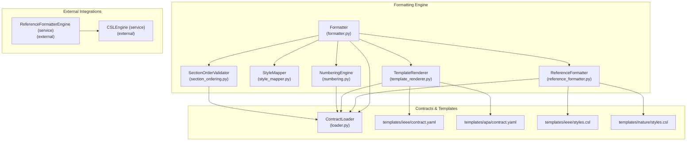
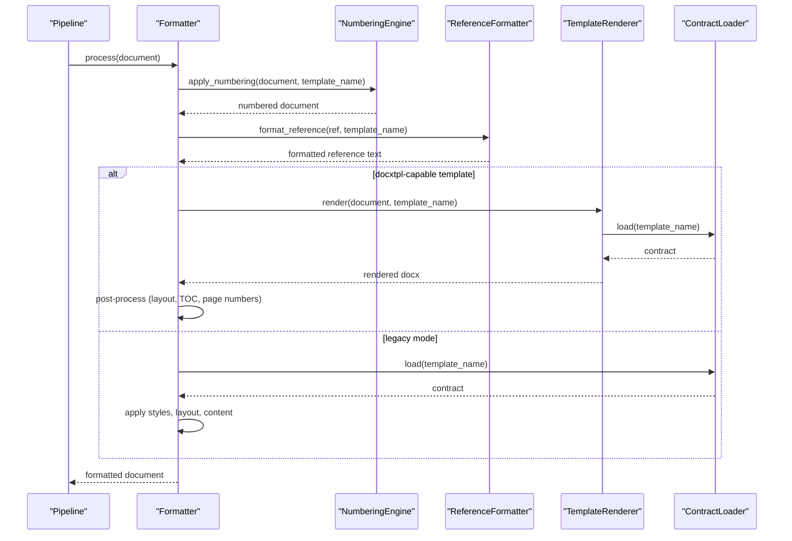
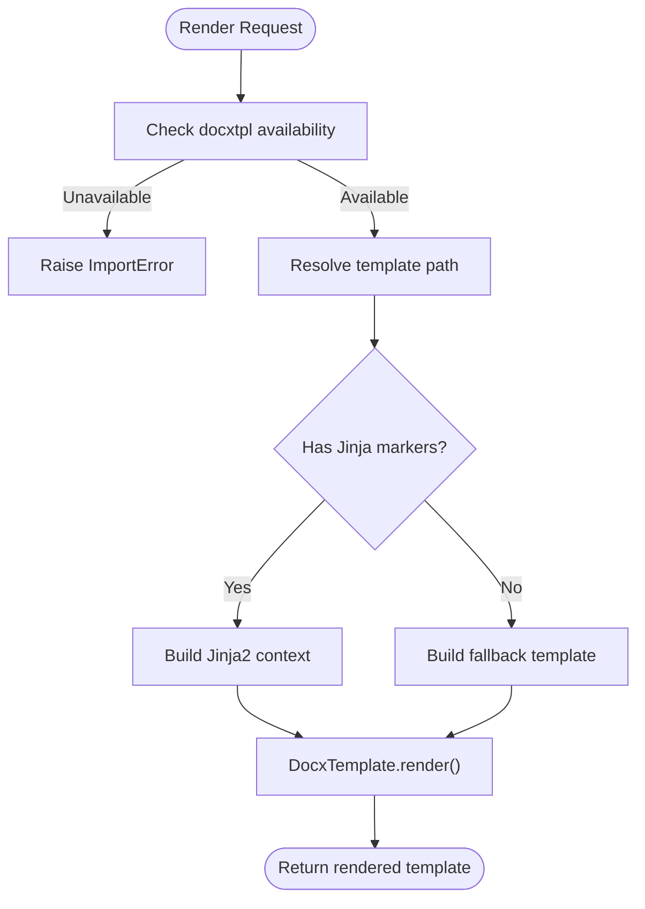
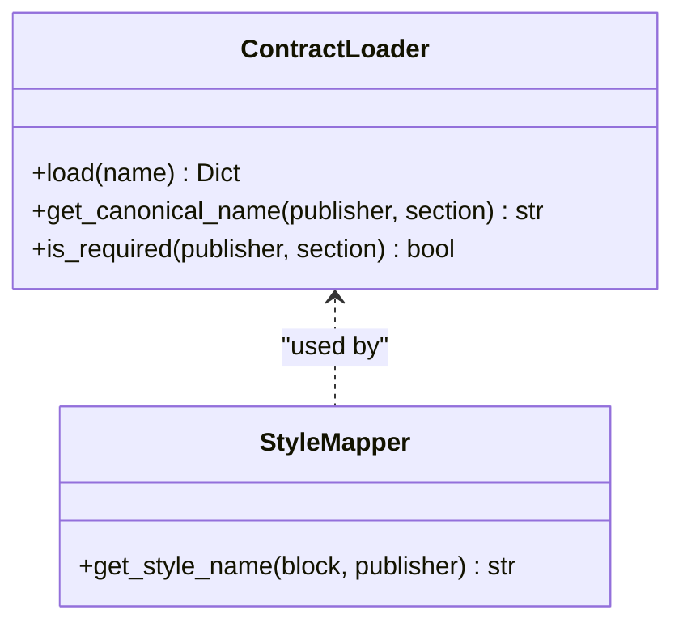
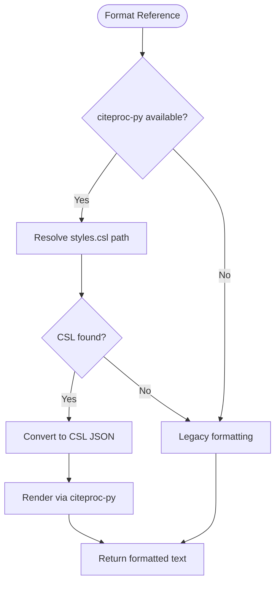
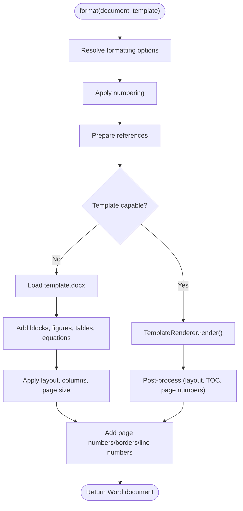
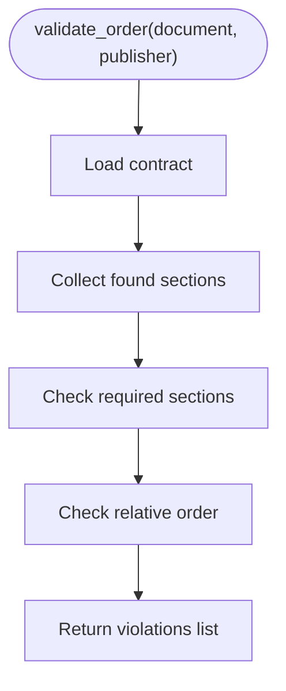
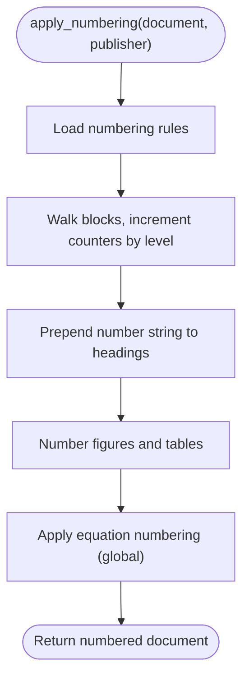
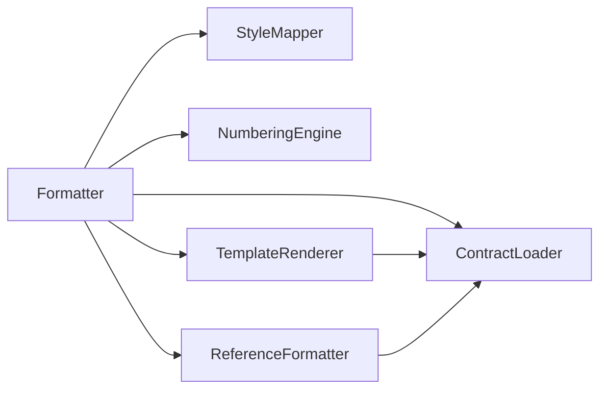

# Formatting Engine

<cite>
**Referenced Files in This Document**
- [formatter.py](file://backend/app/pipeline/formatting/formatter.py)
- [template_renderer.py](file://backend/app/pipeline/formatting/template_renderer.py)
- [style_mapper.py](file://backend/app/pipeline/formatting/style_mapper.py)
- [reference_formatter.py](file://backend/app/pipeline/formatting/reference_formatter.py)
- [numbering.py](file://backend/app/pipeline/formatting/numbering.py)
- [section_ordering.py](file://backend/app/pipeline/formatting/section_ordering.py)
- [loader.py](file://backend/app/pipeline/contracts/loader.py)
- [contract.yaml (IEEE)](file://backend/app/templates/ieee/contract.yaml)
- [contract.yaml (APA)](file://backend/app/templates/apa/contract.yaml)
- [styles.csl (IEEE)](file://backend/app/templates/ieee/styles.csl)
- [styles.csl (Nature)](file://backend/app/templates/nature/styles.csl)
- [test_csl_formatting.py](file://backend/tests/integration/test_csl_formatting.py)
- [test_template_integration.py](file://backend/tests/integration/test_template_integration.py)
- [06_formatted.py](file://backend/manual_tests/visual/phase3/06_formatted.py)
</cite>

## Table of Contents
1. [Introduction](#introduction)
2. [Project Structure](#project-structure)
3. [Core Components](#core-components)
4. [Architecture Overview](#architecture-overview)
5. [Detailed Component Analysis](#detailed-component-analysis)
6. [Dependency Analysis](#dependency-analysis)
7. [Performance Considerations](#performance-considerations)
8. [Troubleshooting Guide](#troubleshooting-guide)
9. [Conclusion](#conclusion)
10. [Appendices](#appendices)

## Introduction
This document explains the formatting engine responsible for transforming structured academic manuscripts into polished Word documents. It covers the template-based rendering system, style mapping, academic format compliance via publisher contracts and CSL, dynamic formatting rules, section ordering and numbering, and integration with publisher-specific templates. It also provides examples of supported formats, customization guidance, and troubleshooting tips.

## Project Structure
The formatting engine resides under backend/app/pipeline/formatting and integrates with:
- Contracts and templates under backend/app/pipeline/contracts and backend/app/templates
- Services for CSL and reference formatting under backend/app/pipeline/services and backend/app/pipeline/references
- Tests and manual verification under backend/tests and backend/manual_tests

**Diagram sources**
- [formatter.py:35-290](file://backend/app/pipeline/formatting/formatter.py#L35-L290)
- [template_renderer.py:29-160](file://backend/app/pipeline/formatting/template_renderer.py#L29-L160)
- [style_mapper.py:5-28](file://backend/app/pipeline/formatting/style_mapper.py#L5-L28)
- [reference_formatter.py:153-207](file://backend/app/pipeline/formatting/reference_formatter.py#L153-L207)
- [numbering.py:5-65](file://backend/app/pipeline/formatting/numbering.py#L5-L65)
- [section_ordering.py:5-43](file://backend/app/pipeline/formatting/section_ordering.py#L5-L43)
- [loader.py:8-82](file://backend/app/pipeline/contracts/loader.py#L8-L82)
- [contract.yaml (IEEE):1-50](file://backend/app/templates/ieee/contract.yaml#L1-L50)
- [contract.yaml (APA):1-45](file://backend/app/templates/apa/contract.yaml#L1-L45)
- [styles.csl (IEEE):1-66](file://backend/app/templates/ieee/styles.csl#L1-L66)
- [styles.csl (Nature):1-56](file://backend/app/templates/nature/styles.csl#L1-L56)

**Section sources**
- [formatter.py:35-290](file://backend/app/pipeline/formatting/formatter.py#L35-L290)
- [template_renderer.py:29-160](file://backend/app/pipeline/formatting/template_renderer.py#L29-L160)
- [loader.py:8-82](file://backend/app/pipeline/contracts/loader.py#L8-L82)

## Core Components
- Formatter: Orchestrates rendering, numbering, references, and post-processing. Supports both docxtpl/Jinja2 templates and a legacy python-docx path.
- TemplateRenderer: Builds Jinja2 context from the pipeline document and renders docxtpl templates, with fallbacks and marker detection.
- StyleMapper: Maps semantic block types to Word styles using contract-driven mappings.
- ReferenceFormatter: Formats references using citeproc-py with CSL styles, with a legacy fallback.
- NumberingEngine: Applies sequential numbering for headings, figures, tables, and equations per contract rules.
- SectionOrderValidator: Validates section order and presence against contract expectations.
- ContractLoader: Loads and caches publisher contracts (including layout, styles, numbering, sections).

**Section sources**
- [formatter.py:35-290](file://backend/app/pipeline/formatting/formatter.py#L35-L290)
- [template_renderer.py:29-160](file://backend/app/pipeline/formatting/template_renderer.py#L29-L160)
- [style_mapper.py:5-28](file://backend/app/pipeline/formatting/style_mapper.py#L5-L28)
- [reference_formatter.py:153-207](file://backend/app/pipeline/formatting/reference_formatter.py#L153-L207)
- [numbering.py:5-65](file://backend/app/pipeline/formatting/numbering.py#L5-L65)
- [section_ordering.py:5-43](file://backend/app/pipeline/formatting/section_ordering.py#L5-L43)
- [loader.py:8-82](file://backend/app/pipeline/contracts/loader.py#L8-L82)

## Architecture Overview
The formatting engine applies contract-driven rules to transform a structured document into a styled Word document. It supports two rendering modes:
- Docxtpl/Jinja2 mode: Uses templates with Jinja2 tags and a rich context built from the pipeline document.
- Legacy mode: Uses python-docx to programmatically apply styles, layouts, and content.

**Diagram sources**
- [formatter.py:49-290](file://backend/app/pipeline/formatting/formatter.py#L49-L290)
- [template_renderer.py:65-160](file://backend/app/pipeline/formatting/template_renderer.py#L65-L160)
- [loader.py:16-38](file://backend/app/pipeline/contracts/loader.py#L16-L38)

## Detailed Component Analysis

### Template Rendering Engine
The TemplateRenderer builds a Jinja2 context from the pipeline document and renders docxtpl templates. It:
- Detects renderable templates by scanning for Jinja markers in the template DOCX or by locating a template.jinja2 source.
- Builds a context containing title, authors, affiliations, abstract, keywords, sections, and references.
- Provides boolean toggles for cover_page, toc, and page_numbers.
- Generates a fallback template if needed.

**Diagram sources**
- [template_renderer.py:65-160](file://backend/app/pipeline/formatting/template_renderer.py#L65-L160)
- [template_renderer.py:200-230](file://backend/app/pipeline/formatting/template_renderer.py#L200-L230)

**Section sources**
- [template_renderer.py:29-160](file://backend/app/pipeline/formatting/template_renderer.py#L29-L160)
- [template_renderer.py:200-230](file://backend/app/pipeline/formatting/template_renderer.py#L200-L230)

### Style Mapping and Academic Compliance
StyleMapper maps semantic block types to Word styles using the contract’s styles mapping. Contracts define:
- Styles for titles, headings, abstract, body, lists, references, and captions.
- Layout defaults (margins, columns, page size, line spacing).
- Section-specific overrides and spacing rules.

**Diagram sources**
- [style_mapper.py:13-28](file://backend/app/pipeline/formatting/style_mapper.py#L13-L28)
- [loader.py:16-38](file://backend/app/pipeline/contracts/loader.py#L16-L38)

**Section sources**
- [style_mapper.py:5-28](file://backend/app/pipeline/formatting/style_mapper.py#L5-L28)
- [loader.py:8-82](file://backend/app/pipeline/contracts/loader.py#L8-L82)
- [contract.yaml (IEEE):25-50](file://backend/app/templates/ieee/contract.yaml#L25-L50)
- [contract.yaml (APA):25-45](file://backend/app/templates/apa/contract.yaml#L25-L45)

### CSL Integration and Reference Formatting
ReferenceFormatter supports:
- Primary: citeproc-py with CSL styles from templates/<publisher>/styles.csl.
- Fallback: legacy formatting based on contract rules.

It converts references to CSL-JSON and renders them using the appropriate style. If citeproc is unavailable or no CSL is present, it falls back to contract-defined rules.

**Diagram sources**
- [reference_formatter.py:170-207](file://backend/app/pipeline/formatting/reference_formatter.py#L170-L207)
- [reference_formatter.py:211-245](file://backend/app/pipeline/formatting/reference_formatter.py#L211-L245)
- [reference_formatter.py:264-288](file://backend/app/pipeline/formatting/reference_formatter.py#L264-L288)

**Section sources**
- [reference_formatter.py:153-207](file://backend/app/pipeline/formatting/reference_formatter.py#L153-L207)
- [styles.csl (IEEE):1-66](file://backend/app/templates/ieee/styles.csl#L1-L66)
- [styles.csl (Nature):1-56](file://backend/app/templates/nature/styles.csl#L1-L56)

### Dynamic Formatting Rules and Layout
The Formatter applies:
- Initial layout and page size from contracts.
- Column changes per section based on overrides.
- Global line spacing, page numbers, borders, and line numbers from options.
- Post-processing for docxtpl output (cover page, TOC, placeholders).

**Diagram sources**
- [formatter.py:49-290](file://backend/app/pipeline/formatting/formatter.py#L49-L290)

**Section sources**
- [formatter.py:60-290](file://backend/app/pipeline/formatting/formatter.py#L60-L290)

### Section Ordering and Required Sections
SectionOrderValidator compares the actual section sequence with contract expectations and reports violations for missing required sections or out-of-order sections.

**Diagram sources**
- [section_ordering.py:12-43](file://backend/app/pipeline/formatting/section_ordering.py#L12-L43)

**Section sources**
- [section_ordering.py:5-43](file://backend/app/pipeline/formatting/section_ordering.py#L5-L43)

### Numbering Systems
NumberingEngine enforces:
- Hierarchical heading numbering (e.g., 1, 1.1, 1.2, 1.2.1).
- Sequential figure and table numbering.
- Equation numbering with configurable bracket style.

**Diagram sources**
- [numbering.py:13-65](file://backend/app/pipeline/formatting/numbering.py#L13-L65)

**Section sources**
- [numbering.py:5-65](file://backend/app/pipeline/formatting/numbering.py#L5-L65)

## Dependency Analysis
- Formatter depends on ContractLoader, StyleMapper, NumberingEngine, ReferenceFormatter, TemplateRenderer, and TableRenderer.
- TemplateRenderer depends on ContractLoader and docxtpl availability.
- ReferenceFormatter depends on ContractLoader and optional citeproc-py.
- Contracts define the behavior for each publisher and are consumed by multiple components.

**Diagram sources**
- [formatter.py:35-47](file://backend/app/pipeline/formatting/formatter.py#L35-L47)
- [template_renderer.py:26-36](file://backend/app/pipeline/formatting/template_renderer.py#L26-L36)
- [reference_formatter.py:15-16](file://backend/app/pipeline/formatting/reference_formatter.py#L15-L16)

**Section sources**
- [formatter.py:35-47](file://backend/app/pipeline/formatting/formatter.py#L35-L47)
- [template_renderer.py:26-36](file://backend/app/pipeline/formatting/template_renderer.py#L26-L36)
- [reference_formatter.py:15-16](file://backend/app/pipeline/formatting/reference_formatter.py#L15-L16)

## Performance Considerations
- Template marker detection caches results to avoid repeated ZIP scans.
- Contract loading is cached by name to reduce YAML reads.
- citeproc-py styles are cached to avoid re-parsing CSL files.
- Sorting and insertion order minimize reflows during legacy rendering.

[No sources needed since this section provides general guidance]

## Troubleshooting Guide
Common issues and resolutions:
- Unresolved Jinja tags in output: Ensure the template has proper Jinja markers or enable fallback rendering. See integration tests validating no unresolved tokens remain.
- Missing cover page or TOC: Verify formatting options cover_page/toc/page_numbers and that the template supports these features.
- Incorrect page size or margins: Confirm contract layout.page_size and margins; options override contract values.
- Reference formatting not applying: Ensure styles.csl exists for the selected publisher or rely on legacy fallback.
- Section order warnings: Use SectionOrderValidator to identify missing or misordered sections.

**Section sources**
- [test_csl_formatting.py:91-152](file://backend/tests/integration/test_csl_formatting.py#L91-L152)
- [test_template_integration.py:15-130](file://backend/tests/integration/test_template_integration.py#L15-L130)
- [formatter.py:691-763](file://backend/app/pipeline/formatting/formatter.py#L691-L763)

## Conclusion
The formatting engine combines contract-driven rules, template rendering, and CSL-backed reference formatting to produce academically compliant Word documents. It supports multiple publishers, dynamic options, and robust fallbacks, enabling reliable formatting across diverse publishing requirements.

[No sources needed since this section summarizes without analyzing specific files]

## Appendices

### Supported Formats and Examples
- IEEE: Numeric style with two-column layout and specific margins.
- APA: Single-column, line spacing 2.0, letter page size.
- Nature: Numeric style with minimal author formatting and citation-number prefixes.

Examples of contracts and styles:
- [contract.yaml (IEEE):1-50](file://backend/app/templates/ieee/contract.yaml#L1-L50)
- [contract.yaml (APA):1-45](file://backend/app/templates/apa/contract.yaml#L1-L45)
- [styles.csl (IEEE):1-66](file://backend/app/templates/ieee/styles.csl#L1-L66)
- [styles.csl (Nature):1-56](file://backend/app/templates/nature/styles.csl#L1-L56)

**Section sources**
- [contract.yaml (IEEE):1-50](file://backend/app/templates/ieee/contract.yaml#L1-L50)
- [contract.yaml (APA):1-45](file://backend/app/templates/apa/contract.yaml#L1-L45)
- [styles.csl (IEEE):1-66](file://backend/app/templates/ieee/styles.csl#L1-L66)
- [styles.csl (Nature):1-56](file://backend/app/templates/nature/styles.csl#L1-L56)

### Template Customization Checklist
- Place Jinja2 markers in template.docx or provide template.jinja2.
- Define styles mappings in contract.yaml for each semantic block type.
- Configure layout defaults (margins, columns, page size, line spacing).
- Provide styles.csl for CSL-based reference formatting.
- Validate rendering with integration tests.

**Section sources**
- [template_renderer.py:84-93](file://backend/app/pipeline/formatting/template_renderer.py#L84-L93)
- [contract.yaml (IEEE):2-24](file://backend/app/templates/ieee/contract.yaml#L2-L24)
- [contract.yaml (APA):2-24](file://backend/app/templates/apa/contract.yaml#L2-L24)

### Manual Verification Workflow
Use the visual test to run a full pipeline and inspect the final formatted document.

**Section sources**
- [06_formatted.py:40-140](file://backend/manual_tests/visual/phase3/06_formatted.py#L40-L140)