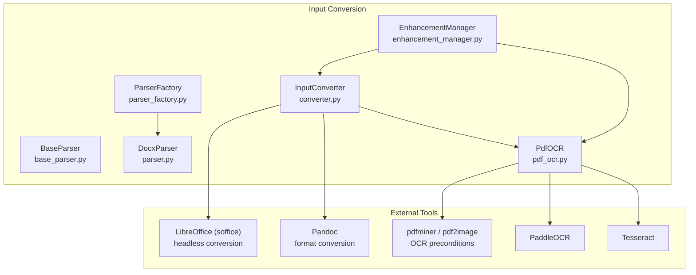
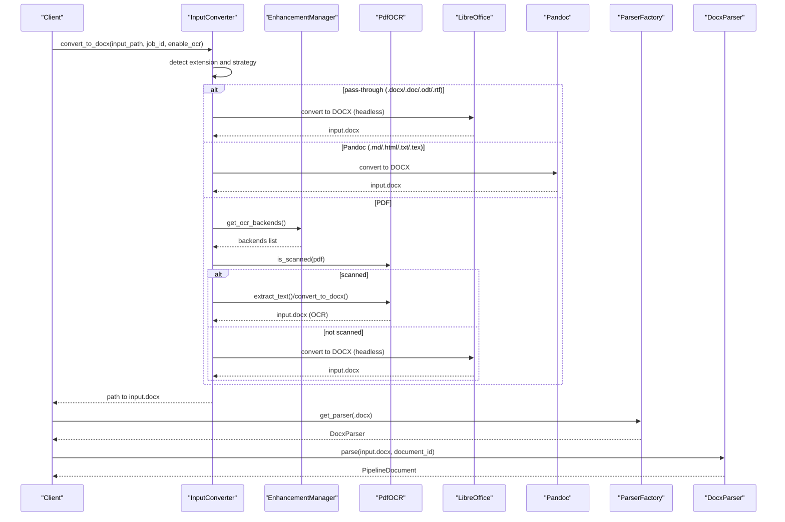
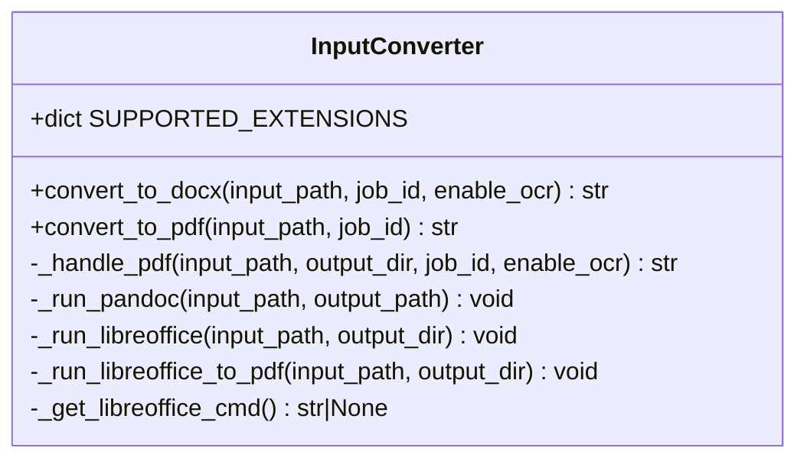
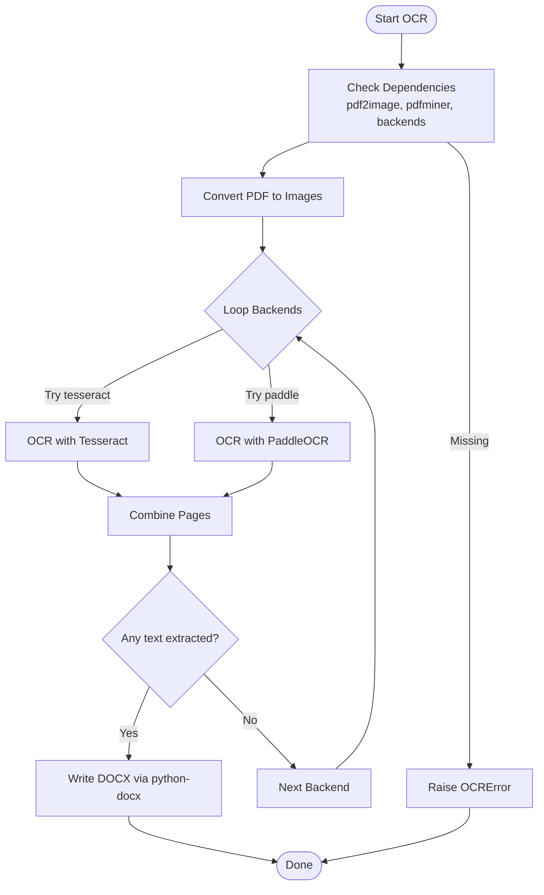
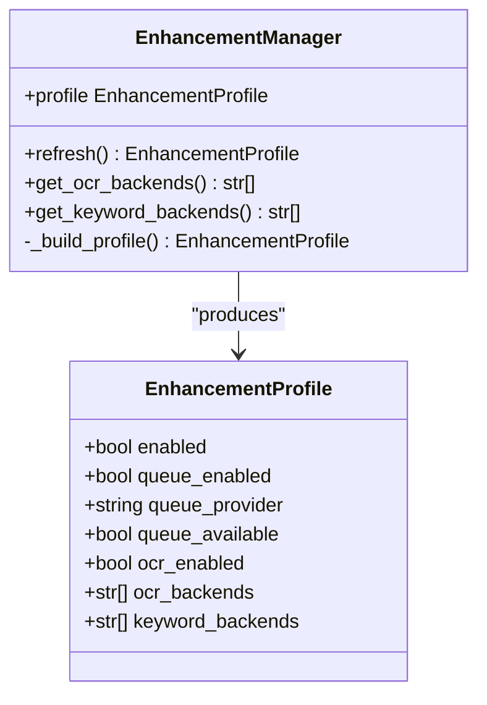
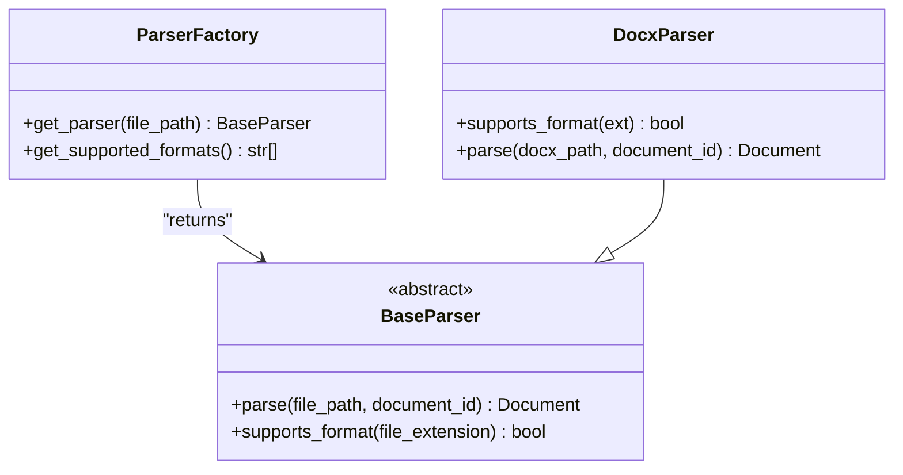
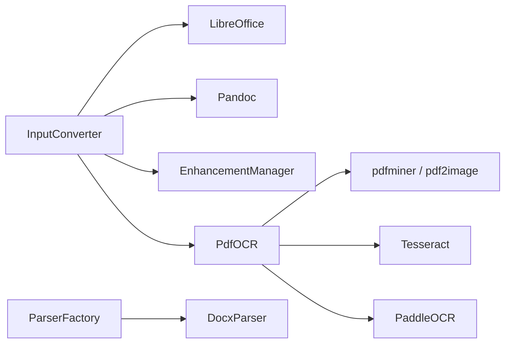

# Input Conversion

<cite>
**Referenced Files in This Document**
- [converter.py](file://backend/app/pipeline/input_conversion/converter.py)
- [pdf_ocr.py](file://backend/app/pipeline/ocr/pdf_ocr.py)
- [enhancement_manager.py](file://backend/app/services/enhancement_manager.py)
- [parser_factory.py](file://backend/app/pipeline/parsing/parser_factory.py)
- [parser.py](file://backend/app/pipeline/parsing/parser.py)
- [base_parser.py](file://backend/app/pipeline/parsing/base_parser.py)
- [README.md](file://backend/manual_tests/sample_inputs/README.md)
</cite>

## Table of Contents
1. [Introduction](#introduction)
2. [Project Structure](#project-structure)
3. [Core Components](#core-components)
4. [Architecture Overview](#architecture-overview)
5. [Detailed Component Analysis](#detailed-component-analysis)
6. [Dependency Analysis](#dependency-analysis)
7. [Performance Considerations](#performance-considerations)
8. [Troubleshooting Guide](#troubleshooting-guide)
9. [Conclusion](#conclusion)
10. [Appendices](#appendices)

## Introduction
This document explains the input conversion system that transforms multi-format documents (DOCX, PDF, TXT, MD, LaTeX, HTML, RTF, ODT, DOC) into a standardized internal DOCX representation for downstream processing. It covers:
- Supported input formats and detection logic
- Conversion strategies (pass-through, Pandoc, LibreOffice)
- PDF-specific scanning detection and OCR fallback
- Integration with external services and local processing libraries
- Error handling for corrupted files, unsupported formats, and conversion failures
- Practical workflows and troubleshooting guidance

## Project Structure
The input conversion system is centered around a dedicated converter and integrates with OCR, enhancement profiles, and the broader parsing pipeline.

**Diagram sources**
- [converter.py:19-294](file://backend/app/pipeline/input_conversion/converter.py#L19-L294)
- [pdf_ocr.py:57-231](file://backend/app/pipeline/ocr/pdf_ocr.py#L57-L231)
- [enhancement_manager.py:78-294](file://backend/app/services/enhancement_manager.py#L78-L294)
- [parser_factory.py:25-166](file://backend/app/pipeline/parsing/parser_factory.py#L25-L166)
- [parser.py:61-800](file://backend/app/pipeline/parsing/parser.py#L61-L800)
- [base_parser.py:12-45](file://backend/app/pipeline/parsing/base_parser.py#L12-L45)

**Section sources**
- [converter.py:19-294](file://backend/app/pipeline/input_conversion/converter.py#L19-L294)
- [pdf_ocr.py:57-231](file://backend/app/pipeline/ocr/pdf_ocr.py#L57-L231)
- [enhancement_manager.py:78-294](file://backend/app/services/enhancement_manager.py#L78-L294)
- [parser_factory.py:25-166](file://backend/app/pipeline/parsing/parser_factory.py#L25-L166)
- [parser.py:61-800](file://backend/app/pipeline/parsing/parser.py#L61-L800)
- [base_parser.py:12-45](file://backend/app/pipeline/parsing/base_parser.py#L12-L45)

## Core Components
- InputConverter: Central orchestrator for multi-format conversion to DOCX and PDF. Implements pass-through, Pandoc, and LibreOffice strategies, plus PDF OCR fallback.
- PdfOCR: Scanning detection and OCR extraction with backend fallback chain (Tesseract, PaddleOCR).
- EnhancementManager: Capability discovery and feature-flag resolution for OCR backends and queues.
- ParserFactory and DocxParser: Factory-driven parser selection and DOCX parsing into internal models.

**Section sources**
- [converter.py:19-294](file://backend/app/pipeline/input_conversion/converter.py#L19-L294)
- [pdf_ocr.py:57-231](file://backend/app/pipeline/ocr/pdf_ocr.py#L57-L231)
- [enhancement_manager.py:78-294](file://backend/app/services/enhancement_manager.py#L78-L294)
- [parser_factory.py:25-166](file://backend/app/pipeline/parsing/parser_factory.py#L25-L166)
- [parser.py:61-800](file://backend/app/pipeline/parsing/parser.py#L61-L800)
- [base_parser.py:12-45](file://backend/app/pipeline/parsing/base_parser.py#L12-L45)

## Architecture Overview
End-to-end conversion pipeline from input formats to internal document representation.

**Diagram sources**
- [converter.py:40-165](file://backend/app/pipeline/input_conversion/converter.py#L40-L165)
- [enhancement_manager.py:103-104](file://backend/app/services/enhancement_manager.py#L103-L104)
- [pdf_ocr.py:66-148](file://backend/app/pipeline/ocr/pdf_ocr.py#L66-L148)
- [parser_factory.py:95-140](file://backend/app/pipeline/parsing/parser_factory.py#L95-L140)
- [parser.py:82-164](file://backend/app/pipeline/parsing/parser.py#L82-L164)

## Detailed Component Analysis

### InputConverter
Responsibilities:
- Detect input format and select conversion strategy
- Convert to standardized DOCX or PDF
- Handle PDF OCR fallback and LibreOffice headless conversions
- Manage temporary directories and output naming

Key behaviors:
- Supported extensions mapping defines strategy per format
- PDF handling checks OCR capability and scanning status
- LibreOffice and Pandoc invocations with timeouts and error propagation
- Output path standardized under job-scoped temp directory

**Diagram sources**
- [converter.py:19-294](file://backend/app/pipeline/input_conversion/converter.py#L19-L294)

**Section sources**
- [converter.py:25-105](file://backend/app/pipeline/input_conversion/converter.py#L25-L105)
- [converter.py:107-165](file://backend/app/pipeline/input_conversion/converter.py#L107-L165)
- [converter.py:167-234](file://backend/app/pipeline/input_conversion/converter.py#L167-L234)
- [converter.py:235-276](file://backend/app/pipeline/input_conversion/converter.py#L235-L276)
- [converter.py:277-294](file://backend/app/pipeline/input_conversion/converter.py#L277-L294)

### PdfOCR
Responsibilities:
- Detect whether a PDF is scanned (low text density)
- Extract text using backend fallback chain
- Write OCR result into a DOCX

Key behaviors:
- Backend availability checks (pdf2image, Tesseract, PaddleOCR, NumPy)
- Threshold-based scanning detection heuristic
- Page-wise OCR with combined output
- Robust error reporting and exceptions

**Diagram sources**
- [pdf_ocr.py:66-148](file://backend/app/pipeline/ocr/pdf_ocr.py#L66-L148)
- [pdf_ocr.py:150-231](file://backend/app/pipeline/ocr/pdf_ocr.py#L150-L231)

**Section sources**
- [pdf_ocr.py:66-129](file://backend/app/pipeline/ocr/pdf_ocr.py#L66-L129)
- [pdf_ocr.py:130-148](file://backend/app/pipeline/ocr/pdf_ocr.py#L130-L148)
- [pdf_ocr.py:178-231](file://backend/app/pipeline/ocr/pdf_ocr.py#L178-L231)

### EnhancementManager
Responsibilities:
- Discover installed OCR backends and queue providers
- Build a capability profile used by the pipeline
- Provide backend lists for OCR selection

Key behaviors:
- Boolean and CSV parsing helpers
- Module availability checks for OCR and queue backends
- Profile exposes OCR-enabled flag and backend lists

**Diagram sources**
- [enhancement_manager.py:78-294](file://backend/app/services/enhancement_manager.py#L78-L294)

**Section sources**
- [enhancement_manager.py:23-51](file://backend/app/services/enhancement_manager.py#L23-L51)
- [enhancement_manager.py:221-290](file://backend/app/services/enhancement_manager.py#L221-L290)

### ParserFactory and DocxParser
Responsibilities:
- Select the correct parser based on file extension
- Provide a unified interface for parsing into internal models

Key behaviors:
- Factory aggregates available parsers and handles initialization failures gracefully
- DocxParser converts DOCX into a structured internal Document model preserving order and metadata

**Diagram sources**
- [parser_factory.py:25-166](file://backend/app/pipeline/parsing/parser_factory.py#L25-L166)
- [base_parser.py:12-45](file://backend/app/pipeline/parsing/base_parser.py#L12-L45)
- [parser.py:61-800](file://backend/app/pipeline/parsing/parser.py#L61-L800)

**Section sources**
- [parser_factory.py:95-140](file://backend/app/pipeline/parsing/parser_factory.py#L95-L140)
- [parser_factory.py:142-166](file://backend/app/pipeline/parsing/parser_factory.py#L142-L166)
- [parser.py:78-164](file://backend/app/pipeline/parsing/parser.py#L78-L164)

## Dependency Analysis
- InputConverter depends on:
  - External tools: LibreOffice (soffice), Pandoc
  - OCR stack: pdf2image, pdfminer, Tesseract, PaddleOCR, NumPy, python-docx
  - EnhancementManager for backend capability discovery
- PdfOCR depends on optional modules; failures are handled with clear exceptions
- ParserFactory composes parsers and surfaces supported formats dynamically

**Diagram sources**
- [converter.py:25-35](file://backend/app/pipeline/input_conversion/converter.py#L25-L35)
- [pdf_ocr.py:10-51](file://backend/app/pipeline/ocr/pdf_ocr.py#L10-L51)
- [enhancement_manager.py:245-260](file://backend/app/services/enhancement_manager.py#L245-L260)
- [parser_factory.py:42-93](file://backend/app/pipeline/parsing/parser_factory.py#L42-L93)

**Section sources**
- [converter.py:25-35](file://backend/app/pipeline/input_conversion/converter.py#L25-L35)
- [pdf_ocr.py:10-51](file://backend/app/pipeline/ocr/pdf_ocr.py#L10-L51)
- [enhancement_manager.py:245-260](file://backend/app/services/enhancement_manager.py#L245-L260)
- [parser_factory.py:42-93](file://backend/app/pipeline/parsing/parser_factory.py#L42-L93)

## Performance Considerations
- Timeouts: LibreOffice and Pandoc conversions enforce strict timeouts to prevent hanging processes.
- Headless operation: Uses LibreOffice headless mode to minimize overhead.
- PDF scanning detection: Early detection avoids unnecessary OCR when text is extractable.
- Backend fallback: OCR backends are attempted in order until success or exhaustion.
- Temporary storage: Job-scoped temp directories isolate outputs and reduce contention.

[No sources needed since this section provides general guidance]

## Troubleshooting Guide
Common issues and resolutions:
- Unsupported format
  - Symptom: ConversionError indicating unsupported extension
  - Resolution: Verify file extension is among supported formats; add mapping if needed
  - Section sources
    - [converter.py:62-63](file://backend/app/pipeline/input_conversion/converter.py#L62-L63)
- Tool not installed or not in PATH
  - Symptom: ConversionError mentioning missing tool
  - Resolution: Install LibreOffice or Pandoc; ensure executables are discoverable
  - Section sources
    - [converter.py:242-243](file://backend/app/pipeline/input_conversion/converter.py#L242-L243)
    - [converter.py:217-218](file://backend/app/pipeline/input_conversion/converter.py#L217-L218)
- PDF appears blank or low text density
  - Symptom: Conversion produces minimal text
  - Resolution: Enable OCR; verify Tesseract/PaddleOCR installation; confirm pdf2image and Poppler availability
  - Section sources
    - [converter.py:127-141](file://backend/app/pipeline/input_conversion/converter.py#L127-L141)
    - [pdf_ocr.py:94-107](file://backend/app/pipeline/ocr/pdf_ocr.py#L94-L107)
- OCR backends unavailable
  - Symptom: OCRError indicating missing dependencies
  - Resolution: Install required packages; check EnhancementManager profile for detected backends
  - Section sources
    - [pdf_ocr.py:94-99](file://backend/app/pipeline/ocr/pdf_ocr.py#L94-L99)
    - [enhancement_manager.py:253-258](file://backend/app/services/enhancement_manager.py#L253-L258)
- Conversion timeouts
  - Symptom: Timeout during LibreOffice or Pandoc conversion
  - Resolution: Reduce input complexity; ensure sufficient resources; retry
  - Section sources
    - [converter.py:229-233](file://backend/app/pipeline/input_conversion/converter.py#L229-L233)
    - [converter.py:248-252](file://backend/app/pipeline/input_conversion/converter.py#L248-L252)
- Output file missing
  - Symptom: ConversionError stating output not found
  - Resolution: Confirm LibreOffice output naming and temp directory permissions
  - Section sources
    - [converter.py:157-163](file://backend/app/pipeline/input_conversion/converter.py#L157-L163)
    - [converter.py:202-211](file://backend/app/pipeline/input_conversion/converter.py#L202-L211)

## Conclusion
The input conversion system provides robust, extensible multi-format ingestion with intelligent fallbacks. It leverages external tools for high-fidelity conversions and integrates OCR capabilities when documents are scanned. The design emphasizes resilience, observability, and maintainability through clear interfaces, timeouts, and capability discovery.

## Appendices

### Supported Input Formats and Strategies
- DOCX: pass-through
- DOC: LibreOffice
- ODT: LibreOffice
- RTF: LibreOffice
- PDF: LibreOffice; with OCR fallback for scanned documents
- TXT/HTML/MD: Pandoc
- LaTeX: Pandoc

**Section sources**
- [converter.py:25-35](file://backend/app/pipeline/input_conversion/converter.py#L25-L35)

### Example Workflows
- Converting a LaTeX manuscript to DOCX:
  - Use Pandoc strategy; ensure LaTeX packages are installed locally
  - Section sources
    - [converter.py:78-80](file://backend/app/pipeline/input_conversion/converter.py#L78-L80)
    - [converter.py:235-252](file://backend/app/pipeline/input_conversion/converter.py#L235-L252)
- Converting a scanned PDF to DOCX:
  - PdfOCR detects scanning; attempts OCR backends; writes DOCX
  - Section sources
    - [converter.py:127-137](file://backend/app/pipeline/input_conversion/converter.py#L127-L137)
    - [pdf_ocr.py:130-148](file://backend/app/pipeline/ocr/pdf_ocr.py#L130-L148)
- Parsing the resulting DOCX:
  - Use ParserFactory to select DocxParser; parse into internal model
  - Section sources
    - [parser_factory.py:95-140](file://backend/app/pipeline/parsing/parser_factory.py#L95-L140)
    - [parser.py:82-164](file://backend/app/pipeline/parsing/parser.py#L82-L164)

### Manual Test Inputs
- The manual test inputs directory includes sample DOCX files for testing conversion and downstream steps.
- Section sources
  - [README.md:1-78](file://backend/manual_tests/sample_inputs/README.md#L1-L78)