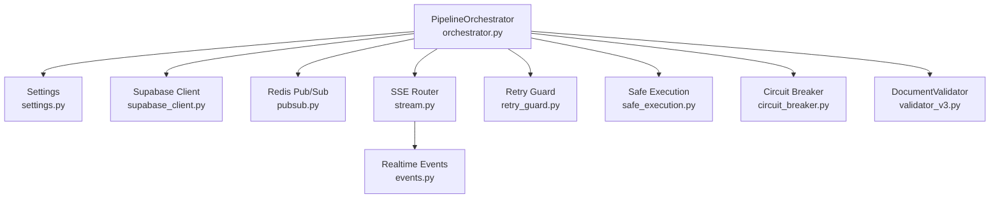
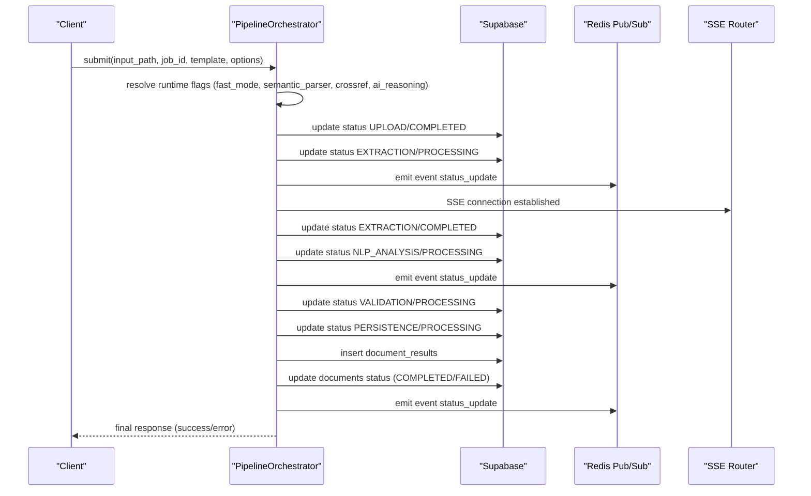
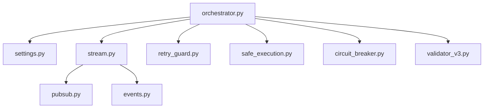

# Pipeline Orchestrator

<cite>
**Referenced Files in This Document**
- [orchestrator.py](file://backend/app/pipeline/orchestrator.py)
- [base.py](file://backend/app/pipeline/base.py)
- [settings.py](file://backend/app/config/settings.py)
- [stream.py](file://backend/app/routers/stream.py)
- [pubsub.py](file://backend/app/realtime/pubsub.py)
- [events.py](file://backend/app/realtime/events.py)
- [retry_guard.py](file://backend/app/pipeline/safety/retry_guard.py)
- [safe_execution.py](file://backend/app/pipeline/safety/safe_execution.py)
- [circuit_breaker.py](file://backend/app/pipeline/safety/circuit_breaker.py)
- [validator_v3.py](file://backend/app/pipeline/validation/validator_v3.py)
- [05_full_pipeline.py](file://backend/manual_tests/visual/phase1/05_full_pipeline.py)
</cite>

## Table of Contents
1. [Introduction](#introduction)
2. [Project Structure](#project-structure)
3. [Core Components](#core-components)
4. [Architecture Overview](#architecture-overview)
5. [Detailed Component Analysis](#detailed-component-analysis)
6. [Dependency Analysis](#dependency-analysis)
7. [Performance Considerations](#performance-considerations)
8. [Troubleshooting Guide](#troubleshooting-guide)
9. [Conclusion](#conclusion)
10. [Appendices](#appendices)

## Introduction
The Pipeline Orchestrator is the central coordinator responsible for end-to-end execution of the document processing pipeline. It manages all major stages from ingestion and parsing through formatting and persistence, ensuring robustness via timeouts, retries, circuit breakers, and graceful fallbacks. It emits real-time status updates via Supabase and Redis Pub/Sub/SSE, enabling live dashboards and user feedback. It supports runtime flags for fast mode and selective semantic processing, and provides an edit re-run flow for iterative refinement.

## Project Structure
The orchestrator lives in the backend pipeline module and integrates with configuration, real-time systems, and safety utilities. The following diagram shows the primary modules involved in orchestration and their relationships.

**Diagram sources**
- [orchestrator.py](file://backend/app/pipeline/orchestrator.py)
- [settings.py](file://backend/app/config/settings.py)
- [stream.py](file://backend/app/routers/stream.py)
- [pubsub.py](file://backend/app/realtime/pubsub.py)
- [events.py](file://backend/app/realtime/events.py)
- [retry_guard.py](file://backend/app/pipeline/safety/retry_guard.py)
- [safe_execution.py](file://backend/app/pipeline/safety/safe_execution.py)
- [circuit_breaker.py](file://backend/app/pipeline/safety/circuit_breaker.py)
- [validator_v3.py](file://backend/app/pipeline/validation/validator_v3.py)

**Section sources**
- [orchestrator.py](file://backend/app/pipeline/orchestrator.py)
- [settings.py](file://backend/app/config/settings.py)
- [stream.py](file://backend/app/routers/stream.py)
- [pubsub.py](file://backend/app/realtime/pubsub.py)
- [events.py](file://backend/app/realtime/events.py)
- [retry_guard.py](file://backend/app/pipeline/safety/retry_guard.py)
- [safe_execution.py](file://backend/app/pipeline/safety/safe_execution.py)
- [circuit_breaker.py](file://backend/app/pipeline/safety/circuit_breaker.py)
- [validator_v3.py](file://backend/app/pipeline/validation/validator_v3.py)

## Core Components
- PipelineOrchestrator: Central controller that sequences stages, enforces concurrency limits, handles timeouts, and updates status.
- Stage Abstractions: All stages implement a common interface to ensure consistent processing semantics.
- Safety Utilities: Retry with exponential backoff, safe execution context managers, and circuit breakers.
- Real-time Updates: SSE via Redis Pub/Sub with structured event payloads.
- Configuration: Centralized settings for timeouts, feature flags, and external service toggles.

Key responsibilities:
- Concurrency control via a semaphore with acquire timeout.
- Runtime flag resolution for fast mode and semantic processing.
- Timeout enforcement per stage using a bounded ThreadPoolExecutor.
- Robust status updates to Supabase and real-time SSE channels.
- Partial result persistence on failures and atomic completion checks.

**Section sources**
- [orchestrator.py](file://backend/app/pipeline/orchestrator.py)
- [base.py](file://backend/app/pipeline/base.py)
- [retry_guard.py](file://backend/app/pipeline/safety/retry_guard.py)
- [safe_execution.py](file://backend/app/pipeline/safety/safe_execution.py)
- [circuit_breaker.py](file://backend/app/pipeline/safety/circuit_breaker.py)
- [settings.py](file://backend/app/config/settings.py)
- [stream.py](file://backend/app/routers/stream.py)
- [pubsub.py](file://backend/app/realtime/pubsub.py)
- [events.py](file://backend/app/realtime/events.py)

## Architecture Overview
The orchestrator coordinates a multi-stage pipeline with explicit phases and optional AI layers. It ensures resilience through timeouts, retries, and fallbacks, and provides real-time visibility via SSE.

**Diagram sources**
- [orchestrator.py](file://backend/app/pipeline/orchestrator.py)
- [stream.py](file://backend/app/routers/stream.py)
- [pubsub.py](file://backend/app/realtime/pubsub.py)
- [events.py](file://backend/app/realtime/events.py)

## Detailed Component Analysis

### PipelineOrchestrator
Responsibilities:
- Enforce concurrency via a semaphore with configurable acquire timeout.
- Resolve runtime flags from formatting options and environment settings.
- Execute sequential phases: upload, extraction, AI metadata/layout, structure detection, classification, NLP analysis, validation, formatting, persistence.
- Manage timeouts per stage using a bounded ThreadPoolExecutor.
- Emit status updates to Supabase and real-time SSE channels.
- Persist partial results on failure and compute quality summaries.
- Provide an edit re-run flow for iterative refinement.

Concurrency control:
- A global semaphore limits concurrent jobs to a fixed cap.
- Acquire attempts respect a configurable timeout; otherwise, the job is rejected with a failure status.

Timeout handling:
- Per-stage execution uses a single-threaded ThreadPoolExecutor with a timeout.
- On timeout, futures are cancelled and a TimeoutError is raised.

Cancellation:
- Periodic checks for user-initiated cancellation by querying Supabase.
- CancelledError is raised to gracefully abort processing.

Safety mechanisms:
- Safe execution context manager suppresses crashes within guarded blocks.
- Retry decorator applies exponential backoff for selected stages.
- Circuit breaker guards external service calls with fallback behavior.

Runtime flags:
- fast_mode disables certain optional AI layers to reduce latency.
- semantic_parser, crossref_enrichment, and ai_reasoning are toggled accordingly.

Quality scoring:
- Computes a composite quality score and logs diagnostics for operational insights.

Edit re-run flow:
- Re-validates and re-formats edited structured data without re-extracting.
- Persists a new version of the document result and updates the document record.

**Section sources**
- [orchestrator.py](file://backend/app/pipeline/orchestrator.py)
- [retry_guard.py](file://backend/app/pipeline/safety/retry_guard.py)
- [safe_execution.py](file://backend/app/pipeline/safety/safe_execution.py)
- [circuit_breaker.py](file://backend/app/pipeline/safety/circuit_breaker.py)
- [settings.py](file://backend/app/config/settings.py)

### Stage Interface and Validation
- All pipeline stages implement a common interface requiring a process method that mutates and returns a PipelineDocument.
- DocumentValidator is a concrete stage driven by YAML contracts and performs structural and integrity checks.

**Section sources**
- [base.py](file://backend/app/pipeline/base.py)
- [validator_v3.py](file://backend/app/pipeline/validation/validator_v3.py)

### Real-time Status Updates (Supabase + Redis + SSE)
- Status updates are persisted to Supabase and broadcast via Redis Pub/Sub channels.
- SSE endpoint streams events to authenticated clients for live dashboards.
- Events include job ID, phase, status, message, and progress percentage.

**Section sources**
- [orchestrator.py](file://backend/app/pipeline/orchestrator.py)
- [stream.py](file://backend/app/routers/stream.py)
- [pubsub.py](file://backend/app/realtime/pubsub.py)
- [events.py](file://backend/app/realtime/events.py)

### Safety Utilities
- Retry with exponential backoff supports both sync and async functions.
- Safe execution context manager catches and logs exceptions, preventing pipeline crashes.
- Circuit breaker protects external services with configurable thresholds and fallbacks.

**Section sources**
- [retry_guard.py](file://backend/app/pipeline/safety/retry_guard.py)
- [safe_execution.py](file://backend/app/pipeline/safety/safe_execution.py)
- [circuit_breaker.py](file://backend/app/pipeline/safety/circuit_breaker.py)

### Example Pipeline Execution
- A full pipeline test demonstrates end-to-end processing from parsing to validation and produces an annotated DOCX for visual inspection.

**Section sources**
- [05_full_pipeline.py](file://backend/manual_tests/visual/phase1/05_full_pipeline.py)

## Dependency Analysis
The orchestrator depends on configuration for timeouts and feature flags, real-time infrastructure for SSE, and safety utilities for resilience. The following diagram highlights key dependencies.

**Diagram sources**
- [orchestrator.py](file://backend/app/pipeline/orchestrator.py)
- [settings.py](file://backend/app/config/settings.py)
- [stream.py](file://backend/app/routers/stream.py)
- [pubsub.py](file://backend/app/realtime/pubsub.py)
- [events.py](file://backend/app/realtime/events.py)
- [retry_guard.py](file://backend/app/pipeline/safety/retry_guard.py)
- [safe_execution.py](file://backend/app/pipeline/safety/safe_execution.py)
- [circuit_breaker.py](file://backend/app/pipeline/safety/circuit_breaker.py)
- [validator_v3.py](file://backend/app/pipeline/validation/validator_v3.py)

**Section sources**
- [orchestrator.py](file://backend/app/pipeline/orchestrator.py)
- [settings.py](file://backend/app/config/settings.py)
- [stream.py](file://backend/app/routers/stream.py)
- [pubsub.py](file://backend/app/realtime/pubsub.py)
- [events.py](file://backend/app/realtime/events.py)
- [retry_guard.py](file://backend/app/pipeline/safety/retry_guard.py)
- [safe_execution.py](file://backend/app/pipeline/safety/safe_execution.py)
- [circuit_breaker.py](file://backend/app/pipeline/safety/circuit_breaker.py)
- [validator_v3.py](file://backend/app/pipeline/validation/validator_v3.py)

## Performance Considerations
- Concurrency limiting: Tune the semaphore count and acquire timeout to balance throughput and resource usage.
- Stage timeouts: Adjust per-stage timeouts based on workload characteristics to avoid premature cancellations or excessive latency.
- Optional AI layers: Enable fast mode to skip expensive semantic parsing and reasoning for quicker turnaround.
- External service timeouts: Configure GROBID and Docling timeouts appropriately; consider skipping Docling for digital PDFs to reduce latency.
- Caching and model preload: Preload AI models when appropriate to reduce cold-start overhead.
- Output hashing: Persist SHA-256 hashes for artifacts to detect changes and enable efficient caching.

[No sources needed since this section provides general guidance]

## Troubleshooting Guide
Common issues and remedies:
- Too many concurrent jobs: Semaphore acquisition fails; the orchestrator rejects the job and reports server busy. Reduce concurrent submissions or increase capacity.
- Stage timeouts: A stage exceeds its timeout and is cancelled. Increase the stage-specific timeout or optimize the stage logic.
- External service failures: GROBID/Docling unavailability triggers fallbacks. Verify service endpoints and network connectivity.
- Validation warnings: Pipeline completes with warnings; inspect validation results and regenerate with corrected inputs.
- Cancellation: User cancels the job; orchestrator stops gracefully and persists partial results if available.
- SSE connection issues: Redis unavailable falls back to in-memory queues; ensure Redis is reachable or tolerate local fallback.

Operational tips:
- Inspect logs for safety net messages indicating suppressed exceptions.
- Review quality summaries for insights into confidence and structural issues.
- Use the edit re-run flow to iterate on corrections without re-extracting.

**Section sources**
- [orchestrator.py](file://backend/app/pipeline/orchestrator.py)
- [retry_guard.py](file://backend/app/pipeline/safety/retry_guard.py)
- [safe_execution.py](file://backend/app/pipeline/safety/safe_execution.py)
- [circuit_breaker.py](file://backend/app/pipeline/safety/circuit_breaker.py)
- [pubsub.py](file://backend/app/realtime/pubsub.py)
- [stream.py](file://backend/app/routers/stream.py)

## Conclusion
The Pipeline Orchestrator provides a robust, observable, and resilient framework for end-to-end document processing. It balances performance and quality through configurable concurrency, timeouts, and optional AI layers, while maintaining real-time visibility and strong safety guarantees. By leveraging the runtime flag system and edit re-run flow, users can tailor the pipeline to their needs and refine outputs iteratively.

[No sources needed since this section summarizes without analyzing specific files]

## Appendices

### Runtime Flag Resolution
- fast_mode: Defaults to disabled to preserve full AI pipeline quality; overridden in tests and low-memory environments.
- semantic_parser: Enabled unless fast_mode is active.
- crossref_enrichment: Enabled unless fast_mode is active.
- ai_reasoning: Enabled unless fast_mode is active.

**Section sources**
- [orchestrator.py](file://backend/app/pipeline/orchestrator.py)
- [settings.py](file://backend/app/config/settings.py)

### Example: Full Pipeline Visual Test
- Demonstrates end-to-end processing from parsing to validation and saving an annotated DOCX for visual verification.

**Section sources**
- [05_full_pipeline.py](file://backend/manual_tests/visual/phase1/05_full_pipeline.py)