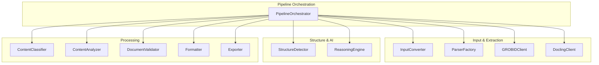
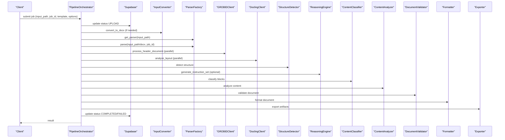
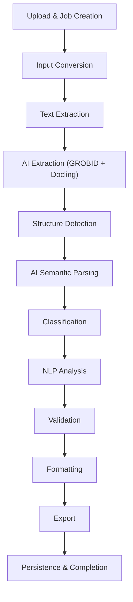
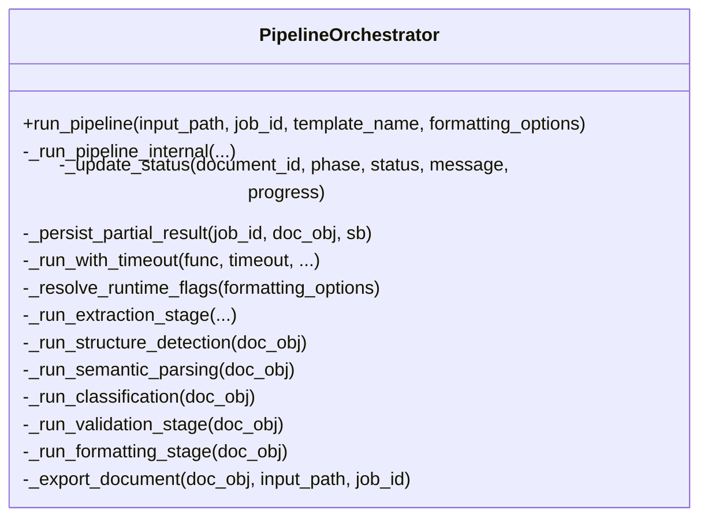
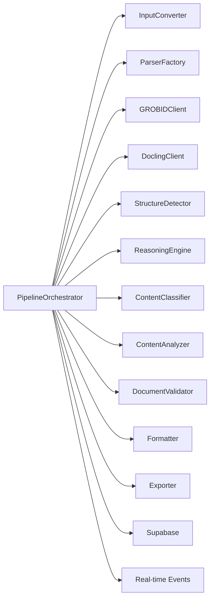

# Pipeline Processing

<cite>
**Referenced Files in This Document**
- [orchestrator.py](file://backend/app/pipeline/orchestrator.py)
- [base.py](file://backend/app/pipeline/base.py)
- [converter.py](file://backend/app/pipeline/input_conversion/converter.py)
- [parser_factory.py](file://backend/app/pipeline/parsing/parser_factory.py)
- [detector.py](file://backend/app/pipeline/structure_detection/detector.py)
- [formatter.py](file://backend/app/pipeline/formatting/formatter.py)
- [validator_v3.py](file://backend/app/pipeline/validation/validator_v3.py)
- [reasoning_engine.py](file://backend/app/pipeline/intelligence/reasoning_engine.py)
- [grobid_client.py](file://backend/app/pipeline/services/grobid_client.py)
- [docling_client.py](file://backend/app/pipeline/services/docling_client.py)
- [circuit_breaker.py](file://backend/app/pipeline/safety/circuit_breaker.py)
- [exporter.py](file://backend/app/pipeline/export/exporter.py)
- [document.py](file://backend/app/models/document.py)
</cite>

## Table of Contents
1. [Introduction](#introduction)
2. [Project Structure](#project-structure)
3. [Core Components](#core-components)
4. [Architecture Overview](#architecture-overview)
5. [Detailed Component Analysis](#detailed-component-analysis)
6. [Dependency Analysis](#dependency-analysis)
7. [Performance Considerations](#performance-considerations)
8. [Troubleshooting Guide](#troubleshooting-guide)
9. [Conclusion](#conclusion)
10. [Appendices](#appendices)

## Introduction
This document describes the 12-stage document processing pipeline that transforms raw academic manuscripts into properly formatted outputs. It covers input conversion, text extraction, structure detection, AI analysis, validation, formatting, and export. It explains the pipeline orchestrator, stage coordination, error handling, performance optimization, AI/ML integration points, external service interactions, fallback mechanisms, processing state management, job tracking, real-time status updates, troubleshooting, and extensibility for adding new pipeline stages.

## Project Structure
The pipeline is implemented as a staged orchestration with modular components:
- Input conversion: normalize diverse input formats to DOCX
- Text extraction: parse DOCX/PDF/HTML/MD/TX to blocks
- AI extraction: parallel metadata/layout extraction via GROBID and Docling
- Structure detection: heading/section identification and hierarchy
- AI reasoning: semantic classification and confidence scoring
- Classification: block-level semantic assignment
- NLP analysis: keyword extraction and content analysis
- Validation: structural completeness and integrity checks
- Formatting: apply templates and styles to generate Word document
- Export: save DOCX and derive PDF/JATS/JSON/HTML/LaTeX

**Diagram sources**
- [orchestrator.py:522-800](file://backend/app/pipeline/orchestrator.py#L522-L800)
- [converter.py:19-166](file://backend/app/pipeline/input_conversion/converter.py#L19-L166)
- [parser_factory.py:25-166](file://backend/app/pipeline/parsing/parser_factory.py#L25-L166)
- [grobid_client.py:25-137](file://backend/app/pipeline/services/grobid_client.py#L25-L137)
- [docling_client.py:143-289](file://backend/app/pipeline/services/docling_client.py#L143-L289)
- [detector.py:27-122](file://backend/app/pipeline/structure_detection/detector.py#L27-L122)
- [reasoning_engine.py:83-176](file://backend/app/pipeline/intelligence/reasoning_engine.py#L83-L176)
- [formatter.py:35-291](file://backend/app/pipeline/formatting/formatter.py#L35-L291)
- [validator_v3.py:34-146](file://backend/app/pipeline/validation/validator_v3.py#L34-L146)
- [exporter.py:19-195](file://backend/app/pipeline/export/exporter.py#L19-L195)

**Section sources**
- [orchestrator.py:522-800](file://backend/app/pipeline/orchestrator.py#L522-L800)
- [base.py:4-24](file://backend/app/pipeline/base.py#L4-L24)

## Core Components
- PipelineOrchestrator: central coordinator managing stages, concurrency limits, status updates, timeouts, and fallbacks
- PipelineStage: base interface for all pipeline stages
- InputConverter: converts non-Docx inputs to DOCX using LibreOffice/Pandoc; supports OCR for scanned PDFs
- ParserFactory: selects appropriate parser per file type (DOCX, PDF, TXT, HTML, MD, TeX)
- GROBIDClient and DoclingClient: external services for metadata and layout extraction
- StructureDetector: rule-based and Docling-enhanced heading/section detection
- ReasoningEngine: multi-tier LLM reasoning with circuit breaker and fallbacks
- ContentClassifier: assigns semantic block types
- ContentAnalyzer: extracts keywords and enriches content
- DocumentValidator: structural and integrity checks with optional CrossRef validation
- Formatter: renders Word document using templates/styles/numbering
- Exporter: writes DOCX and derived formats (PDF/JATS/JSON/HTML/LaTeX)

**Section sources**
- [orchestrator.py:73-121](file://backend/app/pipeline/orchestrator.py#L73-L121)
- [base.py:4-24](file://backend/app/pipeline/base.py#L4-L24)
- [converter.py:19-166](file://backend/app/pipeline/input_conversion/converter.py#L19-L166)
- [parser_factory.py:25-166](file://backend/app/pipeline/parsing/parser_factory.py#L25-L166)
- [grobid_client.py:25-137](file://backend/app/pipeline/services/grobid_client.py#L25-L137)
- [docling_client.py:143-289](file://backend/app/pipeline/services/docling_client.py#L143-L289)
- [detector.py:27-122](file://backend/app/pipeline/structure_detection/detector.py#L27-L122)
- [reasoning_engine.py:83-176](file://backend/app/pipeline/intelligence/reasoning_engine.py#L83-L176)
- [formatter.py:35-291](file://backend/app/pipeline/formatting/formatter.py#L35-L291)
- [validator_v3.py:34-146](file://backend/app/pipeline/validation/validator_v3.py#L34-L146)
- [exporter.py:19-195](file://backend/app/pipeline/export/exporter.py#L19-L195)

## Architecture Overview
The orchestrator runs the pipeline in a controlled, monitored manner:
- Acquires a concurrency semaphore to limit parallel jobs
- Updates processing status in Supabase and emits real-time events
- Executes extraction, AI extraction, structure detection, AI reasoning, classification, NLP analysis, validation, formatting, and export
- Persists partial results on failure and computes a quality score

**Diagram sources**
- [orchestrator.py:522-800](file://backend/app/pipeline/orchestrator.py#L522-L800)
- [converter.py:40-166](file://backend/app/pipeline/input_conversion/converter.py#L40-L166)
- [parser_factory.py:95-141](file://backend/app/pipeline/parsing/parser_factory.py#L95-L141)
- [grobid_client.py:52-92](file://backend/app/pipeline/services/grobid_client.py#L52-L92)
- [docling_client.py:180-289](file://backend/app/pipeline/services/docling_client.py#L180-L289)
- [detector.py:47-122](file://backend/app/pipeline/structure_detection/detector.py#L47-L122)
- [reasoning_engine.py:463-571](file://backend/app/pipeline/intelligence/reasoning_engine.py#L463-L571)
- [formatter.py:49-291](file://backend/app/pipeline/formatting/formatter.py#L49-L291)
- [validator_v3.py:62-146](file://backend/app/pipeline/validation/validator_v3.py#L62-L146)
- [exporter.py:30-195](file://backend/app/pipeline/export/exporter.py#L30-L195)

## Detailed Component Analysis

### 12-Stage Pipeline Workflow
- Stage 0: Upload and Job Creation
  - Orchestrator initializes and sets status to UPLOAD
- Stage 1: Input Conversion
  - Convert non-Docx inputs to DOCX using LibreOffice/Pandoc; optional OCR for scanned PDFs
- Stage 2: Text Extraction
  - Use ParserFactory to select parser; parse DOCX/PDF/HTML/MD/TX; optionally fallback to Nougat OCR for scanned PDFs
- Stage 3: AI Extraction (Parallel)
  - GROBID: extract metadata (title/authors/abstract/keywords)
  - Docling: extract layout (bounding boxes, font sizes, headings/tables/figures)
  - PyMuPDF fallback for metadata when AI services unavailable
- Stage 4: Structure Detection
  - Detect headings and build section hierarchy; canonicalize section names; validate hierarchy
- Stage 5: AI Semantic Parsing
  - Optional semantic classification via ReasoningEngine (NVIDIA NIM or Ollama DeepSeek); rule-based fallback
- Stage 6: Classification
  - Assign semantic block types and confidence scores
- Stage 7: NLP Analysis
  - Extract keywords and enrich content metadata
- Stage 8: Validation
  - Structural completeness, figure/table/reference checks, integrity/cross-reference validation, optional CrossRef DOI checks
- Stage 9: Formatting
  - Apply numbering, references, styles, and template rendering; add TOC/page numbers/borders/line numbers
- Stage 10: Export
  - Save DOCX; derive PDF/JATS/JSON/HTML/LaTeX; write structured export payload
- Stage 11: Persistence and Completion
  - Persist partial results on failure; compute quality score; update status to COMPLETED/FAILED

[No sources needed since this diagram shows conceptual workflow, not actual code structure]

**Section sources**
- [orchestrator.py:583-800](file://backend/app/pipeline/orchestrator.py#L583-L800)
- [converter.py:40-166](file://backend/app/pipeline/input_conversion/converter.py#L40-L166)
- [parser_factory.py:95-141](file://backend/app/pipeline/parsing/parser_factory.py#L95-L141)
- [detector.py:47-122](file://backend/app/pipeline/structure_detection/detector.py#L47-L122)
- [reasoning_engine.py:463-571](file://backend/app/pipeline/intelligence/reasoning_engine.py#L463-L571)
- [formatter.py:49-291](file://backend/app/pipeline/formatting/formatter.py#L49-L291)
- [validator_v3.py:62-146](file://backend/app/pipeline/validation/validator_v3.py#L62-L146)
- [exporter.py:30-195](file://backend/app/pipeline/export/exporter.py#L30-L195)

### Orchestrator and Stage Coordination
- Concurrency control: semaphore limits concurrent jobs; timeout rejects overflow
- Status tracking: updates Supabase processing_status and documents; emits SSE events
- Runtime flags: fast_mode toggles semantic parsing and optional external validations
- Timeouts: per-stage execution wrappers enforce deadlines
- Fallbacks: partial result persistence on failure; rule-based classification when AI fails
- Cancellation: periodic checks against Supabase job status

**Diagram sources**
- [orchestrator.py:73-521](file://backend/app/pipeline/orchestrator.py#L73-L521)

**Section sources**
- [orchestrator.py:522-800](file://backend/app/pipeline/orchestrator.py#L522-L800)

### Input Conversion
- Supported formats: DOCX, DOC, MD, HTML, TXT, TEX, PDF, ODT, RTF
- Strategy selection: pass-through for DOCX, Pandoc for MD/HTML/TXT/TEX, LibreOffice for others
- PDF handling: detects scanned PDFs and applies OCR if enabled; otherwise LibreOffice conversion
- Output: standardized input.docx in job-specific temp directory

**Section sources**
- [converter.py:19-166](file://backend/app/pipeline/input_conversion/converter.py#L19-L166)

### Text Extraction
- ParserFactory selects parser based on file extension
- PDF extraction: primary fast path via PyMuPDF; optional Nougat OCR fallback when enabled
- Other formats: DOCX, HTML, Markdown, TeX, TXT parsers

**Section sources**
- [parser_factory.py:25-166](file://backend/app/pipeline/parsing/parser_factory.py#L25-L166)

### AI Extraction (External Services)
- GROBIDClient: metadata extraction (header document) with TEI XML parsing and confidence scoring
- DoclingClient: layout analysis (elements, bounding boxes, font sizes, tables/figures)
- Parallel execution with timeouts; fallbacks when unavailable or timing out
- PyMuPDF fallback metadata extraction for scanned PDFs when AI services unavailable

**Section sources**
- [grobid_client.py:25-137](file://backend/app/pipeline/services/grobid_client.py#L25-L137)
- [docling_client.py:143-289](file://backend/app/pipeline/services/docling_client.py#L143-L289)
- [orchestrator.py:635-755](file://backend/app/pipeline/orchestrator.py#L635-L755)

### Structure Detection
- Rule-based heading detection with font-size heuristics and positional cues
- Docling layout integration for improved accuracy (title detection, heading levels)
- Section name canonicalization based on publisher contracts
- Hierarchy validation to prevent level jumps

**Section sources**
- [detector.py:27-122](file://backend/app/pipeline/structure_detection/detector.py#L27-L122)

### AI Semantic Parsing and Reasoning
- Multi-tier LLM reasoning:
  - Primary: NVIDIA NIM (Llama 3.3 70B) via LiteLLM
  - Fallback: Ollama DeepSeek via LangChain or direct HTTP
  - Final fallback: rule-based classification
- Circuit breaker protects against repeated failures; records metrics
- JSON schema validation and normalization of outputs

**Section sources**
- [reasoning_engine.py:83-176](file://backend/app/pipeline/intelligence/reasoning_engine.py#L83-L176)
- [reasoning_engine.py:463-571](file://backend/app/pipeline/intelligence/reasoning_engine.py#L463-L571)
- [circuit_breaker.py:29-97](file://backend/app/pipeline/safety/circuit_breaker.py#L29-L97)

### Classification and NLP Analysis
- ContentClassifier assigns semantic block types
- ContentAnalyzer extracts keywords and enriches metadata
- Confidence synchronization for downstream logic

**Section sources**
- [orchestrator.py:782-800](file://backend/app/pipeline/orchestrator.py#L782-L800)

### Validation
- Structural completeness and section ordering
- Figure/table/reference checks
- Integrity/cross-reference validation
- Optional CrossRef DOI validation with warnings to avoid blocking on external failures
- Review manager flags areas requiring human-in-the-loop review

**Section sources**
- [validator_v3.py:34-146](file://backend/app/pipeline/validation/validator_v3.py#L34-L146)

### Formatting
- Numbering engine, style mapper, reference formatter, template renderer, and table renderer
- Conditional template rendering (docxtpl) with fallback to python-docx
- Page size, TOC, page numbers, borders, line numbers, and global line spacing
- Footnote and endnote handling, cover page insertion

**Section sources**
- [formatter.py:35-291](file://backend/app/pipeline/formatting/formatter.py#L35-L291)

### Export
- Primary: save DOCX
- Derived: PDF (via PDFExporter), JATS XML (JATSGenerator), JSON (structured payload), HTML, LaTeX
- Export formats resolved from formatting options

**Section sources**
- [exporter.py:19-195](file://backend/app/pipeline/export/exporter.py#L19-L195)

## Dependency Analysis
Key dependencies and interactions:
- Orchestrator depends on all pipeline stages and external clients
- StructureDetector depends on contracts and Docling layout data
- ReasoningEngine depends on LLM services and circuit breaker
- Exporter depends on PDF/TeX exporters and JATS generator
- Status updates depend on Supabase and real-time event emission

**Diagram sources**
- [orchestrator.py:522-800](file://backend/app/pipeline/orchestrator.py#L522-L800)
- [detector.py:27-122](file://backend/app/pipeline/structure_detection/detector.py#L27-L122)
- [reasoning_engine.py:83-176](file://backend/app/pipeline/intelligence/reasoning_engine.py#L83-L176)
- [exporter.py:19-195](file://backend/app/pipeline/export/exporter.py#L19-L195)

**Section sources**
- [orchestrator.py:522-800](file://backend/app/pipeline/orchestrator.py#L522-L800)

## Performance Considerations
- Concurrency limiting: semaphore controls parallel jobs to prevent OOM
- Timeouts: per-stage execution wrappers bound latency
- Fast mode: disables optional AI parsing and external validations to reduce latency
- Digital PDF optimization: Docling skip for native PDFs to reduce latency
- Parallel AI extraction: GROBID and Docling executed concurrently with bounded timeouts
- Memory-conscious design: Docling disabled in low-memory mode; warnings suppressed for third-party noise
- Quality scoring: operational score computed for diagnostics and tuning

[No sources needed since this section provides general guidance]

## Troubleshooting Guide
Common issues and resolutions:
- Conversion failures: verify LibreOffice/Pandoc availability; check supported formats
- Empty extraction for PDF: fallback to Nougat OCR when enabled; otherwise ensure text layer present
- AI service unavailability: GROBID/Docling disabled or timed out; PyMuPDF fallback metadata used
- ReasoningEngine failures: circuit breaker tripped; falls back to rule-based classification
- Validation blocking: optional CrossRef checks disabled in fast mode; warnings logged instead of errors
- Export failures: PDF/TeX/JATS conversions may fail due to external tooling; check logs for specific errors
- Job cancellation: Orchestrator periodically checks Supabase for cancellation and raises cancellation error
- Partial results persistence: on early crashes, partial structured data stored for recovery

**Section sources**
- [converter.py:107-166](file://backend/app/pipeline/input_conversion/converter.py#L107-L166)
- [parser_factory.py:55-66](file://backend/app/pipeline/parsing/parser_factory.py#L55-L66)
- [grobid_client.py:41-51](file://backend/app/pipeline/services/grobid_client.py#L41-L51)
- [docling_client.py:176-179](file://backend/app/pipeline/services/docling_client.py#L176-L179)
- [reasoning_engine.py:458-470](file://backend/app/pipeline/intelligence/reasoning_engine.py#L458-L470)
- [validator_v3.py:109-118](file://backend/app/pipeline/validation/validator_v3.py#L109-L118)
- [exporter.py:47-65](file://backend/app/pipeline/export/exporter.py#L47-L65)
- [orchestrator.py:169-185](file://backend/app/pipeline/orchestrator.py#L169-L185)
- [orchestrator.py:186-211](file://backend/app/pipeline/orchestrator.py#L186-L211)

## Conclusion
The pipeline integrates robust orchestration, modular stages, and resilient fallbacks to reliably transform academic manuscripts into polished outputs. It balances quality and performance via runtime flags, concurrency control, and external service safeguards. Extensibility is achieved through the PipelineStage interface and the orchestrator’s stage registration model.

[No sources needed since this section summarizes without analyzing specific files]

## Appendices

### Processing State Management and Real-Time Updates
- Supabase integration: upsert processing_status and update parent document fields
- Real-time events: SSE emitted for status updates
- Job tracking: current_stage, progress, error_message persisted

**Section sources**
- [orchestrator.py:107-168](file://backend/app/pipeline/orchestrator.py#L107-L168)
- [document.py:6-26](file://backend/app/models/document.py#L6-L26)

### Extensibility Options
- Add new stages by implementing PipelineStage and registering in orchestrator
- Introduce new parsers via ParserFactory
- Extend AI reasoning with new models behind circuit breaker
- Add export formats in Exporter

**Section sources**
- [base.py:4-24](file://backend/app/pipeline/base.py#L4-L24)
- [parser_factory.py:95-141](file://backend/app/pipeline/parsing/parser_factory.py#L95-L141)
- [reasoning_engine.py:458-470](file://backend/app/pipeline/intelligence/reasoning_engine.py#L458-L470)
- [exporter.py:173-195](file://backend/app/pipeline/export/exporter.py#L173-L195)