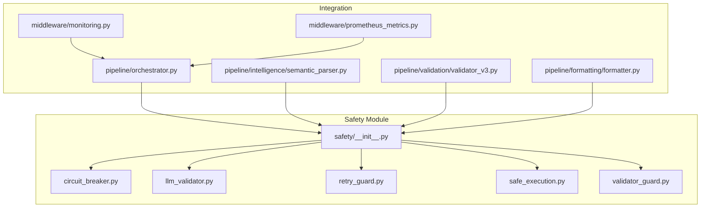
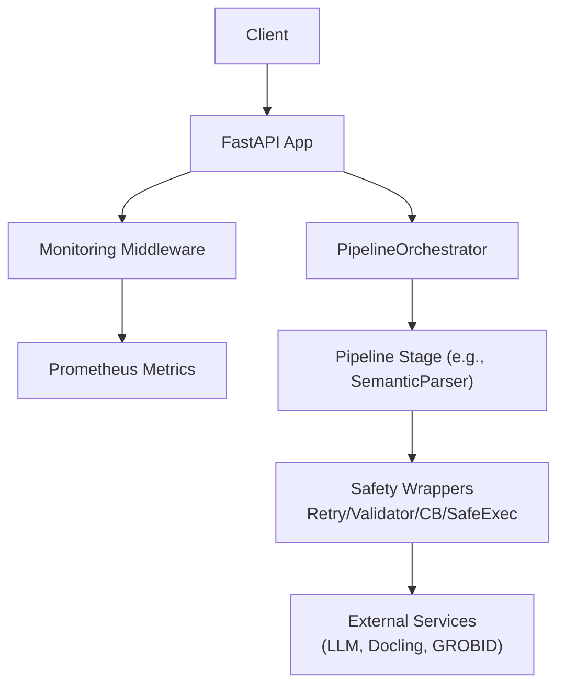
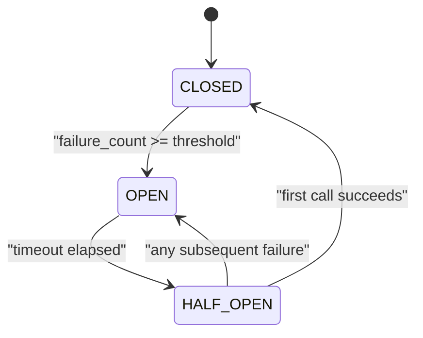
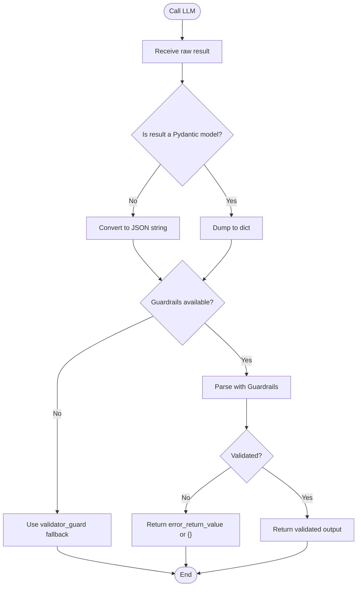
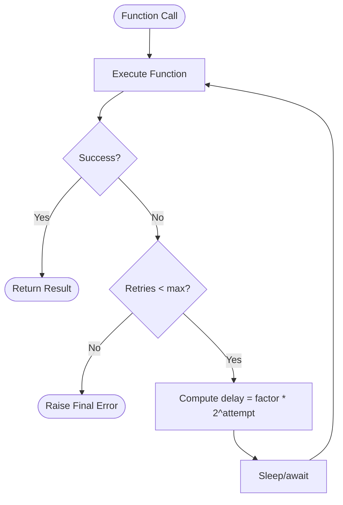
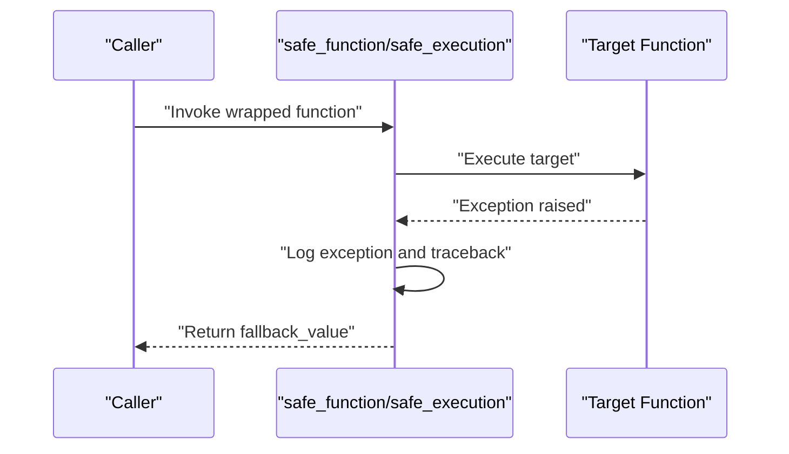
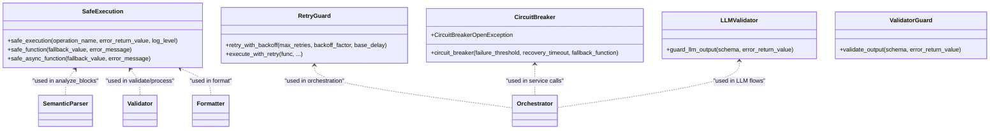
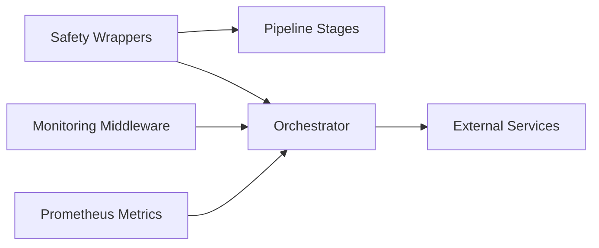

# Pipeline Safety

<cite>
**Referenced Files in This Document**
- [__init__.py](file://backend/app/pipeline/safety/__init__.py)
- [circuit_breaker.py](file://backend/app/pipeline/safety/circuit_breaker.py)
- [llm_validator.py](file://backend/app/pipeline/safety/llm_validator.py)
- [retry_guard.py](file://backend/app/pipeline/safety/retry_guard.py)
- [safe_execution.py](file://backend/app/pipeline/safety/safe_execution.py)
- [validator_guard.py](file://backend/app/pipeline/safety/validator_guard.py)
- [test_global_safety.py](file://backend/tests/safety/test_global_safety.py)
- [test_chaos.py](file://backend/tests/safety/test_chaos.py)
- [monitoring.py](file://backend/app/middleware/monitoring.py)
- [prometheus_metrics.py](file://backend/app/middleware/prometheus_metrics.py)
- [semantic_parser.py](file://backend/app/pipeline/intelligence/semantic_parser.py)
- [validator_v3.py](file://backend/app/pipeline/validation/validator_v3.py)
- [formatter.py](file://backend/app/pipeline/formatting/formatter.py)
- [orchestrator.py](file://backend/app/pipeline/orchestrator.py)
</cite>

## Table of Contents
1. [Introduction](#introduction)
2. [Project Structure](#project-structure)
3. [Core Components](#core-components)
4. [Architecture Overview](#architecture-overview)
5. [Detailed Component Analysis](#detailed-component-analysis)
6. [Dependency Analysis](#dependency-analysis)
7. [Performance Considerations](#performance-considerations)
8. [Troubleshooting Guide](#troubleshooting-guide)
9. [Conclusion](#conclusion)
10. [Appendices](#appendices)

## Introduction
This document explains the pipeline safety mechanisms implemented in the backend. It covers circuit breakers, LLM validation, retry guards, and safe execution wrappers. It also documents error containment strategies, timeout handling, graceful degradation, safety validation rules, risk mitigation techniques, failure recovery procedures, integration with monitoring/alerting, and practical examples and troubleshooting tips.

## Project Structure
The safety subsystem resides under backend/app/pipeline/safety and exposes a cohesive set of decorators and utilities for resilient operations. Integration points include middleware for observability and numerous pipeline stages that wrap critical operations with safety wrappers.

**Diagram sources**
- [__init__.py:1-9](file://backend/app/pipeline/safety/__init__.py#L1-L9)
- [circuit_breaker.py:1-164](file://backend/app/pipeline/safety/circuit_breaker.py#L1-L164)
- [llm_validator.py:1-122](file://backend/app/pipeline/safety/llm_validator.py#L1-L122)
- [retry_guard.py:1-63](file://backend/app/pipeline/safety/retry_guard.py#L1-L63)
- [safe_execution.py:1-74](file://backend/app/pipeline/safety/safe_execution.py#L1-L74)
- [validator_guard.py:1-51](file://backend/app/pipeline/safety/validator_guard.py#L1-L51)
- [monitoring.py:1-51](file://backend/app/middleware/monitoring.py#L1-L51)
- [prometheus_metrics.py:1-235](file://backend/app/middleware/prometheus_metrics.py#L1-L235)
- [orchestrator.py:1-200](file://backend/app/pipeline/orchestrator.py#L1-L200)
- [semantic_parser.py:1-200](file://backend/app/pipeline/intelligence/semantic_parser.py#L1-L200)
- [validator_v3.py:1-200](file://backend/app/pipeline/validation/validator_v3.py#L1-L200)
- [formatter.py:1-200](file://backend/app/pipeline/formatting/formatter.py#L1-L200)

**Section sources**
- [__init__.py:1-9](file://backend/app/pipeline/safety/__init__.py#L1-L9)
- [monitoring.py:1-51](file://backend/app/middleware/monitoring.py#L1-L51)
- [prometheus_metrics.py:1-235](file://backend/app/middleware/prometheus_metrics.py#L1-L235)
- [orchestrator.py:1-200](file://backend/app/pipeline/orchestrator.py#L1-L200)

## Core Components
- Circuit Breaker: Provides thread-safe protection around remote calls with configurable thresholds and fallbacks.
- LLM Validator: Enforces schema compliance for LLM outputs using Guardrails AI when available, with graceful fallback to Pydantic validation.
- Retry Guard: Adds exponential backoff retry for both sync and async functions.
- Safe Execution: Context manager and decorators that suppress exceptions and return fallback values, enabling graceful degradation.
- Validator Guard: Strict output validation for Pydantic models or dictionary schemas, with repair attempts and fallbacks.

These components are exported from the safety package’s init and are widely used across pipeline stages.

**Section sources**
- [__init__.py:1-9](file://backend/app/pipeline/safety/__init__.py#L1-L9)
- [circuit_breaker.py:1-164](file://backend/app/pipeline/safety/circuit_breaker.py#L1-L164)
- [llm_validator.py:1-122](file://backend/app/pipeline/safety/llm_validator.py#L1-L122)
- [retry_guard.py:1-63](file://backend/app/pipeline/safety/retry_guard.py#L1-L63)
- [safe_execution.py:1-74](file://backend/app/pipeline/safety/safe_execution.py#L1-L74)
- [validator_guard.py:1-51](file://backend/app/pipeline/safety/validator_guard.py#L1-L51)

## Architecture Overview
The safety architecture centers on decorators and context managers that wrap critical operations. They integrate with middleware for observability and with pipeline stages to ensure resilience and graceful degradation.

**Diagram sources**
- [monitoring.py:1-51](file://backend/app/middleware/monitoring.py#L1-L51)
- [prometheus_metrics.py:1-235](file://backend/app/middleware/prometheus_metrics.py#L1-L235)
- [orchestrator.py:1-200](file://backend/app/pipeline/orchestrator.py#L1-L200)
- [semantic_parser.py:1-200](file://backend/app/pipeline/intelligence/semantic_parser.py#L1-L200)
- [safe_execution.py:1-74](file://backend/app/pipeline/safety/safe_execution.py#L1-L74)
- [retry_guard.py:1-63](file://backend/app/pipeline/safety/retry_guard.py#L1-L63)
- [circuit_breaker.py:1-164](file://backend/app/pipeline/safety/circuit_breaker.py#L1-L164)
- [llm_validator.py:1-122](file://backend/app/pipeline/safety/llm_validator.py#L1-L122)

## Detailed Component Analysis

### Circuit Breaker Pattern
- Purpose: Protect downstream systems from cascading failures by failing fast when upstream services degrade.
- Behavior:
  - Tracks consecutive failures and transitions through CLOSED → HALF_OPEN → OPEN states.
  - Supports a fallback function to return safe defaults.
  - Logs state changes and failures for observability.
  - Provides a thread-safe decorator that can be bound per-instance or shared.
- Configuration:
  - failure_threshold: number of failures to trip the breaker.
  - recovery_timeout: seconds to wait before attempting recovery.
  - fallback_function: callable invoked when the breaker is open or on error.

**Diagram sources**
- [circuit_breaker.py:24-164](file://backend/app/pipeline/safety/circuit_breaker.py#L24-L164)

**Section sources**
- [circuit_breaker.py:1-164](file://backend/app/pipeline/safety/circuit_breaker.py#L1-L164)

### LLM Validation and Schema Enforcement
- Purpose: Ensure LLM outputs conform to expected schemas and mitigate hallucinations.
- Behavior:
  - Attempts to use Guardrails AI for robust parsing and validation when available.
  - Falls back to native Pydantic validation and key presence checks.
  - Handles environments without an event loop by creating a temporary loop for parsing.
  - Returns a configured error_return_value on validation failure to avoid pipeline crashes.

**Diagram sources**
- [llm_validator.py:46-122](file://backend/app/pipeline/safety/llm_validator.py#L46-L122)
- [validator_guard.py:10-51](file://backend/app/pipeline/safety/validator_guard.py#L10-L51)

**Section sources**
- [llm_validator.py:1-122](file://backend/app/pipeline/safety/llm_validator.py#L1-L122)
- [validator_guard.py:1-51](file://backend/app/pipeline/safety/validator_guard.py#L1-L51)

### Retry Guards and Exponential Backoff
- Purpose: Improve resilience against transient failures by retrying operations with exponential backoff.
- Behavior:
  - Works for both sync and async functions.
  - Limits retries by max_retries and computes delay using backoff_factor and exponential growth.
  - Logs retry attempts and final failure after exhausting retries.

**Diagram sources**
- [retry_guard.py:10-63](file://backend/app/pipeline/safety/retry_guard.py#L10-L63)

**Section sources**
- [retry_guard.py:1-63](file://backend/app/pipeline/safety/retry_guard.py#L1-L63)

### Safe Execution Wrappers
- Purpose: Contain exceptions and enable graceful degradation across the pipeline.
- Behavior:
  - Context manager logs and suppresses exceptions, optionally returning a provided fallback value.
  - Decorators (safe_function, safe_async_function) wrap functions to return fallback values on failure.
  - Used extensively in pipeline stages to prevent single failures from aborting the entire pipeline.

**Diagram sources**
- [safe_execution.py:9-74](file://backend/app/pipeline/safety/safe_execution.py#L9-L74)

**Section sources**
- [safe_execution.py:1-74](file://backend/app/pipeline/safety/safe_execution.py#L1-L74)

### Integration Examples Across Pipeline Stages
- SemanticParser: Uses safe_function to guard analyze_blocks and related operations.
- Validator: Uses safe_execution for process and safe_function for validate to ensure graceful degradation.
- Formatter: Uses safe_function to guard format and related rendering helpers.

**Diagram sources**
- [safe_execution.py:1-74](file://backend/app/pipeline/safety/safe_execution.py#L1-L74)
- [circuit_breaker.py:1-164](file://backend/app/pipeline/safety/circuit_breaker.py#L1-L164)
- [retry_guard.py:1-63](file://backend/app/pipeline/safety/retry_guard.py#L1-L63)
- [llm_validator.py:1-122](file://backend/app/pipeline/safety/llm_validator.py#L1-L122)
- [validator_guard.py:1-51](file://backend/app/pipeline/safety/validator_guard.py#L1-L51)
- [semantic_parser.py:106-159](file://backend/app/pipeline/intelligence/semantic_parser.py#L106-L159)
- [validator_v3.py:62-145](file://backend/app/pipeline/validation/validator_v3.py#L62-L145)
- [formatter.py:49-130](file://backend/app/pipeline/formatting/formatter.py#L49-L130)
- [orchestrator.py:59-62](file://backend/app/pipeline/orchestrator.py#L59-L62)

**Section sources**
- [semantic_parser.py:106-159](file://backend/app/pipeline/intelligence/semantic_parser.py#L106-L159)
- [validator_v3.py:62-145](file://backend/app/pipeline/validation/validator_v3.py#L62-L145)
- [formatter.py:49-130](file://backend/app/pipeline/formatting/formatter.py#L49-L130)
- [orchestrator.py:59-62](file://backend/app/pipeline/orchestrator.py#L59-L62)

## Dependency Analysis
- Internal dependencies:
  - Safety wrappers are imported and used by pipeline stages (semantic_parser, validator_v3, formatter).
  - Orchestrator imports retry and safe_execution utilities for robust orchestration.
- External dependencies:
  - pybreaker is used when available for thread-safe circuit breaking; otherwise a legacy implementation is used.
  - Guardrails AI is conditionally imported for LLM validation; fallbacks are provided when unavailable.
- Observability:
  - Monitoring middleware logs request lifecycle and attaches request IDs.
  - Prometheus metrics middleware defines counters and histograms for pipeline and agent metrics.

**Diagram sources**
- [__init__.py:1-9](file://backend/app/pipeline/safety/__init__.py#L1-L9)
- [monitoring.py:1-51](file://backend/app/middleware/monitoring.py#L1-L51)
- [prometheus_metrics.py:1-235](file://backend/app/middleware/prometheus_metrics.py#L1-L235)
- [orchestrator.py:1-200](file://backend/app/pipeline/orchestrator.py#L1-L200)
- [semantic_parser.py:1-200](file://backend/app/pipeline/intelligence/semantic_parser.py#L1-L200)
- [validator_v3.py:1-200](file://backend/app/pipeline/validation/validator_v3.py#L1-L200)
- [formatter.py:1-200](file://backend/app/pipeline/formatting/formatter.py#L1-L200)

**Section sources**
- [__init__.py:1-9](file://backend/app/pipeline/safety/__init__.py#L1-L9)
- [monitoring.py:1-51](file://backend/app/middleware/monitoring.py#L1-L51)
- [prometheus_metrics.py:1-235](file://backend/app/middleware/prometheus_metrics.py#L1-L235)
- [orchestrator.py:1-200](file://backend/app/pipeline/orchestrator.py#L1-L200)

## Performance Considerations
- Circuit Breaker:
  - Tuning failure_threshold and recovery_timeout impacts latency and throughput. Lower thresholds reduce risk but increase false positives; higher thresholds improve availability but delay recovery.
- Retry Guards:
  - Excessive retries increase load on upstream services. Use conservative max_retries and backoff_factor to balance reliability and resource usage.
- Safe Execution:
  - Logging and exception suppression add overhead. Prefer targeted safe_execution blocks around expensive operations.
- LLM Validation:
  - Guardrails parsing adds CPU overhead. Consider disabling Guardrails in performance-critical paths and rely on validator_guard fallback.
- Observability:
  - Logging and metrics introduce I/O overhead. Ensure batching and efficient sinks for production deployments.

[No sources needed since this section provides general guidance]

## Troubleshooting Guide
- Circuit Breaker Open:
  - Symptoms: Calls return fallback or raise CircuitBreakerOpenException.
  - Actions: Inspect upstream service health, reduce load, adjust thresholds, or disable fallback temporarily for diagnostics.
  - Evidence: Logs show breaker state changes and failure counts.
- LLM Validation Failures:
  - Symptoms: Empty or malformed outputs returned.
  - Actions: Verify schema correctness, enable Guardrails AI, or relax validator rules for debugging.
  - Evidence: Logs indicate Guardrails parse failures or schema mismatches.
- Retry Exhaustion:
  - Symptoms: Final error after max_retries.
  - Actions: Increase max_retries, tune backoff_factor, or add jitter; investigate upstream instability.
- Safe Execution Suppression:
  - Symptoms: Silent failures without visible errors.
  - Actions: Temporarily remove safe_execution wrappers to surface exceptions; confirm fallback values are appropriate.
- Monitoring and Metrics:
  - Use monitoring middleware logs to correlate request IDs with pipeline stages and Prometheus metrics to identify hotspots.

**Section sources**
- [circuit_breaker.py:24-164](file://backend/app/pipeline/safety/circuit_breaker.py#L24-L164)
- [llm_validator.py:46-122](file://backend/app/pipeline/safety/llm_validator.py#L46-L122)
- [retry_guard.py:10-63](file://backend/app/pipeline/safety/retry_guard.py#L10-L63)
- [safe_execution.py:9-74](file://backend/app/pipeline/safety/safe_execution.py#L9-L74)
- [monitoring.py:1-51](file://backend/app/middleware/monitoring.py#L1-L51)
- [prometheus_metrics.py:1-235](file://backend/app/middleware/prometheus_metrics.py#L1-L235)

## Conclusion
The pipeline safety subsystem provides layered resilience through circuit breakers, LLM validation, retry guards, and safe execution wrappers. Combined with monitoring and metrics middleware, these mechanisms ensure graceful degradation, predictable failure recovery, and strong observability across the document processing pipeline.

[No sources needed since this section summarizes without analyzing specific files]

## Appendices

### Safety Configuration Examples
- Circuit Breaker:
  - Configure failure_threshold and recovery_timeout per service stability.
  - Provide fallback_function to return safe defaults.
- LLM Validator:
  - Define schema using Pydantic models; set error_return_value for degraded outputs.
  - Enable Guardrails AI when available for stricter validation.
- Retry Guard:
  - Set max_retries and backoff_factor according to upstream SLAs.
  - Use execute_with_retry for dynamic retry scenarios.
- Safe Execution:
  - Use safe_execution context manager around risky blocks.
  - Apply safe_function/safe_async_function to functions that must not crash the pipeline.

**Section sources**
- [circuit_breaker.py:29-97](file://backend/app/pipeline/safety/circuit_breaker.py#L29-L97)
- [llm_validator.py:46-122](file://backend/app/pipeline/safety/llm_validator.py#L46-L122)
- [retry_guard.py:10-63](file://backend/app/pipeline/safety/retry_guard.py#L10-L63)
- [safe_execution.py:9-74](file://backend/app/pipeline/safety/safe_execution.py#L9-L74)

### Integration with Monitoring and Alerting
- Monitoring Middleware:
  - Generates request IDs, logs start/completion/failure, and attaches processing time headers.
- Prometheus Metrics:
  - Defines counters and histograms for pipeline requests, durations, agent retries, LLM usage, and queue depths.
  - MetricsManager records pipeline events and stage durations.

**Section sources**
- [monitoring.py:1-51](file://backend/app/middleware/monitoring.py#L1-L51)
- [prometheus_metrics.py:1-235](file://backend/app/middleware/prometheus_metrics.py#L1-L235)

### Practical Usage Patterns Observed in Tests
- Global Safety Tests:
  - Verify safe_execution context manager suppresses exceptions.
  - Verify safe_function and safe_async_function return fallback values.
  - Validate that pipeline stages (SemanticParser, RagEngine, DocumentAgent, DoclingClient, etc.) degrade gracefully.
- Chaos Tests:
  - Confirm circuit breaker activates after repeated failures and returns fallbacks.
  - Validate that validator guard suppresses malformed JSON from LLM responses.
  - Demonstrate safe_execution catching unexpected crashes in orchestrator blocks.

**Section sources**
- [test_global_safety.py:1-229](file://backend/tests/safety/test_global_safety.py#L1-L229)
- [test_chaos.py:1-69](file://backend/tests/safety/test_chaos.py#L1-L69)