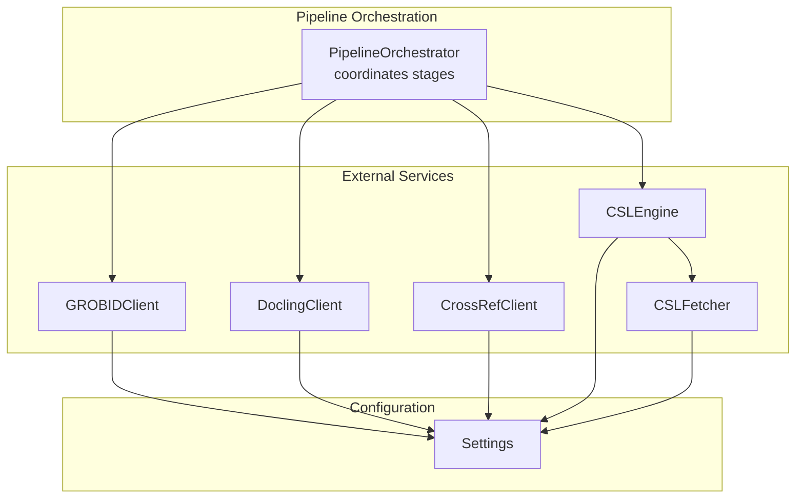
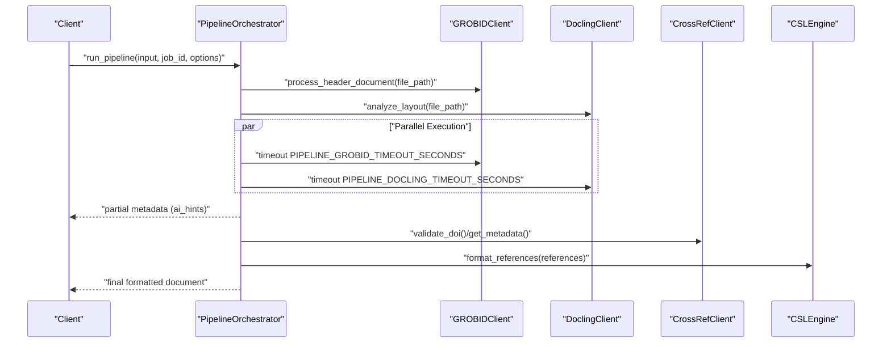
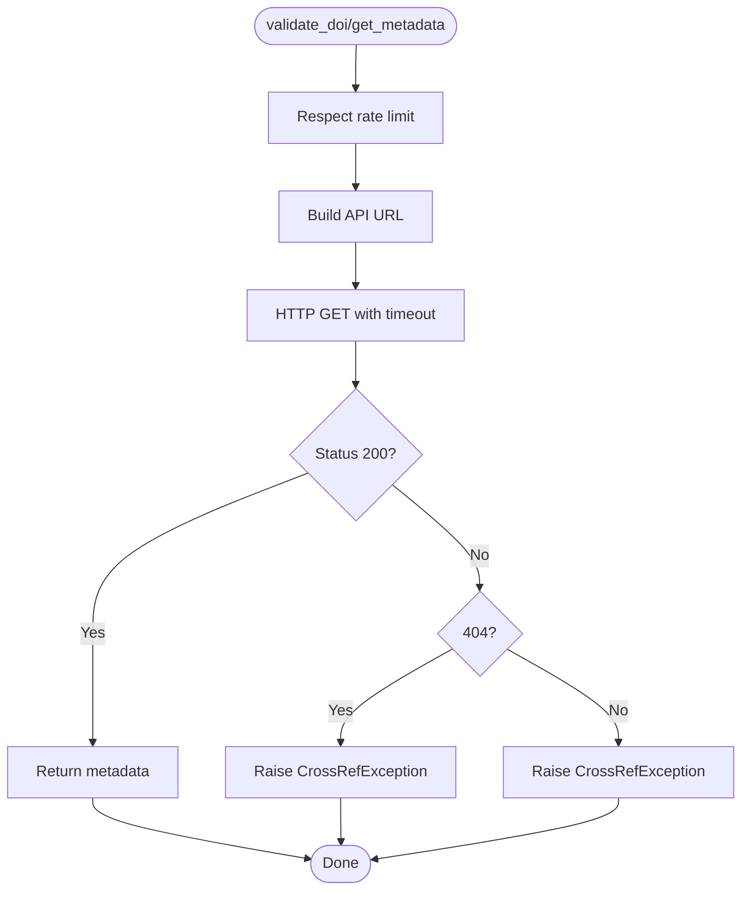
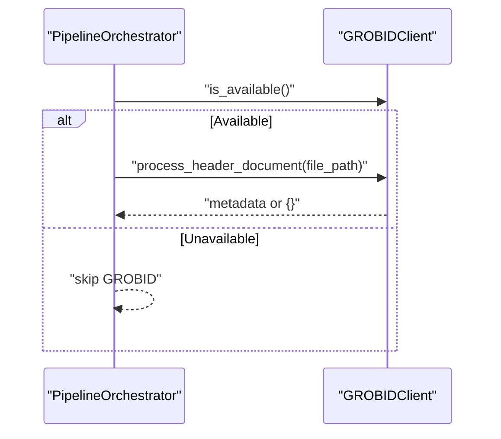
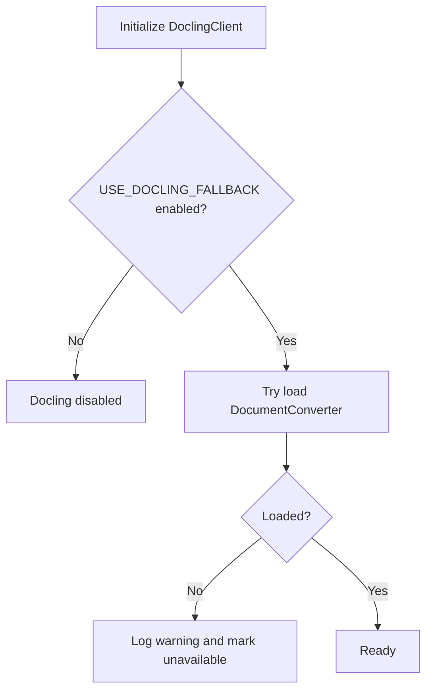
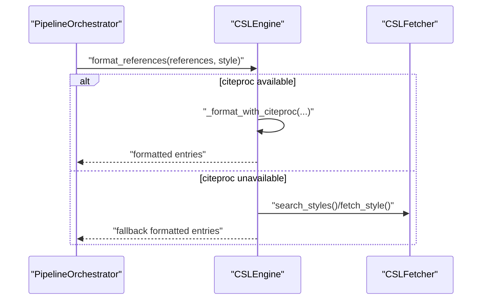
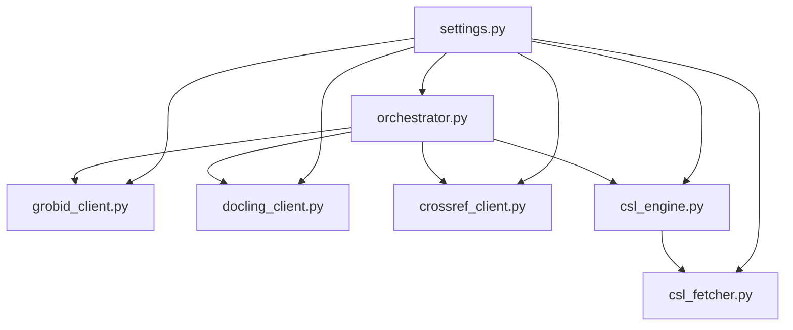

# Pipeline Services

<cite>
**Referenced Files in This Document**
- [crossref_client.py](file://backend/app/pipeline/services/crossref_client.py)
- [grobid_client.py](file://backend/app/pipeline/services/grobid_client.py)
- [docling_client.py](file://backend/app/pipeline/services/docling_client.py)
- [csl_engine.py](file://backend/app/pipeline/services/csl_engine.py)
- [csl_fetcher.py](file://backend/app/pipeline/services/csl_fetcher.py)
- [settings.py](file://backend/app/config/settings.py)
- [orchestrator.py](file://backend/app/pipeline/orchestrator.py)
- [safe_execution.py](file://backend/app/pipeline/safety/safe_execution.py)
- [retry_guard.py](file://backend/app/pipeline/safety/retry_guard.py)
- [health_checks.py](file://backend/app/services/health_checks.py)
- [main.py](file://backend/app/main.py)
- [parser.py](file://backend/app/pipeline/references/parser.py)
</cite>

## Table of Contents
1. [Introduction](#introduction)
2. [Project Structure](#project-structure)
3. [Core Components](#core-components)
4. [Architecture Overview](#architecture-overview)
5. [Detailed Component Analysis](#detailed-component-analysis)
6. [Dependency Analysis](#dependency-analysis)
7. [Performance Considerations](#performance-considerations)
8. [Troubleshooting Guide](#troubleshooting-guide)
9. [Conclusion](#conclusion)
10. [Appendices](#appendices)

## Introduction
This document explains the pipeline services integration for external systems used by the document processing pipeline. It covers the Crossref, GROBID, Docling, and CSL engines, detailing service discovery, connection management, error handling, timeouts, fallbacks, configuration, authentication, and performance optimization. It also provides usage examples, troubleshooting guidance, and monitoring strategies for service health.

## Project Structure
The pipeline integrates external services via dedicated client modules located under backend/app/pipeline/services. Configuration is centralized in settings.py, and orchestration coordinates parallel service calls and timeouts. Health checks expose readiness and health endpoints for monitoring.

**Diagram sources**
- [orchestrator.py:63-95](file://backend/app/pipeline/orchestrator.py#L63-L95)
- [settings.py:134-140](file://backend/app/config/settings.py#L134-L140)
- [crossref_client.py:25-45](file://backend/app/pipeline/services/crossref_client.py#L25-L45)
- [grobid_client.py:25-40](file://backend/app/pipeline/services/grobid_client.py#L25-L40)
- [docling_client.py:143-175](file://backend/app/pipeline/services/docling_client.py#L143-L175)
- [csl_engine.py:38-62](file://backend/app/pipeline/services/csl_engine.py#L38-L62)
- [csl_fetcher.py:13-20](file://backend/app/pipeline/services/csl_fetcher.py#L13-L20)

**Section sources**
- [orchestrator.py:63-95](file://backend/app/pipeline/orchestrator.py#L63-L95)
- [settings.py:134-140](file://backend/app/config/settings.py#L134-L140)

## Core Components
- CrossrefClient: Validates DOIs, retrieves metadata, and computes confidence scores.
- GROBIDClient: Queries GROBID for header metadata and references; parses TEI XML into structured metadata.
- DoclingClient: Performs layout analysis for PDFs, extracting bounding boxes, fonts, and structural elements.
- CSLEngine: Formats references using citeproc-py with fallback deterministic formatters.
- CSLFetcher: Searches and fetches CSL styles with caching and fallback strategies.

**Section sources**
- [crossref_client.py:25-171](file://backend/app/pipeline/services/crossref_client.py#L25-L171)
- [grobid_client.py:25-317](file://backend/app/pipeline/services/grobid_client.py#L25-L317)
- [docling_client.py:143-482](file://backend/app/pipeline/services/docling_client.py#L143-L482)
- [csl_engine.py:38-283](file://backend/app/pipeline/services/csl_engine.py#L38-L283)
- [csl_fetcher.py:13-180](file://backend/app/pipeline/services/csl_fetcher.py#L13-L180)

## Architecture Overview
The pipeline orchestrates parallel extraction from GROBID and Docling for PDFs, enriches references via Crossref, and formats them using CSL. Safety guards wrap operations to prevent cascading failures, while timeouts bound long-running stages. Health checks monitor readiness and overall system health.

**Diagram sources**
- [orchestrator.py:636-755](file://backend/app/pipeline/orchestrator.py#L636-L755)
- [settings.py:176-182](file://backend/app/config/settings.py#L176-L182)
- [grobid_client.py:41-50](file://backend/app/pipeline/services/grobid_client.py#L41-L50)
- [docling_client.py:176-178](file://backend/app/pipeline/services/docling_client.py#L176-L178)
- [crossref_client.py:55-102](file://backend/app/pipeline/services/crossref_client.py#L55-L102)
- [csl_engine.py:98-116](file://backend/app/pipeline/services/csl_engine.py#L98-L116)

## Detailed Component Analysis

### CrossrefClient
- Purpose: Validate DOIs, fetch metadata, and compute confidence scores for reference matching.
- Service Discovery: Uses a fixed base URL for the CrossRef API.
- Authentication: Optional User-Agent header with email for “Polite” pool usage.
- Rate Limiting: Enforces a minimum interval between requests to respect API limits.
- Error Handling: Raises a dedicated exception for network/API errors; callers should catch and handle gracefully.
- Timeout Management: Uses a short timeout for metadata retrieval.
- Fallback Mechanisms: Not applicable; callers should implement fallbacks (e.g., local matching) when unavailable.

**Diagram sources**
- [crossref_client.py:47-102](file://backend/app/pipeline/services/crossref_client.py#L47-L102)

**Section sources**
- [crossref_client.py:25-171](file://backend/app/pipeline/services/crossref_client.py#L25-L171)
- [settings.py](file://backend/app/config/settings.py#L163)

### GROBIDClient
- Purpose: Extract header metadata and references from PDFs via GROBID REST API.
- Service Discovery: Uses configurable base URL and a health endpoint check.
- Authentication: No authentication required by default; configure headers if needed.
- Error Handling: Returns empty results on failure; logs warnings; safe execution decorator ensures resilience.
- Timeout Management: Configurable per-call timeout; health check uses a shorter timeout.
- Fallback Mechanisms: Returns empty metadata on failure; orchestrator falls back to PyMuPDF metadata when both are unavailable.

**Diagram sources**
- [grobid_client.py:41-91](file://backend/app/pipeline/services/grobid_client.py#L41-L91)
- [orchestrator.py:658-686](file://backend/app/pipeline/orchestrator.py#L658-L686)

**Section sources**
- [grobid_client.py:25-317](file://backend/app/pipeline/services/grobid_client.py#L25-L317)
- [settings.py:134-138](file://backend/app/config/settings.py#L134-L138)

### DoclingClient
- Purpose: Perform layout analysis for PDFs to extract bounding boxes, fonts, and structural elements.
- Service Discovery: Dynamically loads the Docling converter; availability depends on environment and settings.
- Authentication: No authentication required.
- Error Handling: Returns empty layout on failure; logs warnings; safe execution decorator ensures resilience.
- Timeout Management: Uses a long timeout appropriate for layout analysis; orchestrator applies per-call timeout.
- Fallback Mechanisms: Disabled by feature flag; skipped for digital-native PDFs when configured.

**Diagram sources**
- [docling_client.py:50-175](file://backend/app/pipeline/services/docling_client.py#L50-L175)

**Section sources**
- [docling_client.py:143-482](file://backend/app/pipeline/services/docling_client.py#L143-L482)
- [settings.py](file://backend/app/config/settings.py#L139)

### CSLEngine and CSLFetcher
- Purpose: Format references using CSL styles with citeproc-py; fallback to deterministic formatters when unavailable. Search and fetch styles with caching.
- Service Discovery: Resolves style paths from built-in templates or external sources; caches results.
- Authentication: None required for local styles; fetching remote styles uses public endpoints.
- Error Handling: Falls back to deterministic formatting on citeproc errors; returns empty lists on fetch failures.
- Timeout Management: Fetch operations use bounded timeouts; caches TTL controlled by settings.
- Fallback Mechanisms: Deterministic APA/IEEE formatters; local styles fallback; remote fetch fallback to local.

**Diagram sources**
- [csl_engine.py:98-140](file://backend/app/pipeline/services/csl_engine.py#L98-L140)
- [csl_fetcher.py:80-136](file://backend/app/pipeline/services/csl_fetcher.py#L80-L136)

**Section sources**
- [csl_engine.py:38-283](file://backend/app/pipeline/services/csl_engine.py#L38-L283)
- [csl_fetcher.py:13-180](file://backend/app/pipeline/services/csl_fetcher.py#L13-L180)
- [settings.py:167-168](file://backend/app/config/settings.py#L167-L168)

## Dependency Analysis
- Configuration-driven behavior: Clients read settings for URLs, timeouts, and feature flags.
- Parallel orchestration: GROBID and Docling are executed concurrently with per-service timeouts.
- Safety wrappers: Functions are wrapped with safe execution and retry decorators to improve resilience.
- Health monitoring: Readiness and health endpoints aggregate component status.

**Diagram sources**
- [settings.py:134-182](file://backend/app/config/settings.py#L134-L182)
- [orchestrator.py:636-755](file://backend/app/pipeline/orchestrator.py#L636-L755)
- [grobid_client.py:31-40](file://backend/app/pipeline/services/grobid_client.py#L31-L40)
- [docling_client.py:155-164](file://backend/app/pipeline/services/docling_client.py#L155-L164)
- [crossref_client.py:28-45](file://backend/app/pipeline/services/crossref_client.py#L28-L45)
- [csl_engine.py:47-49](file://backend/app/pipeline/services/csl_engine.py#L47-L49)
- [csl_fetcher.py:13-14](file://backend/app/pipeline/services/csl_fetcher.py#L13-L14)

**Section sources**
- [settings.py:134-182](file://backend/app/config/settings.py#L134-L182)
- [orchestrator.py:636-755](file://backend/app/pipeline/orchestrator.py#L636-L755)

## Performance Considerations
- Concurrency and timeouts:
  - GROBID and Docling are executed in parallel with separate timeouts to avoid blocking the pipeline.
  - Timeouts are configurable via settings for both services.
- Rate limiting:
  - Crossref client enforces a minimum inter-request interval to respect API limits.
- Feature flags:
  - Docling can be disabled or skipped for digital-native PDFs to reduce latency.
  - GROBID can be disabled via a setting.
- Caching:
  - CSL search and style fetch use in-memory caches with TTLs controlled by settings.
- Memory and model loading:
  - AI models are preloaded at startup when enabled; low-memory mode disables certain features.

**Section sources**
- [orchestrator.py:689-715](file://backend/app/pipeline/orchestrator.py#L689-L715)
- [settings.py:176-182](file://backend/app/config/settings.py#L176-L182)
- [crossref_client.py:30-53](file://backend/app/pipeline/services/crossref_client.py#L30-L53)
- [csl_fetcher.py:23-38](file://backend/app/pipeline/services/csl_fetcher.py#L23-L38)
- [settings.py:380-413](file://backend/app/config/settings.py#L380-L413)

## Troubleshooting Guide
- Service connectivity issues:
  - Verify GROBID URL and readiness endpoint; ensure GROBID is enabled in settings.
  - Confirm Docling availability and feature flags; check environment for required libraries.
  - Validate Crossref mailto configuration for polite pool usage.
- Timeouts and slow responses:
  - Adjust per-service timeouts in settings.
  - Consider disabling Docling for digital-native PDFs to skip layout analysis.
- Error handling and fallbacks:
  - GROBID and Docling return empty results on failure; orchestrator falls back to PyMuPDF metadata when both are unavailable.
  - CSL formatting falls back to deterministic formatters when citeproc is unavailable.
- Monitoring service health:
  - Use readiness and health endpoints to check database, LLM, and external service status.
  - Expose metrics via Prometheus instrumentation.

**Section sources**
- [health_checks.py:154-192](file://backend/app/services/health_checks.py#L154-L192)
- [main.py:360-380](file://backend/app/main.py#L360-L380)
- [grobid_client.py:41-50](file://backend/app/pipeline/services/grobid_client.py#L41-L50)
- [docling_client.py:176-178](file://backend/app/pipeline/services/docling_client.py#L176-L178)
- [crossref_client.py:41-45](file://backend/app/pipeline/services/crossref_client.py#L41-L45)
- [csl_engine.py:105-115](file://backend/app/pipeline/services/csl_engine.py#L105-L115)

## Conclusion
The pipeline integrates external services through robust clients with explicit configuration, timeouts, and fallbacks. Safety decorators and health checks ensure resilient operation, while settings provide fine-grained control over behavior and performance. By leveraging parallel execution, caching, and feature flags, the system balances quality and throughput across diverse workloads.

## Appendices

### Configuration Reference
- GROBID configuration:
  - GROBID_URL, GROBID_BASE_URL, GROBID_TIMEOUT, GROBID_MAX_RETRIES, GROBID_ENABLED
- Docling configuration:
  - USE_DOCLING_FALLBACK, PIPELINE_DOCLING_TIMEOUT_SECONDS
- Crossref configuration:
  - CROSSREF_MAILTO, CROSSREF_MAX_WORKERS
- CSL caching:
  - CSL_SEARCH_CACHE_TTL_SECONDS, CSL_FETCH_CACHE_TTL_SECONDS
- General pipeline tuning:
  - PIPELINE_GROBID_TIMEOUT_SECONDS, PIPELINE_DOCLING_TIMEOUT_SECONDS, PIPELINE_ACQUIRE_TIMEOUT_SECONDS

**Section sources**
- [settings.py:134-191](file://backend/app/config/settings.py#L134-L191)
- [settings.py:167-173](file://backend/app/config/settings.py#L167-L173)

### Usage Examples
- Running parallel extraction for PDFs:
  - The orchestrator submits GROBID and Docling tasks concurrently with per-service timeouts.
- Formatting references with CSL:
  - The engine attempts citeproc formatting; on failure, it falls back to deterministic formatters.
- Searching and fetching styles:
  - The fetcher searches local and remote styles with caching and returns combined results.

**Section sources**
- [orchestrator.py:658-715](file://backend/app/pipeline/orchestrator.py#L658-L715)
- [csl_engine.py:98-140](file://backend/app/pipeline/services/csl_engine.py#L98-L140)
- [csl_fetcher.py:80-136](file://backend/app/pipeline/services/csl_fetcher.py#L80-L136)