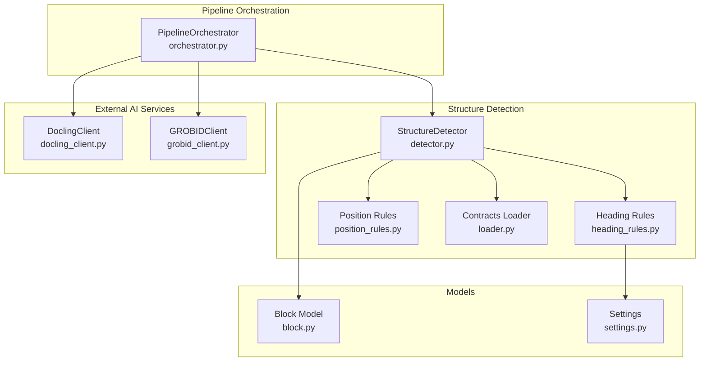
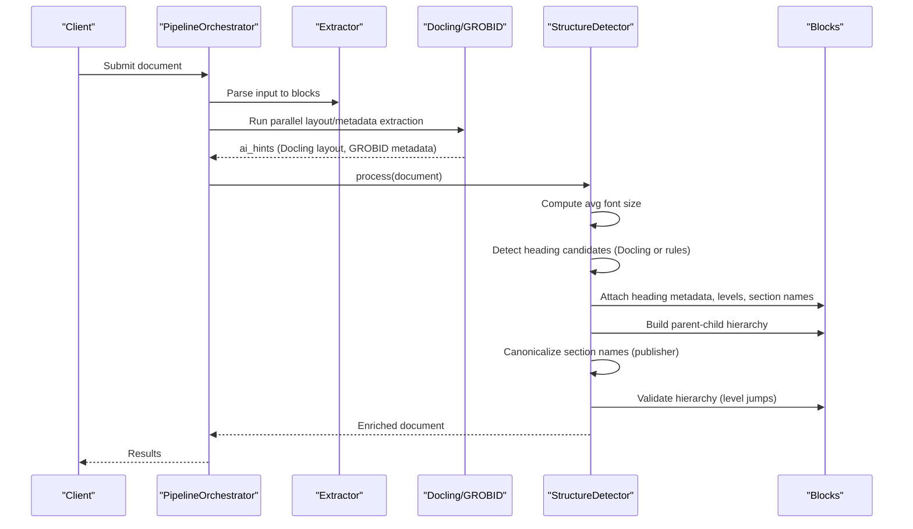
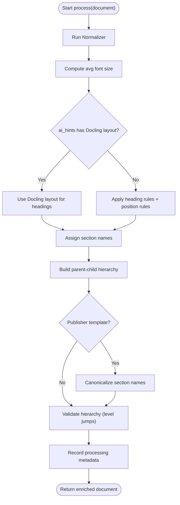
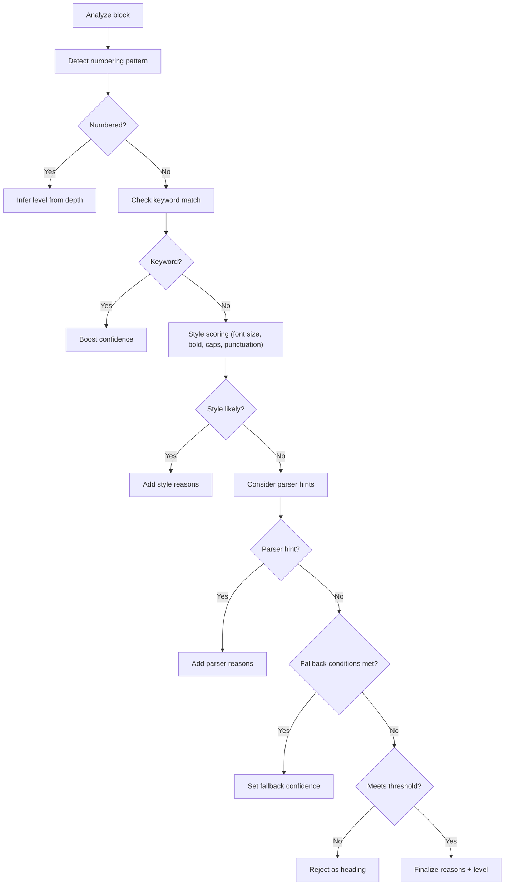
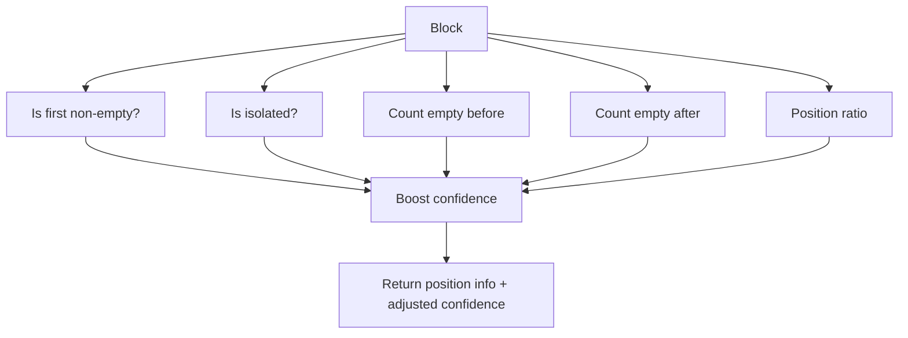
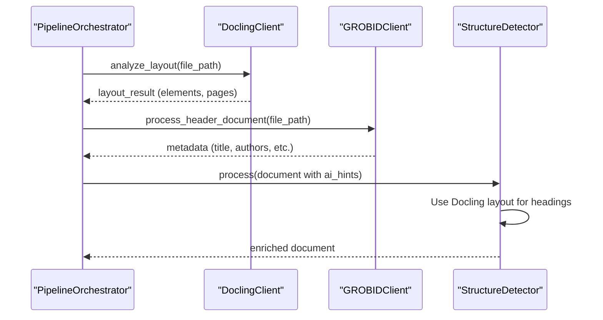
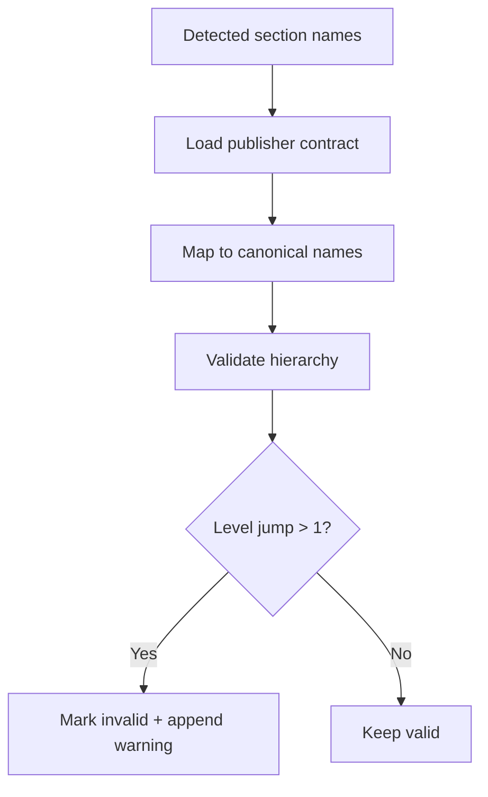
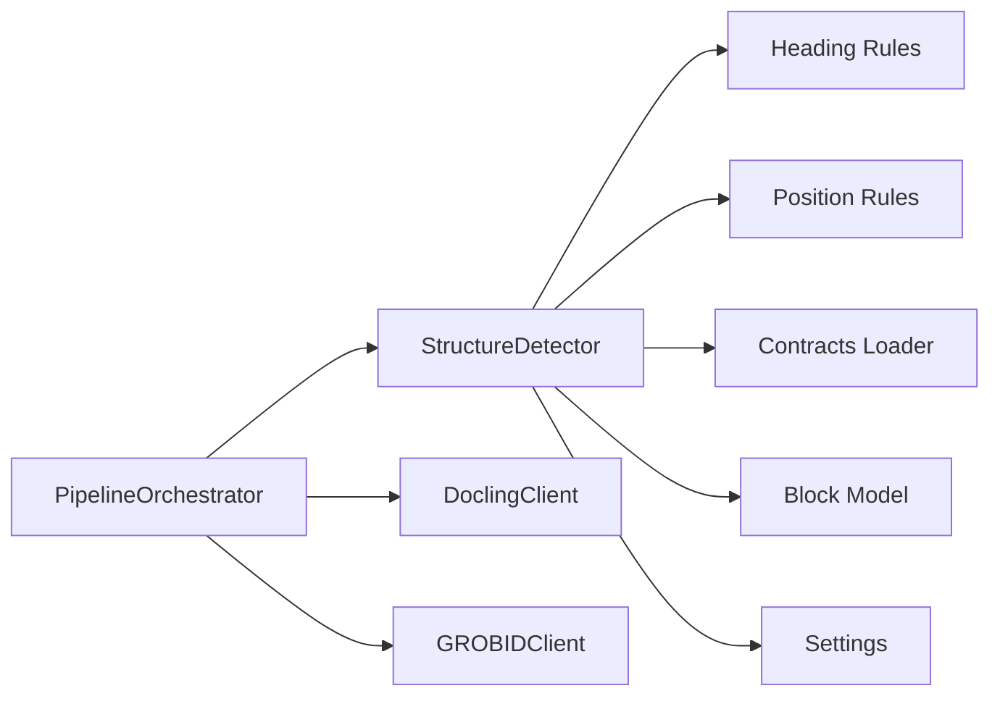

# Structure Detection

<cite>
**Referenced Files in This Document**
- [detector.py](file://backend/app/pipeline/structure_detection/detector.py)
- [heading_rules.py](file://backend/app/pipeline/structure_detection/heading_rules.py)
- [position_rules.py](file://backend/app/pipeline/structure_detection/position_rules.py)
- [__init__.py](file://backend/app/pipeline/structure_detection/__init__.py)
- [orchestrator.py](file://backend/app/pipeline/orchestrator.py)
- [docling_client.py](file://backend/app/pipeline/services/docling_client.py)
- [grobid_client.py](file://backend/app/pipeline/services/grobid_client.py)
- [settings.py](file://backend/app/config/settings.py)
- [block.py](file://backend/app/models/block.py)
- [loader.py](file://backend/app/pipeline/contracts/loader.py)
- [test_structure_detector_docling.py](file://backend/tests/test_structure_detector_docling.py)
- [test_docling_integration.py](file://backend/tests/integration/test_docling_integration.py)
</cite>

## Table of Contents
1. [Introduction](#introduction)
2. [Project Structure](#project-structure)
3. [Core Components](#core-components)
4. [Architecture Overview](#architecture-overview)
5. [Detailed Component Analysis](#detailed-component-analysis)
6. [Dependency Analysis](#dependency-analysis)
7. [Performance Considerations](#performance-considerations)
8. [Troubleshooting Guide](#troubleshooting-guide)
9. [Conclusion](#conclusion)

## Introduction
This document explains the structure detection system that identifies headings, infers section boundaries, and builds hierarchical relationships for academic manuscripts. It covers:
- Heading identification algorithms (keyword, numbering, style, parser hints)
- Position-based heuristics for confidence boosting
- Integration with external AI services (Docling layout analysis and GROBID metadata)
- Canonical section renaming via publisher contracts
- Structure validation and hierarchy checks
- Confidence scoring and error correction mechanisms
- Examples, rule configuration, and troubleshooting

## Project Structure
The structure detection pipeline resides under backend/app/pipeline/structure_detection and integrates with the broader pipeline orchestration and external services.

**Diagram sources**
- [detector.py:27-121](file://backend/app/pipeline/structure_detection/detector.py#L27-L121)
- [heading_rules.py:1-397](file://backend/app/pipeline/structure_detection/heading_rules.py#L1-L397)
- [position_rules.py:1-231](file://backend/app/pipeline/structure_detection/position_rules.py#L1-L231)
- [orchestrator.py:466-470](file://backend/app/pipeline/orchestrator.py#L466-L470)
- [docling_client.py:143-178](file://backend/app/pipeline/services/docling_client.py#L143-L178)
- [grobid_client.py:25-51](file://backend/app/pipeline/services/grobid_client.py#L25-L51)
- [block.py:86-209](file://backend/app/models/block.py#L86-L209)
- [settings.py:118-124](file://backend/app/config/settings.py#L118-L124)

**Section sources**
- [__init__.py:1-6](file://backend/app/pipeline/structure_detection/__init__.py#L1-L6)
- [orchestrator.py:466-470](file://backend/app/pipeline/orchestrator.py#L466-L470)

## Core Components
- StructureDetector: Main orchestrator that computes average font size, detects heading candidates (rule-based and Docling-enhanced), assigns section names, builds hierarchy, canonicalizes section names, validates hierarchy, and records processing metadata.
- Heading Rules Engine: Implements keyword matching, numbering pattern detection, style heuristics, parser hints, and fallback logic with dynamic thresholds.
- Position Rules Engine: Provides positional cues (first block, isolation, blank-line counts, position ratio) and boosts confidence accordingly.
- Contracts Loader: Loads publisher-specific canonical section names and required sections.
- External AI Services: Docling for layout-aware heading detection and GROBID for metadata enrichment.

**Section sources**
- [detector.py:27-121](file://backend/app/pipeline/structure_detection/detector.py#L27-L121)
- [heading_rules.py:232-397](file://backend/app/pipeline/structure_detection/heading_rules.py#L232-L397)
- [position_rules.py:147-231](file://backend/app/pipeline/structure_detection/position_rules.py#L147-L231)
- [loader.py:59-74](file://backend/app/pipeline/contracts/loader.py#L59-L74)

## Architecture Overview
The pipeline runs in stages. Structure detection is invoked after text extraction and optional AI metadata/layout passes. It enriches blocks with heading metadata and hierarchical relationships without assigning final semantic block types.

**Diagram sources**
- [orchestrator.py:635-779](file://backend/app/pipeline/orchestrator.py#L635-L779)
- [detector.py:47-121](file://backend/app/pipeline/structure_detection/detector.py#L47-L121)
- [docling_client.py:180-289](file://backend/app/pipeline/services/docling_client.py#L180-L289)
- [grobid_client.py:52-92](file://backend/app/pipeline/services/grobid_client.py#L52-L92)

## Detailed Component Analysis

### StructureDetector
Responsibilities:
- Enforces normalization, computes average font size, and selects detection strategy.
- Uses Docling layout data when available; otherwise applies rule-based heuristics.
- Assigns section names to blocks based on the most recent heading.
- Builds parent-child relationships among headings.
- Canonicalizes section names according to publisher contracts.
- Validates hierarchy for level jumps and records processing metadata.

Key behaviors:
- Docling path: Matches layout elements to blocks, infers heading levels from font size hierarchy, and filters out header/footer regions.
- Rule-based path: Applies heading rules and position rules to compute confidence and levels.
- Safety: Wrapped with safe execution to prevent crashes and log fallbacks.

**Diagram sources**
- [detector.py:47-121](file://backend/app/pipeline/structure_detection/detector.py#L47-L121)
- [detector.py:381-544](file://backend/app/pipeline/structure_detection/detector.py#L381-L544)

**Section sources**
- [detector.py:47-121](file://backend/app/pipeline/structure_detection/detector.py#L47-L121)
- [detector.py:381-544](file://backend/app/pipeline/structure_detection/detector.py#L381-L544)

### Heading Rules Engine
Core logic:
- Numbering pattern detection supports decimal and Roman numerals, inferring heading levels from depth.
- Keyword matching against a curated list of academic section headings with strict length and prefix guards.
- Style heuristics: font size outliers, boldness, upper-case tendency, and punctuation penalties.
- Parser hints: leverages upstream parser signals for potential headings and levels.
- Fallback logic: short, isolated, title-case lines can be considered with a dynamic fallback confidence.
- Abstract safety: suppresses false positives immediately after “Abstract” until a strong new section marker appears.

Dynamic thresholds:
- Confidence thresholds are configurable via settings and clamped to [0,1].

**Diagram sources**
- [heading_rules.py:232-397](file://backend/app/pipeline/structure_detection/heading_rules.py#L232-L397)

**Section sources**
- [heading_rules.py:45-82](file://backend/app/pipeline/structure_detection/heading_rules.py#L45-L82)
- [heading_rules.py:117-145](file://backend/app/pipeline/structure_detection/heading_rules.py#L117-L145)
- [heading_rules.py:147-186](file://backend/app/pipeline/structure_detection/heading_rules.py#L147-L186)
- [heading_rules.py:232-397](file://backend/app/pipeline/structure_detection/heading_rules.py#L232-L397)
- [settings.py:118-124](file://backend/app/config/settings.py#L118-L124)

### Position-Based Heuristics
Functions:
- First non-empty block detection (strong indicator of title)
- Isolation detection (line surrounded by blank lines)
- Blank-line counts before/after a block
- Position ratio (near start/end of document)
- Confidence boosting based on positional cues

**Diagram sources**
- [position_rules.py:15-198](file://backend/app/pipeline/structure_detection/position_rules.py#L15-L198)
- [position_rules.py:201-231](file://backend/app/pipeline/structure_detection/position_rules.py#L201-L231)

**Section sources**
- [position_rules.py:15-198](file://backend/app/pipeline/structure_detection/position_rules.py#L15-L198)
- [position_rules.py:201-231](file://backend/app/pipeline/structure_detection/position_rules.py#L201-L231)

### Integration with External AI Services
- Docling: Provides layout elements with bounding boxes, font sizes, and types. StructureDetector matches Docling elements to blocks, infers heading levels from font size hierarchy, and ignores top regions (logo/header tolerance).
- GROBID: Extracts metadata (title, authors, affiliations, abstract, keywords) and merges into ai_hints for downstream stages.
- Orchestrator: Runs Docling and GROBID in parallel during extraction, with timeouts and fallbacks.

**Diagram sources**
- [orchestrator.py:635-755](file://backend/app/pipeline/orchestrator.py#L635-L755)
- [docling_client.py:180-289](file://backend/app/pipeline/services/docling_client.py#L180-L289)
- [grobid_client.py:52-92](file://backend/app/pipeline/services/grobid_client.py#L52-L92)
- [detector.py:70-86](file://backend/app/pipeline/structure_detection/detector.py#L70-L86)

**Section sources**
- [docling_client.py:143-178](file://backend/app/pipeline/services/docling_client.py#L143-L178)
- [grobid_client.py:25-51](file://backend/app/pipeline/services/grobid_client.py#L25-L51)
- [orchestrator.py:635-755](file://backend/app/pipeline/orchestrator.py#L635-L755)
- [detector.py:67-86](file://backend/app/pipeline/structure_detection/detector.py#L67-L86)

### Canonical Section Names and Validation
- Canonicalization: Uses publisher contracts to rename detected sections to standardized names.
- Validation: Checks for excessive level jumps (e.g., jumping from level 1 to level 3) and marks blocks invalid with warnings.

**Diagram sources**
- [detector.py:349-379](file://backend/app/pipeline/structure_detection/detector.py#L349-L379)
- [loader.py:59-74](file://backend/app/pipeline/contracts/loader.py#L59-L74)

**Section sources**
- [detector.py:349-379](file://backend/app/pipeline/structure_detection/detector.py#L349-L379)
- [loader.py:59-74](file://backend/app/pipeline/contracts/loader.py#L59-L74)

## Dependency Analysis
- StructureDetector depends on:
  - Heading rules for candidate detection
  - Position rules for confidence boosting
  - Contracts loader for canonicalization
  - Docling/GROBID for layout/metadata hints
  - Block model for metadata fields (level, parent_id, section_name, warnings)
- Settings drive thresholds and pipeline behavior.

**Diagram sources**
- [detector.py:16-25](file://backend/app/pipeline/structure_detection/detector.py#L16-L25)
- [heading_rules.py:12-16](file://backend/app/pipeline/structure_detection/heading_rules.py#L12-L16)
- [position_rules.py:11-12](file://backend/app/pipeline/structure_detection/position_rules.py#L11-L12)
- [loader.py:8-14](file://backend/app/pipeline/contracts/loader.py#L8-L14)
- [block.py:86-209](file://backend/app/models/block.py#L86-L209)
- [settings.py:118-124](file://backend/app/config/settings.py#L118-L124)
- [orchestrator.py:58-94](file://backend/app/pipeline/orchestrator.py#L58-L94)

**Section sources**
- [detector.py:16-25](file://backend/app/pipeline/structure_detection/detector.py#L16-L25)
- [heading_rules.py:12-16](file://backend/app/pipeline/structure_detection/heading_rules.py#L12-L16)
- [position_rules.py:11-12](file://backend/app/pipeline/structure_detection/position_rules.py#L11-L12)
- [loader.py:8-14](file://backend/app/pipeline/contracts/loader.py#L8-L14)
- [block.py:86-209](file://backend/app/models/block.py#L86-L209)
- [settings.py:118-124](file://backend/app/config/settings.py#L118-L124)
- [orchestrator.py:58-94](file://backend/app/pipeline/orchestrator.py#L58-L94)

## Performance Considerations
- Docling path: Faster and more accurate for scanned or layout-rich PDFs; includes logo/header tolerance and font-size-based level inference.
- Rule-based path: Robust fallback with minimal overhead; uses median font size to avoid outliers.
- Position rules: Constant-time checks per block; negligible cost.
- Parallel AI extraction: Docling and GROBID run concurrently with bounded timeouts to reduce latency.
- Safety wrappers: Ensure graceful degradation when external services are unavailable.

[No sources needed since this section provides general guidance]

## Troubleshooting Guide
Common issues and resolutions:
- No headings detected:
  - Verify Docling availability and timeouts; confirm layout elements are present.
  - Ensure blocks are normalized and not marked as header/footer.
  - Check thresholds in settings if relying on style heuristics.
- Incorrect heading levels:
  - Review numbering patterns; ensure proper decimal/Roman formatting.
  - Adjust style thresholds if overly strict.
- Abstract false positives:
  - Confirm abstract safety guard is active; avoid short lines immediately after “Abstract” unless they are strong new section markers.
- Section name mismatches:
  - Validate publisher template selection; confirm canonical mapping exists.
- Level jump warnings:
  - Inspect hierarchy construction; ensure parent-child relationships align with intended nesting.

Validation and confidence:
- Blocks carry warnings and validity flags; inspect metadata for diagnostic messages.
- Confidence scores are stored in block metadata for downstream review logic.

**Section sources**
- [detector.py:361-379](file://backend/app/pipeline/structure_detection/detector.py#L361-L379)
- [heading_rules.py:291-326](file://backend/app/pipeline/structure_detection/heading_rules.py#L291-L326)
- [settings.py:232-247](file://backend/app/config/settings.py#L232-L247)

## Conclusion
The structure detection system combines robust rule-based heuristics with layout-aware AI assistance to reliably identify headings, infer section boundaries, and construct hierarchical relationships. It integrates seamlessly with the broader pipeline, supports publisher-specific canonicalization, and maintains resilience through safety wrappers and validation checks. Tunable thresholds and position-based confidence boosting enable fine-grained control for diverse document types.