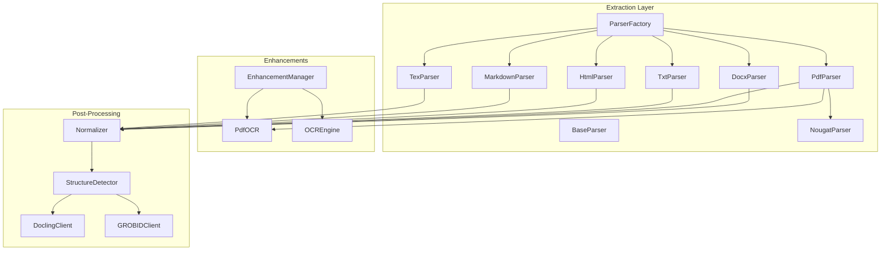
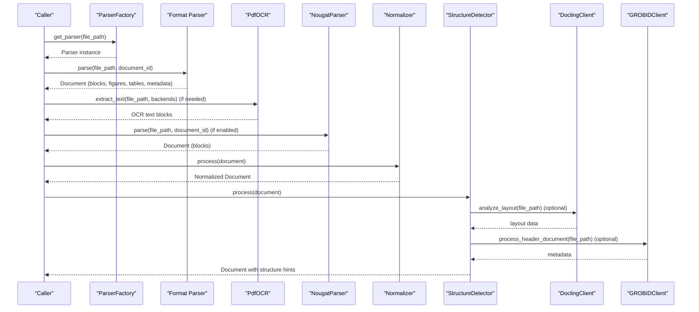
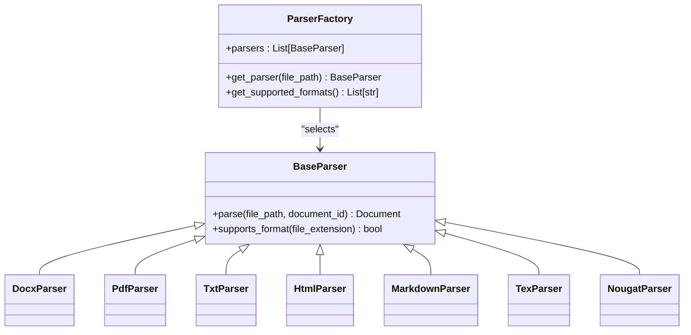
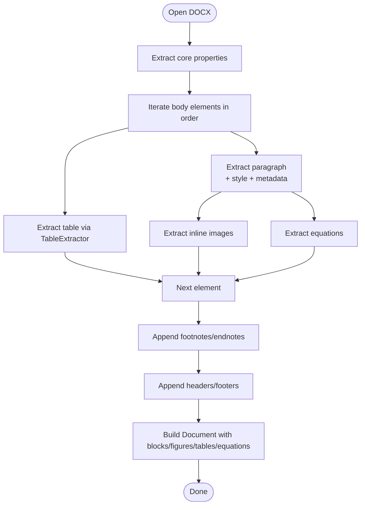
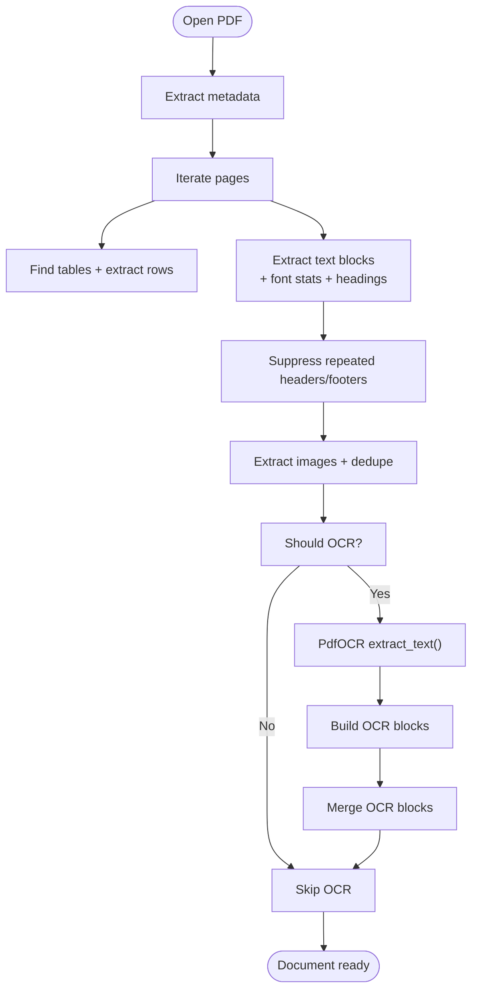
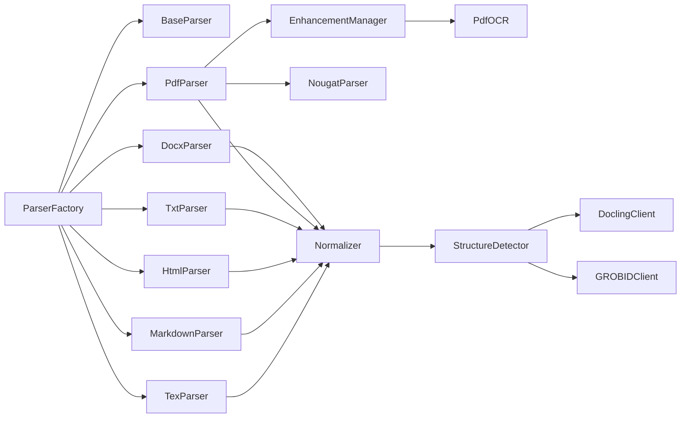

# Text Extraction

<cite>
**Referenced Files in This Document**
- [parser_factory.py](file://backend/app/pipeline/parsing/parser_factory.py)
- [base_parser.py](file://backend/app/pipeline/parsing/base_parser.py)
- [parser.py](file://backend/app/pipeline/parsing/parser.py)
- [pdf_parser.py](file://backend/app/pipeline/parsing/pdf_parser.py)
- [txt_parser.py](file://backend/app/pipeline/parsing/txt_parser.py)
- [html_parser.py](file://backend/app/pipeline/parsing/html_parser.py)
- [md_parser.py](file://backend/app/pipeline/parsing/md_parser.py)
- [tex_parser.py](file://backend/app/pipeline/parsing/tex_parser.py)
- [nougat_parser.py](file://backend/app/pipeline/parsing/nougat_parser.py)
- [ocr_engine.py](file://backend/app/pipeline/parsing/ocr_engine.py)
- [pdf_ocr.py](file://backend/app/pipeline/ocr/pdf_ocr.py)
- [grobid_client.py](file://backend/app/pipeline/services/grobid_client.py)
- [docling_client.py](file://backend/app/pipeline/services/docling_client.py)
- [enhancement_manager.py](file://backend/app/services/enhancement_manager.py)
- [detector.py](file://backend/app/pipeline/structure_detection/detector.py)
- [normalizer.py](file://backend/app/pipeline/normalization/normalizer.py)
</cite>

## Table of Contents
1. [Introduction](#introduction)
2. [Project Structure](#project-structure)
3. [Core Components](#core-components)
4. [Architecture Overview](#architecture-overview)
5. [Detailed Component Analysis](#detailed-component-analysis)
6. [Dependency Analysis](#dependency-analysis)
7. [Performance Considerations](#performance-considerations)
8. [Troubleshooting Guide](#troubleshooting-guide)
9. [Conclusion](#conclusion)

## Introduction
This document describes the text extraction system used in the automated manuscript formatter. It focuses on the ParserFactory pattern, format-specific extraction algorithms, OCR fallback for scanned PDFs, metadata extraction, block-based document structure, text normalization, layout preservation, and integrations with external services such as GROBID and Docling. It also covers performance optimizations, error handling, and debugging strategies for extraction failures.

## Project Structure
The text extraction pipeline is organized around a factory-driven parser selection and a staged processing model:
- Factory-driven parser selection for multiple input formats
- Format-specific parsers for DOCX, PDF, TXT, HTML, Markdown, and LaTeX
- OCR fallback for scanned PDFs using Tesseract/PaddleOCR and optional Nougat neural parsing
- Normalization and structure detection stages
- Integrations with GROBID for metadata and Docling for layout analysis

**Diagram sources**
- [parser_factory.py:25-166](file://backend/app/pipeline/parsing/parser_factory.py#L25-L166)
- [base_parser.py:12-45](file://backend/app/pipeline/parsing/base_parser.py#L12-L45)
- [parser.py:61-165](file://backend/app/pipeline/parsing/parser.py#L61-L165)
- [pdf_parser.py:39-131](file://backend/app/pipeline/parsing/pdf_parser.py#L39-L131)
- [txt_parser.py:27-95](file://backend/app/pipeline/parsing/txt_parser.py#L27-L95)
- [html_parser.py:39-120](file://backend/app/pipeline/parsing/html_parser.py#L39-L120)
- [md_parser.py:35-113](file://backend/app/pipeline/parsing/md_parser.py#L35-L113)
- [tex_parser.py:33-106](file://backend/app/pipeline/parsing/tex_parser.py#L33-L106)
- [nougat_parser.py:150-303](file://backend/app/pipeline/parsing/nougat_parser.py#L150-L303)
- [ocr_engine.py:48-290](file://backend/app/pipeline/parsing/ocr_engine.py#L48-L290)
- [pdf_ocr.py:57-231](file://backend/app/pipeline/ocr/pdf_ocr.py#L57-L231)
- [enhancement_manager.py:78-294](file://backend/app/services/enhancement_manager.py#L78-L294)
- [normalizer.py:39-107](file://backend/app/pipeline/normalization/normalizer.py#L39-L107)
- [detector.py:27-122](file://backend/app/pipeline/structure_detection/detector.py#L27-L122)
- [docling_client.py:143-290](file://backend/app/pipeline/services/docling_client.py#L143-L290)
- [grobid_client.py:25-137](file://backend/app/pipeline/services/grobid_client.py#L25-L137)

**Section sources**
- [parser_factory.py:25-166](file://backend/app/pipeline/parsing/parser_factory.py#L25-L166)
- [base_parser.py:12-45](file://backend/app/pipeline/parsing/base_parser.py#L12-L45)

## Core Components
- ParserFactory: Selects the appropriate parser based on file extension, with graceful handling for missing dependencies and optional Nougat support.
- Format-specific parsers:
  - DocxParser: Extracts paragraphs, tables, figures, footnotes, headers/footers, and equations from DOCX.
  - PdfParser: Extracts text, tables, and images from PDF using PyMuPDF, with OCR fallback for sparse-text PDFs.
  - TxtParser: Splits plain text into blocks, detects headings and lists.
  - HtmlParser: Extracts headings, paragraphs, lists, code blocks, tables, and images from HTML.
  - MarkdownParser: Extracts headings, lists, code blocks, tables, blockquotes, footnotes, and images from Markdown.
  - TexParser: Extracts metadata, sections, lists, tables, images, and equations from LaTeX.
- OCR subsystems:
  - PdfOCR: Backend chain for scanned PDF OCR using Tesseract and PaddleOCR.
  - OCREngine: Surya-based OCR/layout/reading order engine.
  - NougatParser: Neural PDF parsing for academic documents with fallback model selection.
- Integrations:
  - DoclingClient: Layout analysis for bounding boxes, fonts, and structural elements.
  - GROBIDClient: Bibliographic metadata extraction from PDFs.
- Stages:
  - Normalizer: Cleans text, normalizes metadata, splits merged blocks, consolidates headings, filters duplicates.
  - StructureDetector: Detects headings, levels, sections, and hierarchy using rule-based heuristics and Docling layout data.

**Section sources**
- [parser_factory.py:25-166](file://backend/app/pipeline/parsing/parser_factory.py#L25-L166)
- [parser.py:61-165](file://backend/app/pipeline/parsing/parser.py#L61-L165)
- [pdf_parser.py:39-131](file://backend/app/pipeline/parsing/pdf_parser.py#L39-L131)
- [txt_parser.py:27-95](file://backend/app/pipeline/parsing/txt_parser.py#L27-L95)
- [html_parser.py:39-120](file://backend/app/pipeline/parsing/html_parser.py#L39-L120)
- [md_parser.py:35-113](file://backend/app/pipeline/parsing/md_parser.py#L35-L113)
- [tex_parser.py:33-106](file://backend/app/pipeline/parsing/tex_parser.py#L33-L106)
- [nougat_parser.py:150-303](file://backend/app/pipeline/parsing/nougat_parser.py#L150-L303)
- [ocr_engine.py:48-290](file://backend/app/pipeline/parsing/ocr_engine.py#L48-L290)
- [pdf_ocr.py:57-231](file://backend/app/pipeline/ocr/pdf_ocr.py#L57-L231)
- [docling_client.py:143-290](file://backend/app/pipeline/services/docling_client.py#L143-L290)
- [grobid_client.py:25-137](file://backend/app/pipeline/services/grobid_client.py#L25-L137)
- [normalizer.py:39-107](file://backend/app/pipeline/normalization/normalizer.py#L39-L107)
- [detector.py:27-122](file://backend/app/pipeline/structure_detection/detector.py#L27-L122)

## Architecture Overview
The extraction pipeline follows a staged flow:
1. ParserFactory selects a parser based on file extension.
2. The chosen parser extracts raw content into a Document model with blocks, figures, tables, and metadata.
3. Optional OCR fallback enriches PDF content when text density is low.
4. Normalizer cleans and prepares text without altering structure.
5. StructureDetector infers headings, levels, and sections, optionally using Docling layout data.
6. Integrations (Docling, GROBID) enhance layout and metadata.

**Diagram sources**
- [parser_factory.py:95-166](file://backend/app/pipeline/parsing/parser_factory.py#L95-L166)
- [pdf_parser.py:164-218](file://backend/app/pipeline/parsing/pdf_parser.py#L164-L218)
- [nougat_parser.py:231-303](file://backend/app/pipeline/parsing/nougat_parser.py#L231-L303)
- [pdf_ocr.py:83-129](file://backend/app/pipeline/ocr/pdf_ocr.py#L83-L129)
- [normalizer.py:51-107](file://backend/app/pipeline/normalization/normalizer.py#L51-L107)
- [detector.py:47-122](file://backend/app/pipeline/structure_detection/detector.py#L47-L122)
- [docling_client.py:192-290](file://backend/app/pipeline/services/docling_client.py#L192-L290)
- [grobid_client.py:52-137](file://backend/app/pipeline/services/grobid_client.py#L52-L137)

## Detailed Component Analysis

### ParserFactory Pattern
- Purpose: Centralized selection of the correct parser based on file extension.
- Behavior:
  - Initializes parsers conditionally, logging warnings for missing dependencies.
  - Supports optional Nougat parser controlled by settings.
  - Provides a safe lookup with informative error messages when no parser supports the format.
  - Enumerates supported formats across all registered parsers.

**Diagram sources**
- [base_parser.py:12-45](file://backend/app/pipeline/parsing/base_parser.py#L12-L45)
- [parser_factory.py:25-166](file://backend/app/pipeline/parsing/parser_factory.py#L25-L166)

**Section sources**
- [parser_factory.py:25-166](file://backend/app/pipeline/parsing/parser_factory.py#L25-L166)
- [base_parser.py:12-45](file://backend/app/pipeline/parsing/base_parser.py#L12-L45)

### DOCX Extraction Algorithm
- Core steps:
  - Open document and extract core properties (title, authors, subject, keywords, dates).
  - Traverse body elements in order (paragraphs and tables intermixed).
  - Extract inline images and equations, anchoring them to the preceding block.
  - Extract footnotes and endnotes, appending them after the main body.
  - Extract headers and footers from all sections, marking metadata and section indices.
  - Build Document with blocks, figures, tables, and equations, plus processing history.

**Diagram sources**
- [parser.py:82-165](file://backend/app/pipeline/parsing/parser.py#L82-L165)
- [parser.py:340-413](file://backend/app/pipeline/parsing/parser.py#L340-L413)
- [parser.py:166-270](file://backend/app/pipeline/parsing/parser.py#L166-L270)
- [parser.py:271-303](file://backend/app/pipeline/parsing/parser.py#L271-L303)

**Section sources**
- [parser.py:61-165](file://backend/app/pipeline/parsing/parser.py#L61-L165)

### PDF Extraction Algorithm and OCR Fallback
- Core steps:
  - Open PDF and handle encrypted files.
  - Extract metadata from document info.
  - Extract text with adaptive thresholds (font size-based heading detection), suppress repeated headers/footers, and filter overlapping table text.
  - Extract tables using PyMuPDF’s table detection, build Table models, and anchor them to the nearest preceding text block.
  - Extract images, deduplicate by hash, and attach bounding boxes and page numbers.
  - Apply OCR fallback when text density is low:
    - Heuristic determines if OCR is needed.
    - PdfOCR converts PDF to images and runs Tesseract or PaddleOCR.
    - Builds body blocks preserving parser semantics and marks OCR-generated content.

**Diagram sources**
- [pdf_parser.py:56-131](file://backend/app/pipeline/parsing/pdf_parser.py#L56-L131)
- [pdf_parser.py:376-718](file://backend/app/pipeline/parsing/pdf_parser.py#L376-L718)
- [pdf_parser.py:150-250](file://backend/app/pipeline/parsing/pdf_parser.py#L150-L250)
- [pdf_ocr.py:83-129](file://backend/app/pipeline/ocr/pdf_ocr.py#L83-L129)

**Section sources**
- [pdf_parser.py:39-131](file://backend/app/pipeline/parsing/pdf_parser.py#L39-L131)
- [pdf_parser.py:150-250](file://backend/app/pipeline/parsing/pdf_parser.py#L150-L250)
- [pdf_parser.py:376-718](file://backend/app/pipeline/parsing/pdf_parser.py#L376-L718)
- [pdf_ocr.py:57-231](file://backend/app/pipeline/ocr/pdf_ocr.py#L57-L231)

### TXT, HTML, Markdown, LaTeX Extraction
- Plain text:
  - Split by double newlines into paragraphs.
  - Detect headings (ALL CAPS, short non-ending sentences), lists (bullets/numbers), and URLs/emails.
- HTML:
  - Use BeautifulSoup to extract headings, paragraphs, lists, code blocks, tables, and images.
  - Remove script/style tags and clean content.
- Markdown:
  - Extract headings, lists, code blocks, tables, blockquotes, footnotes, and images.
  - Strip Markdown syntax for plain text while preserving metadata like hyperlinks and footnote references.
- LaTeX:
  - Extract metadata from preamble.
  - Extract sections, lists, tables, images, and equations.
  - Clean LaTeX commands and environments to produce readable text.

**Section sources**
- [txt_parser.py:27-164](file://backend/app/pipeline/parsing/txt_parser.py#L27-L164)
- [html_parser.py:39-303](file://backend/app/pipeline/parsing/html_parser.py#L39-L303)
- [md_parser.py:35-443](file://backend/app/pipeline/parsing/md_parser.py#L35-L443)
- [tex_parser.py:33-338](file://backend/app/pipeline/parsing/tex_parser.py#L33-L338)

### Nougat Neural PDF Parser
- Purpose: Superior extraction of academic PDFs using Meta AI’s Nougat model.
- Behavior:
  - Lazy-load model on first use, choose base or small model based on available RAM.
  - Convert PDF to images (PyMuPDF or pdf2image fallback).
  - Run inference per page, post-process output, and classify lines into block types.
  - Build blocks with heading levels and metadata flags for equations/tables.

**Section sources**
- [nougat_parser.py:150-303](file://backend/app/pipeline/parsing/nougat_parser.py#L150-L303)

### OCR Engines and Fallback Mechanisms
- PdfOCR:
  - Heuristic scanning detection using pdfminer.
  - Backend chain: Tesseract (pytesseract) and PaddleOCR (paddleocr + numpy).
  - Converts PDF to images via pdf2image and returns combined text or raises OCRError.
- OCREngine (Surya):
  - Provides OCR, layout detection, and reading order.
  - Lazy loads models and caches via ModelStore.
  - Includes a scanning detection heuristic.

**Section sources**
- [pdf_ocr.py:57-231](file://backend/app/pipeline/ocr/pdf_ocr.py#L57-L231)
- [ocr_engine.py:48-290](file://backend/app/pipeline/parsing/ocr_engine.py#L48-L290)

### Metadata Extraction
- GROBIDClient:
  - Processes PDFs to extract structured metadata (title, authors, affiliations, abstract, keywords) from TEI XML.
  - Provides availability checks and safe parsing with fallbacks.
- DoclingClient:
  - Performs layout analysis to extract bounding boxes, font sizes, and structural elements.
  - Supplies layout data to StructureDetector for improved heading detection.

**Section sources**
- [grobid_client.py:25-137](file://backend/app/pipeline/services/grobid_client.py#L25-L137)
- [docling_client.py:143-290](file://backend/app/pipeline/services/docling_client.py#L143-L290)

### Block-Based Document Structure, Text Normalization, and Layout Preservation
- Normalizer:
  - Cleans text, trims whitespace, repairs common corruptions, splits merged blocks (Abstract, numbered headings, keyword headings).
  - Consolidates multi-line headings when appropriate.
  - Removes duplicate consecutive blocks safely.
  - Normalizes table cells and captions.
- StructureDetector:
  - Calculates average font size and detects headings using heuristics.
  - Optionally leverages Docling layout data for robust title and heading detection.
  - Assigns section names, builds parent-child hierarchy, and validates nesting.

**Section sources**
- [normalizer.py:39-526](file://backend/app/pipeline/normalization/normalizer.py#L39-L526)
- [detector.py:27-562](file://backend/app/pipeline/structure_detection/detector.py#L27-L562)

## Dependency Analysis
- ParserFactory depends on BaseParser and all format-specific parsers, enabling runtime selection and graceful degradation.
- PdfParser integrates with EnhancementManager and PdfOCR for OCR fallback.
- NougatParser depends on optional dependencies (torch, transformers, PIL, pypdf) and lazy-loads models.
- Normalizer and StructureDetector depend on models and utilities for text normalization and metadata cleaning.
- DoclingClient and GROBIDClient are optional integrations gated by settings and availability.

**Diagram sources**
- [parser_factory.py:25-166](file://backend/app/pipeline/parsing/parser_factory.py#L25-L166)
- [pdf_parser.py:164-218](file://backend/app/pipeline/parsing/pdf_parser.py#L164-L218)
- [enhancement_manager.py:78-294](file://backend/app/services/enhancement_manager.py#L78-L294)
- [nougat_parser.py:179-227](file://backend/app/pipeline/parsing/nougat_parser.py#L179-L227)
- [normalizer.py:51-107](file://backend/app/pipeline/normalization/normalizer.py#L51-L107)
- [detector.py:47-122](file://backend/app/pipeline/structure_detection/detector.py#L47-L122)
- [docling_client.py:192-290](file://backend/app/pipeline/services/docling_client.py#L192-L290)
- [grobid_client.py:52-137](file://backend/app/pipeline/services/grobid_client.py#L52-L137)

**Section sources**
- [parser_factory.py:25-166](file://backend/app/pipeline/parsing/parser_factory.py#L25-L166)
- [enhancement_manager.py:78-294](file://backend/app/services/enhancement_manager.py#L78-L294)

## Performance Considerations
- Minimize redundant processing:
  - Use ParserFactory to avoid hardcoding parser selection.
  - Defer model loading (Nougat, Docling) until needed.
- Optimize PDF parsing:
  - Limit font statistics sampling to a subset of pages.
  - Suppress repeated headers/footers to reduce downstream processing.
- OCR efficiency:
  - Use PdfOCR’s backend prioritization and fallback to avoid unnecessary conversions.
  - Apply scanning detection heuristics to avoid OCR when not needed.
- Memory-conscious layout analysis:
  - DoclingClient respects settings and low-memory modes.
- Normalization:
  - Use median font size to avoid heavy statistical operations.
  - Consolidate headings to reduce block count and improve downstream performance.

[No sources needed since this section provides general guidance]

## Troubleshooting Guide
- Parser not found for format:
  - Ensure the correct file extension is used; check supported formats via ParserFactory.
  - Verify dependencies for optional parsers (BeautifulSoup4, PyMuPDF, Tesseract, PaddleOCR, Nougat, Surya).
- PDF parsing fails:
  - Encrypted PDFs require password removal; the parser attempts decryption with empty password.
  - If OCR fallback is desired, confirm EnhancementManager enables OCR and backends are available.
- OCR failures:
  - PdfOCR raises OCRError with reasons; verify Poppler installation and backend availability.
  - For Surya-based OCR, ensure all required modules are installed and models are cached.
- Nougat model loading:
  - Inspect logs for ImportError or RuntimeError during model load; ensure sufficient RAM for base model.
- Docling/layout issues:
  - DoclingClient returns empty layout when unavailable; verify USE_DOCLING_FALLBACK and environment constraints.
- GROBID unavailability:
  - Confirm service endpoint and network reachability; client returns empty metadata when unavailable.
- Normalization anomalies:
  - Review Normalizer’s splitting and consolidation rules; adjust expectations for merged headings and keyword splits.
- Structure detection:
  - If Docling layout is absent or empty, StructureDetector falls back to rule-based detection; verify DoclingClient availability and PDF quality.

**Section sources**
- [pdf_parser.py:85-93](file://backend/app/pipeline/parsing/pdf_parser.py#L85-L93)
- [pdf_ocr.py:53-129](file://backend/app/pipeline/ocr/pdf_ocr.py#L53-L129)
- [nougat_parser.py:163-227](file://backend/app/pipeline/parsing/nougat_parser.py#L163-L227)
- [docling_client.py:176-179](file://backend/app/pipeline/services/docling_client.py#L176-L179)
- [grobid_client.py:41-51](file://backend/app/pipeline/services/grobid_client.py#L41-L51)
- [normalizer.py:164-348](file://backend/app/pipeline/normalization/normalizer.py#L164-L348)
- [detector.py:381-544](file://backend/app/pipeline/structure_detection/detector.py#L381-L544)

## Conclusion
The text extraction system employs a robust, extensible architecture centered on the ParserFactory pattern and staged processing. It supports multiple formats, integrates optional OCR and neural parsing, and enhances extraction with layout and metadata services. Normalization and structure detection refine the extracted content, ensuring accurate, readable, and well-structured documents suitable for downstream formatting and synthesis.