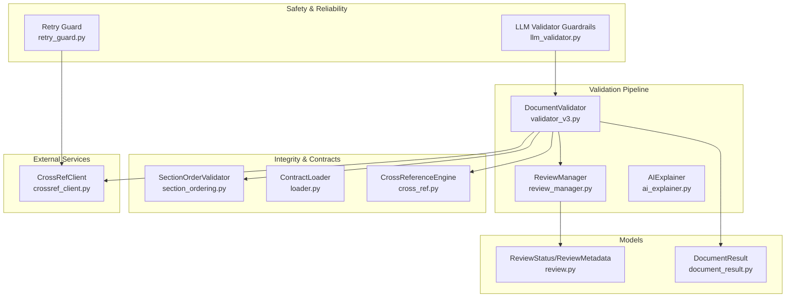
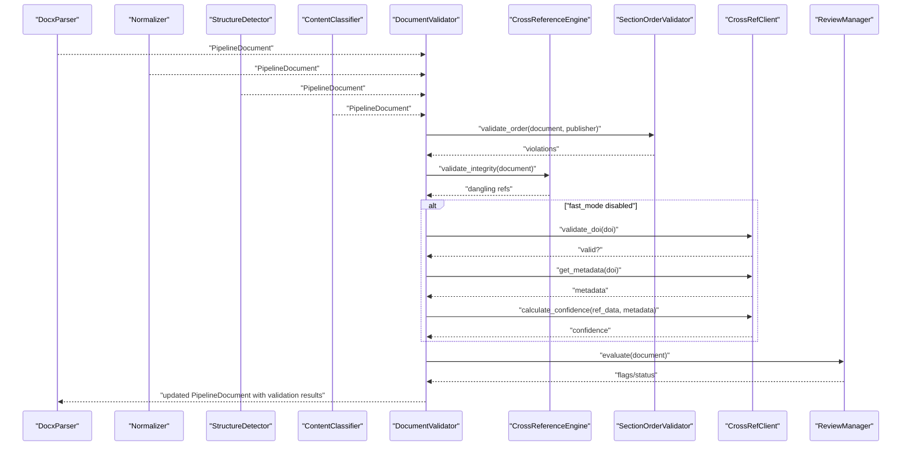
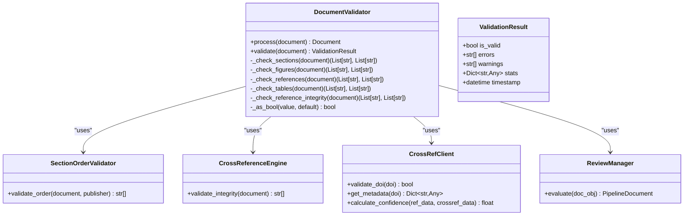
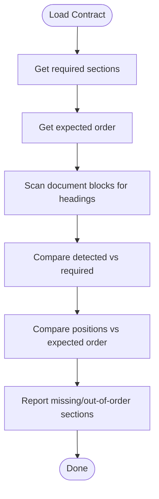
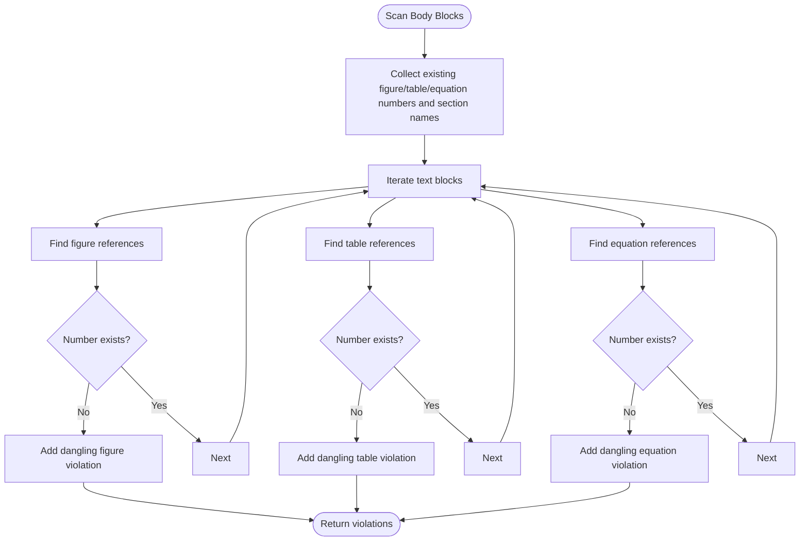
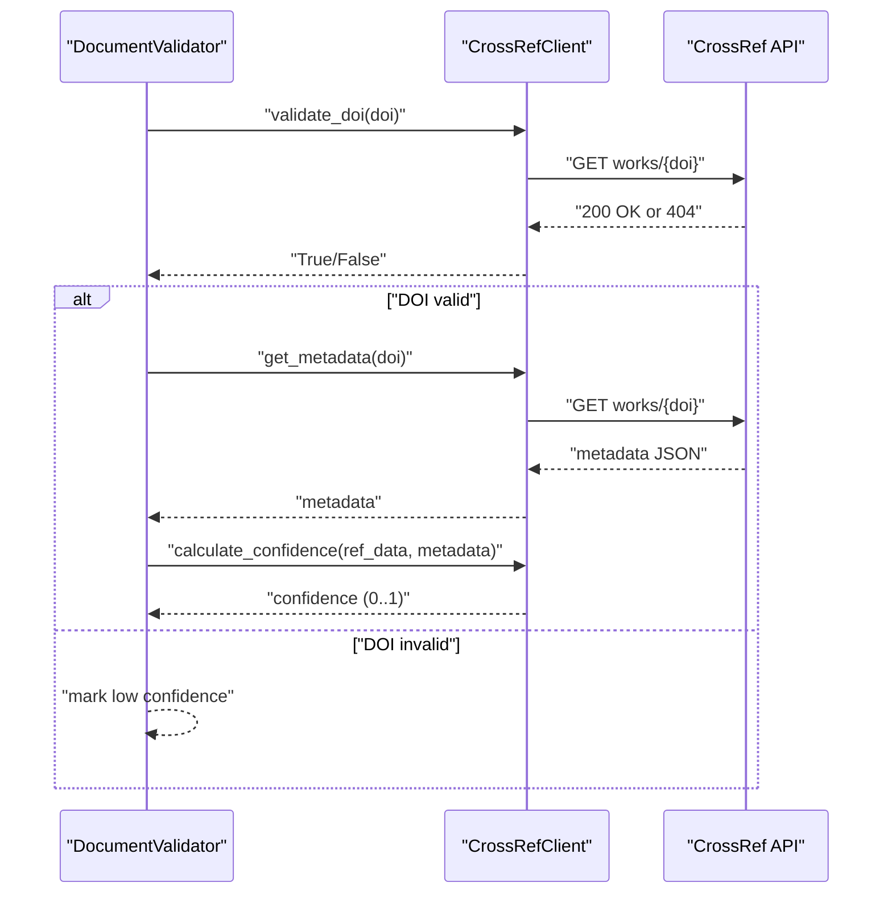
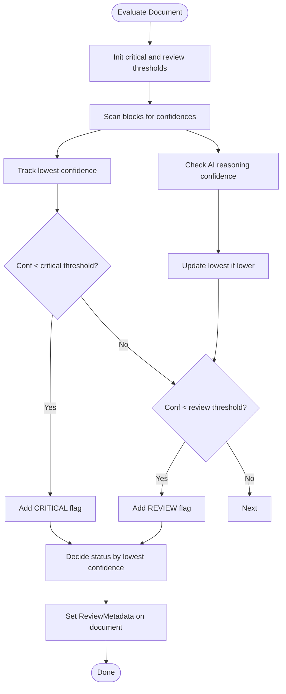
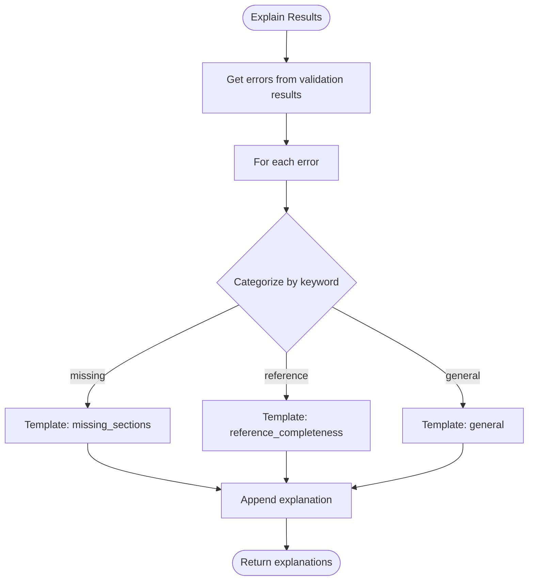
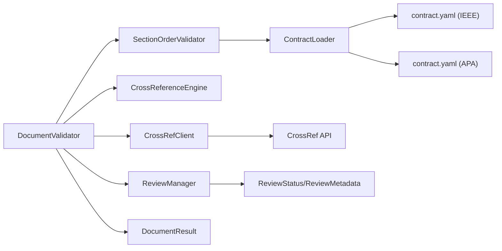

# Validation System

<cite>
**Referenced Files in This Document**
- [validator_v3.py](file://backend/app/pipeline/validation/validator_v3.py)
- [ai_explainer.py](file://backend/app/pipeline/validation/ai_explainer.py)
- [review_manager.py](file://backend/app/pipeline/validation/review_manager.py)
- [cross_ref.py](file://backend/app/pipeline/integrity/cross_ref.py)
- [section_ordering.py](file://backend/app/pipeline/formatting/section_ordering.py)
- [loader.py](file://backend/app/pipeline/contracts/loader.py)
- [contract.yaml (IEEE)](file://backend/app/pipeline/contracts/ieee/contract.yaml)
- [contract.yaml (APA)](file://backend/app/pipeline/contracts/apa/contract.yaml)
- [crossref_client.py](file://backend/app/pipeline/services/crossref_client.py)
- [llm_validator.py](file://backend/app/pipeline/safety/llm_validator.py)
- [retry_guard.py](file://backend/app/pipeline/safety/retry_guard.py)
- [run_validation.py](file://backend/manual_tests/normal/phase1/run_validation.py)
- [test_crossref_integration.py](file://backend/tests/integration/test_crossref_integration.py)
- [document_result.py](file://backend/app/models/document_result.py)
- [review.py](file://backend/app/models/review.py)
</cite>

## Table of Contents
1. [Introduction](#introduction)
2. [Project Structure](#project-structure)
3. [Core Components](#core-components)
4. [Architecture Overview](#architecture-overview)
5. [Detailed Component Analysis](#detailed-component-analysis)
6. [Dependency Analysis](#dependency-analysis)
7. [Performance Considerations](#performance-considerations)
8. [Troubleshooting Guide](#troubleshooting-guide)
9. [Conclusion](#conclusion)
10. [Appendices](#appendices)

## Introduction
This document describes the validation system that ensures document integrity, correctness, and readiness for downstream processing. It covers the document validation engine, quality assurance processes, automated review mechanisms, validation rules, error detection algorithms, confidence-based scoring, the AI explainer for validation decisions, review management workflows, and integration with external validation services. It also includes examples of validation reports, common validation errors, and remediation strategies.

## Project Structure
The validation system is implemented as part of the backend pipeline and integrates with contracts, integrity engines, external services, and review management.

**Diagram sources**
- [validator_v3.py:34-145](file://backend/app/pipeline/validation/validator_v3.py#L34-L145)
- [review_manager.py:7-117](file://backend/app/pipeline/validation/review_manager.py#L7-L117)
- [ai_explainer.py:3-47](file://backend/app/pipeline/validation/ai_explainer.py#L3-L47)
- [section_ordering.py:5-43](file://backend/app/pipeline/formatting/section_ordering.py#L5-L43)
- [loader.py:8-82](file://backend/app/pipeline/contracts/loader.py#L8-L82)
- [cross_ref.py:10-64](file://backend/app/pipeline/integrity/cross_ref.py#L10-L64)
- [crossref_client.py:25-171](file://backend/app/pipeline/services/crossref_client.py#L25-L171)
- [llm_validator.py:46-122](file://backend/app/pipeline/safety/llm_validator.py#L46-L122)
- [retry_guard.py:10-63](file://backend/app/pipeline/safety/retry_guard.py#L10-L63)
- [review.py:5-18](file://backend/app/models/review.py#L5-L18)
- [document_result.py:5-13](file://backend/app/models/document_result.py#L5-L13)

**Section sources**
- [validator_v3.py:1-277](file://backend/app/pipeline/validation/validator_v3.py#L1-L277)
- [review_manager.py:1-117](file://backend/app/pipeline/validation/review_manager.py#L1-L117)
- [ai_explainer.py:1-47](file://backend/app/pipeline/validation/ai_explainer.py#L1-L47)
- [cross_ref.py:1-64](file://backend/app/pipeline/integrity/cross_ref.py#L1-L64)
- [section_ordering.py:1-43](file://backend/app/pipeline/formatting/section_ordering.py#L1-L43)
- [loader.py:1-82](file://backend/app/pipeline/contracts/loader.py#L1-L82)
- [crossref_client.py:1-171](file://backend/app/pipeline/services/crossref_client.py#L1-L171)
- [llm_validator.py:1-122](file://backend/app/pipeline/safety/llm_validator.py#L1-L122)
- [retry_guard.py:1-63](file://backend/app/pipeline/safety/retry_guard.py#L1-L63)
- [review.py:1-18](file://backend/app/models/review.py#L1-L18)
- [document_result.py:1-13](file://backend/app/models/document_result.py#L1-L13)

## Core Components
- DocumentValidator: Orchestrates validation checks, aggregates results, and updates document state.
- SectionOrderValidator: Enforces required sections and ordering according to publisher contracts.
- CrossReferenceEngine: Detects dangling internal references (figures, tables, equations, sections).
- CrossRefClient: Validates DOIs and computes confidence scores using external metadata.
- ReviewManager: Flags content for human-in-the-loop review based on confidence thresholds.
- AIExplainer: Generates natural language explanations for validation outcomes.
- Safety utilities: Guardrails-based LLM output validation and retry/backoff for reliability.

**Section sources**
- [validator_v3.py:34-145](file://backend/app/pipeline/validation/validator_v3.py#L34-L145)
- [section_ordering.py:12-42](file://backend/app/pipeline/formatting/section_ordering.py#L12-L42)
- [cross_ref.py:22-63](file://backend/app/pipeline/integrity/cross_ref.py#L22-L63)
- [crossref_client.py:55-171](file://backend/app/pipeline/services/crossref_client.py#L55-L171)
- [review_manager.py:29-116](file://backend/app/pipeline/validation/review_manager.py#L29-L116)
- [ai_explainer.py:18-46](file://backend/app/pipeline/validation/ai_explainer.py#L18-L46)
- [llm_validator.py:46-122](file://backend/app/pipeline/safety/llm_validator.py#L46-L122)
- [retry_guard.py:10-63](file://backend/app/pipeline/safety/retry_guard.py#L10-L63)

## Architecture Overview
The validation pipeline runs as a pipeline stage after parsing, normalization, structure detection, and classification. It performs:
- Section completeness and ordering checks driven by contracts
- Figure/table caption presence checks
- Internal cross-reference integrity checks
- Optional external DOI validation and confidence scoring
- Confidence-based flags for human-in-the-loop review
- Aggregated validation results stored on the document and persisted

**Diagram sources**
- [validator_v3.py:62-145](file://backend/app/pipeline/validation/validator_v3.py#L62-L145)
- [cross_ref.py:22-63](file://backend/app/pipeline/integrity/cross_ref.py#L22-L63)
- [section_ordering.py:12-42](file://backend/app/pipeline/formatting/section_ordering.py#L12-L42)
- [crossref_client.py:55-171](file://backend/app/pipeline/services/crossref_client.py#L55-L171)
- [review_manager.py:29-116](file://backend/app/pipeline/validation/review_manager.py#L29-L116)

## Detailed Component Analysis

### DocumentValidator
Responsibilities:
- Runs a suite of validation checks and aggregates errors/warnings
- Updates document state with validation outcome and processing metrics
- Integrates external DOI validation and confidence computation
- Triggers confidence-based review flags

Key behaviors:
- Section completeness/ordering via contract-driven validator
- Figure/table caption presence checks
- Internal cross-reference integrity checks
- Optional external DOI validation (skipped in fast mode)
- Confidence-based flags for human-in-the-loop review
- Safe execution wrappers to prevent pipeline crashes

**Diagram sources**
- [validator_v3.py:34-145](file://backend/app/pipeline/validation/validator_v3.py#L34-L145)
- [section_ordering.py:12-42](file://backend/app/pipeline/formatting/section_ordering.py#L12-L42)
- [cross_ref.py:22-63](file://backend/app/pipeline/integrity/cross_ref.py#L22-L63)
- [crossref_client.py:55-171](file://backend/app/pipeline/services/crossref_client.py#L55-L171)
- [review_manager.py:29-116](file://backend/app/pipeline/validation/review_manager.py#L29-L116)

**Section sources**
- [validator_v3.py:62-145](file://backend/app/pipeline/validation/validator_v3.py#L62-L145)

### SectionOrderValidator and Contracts
- Loads publisher-specific contracts to determine required sections and expected order
- Compares detected sections to required and ordered lists to detect missing or misordered sections

**Diagram sources**
- [section_ordering.py:12-42](file://backend/app/pipeline/formatting/section_ordering.py#L12-L42)
- [loader.py:16-38](file://backend/app/pipeline/contracts/loader.py#L16-L38)
- [contract.yaml (IEEE):4-24](file://backend/app/pipeline/contracts/ieee/contract.yaml#L4-L24)
- [contract.yaml (APA):4-26](file://backend/app/pipeline/contracts/apa/contract.yaml#L4-L26)

**Section sources**
- [section_ordering.py:12-42](file://backend/app/pipeline/formatting/section_ordering.py#L12-L42)
- [loader.py:16-38](file://backend/app/pipeline/contracts/loader.py#L16-L38)
- [contract.yaml (IEEE):4-24](file://backend/app/pipeline/contracts/ieee/contract.yaml#L4-L24)
- [contract.yaml (APA):4-26](file://backend/app/pipeline/contracts/apa/contract.yaml#L4-L26)

### CrossReferenceEngine
Detects dangling internal references by scanning body text for references to figures, tables, equations, and sections, then validating against extracted items.

**Diagram sources**
- [cross_ref.py:22-63](file://backend/app/pipeline/integrity/cross_ref.py#L22-L63)

**Section sources**
- [cross_ref.py:22-63](file://backend/app/pipeline/integrity/cross_ref.py#L22-L63)

### CrossRefClient and DOI Validation
Validates DOIs and calculates confidence by comparing local reference metadata with CrossRef metadata. Implements rate limiting and safe error handling.

**Diagram sources**
- [crossref_client.py:55-171](file://backend/app/pipeline/services/crossref_client.py#L55-L171)
- [validator_v3.py:220-266](file://backend/app/pipeline/validation/validator_v3.py#L220-L266)

**Section sources**
- [crossref_client.py:55-171](file://backend/app/pipeline/services/crossref_client.py#L55-L171)
- [validator_v3.py:220-266](file://backend/app/pipeline/validation/validator_v3.py#L220-L266)

### ReviewManager and Confidence-Based Review
Flags content for human-in-the-loop review based on confidence thresholds derived from block classification confidence, NLP confidence, and AI reasoning confidence.

**Diagram sources**
- [review_manager.py:29-116](file://backend/app/pipeline/validation/review_manager.py#L29-L116)
- [review.py:5-18](file://backend/app/models/review.py#L5-L18)

**Section sources**
- [review_manager.py:29-116](file://backend/app/pipeline/validation/review_manager.py#L29-L116)
- [review.py:5-18](file://backend/app/models/review.py#L5-L18)

### AIExplainer
Generates natural language explanations for validation results based on categories inferred from error messages.

**Diagram sources**
- [ai_explainer.py:18-46](file://backend/app/pipeline/validation/ai_explainer.py#L18-L46)

**Section sources**
- [ai_explainer.py:18-46](file://backend/app/pipeline/validation/ai_explainer.py#L18-L46)

### Safety and Reliability
- Guardrails-based LLM output validation with graceful fallbacks
- Retry with exponential backoff for external service calls

**Section sources**
- [llm_validator.py:46-122](file://backend/app/pipeline/safety/llm_validator.py#L46-L122)
- [retry_guard.py:10-63](file://backend/app/pipeline/safety/retry_guard.py#L10-L63)

## Dependency Analysis
The validation system exhibits clear layering:
- Pipeline stage (DocumentValidator) depends on integrity and ordering validators, external clients, and review manager
- Contract loading enables publisher-specific validation rules
- External services are encapsulated behind safe clients with rate limiting and error handling
- Safety utilities provide resilience for both pipeline operations and LLM outputs

**Diagram sources**
- [validator_v3.py:34-145](file://backend/app/pipeline/validation/validator_v3.py#L34-L145)
- [section_ordering.py:9-10](file://backend/app/pipeline/formatting/section_ordering.py#L9-L10)
- [loader.py:12-14](file://backend/app/pipeline/contracts/loader.py#L12-L14)
- [contract.yaml (IEEE):1-2](file://backend/app/pipeline/contracts/ieee/contract.yaml#L1-L2)
- [contract.yaml (APA):1-2](file://backend/app/pipeline/contracts/apa/contract.yaml#L1-L2)
- [crossref_client.py:25-46](file://backend/app/pipeline/services/crossref_client.py#L25-L46)
- [document_result.py:5-13](file://backend/app/models/document_result.py#L5-L13)
- [review.py:5-18](file://backend/app/models/review.py#L5-L18)

**Section sources**
- [validator_v3.py:34-145](file://backend/app/pipeline/validation/validator_v3.py#L34-L145)
- [loader.py:12-14](file://backend/app/pipeline/contracts/loader.py#L12-L14)
- [crossref_client.py:25-46](file://backend/app/pipeline/services/crossref_client.py#L25-L46)

## Performance Considerations
- External DOI validation is optional in fast mode to reduce latency and API load.
- Rate limiting is enforced for CrossRef API calls to respect service limits.
- Safe execution wrappers ensure individual check failures do not halt the pipeline.
- Confidence thresholds allow early identification of risky content without blocking processing.

[No sources needed since this section provides general guidance]

## Troubleshooting Guide
Common validation errors and remediation strategies:
- Missing required sections: Ensure sections required by the target publisher are present and correctly titled. Canonical names are mapped by contracts.
- Out-of-order sections: Reorder sections according to the expected order defined in the contract.
- Dangling internal references: Confirm all figure/table/equation references correspond to actual items in the document.
- Missing figure/table captions: Add proper captions for all figures/tables.
- Incomplete reference metadata: Provide complete metadata (authors, title, year) to improve confidence and avoid warnings.
- Invalid or low-confidence DOIs: Correct the DOI or rely on manual verification if external validation fails.

Integration testing and manual validation:
- Integration tests demonstrate successful DOI validation and confidence assignment.
- Manual validation pipeline test saves structured validation results to JSON for inspection.

**Section sources**
- [test_crossref_integration.py:35-82](file://backend/tests/integration/test_crossref_integration.py#L35-L82)
- [run_validation.py:22-74](file://backend/manual_tests/normal/phase1/run_validation.py#L22-L74)

## Conclusion
The validation system provides robust, contract-driven checks, integrity enforcement, optional external DOI validation, and confidence-based review flags. It integrates safety measures to maintain pipeline stability and offers actionable explanations to guide remediation. The modular design supports extensibility for additional publishers and validation rules.

[No sources needed since this section summarizes without analyzing specific files]

## Appendices

### Validation Report Example
A typical validation report includes:
- is_valid: Boolean indicating overall validity
- errors: List of critical issues
- warnings: List of potential issues
- stats: Document statistics collected during processing
- timestamp: UTC timestamp of validation completion

Example structure:
- is_valid: true/false
- errors: ["Missing required section: abstract", "Dangling reference: 'Figure 5'"]
- warnings: ["References section found but no reference entries parsed", "Reference 'RefKey' missing publication year"]
- stats: { ... document stats ... }
- timestamp: "2026-01-01T00:00:00Z"

**Section sources**
- [validator_v3.py:25-32](file://backend/app/pipeline/validation/validator_v3.py#L25-L32)
- [run_validation.py:53-68](file://backend/manual_tests/normal/phase1/run_validation.py#L53-L68)

### Quality Improvement Suggestions
- Use fast mode for initial passes to accelerate processing; enable external validation in later stages.
- Monitor confidence scores and route low-confidence blocks to human review.
- Leverage AI explanations to guide targeted improvements.
- Periodically update contracts to reflect publisher policy changes.

[No sources needed since this section provides general guidance]