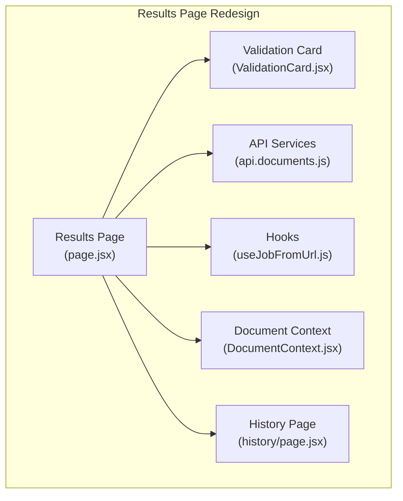
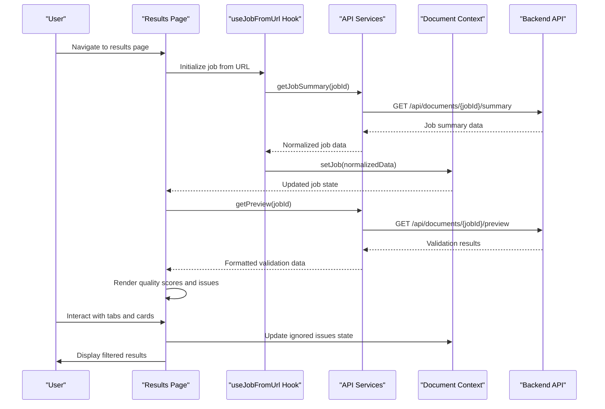
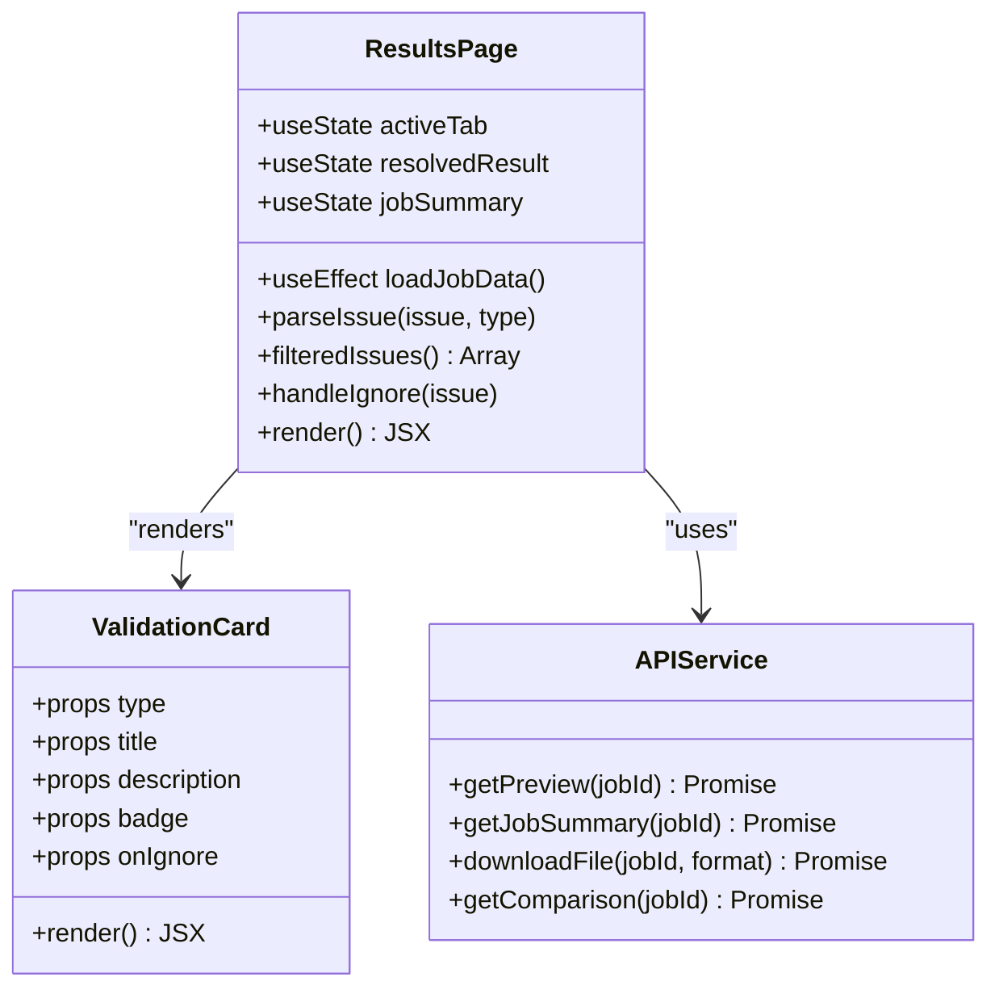
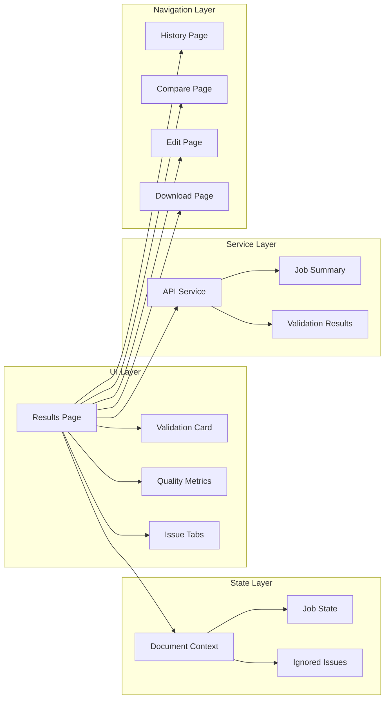

# Results Page Redesign

<cite>
**Referenced Files in This Document**
- [page.jsx](file://frontend/app/(formatter)/results/page.jsx)
- [ValidationCard.jsx](file://frontend/src/components/ValidationCard.jsx)
- [api.documents.js](file://frontend/src/services/api.documents.js)
- [useJobFromUrl.js](file://frontend/src/hooks/useJobFromUrl.js)
- [DocumentContext.jsx](file://frontend/src/context/DocumentContext.jsx)
- [page.jsx](file://frontend/app/(formatter)/(protected)/history/page.jsx)
</cite>

## Table of Contents
1. [Introduction](#introduction)
2. [Project Structure](#project-structure)
3. [Core Components](#core-components)
4. [Architecture Overview](#architecture-overview)
5. [Detailed Component Analysis](#detailed-component-analysis)
6. [Dependency Analysis](#dependency-analysis)
7. [Performance Considerations](#performance-considerations)
8. [Troubleshooting Guide](#troubleshooting-guide)
9. [Conclusion](#conclusion)

## Introduction
This document analyzes the Results Page Redesign for the Automated Academic Docx Manuscript Formatter. The redesign focuses on transforming the validation results page into a comprehensive diagnostic and decision-making interface. The redesigned page provides users with a structured presentation of formatting validation results, quality scores, actionable insights, and seamless navigation to related workflows such as comparison, editing, and downloading.

The results page serves as the central hub for reviewing manuscript processing outcomes, enabling users to understand compliance with academic formatting standards, identify areas for improvement, and take informed actions to enhance their manuscripts.

## Project Structure
The results page redesign is implemented within the Next.js frontend application under the formatter route group. The key files involved in this redesign include the results page component, supporting UI components, service utilities for API communication, and context providers for state management.

**Diagram sources**
- [page.jsx](file://frontend/app/(formatter)/results/page.jsx#L1-L555)
- [ValidationCard.jsx:1-65](file://frontend/src/components/ValidationCard.jsx#L1-L65)
- [api.documents.js:1-431](file://frontend/src/services/api.documents.js#L1-L431)
- [useJobFromUrl.js:1-91](file://frontend/src/hooks/useJobFromUrl.js#L1-L91)
- [DocumentContext.jsx:1-139](file://frontend/src/context/DocumentContext.jsx#L1-L139)
- [page.jsx](file://frontend/app/(formatter)/(protected)/history/page.jsx#L1-L461)

**Section sources**
- [page.jsx](file://frontend/app/(formatter)/results/page.jsx#L1-L555)
- [ValidationCard.jsx:1-65](file://frontend/src/components/ValidationCard.jsx#L1-L65)
- [api.documents.js:1-431](file://frontend/src/services/api.documents.js#L1-L431)
- [useJobFromUrl.js:1-91](file://frontend/src/hooks/useJobFromUrl.js#L1-L91)
- [DocumentContext.jsx:1-139](file://frontend/src/context/DocumentContext.jsx#L1-L139)
- [page.jsx](file://frontend/app/(formatter)/(protected)/history/page.jsx#L1-L461)

## Core Components
The results page redesign consists of several core components working together to deliver a comprehensive validation experience:

### Results Page Component
The main results page component orchestrates the entire validation results display, including:
- Loading states and error handling
- Tabbed interface for filtering validation issues
- Quality score visualization with progress indicators
- Action buttons for comparison, editing, and downloading
- Integration with document context and API services

### Validation Card Component
A reusable card component that displays individual validation issues with:
- Type-specific styling (errors, warnings, advisories)
- Severity badges and icons
- Action buttons for locating issues and ignoring them
- Consistent visual hierarchy for different issue types

### API Services Layer
The services layer handles all backend communication for:
- Loading validation results with debouncing support
- Fetching job summaries and quality metrics
- Managing download operations and file exports
- Providing standardized error handling

### State Management and Navigation
The redesign leverages:
- Document context for maintaining active job state
- URL-based job retrieval with automatic hydration
- Seamless navigation between related pages (history, compare, edit, download)

**Section sources**
- [page.jsx](file://frontend/app/(formatter)/results/page.jsx#L14-L555)
- [ValidationCard.jsx:3-65](file://frontend/src/components/ValidationCard.jsx#L3-L65)
- [api.documents.js:325-428](file://frontend/src/services/api.documents.js#L325-L428)
- [DocumentContext.jsx:17-139](file://frontend/src/context/DocumentContext.jsx#L17-L139)

## Architecture Overview
The results page redesign follows a modular architecture pattern with clear separation of concerns:

**Diagram sources**
- [page.jsx](file://frontend/app/(formatter)/results/page.jsx#L24-L88)
- [useJobFromUrl.js:25-90](file://frontend/src/hooks/useJobFromUrl.js#L25-L90)
- [api.documents.js:325-428](file://frontend/src/services/api.documents.js#L325-L428)
- [DocumentContext.jsx:17-139](file://frontend/src/context/DocumentContext.jsx#L17-L139)

The architecture ensures:
- **Separation of Concerns**: Each component has a specific responsibility
- **State Management**: Centralized context for job state and user preferences
- **API Abstraction**: Unified service layer for backend communication
- **Error Handling**: Comprehensive error states and user feedback mechanisms

## Detailed Component Analysis

### Results Page Component Analysis
The results page component implements a sophisticated validation interface with multiple states and interactive elements:

#### Loading States and Error Handling
The component manages several loading states:
- Initial job loading from URL
- Validation results fetching
- Job summary loading
- Error scenarios with user-friendly messaging

#### Quality Score Visualization
The redesign introduces comprehensive quality metrics:
- Overall formatting score with circular progress indicator
- Template compliance percentage with visual progress bar
- Content quality assessment with color-coded indicators
- Citation count and missing sections detection

#### Tabbed Issue Filtering
Users can filter validation issues by type:
- All issues combined view
- Error-focused view for critical issues
- Warning-focused view for formatting improvements
- Advisory view for AI-generated insights

#### Action Integration
The page seamlessly integrates with related workflows:
- Compare with original manuscript
- Edit processed version
- Download formatted document
- Re-upload for reprocessing

**Diagram sources**
- [page.jsx](file://frontend/app/(formatter)/results/page.jsx#L14-L555)
- [ValidationCard.jsx:3-65](file://frontend/src/components/ValidationCard.jsx#L3-L65)
- [api.documents.js:325-428](file://frontend/src/services/api.documents.js#L325-L428)

**Section sources**
- [page.jsx](file://frontend/app/(formatter)/results/page.jsx#L14-L555)
- [ValidationCard.jsx:3-65](file://frontend/src/components/ValidationCard.jsx#L3-L65)

### Validation Card Component Analysis
The validation card component provides a consistent interface for displaying individual validation issues:

#### Type-Specific Styling
Cards adapt their appearance based on issue type:
- **Errors**: Red borders and backgrounds with critical severity badges
- **Warnings**: Amber styling for minor formatting issues
- **Advisories**: Primary blue styling for AI-generated insights

#### Interactive Elements
Each card includes:
- Issue title and detailed description
- Severity badge with appropriate coloring
- "Locate in document" action button
- "Ignore" functionality for filtering unwanted issues

#### Responsive Design
The component adapts to different screen sizes while maintaining readability and usability across devices.

**Section sources**
- [ValidationCard.jsx:3-65](file://frontend/src/components/ValidationCard.jsx#L3-L65)

### API Services Integration
The results page integrates with multiple API endpoints to provide comprehensive functionality:

#### Debounced Preview Loading
The preview loading uses debouncing to prevent excessive API calls during rapid tab switching or frequent updates.

#### Quality Metrics Retrieval
Job summaries provide comprehensive quality metrics including:
- Overall formatting score calculation
- Template compliance percentages
- Content quality assessments
- Citation and section completeness analysis

#### Download Operations
Seamless integration with the download system supports multiple export formats with proper error handling and user feedback.

**Section sources**
- [api.documents.js:325-428](file://frontend/src/services/api.documents.js#L325-L428)

### State Management and Navigation
The redesign leverages React's context and hooks for robust state management:

#### Job Context Management
The document context maintains:
- Active job state with session persistence
- History tracking for user documents
- Processing state management
- Optimistic updates for user experience

#### URL-Based Navigation
The useJobFromUrl hook enables:
- Automatic job hydration from URL parameters
- Fallback handling for missing or invalid job IDs
- Consistent state synchronization across page loads

**Section sources**
- [DocumentContext.jsx:17-139](file://frontend/src/context/DocumentContext.jsx#L17-L139)
- [useJobFromUrl.js:25-90](file://frontend/src/hooks/useJobFromUrl.js#L25-L90)

## Dependency Analysis
The results page redesign creates a cohesive ecosystem of interconnected components:

**Diagram sources**
- [page.jsx](file://frontend/app/(formatter)/results/page.jsx#L1-L555)
- [DocumentContext.jsx:1-139](file://frontend/src/context/DocumentContext.jsx#L1-L139)
- [api.documents.js:1-431](file://frontend/src/services/api.documents.js#L1-L431)
- [page.jsx](file://frontend/app/(formatter)/(protected)/history/page.jsx#L1-L461)

The dependency analysis reveals:
- **Low Coupling**: Components communicate through well-defined interfaces
- **High Cohesion**: Related functionality is grouped within specific modules
- **Clear Data Flow**: Unidirectional data flow from services to UI components
- **Reusable Patterns**: Shared components and utilities reduce code duplication

**Section sources**
- [page.jsx](file://frontend/app/(formatter)/results/page.jsx#L1-L555)
- [DocumentContext.jsx:1-139](file://frontend/src/context/DocumentContext.jsx#L1-L139)
- [api.documents.js:1-431](file://frontend/src/services/api.documents.js#L1-L431)

## Performance Considerations
The results page redesign incorporates several performance optimizations:

### Debounced API Calls
The preview loading uses debouncing to minimize unnecessary API requests during rapid user interactions.

### Efficient State Updates
React's memoization and selective state updates prevent unnecessary re-renders of unaffected components.

### Lazy Loading
Quality metrics and detailed issue lists are loaded asynchronously to maintain responsive user experience.

### Memory Management
Proper cleanup of event listeners and API call cancellations prevents memory leaks during navigation.

## Troubleshooting Guide
Common issues and their solutions:

### Loading State Problems
**Issue**: Results page shows loading indefinitely
**Solution**: Check network connectivity and verify job ID validity in URL parameters

### Missing Validation Data
**Issue**: Empty validation results despite successful processing
**Solution**: Verify backend processing completion and check API response formats

### Quality Metrics Not Displaying
**Issue**: Quality scores show as unavailable
**Solution**: Confirm backend provides summary data and validate API endpoint accessibility

### Navigation Issues
**Issue**: Cannot navigate between related pages
**Solution**: Verify routing configuration and ensure proper context initialization

**Section sources**
- [page.jsx](file://frontend/app/(formatter)/results/page.jsx#L91-L144)
- [api.documents.js:325-428](file://frontend/src/services/api.documents.js#L325-L428)

## Conclusion
The Results Page Redesign successfully transforms the validation results interface into a comprehensive diagnostic and decision-making platform. The redesign achieves its goals through:

- **Enhanced User Experience**: Clear presentation of validation results with actionable insights
- **Comprehensive Quality Metrics**: Detailed formatting scores and compliance indicators
- **Seamless Workflow Integration**: Smooth navigation between related manuscript processing steps
- **Robust Architecture**: Modular design with clear separation of concerns and efficient state management
- **Performance Optimization**: Debounced API calls and efficient rendering strategies

The redesigned results page provides users with the tools necessary to understand manuscript compliance, identify improvement opportunities, and confidently proceed with their academic publishing workflow. The implementation demonstrates best practices in modern web development while maintaining accessibility and responsiveness across different device types and network conditions.