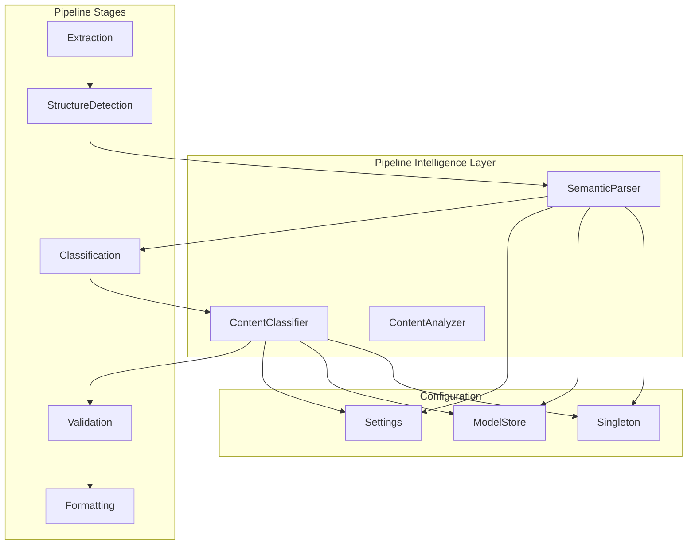
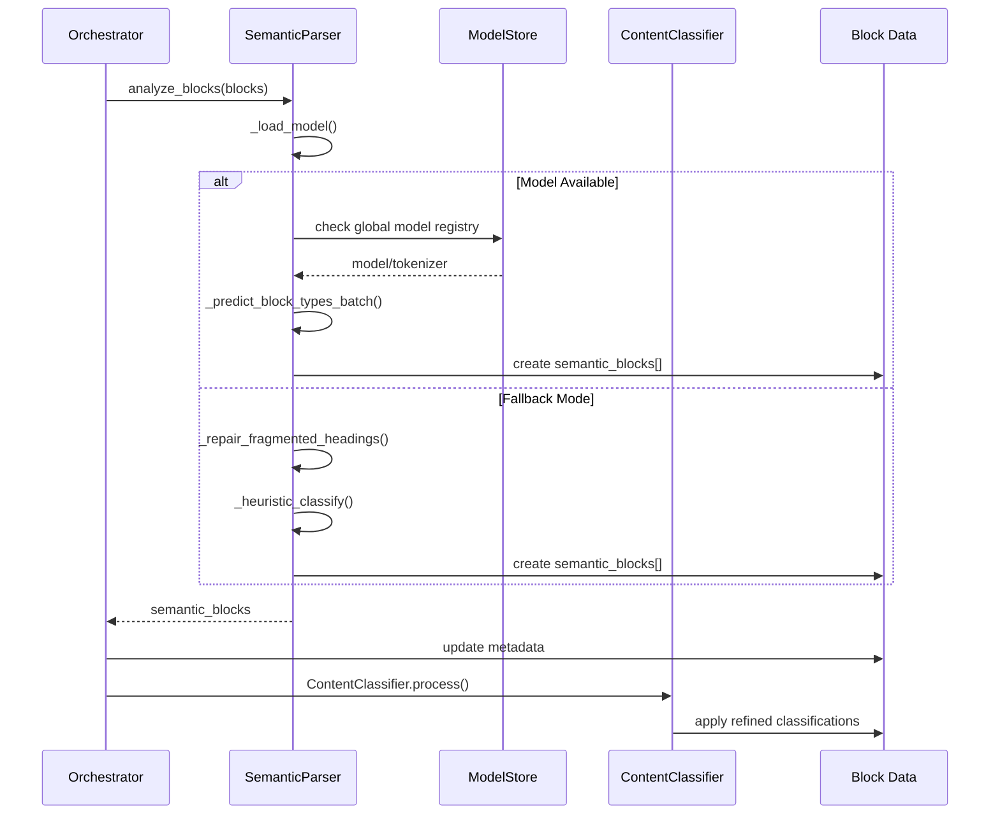
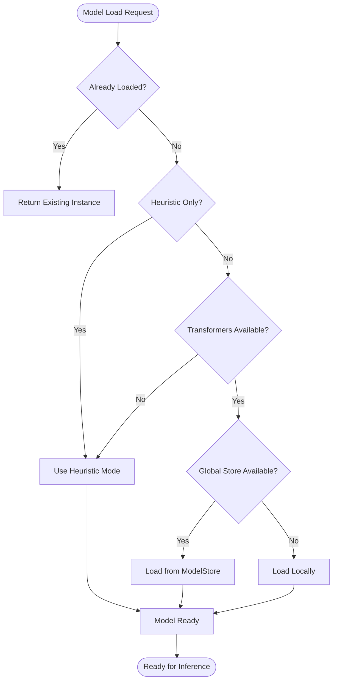
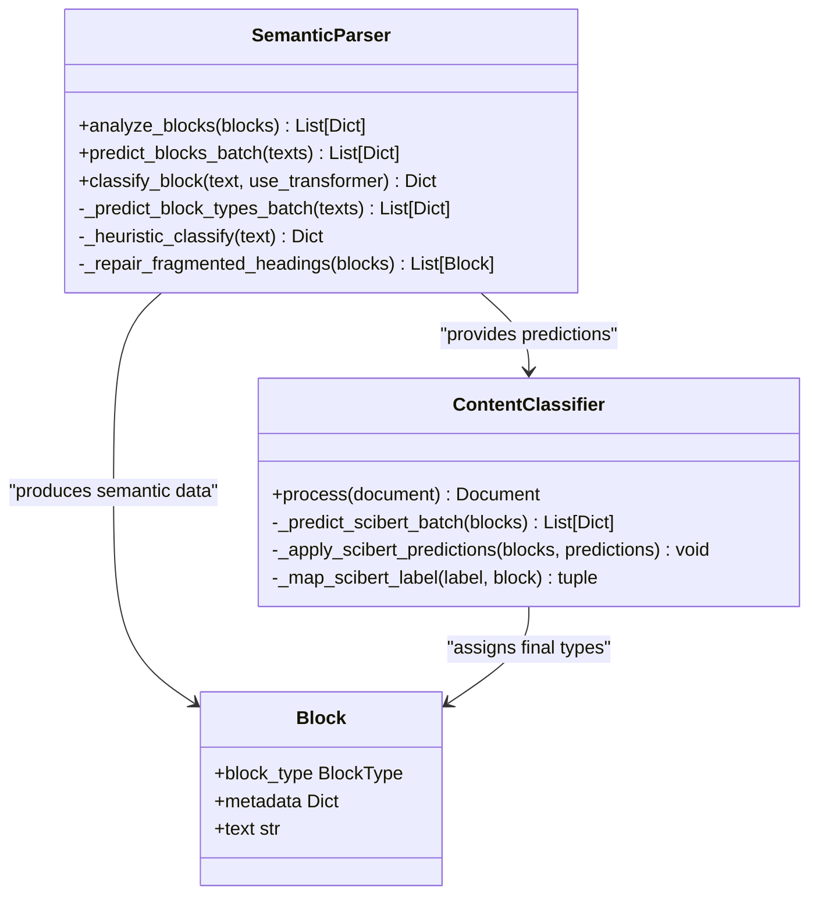
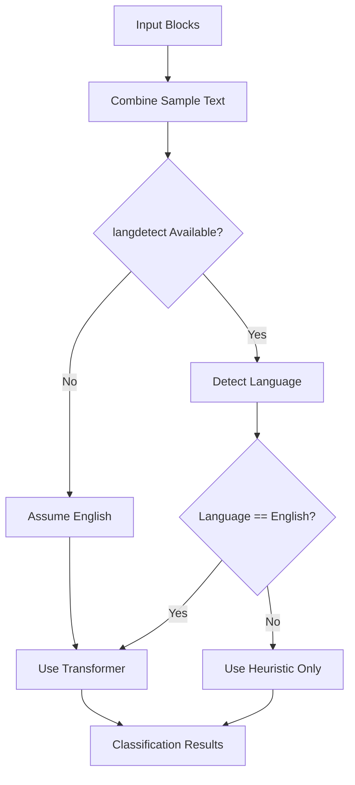
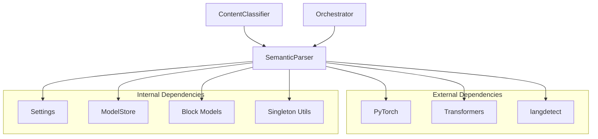

# Semantic Parser

<cite>
**Referenced Files in This Document**
- [semantic_parser.py](file://backend/app/pipeline/intelligence/semantic_parser.py)
- [classifier.py](file://backend/app/pipeline/classification/classifier.py)
- [orchestrator.py](file://backend/app/pipeline/orchestrator.py)
- [block.py](file://backend/app/models/block.py)
- [settings.py](file://backend/app/config/settings.py)
- [model_store.py](file://backend/app/services/model_store.py)
- [singleton.py](file://backend/app/utils/singleton.py)
- [test_semantic_parser.py](file://backend/tests/test_semantic_parser.py)
- [default_guidelines.json](file://backend/app/pipeline/intelligence/default_guidelines.json)
</cite>

## Table of Contents
1. [Introduction](#introduction)
2. [Project Structure](#project-structure)
3. [Core Components](#core-components)
4. [Architecture Overview](#architecture-overview)
5. [Detailed Component Analysis](#detailed-component-analysis)
6. [Dependency Analysis](#dependency-analysis)
7. [Performance Considerations](#performance-considerations)
8. [Troubleshooting Guide](#troubleshooting-guide)
9. [Conclusion](#conclusion)

## Introduction
The Semantic Parser is a foundational Natural Language Processing (NLP) component responsible for structural analysis and semantic classification of manuscript blocks. It leverages a local SciBERT model to identify document sections such as abstracts, methodologies, conclusions, references, figures, tables, acknowledgments, and equations. The component operates as a safety-guarded interface adapter between the document pipeline and AI-powered classification, providing robust fallback mechanisms for reliability and performance.

## Project Structure
The Semantic Parser resides within the intelligence layer of the document processing pipeline and integrates with multiple pipeline stages:

**Diagram sources**
- [semantic_parser.py:48-328](file://backend/app/pipeline/intelligence/semantic_parser.py#L48-L328)
- [classifier.py:22-830](file://backend/app/pipeline/classification/classifier.py#L22-L830)
- [orchestrator.py:472-492](file://backend/app/pipeline/orchestrator.py#L472-L492)

**Section sources**
- [semantic_parser.py:48-328](file://backend/app/pipeline/intelligence/semantic_parser.py#L48-L328)
- [classifier.py:22-830](file://backend/app/pipeline/classification/classifier.py#L22-L830)
- [orchestrator.py:472-492](file://backend/app/pipeline/orchestrator.py#L472-L492)

## Core Components
The Semantic Parser consists of several key components working together to provide reliable semantic analysis:

### SemanticParser Class
The main class implements:
- Lazy model loading with global ModelStore integration
- Dual-mode operation (transformer-based and heuristic fallback)
- Fragmented heading repair logic
- Batch and single-block classification
- Safety guards against pipeline failures

### Configuration Management
- Environment-driven feature toggles via Settings
- Model preload capability for performance
- Timeout and memory management controls

### Integration Patterns
- Singleton pattern for shared instance management
- Pipeline stage integration with retry and timeout mechanisms
- Cross-stage metadata propagation

**Section sources**
- [semantic_parser.py:48-328](file://backend/app/pipeline/intelligence/semantic_parser.py#L48-L328)
- [settings.py:380-414](file://backend/app/config/settings.py#L380-L414)
- [model_store.py:1-33](file://backend/app/services/model_store.py#L1-L33)

## Architecture Overview
The Semantic Parser operates as a bridge between document structure detection and content classification:

**Diagram sources**
- [orchestrator.py:472-492](file://backend/app/pipeline/orchestrator.py#L472-L492)
- [semantic_parser.py:132-185](file://backend/app/pipeline/intelligence/semantic_parser.py#L132-L185)
- [classifier.py:137-236](file://backend/app/pipeline/classification/classifier.py#L137-L236)

## Detailed Component Analysis

### SemanticParser Implementation
The SemanticParser class implements a sophisticated dual-mode classification system:

#### Model Loading Strategy

**Diagram sources**
- [semantic_parser.py:60-108](file://backend/app/pipeline/intelligence/semantic_parser.py#L60-L108)
- [model_store.py:19-29](file://backend/app/services/model_store.py#L19-L29)

#### Classification Logic
The parser supports 12 distinct semantic categories:
- HEADING, ABSTRACT, BODY, REFERENCES
- FIGURE_CAPTION, TABLE_CAPTION
- ACKNOWLEDGEMENTS, EQUATION
- METHODOLOGY, CONCLUSION, AUTHOR_INFO, TITLE

#### Safety Mechanisms
- Try-catch wrappers around all public methods
- Graceful degradation to heuristic mode
- Timeout protection via orchestrator integration
- Logging for all failure scenarios

**Section sources**
- [semantic_parser.py:48-328](file://backend/app/pipeline/intelligence/semantic_parser.py#L48-L328)
- [semantic_parser.py:187-251](file://backend/app/pipeline/intelligence/semantic_parser.py#L187-L251)

### Integration with ContentClassifier
The Semantic Parser feeds results to the ContentClassifier for final block type assignment:

**Diagram sources**
- [semantic_parser.py:132-185](file://backend/app/pipeline/intelligence/semantic_parser.py#L132-L185)
- [classifier.py:137-236](file://backend/app/pipeline/classification/classifier.py#L137-L236)
- [block.py:86-181](file://backend/app/models/block.py#L86-L181)

**Section sources**
- [classifier.py:137-236](file://backend/app/pipeline/classification/classifier.py#L137-L236)
- [semantic_parser.py:132-185](file://backend/app/pipeline/intelligence/semantic_parser.py#L132-L185)

### Language Detection and Multilingual Support
The parser includes optional language detection to ensure accurate classification:

**Diagram sources**
- [semantic_parser.py:142-157](file://backend/app/pipeline/intelligence/semantic_parser.py#L142-L157)

**Section sources**
- [semantic_parser.py:142-157](file://backend/app/pipeline/intelligence/semantic_parser.py#L142-L157)

## Dependency Analysis
The Semantic Parser has minimal external dependencies and follows a layered architecture:

**Diagram sources**
- [semantic_parser.py:1-38](file://backend/app/pipeline/intelligence/semantic_parser.py#L1-L38)
- [settings.py:380-414](file://backend/app/config/settings.py#L380-L414)
- [model_store.py:1-33](file://backend/app/services/model_store.py#L1-L33)

**Section sources**
- [semantic_parser.py:1-38](file://backend/app/pipeline/intelligence/semantic_parser.py#L1-L38)
- [settings.py:380-414](file://backend/app/config/settings.py#L380-L414)

## Performance Considerations
The Semantic Parser implements several optimization strategies:

### Memory Management
- Lazy loading prevents unnecessary model initialization
- Global ModelStore enables shared model instances across requests
- Optional model preloading reduces cold-start latency

### Processing Efficiency
- Batch inference for multiple blocks in a single operation
- Heuristic fallback for non-English or unsupported documents
- Configurable timeouts and retry mechanisms

### Resource Constraints
- Maximum sequence length of 512 tokens for transformer inputs
- Optional language filtering to avoid unnecessary processing
- Graceful degradation maintains pipeline throughput

**Section sources**
- [semantic_parser.py:60-108](file://backend/app/pipeline/intelligence/semantic_parser.py#L60-L108)
- [settings.py:380-414](file://backend/app/config/settings.py#L380-L414)

## Troubleshooting Guide

### Common Issues and Solutions

#### Model Loading Failures
**Symptoms**: Transformer imports fail or model fails to load
**Causes**: Missing PyTorch/Transformers dependencies
**Solutions**: 
- Enable heuristic-only mode via configuration
- Verify Python environment dependencies
- Check model storage availability

#### Performance Degradation
**Symptoms**: Slow classification or timeout errors
**Causes**: Large document batches or insufficient resources
**Solutions**:
- Adjust batch sizes and processing timeouts
- Enable model preloading
- Monitor memory usage during inference

#### Classification Accuracy Issues
**Symptoms**: Incorrect semantic labels or confidence scores
**Causes**: Non-English content or domain mismatch
**Solutions**:
- Verify language detection accuracy
- Consider fine-tuned model variants
- Review heuristic rule adjustments

**Section sources**
- [semantic_parser.py:103-107](file://backend/app/pipeline/intelligence/semantic_parser.py#L103-L107)
- [semantic_parser.py:249-251](file://backend/app/pipeline/intelligence/semantic_parser.py#L249-L251)

## Conclusion
The Semantic Parser provides a robust foundation for academic document processing through intelligent semantic classification. Its dual-mode architecture ensures reliability across diverse document types and environments, while its integration with the broader pipeline enables comprehensive document analysis. The component's safety mechanisms, performance optimizations, and graceful fallback capabilities make it suitable for production deployment in automated academic manuscript formatting systems.