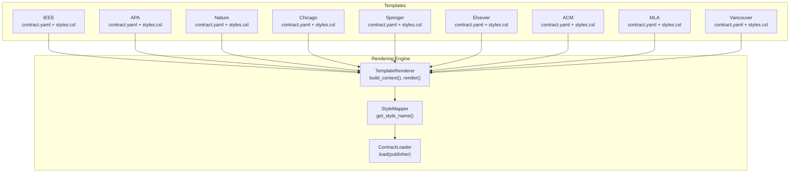
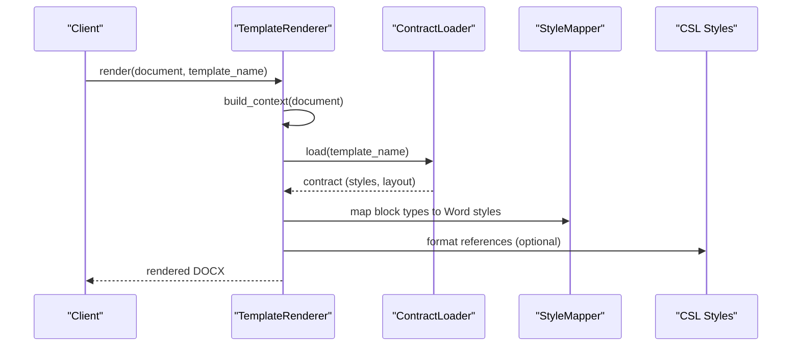
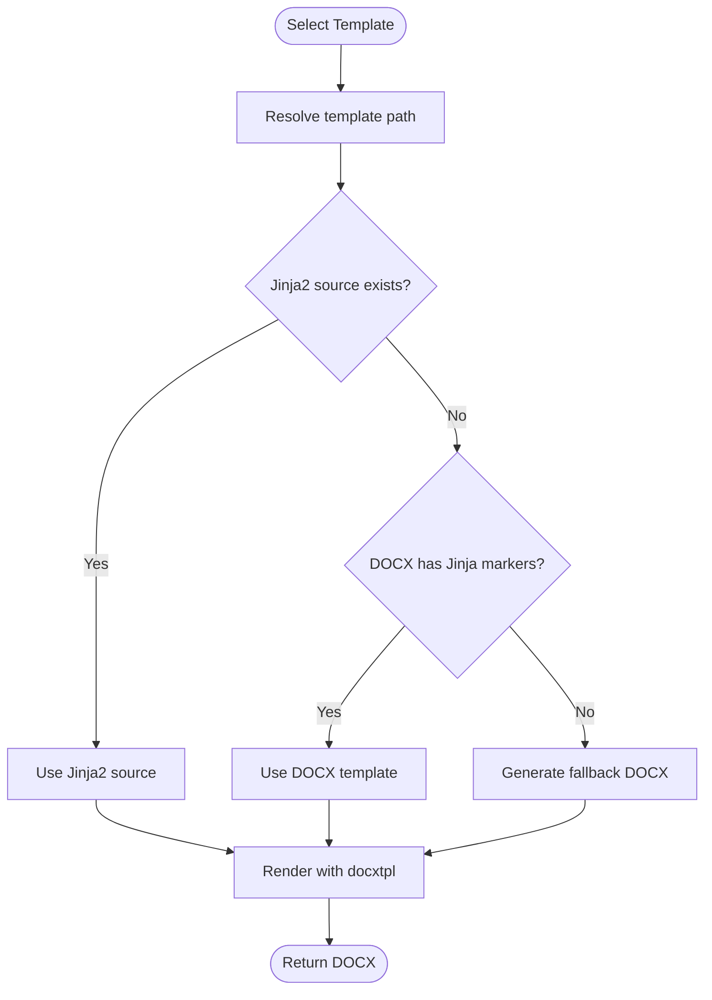
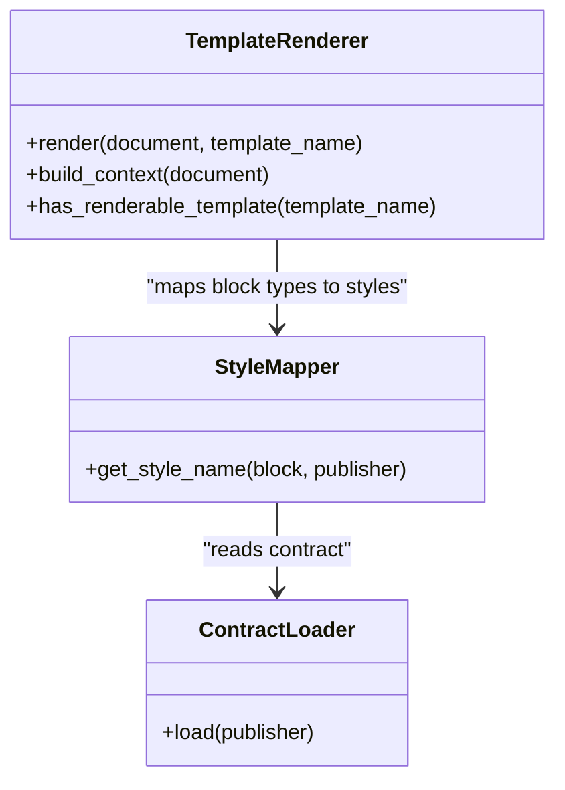
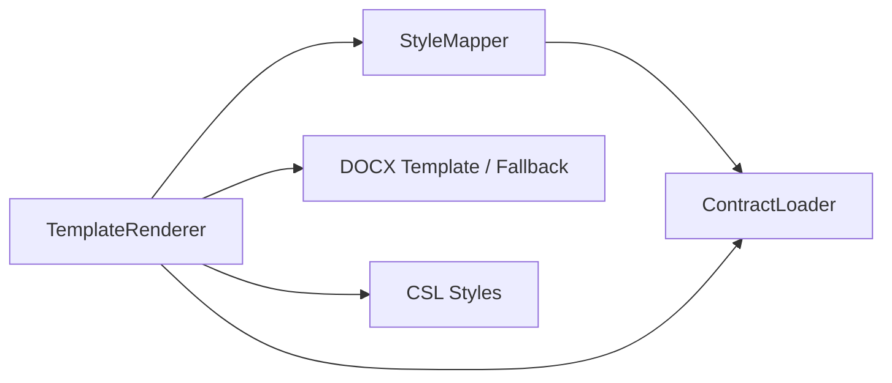

# Academic Templates

<cite>
**Referenced Files in This Document**
- [template_renderer.py](file://backend/app/pipeline/formatting/template_renderer.py)
- [style_mapper.py](file://backend/app/pipeline/formatting/style_mapper.py)
- [loader.py](file://backend/app/pipeline/contracts/loader.py)
- [contract.yaml (IEEE)](file://backend/app/templates/ieee/contract.yaml)
- [contract.yaml (APA)](file://backend/app/templates/apa/contract.yaml)
- [contract.yaml (Nature)](file://backend/app/templates/nature/contract.yaml)
- [contract.yaml (Chicago)](file://backend/app/templates/chicago/contract.yaml)
- [contract.yaml (Springer)](file://backend/app/templates/springer/contract.yaml)
- [contract.yaml (Elsevier)](file://backend/app/templates/elsevier/contract.yaml)
- [contract.yaml (ACM)](file://backend/app/templates/acm/contract.yaml)
- [contract.yaml (MLA)](file://backend/app/templates/mla/contract.yaml)
- [contract.yaml (Vancouver)](file://backend/app/templates/vancouver/contract.yaml)
- [styles.csl (IEEE)](file://backend/app/templates/ieee/styles.csl)
- [styles.csl (APA)](file://backend/app/templates/apa/styles.csl)
- [styles.csl (Nature)](file://backend/app/templates/nature/styles.csl)
- [styles.csl (Chicago)](file://backend/app/templates/chicago/styles.csl)
- [styles.csl (Springer)](file://backend/app/templates/springer/styles.csl)
- [styles.csl (Elsevier)](file://backend/app/templates/elsevier/styles.csl)
- [styles.csl (ACM)](file://backend/app/templates/acm/styles.csl)
- [styles.csl (MLA)](file://backend/app/templates/mla/styles.csl)
- [styles.csl (Vancouver)](file://backend/app/templates/vancouver/styles.csl)
- [test_templates.py](file://backend/tests/test_templates.py)
- [test_template_renderer.py](file://backend/tests/test_template_renderer.py)
- [test_template_assets_integrity.py](file://backend/tests/test_template_assets_integrity.py)
- [integration test for template integration](file://backend/tests/integration/test_template_integration.py)
- [template creation guide](file://backend/docs/template_creation_guide.md)
</cite>

## Table of Contents
1. [Introduction](#introduction)
2. [Project Structure](#project-structure)
3. [Core Components](#core-components)
4. [Architecture Overview](#architecture-overview)
5. [Detailed Component Analysis](#detailed-component-analysis)
6. [Dependency Analysis](#dependency-analysis)
7. [Performance Considerations](#performance-considerations)
8. [Troubleshooting Guide](#troubleshooting-guide)
9. [Conclusion](#conclusion)
10. [Appendices](#appendices)

## Introduction
This document describes the academic templates system that formats scholarly manuscripts according to publisher-specific styles. It covers the supported templates, their formatting rules, citation styles, structural requirements, and how the system detects and applies templates automatically. It also explains figure/table numbering, equation handling, reference management, customization options, and compliance with publisher guidelines.

## Project Structure
The template system is organized around:
- Publisher contracts that define Word styles and layout rules per template
- CSL (Citation Style Language) files for citation formatting
- A rendering engine that builds a Jinja2/docxtpl context and produces DOCX output
- A style mapper that maps semantic blocks to Word styles based on the active contract

**Diagram sources**
- [template_renderer.py:29-331](file://backend/app/pipeline/formatting/template_renderer.py#L29-L331)
- [style_mapper.py:5-28](file://backend/app/pipeline/formatting/style_mapper.py#L5-L28)
- [loader.py](file://backend/app/pipeline/contracts/loader.py)

**Section sources**
- [template_renderer.py:29-331](file://backend/app/pipeline/formatting/template_renderer.py#L29-L331)
- [style_mapper.py:5-28](file://backend/app/pipeline/formatting/style_mapper.py#L5-L28)

## Core Components
- TemplateRenderer: Builds the rendering context from a pipeline document and renders DOCX using Jinja2/docxtpl. It supports both pure Jinja2 templates and DOCX templates with Jinja markers, and falls back to a generated DOCX if needed.
- StyleMapper: Maps semantic block types to Word style names using the active publisher contract.
- Contracts (contract.yaml): Define Word styles for structural elements, headings, content, captions, and layout rules (page size, margins, spacing, column count).
- CSL styles (styles.csl): Define citation formatting for each template.

Key capabilities:
- Automatic template detection via marker inspection in DOCX templates
- Fallback template generation when no markers are present
- Context composition including title, authors, affiliations, abstract, keywords, sections, references, and formatting options
- Publisher-specific layout and style mapping

**Section sources**
- [template_renderer.py:29-331](file://backend/app/pipeline/formatting/template_renderer.py#L29-L331)
- [style_mapper.py:5-28](file://backend/app/pipeline/formatting/style_mapper.py#L5-L28)
- [loader.py](file://backend/app/pipeline/contracts/loader.py)

## Architecture Overview
The rendering pipeline transforms structured content into a styled DOCX aligned with a chosen template’s contract and CSL.

**Diagram sources**
- [template_renderer.py:65-82](file://backend/app/pipeline/formatting/template_renderer.py#L65-L82)
- [style_mapper.py:13-27](file://backend/app/pipeline/formatting/style_mapper.py#L13-L27)
- [loader.py](file://backend/app/pipeline/contracts/loader.py)

## Detailed Component Analysis

### TemplateRenderer
Responsibilities:
- Resolve template path and detect Jinja markers in DOCX templates
- Build a Jinja2 context from pipeline document metadata and blocks
- Render DOCX using docxtpl
- Provide fallback template generation if needed

Context keys:
- title, authors, affiliations, date, abstract, keywords, sections, references
- cover_page, toc, page_numbers, page_number

Formatting options resolution:
- cover_page, toc, page_numbers, page_number are resolved from document.formatting_options with sensible defaults

Template discovery:
- Uses either a Jinja2 source or a DOCX template with Jinja markers
- Falls back to a generated DOCX template if no markers are detected

Sections grouping:
- Non-reference blocks are grouped by heading levels into sections for rendering

References collection:
- Uses formatted references when available; otherwise extracts reference entries from blocks

**Section sources**
- [template_renderer.py:65-82](file://backend/app/pipeline/formatting/template_renderer.py#L65-L82)
- [template_renderer.py:94-159](file://backend/app/pipeline/formatting/template_renderer.py#L94-L159)
- [template_renderer.py:164-179](file://backend/app/pipeline/formatting/template_renderer.py#L164-L179)
- [template_renderer.py:257-273](file://backend/app/pipeline/formatting/template_renderer.py#L257-L273)
- [template_renderer.py:275-313](file://backend/app/pipeline/formatting/template_renderer.py#L275-L313)

### StyleMapper and Contracts
- StyleMapper reads the active publisher contract and maps semantic block types to Word style names.
- Contracts define:
  - Word style names for structural elements (title, abstract, keywords, references)
  - Heading styles (heading_1..heading_4)
  - Content and list styles
  - Captions style
  - Layout rules: page size, margins, default columns, line spacing, section overrides, and spacing before/after paragraphs and headings

Supported publishers and their contracts:
- IEEE, APA, Nature, Chicago, Springer, Elsevier, ACM, MLA, Vancouver

**Section sources**
- [style_mapper.py:13-27](file://backend/app/pipeline/formatting/style_mapper.py#L13-L27)
- [contract.yaml (IEEE):1-50](file://backend/app/templates/ieee/contract.yaml#L1-L50)
- [contract.yaml (APA):1-45](file://backend/app/templates/apa/contract.yaml#L1-L45)
- [contract.yaml (Nature):1-45](file://backend/app/templates/nature/contract.yaml#L1-L45)
- [contract.yaml (Chicago):1-45](file://backend/app/templates/chicago/contract.yaml#L1-L45)
- [contract.yaml (Springer):1-44](file://backend/app/templates/springer/contract.yaml#L1-L44)
- [contract.yaml (Elsevier):1-45](file://backend/app/templates/elsevier/contract.yaml#L1-L45)
- [contract.yaml (ACM):1-50](file://backend/app/templates/acm/contract.yaml#L1-L50)
- [contract.yaml (MLA):1-45](file://backend/app/templates/mla/contract.yaml#L1-L45)
- [contract.yaml (Vancouver):1-45](file://backend/app/templates/vancouver/contract.yaml#L1-L45)

### Citation Styles (CSL)
Each template includes a styles.csl file that defines citation formatting. These files are used by the citation assembly and formatting services to produce compliant reference lists.

Examples of included templates:
- IEEE, APA, Nature, Chicago, Springer, Elsevier, ACM, MLA, Vancouver

**Section sources**
- [styles.csl (IEEE)](file://backend/app/templates/ieee/styles.csl)
- [styles.csl (APA)](file://backend/app/templates/apa/styles.csl)
- [styles.csl (Nature)](file://backend/app/templates/nature/styles.csl)
- [styles.csl (Chicago)](file://backend/app/templates/chicago/styles.csl)
- [styles.csl (Springer)](file://backend/app/templates/springer/styles.csl)
- [styles.csl (Elsevier)](file://backend/app/templates/elsevier/styles.csl)
- [styles.csl (ACM)](file://backend/app/templates/acm/styles.csl)
- [styles.csl (MLA)](file://backend/app/templates/mla/styles.csl)
- [styles.csl (Vancouver)](file://backend/app/templates/vancouver/styles.csl)

### Supported Academic Templates
Below is a summary of each supported template’s structural and formatting characteristics derived from its contract and CSL assets.

- IEEE
  - Styles: Title, Abstract Heading, Abstract, Heading 1–4, Body Text, List Bullet, References, Figure Caption
  - Layout: Two-column default, specific margins, section overrides for abstract/references/title/acknowledgment, spacing presets
  - Citation style: IEEE

- APA
  - Styles: Title, Abstract Heading, Abstract, Heading 1–4, Normal, List Bullet, Bibliography, Caption
  - Layout: Letter page size, single column, double line spacing, uniform margins, section overrides for abstract/references/title
  - Citation style: APA 7th Edition

- Nature
  - Styles: Title, Abstract Heading, Abstract, Heading 1–4, Normal, List Bullet, Bibliography, Caption
  - Layout: A4 page size, single column, 1.5 line spacing, uniform margins, section overrides for abstract/references/title
  - Citation style: Nature

- Chicago
  - Styles: Title, Abstract Heading, Abstract, Heading 1–4, Normal, List Bullet, Bibliography, Caption
  - Layout: Letter page size, single column, double line spacing, uniform margins, section overrides for abstract/references/title
  - Citation style: Chicago Manual of Style

- Springer
  - Styles: Title, Abstract Heading, Abstract, Heading 1–3, Normal, List Bullet, Reference, Caption
  - Layout: A4 page size, single column, single line spacing, narrower margins, section overrides for abstract/references/title
  - Citation style: Springer

- Elsevier
  - Styles: Title, Abstract Heading, Abstract, Heading 1–4, Normal, List Bullet, Bibliography, Caption
  - Layout: A4 page size, single column, single line spacing, uniform margins, section overrides for abstract/references/title
  - Citation style: Elsevier

- ACM
  - Styles: Title, Abstract Heading, Abstract, Heading 1–4, Normal, List Bullet, Bibliography, Caption
  - Layout: Two-column default, narrower margins, section overrides for abstract/references/title/acknowledgment, spacing presets
  - Citation style: ACM

- MLA
  - Styles: Title, Abstract Heading, Abstract, Heading 1–4, Normal, List Bullet, Bibliography, Caption
  - Layout: Letter page size, single column, double line spacing, uniform margins, section overrides for abstract/references/title
  - Citation style: MLA

- Vancouver
  - Styles: Title, Abstract Heading, Abstract, Heading 1–4, Normal, List Bullet, Bibliography, Caption
  - Layout: A4 page size, single column, 1.5 line spacing, uniform margins, section overrides for abstract/references/title
  - Citation style: Vancouver

Notes:
- Additional templates (modern_blue, modern_gold, modern_red, numeric, portfolio, resume, none) exist in the templates directory and are supported similarly via contracts and optional CSL assets.

**Section sources**
- [contract.yaml (IEEE):1-50](file://backend/app/templates/ieee/contract.yaml#L1-L50)
- [contract.yaml (APA):1-45](file://backend/app/templates/apa/contract.yaml#L1-L45)
- [contract.yaml (Nature):1-45](file://backend/app/templates/nature/contract.yaml#L1-L45)
- [contract.yaml (Chicago):1-45](file://backend/app/templates/chicago/contract.yaml#L1-L45)
- [contract.yaml (Springer):1-44](file://backend/app/templates/springer/contract.yaml#L1-L44)
- [contract.yaml (Elsevier):1-45](file://backend/app/templates/elsevier/contract.yaml#L1-L45)
- [contract.yaml (ACM):1-50](file://backend/app/templates/acm/contract.yaml#L1-L50)
- [contract.yaml (MLA):1-45](file://backend/app/templates/mla/contract.yaml#L1-L45)
- [contract.yaml (Vancouver):1-45](file://backend/app/templates/vancouver/contract.yaml#L1-L45)

### Template Selection Criteria and Automatic Detection
- Template selection:
  - The renderer accepts a template_name and resolves it to a template directory under the templates folder.
  - It prefers a Jinja2 source if present; otherwise uses a DOCX template with Jinja markers.
  - If no markers are found, it generates a fallback DOCX template.
- Automatic detection:
  - The renderer inspects DOCX XML content to detect Jinja markers and caches the result to avoid repeated scans.

**Diagram sources**
- [template_renderer.py:164-179](file://backend/app/pipeline/formatting/template_renderer.py#L164-L179)
- [template_renderer.py:200-230](file://backend/app/pipeline/formatting/template_renderer.py#L200-L230)

**Section sources**
- [template_renderer.py:65-82](file://backend/app/pipeline/formatting/template_renderer.py#L65-L82)
- [template_renderer.py:164-179](file://backend/app/pipeline/formatting/template_renderer.py#L164-L179)
- [template_renderer.py:200-230](file://backend/app/pipeline/formatting/template_renderer.py#L200-L230)

### Formatting Rules, Citation Styles, and Structural Requirements
- Structural elements:
  - Title, Abstract Heading, Abstract Body
  - Keywords Heading and Body
  - Headings 1–4
  - Body and List Items
  - References Heading and Entries
  - Captions for Figures and Tables
- Citation styles:
  - Each template includes a styles.csl that governs how references appear (e.g., numeric, author-date, etc.), used by the citation assembly service.
- Layout rules:
  - Page size, margins, default columns, line spacing, section overrides, and spacing before/after paragraphs/headings are defined per contract.

**Section sources**
- [contract.yaml (IEEE):25-50](file://backend/app/templates/ieee/contract.yaml#L25-L50)
- [contract.yaml (APA):25-45](file://backend/app/templates/apa/contract.yaml#L25-L45)
- [contract.yaml (Nature):25-45](file://backend/app/templates/nature/contract.yaml#L25-L45)
- [contract.yaml (Chicago):25-45](file://backend/app/templates/chicago/contract.yaml#L25-L45)
- [contract.yaml (Springer):24-44](file://backend/app/templates/springer/contract.yaml#L24-L44)
- [contract.yaml (Elsevier):25-45](file://backend/app/templates/elsevier/contract.yaml#L25-L45)
- [contract.yaml (ACM):25-50](file://backend/app/templates/acm/contract.yaml#L25-L50)
- [contract.yaml (MLA):25-45](file://backend/app/templates/mla/contract.yaml#L25-L45)
- [contract.yaml (Vancouver):25-45](file://backend/app/templates/vancouver/contract.yaml#L25-L45)

### Figure Numbering, Table Formatting, Equation Handling, and Reference Management
- Figure and table captions:
  - Contracts define a dedicated caption style mapped to semantic captions; StyleMapper ensures captions render with the appropriate Word style.
- Equations:
  - Equation standardization and OMML-to-MML conversion are handled by the equations subsystem; templates apply the mapped styles for math blocks.
- References:
  - References are collected from formatted references when available; otherwise extracted from blocks labeled as reference entries. The renderer passes a list of formatted reference strings to the template context.

**Diagram sources**
- [template_renderer.py:29-331](file://backend/app/pipeline/formatting/template_renderer.py#L29-L331)
- [style_mapper.py:5-28](file://backend/app/pipeline/formatting/style_mapper.py#L5-L28)
- [loader.py](file://backend/app/pipeline/contracts/loader.py)

**Section sources**
- [template_renderer.py:257-273](file://backend/app/pipeline/formatting/template_renderer.py#L257-L273)
- [template_renderer.py:275-313](file://backend/app/pipeline/formatting/template_renderer.py#L275-L313)
- [style_mapper.py:13-27](file://backend/app/pipeline/formatting/style_mapper.py#L13-L27)

### Examples of Formatted Outputs and Customization Options
- Formatted outputs:
  - The renderer produces a DOCX with sections, references, and metadata styled according to the selected template’s contract and CSL.
- Customization options:
  - Formatting toggles: cover_page, toc, page_numbers, page_number
  - Defaults are applied when not provided in document.formatting_options

**Section sources**
- [template_renderer.py:125-159](file://backend/app/pipeline/formatting/template_renderer.py#L125-L159)

### Publisher-Specific Compliance Requirements
- Compliance is achieved by:
  - Mapping semantic blocks to Word styles defined in each contract
  - Enforcing layout rules (page size, margins, columns, spacing)
  - Applying the correct CSL for citations

**Section sources**
- [contract.yaml (IEEE):25-50](file://backend/app/templates/ieee/contract.yaml#L25-L50)
- [contract.yaml (APA):25-45](file://backend/app/templates/apa/contract.yaml#L25-L45)
- [contract.yaml (Nature):25-45](file://backend/app/templates/nature/contract.yaml#L25-L45)
- [contract.yaml (Chicago):25-45](file://backend/app/templates/chicago/contract.yaml#L25-L45)
- [contract.yaml (Springer):24-44](file://backend/app/templates/springer/contract.yaml#L24-L44)
- [contract.yaml (Elsevier):25-45](file://backend/app/templates/elsevier/contract.yaml#L25-L45)
- [contract.yaml (ACM):25-50](file://backend/app/templates/acm/contract.yaml#L25-L50)
- [contract.yaml (MLA):25-45](file://backend/app/templates/mla/contract.yaml#L25-L45)
- [contract.yaml (Vancouver):25-45](file://backend/app/templates/vancouver/contract.yaml#L25-L45)

## Dependency Analysis
- TemplateRenderer depends on:
  - ContractLoader for publisher contracts
  - StyleMapper for Word style mapping
  - docxtpl and python-docx for rendering and fallback generation
- StyleMapper depends on ContractLoader and semantic block types
- Contracts and CSL files are the authoritative sources for formatting and citation rules

**Diagram sources**
- [template_renderer.py:29-331](file://backend/app/pipeline/formatting/template_renderer.py#L29-L331)
- [style_mapper.py:5-28](file://backend/app/pipeline/formatting/style_mapper.py#L5-L28)
- [loader.py](file://backend/app/pipeline/contracts/loader.py)

**Section sources**
- [template_renderer.py:29-331](file://backend/app/pipeline/formatting/template_renderer.py#L29-L331)
- [style_mapper.py:5-28](file://backend/app/pipeline/formatting/style_mapper.py#L5-L28)

## Performance Considerations
- Template marker caching reduces repeated ZIP/XML scans for DOCX templates.
- Fallback template generation occurs only when necessary, minimizing overhead.
- Context building aggregates metadata and sections efficiently.

[No sources needed since this section provides general guidance]

## Troubleshooting Guide
Common issues and resolutions:
- Missing docxtpl: The renderer raises an ImportError if the library is unavailable. Install the required dependency to enable rendering.
- No Jinja markers in DOCX: The renderer logs a warning and falls back to a generated template. Add Jinja markers to the DOCX or provide a Jinja2 source.
- Missing references: If references are not formatted, ensure the document includes properly labeled reference entries or formatted references.
- Style mismatches: Verify the contract for the selected publisher and confirm that semantic block types match the expected keys.

**Section sources**
- [template_renderer.py:67-70](file://backend/app/pipeline/formatting/template_renderer.py#L67-L70)
- [template_renderer.py:175-178](file://backend/app/pipeline/formatting/template_renderer.py#L175-L178)
- [template_renderer.py:257-273](file://backend/app/pipeline/formatting/template_renderer.py#L257-L273)

## Conclusion
The academic templates system provides robust, publisher-aware formatting for scholarly manuscripts. By combining contracts, CSL styles, and a flexible rendering engine, it supports a wide range of citation styles and layout requirements while enabling automatic template detection and customization.

[No sources needed since this section summarizes without analyzing specific files]

## Appendices

### Appendix A: Template Assets Integrity and Tests
- Template asset integrity checks ensure contracts and styles are present and valid.
- Template tests validate rendering behavior and context building.

**Section sources**
- [test_template_assets_integrity.py](file://backend/tests/test_template_assets_integrity.py)
- [test_templates.py](file://backend/tests/test_templates.py)
- [test_template_renderer.py](file://backend/tests/test_template_renderer.py)
- [integration test for template integration](file://backend/tests/integration/test_template_integration.py)

### Appendix B: Creating New Templates
Follow the template creation guide to add new publishers or customize existing ones, including writing contracts and CSL files and ensuring proper style mappings.

**Section sources**
- [template creation guide](file://backend/docs/template_creation_guide.md)