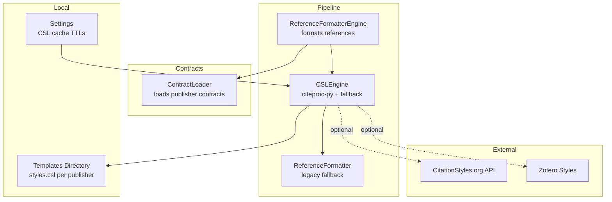
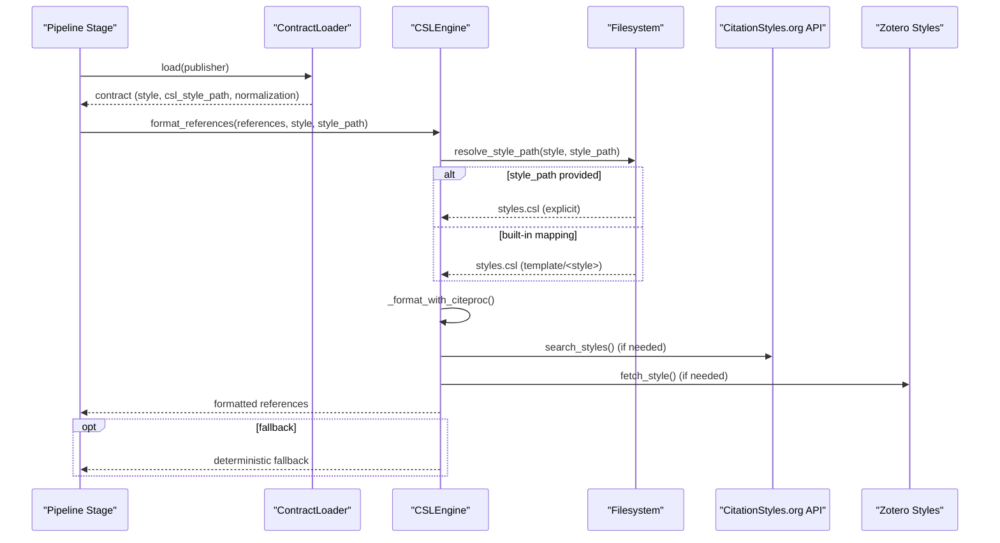
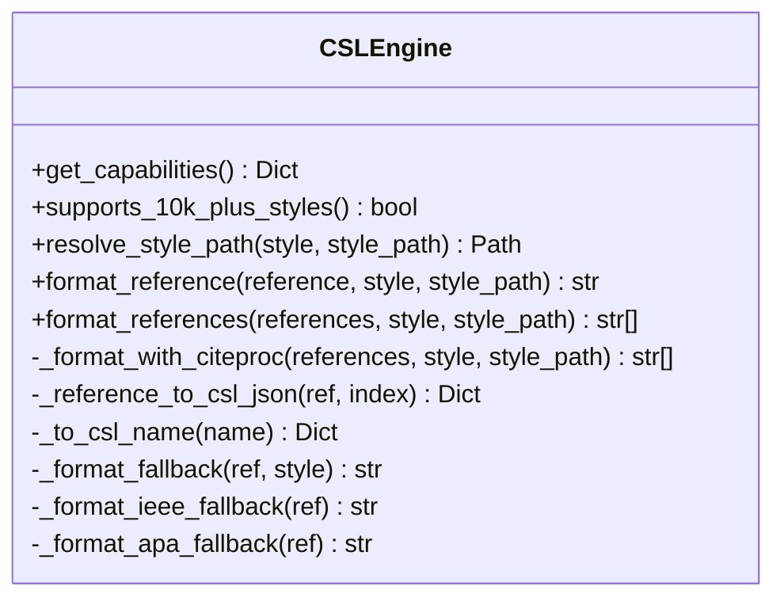
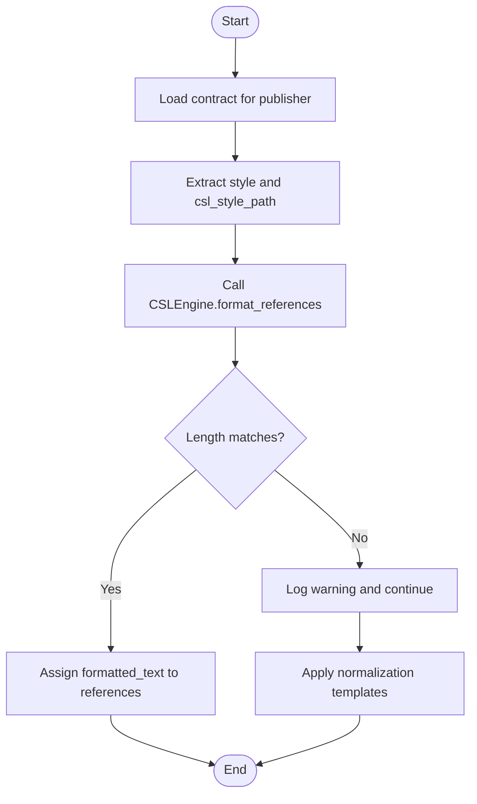
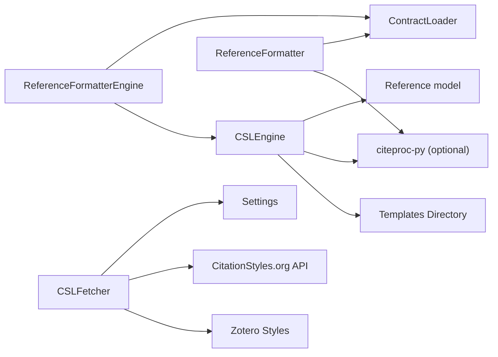

# CSL Integration

<cite>
**Referenced Files in This Document**
- [csl_engine.py](file://backend/app/pipeline/services/csl_engine.py)
- [csl_fetcher.py](file://backend/app/pipeline/services/csl_fetcher.py)
- [formatter_engine.py](file://backend/app/pipeline/references/formatter_engine.py)
- [reference_formatter.py](file://backend/app/pipeline/formatting/reference_formatter.py)
- [loader.py](file://backend/app/pipeline/contracts/loader.py)
- [settings.py](file://backend/app/config/settings.py)
- [test_csl_integration.py](file://backend/tests/integration/test_csl_integration.py)
- [apa/styles.csl](file://backend/app/templates/apa/styles.csl)
- [ieee/styles.csl](file://backend/app/templates/ieee/styles.csl)
</cite>

## Table of Contents
1. [Introduction](#introduction)
2. [Project Structure](#project-structure)
3. [Core Components](#core-components)
4. [Architecture Overview](#architecture-overview)
5. [Detailed Component Analysis](#detailed-component-analysis)
6. [Dependency Analysis](#dependency-analysis)
7. [Performance Considerations](#performance-considerations)
8. [Troubleshooting Guide](#troubleshooting-guide)
9. [Conclusion](#conclusion)

## Introduction
This document explains the Citation Style Language (CSL) integration used to format citations and references in the manuscript formatting pipeline. It covers how CSL stylesheets are discovered and loaded, how references are transformed into CSL-JSON and rendered, and how the system gracefully falls back to deterministic formatting when citeproc-py is unavailable. It also documents the integration with external CSL repositories, caching strategies for style discovery and retrieval, and fallback mechanisms. Finally, it provides guidance on customization, validation, and troubleshooting.

## Project Structure
The CSL integration spans several modules:
- Services: style fetching and engine orchestration
- Formatting: pipeline stages that apply CSL or deterministic fallback
- Contracts: publisher-specific configuration that drives formatting rules
- Templates: local CSL styles bundled with the application
- Settings: cache TTL configuration for external style discovery

**Diagram sources**
- [formatter_engine.py:18-75](file://backend/app/pipeline/references/formatter_engine.py#L18-L75)
- [csl_engine.py:38-140](file://backend/app/pipeline/services/csl_engine.py#L38-L140)
- [reference_formatter.py:153-288](file://backend/app/pipeline/formatting/reference_formatter.py#L153-L288)
- [loader.py:8-38](file://backend/app/pipeline/contracts/loader.py#L8-L38)
- [csl_fetcher.py:138-179](file://backend/app/pipeline/services/csl_fetcher.py#L138-L179)
- [settings.py:167-168](file://backend/app/config/settings.py#L167-L168)

**Section sources**
- [formatter_engine.py:18-75](file://backend/app/pipeline/references/formatter_engine.py#L18-L75)
- [csl_engine.py:38-140](file://backend/app/pipeline/services/csl_engine.py#L38-L140)
- [reference_formatter.py:153-288](file://backend/app/pipeline/formatting/reference_formatter.py#L153-L288)
- [loader.py:8-38](file://backend/app/pipeline/contracts/loader.py#L8-L38)
- [csl_fetcher.py:138-179](file://backend/app/pipeline/services/csl_fetcher.py#L138-L179)
- [settings.py:167-168](file://backend/app/config/settings.py#L167-L168)

## Core Components
- CSLEngine: primary CSL formatter that uses citeproc-py when available and deterministic fallback otherwise. It resolves styles from local templates or external sources and converts internal references to CSL-JSON.
- ReferenceFormatterEngine: pipeline stage that selects the appropriate style from the contract and applies CSLEngine, with fallback to contract-driven normalization templates.
- ReferenceFormatter: legacy formatter that formats references without citeproc-py, used when citeproc is unavailable or when templates lack styles.
- ContractLoader: loads publisher contracts that define style selection and normalization rules.
- CSLFetcher: discovers and retrieves styles from local templates, the CitationStyles.org API, and Zotero styles, with in-memory caching and locks.

**Section sources**
- [csl_engine.py:38-283](file://backend/app/pipeline/services/csl_engine.py#L38-L283)
- [formatter_engine.py:18-114](file://backend/app/pipeline/references/formatter_engine.py#L18-L114)
- [reference_formatter.py:153-288](file://backend/app/pipeline/formatting/reference_formatter.py#L153-L288)
- [loader.py:8-74](file://backend/app/pipeline/contracts/loader.py#L8-L74)
- [csl_fetcher.py:138-179](file://backend/app/pipeline/services/csl_fetcher.py#L138-L179)

## Architecture Overview
The CSL pipeline integrates three layers:
- Style Resolution: choose a style by publisher or explicit path, with fallback to local defaults.
- Rendering: convert references to CSL-JSON and render via citeproc-py; fall back to deterministic formatting if needed.
- Contracts and Fallback: contracts define normalization rules when CSL fails or is absent.

**Diagram sources**
- [formatter_engine.py:28-75](file://backend/app/pipeline/references/formatter_engine.py#L28-L75)
- [csl_engine.py:68-140](file://backend/app/pipeline/services/csl_engine.py#L68-L140)
- [csl_fetcher.py:80-179](file://backend/app/pipeline/services/csl_fetcher.py#L80-L179)

## Detailed Component Analysis

### CSLEngine
Responsibilities:
- Determine capabilities and availability of citeproc-py.
- Resolve style paths from explicit paths or built-in template mapping.
- Convert internal references to CSL-JSON items.
- Render citations/bibliography via citeproc-py.
- Provide deterministic fallback for unsupported styles or missing citeproc-py.

Key behaviors:
- Style resolution prefers explicit style_path if provided; otherwise maps style keys to template folders and loads styles.csl.
- Reference-to-CSL-JSON mapping handles types, names, containers, identifiers, and dates.
- Fallback logic formats IEEE and APA deterministically when citeproc is unavailable.

**Diagram sources**
- [csl_engine.py:38-283](file://backend/app/pipeline/services/csl_engine.py#L38-L283)

**Section sources**
- [csl_engine.py:38-283](file://backend/app/pipeline/services/csl_engine.py#L38-L283)

### ReferenceFormatterEngine
Responsibilities:
- Select style from the contract (publisher’s contract).
- Apply CSLEngine to format references.
- Fall back to contract-defined normalization templates when CSL fails.

Processing logic:
- Loads contract for publisher, extracts style and optional csl_style_path.
- Calls CSLEngine.format_references; validates output length.
- On failure, logs a warning and applies deterministic normalization rules from the contract.

**Diagram sources**
- [formatter_engine.py:28-75](file://backend/app/pipeline/references/formatter_engine.py#L28-L75)

**Section sources**
- [formatter_engine.py:18-114](file://backend/app/pipeline/references/formatter_engine.py#L18-L114)

### ReferenceFormatter (Legacy)
Responsibilities:
- Legacy formatter that formats references without citeproc-py.
- Used when citeproc-py is unavailable or when templates lack styles.

Highlights:
- Attempts citeproc formatting first; on failure, falls back to legacy formatting.
- Supports simple IEEE-like formatting and “none” normalization.

**Section sources**
- [reference_formatter.py:153-288](file://backend/app/pipeline/formatting/reference_formatter.py#L153-L288)

### ContractLoader
Responsibilities:
- Load publisher contracts from disk, with caching.
- Provide canonical names and required sections.
- Fallback to a “none” contract if a publisher contract is missing.

**Section sources**
- [loader.py:8-74](file://backend/app/pipeline/contracts/loader.py#L8-L74)

### CSLFetcher
Responsibilities:
- Search styles across local templates and the CitationStyles.org API.
- Fetch individual styles from local templates or Zotero.
- Maintain in-memory caches with TTL and async locks for thread safety.

Caching:
- Search cache keyed by query and limit with TTL.
- Style cache keyed by slug with TTL.
- Locks protect concurrent updates.

External integration:
- Uses CitationStyles.org API for style discovery.
- Retrieves full style content from Zotero styles repository.

**Section sources**
- [csl_fetcher.py:138-179](file://backend/app/pipeline/services/csl_fetcher.py#L138-L179)
- [settings.py:167-168](file://backend/app/config/settings.py#L167-L168)

## Dependency Analysis
- CSLEngine depends on:
  - Internal Reference model for data conversion.
  - Optional citeproc-py for rendering.
  - Local templates directory for styles.csl resolution.
- ReferenceFormatterEngine depends on:
  - ContractLoader for publisher rules.
  - CSLEngine for CSL rendering.
- ReferenceFormatter (legacy) depends on:
  - ContractLoader for normalization rules.
  - Optional citeproc-py availability.
- CSLFetcher depends on:
  - Settings for cache TTLs.
  - httpx for network requests.
  - Local filesystem for templates.

**Diagram sources**
- [csl_engine.py:15-29](file://backend/app/pipeline/services/csl_engine.py#L15-L29)
- [formatter_engine.py:12-26](file://backend/app/pipeline/references/formatter_engine.py#L12-L26)
- [reference_formatter.py:22-35](file://backend/app/pipeline/formatting/reference_formatter.py#L22-L35)
- [csl_fetcher.py:138-179](file://backend/app/pipeline/services/csl_fetcher.py#L138-L179)
- [settings.py:167-168](file://backend/app/config/settings.py#L167-L168)

**Section sources**
- [csl_engine.py:15-29](file://backend/app/pipeline/services/csl_engine.py#L15-L29)
- [formatter_engine.py:12-26](file://backend/app/pipeline/references/formatter_engine.py#L12-L26)
- [reference_formatter.py:22-35](file://backend/app/pipeline/formatting/reference_formatter.py#L22-L35)
- [csl_fetcher.py:138-179](file://backend/app/pipeline/services/csl_fetcher.py#L138-L179)
- [settings.py:167-168](file://backend/app/config/settings.py#L167-L168)

## Performance Considerations
- citeproc-py availability: When citeproc-py is present, rendering is delegated to it for accurate, standards-compliant formatting. When absent, deterministic fallback is used.
- Style caching:
  - CSLEngine caches CSL-JSON items internally during a single render operation.
  - CSLFetcher maintains in-memory caches for search results and style content with TTLs controlled by settings.
- Concurrency:
  - CSLFetcher uses asyncio locks to guard cache updates, preventing race conditions during concurrent lookups.
- Network resilience:
  - External style discovery and retrieval are best-effort; failures do not block local formatting.

[No sources needed since this section provides general guidance]

## Troubleshooting Guide
Common issues and resolutions:
- Missing citeproc-py:
  - Symptom: Warning logged indicating citeproc-py not installed; fallback formatting is used.
  - Resolution: Install citeproc-py to enable CSL rendering.
  - Evidence: Logging and fallback behavior in both engines.
- Style file not found:
  - Symptom: FileNotFoundError raised when resolving style path.
  - Resolution: Ensure styles.csl exists under the expected template folder or provide a valid style_path.
- CSL rendering failure:
  - Symptom: Warning logged and fallback to deterministic formatting.
  - Resolution: Verify style correctness and reference data; check logs for exceptions.
- External style discovery failing:
  - Symptom: Empty or partial style lists from API.
  - Resolution: Confirm network connectivity and API availability; rely on local styles when needed.
- Cache TTL misconfiguration:
  - Symptom: Frequent network calls or stale results.
  - Resolution: Adjust CSL_SEARCH_CACHE_TTL_SECONDS and CSL_FETCH_CACHE_TTL_SECONDS in settings.

Validation references:
- Integration tests demonstrate expected behavior for IEEE and APA formatting and style existence checks.

**Section sources**
- [csl_engine.py:105-115](file://backend/app/pipeline/services/csl_engine.py#L105-L115)
- [formatter_engine.py:59-66](file://backend/app/pipeline/references/formatter_engine.py#L59-L66)
- [csl_fetcher.py:101-123](file://backend/app/pipeline/services/csl_fetcher.py#L101-L123)
- [settings.py:167-168](file://backend/app/config/settings.py#L167-L168)
- [test_csl_integration.py:101-111](file://backend/tests/integration/test_csl_integration.py#L101-L111)

## Conclusion
The CSL integration combines robust style resolution, citeproc-py rendering, and deterministic fallback to ensure reliable citation formatting across publishers and environments. External style discovery and retrieval are supported with caching and concurrency safeguards. Contracts provide a fallback normalization layer when CSL is unavailable. By tuning cache TTLs and ensuring styles are present, teams can maintain predictable, high-quality formatting for academic manuscripts.