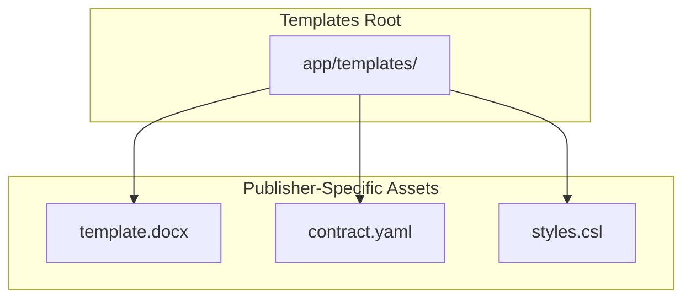
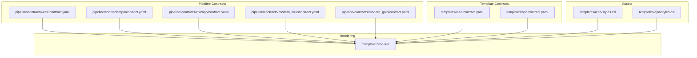
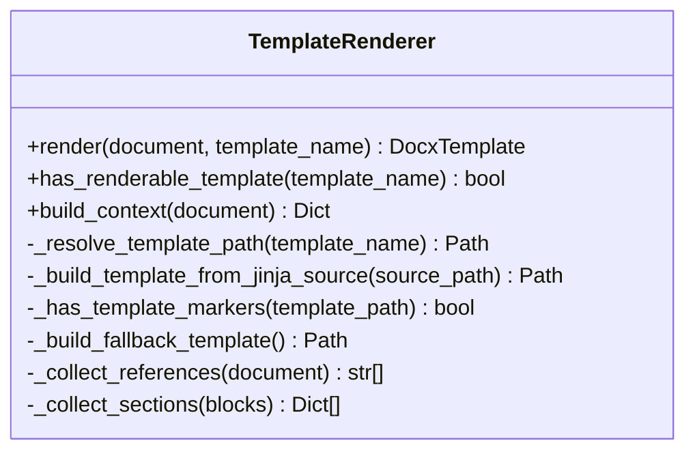
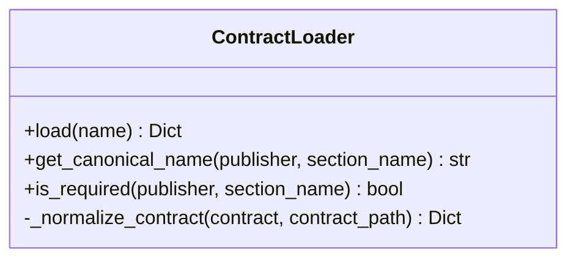
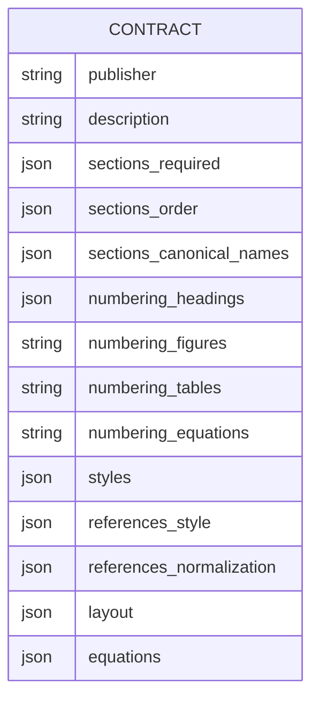
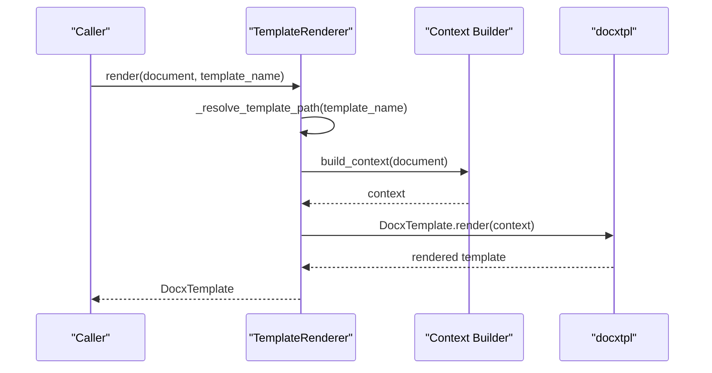
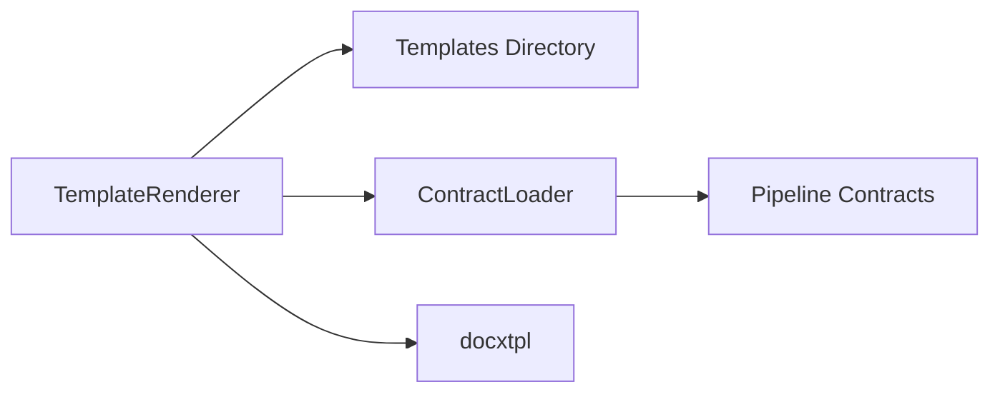

# Template Architecture

<cite>
**Referenced Files in This Document**
- [template_renderer.py](file://backend/app/pipeline/formatting/template_renderer.py)
- [loader.py](file://backend/app/pipeline/contracts/loader.py)
- [template_creation_guide.md](file://backend/docs/template_creation_guide.md)
- [contract.yaml (IEEE)](file://backend/app/templates/ieee/contract.yaml)
- [styles.csl (IEEE)](file://backend/app/templates/ieee/styles.csl)
- [contract.yaml (APA)](file://backend/app/templates/apa/contract.yaml)
- [styles.csl (APA)](file://backend/app/templates/apa/styles.csl)
- [contract.yaml (IEEE, pipeline)](file://backend/app/pipeline/contracts/ieee/contract.yaml)
- [contract.yaml (APA, pipeline)](file://backend/app/pipeline/contracts/apa/contract.yaml)
- [contract.yaml (Chicago, pipeline)](file://backend/app/pipeline/contracts/chicago/contract.yaml)
- [contract.yaml (Modern Blue, pipeline)](file://backend/app/pipeline/contracts/modern_blue/contract.yaml)
- [contract.yaml (Modern Gold, pipeline)](file://backend/app/pipeline/contracts/modern_gold/contract.yaml)
</cite>

## Table of Contents
1. [Introduction](#introduction)
2. [Project Structure](#project-structure)
3. [Core Components](#core-components)
4. [Architecture Overview](#architecture-overview)
5. [Detailed Component Analysis](#detailed-component-analysis)
6. [Dependency Analysis](#dependency-analysis)
7. [Performance Considerations](#performance-considerations)
8. [Troubleshooting Guide](#troubleshooting-guide)
9. [Conclusion](#conclusion)
10. [Appendices](#appendices)

## Introduction
This document explains the template architecture used to format academic manuscripts into DOCX. It covers the contract-based design that defines how content is structured and styled, the directory organization for templates and assets, the template loading and rendering mechanisms, and how templates integrate with the formatting pipeline. It also documents template metadata, validation rules, and compatibility considerations across publishers and styles.

## Project Structure
Templates are organized by publisher/style under a dedicated templates directory. Each template typically includes:
- A DOCX template with Jinja2 markers for dynamic rendering
- A YAML contract that defines structural expectations and layout rules
- An optional CSL stylesheet for reference formatting

**Diagram sources**
- [template_creation_guide.md:13-17](file://backend/docs/template_creation_guide.md#L13-L17)
- [contract.yaml (IEEE):1-50](file://backend/app/templates/ieee/contract.yaml#L1-L50)
- [styles.csl (IEEE):1-66](file://backend/app/templates/ieee/styles.csl#L1-L66)

**Section sources**
- [template_creation_guide.md:5-17](file://backend/docs/template_creation_guide.md#L5-L17)

## Core Components
- TemplateRenderer: Builds a Jinja2 context from a pipeline document and renders DOCX using docxtpl. It supports both native DOCX templates with Jinja markers and plain DOCX templates by auto-detecting markers and generating fallback templates when needed.
- ContractLoader: Loads and normalizes template contracts from either the templates directory or the pipeline contracts directory. Contracts define required sections, canonical names, and layout rules.

Key responsibilities:
- Template discovery and selection by publisher/style
- Context building for rendering (metadata, sections, references, formatting flags)
- Fallback template generation when marker detection fails
- Contract normalization for backward compatibility

**Section sources**
- [template_renderer.py:29-331](file://backend/app/pipeline/formatting/template_renderer.py#L29-L331)
- [loader.py:8-82](file://backend/app/pipeline/contracts/loader.py#L8-L82)

## Architecture Overview
The template architecture integrates three pillars:
- Template YAML contracts: Define structural semantics, required sections, numbering, and layout rules.
- CSL stylesheets: Provide reference formatting rules applied upstream in the pipeline.
- Rendering engine: Uses Jinja2/docxtpl to materialize DOCX output from templates and context.

**Diagram sources**
- [template_renderer.py:65-82](file://backend/app/pipeline/formatting/template_renderer.py#L65-L82)
- [loader.py:16-38](file://backend/app/pipeline/contracts/loader.py#L16-L38)
- [contract.yaml (IEEE, pipeline):1-99](file://backend/app/pipeline/contracts/ieee/contract.yaml#L1-L99)
- [contract.yaml (APA, pipeline):1-101](file://backend/app/pipeline/contracts/apa/contract.yaml#L1-L101)
- [contract.yaml (Chicago, pipeline):1-80](file://backend/app/pipeline/contracts/chicago/contract.yaml#L1-L80)
- [contract.yaml (Modern Blue, pipeline):1-83](file://backend/app/pipeline/contracts/modern_blue/contract.yaml#L1-L83)
- [contract.yaml (Modern Gold, pipeline):1-83](file://backend/app/pipeline/contracts/modern_gold/contract.yaml#L1-L83)
- [contract.yaml (IEEE):1-50](file://backend/app/templates/ieee/contract.yaml#L1-L50)
- [contract.yaml (APA):1-45](file://backend/app/templates/apa/contract.yaml#L1-L45)
- [styles.csl (IEEE):1-66](file://backend/app/templates/ieee/styles.csl#L1-L66)
- [styles.csl (APA):1-86](file://backend/app/templates/apa/styles.csl#L1-L86)

## Detailed Component Analysis

### TemplateRenderer
Responsibilities:
- Resolve template path by style, preferring Jinja2 sources or DOCX with markers, with fallback to a generated DOCX template.
- Build a Jinja2 context from pipeline document metadata and content blocks.
- Render DOCX using docxtpl and return the rendered template object.

Processing logic highlights:
- Context composition includes title, authors, affiliations, date, abstract, keywords, sections, references, and formatting flags (cover page, TOC, page numbers).
- Sections grouping excludes structural blocks (title, authors, abstract, keywords, references) and captions.
- References collection prioritizes pre-formatted references and falls back to raw reference entries.

**Diagram sources**
- [template_renderer.py:29-331](file://backend/app/pipeline/formatting/template_renderer.py#L29-L331)

**Section sources**
- [template_renderer.py:65-82](file://backend/app/pipeline/formatting/template_renderer.py#L65-L82)
- [template_renderer.py:94-159](file://backend/app/pipeline/formatting/template_renderer.py#L94-L159)
- [template_renderer.py:164-179](file://backend/app/pipeline/formatting/template_renderer.py#L164-L179)
- [template_renderer.py:181-198](file://backend/app/pipeline/formatting/template_renderer.py#L181-L198)
- [template_renderer.py:200-230](file://backend/app/pipeline/formatting/template_renderer.py#L200-L230)
- [template_renderer.py:232-255](file://backend/app/pipeline/formatting/template_renderer.py#L232-L255)
- [template_renderer.py:257-273](file://backend/app/pipeline/formatting/template_renderer.py#L257-L273)
- [template_renderer.py:275-313](file://backend/app/pipeline/formatting/template_renderer.py#L275-L313)

### ContractLoader
Responsibilities:
- Load contracts by publisher/style from the templates directory or fall back to a “none” contract if missing.
- Normalize contracts for backward compatibility and expose helpers to resolve canonical section names and required sections.

**Diagram sources**
- [loader.py:8-82](file://backend/app/pipeline/contracts/loader.py#L8-L82)

**Section sources**
- [loader.py:16-38](file://backend/app/pipeline/contracts/loader.py#L16-L38)
- [loader.py:40-57](file://backend/app/pipeline/contracts/loader.py#L40-L57)
- [loader.py:59-74](file://backend/app/pipeline/contracts/loader.py#L59-L74)

### Template Contracts and Metadata
Template contracts define:
- Publisher identity and description
- Required sections and canonical name mappings
- Numbering rules for headings, figures, tables, and equations
- Styles mapping for document elements
- Reference formatting configuration (style, citation format, normalization)
- Layout rules (margins, spacing, page size, columns, overrides)
- Equation numbering and alignment preferences

Examples:
- IEEE contract defines numeric heading numbering, global equation numbering, and specific spacing for references.
- APA contract defines no heading numbering and APA-style citation format with normalization rules.
- Chicago contract defines footnote-citation style and Times New Roman font defaults.

**Diagram sources**
- [contract.yaml (IEEE, pipeline):1-99](file://backend/app/pipeline/contracts/ieee/contract.yaml#L1-L99)
- [contract.yaml (APA, pipeline):1-101](file://backend/app/pipeline/contracts/apa/contract.yaml#L1-L101)
- [contract.yaml (Chicago, pipeline):1-80](file://backend/app/pipeline/contracts/chicago/contract.yaml#L1-L80)
- [contract.yaml (Modern Blue, pipeline):1-83](file://backend/app/pipeline/contracts/modern_blue/contract.yaml#L1-L83)
- [contract.yaml (Modern Gold, pipeline):1-83](file://backend/app/pipeline/contracts/modern_gold/contract.yaml#L1-L83)

**Section sources**
- [contract.yaml (IEEE, pipeline):1-99](file://backend/app/pipeline/contracts/ieee/contract.yaml#L1-L99)
- [contract.yaml (APA, pipeline):1-101](file://backend/app/pipeline/contracts/apa/contract.yaml#L1-L101)
- [contract.yaml (Chicago, pipeline):1-80](file://backend/app/pipeline/contracts/chicago/contract.yaml#L1-L80)
- [contract.yaml (Modern Blue, pipeline):1-83](file://backend/app/pipeline/contracts/modern_blue/contract.yaml#L1-L83)
- [contract.yaml (Modern Gold, pipeline):1-83](file://backend/app/pipeline/contracts/modern_gold/contract.yaml#L1-L83)

### Template YAML Contracts vs Pipeline Contracts
- Template contracts (under app/templates/<publisher>) describe the structure and presentation expectations for a specific style.
- Pipeline contracts (under app/pipeline/contracts) provide canonical definitions for publishers and are used by the formatting pipeline to enforce ordering, numbering, and layout rules consistently across rendering.

Compatibility and inheritance:
- Contracts are loaded by style name; if missing, the loader falls back to a “none” contract.
- Canonical name mapping allows flexible input section names to align with required sections.

**Section sources**
- [loader.py:16-38](file://backend/app/pipeline/contracts/loader.py#L16-L38)
- [loader.py:59-74](file://backend/app/pipeline/contracts/loader.py#L59-L74)

### CSL Stylesheets and Reference Formatting
- Templates receive pre-formatted reference strings via the rendering context.
- Publisher-specific CSL stylesheets define how citations and bibliographies appear in the final document.
- Styles are included alongside templates and are referenced during the pipeline’s reference formatting stage.

**Section sources**
- [template_creation_guide.md:82-91](file://backend/docs/template_creation_guide.md#L82-L91)
- [styles.csl (IEEE):1-66](file://backend/app/templates/ieee/styles.csl#L1-L66)
- [styles.csl (APA):1-86](file://backend/app/templates/apa/styles.csl#L1-L86)

### Template Discovery and Loading Mechanisms
Template discovery:
- Templates are resolved by style name under the templates directory.
- The renderer prefers a Jinja2 source if present; otherwise, it checks for a DOCX with Jinja markers.
- If neither is suitable, a temporary fallback DOCX is generated.

Validation and integrity:
- Marker detection scans DOCX XML to confirm Jinja expressions exist.
- A warning is logged when a DOCX lacks markers; a fallback template is used.

**Section sources**
- [template_renderer.py:84-93](file://backend/app/pipeline/formatting/template_renderer.py#L84-L93)
- [template_renderer.py:164-179](file://backend/app/pipeline/formatting/template_renderer.py#L164-L179)
- [template_renderer.py:200-230](file://backend/app/pipeline/formatting/template_renderer.py#L200-L230)
- [template_renderer.py:232-255](file://backend/app/pipeline/formatting/template_renderer.py#L232-L255)

### Template Metadata, Validation Rules, and Compatibility
Metadata:
- Contracts include publisher, description, required sections, canonical names, numbering rules, styles, references configuration, layout, and equations.

Validation rules:
- Renderers validate that no unresolved Jinja tokens remain after rendering.
- Conditional blocks (cover page, TOC, page numbers) should appear only when flags are set.
- References should render across multiple styles (e.g., IEEE, APA, none).

Compatibility:
- Contracts normalize legacy shapes and infer publisher identifiers when missing.
- Pipeline contracts provide canonical definitions for consistent behavior across rendering.

**Section sources**
- [template_creation_guide.md:93-100](file://backend/docs/template_creation_guide.md#L93-L100)
- [loader.py:40-57](file://backend/app/pipeline/contracts/loader.py#L40-L57)

### Example Template Structure Layouts
Recommended patterns for DOCX templates:
- Cover page block guarded by a condition flag
- Sections grouped by headings with nested paragraphs
- References rendered as a list when present

These patterns are driven by the context keys provided by the renderer and the conditional flags for cover page, TOC, and page numbers.

**Section sources**
- [template_creation_guide.md:19-81](file://backend/docs/template_creation_guide.md#L19-L81)

### Integration with the Formatting Pipeline
- Reference formatting occurs upstream and produces formatted reference strings passed to the renderer.
- The renderer composes a context from pipeline document metadata and content blocks, then renders DOCX using docxtpl.
- Contracts inform section ordering, numbering, and layout rules that influence how content is presented.

**Diagram sources**
- [template_renderer.py:65-82](file://backend/app/pipeline/formatting/template_renderer.py#L65-L82)
- [template_renderer.py:94-159](file://backend/app/pipeline/formatting/template_renderer.py#L94-L159)

## Dependency Analysis
- TemplateRenderer depends on:
  - Templates directory for DOCX/Jinja sources
  - Pipeline contracts for canonical rules and metadata
  - docxtpl for rendering
- ContractLoader depends on:
  - Templates directory for style-specific contracts
  - Pipeline contracts directory for canonical contracts

**Diagram sources**
- [template_renderer.py:34-36](file://backend/app/pipeline/formatting/template_renderer.py#L34-L36)
- [loader.py:12-14](file://backend/app/pipeline/contracts/loader.py#L12-L14)

**Section sources**
- [template_renderer.py:34-36](file://backend/app/pipeline/formatting/template_renderer.py#L34-L36)
- [loader.py:12-14](file://backend/app/pipeline/contracts/loader.py#L12-L14)

## Performance Considerations
- Template marker caching reduces repeated ZIP/XML scanning for DOCX templates.
- Temporary fallback template creation is reserved for exceptional cases to avoid frequent disk writes.
- Contract loading is cached by style name to minimize filesystem access.

[No sources needed since this section provides general guidance]

## Troubleshooting Guide
Common issues and resolutions:
- Missing docxtpl: Install the required dependency to enable rendering.
- Unresolved Jinja tokens: Ensure all context keys are provided and conditions match expected flags.
- DOCX lacks Jinja markers: Add Jinja expressions or rely on fallback template generation.
- Contract not found: Confirm the style exists under the templates directory or rely on the “none” fallback.

**Section sources**
- [template_renderer.py:67-70](file://backend/app/pipeline/formatting/template_renderer.py#L67-L70)
- [template_renderer.py:175-178](file://backend/app/pipeline/formatting/template_renderer.py#L175-L178)
- [loader.py:24-30](file://backend/app/pipeline/contracts/loader.py#L24-L30)

## Conclusion
The template architecture combines contract-driven structure, publisher-specific assets, and a robust rendering engine to produce consistent, stylized DOCX outputs. Contracts define required sections, numbering, and layout rules; CSL stylesheets govern reference formatting; and the renderer materializes DOCX templates using Jinja2. This design enables extensibility, validation, and compatibility across diverse publishing styles.

## Appendices

### Appendix A: Template Asset Locations
- Templates: app/templates/<publisher>
- Contracts: app/templates/<publisher>/contract.yaml
- CSL: app/templates/<publisher>/styles.csl

**Section sources**
- [template_creation_guide.md:5-17](file://backend/docs/template_creation_guide.md#L5-L17)