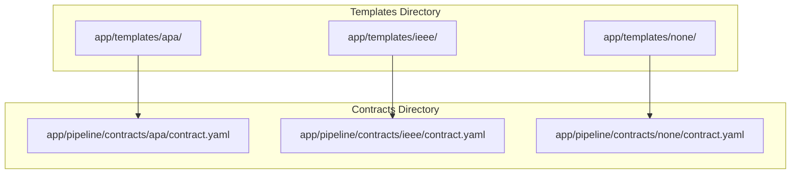
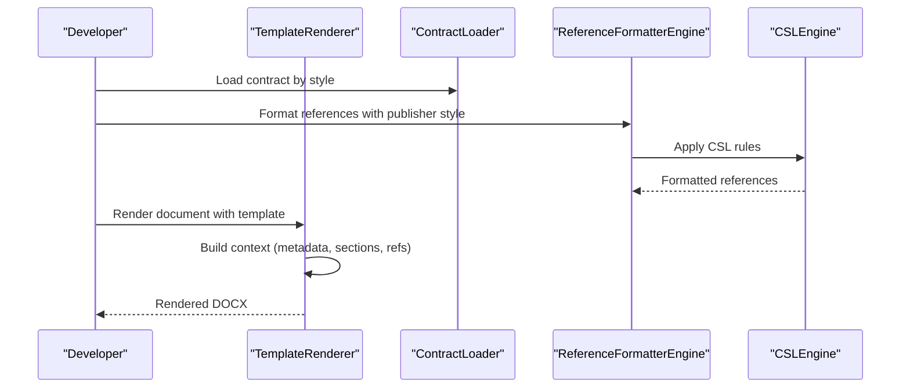
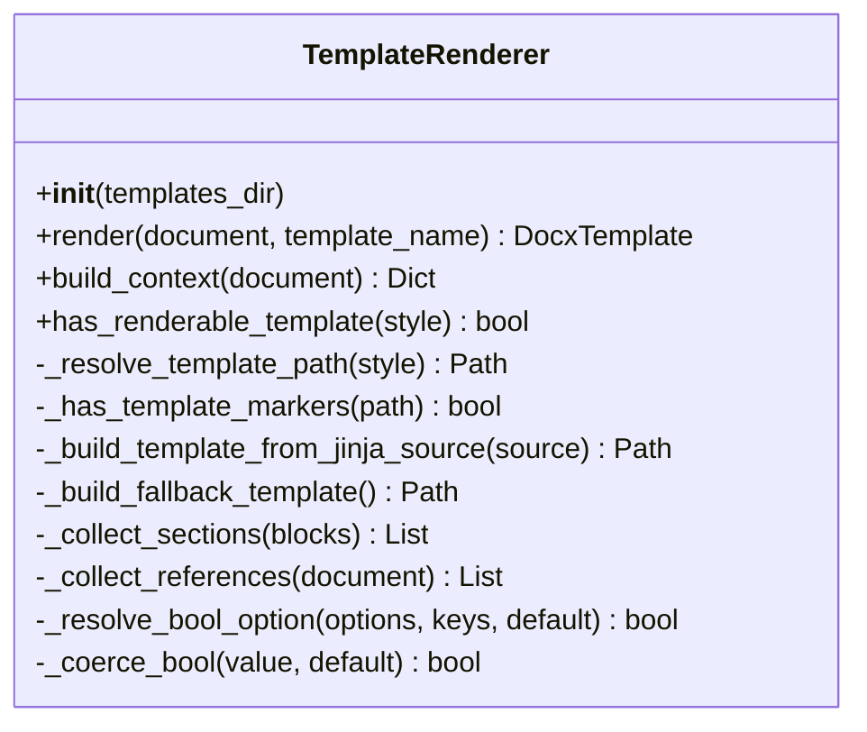
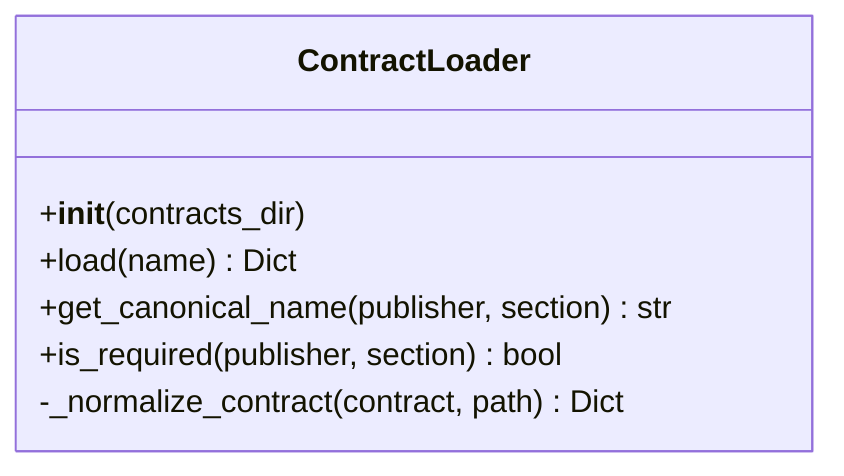
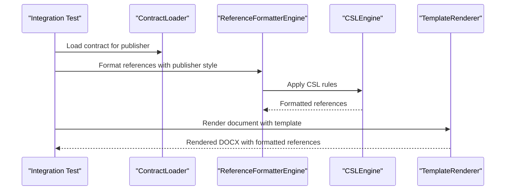
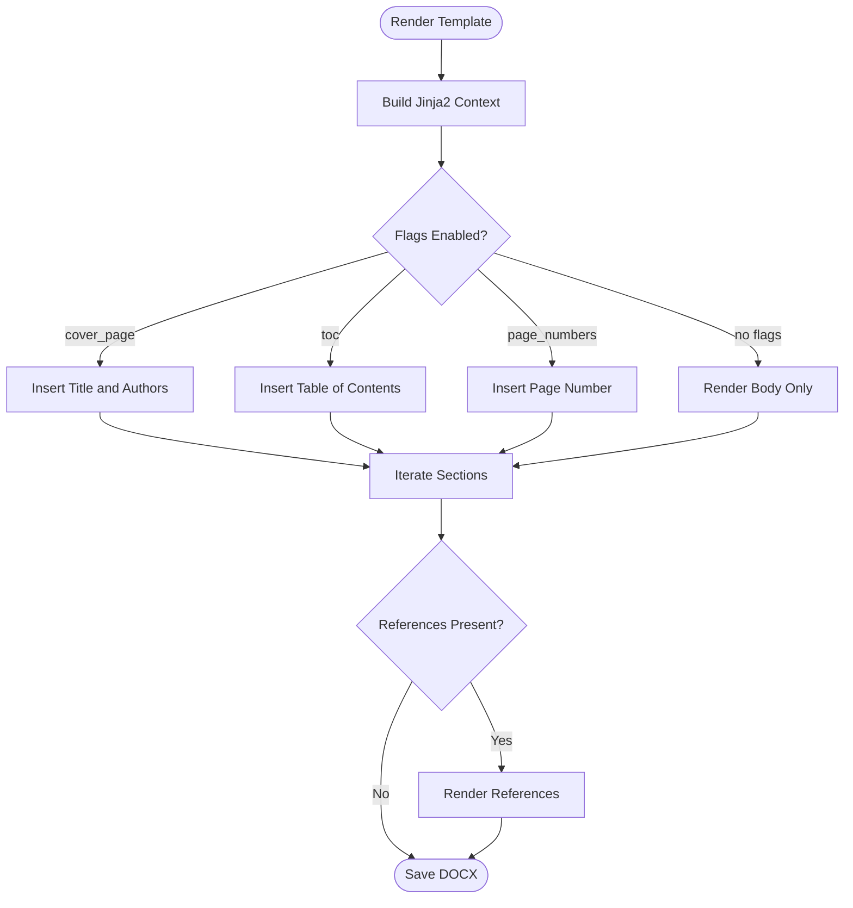
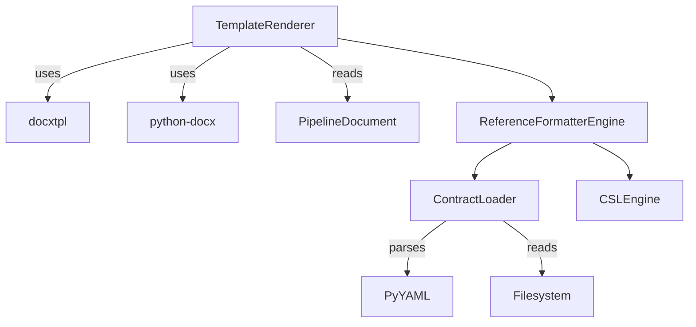

# Template Creation Guide

<cite>
**Referenced Files in This Document**
- [template_creation_guide.md](file://backend/docs/template_creation_guide.md)
- [template_creation.md](file://docs/template_creation.md)
- [template_renderer.py](file://backend/app/pipeline/formatting/template_renderer.py)
- [loader.py](file://backend/app/pipeline/contracts/loader.py)
- [contract.yaml (APA)](file://backend/app/templates/apa/contract.yaml)
- [styles.csl (APA)](file://backend/app/templates/apa/styles.csl)
- [contract.yaml (IEEE)](file://backend/app/templates/ieee/contract.yaml)
- [contract.yaml (None)](file://backend/app/templates/none/contract.yaml)
- [test_template_renderer.py](file://backend/tests/test_template_renderer.py)
- [test_csl_formatting.py](file://backend/tests/integration/test_csl_formatting.py)
</cite>

## Table of Contents
1. [Introduction](#introduction)
2. [Project Structure](#project-structure)
3. [Core Components](#core-components)
4. [Architecture Overview](#architecture-overview)
5. [Detailed Component Analysis](#detailed-component-analysis)
6. [Dependency Analysis](#dependency-analysis)
7. [Performance Considerations](#performance-considerations)
8. [Troubleshooting Guide](#troubleshooting-guide)
9. [Conclusion](#conclusion)
10. [Appendices](#appendices)

## Introduction
This guide explains how to create, modify, validate, and integrate new manuscript templates for the automated academic DOCX formatter. It covers the development environment setup, template asset structure, contract definition syntax, and the integration of Citation Style Language (CSL) for reference formatting. You will learn how to implement conditional logic and dynamic content insertion using Jinja2 inside DOCX templates, how to validate templates, and how to test, debug, and maintain templates at scale.

## Project Structure
Templates are organized per citation style under a dedicated templates directory. Each style includes:
- A DOCX template with Jinja2 placeholders
- An optional contract YAML defining structural and layout expectations
- An optional CSL file for citation formatting

**Diagram sources**
- [contract.yaml (APA):1-45](file://backend/app/templates/apa/contract.yaml#L1-L45)
- [contract.yaml (IEEE):1-50](file://backend/app/templates/ieee/contract.yaml#L1-L50)
- [contract.yaml (None):1-50](file://backend/app/templates/none/contract.yaml#L1-L50)

**Section sources**
- [template_creation_guide.md:1-114](file://backend/docs/template_creation_guide.md#L1-L114)
- [template_creation.md:1-111](file://docs/template_creation.md#L1-L111)

## Core Components
- TemplateRenderer: Builds the Jinja2 context from pipeline documents and renders DOCX templates using docxtpl. It supports both DOCX and plain Jinja2 sources, with automatic fallback behavior and marker detection.
- ContractLoader: Loads and normalizes contract YAML files to define structural and layout expectations for each style.
- Reference formatting pipeline: Preprocesses references with a CSL engine and a reference formatter engine prior to template rendering.

Key responsibilities:
- TemplateRenderer
  - Build context from document metadata, blocks, and references
  - Resolve template path and detect Jinja markers
  - Render DOCX and provide fallback templates when needed
- ContractLoader
  - Load contracts by style name
  - Normalize legacy shapes and infer publisher identifiers
  - Provide helpers to resolve canonical section names and required sections

**Section sources**
- [template_renderer.py:1-331](file://backend/app/pipeline/formatting/template_renderer.py#L1-L331)
- [loader.py:1-82](file://backend/app/pipeline/contracts/loader.py#L1-L82)

## Architecture Overview
The template creation workflow integrates three stages:
1. Contract definition: Define structural and layout expectations per style.
2. Template rendering: Inject Jinja2 context into DOCX templates.
3. Reference formatting: Apply CSL to produce properly formatted citations.

**Diagram sources**
- [template_renderer.py:65-83](file://backend/app/pipeline/formatting/template_renderer.py#L65-L83)
- [loader.py:16-38](file://backend/app/pipeline/contracts/loader.py#L16-L38)
- [test_csl_formatting.py:94-98](file://backend/tests/integration/test_csl_formatting.py#L94-L98)

## Detailed Component Analysis

### TemplateRenderer: Context Building and Rendering
TemplateRenderer constructs the Jinja2 context from pipeline documents and renders DOCX templates. It supports:
- Flexible boolean option resolution with aliases
- Automatic detection of Jinja markers in DOCX templates
- Fallback template generation when no markers are present
- Structured sections grouping and reference collection

**Diagram sources**
- [template_renderer.py:29-331](file://backend/app/pipeline/formatting/template_renderer.py#L29-L331)

Implementation highlights:
- Context keys include title, authors, affiliations, date, abstract, keywords, sections, references, and flags for cover_page, toc, page_numbers, and page_number.
- Sections are grouped by heading types while skipping structural blocks such as title, authors, abstract, keywords, and references.
- References are collected either from pre-formatted references or by extracting reference entries from blocks.

**Section sources**
- [template_renderer.py:94-159](file://backend/app/pipeline/formatting/template_renderer.py#L94-L159)
- [template_renderer.py:257-313](file://backend/app/pipeline/formatting/template_renderer.py#L257-L313)

### ContractLoader: Contract Definition and Normalization
ContractLoader loads and normalizes contracts to ensure consistent behavior across styles. Contracts define:
- Structural blocks (titles, headings, abstract, references, captions)
- Layout defaults (page size, margins, column count, line spacing)
- Section overrides and spacing rules

**Diagram sources**
- [loader.py:8-82](file://backend/app/pipeline/contracts/loader.py#L8-L82)

Contract examples:
- APA contract defines structural and layout settings suitable for journal submissions.
- IEEE contract reflects conference paper conventions.
- None contract acts as a generic fallback.

**Section sources**
- [loader.py:16-74](file://backend/app/pipeline/contracts/loader.py#L16-L74)
- [contract.yaml (APA):1-45](file://backend/app/templates/apa/contract.yaml#L1-L45)
- [contract.yaml (IEEE):1-50](file://backend/app/templates/ieee/contract.yaml#L1-L50)
- [contract.yaml (None):1-50](file://backend/app/templates/none/contract.yaml#L1-L50)

### CSL Integration and Reference Formatting
References are formatted using a CSL engine and a reference formatter engine before being injected into templates. The integration ensures that citations conform to the chosen style (e.g., APA, IEEE).

**Diagram sources**
- [test_csl_formatting.py:94-132](file://backend/tests/integration/test_csl_formatting.py#L94-L132)

CSL examples:
- APA styles.csl demonstrates author/date citation and bibliography formatting macros.

**Section sources**
- [styles.csl (APA):1-86](file://backend/app/templates/apa/styles.csl#L1-L86)
- [test_csl_formatting.py:92-132](file://backend/tests/integration/test_csl_formatting.py#L92-L132)

### Conditional Logic and Dynamic Content Insertion
Templates support conditional rendering and loops to dynamically insert content:
- Conditional blocks for cover_page, toc, and page_numbers
- Loops for authors, affiliations, sections, and references
- Default values and flags passed via formatting_options

**Diagram sources**
- [template_renderer.py:125-159](file://backend/app/pipeline/formatting/template_renderer.py#L125-L159)
- [template_creation_guide.md:32-91](file://backend/docs/template_creation_guide.md#L32-L91)

**Section sources**
- [template_creation_guide.md:19-91](file://backend/docs/template_creation_guide.md#L19-L91)
- [template_creation.md:21-74](file://docs/template_creation.md#L21-L74)

## Dependency Analysis
TemplateRenderer depends on:
- docxtpl availability for DOCX rendering
- WordDocument for fallback template generation
- PipelineDocument models for context building

ContractLoader depends on:
- YAML parsing for contract files
- Filesystem lookup for style-specific contracts

**Diagram sources**
- [template_renderer.py:17-24](file://backend/app/pipeline/formatting/template_renderer.py#L17-L24)
- [loader.py:1-6](file://backend/app/pipeline/contracts/loader.py#L1-L6)

**Section sources**
- [template_renderer.py:65-83](file://backend/app/pipeline/formatting/template_renderer.py#L65-L83)
- [loader.py:16-38](file://backend/app/pipeline/contracts/loader.py#L16-L38)

## Performance Considerations
- Template marker detection caches results to avoid repeated ZIP inspection of DOCX files.
- Fallback template generation occurs only when necessary, minimizing overhead.
- Context building iterates through blocks once to collect sections and references.

Recommendations:
- Keep DOCX templates lean and avoid excessive nested structures.
- Prefer plain Jinja2 sources when templates are simple to reduce DOCX parsing overhead.
- Use caching for contract loading in batch processing scenarios.

**Section sources**
- [template_renderer.py:200-230](file://backend/app/pipeline/formatting/template_renderer.py#L200-L230)
- [template_renderer.py:34-36](file://backend/app/pipeline/formatting/template_renderer.py#L34-L36)

## Troubleshooting Guide
Common issues and resolutions:
- Unresolved Jinja tokens: Ensure all Jinja expressions are closed and no orphaned tokens remain after rendering. Tests scan DOCX XML for unresolved tokens.
- Missing cover page or TOC: Verify formatting_options flags and their aliases; TemplateRenderer resolves multiple alias keys to a single boolean.
- References not appearing: Confirm that references are pre-formatted by the reference formatter engine and that the template includes a references block.
- Template not detected: DOCX must contain Jinja markers; otherwise, a fallback template is used.

Validation checklist:
- No unresolved Jinja tokens remain after rendering.
- Cover page appears only when enabled.
- TOC appears only when enabled.
- Page numbers appear only when enabled.
- References render correctly with selected citation style.

**Section sources**
- [template_creation_guide.md:93-114](file://backend/docs/template_creation_guide.md#L93-L114)
- [template_creation.md:81-110](file://docs/template_creation.md#L81-L110)
- [test_csl_formatting.py:79-88](file://backend/tests/integration/test_csl_formatting.py#L79-L88)
- [test_template_renderer.py:114-127](file://backend/tests/test_template_renderer.py#L114-L127)

## Conclusion
Creating robust templates involves structuring assets per style, defining contracts for layout and sections, implementing Jinja2 logic for dynamic content, and validating end-to-end with tests. By following the steps and guidelines in this document, you can develop, test, and maintain high-quality templates that integrate seamlessly with the formatter pipeline and produce consistent, publication-ready manuscripts.

## Appendices

### Step-by-Step: Creating a Custom Template
1. Create a new style folder under the templates directory.
2. Add a DOCX template with Jinja2 placeholders for title, authors, sections, and references.
3. Optionally add a contract YAML to define structural and layout rules.
4. Optionally add a CSL file for citation formatting.
5. Validate the template using the provided test commands.
6. Integrate with the formatter and run regression tests.

**Section sources**
- [template_creation.md:5-20](file://docs/template_creation.md#L5-L20)
- [template_creation_guide.md:5-18](file://backend/docs/template_creation_guide.md#L5-L18)

### Modifying Existing Templates
- Update the DOCX template in place and rerun validation tests.
- Adjust contract YAML to reflect layout or section changes.
- Re-run integration tests to confirm CSL formatting remains intact.

**Section sources**
- [template_creation.md:81-110](file://docs/template_creation.md#L81-L110)
- [test_csl_formatting.py:135-152](file://backend/tests/integration/test_csl_formatting.py#L135-L152)

### Integrating New Citation Styles
- Add a new contract YAML under the contracts directory.
- Provide a matching styles.csl file under the templates directory.
- Run integration tests to ensure references render correctly.

**Section sources**
- [contract.yaml (APA):1-45](file://backend/app/templates/apa/contract.yaml#L1-L45)
- [styles.csl (APA):1-86](file://backend/app/templates/apa/styles.csl#L1-L86)
- [test_csl_formatting.py:113-132](file://backend/tests/integration/test_csl_formatting.py#L113-L132)

### Template Packaging, Distribution, and Maintenance
- Package style folders with template.docx, contract.yaml, and styles.csl.
- Maintain a consistent naming scheme for styles and contracts.
- Keep contracts normalized and aligned with the contract loader’s expectations.
- Automate validation via pytest targets for template renderer and CSL integration.

**Section sources**
- [template_creation_guide.md:101-114](file://backend/docs/template_creation_guide.md#L101-L114)
- [test_template_renderer.py:69-127](file://backend/tests/test_template_renderer.py#L69-L127)
- [test_csl_formatting.py:91-152](file://backend/tests/integration/test_csl_formatting.py#L91-L152)