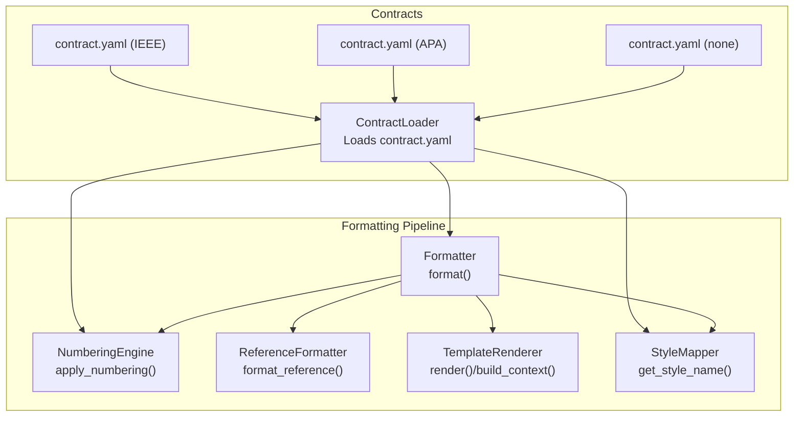
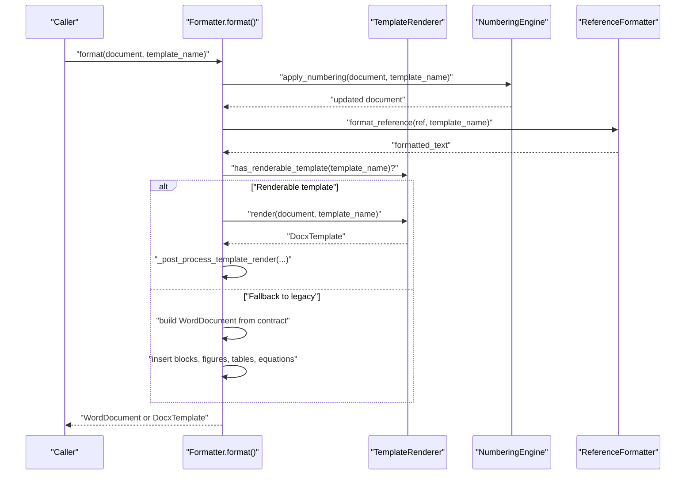
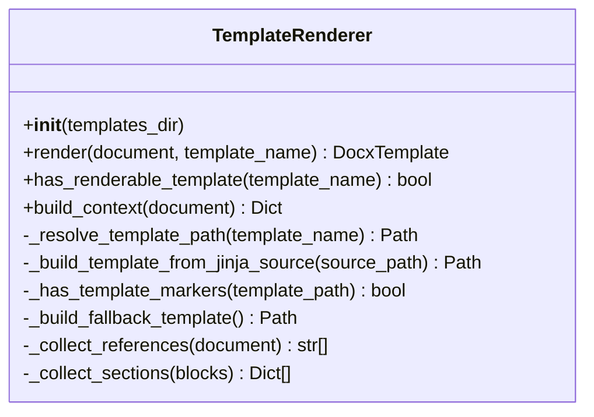
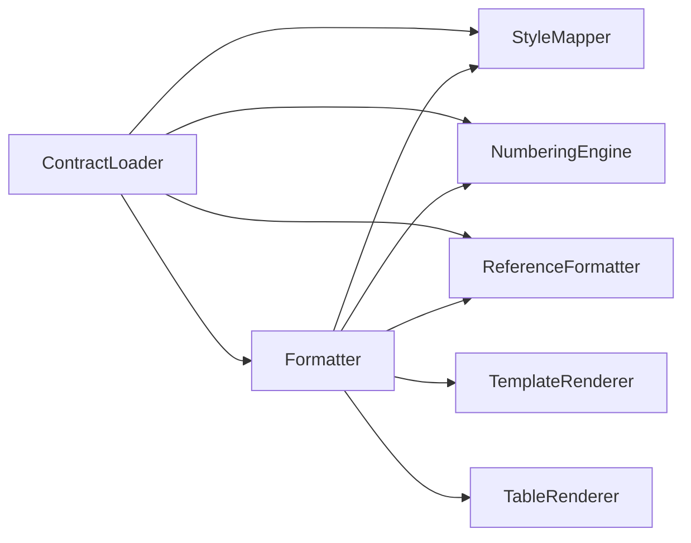

# Template Rendering Engine

<cite>
**Referenced Files in This Document**
- [template_renderer.py](file://backend/app/pipeline/formatting/template_renderer.py)
- [formatter.py](file://backend/app/pipeline/formatting/formatter.py)
- [numbering.py](file://backend/app/pipeline/formatting/numbering.py)
- [reference_formatter.py](file://backend/app/pipeline/formatting/reference_formatter.py)
- [section_ordering.py](file://backend/app/pipeline/formatting/section_ordering.py)
- [style_mapper.py](file://backend/app/pipeline/formatting/style_mapper.py)
- [loader.py](file://backend/app/pipeline/contracts/loader.py)
- [contract.yaml (IEEE)](file://backend/app/templates/ieee/contract.yaml)
- [contract.yaml (APA)](file://backend/app/templates/apa/contract.yaml)
- [contract.yaml (none)](file://backend/app/templates/none/contract.yaml)
- [test_template_renderer.py](file://backend/tests/test_template_renderer.py)
- [test_formatter.py](file://backend/tests/test_formatter.py)
</cite>

## Table of Contents
1. [Introduction](#introduction)
2. [Project Structure](#project-structure)
3. [Core Components](#core-components)
4. [Architecture Overview](#architecture-overview)
5. [Detailed Component Analysis](#detailed-component-analysis)
6. [Dependency Analysis](#dependency-analysis)
7. [Performance Considerations](#performance-considerations)
8. [Troubleshooting Guide](#troubleshooting-guide)
9. [Conclusion](#conclusion)
10. [Appendices](#appendices)

## Introduction
This document explains the template rendering engine and formatting pipeline that transforms structured manuscript data into a polished DOCX document. It covers the rendering process from template contract to final output, including the template execution engine, variable substitution, conditional rendering, section ordering and numbering, cross-reference resolution, formatting rules application, style inheritance, and content transformation. It also provides examples of rendering workflows and practical debugging techniques for formatting issues.

## Project Structure
The formatting subsystem centers around a contract-driven pipeline:
- Contracts define styles, layout, numbering, and section ordering rules per publisher.
- The formatter orchestrates rendering modes (docxtpl/Jinja2 vs legacy python-docx), applies numbering, formats references, and inserts content.
- The template renderer builds a Jinja2 context and renders DOCX templates when available.

**Diagram sources**
- [formatter.py:35-130](file://backend/app/pipeline/formatting/formatter.py#L35-L130)
- [template_renderer.py:29-83](file://backend/app/pipeline/formatting/template_renderer.py#L29-L83)
- [numbering.py:5-65](file://backend/app/pipeline/formatting/numbering.py#L5-L65)
- [reference_formatter.py:153-195](file://backend/app/pipeline/formatting/reference_formatter.py#L153-L195)
- [style_mapper.py:5-28](file://backend/app/pipeline/formatting/style_mapper.py#L5-L28)
- [loader.py:8-39](file://backend/app/pipeline/contracts/loader.py#L8-L39)
- [contract.yaml (IEEE):1-50](file://backend/app/templates/ieee/contract.yaml#L1-L50)
- [contract.yaml (APA):1-45](file://backend/app/templates/apa/contract.yaml#L1-L45)
- [contract.yaml (none):1-50](file://backend/app/templates/none/contract.yaml#L1-L50)

**Section sources**
- [formatter.py:35-130](file://backend/app/pipeline/formatting/formatter.py#L35-L130)
- [loader.py:8-39](file://backend/app/pipeline/contracts/loader.py#L8-L39)

## Core Components
- TemplateRenderer: Builds a Jinja2 context from a pipeline document and renders a DOCX using docxtpl. It detects renderable templates, supports fallback templates, and exposes a context with metadata, sections, references, and formatting toggles.
- Formatter: Orchestrates the end-to-end formatting pipeline. It selects between docxtpl and legacy rendering, applies numbering, prepares references, inserts content, and post-processes rendered templates to add cover pages, TOC, page numbers, borders, and line numbers.
- NumberingEngine: Applies hierarchical heading numbering, sequential figure/table numbering, and equation numbering based on contract rules.
- ReferenceFormatter: Formats references using citeproc-py with CSL styles, with a legacy fallback when citeproc is unavailable or styles are missing.
- StyleMapper: Maps semantic block types to Word style names using the contract’s style map.
- ContractLoader: Loads and caches publisher-specific contracts (contract.yaml) and provides helpers for canonical names and required sections.

**Section sources**
- [template_renderer.py:29-331](file://backend/app/pipeline/formatting/template_renderer.py#L29-L331)
- [formatter.py:35-290](file://backend/app/pipeline/formatting/formatter.py#L35-L290)
- [numbering.py:5-65](file://backend/app/pipeline/formatting/numbering.py#L5-L65)
- [reference_formatter.py:153-288](file://backend/app/pipeline/formatting/reference_formatter.py#L153-L288)
- [style_mapper.py:5-28](file://backend/app/pipeline/formatting/style_mapper.py#L5-L28)
- [loader.py:8-82](file://backend/app/pipeline/contracts/loader.py#L8-L82)

## Architecture Overview
The rendering pipeline integrates template-driven and legacy paths. The docxtpl path is preferred when a renderable template exists; otherwise, the legacy path constructs the document programmatically using python-docx, applying styles and layout from contracts.

**Diagram sources**
- [formatter.py:49-130](file://backend/app/pipeline/formatting/formatter.py#L49-L130)
- [template_renderer.py:65-83](file://backend/app/pipeline/formatting/template_renderer.py#L65-L83)
- [numbering.py:13-65](file://backend/app/pipeline/formatting/numbering.py#L13-L65)
- [reference_formatter.py:170-195](file://backend/app/pipeline/formatting/reference_formatter.py#L170-L195)

## Detailed Component Analysis

### Template Execution Engine (TemplateRenderer)
Responsibilities:
- Detects renderable templates by scanning DOCX XML for Jinja markers or by building a DOCX from a plain Jinja2 source.
- Builds a Jinja2 context containing metadata, sections, references, and formatting toggles.
- Renders the template and returns a DocxTemplate ready for post-processing.

Key behaviors:
- Boolean option coercion supports aliases like “add_cover_page” and “generate_toc”.
- Sections are grouped from blocks excluding structural types (title, author, affiliation, abstract, keywords, references, captions).
- References are collected either from pre-formatted references or by extracting “reference_entry” blocks.

**Diagram sources**
- [template_renderer.py:29-331](file://backend/app/pipeline/formatting/template_renderer.py#L29-L331)

**Section sources**
- [template_renderer.py:65-163](file://backend/app/pipeline/formatting/template_renderer.py#L65-L163)
- [template_renderer.py:164-231](file://backend/app/pipeline/formatting/template_renderer.py#L164-L231)
- [template_renderer.py:257-331](file://backend/app/pipeline/formatting/template_renderer.py#L257-L331)

### Variable Substitution and Conditional Rendering
- Context keys include title, authors, affiliations, date, abstract, keywords, sections, references, and toggles (cover_page, toc, page_numbers, page_number).
- Conditional rendering is controlled by formatting options and template presence. The engine coerces string/numeric values to booleans and supports aliases.
- The legacy path uses Jinja-style conditionals inside templates to gate front matter and TOC insertion.

**Section sources**
- [template_renderer.py:94-159](file://backend/app/pipeline/formatting/template_renderer.py#L94-L159)
- [formatter.py:68-105](file://backend/app/pipeline/formatting/formatter.py#L68-L105)

### Section Ordering and Validation
- SectionOrderValidator compares the document’s found sections with the contract’s expected order and required sections, reporting violations.
- Canonical names and required flags are resolved via ContractLoader.

**Section sources**
- [section_ordering.py:5-43](file://backend/app/pipeline/formatting/section_ordering.py#L5-L43)
- [loader.py:59-74](file://backend/app/pipeline/contracts/loader.py#L59-L74)

### Numbering Systems
- Hierarchical heading numbering resets lower levels when moving deeper.
- Sequential numbering for figures and tables.
- Equation numbering supports global scope and bracket styles.

**Section sources**
- [numbering.py:13-65](file://backend/app/pipeline/formatting/numbering.py#L13-L65)

### Cross-Reference Resolution and Reference Formatting
- Pre-format references before rendering to ensure references are ready for templates or legacy insertion.
- Uses citeproc-py with CSL styles when available; falls back to a legacy formatter otherwise.
- Supports publisher-specific CSL styles located under templates/<publisher>/styles.csl.

**Section sources**
- [formatter.py:292-304](file://backend/app/pipeline/formatting/formatter.py#L292-L304)
- [reference_formatter.py:170-195](file://backend/app/pipeline/formatting/reference_formatter.py#L170-L195)
- [reference_formatter.py:211-244](file://backend/app/pipeline/formatting/reference_formatter.py#L211-L244)

### Formatting Rules Application and Style Inheritance
- StyleMapper maps semantic block types to Word style names using the contract’s style map.
- Contracts define layout defaults (margins, page size, columns), spacing, and section overrides.
- Formatter applies initial layout, page size, and global line spacing from contracts and options.

**Section sources**
- [style_mapper.py:13-28](file://backend/app/pipeline/formatting/style_mapper.py#L13-L28)
- [contract.yaml (IEEE):25-50](file://backend/app/templates/ieee/contract.yaml#L25-L50)
- [contract.yaml (APA):25-45](file://backend/app/templates/apa/contract.yaml#L25-L45)
- [contract.yaml (none):25-50](file://backend/app/templates/none/contract.yaml#L25-L50)
- [formatter.py:327-340](file://backend/app/pipeline/formatting/formatter.py#L327-L340)
- [formatter.py:357-382](file://backend/app/pipeline/formatting/formatter.py#L357-L382)
- [formatter.py:564-571](file://backend/app/pipeline/formatting/formatter.py#L564-L571)

### Content Transformation and Post-Processing
- The legacy path inserts blocks, figures, tables, and equations with deterministic ordering and offsets to maintain correct sequence.
- Post-processing upgrades docxtpl output with cover pages, TOC fields, page numbers, borders, line numbers, and global line spacing.
- Footnote and hyperlink fidelity is preserved across transformations.

**Section sources**
- [formatter.py:155-290](file://backend/app/pipeline/formatting/formatter.py#L155-L290)
- [formatter.py:691-763](file://backend/app/pipeline/formatting/formatter.py#L691-L763)
- [formatter.py:164-188](file://backend/tests/test_formatter.py#L164-L188)

## Dependency Analysis
The pipeline composes several engines and loaders, with contracts as the central configuration source.

**Diagram sources**
- [formatter.py:40-47](file://backend/app/pipeline/formatting/formatter.py#L40-L47)
- [loader.py:8-39](file://backend/app/pipeline/contracts/loader.py#L8-L39)

**Section sources**
- [formatter.py:40-47](file://backend/app/pipeline/formatting/formatter.py#L40-L47)
- [loader.py:8-39](file://backend/app/pipeline/contracts/loader.py#L8-L39)

## Performance Considerations
- Template detection caches Jinja marker checks per template path to avoid repeated XML scans.
- Contract loading caches parsed YAML contracts to reduce IO overhead.
- Legacy rendering sorts mixed content by computed indices to minimize re-layout work.
- Equation rendering uses math XML elements directly for speed and correctness.

[No sources needed since this section provides general guidance]

## Troubleshooting Guide
Common issues and resolutions:
- Missing docxtpl: The template renderer raises an ImportError if docxtpl is not installed; install the dependency to enable template rendering.
- Empty or missing sections: Verify that the document contains non-empty text blocks and that structural types are excluded from sections grouping.
- Incorrect numbering: Ensure numbering rules are present in the contract and that apply_numbering is invoked before rendering.
- Missing references: Confirm references are populated with formatted_text or that the legacy path extracts “reference_entry” blocks.
- TOC/page number placeholders: Legacy post-processing replaces static placeholders with Word field codes; verify that the output contains PAGE fields and TOC XML.
- Hyperlinks and footnotes: Legacy path preserves Word hyperlinks and footnotes; confirm relationships and footnote parts are present in the final DOCX.

**Section sources**
- [template_renderer.py:67-82](file://backend/app/pipeline/formatting/template_renderer.py#L67-L82)
- [formatter.py:691-763](file://backend/app/pipeline/formatting/formatter.py#L691-L763)
- [test_template_renderer.py:69-127](file://backend/tests/test_template_renderer.py#L69-L127)
- [test_formatter.py:95-163](file://backend/tests/test_formatter.py#L95-L163)
- [test_formatter.py:164-188](file://backend/tests/test_formatter.py#L164-L188)

## Conclusion
The formatting pipeline combines contract-driven rules with flexible rendering modes to produce high-quality DOCX outputs. TemplateRenderer and Formatter coordinate to deliver consistent, publisher-specific formatting, while NumberingEngine, ReferenceFormatter, and StyleMapper ensure accurate structure, references, and typography. By leveraging contracts and robust post-processing, the system supports both rapid template-driven rendering and precise control via the legacy path.

[No sources needed since this section summarizes without analyzing specific files]

## Appendices

### Rendering Workflow Examples
- Template-driven rendering: Build context, detect renderable template, render with docxtpl, post-process cover page, TOC, page numbers, borders, and line numbers.
- Legacy rendering: Load contract, prepare references, insert blocks/figures/tables/equations with deterministic ordering, apply layout and options.

**Section sources**
- [template_renderer.py:65-83](file://backend/app/pipeline/formatting/template_renderer.py#L65-L83)
- [formatter.py:113-130](file://backend/app/pipeline/formatting/formatter.py#L113-L130)
- [formatter.py:155-290](file://backend/app/pipeline/formatting/formatter.py#L155-L290)