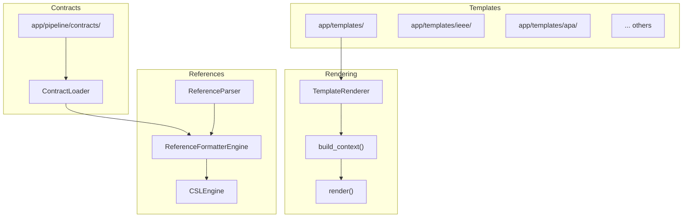
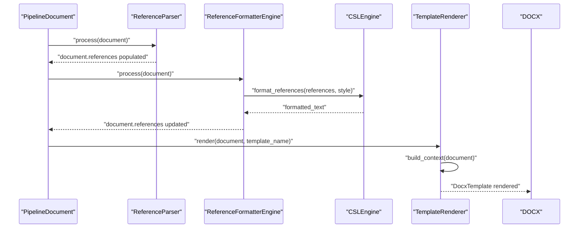
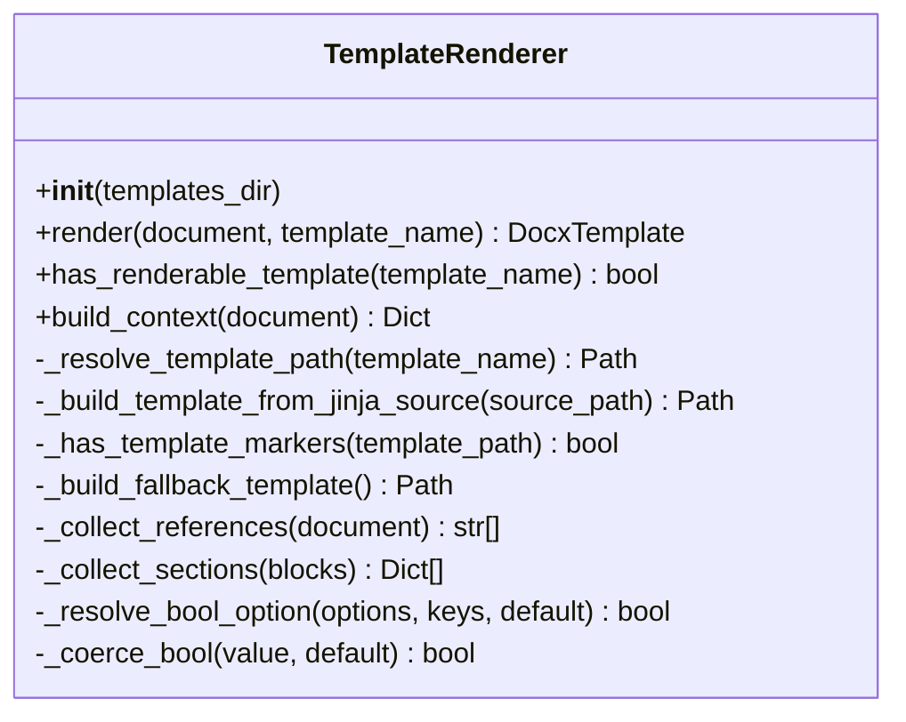
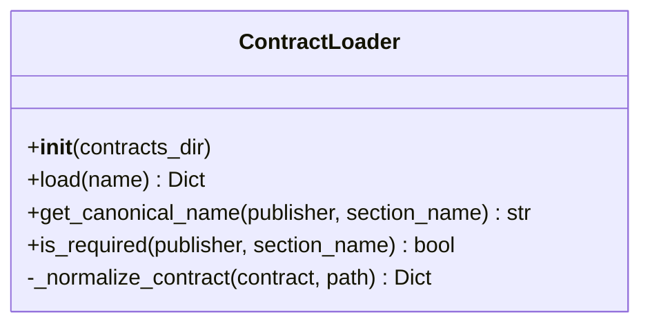
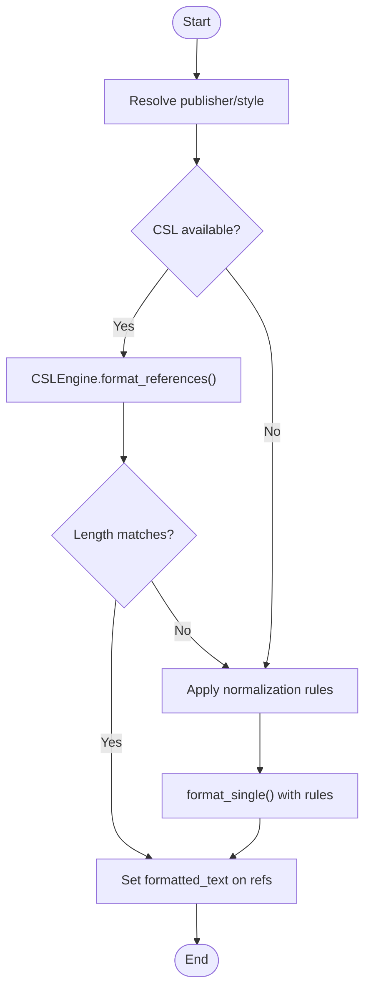
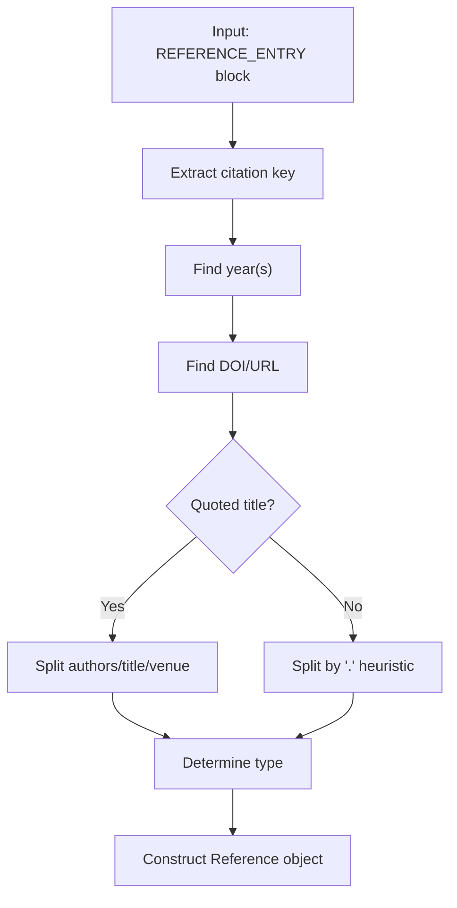
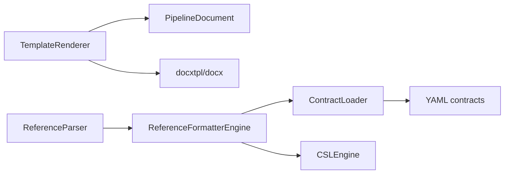

# Template System

<cite>
**Referenced Files in This Document**
- [template_renderer.py](file://backend/app/pipeline/formatting/template_renderer.py)
- [loader.py](file://backend/app/pipeline/contracts/loader.py)
- [formatter_engine.py](file://backend/app/pipeline/references/formatter_engine.py)
- [parser.py](file://backend/app/pipeline/references/parser.py)
- [template_creation_guide.md](file://backend/docs/template_creation_guide.md)
- [contract.yaml (IEEE)](file://backend/app/templates/ieee/contract.yaml)
- [contract.yaml (APA)](file://backend/app/templates/apa/contract.yaml)
- [test_template_renderer.py](file://backend/tests/test_template_renderer.py)
- [test_csl_formatting.py](file://backend/tests/integration/test_csl_formatting.py)
- [test_templates.py](file://backend/tests/test_templates.py)
- [test_template_assets_integrity.py](file://backend/tests/test_template_assets_integrity.py)
- [test_template_regression.py](file://backend/tests/test_template_regression.py)
- [check_template_markers.py](file://backend/scripts/check_template_markers.py)
</cite>

## Table of Contents
1. [Introduction](#introduction)
2. [Project Structure](#project-structure)
3. [Core Components](#core-components)
4. [Architecture Overview](#architecture-overview)
5. [Detailed Component Analysis](#detailed-component-analysis)
6. [Dependency Analysis](#dependency-analysis)
7. [Performance Considerations](#performance-considerations)
8. [Troubleshooting Guide](#troubleshooting-guide)
9. [Conclusion](#conclusion)
10. [Appendices](#appendices)

## Introduction
This document describes the complete template system powering manuscript formatting. It covers the template architecture, the template contract system, and the integration with the Citation Style Language (CSL) pipeline. It explains the rendering engine, conditional logic, dynamic content insertion, and the end-to-end creation workflow. Practical guidance is included for modifying existing templates, developing custom templates, validating outputs, and maintaining templates over time.

## Project Structure
The template system spans three primary areas:
- Rendering engine: builds the Jinja2 context and renders DOCX templates
- Contracts: define publisher-specific structural and layout rules
- References: format citations using CSL or deterministic fallback templates

**Diagram sources**
- [template_renderer.py:65-83](file://backend/app/pipeline/formatting/template_renderer.py#L65-L83)
- [loader.py:16-38](file://backend/app/pipeline/contracts/loader.py#L16-L38)
- [formatter_engine.py:24-26](file://backend/app/pipeline/references/formatter_engine.py#L24-L26)
- [parser.py:39-91](file://backend/app/pipeline/references/parser.py#L39-L91)

**Section sources**
- [template_renderer.py:29-331](file://backend/app/pipeline/formatting/template_renderer.py#L29-L331)
- [loader.py:8-82](file://backend/app/pipeline/contracts/loader.py#L8-L82)
- [formatter_engine.py:18-114](file://backend/app/pipeline/references/formatter_engine.py#L18-L114)
- [parser.py:21-211](file://backend/app/pipeline/references/parser.py#L21-L211)

## Core Components
- TemplateRenderer: builds the Jinja2 context from pipeline documents and renders DOCX templates. It supports both native DOCX templates with Jinja markers and synthetic DOCX templates built from plain text Jinja sources. It also provides a fallback template when no markers are detected.
- ContractLoader: loads YAML contracts per publisher style, normalizes legacy shapes, and exposes helpers to resolve canonical section names and required sections.
- ReferenceFormatterEngine: formats references using CSL when available, otherwise applies deterministic normalization templates from the contract.
- ReferenceParser: extracts structured reference metadata from unformatted reference blocks.

Key responsibilities:
- Dynamic content insertion: sections, authors, affiliations, abstract, keywords, references, and optional front matter and page numbering.
- Conditional logic: cover pages, table of contents, and page numbering toggles.
- Publisher-specific formatting: layout defaults, margins, spacing, and section overrides.

**Section sources**
- [template_renderer.py:94-159](file://backend/app/pipeline/formatting/template_renderer.py#L94-L159)
- [template_renderer.py:164-179](file://backend/app/pipeline/formatting/template_renderer.py#L164-L179)
- [template_renderer.py:200-230](file://backend/app/pipeline/formatting/template_renderer.py#L200-L230)
- [template_renderer.py:257-331](file://backend/app/pipeline/formatting/template_renderer.py#L257-L331)
- [loader.py:16-74](file://backend/app/pipeline/contracts/loader.py#L16-L74)
- [formatter_engine.py:28-75](file://backend/app/pipeline/references/formatter_engine.py#L28-L75)
- [parser.py:39-91](file://backend/app/pipeline/references/parser.py#L39-L91)

## Architecture Overview
The template system integrates with the broader pipeline as follows:
- Input: a PipelineDocument containing blocks, metadata, and optional references
- Reference stage: ReferenceParser extracts structured references; ReferenceFormatterEngine formats them via CSL or fallback templates
- Formatting stage: TemplateRenderer builds a Jinja2 context and renders the selected template
- Output: a DOCX document ready for export

**Diagram sources**
- [parser.py:39-91](file://backend/app/pipeline/references/parser.py#L39-L91)
- [formatter_engine.py:28-75](file://backend/app/pipeline/references/formatter_engine.py#L28-L75)
- [template_renderer.py:65-83](file://backend/app/pipeline/formatting/template_renderer.py#L65-L83)

## Detailed Component Analysis

### TemplateRenderer
Responsibilities:
- Resolve template source: prefer explicit Jinja2 source, then DOCX with Jinja markers, then fallback DOCX
- Build context: extract title, authors, affiliations, abstract, keywords, sections, references, and formatting flags
- Render: use docxtpl to render the resolved template with the built context

Conditional logic and flags:
- cover_page, toc, page_numbers, page_number
- Boolean coercion supports multiple input forms (strings, numbers, booleans)

Dynamic content insertion:
- sections grouped by headings
- references as pre-formatted strings
- authors and affiliations as lists

Fallback behavior:
- Generates a minimal DOCX with Jinja markers if none found
- Logs warnings and continues

**Diagram sources**
- [template_renderer.py:29-331](file://backend/app/pipeline/formatting/template_renderer.py#L29-L331)

**Section sources**
- [template_renderer.py:34-83](file://backend/app/pipeline/formatting/template_renderer.py#L34-L83)
- [template_renderer.py:94-159](file://backend/app/pipeline/formatting/template_renderer.py#L94-L159)
- [template_renderer.py:164-179](file://backend/app/pipeline/formatting/template_renderer.py#L164-L179)
- [template_renderer.py:200-230](file://backend/app/pipeline/formatting/template_renderer.py#L200-L230)
- [template_renderer.py:232-255](file://backend/app/pipeline/formatting/template_renderer.py#L232-L255)
- [template_renderer.py:257-331](file://backend/app/pipeline/formatting/template_renderer.py#L257-L331)

### ContractLoader and Template Contracts
Responsibilities:
- Load YAML contracts per publisher style
- Normalize legacy shapes for backward compatibility
- Provide helpers to resolve canonical section names and required sections

Publisher contracts define:
- Structural block names for titles, abstracts, headings, body, captions, and references
- Layout defaults (margins, page size, columns, spacing)
- Section overrides for specific content areas
- Optional references configuration (style name or local CSL path)

**Diagram sources**
- [loader.py:8-82](file://backend/app/pipeline/contracts/loader.py#L8-L82)

**Section sources**
- [loader.py:16-38](file://backend/app/pipeline/contracts/loader.py#L16-L38)
- [loader.py:40-57](file://backend/app/pipeline/contracts/loader.py#L40-L57)
- [loader.py:59-74](file://backend/app/pipeline/contracts/loader.py#L59-L74)

### ReferenceFormatterEngine and CSL Integration
Responsibilities:
- Determine publisher and style from the document’s template name and contract
- Attempt CSL formatting via CSLEngine
- Fall back to deterministic normalization templates defined in the contract

Behavior:
- Validates output length from CSL
- Applies normalization rules keyed by reference type (journal article, conference paper, default)
- Supports author truncation and “et al.” suffix

**Diagram sources**
- [formatter_engine.py:28-75](file://backend/app/pipeline/references/formatter_engine.py#L28-L75)
- [formatter_engine.py:77-114](file://backend/app/pipeline/references/formatter_engine.py#L77-L114)

**Section sources**
- [formatter_engine.py:24-26](file://backend/app/pipeline/references/formatter_engine.py#L24-L26)
- [formatter_engine.py:34-75](file://backend/app/pipeline/references/formatter_engine.py#L34-L75)
- [formatter_engine.py:77-114](file://backend/app/pipeline/references/formatter_engine.py#L77-L114)

### ReferenceParser
Responsibilities:
- Extract structured reference metadata from unformatted blocks
- IEEE-focused heuristics: citation keys, quotes for titles, year detection, DOIs/URLs
- Determine reference type heuristically (journal article, conference paper, unknown)

**Diagram sources**
- [parser.py:93-190](file://backend/app/pipeline/references/parser.py#L93-L190)

**Section sources**
- [parser.py:39-91](file://backend/app/pipeline/references/parser.py#L39-L91)
- [parser.py:93-190](file://backend/app/pipeline/references/parser.py#L93-L190)

## Dependency Analysis
- TemplateRenderer depends on:
  - PipelineDocument model for metadata and blocks
  - docxtpl for rendering
  - docx for building fallback templates
- ContractLoader depends on YAML parsing and filesystem access
- ReferenceFormatterEngine depends on:
  - ContractLoader for publisher rules
  - CSLEngine for CSL formatting
- ReferenceParser is a standalone pipeline stage extracting structured data

**Diagram sources**
- [template_renderer.py:26-27](file://backend/app/pipeline/formatting/template_renderer.py#L26-L27)
- [loader.py:24-36](file://backend/app/pipeline/contracts/loader.py#L24-L36)
- [formatter_engine.py:24-26](file://backend/app/pipeline/references/formatter_engine.py#L24-L26)
- [parser.py:14-16](file://backend/app/pipeline/references/parser.py#L14-L16)

**Section sources**
- [template_renderer.py:17-27](file://backend/app/pipeline/formatting/template_renderer.py#L17-L27)
- [loader.py:1-7](file://backend/app/pipeline/contracts/loader.py#L1-L7)
- [formatter_engine.py:12-13](file://backend/app/pipeline/references/formatter_engine.py#L12-L13)
- [parser.py:14-16](file://backend/app/pipeline/references/parser.py#L14-L16)

## Performance Considerations
- Template marker inspection caches results to avoid repeated ZIP scans
- Fallback template generation occurs only when necessary
- Reference formatting attempts CSL first; deterministic fallback is lightweight
- Boolean option resolution avoids expensive conversions by short-circuiting

Recommendations:
- Keep template DOCX sizes reasonable; large templates increase rendering time
- Prefer explicit Jinja2 sources for complex templates to reduce runtime transformations
- Cache contract lookups when processing batches of documents

**Section sources**
- [template_renderer.py:36-36](file://backend/app/pipeline/formatting/template_renderer.py#L36-L36)
- [template_renderer.py:200-230](file://backend/app/pipeline/formatting/template_renderer.py#L200-L230)
- [template_renderer.py:232-255](file://backend/app/pipeline/formatting/template_renderer.py#L232-L255)

## Troubleshooting Guide
Common issues and resolutions:
- Unresolved Jinja tokens in output: verify template markers and ensure all context keys are provided
- Front matter missing: confirm cover_page flag is enabled or defaulted appropriately
- TOC not appearing: verify toc flag is true
- Page numbers missing: verify page_numbers flag is true
- References not rendering: ensure references are parsed and formatted before rendering

Validation and testing:
- Use the template renderer tests to validate rendering behavior
- Use the CSL formatting integration tests to validate reference formatting
- Use the template assets integrity and regression tests to catch breaking changes

Operational checks:
- Script to verify template markers are present
- Contract fallback behavior when a style lacks a contract

**Section sources**
- [template_creation_guide.md:93-114](file://backend/docs/template_creation_guide.md#L93-L114)
- [test_template_renderer.py](file://backend/tests/test_template_renderer.py)
- [test_csl_formatting.py](file://backend/tests/integration/test_csl_formatting.py)
- [test_template_assets_integrity.py](file://backend/tests/test_template_assets_integrity.py)
- [test_template_regression.py](file://backend/tests/test_template_regression.py)
- [check_template_markers.py](file://backend/scripts/check_template_markers.py)

## Conclusion
The template system combines a flexible rendering engine, a robust contract system, and a CSL-aware reference formatter to produce high-quality academic manuscripts. By following the documented creation workflow, validation procedures, and best practices, teams can maintain and extend the system with confidence across publishers and styles.

## Appendices

### Academic Templates Overview
Supported styles include, but are not limited to:
- IEEE, APA, MLA, Nature, Chicago, Harvard, Vancouver, Springer, Elsevier, ACM
- Modern variants: modern_blue, modern_gold, modern_red
- Numeric and portfolio styles
- Resume and none (no formatting)

Each style defines:
- A contract.yaml specifying structural and layout rules
- Optional styles.csl for CSL-based reference formatting
- A template.docx or template.jinja2 source for rendering

Publisher-specific formatting rules:
- Structural block names for titles, headings, abstracts, captions, and references
- Layout defaults (margins, page size, columns, spacing)
- Section overrides for special sections (e.g., abstract, references, title, acknowledgments)
- Optional references configuration (style name or local CSL path)

**Section sources**
- [contract.yaml (IEEE):1-50](file://backend/app/templates/ieee/contract.yaml#L1-L50)
- [contract.yaml (APA):1-45](file://backend/app/templates/apa/contract.yaml#L1-L45)
- [template_creation_guide.md:5-18](file://backend/docs/template_creation_guide.md#L5-L18)

### Template Creation Workflow
Steps:
1. Create a new style directory under app/templates/<style>/
2. Add a contract.yaml defining structural and layout rules
3. Add a template.docx or template.jinja2 source
4. Optionally add styles.csl for CSL-based reference formatting
5. Validate rendering and reference formatting
6. Run tests and integrate into the pipeline

Validation checklist:
- No unresolved Jinja tokens remain after rendering
- Conditional blocks appear only when flags are true
- References render correctly for the chosen style

Commands:
- python -m pytest tests/test_template_renderer.py
- python -m pytest tests/integration/test_csl_formatting.py

**Section sources**
- [template_creation_guide.md:19-114](file://backend/docs/template_creation_guide.md#L19-L114)

### Template Modification and Customization
- Modify contract.yaml to adjust structural and layout rules
- Adjust template.docx or template.jinja2 to change rendering logic
- Customize references normalization rules in contract.yaml when CSL is not desired
- Use page_number formatting option to set initial page numbers

Best practices:
- Keep conditional logic explicit in templates
- Use canonical section names from contracts for consistency
- Test with representative documents across sections and references

**Section sources**
- [loader.py:59-74](file://backend/app/pipeline/contracts/loader.py#L59-L74)
- [template_renderer.py:130-159](file://backend/app/pipeline/formatting/template_renderer.py#L130-L159)
- [formatter_engine.py:68-75](file://backend/app/pipeline/references/formatter_engine.py#L68-L75)

### Template Versioning, Distribution, and Maintenance
- Version control contracts and templates alongside the codebase
- Use contract normalization to maintain backward compatibility
- Maintain a fallback contract (none) to ensure rendering stability
- Monitor template assets integrity and regression tests to prevent silent failures
- Automate validation checks in CI to catch issues early

**Section sources**
- [loader.py:24-30](file://backend/app/pipeline/contracts/loader.py#L24-L30)
- [loader.py:40-57](file://backend/app/pipeline/contracts/loader.py#L40-L57)
- [test_template_assets_integrity.py](file://backend/tests/test_template_assets_integrity.py)
- [test_template_regression.py](file://backend/tests/test_template_regression.py)