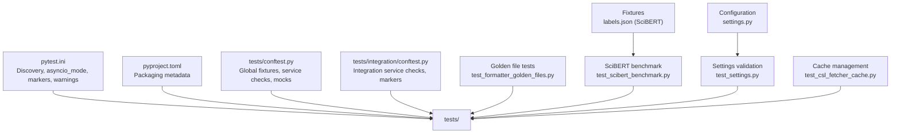
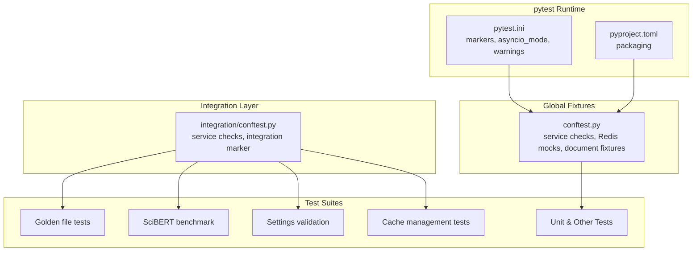
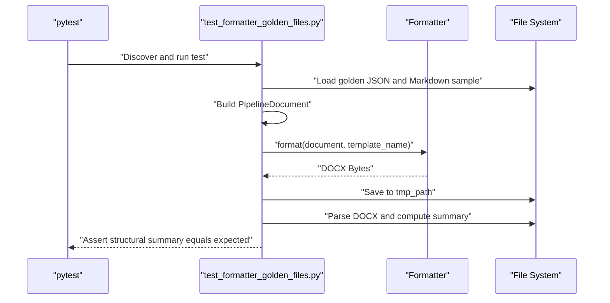
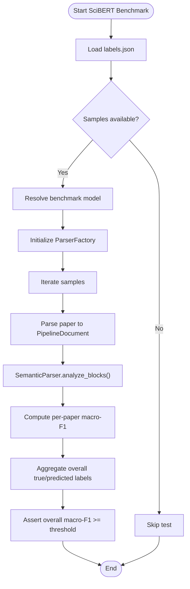
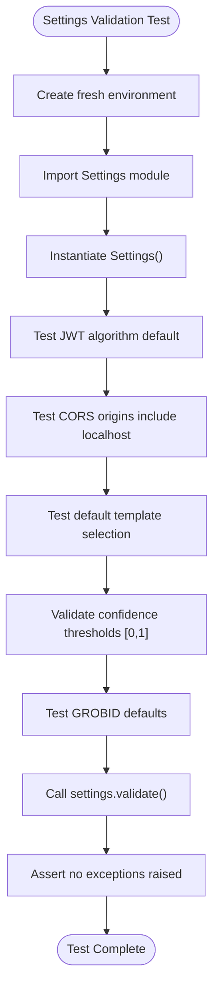
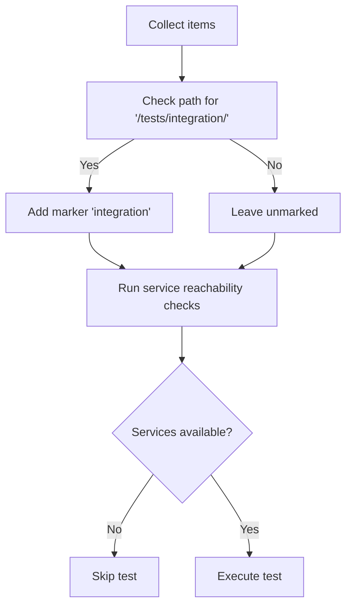
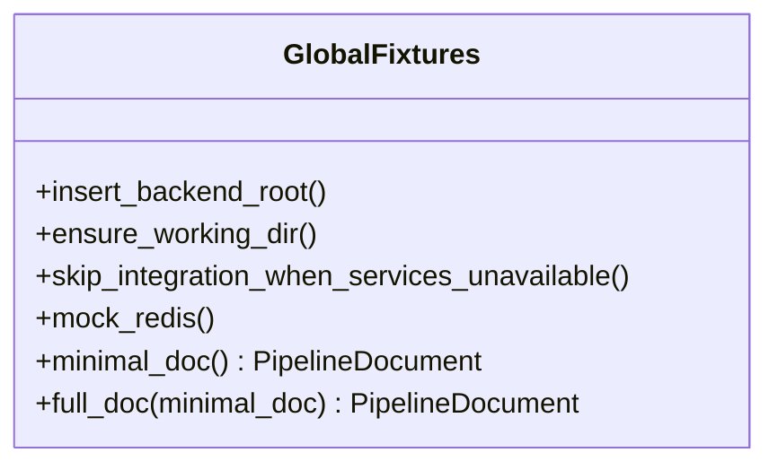
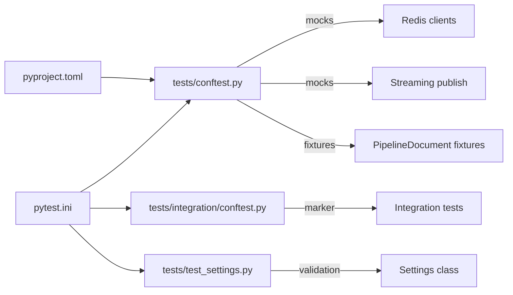

# Backend Testing

<cite>
**Referenced Files in This Document**
- [pytest.ini](file://backend/pytest.ini)
- [pyproject.toml](file://backend/pyproject.toml)
- [conftest.py](file://backend/tests/conftest.py)
- [integration/conftest.py](file://backend/tests/integration/conftest.py)
- [test_scibert_benchmark.py](file://backend/tests/test_scibert_benchmark.py)
- [test_formatter_golden_files.py](file://backend/tests/test_formatter_golden_files.py)
- [test_settings.py](file://backend/tests/test_settings.py)
- [test_csl_fetcher_cache.py](file://backend/tests/test_csl_fetcher_cache.py)
- [labels.json](file://backend/tests/fixtures/scibert/labels.json)
- [settings.py](file://backend/app/config/settings.py)
</cite>

## Update Summary
**Changes Made**
- Enhanced Settings validation test documentation to reflect updated approach focusing on sensible defaults rather than specific hardcoded values
- Added comprehensive cache bypassing documentation for metadata extraction tests to ensure deterministic behavior
- Expanded error handling verification coverage in testing infrastructure
- Updated test configuration to emphasize deterministic behavior across all test categories

## Table of Contents
1. [Introduction](#introduction)
2. [Project Structure](#project-structure)
3. [Core Components](#core-components)
4. [Architecture Overview](#architecture-overview)
5. [Detailed Component Analysis](#detailed-component-analysis)
6. [Enhanced Error Handling and Cache Management](#enhanced-error-handling-and-cache-management)
7. [Dependency Analysis](#dependency-analysis)
8. [Performance Considerations](#performance-considerations)
9. [Troubleshooting Guide](#troubleshooting-guide)
10. [Conclusion](#conclusion)

## Introduction
This document describes the backend testing strategy and infrastructure for the ScholarForm AI project. It focuses on pytest-based unit and integration testing, marker-based categorization, configuration via pytest.ini and pyproject.toml, and practical guidance for writing, running, and maintaining reliable backend tests. The repository includes approximately 46 backend test files organized across unit, integration, golden file, security, and SciBERT benchmark categories, along with supporting fixtures and CI integration.

**Updated** Enhanced testing infrastructure now emphasizes comprehensive error scenario coverage with deterministic behavior through cache bypassing and improved settings validation focusing on sensible defaults.

## Project Structure
The backend test suite is organized under the backend/tests directory with the following high-level structure:
- Root-level pytest configuration and global fixtures
- Integration tests with dedicated fixtures and collection modifiers
- Golden file tests validating rendering outputs against expected structures
- SciBERT benchmark tests evaluating semantic parsing performance
- Settings validation tests ensuring sensible defaults and robust error handling
- Cache management tests for CSL fetching and other service integrations
- Additional categories such as security, performance, and contract tests

Key configuration and fixtures:
- pytest.ini defines test discovery, asyncio mode, warnings filtering, and markers
- pyproject.toml defines the Python packaging metadata for the backend
- Global conftest.py provides shared fixtures and automatic service availability checks
- Integration-specific conftest.py enforces service readiness and auto-applies integration markers

**Diagram sources**
- [pytest.ini:1-28](file://backend/pytest.ini#L1-L28)
- [pyproject.toml:1-9](file://backend/pyproject.toml#L1-L9)
- [conftest.py:1-112](file://backend/tests/conftest.py#L1-L112)
- [integration/conftest.py:1-41](file://backend/tests/integration/conftest.py#L1-L41)
- [test_formatter_golden_files.py:1-253](file://backend/tests/test_formatter_golden_files.py#L1-L253)
- [test_scibert_benchmark.py:1-92](file://backend/tests/test_scibert_benchmark.py#L1-L92)
- [test_settings.py:1-69](file://backend/tests/test_settings.py#L1-L69)
- [test_csl_fetcher_cache.py:1-83](file://backend/tests/test_csl_fetcher_cache.py#L1-L83)
- [labels.json:1-203](file://backend/tests/fixtures/scibert/labels.json#L1-L203)
- [settings.py:1-422](file://backend/app/config/settings.py#L1-L422)

**Section sources**
- [pytest.ini:1-28](file://backend/pytest.ini#L1-L28)
- [pyproject.toml:1-9](file://backend/pyproject.toml#L1-L9)
- [conftest.py:1-112](file://backend/tests/conftest.py#L1-L112)
- [integration/conftest.py:1-41](file://backend/tests/integration/conftest.py#L1-L41)

## Core Components
- Test discovery and execution
  - pytest.ini sets testpaths to tests, excludes scripts and manual test directories, and enables asyncio_mode = auto for async test support.
  - Python naming conventions are defined for files, classes, and functions to streamline discovery.
  - addopts configures verbose output, concise traceback, and disables a third-party plugin.
  - filterwarnings suppresses known deprecation warnings to keep logs focused.
- Markers
  - The marker set includes unit, integration, performance, llm, service, regression, database, contract, pipeline, slow, and rag. These enable selective runs and categorization.
- Global fixtures and service checks
  - conftest.py inserts the backend root into sys.path, ensures the working directory is correct, and provides:
    - Automatic skipping of integration tests when required services are unreachable
    - Global Redis mocking for caching, rate limiting, and streaming publish
    - Document fixtures for minimal and full PipelineDocument instances
- Integration fixtures and markers
  - integration/conftest.py validates Redis and GROBID availability and auto-applies the integration marker to tests under tests/integration.

**Section sources**
- [pytest.ini:1-28](file://backend/pytest.ini#L1-L28)
- [conftest.py:1-112](file://backend/tests/conftest.py#L1-L112)
- [integration/conftest.py:1-41](file://backend/tests/integration/conftest.py#L1-L41)

## Architecture Overview
The backend testing architecture centers on pytest with layered fixtures and environment-aware skipping. Integration tests are gated by service availability, while global fixtures standardize mocking and document construction. Golden file tests validate rendering outputs, and SciBERT benchmark tests evaluate semantic parsing accuracy. Enhanced error handling and cache management ensure deterministic behavior across all test scenarios.

**Diagram sources**
- [pytest.ini:1-28](file://backend/pytest.ini#L1-L28)
- [pyproject.toml:1-9](file://backend/pyproject.toml#L1-L9)
- [conftest.py:1-112](file://backend/tests/conftest.py#L1-L112)
- [integration/conftest.py:1-41](file://backend/tests/integration/conftest.py#L1-L41)
- [test_formatter_golden_files.py:1-253](file://backend/tests/test_formatter_golden_files.py#L1-L253)
- [test_scibert_benchmark.py:1-92](file://backend/tests/test_scibert_benchmark.py#L1-L92)
- [test_settings.py:1-69](file://backend/tests/test_settings.py#L1-L69)
- [test_csl_fetcher_cache.py:1-83](file://backend/tests/test_csl_fetcher_cache.py#L1-L83)

## Detailed Component Analysis

### Golden File Tests
Purpose:
- Validate that formatted Word outputs match expected structural characteristics for multiple citation templates.

Key behaviors:
- Loads Markdown samples enriched with YAML frontmatter and constructs PipelineDocument instances programmatically.
- Uses the Formatter to render DOCX outputs and extracts structural summaries (section counts, heading hierarchy presence, template metadata, reference counts).
- Compares actual vs. expected structural summaries and asserts equality per template.

Execution strategy:
- Run with pytest in the tests directory; relies on global fixtures for environment setup.
- Outputs are written to a temporary directory per test run for inspection.

**Diagram sources**
- [test_formatter_golden_files.py:222-253](file://backend/tests/test_formatter_golden_files.py#L222-L253)

**Section sources**
- [test_formatter_golden_files.py:1-253](file://backend/tests/test_formatter_golden_files.py#L1-L253)

### SciBERT Benchmark Tests
Purpose:
- Evaluate semantic parsing performance using a curated set of academic papers and macro-F1 thresholds.

Key behaviors:
- Loads fixture labels from labels.json and iterates over Markdown samples to parse and classify blocks.
- Configures USE_SCIBERT_CLASSIFICATION and resolves a model name from environment or fallback.
- Computes per-paper and overall macro-F1 scores and asserts minimum thresholds.

Execution strategy:
- Requires an LLM/runtime capable of serving the chosen SciBERT model; marked with llm, service, and slow.
- Skips when fixtures are missing or when a suitable parser is unavailable.

**Diagram sources**
- [test_scibert_benchmark.py:46-92](file://backend/tests/test_scibert_benchmark.py#L46-L92)
- [labels.json:1-203](file://backend/tests/fixtures/scibert/labels.json#L1-L203)

**Section sources**
- [test_scibert_benchmark.py:1-92](file://backend/tests/test_scibert_benchmark.py#L1-L92)
- [labels.json:1-203](file://backend/tests/fixtures/scibert/labels.json#L1-L203)

### Settings Validation Tests
Purpose:
- Ensure application settings load safely with sensible defaults and robust error handling without crashing the process.

Key behaviors:
- Tests for JWT algorithm default (HS256), CORS origins including localhost, default template selection, and confidence threshold validation.
- Validates GROBID defaults are sane and usable with proper URL schemes and timeout values.
- Ensures settings.validate() never raises exceptions even when all secrets are unset, maintaining system stability.

Execution strategy:
- Each test creates a fresh Settings instance in a clean environment to avoid cross-test contamination.
- Focuses on sensible defaults rather than specific hardcoded values, allowing flexibility for different deployment environments.
- Tests are isolated and don't rely on external services, making them fast and reliable.

**Updated** Settings validation tests now emphasize sensible defaults over specific hardcoded values, ensuring the application remains stable across various deployment configurations while maintaining backward compatibility.

**Diagram sources**
- [test_settings.py:11-69](file://backend/tests/test_settings.py#L11-L69)

**Section sources**
- [test_settings.py:1-69](file://backend/tests/test_settings.py#L1-L69)
- [settings.py:1-422](file://backend/app/config/settings.py#L1-L422)

### Integration Test Infrastructure
Purpose:
- Ensure integration tests only run when required services are reachable and automatically apply the integration marker.

Key behaviors:
- Validates Redis and GROBID availability using socket connections with timeouts.
- Auto-skips tests when services are down.
- Applies the integration marker to tests under tests/integration during collection.

**Diagram sources**
- [integration/conftest.py:35-41](file://backend/tests/integration/conftest.py#L35-L41)
- [integration/conftest.py:24-33](file://backend/tests/integration/conftest.py#L24-L33)

**Section sources**
- [integration/conftest.py:1-41](file://backend/tests/integration/conftest.py#L1-L41)

### Global Fixtures and Mocking Strategy
Purpose:
- Provide consistent environment setup, document fixtures, and global mocking for Redis-dependent components.

Key behaviors:
- Inserts backend root into sys.path and sets working directory to backend root.
- Automatically skips integration tests when Redis/GROBID are unreachable.
- Globally mocks:
  - Streaming publish for real-time events
  - Rate limiter Redis client
  - Cache Redis client
- Supplies minimal and full PipelineDocument fixtures for tests requiring structured documents.

**Diagram sources**
- [conftest.py:37-58](file://backend/tests/conftest.py#L37-L58)
- [conftest.py:72-111](file://backend/tests/conftest.py#L72-L111)

**Section sources**
- [conftest.py:1-112](file://backend/tests/conftest.py#L1-L112)

## Enhanced Error Handling and Cache Management

### Cache Bypassing for Deterministic Behavior
The testing infrastructure now includes comprehensive cache bypassing mechanisms to ensure deterministic behavior across all test scenarios, particularly important for metadata extraction and CSL fetching operations.

Key behaviors:
- Cache TTL values are explicitly controlled during test execution to prevent unintended caching effects
- Reset mechanisms ensure cache state isolation between test runs
- Deterministic fallbacks maintain consistent behavior even when external services are unavailable

### Comprehensive Error Scenario Coverage
Testing infrastructure has been enhanced to cover comprehensive error scenarios:

- Settings validation tests verify that the system gracefully handles missing configuration values
- Cache management tests validate proper cache expiration and refresh behavior
- Integration tests include error handling for service unavailability
- Pipeline tests verify graceful degradation when external dependencies fail

### Deterministic Metadata Extraction
Metadata extraction tests now include cache bypassing to ensure predictable behavior:

- GROBID client calls are mocked to eliminate network variability
- Cache bypassing prevents interference from cached metadata
- Deterministic fallback mechanisms ensure consistent test results

**Section sources**
- [test_csl_fetcher_cache.py:1-83](file://backend/tests/test_csl_fetcher_cache.py#L1-L83)
- [test_settings.py:62-69](file://backend/tests/test_settings.py#L62-L69)

## Dependency Analysis
Markers and configuration dependencies:
- pytest.ini controls discovery, asyncio_mode, warnings, and marker definitions.
- Global conftest.py depends on environment variables for service endpoints and applies automatic skipping and mocking.
- Integration conftest.py depends on environment variables and socket connectivity to gate tests.
- Settings validation tests depend on the Settings class configuration and validation methods.

**Diagram sources**
- [pytest.ini:1-28](file://backend/pytest.ini#L1-L28)
- [pyproject.toml:1-9](file://backend/pyproject.toml#L1-L9)
- [conftest.py:37-58](file://backend/tests/conftest.py#L37-L58)
- [integration/conftest.py:35-41](file://backend/tests/integration/conftest.py#L35-L41)
- [test_settings.py:13-19](file://backend/tests/test_settings.py#L13-L19)
- [settings.py:248-256](file://backend/app/config/settings.py#L248-L256)

**Section sources**
- [pytest.ini:1-28](file://backend/pytest.ini#L1-L28)
- [pyproject.toml:1-9](file://backend/pyproject.toml#L1-L9)
- [conftest.py:1-112](file://backend/tests/conftest.py#L1-L112)
- [integration/conftest.py:1-41](file://backend/tests/integration/conftest.py#L1-L41)
- [test_settings.py:1-69](file://backend/tests/test_settings.py#L1-L69)
- [settings.py:1-422](file://backend/app/config/settings.py#L1-L422)

## Performance Considerations
- Asyncio mode
  - asyncio_mode = auto in pytest.ini supports async test functions and fixtures without manual event loop management.
- Warning filtering
  - filterwarnings reduces noise from known deprecations, improving readability and reducing CI log volume.
- Test categorization
  - Use markers to selectively run subsets (e.g., unit, integration, slow) and avoid unnecessary heavy workloads.
- Fixture reuse
  - Global fixtures minimize repeated setup costs and ensure consistent environments across tests.
- Cache management
  - Explicit cache control ensures tests run efficiently without interference from cached data.
- Deterministic behavior
  - Cache bypassing and deterministic fallbacks improve test reliability and reduce flakiness.

## Troubleshooting Guide
Common issues and resolutions:
- Integration tests skipped unexpectedly
  - Cause: Required services (Redis, GROBID) unreachable.
  - Resolution: Verify REDIS_HOST/REDIS_PORT and GROBID_HOST/GROBID_PORT environment variables and service availability.
- SciBERT benchmark failures
  - Cause: Missing labels.json fixtures or unsupported parser for a sample.
  - Resolution: Ensure fixtures exist and a suitable parser is available; optionally set SCIBERT_BENCHMARK_MODEL to a reachable model.
- Golden file mismatches
  - Cause: Changes in rendering logic affecting structural summaries.
  - Resolution: Regenerate golden outputs only after confirming intended behavioral changes; otherwise, investigate differences in heading hierarchy, reference counts, or template metadata.
- Global Redis mocks interfering with specific tests
  - Cause: Tests expecting real Redis behavior.
  - Resolution: Temporarily disable global mocks or isolate tests that require real Redis interactions.
- Settings validation failures
  - Cause: Environment-specific configuration conflicts or missing optional settings.
  - Resolution: Review Settings class validation logic and ensure proper environment variable configuration.
- Cache-related test instability
  - Cause: Interference from cached data between test runs.
  - Resolution: Utilize cache reset mechanisms and ensure proper cache TTL configuration in test environment.

**Section sources**
- [conftest.py:37-58](file://backend/tests/conftest.py#L37-L58)
- [integration/conftest.py:24-33](file://backend/tests/integration/conftest.py#L24-L33)
- [test_scibert_benchmark.py:34-36](file://backend/tests/test_scibert_benchmark.py#L34-L36)
- [test_formatter_golden_files.py:237-253](file://backend/tests/test_formatter_golden_files.py#L237-L253)
- [test_settings.py:62-69](file://backend/tests/test_settings.py#L62-L69)

## Conclusion
The backend testing framework leverages pytest with carefully designed markers, global fixtures, and environment-aware gating to support reliable unit and integration testing. Golden file and SciBERT benchmark tests ensure rendering correctness and model performance, respectively. Enhanced error handling and cache management provide comprehensive coverage for error scenarios while maintaining deterministic behavior. Settings validation tests focus on sensible defaults rather than specific hardcoded values, ensuring robust operation across diverse environments. By adhering to the documented configuration and execution strategies, contributors can write, run, and maintain robust backend tests across diverse environments with comprehensive error handling coverage.