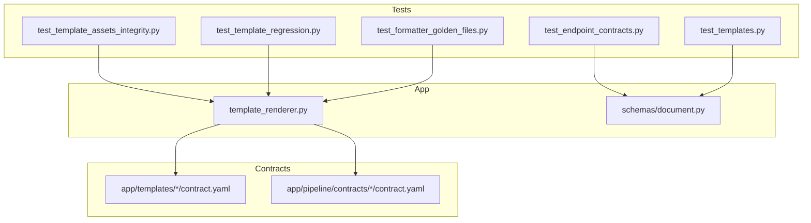
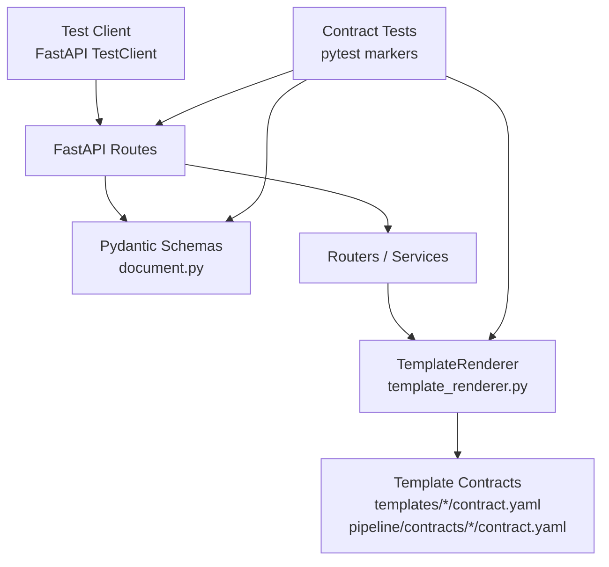
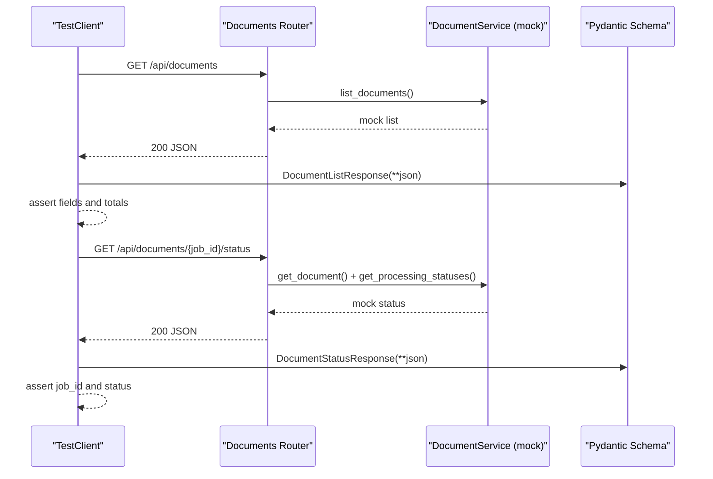
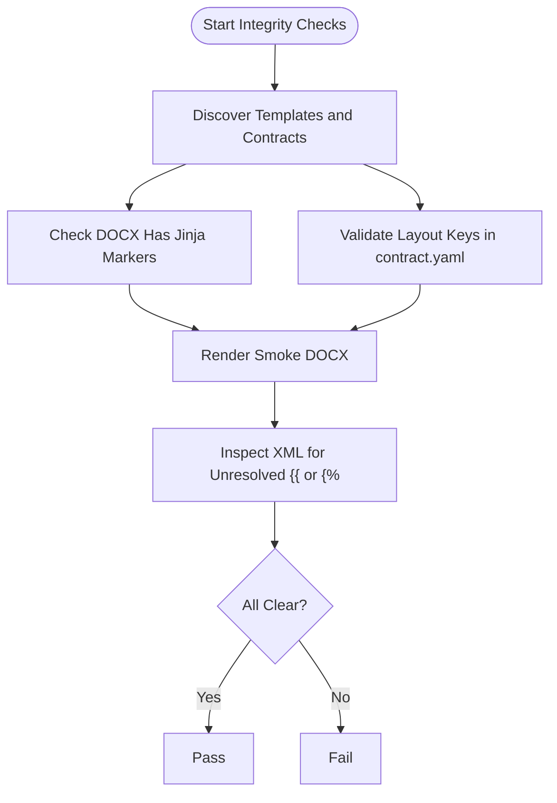
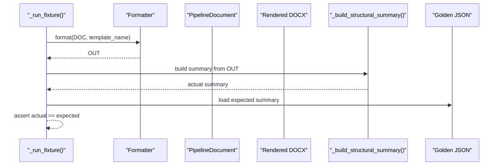
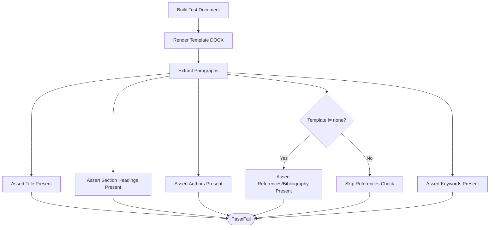
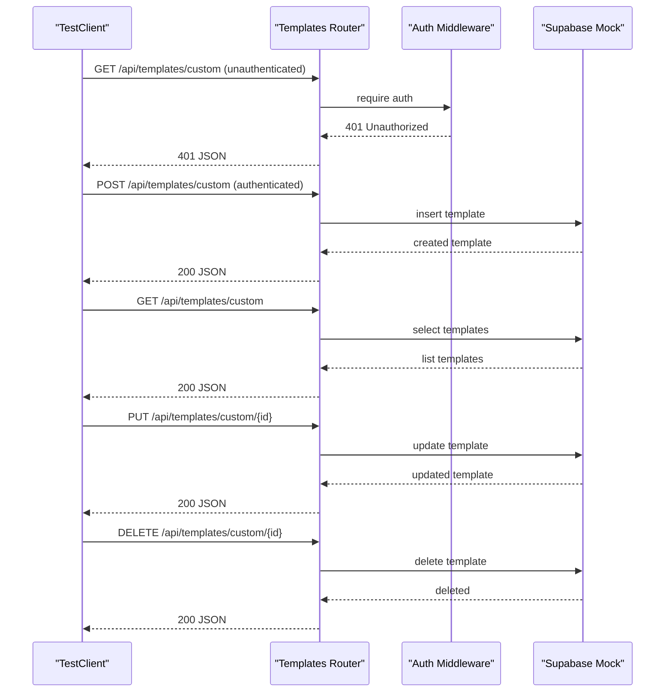
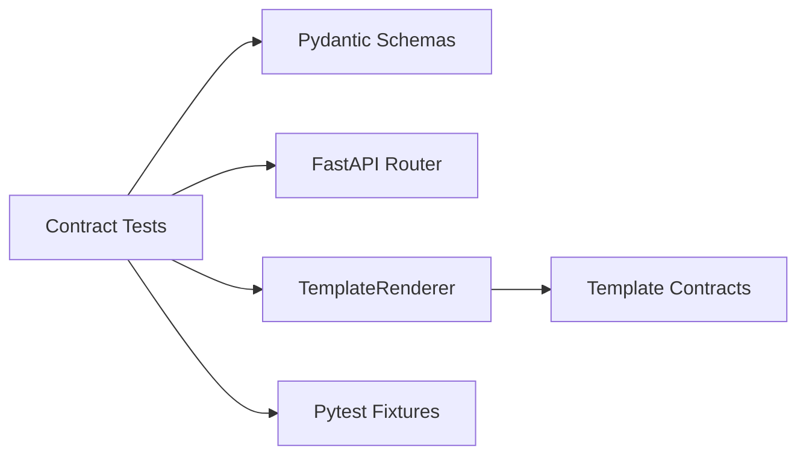

# Contract Testing

<cite>
**Referenced Files in This Document**
- [test_endpoint_contracts.py](file://backend/tests/test_endpoint_contracts.py)
- [test_template_assets_integrity.py](file://backend/tests/test_template_assets_integrity.py)
- [test_template_regression.py](file://backend/tests/test_template_regression.py)
- [test_templates.py](file://backend/tests/test_templates.py)
- [test_formatter_golden_files.py](file://backend/tests/test_formatter_golden_files.py)
- [template_renderer.py](file://backend/app/pipeline/formatting/template_renderer.py)
- [document.py](file://backend/app/schemas/document.py)
- [conftest.py](file://backend/tests/conftest.py)
- [backend-ci.yml](file://.github/workflows/backend-ci.yml)
- [pytest.ini](file://backend/pytest.ini)
- [TESTING_COMMANDS.md](file://backend/manual_tests/TESTING_COMMANDS.md)
- [ieee contract.yaml (pipeline)](file://backend/app/pipeline/contracts/ieee/contract.yaml)
- [ieee contract.yaml (templates)](file://backend/app/templates/ieee/contract.yaml)
</cite>

## Table of Contents
1. [Introduction](#introduction)
2. [Project Structure](#project-structure)
3. [Core Components](#core-components)
4. [Architecture Overview](#architecture-overview)
5. [Detailed Component Analysis](#detailed-component-analysis)
6. [Dependency Analysis](#dependency-analysis)
7. [Performance Considerations](#performance-considerations)
8. [Troubleshooting Guide](#troubleshooting-guide)
9. [Conclusion](#conclusion)
10. [Appendices](#appendices)

## Introduction
This document describes contract testing for the backend API and template assets. It covers:
- Endpoint contract testing: request/response schema validation, status code verification, and behavioral contract enforcement
- Template asset integrity testing: template file validation, Jinja marker detection, and regression testing
- Contract-driven development, golden file testing strategies, and automated verification
- Guidelines for maintaining contract consistency, handling breaking changes, and testing backward compatibility
- Tools, validation frameworks, and continuous integration approaches used in the repository

## Project Structure
The repository organizes contract-related tests under backend/tests and template contracts under backend/app/templates and backend/app/pipeline/contracts. The backend uses FastAPI with Pydantic models for API schemas and a TemplateRenderer for DOCX generation.

**Diagram sources**
- [test_endpoint_contracts.py:1-170](file://backend/tests/test_endpoint_contracts.py#L1-L170)
- [test_template_assets_integrity.py:1-98](file://backend/tests/test_template_assets_integrity.py#L1-L98)
- [test_template_regression.py:1-93](file://backend/tests/test_template_regression.py#L1-L93)
- [test_templates.py:1-145](file://backend/tests/test_templates.py#L1-L145)
- [test_formatter_golden_files.py:1-253](file://backend/tests/test_formatter_golden_files.py#L1-L253)
- [template_renderer.py:1-331](file://backend/app/pipeline/formatting/template_renderer.py#L1-L331)
- [document.py:1-266](file://backend/app/schemas/document.py#L1-L266)

**Section sources**
- [test_endpoint_contracts.py:1-170](file://backend/tests/test_endpoint_contracts.py#L1-L170)
- [test_template_assets_integrity.py:1-98](file://backend/tests/test_template_assets_integrity.py#L1-L98)
- [test_template_regression.py:1-93](file://backend/tests/test_template_regression.py#L1-L93)
- [test_templates.py:1-145](file://backend/tests/test_templates.py#L1-L145)
- [test_formatter_golden_files.py:1-253](file://backend/tests/test_formatter_golden_files.py#L1-L253)
- [template_renderer.py:1-331](file://backend/app/pipeline/formatting/template_renderer.py#L1-L331)
- [document.py:1-266](file://backend/app/schemas/document.py#L1-L266)

## Core Components
- Endpoint contract tests validate API responses against Pydantic models and enforce status codes and error shapes.
- Template asset integrity tests ensure template DOCX files contain Jinja markers and that contracts define required layout fields.
- Golden file tests compare rendered DOCX outputs against expected structural summaries to prevent regressions.
- Template regression tests verify presence of key sections across major templates.
- Template CRUD and list endpoints are tested for authentication, validation, and response shape.

Key implementation references:
- Endpoint contracts and schema validation: [test_endpoint_contracts.py:62-170](file://backend/tests/test_endpoint_contracts.py#L62-L170), [document.py:148-178](file://backend/app/schemas/document.py#L148-L178)
- Template integrity and marker checks: [test_template_assets_integrity.py:56-98](file://backend/tests/test_template_assets_integrity.py#L56-L98), [template_renderer.py:200-230](file://backend/app/pipeline/formatting/template_renderer.py#L200-L230)
- Golden file testing: [test_formatter_golden_files.py:222-253](file://backend/tests/test_formatter_golden_files.py#L222-L253)
- Template regression: [test_template_regression.py:47-93](file://backend/tests/test_template_regression.py#L47-L93)
- Template CRUD/list/search endpoints: [test_templates.py:38-145](file://backend/tests/test_templates.py#L38-L145)

**Section sources**
- [test_endpoint_contracts.py:62-170](file://backend/tests/test_endpoint_contracts.py#L62-L170)
- [document.py:148-178](file://backend/app/schemas/document.py#L148-L178)
- [test_template_assets_integrity.py:56-98](file://backend/tests/test_template_assets_integrity.py#L56-L98)
- [template_renderer.py:200-230](file://backend/app/pipeline/formatting/template_renderer.py#L200-L230)
- [test_formatter_golden_files.py:222-253](file://backend/tests/test_formatter_golden_files.py#L222-L253)
- [test_template_regression.py:47-93](file://backend/tests/test_template_regression.py#L47-L93)
- [test_templates.py:38-145](file://backend/tests/test_templates.py#L38-L145)

## Architecture Overview
The contract testing architecture integrates FastAPI routes, Pydantic schemas, and template rendering with targeted tests.

**Diagram sources**
- [test_endpoint_contracts.py:21-55](file://backend/tests/test_endpoint_contracts.py#L21-L55)
- [document.py:148-178](file://backend/app/schemas/document.py#L148-L178)
- [template_renderer.py:29-83](file://backend/app/pipeline/formatting/template_renderer.py#L29-L83)
- [test_template_assets_integrity.py:17-98](file://backend/tests/test_template_assets_integrity.py#L17-L98)

## Detailed Component Analysis

### Endpoint Contract Testing
Behavioral and schema enforcement:
- Validates Pydantic models for list/status/preview endpoints
- Enforces status codes for invalid extension uploads and not-found previews
- Uses dependency overrides and mocks to isolate router behavior

**Diagram sources**
- [test_endpoint_contracts.py:68-128](file://backend/tests/test_endpoint_contracts.py#L68-L128)
- [document.py:148-178](file://backend/app/schemas/document.py#L148-L178)

Key test references:
- List documents contract: [test_endpoint_contracts.py:68-95](file://backend/tests/test_endpoint_contracts.py#L68-L95)
- Status contract: [test_endpoint_contracts.py:96-128](file://backend/tests/test_endpoint_contracts.py#L96-L128)
- Preview contract: [test_endpoint_contracts.py:129-153](file://backend/tests/test_endpoint_contracts.py#L129-L153)
- Invalid extension contract: [test_endpoint_contracts.py:154-162](file://backend/tests/test_endpoint_contracts.py#L154-L162)
- Not-found preview contract: [test_endpoint_contracts.py:164-170](file://backend/tests/test_endpoint_contracts.py#L164-L170)

**Section sources**
- [test_endpoint_contracts.py:62-170](file://backend/tests/test_endpoint_contracts.py#L62-L170)
- [document.py:148-178](file://backend/app/schemas/document.py#L148-L178)

### Template Asset Integrity Testing
Ensures template DOCX files contain Jinja markers and that contracts define required layout fields. Smoke renders are checked for unresolved Jinja expressions.

**Diagram sources**
- [test_template_assets_integrity.py:52-98](file://backend/tests/test_template_assets_integrity.py#L52-L98)
- [template_renderer.py:200-230](file://backend/app/pipeline/formatting/template_renderer.py#L200-L230)

Key test references:
- Template names discovery: [test_template_assets_integrity.py:21-28](file://backend/tests/test_template_assets_integrity.py#L21-L28)
- Jinja marker detection: [test_template_assets_integrity.py:57-63](file://backend/tests/test_template_assets_integrity.py#L57-L63), [template_renderer.py:200-230](file://backend/app/pipeline/formatting/template_renderer.py#L200-L230)
- Layout core validation: [test_template_assets_integrity.py:67-71](file://backend/tests/test_template_assets_integrity.py#L67-L71), [test_template_assets_integrity.py:74-80](file://backend/tests/test_template_assets_integrity.py#L74-L80)
- Smoke render and unresolved markers: [test_template_assets_integrity.py:83-98](file://backend/tests/test_template_assets_integrity.py#L83-L98)

**Section sources**
- [test_template_assets_integrity.py:1-98](file://backend/tests/test_template_assets_integrity.py#L1-L98)
- [template_renderer.py:200-230](file://backend/app/pipeline/formatting/template_renderer.py#L200-L230)

### Golden File Testing Strategy
Golden file testing compares rendered DOCX outputs against expected structural summaries derived from golden JSON files. It validates section counts, heading hierarchy, template metadata, and reference counts.

**Diagram sources**
- [test_formatter_golden_files.py:226-253](file://backend/tests/test_formatter_golden_files.py#L226-L253)

Key test references:
- Golden file loading and assertions: [test_formatter_golden_files.py:222-253](file://backend/tests/test_formatter_golden_files.py#L222-L253)
- Structural summary builder: [test_formatter_golden_files.py:197-220](file://backend/tests/test_formatter_golden_files.py#L197-L220)
- Pipeline document construction from markdown: [test_formatter_golden_files.py:56-194](file://backend/tests/test_formatter_golden_files.py#L56-L194)

**Section sources**
- [test_formatter_golden_files.py:1-253](file://backend/tests/test_formatter_golden_files.py#L1-L253)

### Template Regression Testing
Verifies that major templates render expected sections and metadata. Includes special handling for numeric template logic.

**Diagram sources**
- [test_template_regression.py:49-79](file://backend/tests/test_template_regression.py#L49-L79)

Key test references:
- Regression basics across templates: [test_template_regression.py:49-79](file://backend/tests/test_template_regression.py#L49-L79)
- Numeric template specifics: [test_template_regression.py:81-93](file://backend/tests/test_template_regression.py#L81-L93)

**Section sources**
- [test_template_regression.py:1-93](file://backend/tests/test_template_regression.py#L1-L93)

### Template Endpoint Contract Testing
Validates authentication requirements, CRUD operations, validation errors, and response shapes for template endpoints. Also tests CSL search and fetch.

**Diagram sources**
- [test_templates.py:38-106](file://backend/tests/test_templates.py#L38-L106)

Key test references:
- Authentication requirement: [test_templates.py:38-42](file://backend/tests/test_templates.py#L38-L42)
- CRUD operations: [test_templates.py:56-106](file://backend/tests/test_templates.py#L56-L106)
- Validation error on bad config: [test_templates.py:108-117](file://backend/tests/test_templates.py#L108-L117)
- Response shape for built-in templates: [test_templates.py:119-125](file://backend/tests/test_templates.py#L119-L125)
- CSL search and fetch: [test_templates.py:127-145](file://backend/tests/test_templates.py#L127-L145)

**Section sources**
- [test_templates.py:1-145](file://backend/tests/test_templates.py#L1-L145)

## Dependency Analysis
Contract tests depend on:
- Pydantic schemas for response validation
- FastAPI TestClient for endpoint testing
- TemplateRenderer for DOCX rendering and marker inspection
- Template contracts for layout and style definitions

**Diagram sources**
- [test_endpoint_contracts.py:21-55](file://backend/tests/test_endpoint_contracts.py#L21-L55)
- [document.py:148-178](file://backend/app/schemas/document.py#L148-L178)
- [template_renderer.py:29-83](file://backend/app/pipeline/formatting/template_renderer.py#L29-L83)
- [test_template_assets_integrity.py:17-98](file://backend/tests/test_template_assets_integrity.py#L17-L98)
- [conftest.py:72-112](file://backend/tests/conftest.py#L72-L112)

**Section sources**
- [test_endpoint_contracts.py:21-55](file://backend/tests/test_endpoint_contracts.py#L21-L55)
- [document.py:148-178](file://backend/app/schemas/document.py#L148-L178)
- [template_renderer.py:29-83](file://backend/app/pipeline/formatting/template_renderer.py#L29-L83)
- [test_template_assets_integrity.py:17-98](file://backend/tests/test_template_assets_integrity.py#L17-L98)
- [conftest.py:72-112](file://backend/tests/conftest.py#L72-L112)

## Performance Considerations
- Use dependency overrides and mocks to avoid external dependencies during contract tests
- Prefer parametrized tests to minimize repeated setup
- Keep fixture scopes appropriate to reduce overhead
- Use targeted markers to run subsets of contract tests efficiently

[No sources needed since this section provides general guidance]

## Troubleshooting Guide
Common issues and resolutions:
- Schema validation failures: Ensure response payloads match Pydantic models; confirm router returns correct fields and types
- Missing Jinja markers: Confirm template.docx contains Jinja expressions; regenerate or rebuild fallback template if necessary
- Unresolved Jinja in smoke render: Inspect rendered XML for unresolved tags and adjust template context or markers
- Authentication errors: Verify dependency overrides for auth; ensure requests include proper credentials for protected endpoints
- CSL search/fetch failures: Validate async mocks and ensure expected parameters are passed

**Section sources**
- [test_endpoint_contracts.py:62-170](file://backend/tests/test_endpoint_contracts.py#L62-L170)
- [test_template_assets_integrity.py:56-98](file://backend/tests/test_template_assets_integrity.py#L56-L98)
- [template_renderer.py:200-230](file://backend/app/pipeline/formatting/template_renderer.py#L200-L230)
- [test_templates.py:38-145](file://backend/tests/test_templates.py#L38-L145)

## Conclusion
The repository implements robust contract testing across API endpoints and template assets. By validating schemas, enforcing status codes, ensuring template integrity, and using golden file comparisons, the system maintains reliability and prevents regressions. Continuous integration runs contract tests alongside linting and type checking to keep the backend stable.

[No sources needed since this section summarizes without analyzing specific files]

## Appendices

### Continuous Integration and Test Execution
- Backend CI workflow runs linters, type checks, and pytest excluding slow/integration tests
- Pytest markers categorize contract, regression, and other test groups
- Manual testing commands provide step-by-step verification for pipeline phases

**Section sources**
- [backend-ci.yml:1-41](file://.github/workflows/backend-ci.yml#L1-L41)
- [pytest.ini:16-28](file://backend/pytest.ini#L16-L28)
- [TESTING_COMMANDS.md:1-285](file://backend/manual_tests/TESTING_COMMANDS.md#L1-L285)

### Contract Definitions and Examples
- Pipeline contract example (IEEE): [ieee contract.yaml (pipeline):1-99](file://backend/app/pipeline/contracts/ieee/contract.yaml#L1-L99)
- Template contract example (IEEE): [ieee contract.yaml (templates):1-50](file://backend/app/templates/ieee/contract.yaml#L1-L50)

**Section sources**
- [ieee contract.yaml (pipeline):1-99](file://backend/app/pipeline/contracts/ieee/contract.yaml#L1-L99)
- [ieee contract.yaml (templates):1-50](file://backend/app/templates/ieee/contract.yaml#L1-L50)