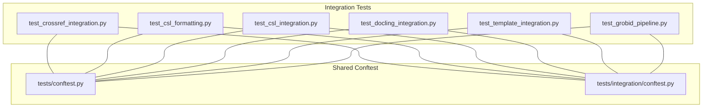
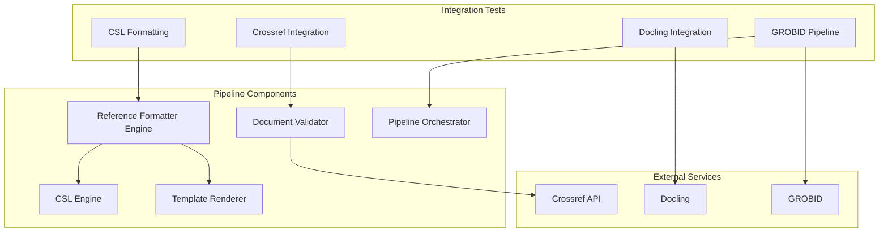
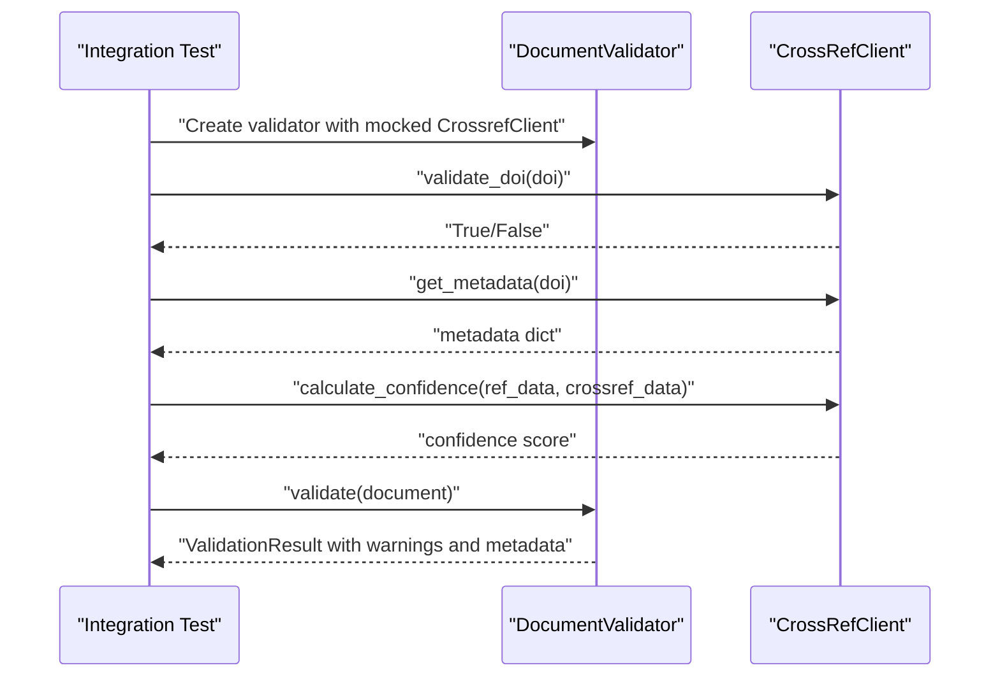
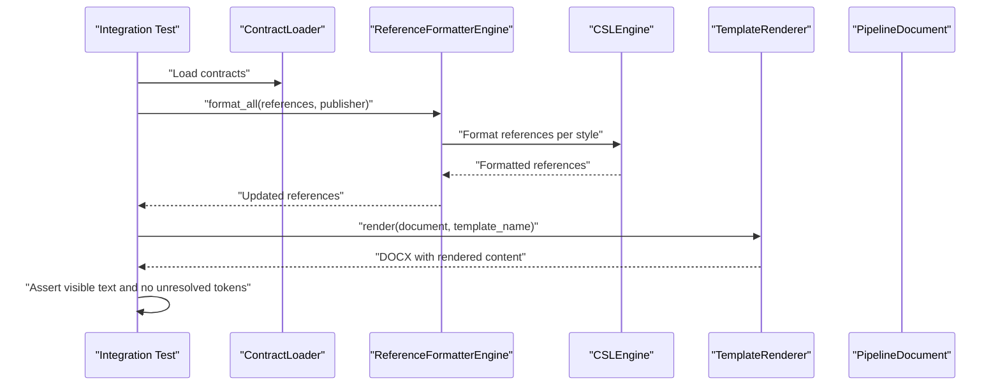
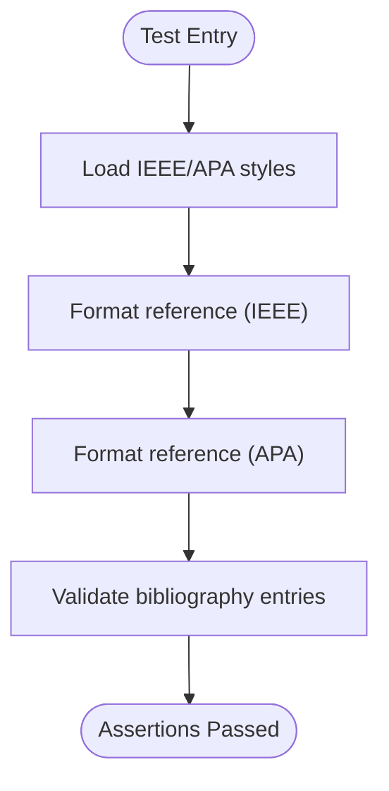
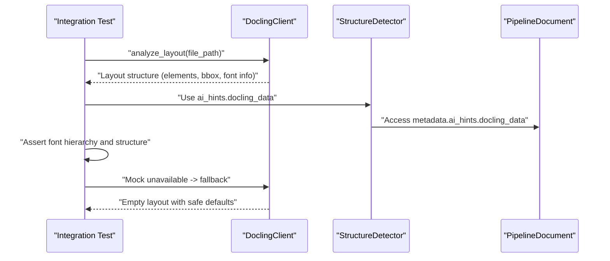
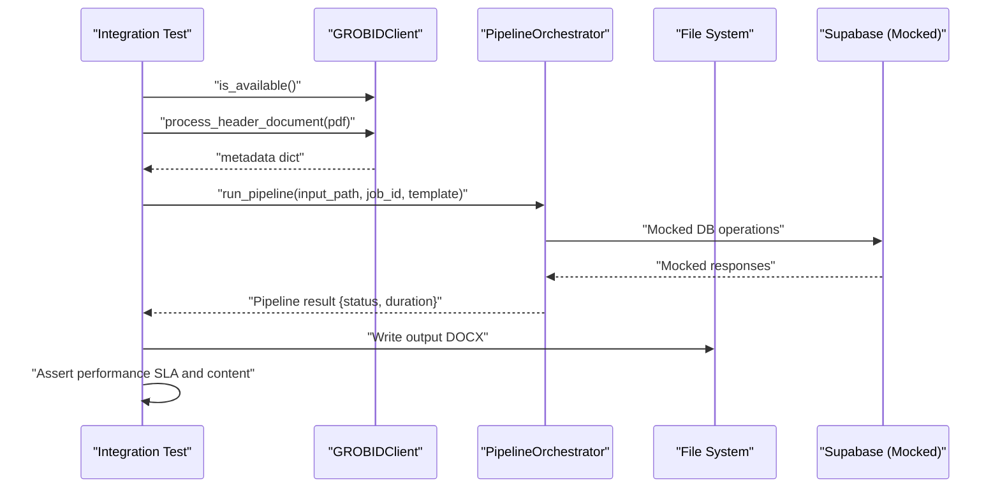
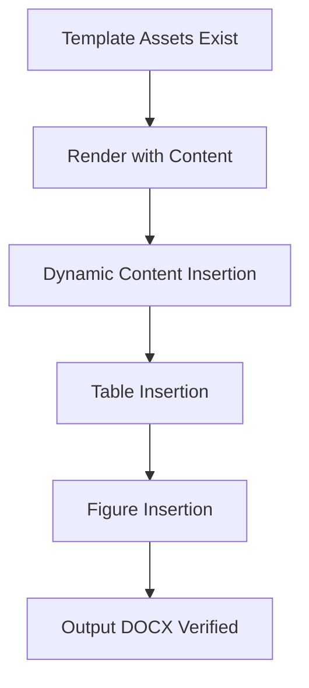
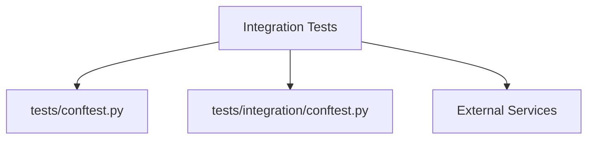

# Integration Testing

<cite>
**Referenced Files in This Document**
- [conftest.py](file://backend/tests/conftest.py)
- [integration/conftest.py](file://backend/tests/integration/conftest.py)
- [test_crossref_integration.py](file://backend/tests/integration/test_crossref_integration.py)
- [test_csl_formatting.py](file://backend/tests/integration/test_csl_formatting.py)
- [test_csl_integration.py](file://backend/tests/integration/test_csl_integration.py)
- [test_docling_integration.py](file://backend/tests/integration/test_docling_integration.py)
- [test_template_integration.py](file://backend/tests/integration/test_template_integration.py)
- [test_grobid_pipeline.py](file://backend/tests/integration/test_grobid_pipeline.py)
- [crossref_client.py](file://backend/app/pipeline/services/crossref_client.py)
- [docling_client.py](file://backend/app/pipeline/services/docling_client.py)
- [template_renderer.py](file://backend/app/pipeline/formatting/template_renderer.py)
- [TESTING_COMMANDS.md](file://backend/manual_tests/TESTING_COMMANDS.md)
</cite>

## Table of Contents
1. [Introduction](#introduction)
2. [Project Structure](#project-structure)
3. [Core Components](#core-components)
4. [Architecture Overview](#architecture-overview)
5. [Detailed Component Analysis](#detailed-component-analysis)
6. [Dependency Analysis](#dependency-analysis)
7. [Performance Considerations](#performance-considerations)
8. [Troubleshooting Guide](#troubleshooting-guide)
9. [Conclusion](#conclusion)
10. [Appendices](#appendices)

## Introduction
This document describes the integration testing strategy for end-to-end workflows involving external services and real-world scenarios. It covers the integration test suite for:
- Crossref API integration for DOI validation and metadata retrieval
- CSL formatting and template rendering validation
- Docling document processing integration
- GROBID pipeline integration and fallback behavior
- Multi-service workflows and template rendering validation

It also explains test environment setup, service mocking strategies, data fixture management, isolation and cleanup, and performance considerations for reliable integration tests.

## Project Structure
The integration tests are organized under backend/tests/integration and leverage shared fixtures and environment gating from backend/tests/conftest.py. Each test module focuses on a specific integration area and uses targeted fixtures and mocks to isolate external dependencies while validating end-to-end behavior.

**Diagram sources**
- [conftest.py:1-112](file://backend/tests/conftest.py#L1-L112)
- [integration/conftest.py:1-41](file://backend/tests/integration/conftest.py#L1-L41)

**Section sources**
- [conftest.py:1-112](file://backend/tests/conftest.py#L1-L112)
- [integration/conftest.py:1-41](file://backend/tests/integration/conftest.py#L1-L41)

## Core Components
- Crossref API client: Validates DOIs, retrieves metadata, and computes confidence scores.
- Docling client: Performs layout analysis and extracts structured elements with fallback behavior.
- Template renderer: Renders DOCX using Jinja2/docxtpl templates and validates absence of unresolved template tokens.
- GROBID pipeline: Integrates metadata extraction and orchestrates end-to-end processing with performance targets and fallback behavior.
- Shared fixtures and environment gating: Skip integration tests when external services are unreachable and provide global mocks for non-essential services.

Key responsibilities:
- Crossref integration validates DOIs and confidence scoring in the document validator.
- CSL integration validates style loading and reference formatting engines.
- Template integration ensures templates render without unresolved Jinja tokens.
- Docling integration validates layout structures and fallback behavior.
- GROBID pipeline integration validates availability, metadata extraction, performance, and fallback behavior.

**Section sources**
- [crossref_client.py:1-171](file://backend/app/pipeline/services/crossref_client.py#L1-L171)
- [docling_client.py:1-482](file://backend/app/pipeline/services/docling_client.py#L1-L482)
- [template_renderer.py:1-331](file://backend/app/pipeline/formatting/template_renderer.py#L1-L331)
- [test_crossref_integration.py:1-82](file://backend/tests/integration/test_crossref_integration.py#L1-L82)
- [test_csl_formatting.py:1-152](file://backend/tests/integration/test_csl_formatting.py#L1-L152)
- [test_csl_integration.py:1-137](file://backend/tests/integration/test_csl_integration.py#L1-L137)
- [test_docling_integration.py:1-108](file://backend/tests/integration/test_docling_integration.py#L1-L108)
- [test_template_integration.py:1-130](file://backend/tests/integration/test_template_integration.py#L1-L130)
- [test_grobid_pipeline.py:1-255](file://backend/tests/integration/test_grobid_pipeline.py#L1-L255)

## Architecture Overview
The integration tests exercise multi-service workflows:
- Crossref validation integrates with the document validator to annotate references with metadata and confidence.
- CSL formatting integrates with the reference formatter engine and template renderer to produce styled DOCX outputs.
- Docling layout analysis integrates with structure detection and the pipeline to enrich document metadata.
- GROBID pipeline integrates metadata extraction, orchestration, and performance checks with graceful fallback.

**Diagram sources**
- [crossref_client.py:1-171](file://backend/app/pipeline/services/crossref_client.py#L1-L171)
- [docling_client.py:1-482](file://backend/app/pipeline/services/docling_client.py#L1-L482)
- [template_renderer.py:1-331](file://backend/app/pipeline/formatting/template_renderer.py#L1-L331)
- [test_crossref_integration.py:1-82](file://backend/tests/integration/test_crossref_integration.py#L1-L82)
- [test_csl_formatting.py:1-152](file://backend/tests/integration/test_csl_formatting.py#L1-L152)
- [test_docling_integration.py:1-108](file://backend/tests/integration/test_docling_integration.py#L1-L108)
- [test_grobid_pipeline.py:1-255](file://backend/tests/integration/test_grobid_pipeline.py#L1-L255)

## Detailed Component Analysis

### Crossref Integration
This suite validates DOI validation and metadata retrieval via the Crossref client and ensures the document validator annotates references accordingly.

**Diagram sources**
- [test_crossref_integration.py:1-82](file://backend/tests/integration/test_crossref_integration.py#L1-L82)
- [crossref_client.py:1-171](file://backend/app/pipeline/services/crossref_client.py#L1-L171)

Key behaviors validated:
- Valid DOI returns metadata and high confidence.
- Invalid DOI sets low confidence and adds warnings.
- Confidence calculation considers title similarity, year match, and author surname match.

**Section sources**
- [test_crossref_integration.py:1-82](file://backend/tests/integration/test_crossref_integration.py#L1-L82)
- [crossref_client.py:1-171](file://backend/app/pipeline/services/crossref_client.py#L1-L171)

### CSL Formatting and Template Rendering
This suite validates CSL formatting and template rendering end-to-end, ensuring references are formatted per style and templates render without unresolved Jinja tokens.

**Diagram sources**
- [test_csl_formatting.py:1-152](file://backend/tests/integration/test_csl_formatting.py#L1-L152)
- [template_renderer.py:1-331](file://backend/app/pipeline/formatting/template_renderer.py#L1-L331)

Validation highlights:
- IEEE and APA styles render visible content and References section.
- All templates render without unresolved Jinja tokens.
- Template assets exist and are loadable.

**Section sources**
- [test_csl_formatting.py:1-152](file://backend/tests/integration/test_csl_formatting.py#L1-L152)
- [template_renderer.py:1-331](file://backend/app/pipeline/formatting/template_renderer.py#L1-L331)

### CSL Engine Integration
This suite validates style loading and reference formatting logic for specific styles.

**Diagram sources**
- [test_csl_integration.py:1-137](file://backend/tests/integration/test_csl_integration.py#L1-L137)

**Section sources**
- [test_csl_integration.py:1-137](file://backend/tests/integration/test_csl_integration.py#L1-L137)

### Docling Integration
This suite validates Docling layout analysis structures, structure detection usage of Docling hints, fallback behavior, and font-size heuristics.

**Diagram sources**
- [test_docling_integration.py:1-108](file://backend/tests/integration/test_docling_integration.py#L1-L108)
- [docling_client.py:1-482](file://backend/app/pipeline/services/docling_client.py#L1-L482)

**Section sources**
- [test_docling_integration.py:1-108](file://backend/tests/integration/test_docling_integration.py#L1-L108)
- [docling_client.py:1-482](file://backend/app/pipeline/services/docling_client.py#L1-L482)

### GROBID Pipeline Integration
This suite validates GROBID availability, metadata extraction, performance targets, and graceful fallback behavior. It also demonstrates end-to-end pipeline orchestration with mocked persistence.

**Diagram sources**
- [test_grobid_pipeline.py:1-255](file://backend/tests/integration/test_grobid_pipeline.py#L1-L255)

Key validations:
- Service availability and metadata extraction.
- Response-time SLA under 5 seconds.
- Fallback behavior when GROBID is unavailable.
- End-to-end pipeline completion with mocked database.

**Section sources**
- [test_grobid_pipeline.py:1-255](file://backend/tests/integration/test_grobid_pipeline.py#L1-L255)

### Template Integration
This suite validates template asset presence, rendering with content, and dynamic content/table/figure insertion placeholders.

**Diagram sources**
- [test_template_integration.py:1-130](file://backend/tests/integration/test_template_integration.py#L1-L130)

**Section sources**
- [test_template_integration.py:1-130](file://backend/tests/integration/test_template_integration.py#L1-L130)

## Dependency Analysis
Integration tests depend on:
- Shared environment gating to skip tests when external services are unavailable.
- Global mocks for non-essential services to maintain isolation.
- Local fixtures for building documents and references.

**Diagram sources**
- [conftest.py:1-112](file://backend/tests/conftest.py#L1-L112)
- [integration/conftest.py:1-41](file://backend/tests/integration/conftest.py#L1-L41)

**Section sources**
- [conftest.py:1-112](file://backend/tests/conftest.py#L1-L112)
- [integration/conftest.py:1-41](file://backend/tests/integration/conftest.py#L1-L41)

## Performance Considerations
- GROBID response-time SLA: Tests enforce a maximum response time threshold to ensure responsiveness.
- Rate limiting: The Crossref client enforces a minimum request interval to respect API limits.
- Graceful fallbacks: Docling and GROBID integrations provide fallback behavior to avoid pipeline failures.
- Mocking non-essential services: Global mocks reduce flakiness and improve stability during integration tests.

Recommendations:
- Prefer deterministic fixtures and controlled timeouts.
- Use retries with bounded backoff for external services.
- Isolate flaky external calls behind safe wrappers with fallbacks.
- Monitor and log durations for long-running steps.

**Section sources**
- [test_grobid_pipeline.py:109-135](file://backend/tests/integration/test_grobid_pipeline.py#L109-L135)
- [crossref_client.py:30-54](file://backend/app/pipeline/services/crossref_client.py#L30-L54)
- [docling_client.py:180-191](file://backend/app/pipeline/services/docling_client.py#L180-L191)

## Troubleshooting Guide
Common issues and resolutions:
- External service unavailability: Integration tests are auto-skipped when services are unreachable. Confirm service endpoints and ports.
- Missing template markers: The template renderer validates Jinja markers; ensure templates include proper markers or use fallback templates.
- Unresolved Jinja tokens: Inspect DOCX XML content to locate unresolved tokens and update templates accordingly.
- GROBID errors: Tests handle invalid input safely; verify input files and metadata extraction logic.
- Crossref rate limits: Respect minimum request intervals; batch or cache results when possible.

Operational tips:
- Use the manual testing commands to validate end-to-end flows outside of CI.
- Keep fixtures minimal and deterministic to reduce flakiness.
- Clean up temporary files and DOCX outputs after tests.

**Section sources**
- [integration/conftest.py:24-40](file://backend/tests/integration/conftest.py#L24-L40)
- [template_renderer.py:200-230](file://backend/app/pipeline/formatting/template_renderer.py#L200-L230)
- [TESTING_COMMANDS.md:1-285](file://backend/manual_tests/TESTING_COMMANDS.md#L1-L285)

## Conclusion
The integration test suite comprehensively validates end-to-end workflows across Crossref, CSL formatting, Docling, and GROBID. By combining environment gating, targeted fixtures, and robust fallbacks, the suite remains reliable and informative. Adhering to the guidelines herein will help maintain a stable, fast, and trustworthy integration test suite.

## Appendices

### Test Environment Setup
- Ensure external services are reachable or mark tests to skip when unavailable.
- Configure environment variables for service hosts and ports if different from defaults.
- Install optional dependencies required by template rendering and Docling.

**Section sources**
- [integration/conftest.py:17-32](file://backend/tests/integration/conftest.py#L17-L32)
- [conftest.py:29-44](file://backend/tests/conftest.py#L29-L44)

### Service Mocking Strategies
- Use patch decorators to mock clients and database interactions.
- Provide async mocks for streaming publish operations.
- Replace Redis-backed caches and rate-limiters with in-memory mocks.

**Section sources**
- [conftest.py:46-58](file://backend/tests/conftest.py#L46-L58)

### Data Fixture Management
- Build minimal PipelineDocument fixtures with metadata, blocks, and references.
- Use factories to generate realistic but deterministic test data.
- Validate fixture completeness before running tests.

**Section sources**
- [conftest.py:70-112](file://backend/tests/conftest.py#L70-L112)

### Test Isolation and Cleanup
- Avoid global mutable state; rely on fixtures and mocks.
- Clean temporary files and DOCX outputs after tests.
- Use pytest tmp_path fixtures for isolated output directories.

**Section sources**
- [test_csl_formatting.py:92-102](file://backend/tests/integration/test_csl_formatting.py#L92-L102)
- [test_grobid_pipeline.py:153-165](file://backend/tests/integration/test_grobid_pipeline.py#L153-L165)

### Guidelines for Reliable Integration Tests
- Prefer deterministic inputs and controlled timeouts.
- Validate both success paths and error/fallback paths.
- Log durations and outcomes for performance regression detection.
- Keep assertions focused and readable; separate concerns across tests.

[No sources needed since this section provides general guidance]