# Security Testing

<cite>
**Referenced Files in This Document**
- [backend-ci.yml](file://.github/workflows/backend-ci.yml)
- [security.yml](file://.github/workflows/security.yml)
- [rate_limit.py](file://backend/app/middleware/rate_limit.py)
- [tier_rate_limit.py](file://backend/app/middleware/tier_rate_limit.py)
- [security_headers.py](file://backend/app/middleware/security_headers.py)
- [rbac.py](file://backend/app/middleware/rbac.py)
- [safe_execution.py](file://backend/app/pipeline/safety/safe_execution.py)
- [circuit_breaker.py](file://backend/app/pipeline/safety/circuit_breaker.py)
- [llm_validator.py](file://backend/app/pipeline/safety/llm_validator.py)
- [retry_guard.py](file://backend/app/pipeline/safety/retry_guard.py)
- [test_chaos.py](file://backend/tests/safety/test_chaos.py)
- [test_global_safety.py](file://backend/tests/safety/test_global_safety.py)
- [test_security_verification.py](file://backend/tests/test_security_verification.py)
</cite>

## Table of Contents
1. [Introduction](#introduction)
2. [Project Structure](#project-structure)
3. [Core Components](#core-components)
4. [Architecture Overview](#architecture-overview)
5. [Detailed Component Analysis](#detailed-component-analysis)
6. [Dependency Analysis](#dependency-analysis)
7. [Performance Considerations](#performance-considerations)
8. [Troubleshooting Guide](#troubleshooting-guide)
9. [Conclusion](#conclusion)
10. [Appendices](#appendices)

## Introduction
This document provides comprehensive security testing guidance for the backend, focusing on validation of runtime protections, safety nets, and security controls. It covers:
- Backend security validation and risk mitigation testing
- Chaos testing and global safety validation
- Security verification procedures for rate limiting, abuse detection, input sanitization, and security headers
- Vulnerability assessment and security regression testing
- Security test automation and compliance scanning
- Practical testing strategies for input validation, authentication bypass attempts, and authorization checks

The goal is to enable teams to confidently validate that the system remains resilient under adverse conditions, maintains service availability, and enforces access and policy controls.

## Project Structure
Security-related assets are organized across middleware, safety utilities, and tests:
- Middleware: rate limiting, tier-based rate limiting, security headers, and RBAC guards
- Safety utilities: circuit breakers, retry guards, LLM validators, and safe execution wrappers
- Tests: chaos and global safety validation, plus security verification for rate limiting, file size limits, and CORS

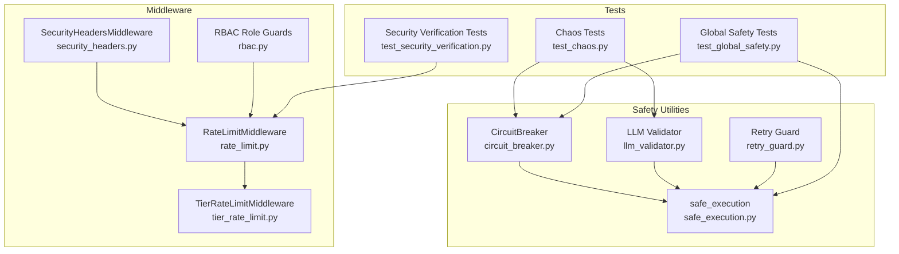

**Diagram sources**
- [rate_limit.py:49-172](file://backend/app/middleware/rate_limit.py#L49-L172)
- [tier_rate_limit.py:19-116](file://backend/app/middleware/tier_rate_limit.py#L19-L116)
- [security_headers.py:18-99](file://backend/app/middleware/security_headers.py#L18-L99)
- [rbac.py:61-80](file://backend/app/middleware/rbac.py#L61-L80)
- [safe_execution.py:9-74](file://backend/app/pipeline/safety/safe_execution.py#L9-L74)
- [circuit_breaker.py:29-164](file://backend/app/pipeline/safety/circuit_breaker.py#L29-L164)
- [retry_guard.py:10-63](file://backend/app/pipeline/safety/retry_guard.py#L10-L63)
- [llm_validator.py:46-122](file://backend/app/pipeline/safety/llm_validator.py#L46-L122)
- [test_chaos.py:7-69](file://backend/tests/safety/test_chaos.py#L7-L69)
- [test_global_safety.py:36-229](file://backend/tests/safety/test_global_safety.py#L36-L229)
- [test_security_verification.py:14-78](file://backend/tests/test_security_verification.py#L14-L78)

**Section sources**
- [rate_limit.py:1-172](file://backend/app/middleware/rate_limit.py#L1-L172)
- [tier_rate_limit.py:1-116](file://backend/app/middleware/tier_rate_limit.py#L1-L116)
- [security_headers.py:1-99](file://backend/app/middleware/security_headers.py#L1-L99)
- [rbac.py:1-80](file://backend/app/middleware/rbac.py#L1-L80)
- [safe_execution.py:1-74](file://backend/app/pipeline/safety/safe_execution.py#L1-L74)
- [circuit_breaker.py:1-164](file://backend/app/pipeline/safety/circuit_breaker.py#L1-L164)
- [retry_guard.py:1-63](file://backend/app/pipeline/safety/retry_guard.py#L1-L63)
- [llm_validator.py:1-122](file://backend/app/pipeline/safety/llm_validator.py#L1-L122)
- [test_chaos.py:1-69](file://backend/tests/safety/test_chaos.py#L1-L69)
- [test_global_safety.py:1-229](file://backend/tests/safety/test_global_safety.py#L1-L229)
- [test_security_verification.py:1-78](file://backend/tests/test_security_verification.py#L1-L78)

## Core Components
- Rate Limiting Middleware: Implements sliding-window counting with in-memory and Redis-backed counters, enforcing per-minute limits for general traffic and uploads, and supports health endpoints bypass.
- Tier Rate Limiting Middleware: Applies guest daily caps for specific endpoints using JWT-subject fingerprinting and Redis with in-memory fallback.
- Security Headers Middleware: Adds CSP, X-Content-Type-Options, X-Frame-Options, X-XSS-Protection, Referrer-Policy, Permissions-Policy, and HSTS-like behavior.
- RBAC Role Guards: Normalizes roles and enforces minimum role requirements for protected routes.
- Safety Utilities:
  - Safe Execution: Context manager and decorators to suppress unexpected crashes and return fallbacks.
  - Circuit Breaker: Thread-safe breaker with fallback support and fallback invocation.
  - Retry Guard: Exponential backoff for sync/async functions.
  - LLM Validator: Guardrails-based or Pydantic-based output validation with graceful degradation.

**Section sources**
- [rate_limit.py:49-172](file://backend/app/middleware/rate_limit.py#L49-L172)
- [tier_rate_limit.py:19-116](file://backend/app/middleware/tier_rate_limit.py#L19-L116)
- [security_headers.py:18-99](file://backend/app/middleware/security_headers.py#L18-L99)
- [rbac.py:61-80](file://backend/app/middleware/rbac.py#L61-L80)
- [safe_execution.py:9-74](file://backend/app/pipeline/safety/safe_execution.py#L9-L74)
- [circuit_breaker.py:29-164](file://backend/app/pipeline/safety/circuit_breaker.py#L29-L164)
- [retry_guard.py:10-63](file://backend/app/pipeline/safety/retry_guard.py#L10-L63)
- [llm_validator.py:46-122](file://backend/app/pipeline/safety/llm_validator.py#L46-L122)

## Architecture Overview
The security architecture integrates middleware and safety utilities to protect the API surface and pipeline components.

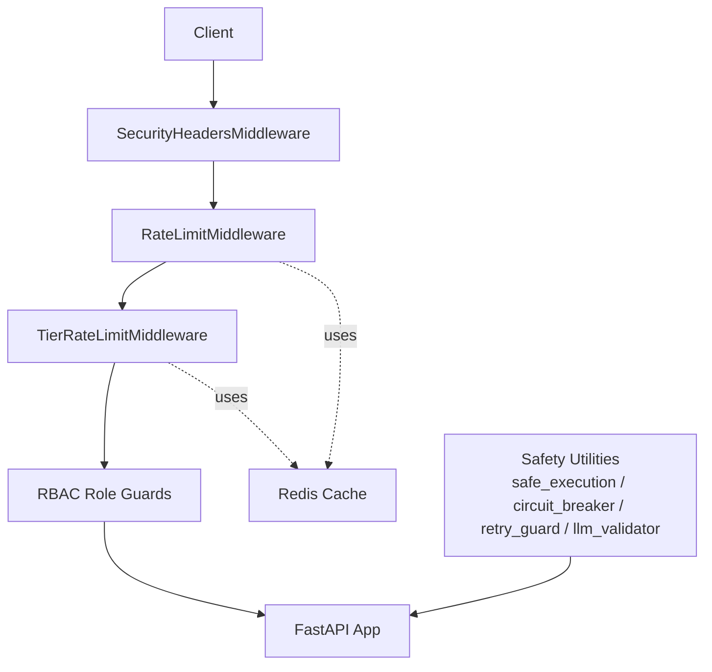

**Diagram sources**
- [security_headers.py:28-66](file://backend/app/middleware/security_headers.py#L28-L66)
- [rate_limit.py:124-172](file://backend/app/middleware/rate_limit.py#L124-L172)
- [tier_rate_limit.py:96-116](file://backend/app/middleware/tier_rate_limit.py#L96-L116)
- [rbac.py:68-77](file://backend/app/middleware/rbac.py#L68-L77)
- [safe_execution.py:9-74](file://backend/app/pipeline/safety/safe_execution.py#L9-L74)
- [circuit_breaker.py:29-97](file://backend/app/pipeline/safety/circuit_breaker.py#L29-L97)
- [retry_guard.py:10-63](file://backend/app/pipeline/safety/retry_guard.py#L10-L63)
- [llm_validator.py:46-122](file://backend/app/pipeline/safety/llm_validator.py#L46-L122)

## Detailed Component Analysis

### Rate Limiting Middleware
- Purpose: Enforce sliding-window rate limits for general traffic and uploads, with optional Redis scaling and in-memory fallback for unit tests.
- Key behaviors:
  - Separate counters for general and upload traffic
  - Uploads include a token fingerprint to differentiate authenticated users
  - Health endpoints are excluded from rate limiting
  - Returns structured 429 responses with retry-after guidance

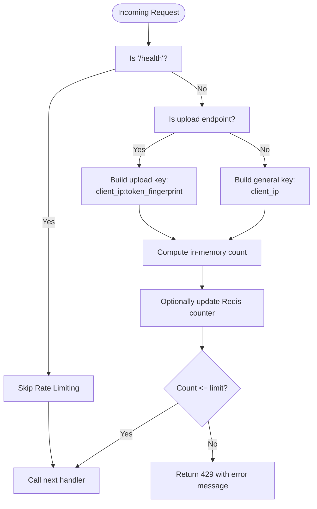

**Diagram sources**
- [rate_limit.py:124-172](file://backend/app/middleware/rate_limit.py#L124-L172)

**Section sources**
- [rate_limit.py:49-172](file://backend/app/middleware/rate_limit.py#L49-L172)

### Tier Rate Limiting Middleware
- Purpose: Apply guest daily caps for specific endpoints using UTC-day keys and JWT subject fingerprinting.
- Key behaviors:
  - Skips health/status/templates/metrics endpoints
  - Limits POST endpoints: uploads and generation sessions
  - Unauthenticated guests are counted; authenticated users are exempt
  - Returns 429 with upgrade hint when exceeding daily cap

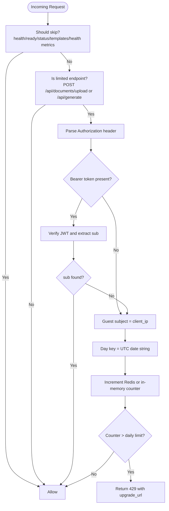

**Diagram sources**
- [tier_rate_limit.py:96-116](file://backend/app/middleware/tier_rate_limit.py#L96-L116)

**Section sources**
- [tier_rate_limit.py:19-116](file://backend/app/middleware/tier_rate_limit.py#L19-L116)

### Security Headers Middleware
- Purpose: Add standardized security headers to all responses, with special CSP for docs routes.
- Key headers: Content-Security-Policy, X-Content-Type-Options, X-Frame-Options, X-XSS-Protection, Referrer-Policy, Permissions-Policy.

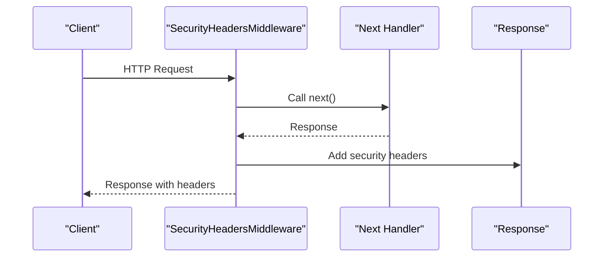

**Diagram sources**
- [security_headers.py:28-66](file://backend/app/middleware/security_headers.py#L28-L66)

**Section sources**
- [security_headers.py:18-99](file://backend/app/middleware/security_headers.py#L18-L99)

### RBAC Role Guards
- Purpose: Normalize roles and enforce minimum role requirements for protected routes.
- Key behaviors:
  - Role aliases mapped to normalized tiers
  - Effective role stored on the current user object
  - 403 Forbidden raised for insufficient permissions

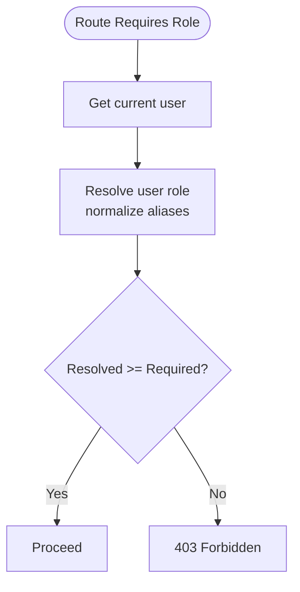

**Diagram sources**
- [rbac.py:68-77](file://backend/app/middleware/rbac.py#L68-L77)

**Section sources**
- [rbac.py:1-80](file://backend/app/middleware/rbac.py#L1-L80)

### Safety Utilities
- Safe Execution: Context manager and decorators to suppress unexpected crashes and return fallbacks.
- Circuit Breaker: Thread-safe breaker with fallback invocation and graceful degradation.
- Retry Guard: Exponential backoff for sync/async functions.
- LLM Validator: Guardrails-based or Pydantic-based validation with graceful fallback.

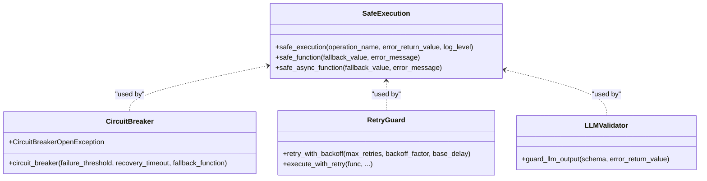

**Diagram sources**
- [safe_execution.py:9-74](file://backend/app/pipeline/safety/safe_execution.py#L9-L74)
- [circuit_breaker.py:29-164](file://backend/app/pipeline/safety/circuit_breaker.py#L29-L164)
- [retry_guard.py:10-63](file://backend/app/pipeline/safety/retry_guard.py#L10-L63)
- [llm_validator.py:46-122](file://backend/app/pipeline/safety/llm_validator.py#L46-L122)

**Section sources**
- [safe_execution.py:1-74](file://backend/app/pipeline/safety/safe_execution.py#L1-L74)
- [circuit_breaker.py:1-164](file://backend/app/pipeline/safety/circuit_breaker.py#L1-L164)
- [retry_guard.py:1-63](file://backend/app/pipeline/safety/retry_guard.py#L1-L63)
- [llm_validator.py:1-122](file://backend/app/pipeline/safety/llm_validator.py#L1-L122)

### Chaos Testing and Global Safety Validation
- Chaos tests validate:
  - Circuit breaker activation after repeated failures
  - Validator guard suppressing malformed JSON
  - Safe execution catching unexpected crashes
- Global safety tests validate:
  - Safe wrappers across critical pipeline components
  - Async safety wrappers
  - Formatter, validator, and detector resilience

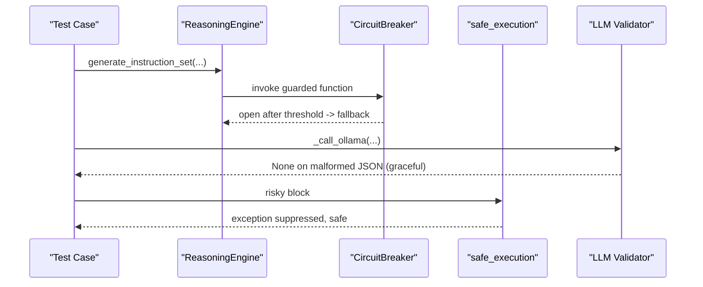

**Diagram sources**
- [test_chaos.py:12-65](file://backend/tests/safety/test_chaos.py#L12-L65)
- [circuit_breaker.py:74-96](file://backend/app/pipeline/safety/circuit_breaker.py#L74-L96)
- [safe_execution.py:9-31](file://backend/app/pipeline/safety/safe_execution.py#L9-L31)
- [llm_validator.py:80-121](file://backend/app/pipeline/safety/llm_validator.py#L80-L121)

**Section sources**
- [test_chaos.py:1-69](file://backend/tests/safety/test_chaos.py#L1-L69)
- [test_global_safety.py:36-229](file://backend/tests/safety/test_global_safety.py#L36-L229)

### Security Verification Procedures
- Rate limiting upload enforcement: Validates 10/minute upload limit and 429 on overflow.
- File size limit rejection: Ensures requests exceeding MAX_FILE_SIZE are rejected with 413.
- CORS headers presence: Confirms Access-Control-Allow-Origin and methods on OPTIONS preflight.

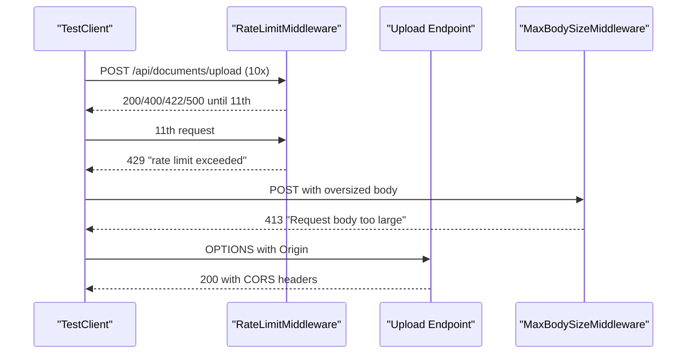

**Diagram sources**
- [test_security_verification.py:14-78](file://backend/tests/test_security_verification.py#L14-L78)
- [rate_limit.py:124-172](file://backend/app/middleware/rate_limit.py#L124-L172)
- [security_headers.py:69-99](file://backend/app/middleware/security_headers.py#L69-L99)

**Section sources**
- [test_security_verification.py:1-78](file://backend/tests/test_security_verification.py#L1-L78)
- [rate_limit.py:1-172](file://backend/app/middleware/rate_limit.py#L1-L172)
- [security_headers.py:69-99](file://backend/app/middleware/security_headers.py#L69-L99)

## Dependency Analysis
- Middleware dependencies:
  - RedisCache is used by rate limiting and tier rate limiting for distributed counters
  - Security headers middleware depends on route path matching for docs-specific CSP
- Safety utilities:
  - Circuit breaker optionally depends on pybreaker; otherwise uses legacy state machine
  - LLM validator conditionally uses Guardrails AI or falls back to Pydantic-based validation
- Tests depend on middleware behavior and safety wrappers to validate resilience and correctness

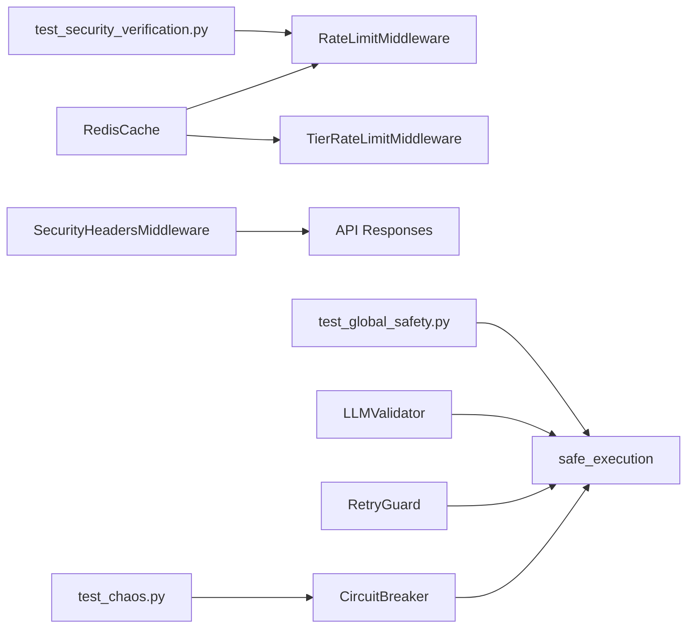

**Diagram sources**
- [rate_limit.py:24-34](file://backend/app/middleware/rate_limit.py#L24-L34)
- [tier_rate_limit.py:13-32](file://backend/app/middleware/tier_rate_limit.py#L13-L32)
- [security_headers.py:28-66](file://backend/app/middleware/security_headers.py#L28-L66)
- [safe_execution.py:9-74](file://backend/app/pipeline/safety/safe_execution.py#L9-L74)
- [circuit_breaker.py:16-21](file://backend/app/pipeline/safety/circuit_breaker.py#L16-L21)
- [retry_guard.py:10-63](file://backend/app/pipeline/safety/retry_guard.py#L10-L63)
- [llm_validator.py:11-28](file://backend/app/pipeline/safety/llm_validator.py#L11-L28)
- [test_chaos.py:1-69](file://backend/tests/safety/test_chaos.py#L1-L69)
- [test_global_safety.py:1-229](file://backend/tests/safety/test_global_safety.py#L1-L229)
- [test_security_verification.py:1-78](file://backend/tests/test_security_verification.py#L1-L78)

**Section sources**
- [rate_limit.py:1-172](file://backend/app/middleware/rate_limit.py#L1-L172)
- [tier_rate_limit.py:1-116](file://backend/app/middleware/tier_rate_limit.py#L1-L116)
- [security_headers.py:1-99](file://backend/app/middleware/security_headers.py#L1-L99)
- [safe_execution.py:1-74](file://backend/app/pipeline/safety/safe_execution.py#L1-L74)
- [circuit_breaker.py:1-164](file://backend/app/pipeline/safety/circuit_breaker.py#L1-L164)
- [retry_guard.py:1-63](file://backend/app/pipeline/safety/retry_guard.py#L1-L63)
- [llm_validator.py:1-122](file://backend/app/pipeline/safety/llm_validator.py#L1-L122)
- [test_chaos.py:1-69](file://backend/tests/safety/test_chaos.py#L1-L69)
- [test_global_safety.py:1-229](file://backend/tests/safety/test_global_safety.py#L1-L229)
- [test_security_verification.py:1-78](file://backend/tests/test_security_verification.py#L1-L78)

## Performance Considerations
- Rate limiting:
  - In-memory sliding windows are efficient for single-worker deployments; Redis enables accurate multi-worker coordination with minimal overhead.
  - Token fingerprinting for uploads ensures fair attribution without exposing secrets.
- Tier rate limiting:
  - UTC-based day keys simplify expiration; Redis TTL ensures automatic cleanup.
- Safety utilities:
  - Circuit breaker reduces cascading failures by failing fast and invoking fallbacks.
  - Retry guard mitigates transient failures with exponential backoff.
  - LLM validator gracefully degrades when Guardrails is unavailable.

[No sources needed since this section provides general guidance]

## Troubleshooting Guide
- Rate limit false positives:
  - Verify client IP resolution and authorization header parsing for upload keys.
  - Confirm Redis connectivity for distributed counters; fallback to in-memory is expected.
- Tier limit bypass:
  - Ensure JWT parsing succeeds and sub is extracted; otherwise guest counting applies.
- Security headers anomalies:
  - Docs routes have relaxed CSP; confirm route path matches expectations.
- Safety net failures:
  - Check safe_execution context usage and fallback values.
  - Validate circuit breaker thresholds and recovery timeouts.
- LLM validation errors:
  - Confirm Guardrails availability and schema compatibility; fallback to Pydantic-based validation is automatic.

**Section sources**
- [rate_limit.py:124-172](file://backend/app/middleware/rate_limit.py#L124-L172)
- [tier_rate_limit.py:57-68](file://backend/app/middleware/tier_rate_limit.py#L57-L68)
- [security_headers.py:35-66](file://backend/app/middleware/security_headers.py#L35-L66)
- [safe_execution.py:9-74](file://backend/app/pipeline/safety/safe_execution.py#L9-L74)
- [circuit_breaker.py:74-96](file://backend/app/pipeline/safety/circuit_breaker.py#L74-L96)
- [llm_validator.py:11-28](file://backend/app/pipeline/safety/llm_validator.py#L11-L28)

## Conclusion
The backend implements layered security controls:
- Middleware-based rate limiting, tier-based caps, and security headers
- RBAC enforcement for authorization
- Comprehensive safety utilities for resilience and graceful degradation
- Robust test suites validating chaos, global safety, and security verification

These controls collectively mitigate risks from abuse, misconfiguration, and adversarial inputs while maintaining system stability and observability.

[No sources needed since this section summarizes without analyzing specific files]

## Appendices

### Security Test Automation and Compliance Scanning
- CI workflow:
  - Linters and type checks
  - Unit tests excluding slow/integration suites
- Security workflow:
  - Container image build
  - Trivy vulnerability scan (critical/high severity)
  - Bandit static analysis
  - OWASP Dependency Check with CVSS threshold

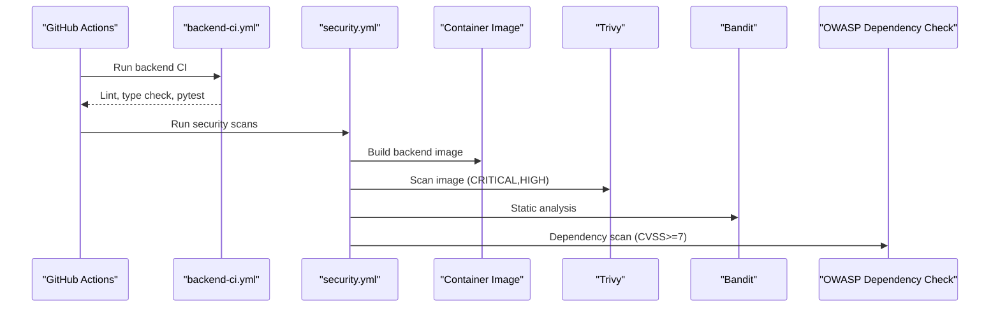

**Diagram sources**
- [backend-ci.yml:8-41](file://.github/workflows/backend-ci.yml#L8-L41)
- [security.yml:12-47](file://.github/workflows/security.yml#L12-L47)

**Section sources**
- [backend-ci.yml:1-41](file://.github/workflows/backend-ci.yml#L1-L41)
- [security.yml:1-47](file://.github/workflows/security.yml#L1-L47)

### Testing Strategies and Methodologies
- Input validation:
  - Send malformed payloads and oversized bodies; expect 422/413 responses and sanitized handling.
- Authentication bypass:
  - Attempt unauthenticated access to protected endpoints; verify RBAC guards return 403.
  - Test JWT parsing edge cases; ensure invalid tokens are rejected.
- Authorization checks:
  - Use role aliases and normalized roles; validate effective role enforcement.
- Abuse detection:
  - Flood upload endpoints to validate rate limiting and tier caps; confirm 429 responses.
- Vulnerability assessment:
  - Use Trivy, Bandit, and OWASP Dependency Check in CI to detect known vulnerabilities.
- Penetration testing:
  - Complement automated scans with manual exploratory testing of endpoints, headers, and rate limits.
- Security regression testing:
  - Include safety tests and security verification tests in CI to prevent regressions.

[No sources needed since this section provides general guidance]