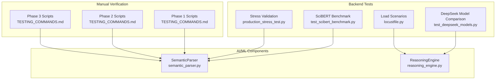
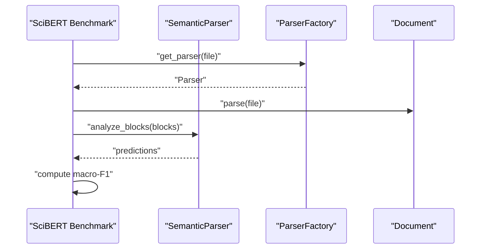
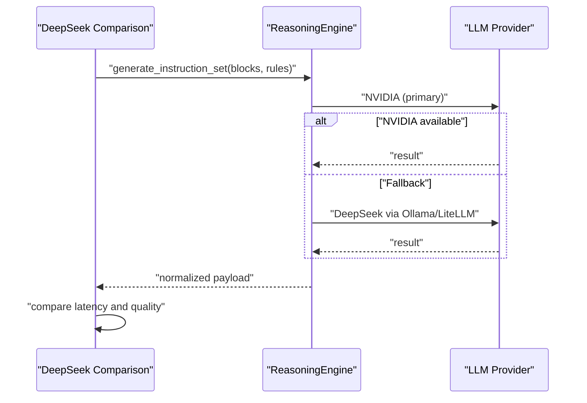
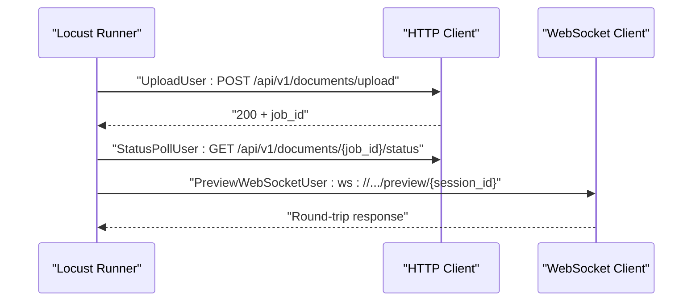
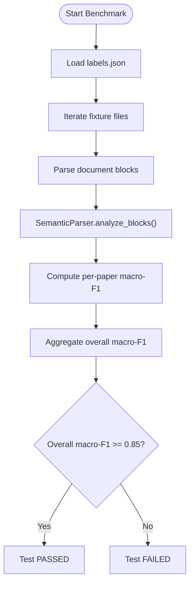
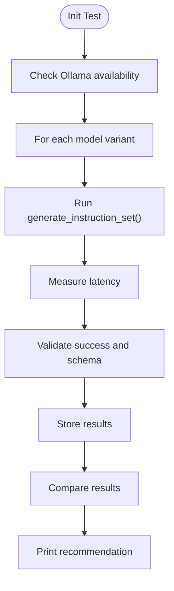
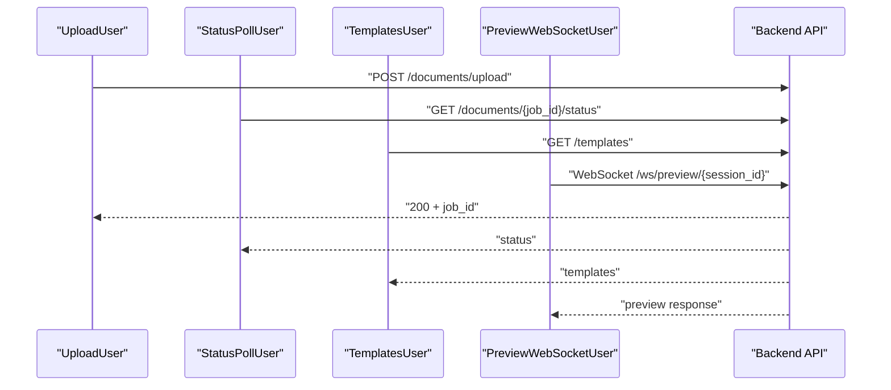
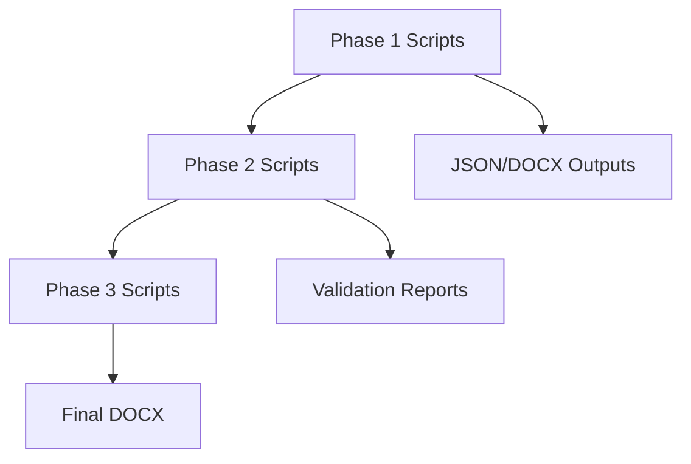
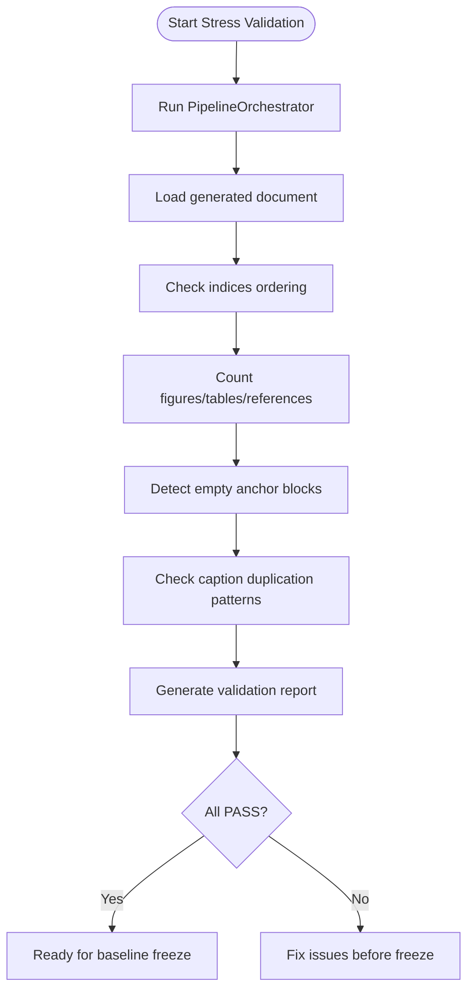
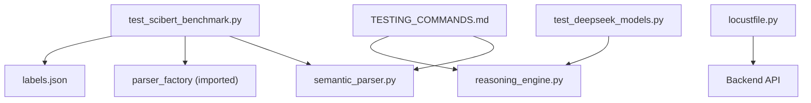

# Specialized Testing

<cite>
**Referenced Files in This Document**
- [test_scibert_benchmark.py](file://backend/tests/test_scibert_benchmark.py)
- [labels.json](file://backend/tests/fixtures/scibert/labels.json)
- [semantic_parser.py](file://backend/app/pipeline/intelligence/semantic_parser.py)
- [test_deepseek_models.py](file://backend/tests/intelligence/test_deepseek_models.py)
- [reasoning_engine.py](file://backend/app/pipeline/intelligence/reasoning_engine.py)
- [locustfile.py](file://backend/tests/load/locustfile.py)
- [TESTING_COMMANDS.md](file://backend/manual_tests/TESTING_COMMANDS.md)
- [README_1.md](file://backend/manual_tests/README_1.md)
- [README.md](file://backend/README.md)
- [Testing.md](file://docs/Testing.md)
- [production_stress_test.py](file://backend/tests/stress/production_stress_test.py)
- [README.md](file://backend/manual_tests/sample_inputs/README.md)
- [pyproject.toml](file://backend/pyproject.toml)
</cite>

## Table of Contents
1. [Introduction](#introduction)
2. [Project Structure](#project-structure)
3. [Core Components](#core-components)
4. [Architecture Overview](#architecture-overview)
5. [Detailed Component Analysis](#detailed-component-analysis)
6. [Dependency Analysis](#dependency-analysis)
7. [Performance Considerations](#performance-considerations)
8. [Troubleshooting Guide](#troubleshooting-guide)
9. [Conclusion](#conclusion)
10. [Appendices](#appendices)

## Introduction
This document provides specialized testing guidance for AI/ML model testing, performance benchmarking, and manual verification procedures within the automated academic manuscript formatting system. It covers:
- SciBERT model benchmark testing and validation
- DeepSeek model comparison and reasoning engine validation
- Load testing with Locust
- Manual verification workflows for pipeline stages
- Performance regression testing and production hardening
- Guidelines for testing AI/ML pipelines, model versioning, and performance optimization

## Project Structure
The testing ecosystem spans backend unit/integration tests, manual verification scripts, load tests, and stress validations. Key areas:
- Backend tests: SciBERT benchmark, DeepSeek model comparison, load scenarios, and stress validation
- Manual testing: End-to-end verification scripts grouped by pipeline phases
- Load testing: Locust scenarios for upload, status polling, templates, and WebSocket preview
- Stress testing: Production hardening validation using real documents

**Diagram sources**
- [test_scibert_benchmark.py:1-92](file://backend/tests/test_scibert_benchmark.py#L1-L92)
- [semantic_parser.py:1-306](file://backend/app/pipeline/intelligence/semantic_parser.py#L1-L306)
- [test_deepseek_models.py:1-171](file://backend/tests/intelligence/test_deepseek_models.py#L1-L171)
- [reasoning_engine.py:1-774](file://backend/app/pipeline/intelligence/reasoning_engine.py#L1-L774)
- [locustfile.py:1-139](file://backend/tests/load/locustfile.py#L1-L139)
- [production_stress_test.py:1-172](file://backend/tests/stress/production_stress_test.py#L1-L172)
- [TESTING_COMMANDS.md:1-285](file://backend/manual_tests/TESTING_COMMANDS.md#L1-L285)

**Section sources**
- [Testing.md:1-146](file://docs/Testing.md#L1-L146)
- [README.md:1-211](file://backend/README.md#L1-L211)

## Core Components
- SciBERT benchmark test validates macro-F1 score across multiple scientific domains using labeled fixtures and a configurable model name.
- DeepSeek model comparison evaluates two variants for latency, success rate, and output quality, with a recommendation engine.
- Locust load tests simulate realistic user behavior for upload, status polling, templates, and WebSocket preview.
- Manual verification scripts provide granular checks for parsing, classification, figures, tables, references, and final formatting.
- Production stress validation ensures structural integrity and absence of rendering artifacts on real documents.

**Section sources**
- [test_scibert_benchmark.py:1-92](file://backend/tests/test_scibert_benchmark.py#L1-L92)
- [labels.json:1-203](file://backend/tests/fixtures/scibert/labels.json#L1-L203)
- [semantic_parser.py:1-306](file://backend/app/pipeline/intelligence/semantic_parser.py#L1-L306)
- [test_deepseek_models.py:1-171](file://backend/tests/intelligence/test_deepseek_models.py#L1-L171)
- [reasoning_engine.py:1-774](file://backend/app/pipeline/intelligence/reasoning_engine.py#L1-L774)
- [locustfile.py:1-139](file://backend/tests/load/locustfile.py#L1-L139)
- [TESTING_COMMANDS.md:1-285](file://backend/manual_tests/TESTING_COMMANDS.md#L1-L285)
- [production_stress_test.py:1-172](file://backend/tests/stress/production_stress_test.py#L1-L172)

## Architecture Overview
The testing architecture integrates ML components with robust fallbacks and validation layers:
- SemanticParser loads SciBERT or heuristic classification depending on configuration and language detection.
- ReasoningEngine orchestrates NVIDIA and DeepSeek reasoning tiers with rule-based fallback and schema validation.
- Manual verification scripts and load tests exercise the pipeline under controlled conditions.
- Stress tests validate end-to-end formatting correctness on real-world documents.

**Diagram sources**
- [test_scibert_benchmark.py:49-91](file://backend/tests/test_scibert_benchmark.py#L49-L91)
- [semantic_parser.py:106-159](file://backend/app/pipeline/intelligence/semantic_parser.py#L106-L159)

**Diagram sources**
- [test_deepseek_models.py:19-136](file://backend/tests/intelligence/test_deepseek_models.py#L19-L136)
- [reasoning_engine.py:463-570](file://backend/app/pipeline/intelligence/reasoning_engine.py#L463-L570)

**Diagram sources**
- [locustfile.py:36-139](file://backend/tests/load/locustfile.py#L36-L139)

## Detailed Component Analysis

### SciBERT Benchmark Testing
- Purpose: Validate semantic classification accuracy across scientific domains using macro-F1.
- Data: Fixture-driven labels for multiple paper types.
- Behavior: Enables/disables SciBERT via settings, loads a model (or heuristic-only), and computes per-paper and overall macro-F1.
- Threshold: Enforces minimum overall macro-F1 threshold.

**Diagram sources**
- [test_scibert_benchmark.py:49-91](file://backend/tests/test_scibert_benchmark.py#L49-L91)
- [labels.json:1-203](file://backend/tests/fixtures/scibert/labels.json#L1-L203)
- [semantic_parser.py:106-159](file://backend/app/pipeline/intelligence/semantic_parser.py#L106-L159)

**Section sources**
- [test_scibert_benchmark.py:1-92](file://backend/tests/test_scibert_benchmark.py#L1-L92)
- [labels.json:1-203](file://backend/tests/fixtures/scibert/labels.json#L1-L203)
- [semantic_parser.py:1-306](file://backend/app/pipeline/intelligence/semantic_parser.py#L1-L306)

### DeepSeek Model Validation
- Purpose: Compare two DeepSeek variants for latency, success, and output quality.
- Method: Builds test blocks and rules, measures latency, validates schema presence, and prints a recommendation.
- Environment: Requires Ollama server; logs readiness and available models.

**Diagram sources**
- [test_deepseek_models.py:19-136](file://backend/tests/intelligence/test_deepseek_models.py#L19-L136)
- [reasoning_engine.py:463-570](file://backend/app/pipeline/intelligence/reasoning_engine.py#L463-L570)

**Section sources**
- [test_deepseek_models.py:1-171](file://backend/tests/intelligence/test_deepseek_models.py#L1-L171)
- [reasoning_engine.py:1-774](file://backend/app/pipeline/intelligence/reasoning_engine.py#L1-L774)

### Load Testing with Locust
- Scenarios:
  - Upload: concurrent users uploading a sample DOCX
  - Status poll: GET /status polling
  - Templates: GET /templates
  - Live preview: WebSocket round-trip
- Metrics focus: P99 ACK and RTT thresholds defined in comments.

**Diagram sources**
- [locustfile.py:36-139](file://backend/tests/load/locustfile.py#L36-L139)

**Section sources**
- [locustfile.py:1-139](file://backend/tests/load/locustfile.py#L1-L139)

### Manual Verification Procedures
- Phase 1: Identification verification (parsing, structure, classification, figures, tables, references)
- Phase 2: Assembly and deduplication (validation and full pipeline)
- Phase 3: Formatting (final DOCX generation and visual inspection)
- Scripts and commands are documented comprehensively with expected outputs and checks.

**Diagram sources**
- [TESTING_COMMANDS.md:1-285](file://backend/manual_tests/TESTING_COMMANDS.md#L1-L285)
- [README_1.md:1-211](file://backend/manual_tests/README_1.md#L1-L211)

**Section sources**
- [TESTING_COMMANDS.md:1-285](file://backend/manual_tests/TESTING_COMMANDS.md#L1-L285)
- [README_1.md:1-211](file://backend/manual_tests/README_1.md#L1-L211)

### Production Stress Validation
- Purpose: Validate professional baseline format with real documents under production-like conditions.
- Coverage: Structural integrity, media counts, warnings for empty anchors and caption duplication, and ordering checks.

**Diagram sources**
- [production_stress_test.py:19-148](file://backend/tests/stress/production_stress_test.py#L19-L148)

**Section sources**
- [production_stress_test.py:1-172](file://backend/tests/stress/production_stress_test.py#L1-L172)

## Dependency Analysis
- SciBERT benchmark depends on:
  - SemanticParser for classification
  - ParserFactory for document parsing
  - Fixture labels for ground truth
- DeepSeek comparison depends on:
  - ReasoningEngine for instruction set generation
  - Ollama/LiteLLM for model inference
- Load tests depend on:
  - Backend endpoints and WebSocket service
- Manual verification scripts depend on:
  - Pipeline modules and output directories

**Diagram sources**
- [test_scibert_benchmark.py:1-92](file://backend/tests/test_scibert_benchmark.py#L1-L92)
- [semantic_parser.py:1-306](file://backend/app/pipeline/intelligence/semantic_parser.py#L1-L306)
- [test_deepseek_models.py:1-171](file://backend/tests/intelligence/test_deepseek_models.py#L1-L171)
- [reasoning_engine.py:1-774](file://backend/app/pipeline/intelligence/reasoning_engine.py#L1-L774)
- [locustfile.py:1-139](file://backend/tests/load/locustfile.py#L1-L139)
- [TESTING_COMMANDS.md:1-285](file://backend/manual_tests/TESTING_COMMANDS.md#L1-L285)

**Section sources**
- [pyproject.toml:1-9](file://backend/pyproject.toml#L1-L9)

## Performance Considerations
- SciBERT inference:
  - Batch processing reduces overhead; heuristic fallback ensures resilience when disabled or unavailable.
  - Language detection avoids unnecessary transformer calls for non-English documents.
- ReasoningEngine:
  - Multi-tier fallback (NVIDIA primary, DeepSeek fallback, rule-based) with circuit breaker and retry guards.
  - Schema normalization and validation improve robustness.
- Locust:
  - P99 thresholds for upload ACK, status polling, templates, and WebSocket RTT define performance targets.
- Stress validation:
  - Detects structural and rendering regressions on real documents.

**Section sources**
- [semantic_parser.py:106-237](file://backend/app/pipeline/intelligence/semantic_parser.py#L106-L237)
- [reasoning_engine.py:457-570](file://backend/app/pipeline/intelligence/reasoning_engine.py#L457-L570)
- [locustfile.py:1-139](file://backend/tests/load/locustfile.py#L1-L139)
- [production_stress_test.py:1-172](file://backend/tests/stress/production_stress_test.py#L1-L172)

## Troubleshooting Guide
- SciBERT benchmark missing fixtures:
  - Skip test if labels.json is absent; ensure fixture directory contains required files.
- SciBERT model configuration:
  - Use environment variable to override model; fallback model name is supported.
- DeepSeek model comparison:
  - Verify Ollama server availability; ensure required models are pulled; review comparison summary for recommendations.
- Locust environment:
  - Ensure sample DOCX exists; handle missing file gracefully with event reporting.
- Manual verification:
  - Follow phase checkpoints; address duplicates before proceeding to formatting.
- General blockers:
  - Backend Python version and asyncio mode; frontend missing dependencies; E2E stubs require real DOM assertions.

**Section sources**
- [test_scibert_benchmark.py:33-51](file://backend/tests/test_scibert_benchmark.py#L33-L51)
- [test_deepseek_models.py:145-164](file://backend/tests/intelligence/test_deepseek_models.py#L145-L164)
- [locustfile.py:26-50](file://backend/tests/load/locustfile.py#L26-L50)
- [Testing.md:50-146](file://docs/Testing.md#L50-L146)

## Conclusion
The system employs a layered testing strategy combining ML model benchmarks, model validation, load simulation, and manual verification. By leveraging fallback mechanisms, structured phases, and production stress validation, it ensures reliability and performance across AI/ML components and backend services.

## Appendices

### Appendix A: Benchmark Datasets and Validation Metrics
- Benchmark dataset: Scientific paper samples with labeled sections per domain.
- Metrics: Macro-F1 per paper and overall macro-F1 threshold enforced in tests.

**Section sources**
- [labels.json:1-203](file://backend/tests/fixtures/scibert/labels.json#L1-L203)
- [test_scibert_benchmark.py:17-30](file://backend/tests/test_scibert_benchmark.py#L17-L30)

### Appendix B: Specialized Testing Tools
- SciBERT benchmark: PyTest with fixture-driven evaluation.
- DeepSeek comparison: PyTest runner with Ollama health checks.
- Load testing: Locust scenarios for upload, status, templates, and WebSocket preview.
- Manual verification: Phase-based scripts with JSON and DOCX outputs.
- Stress validation: Production-grade validation on real documents.

**Section sources**
- [test_scibert_benchmark.py:1-92](file://backend/tests/test_scibert_benchmark.py#L1-L92)
- [test_deepseek_models.py:1-171](file://backend/tests/intelligence/test_deepseek_models.py#L1-L171)
- [locustfile.py:1-139](file://backend/tests/load/locustfile.py#L1-L139)
- [TESTING_COMMANDS.md:1-285](file://backend/manual_tests/TESTING_COMMANDS.md#L1-L285)
- [production_stress_test.py:1-172](file://backend/tests/stress/production_stress_test.py#L1-L172)

### Appendix C: Manual Testing Procedures
- Phase 1: Input conversion, structure detection, semantic classification, figures, tables, references.
- Phase 2: Validation and full pipeline assembly.
- Phase 3: Final formatting and visual inspection.

**Section sources**
- [README_1.md:1-211](file://backend/manual_tests/README_1.md#L1-L211)
- [TESTING_COMMANDS.md:1-285](file://backend/manual_tests/TESTING_COMMANDS.md#L1-L285)

### Appendix D: Sample Inputs
- Guidance for adding DOCX test files and using existing uploads for manual testing.

**Section sources**
- [README.md:1-78](file://backend/manual_tests/sample_inputs/README.md#L1-L78)