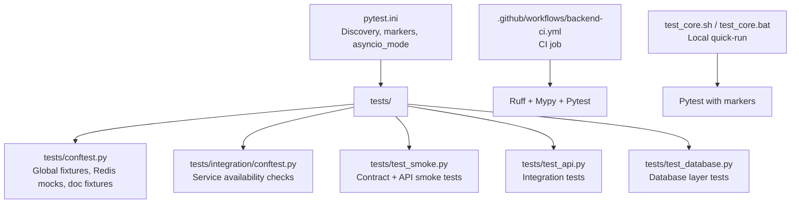
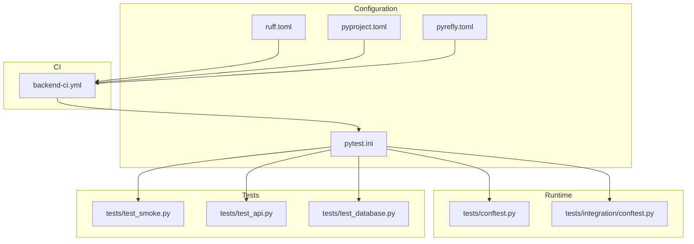
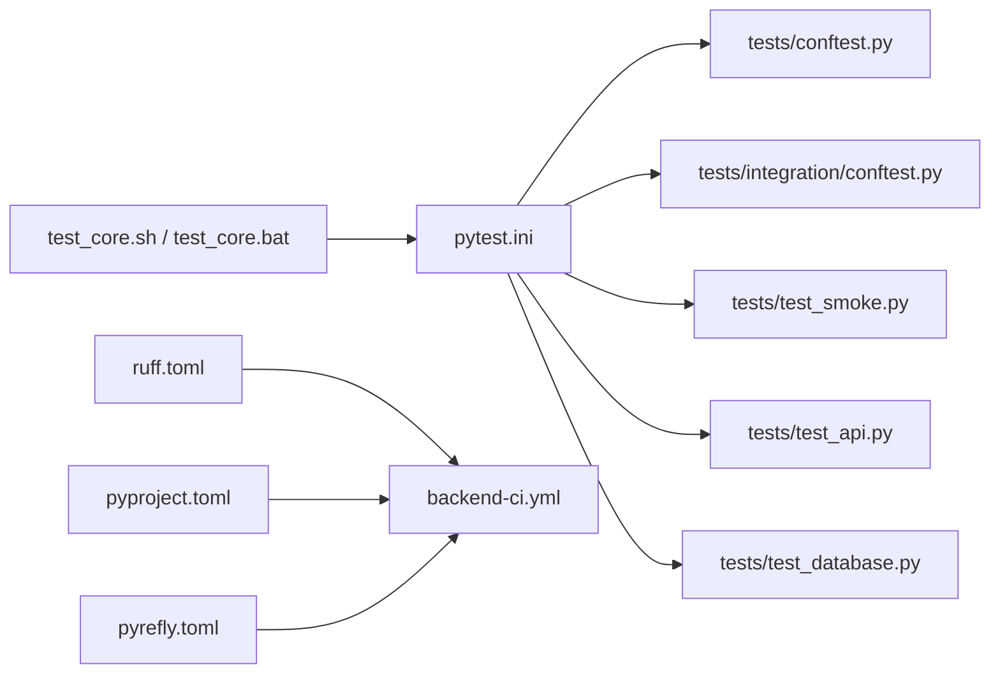

# Test Configuration & Setup

<cite>
**Referenced Files in This Document**
- [pytest.ini](file://backend/pytest.ini)
- [pyproject.toml](file://backend/pyproject.toml)
- [pyrefly.toml](file://backend/pyrefly.toml)
- [ruff.toml](file://backend/ruff.toml)
- [tests/conftest.py](file://backend/tests/conftest.py)
- [tests/integration/conftest.py](file://backend/tests/integration/conftest.py)
- [tests/test_smoke.py](file://backend/tests/test_smoke.py)
- [tests/test_api.py](file://backend/tests/test_api.py)
- [tests/test_database.py](file://backend/tests/test_database.py)
- [backend-ci.yml](file://.github/workflows/backend-ci.yml)
- [TESTING_COMMANDS.md](file://backend/manual_tests/TESTING_COMMANDS.md)
- [test_core.sh](file://backend/test_core.sh)
- [test_core.bat](file://backend/test_core.bat)
</cite>

## Table of Contents
1. [Introduction](#introduction)
2. [Project Structure](#project-structure)
3. [Core Components](#core-components)
4. [Architecture Overview](#architecture-overview)
5. [Detailed Component Analysis](#detailed-component-analysis)
6. [Dependency Analysis](#dependency-analysis)
7. [Performance Considerations](#performance-considerations)
8. [Troubleshooting Guide](#troubleshooting-guide)
9. [Conclusion](#conclusion)
10. [Appendices](#appendices)

## Introduction
This document explains the backend testing configuration and infrastructure for the project. It covers pytest setup, markers, test discovery, fixtures, CI/CD integration, and practical guidance for local development and debugging. The goal is to help contributors quickly understand how tests are organized, how to run them effectively, and how to extend or troubleshoot the testing framework.

## Project Structure
The backend testing system centers around pytest configuration, shared fixtures, and categorized test suites. Key elements:
- pytest.ini defines test discovery, asyncio mode, markers, and warning filters.
- tests/conftest.py provides global fixtures and environment-aware skipping for integration tests.
- tests/integration/conftest.py enforces availability of Docker-based services for integration tests.
- CI workflow executes linting and non-integration tests by default.
- Helper scripts and manual testing documentation support local iteration.

**Diagram sources**
- [pytest.ini:1-28](file://backend/pytest.ini#L1-L28)
- [tests/conftest.py:1-112](file://backend/tests/conftest.py#L1-L112)
- [tests/integration/conftest.py:1-41](file://backend/tests/integration/conftest.py#L1-L41)
- [tests/test_smoke.py:1-269](file://backend/tests/test_smoke.py#L1-L269)
- [tests/test_api.py:1-366](file://backend/tests/test_api.py#L1-L366)
- [tests/test_database.py:1-52](file://backend/tests/test_database.py#L1-L52)
- [backend-ci.yml:1-41](file://.github/workflows/backend-ci.yml#L1-L41)
- [test_core.sh:1-5](file://backend/test_core.sh#L1-L5)
- [test_core.bat:1-4](file://backend/test_core.bat#L1-L4)

**Section sources**
- [pytest.ini:1-28](file://backend/pytest.ini#L1-L28)
- [tests/conftest.py:1-112](file://backend/tests/conftest.py#L1-L112)
- [tests/integration/conftest.py:1-41](file://backend/tests/integration/conftest.py#L1-L41)
- [backend-ci.yml:1-41](file://.github/workflows/backend-ci.yml#L1-L41)
- [test_core.sh:1-5](file://backend/test_core.sh#L1-L5)
- [test_core.bat:1-4](file://backend/test_core.bat#L1-L4)

## Core Components
- pytest.ini
  - Test discovery: scans the tests directory while excluding manual test folders.
  - Asyncio mode: configured for async-native test execution.
  - Collection patterns: Python files, classes, and functions follow conventional naming.
  - Plugin options: disables a specific plugin during test runs.
  - Warning filters: suppresses noisy deprecation warnings from third-party libraries.
  - Markers: comprehensive taxonomy for categorizing tests (unit, integration, database, contract, pipeline, performance, slow, rag, llm, service).
- tests/conftest.py
  - Global autouse fixtures: ensures Redis-related integrations are mocked consistently.
  - Integration skipper: automatically skips integration tests when required services are unreachable.
  - Document fixtures: reusable minimal/full document models for pipeline tests.
- tests/integration/conftest.py
  - Service availability checks for Redis and GROBID.
  - Automatic marker assignment for integration tests discovered under tests/integration/.
- CI/CD
  - GitHub Actions job runs linting and non-integration tests by default.
- Local scripts
  - Cross-platform helpers to run a “trusted core” subset of tests (excluding integration and LLM-dependent tests).

**Section sources**
- [pytest.ini:1-28](file://backend/pytest.ini#L1-L28)
- [tests/conftest.py:1-112](file://backend/tests/conftest.py#L1-L112)
- [tests/integration/conftest.py:1-41](file://backend/tests/integration/conftest.py#L1-L41)
- [backend-ci.yml:1-41](file://.github/workflows/backend-ci.yml#L1-L41)
- [test_core.sh:1-5](file://backend/test_core.sh#L1-L5)
- [test_core.bat:1-4](file://backend/test_core.bat#L1-L4)

## Architecture Overview
The testing architecture separates concerns across layers:
- Discovery and filtering: pytest.ini controls discovery, warnings, and markers.
- Fixtures and isolation: tests/conftest.py centralizes shared mocks and fixtures; integration tests are isolated via service checks.
- Test suites: smoke and contract tests validate API behavior; integration tests validate end-to-end flows; database tests validate persistence layer.
- CI: automated linting and non-integration test runs ensure baseline stability.

**Diagram sources**
- [pytest.ini:1-28](file://backend/pytest.ini#L1-L28)
- [ruff.toml:1-11](file://backend/ruff.toml#L1-L11)
- [pyproject.toml:1-9](file://backend/pyproject.toml#L1-L9)
- [pyrefly.toml:1-7](file://backend/pyrefly.toml#L1-L7)
- [tests/conftest.py:1-112](file://backend/tests/conftest.py#L1-L112)
- [tests/integration/conftest.py:1-41](file://backend/tests/integration/conftest.py#L1-L41)
- [tests/test_smoke.py:1-269](file://backend/tests/test_smoke.py#L1-L269)
- [tests/test_api.py:1-366](file://backend/tests/test_api.py#L1-L366)
- [tests/test_database.py:1-52](file://backend/tests/test_database.py#L1-L52)
- [backend-ci.yml:1-41](file://.github/workflows/backend-ci.yml#L1-L41)

## Detailed Component Analysis

### pytest.ini Configuration
Key aspects:
- Test paths and exclusions: focuses discovery on tests while excluding manual and scripts directories.
- Asyncio mode: enables native async test execution.
- Collection patterns: aligns with standard pytest naming conventions.
- Plugin options: disables a telemetry-related plugin for cleaner runs.
- Warning filters: suppresses noisy deprecations from third-party packages.
- Markers: define categories for selective execution and reporting.

Practical usage tips:
- Use -m to filter by markers (e.g., unit, integration, database, contract, pipeline, performance, slow, rag, llm, service).
- Combine with -k for keyword filtering.
- Use --tb=short for concise tracebacks.

**Section sources**
- [pytest.ini:1-28](file://backend/pytest.ini#L1-L28)

### pyproject.toml and Tooling Integration
- Build system and Python version: establishes the backend’s packaging and interpreter constraints.
- Integration with pytest: while pyproject.toml does not directly configure pytest, it ensures consistent Python tooling across environments.

Related tooling:
- ruff.toml: linter configuration with per-file ignores for Alembic and tests.
- pyrefly.toml: project and interpreter configuration for local dev tooling.

**Section sources**
- [pyproject.toml:1-9](file://backend/pyproject.toml#L1-L9)
- [ruff.toml:1-11](file://backend/ruff.toml#L1-L11)
- [pyrefly.toml:1-7](file://backend/pyrefly.toml#L1-L7)

### tests/conftest.py: Global Fixtures and Environment Management
Highlights:
- Global Redis mocks: patches streaming publish, rate limiter, and cache Redis clients for all tests.
- Integration skipper: checks Redis and GROBID reachability; skips integration tests when services are down.
- Document fixtures: minimal and full document fixtures for pipeline-focused tests.

Isolation strategies:
- Autouse fixtures ensure consistent mocking across tests.
- Service checks prevent flaky integration runs when external services are unavailable.

**Section sources**
- [tests/conftest.py:1-112](file://backend/tests/conftest.py#L1-L112)

### tests/integration/conftest.py: Integration-Specific Behavior
Highlights:
- Service reachability: verifies Redis and GROBID endpoints before running integration tests.
- Automatic marker assignment: applies the integration marker to tests under tests/integration/.

**Section sources**
- [tests/integration/conftest.py:1-41](file://backend/tests/integration/conftest.py#L1-L41)

### Smoke and Contract Tests (tests/test_smoke.py)
Focus:
- Validates API surface contracts and basic flows without heavy dependencies.
- Uses TestClient and targeted patches to isolate external systems.
- Demonstrates fixture composition and endpoint assertions.

Execution guidance:
- Run with contract marker to focus on endpoint validation.
- Combine with global Redis mocks for consistent behavior.

**Section sources**
- [tests/test_smoke.py:1-269](file://backend/tests/test_smoke.py#L1-L269)

### API Integration Tests (tests/test_api.py)
Focus:
- Validates FastAPI endpoints, health checks, CORS, rate limiting behavior, and document workflows.
- Uses TestClient and extensive mocking for external services and database.

Marker usage:
- Integration marker groups these tests for selective execution.

**Section sources**
- [tests/test_api.py:1-366](file://backend/tests/test_api.py#L1-L366)

### Database Layer Tests (tests/test_database.py)
Focus:
- Validates Supabase client initialization, graceful degradation on failure, and missing credentials handling.

Marker usage:
- database marker isolates these tests when needed.

**Section sources**
- [tests/test_database.py:1-52](file://backend/tests/test_database.py#L1-L52)

### CI/CD Test Execution (.github/workflows/backend-ci.yml)
Highlights:
- Runs on all pushes.
- Sets up Python 3.12, prepares environment, installs dependencies, runs Ruff and MyPy, and executes pytest excluding integration and slow tests.

Local parity:
- Replicates CI behavior locally by running non-integration tests by default.

**Section sources**
- [backend-ci.yml:1-41](file://.github/workflows/backend-ci.yml#L1-L41)

### Local Development Scripts (test_core.sh, test_core.bat)
Purpose:
- Provide quick, repeatable runs of trusted-core tests (excludes integration and LLM-dependent tests).
- Cross-platform wrappers for convenience.

Usage:
- Activate virtual environment, then run the script to execute focused tests.

**Section sources**
- [test_core.sh:1-5](file://backend/test_core.sh#L1-L5)
- [test_core.bat:1-4](file://backend/test_core.bat#L1-L4)

## Dependency Analysis
Relationships among configuration and test components:
- pytest.ini governs discovery and markers; tests/conftest.py and tests/integration/conftest.py supply fixtures and service checks.
- CI workflow depends on pytest configuration and tooling configs (ruff, mypy) to enforce quality gates.
- Local scripts depend on pytest markers to run subsets of tests efficiently.

**Diagram sources**
- [pytest.ini:1-28](file://backend/pytest.ini#L1-L28)
- [tests/conftest.py:1-112](file://backend/tests/conftest.py#L1-L112)
- [tests/integration/conftest.py:1-41](file://backend/tests/integration/conftest.py#L1-L41)
- [tests/test_smoke.py:1-269](file://backend/tests/test_smoke.py#L1-L269)
- [tests/test_api.py:1-366](file://backend/tests/test_api.py#L1-L366)
- [tests/test_database.py:1-52](file://backend/tests/test_database.py#L1-L52)
- [ruff.toml:1-11](file://backend/ruff.toml#L1-L11)
- [pyproject.toml:1-9](file://backend/pyproject.toml#L1-L9)
- [pyrefly.toml:1-7](file://backend/pyrefly.toml#L1-L7)
- [backend-ci.yml:1-41](file://.github/workflows/backend-ci.yml#L1-L41)
- [test_core.sh:1-5](file://backend/test_core.sh#L1-L5)
- [test_core.bat:1-4](file://backend/test_core.bat#L1-L4)

**Section sources**
- [pytest.ini:1-28](file://backend/pytest.ini#L1-L28)
- [tests/conftest.py:1-112](file://backend/tests/conftest.py#L1-L112)
- [tests/integration/conftest.py:1-41](file://backend/tests/integration/conftest.py#L1-L41)
- [tests/test_smoke.py:1-269](file://backend/tests/test_smoke.py#L1-L269)
- [tests/test_api.py:1-366](file://backend/tests/test_api.py#L1-L366)
- [tests/test_database.py:1-52](file://backend/tests/test_database.py#L1-L52)
- [ruff.toml:1-11](file://backend/ruff.toml#L1-L11)
- [pyproject.toml:1-9](file://backend/pyproject.toml#L1-L9)
- [pyrefly.toml:1-7](file://backend/pyrefly.toml#L1-L7)
- [backend-ci.yml:1-41](file://.github/workflows/backend-ci.yml#L1-L41)
- [test_core.sh:1-5](file://backend/test_core.sh#L1-L5)
- [test_core.bat:1-4](file://backend/test_core.bat#L1-L4)

## Performance Considerations
- Use markers to exclude slow or heavy tests during local iteration (e.g., integration, slow, llm).
- Prefer unit and contract tests for frequent feedback loops.
- Keep fixtures minimal and reuse shared mocks to reduce overhead.
- In CI, avoid running heavy suites; rely on dedicated jobs or manual triggers for full suites.

[No sources needed since this section provides general guidance]

## Troubleshooting Guide
Common scenarios and remedies:
- Integration tests skipped unexpectedly
  - Cause: Required services (Redis, GROBID) unreachable.
  - Action: Start Docker services or adjust host/port environment variables; rerun with explicit markers.
  - Evidence: Integration skipper and service checks in fixtures.
- Noisy deprecation warnings
  - Cause: Third-party library deprecations.
  - Action: Warnings are filtered by pytest.ini; confirm filters remain effective.
- Lint or type errors blocking CI
  - Cause: Ruff or MyPy failures.
  - Action: Run locally with the same toolchain as CI; address reported issues.
- Local vs. CI differences
  - Cause: Different environment variables or installed dependencies.
  - Action: Mirror CI steps locally (setup Python, install dependencies, copy environment file).

**Section sources**
- [tests/conftest.py:29-44](file://backend/tests/conftest.py#L29-L44)
- [tests/integration/conftest.py:9-32](file://backend/tests/integration/conftest.py#L9-L32)
- [pytest.ini:9-16](file://backend/pytest.ini#L9-L16)
- [backend-ci.yml:23-40](file://.github/workflows/backend-ci.yml#L23-L40)

## Conclusion
The backend testing setup leverages pytest’s powerful configuration and fixtures to deliver reliable, isolated, and maintainable tests. With comprehensive markers, global mocks, and CI parity, contributors can confidently develop and validate features. Use the provided scripts and CI guidance to streamline local development and ensure consistent quality.

[No sources needed since this section summarizes without analyzing specific files]

## Appendices

### Test Discovery and Marker-Based Categorization
- Discovery patterns: test_*.py, Test* classes, test_* functions.
- Markers: unit, integration, database, contract, pipeline, performance, slow, rag, llm, service.
- Execution examples:
  - Run only unit tests: pytest -m unit
  - Skip integration and slow tests: pytest -m "not integration and not slow"

**Section sources**
- [pytest.ini:2-8](file://backend/pytest.ini#L2-L8)
- [pytest.ini:16-27](file://backend/pytest.ini#L16-L27)

### Local Development Setup
- Install dependencies and prepare environment as in CI.
- Use trusted-core scripts for quick feedback loops.
- For manual verification of end-to-end flows, consult manual testing commands.

**Section sources**
- [backend-ci.yml:23-40](file://.github/workflows/backend-ci.yml#L23-L40)
- [test_core.sh:1-5](file://backend/test_core.sh#L1-L5)
- [test_core.bat:1-4](file://backend/test_core.bat#L1-L4)
- [TESTING_COMMANDS.md:1-285](file://backend/manual_tests/TESTING_COMMANDS.md#L1-L285)