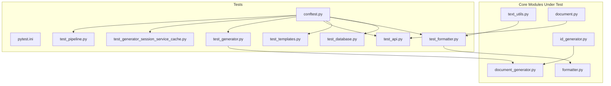
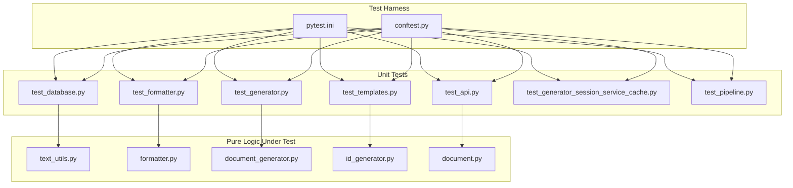
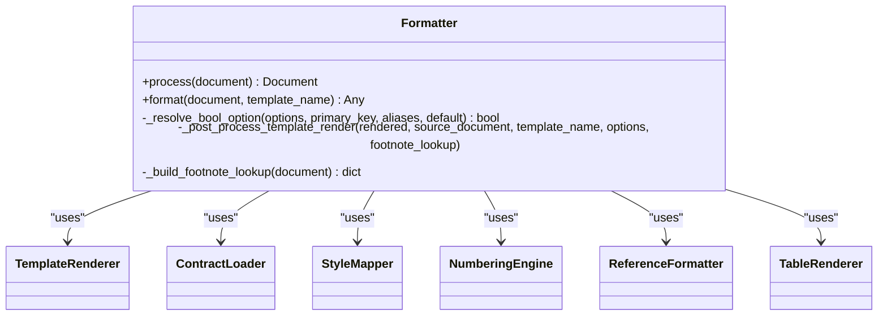
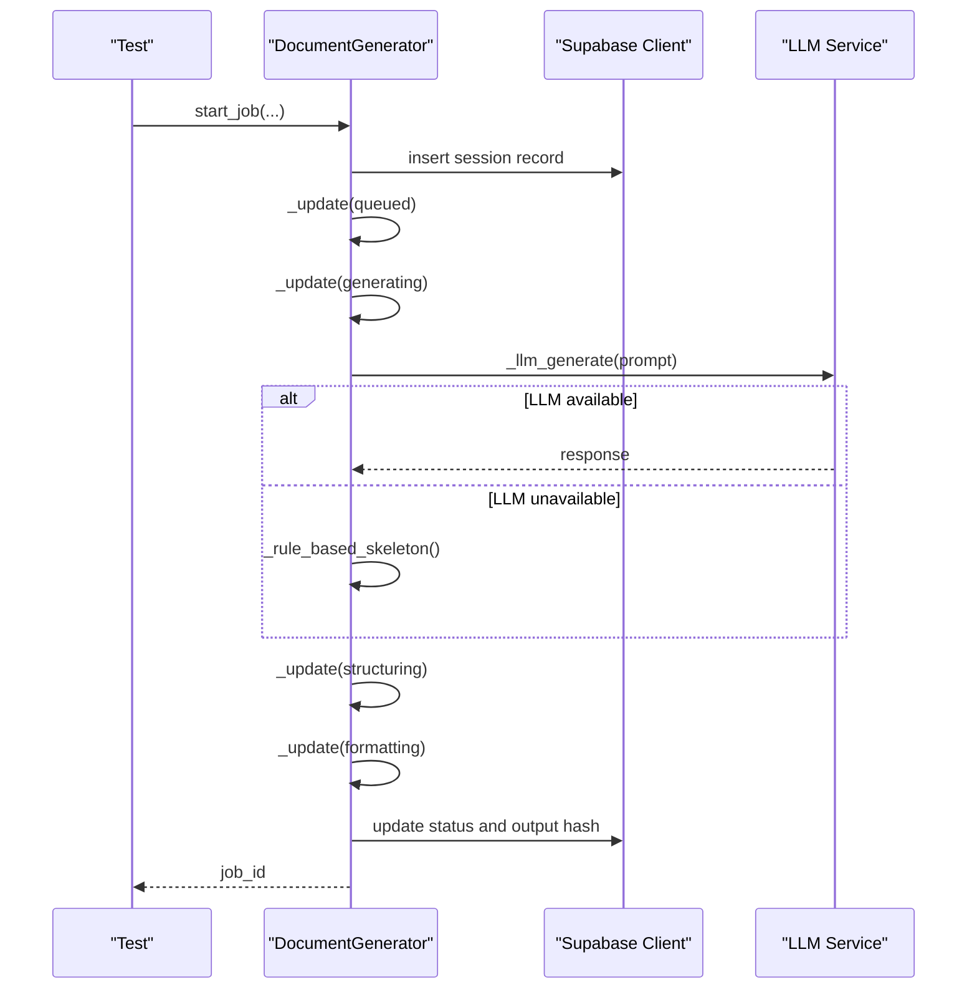
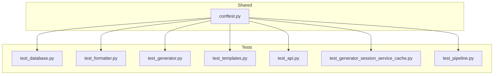

# Unit Testing

<cite>
**Referenced Files in This Document**
- [conftest.py](file://backend/tests/conftest.py)
- [pytest.ini](file://backend/pytest.ini)
- [test_database.py](file://backend/tests/test_database.py)
- [test_formatter.py](file://backend/tests/test_formatter.py)
- [test_templates.py](file://backend/tests/test_templates.py)
- [test_api.py](file://backend/tests/test_api.py)
- [test_generator.py](file://backend/tests/test_generator.py)
- [test_generator_session_service_cache.py](file://backend/tests/test_generator_session_service_cache.py)
- [test_pipeline.py](file://backend/tests/test_pipeline.py)
- [text_utils.py](file://backend/app/utils/text_utils.py)
- [formatter.py](file://backend/app/pipeline/formatting/formatter.py)
- [document_generator.py](file://backend/app/pipeline/generation/document_generator.py)
- [id_generator.py](file://backend/app/utils/id_generator.py)
- [document.py](file://backend/app/schemas/document.py)
</cite>

## Table of Contents
1. [Introduction](#introduction)
2. [Project Structure](#project-structure)
3. [Core Components](#core-components)
4. [Architecture Overview](#architecture-overview)
5. [Detailed Component Analysis](#detailed-component-analysis)
6. [Dependency Analysis](#dependency-analysis)
7. [Performance Considerations](#performance-considerations)
8. [Troubleshooting Guide](#troubleshooting-guide)
9. [Conclusion](#conclusion)
10. [Appendices](#appendices)

## Introduction
This document provides comprehensive unit testing guidance for backend pure logic components in the ScholarForm AI project. It focuses on testing strategies for functions, classes, and modules without external dependencies, including mocking approaches for databases, external APIs, and file systems. It also covers test case design patterns, assertion strategies, edge case coverage, naming conventions, parameterized testing, and test data management. Examples are drawn from existing tests and core modules to illustrate effective practices and common pitfalls to avoid.

## Project Structure
The backend test suite is organized under backend/tests with a central conftest.py for shared fixtures and pytest.ini for configuration. Tests are grouped by functional areas such as database layer, formatting pipeline, API endpoints, generators, and caching behavior. The tests demonstrate extensive use of pytest fixtures, monkeypatching, and mocking to isolate pure logic components.

**Diagram sources**
- [conftest.py:1-112](file://backend/tests/conftest.py#L1-112)
- [pytest.ini:1-28](file://backend/pytest.ini#L1-28)
- [test_database.py:1-52](file://backend/tests/test_database.py#L1-52)
- [test_formatter.py:1-221](file://backend/tests/test_formatter.py#L1-221)
- [test_templates.py:1-145](file://backend/tests/test_templates.py#L1-145)
- [test_api.py:1-366](file://backend/tests/test_api.py#L1-366)
- [test_generator.py:1-195](file://backend/tests/test_generator.py#L1-195)
- [test_generator_session_service_cache.py:1-89](file://backend/tests/test_generator_session_service_cache.py#L1-89)
- [test_pipeline.py:1-65](file://backend/tests/test_pipeline.py#L1-65)
- [text_utils.py:1-269](file://backend/app/utils/text_utils.py#L1-269)
- [formatter.py:1-800](file://backend/app/pipeline/formatting/formatter.py#L1-800)
- [document_generator.py:1-607](file://backend/app/pipeline/generation/document_generator.py#L1-607)
- [id_generator.py:1-86](file://backend/app/utils/id_generator.py#L1-86)
- [document.py:1-266](file://backend/app/schemas/document.py#L1-266)

**Section sources**
- [conftest.py:1-112](file://backend/tests/conftest.py#L1-112)
- [pytest.ini:1-28](file://backend/pytest.ini#L1-28)

## Core Components
This section outlines the pure logic components most commonly tested in isolation and how they are exercised in unit tests.

- Text normalization utilities: Pure functions for Unicode normalization, whitespace normalization, list marker normalization, and metadata cleaning. They are tested for deterministic transformations and edge cases (empty inputs, control characters).
- Formatting pipeline: The Formatter class applies structure and styles to produce a Word document. Tests validate behavior around template rendering modes, legacy fallbacks, page options, and content insertion ordering.
- Generation orchestration: DocumentGenerator coordinates generation from scratch, including session management, status updates, and fallback logic when LLMs are unavailable.
- ID generation utilities: Deterministic ID generators for blocks, figures, tables, references, and documents.
- Pydantic schemas: Validation and normalization logic for request/response models, including template normalization and field constraints.

Key testing patterns demonstrated:
- Fixtures for reusable test data (e.g., PipelineDocument instances).
- Mocking external dependencies (HTTP clients, Redis, Supabase) to keep tests fast and deterministic.
- Parameterized assertions and edge-case coverage (e.g., invalid inputs, missing fields).
- Async-aware tests for async components.

**Section sources**
- [text_utils.py:1-269](file://backend/app/utils/text_utils.py#L1-269)
- [formatter.py:1-800](file://backend/app/pipeline/formatting/formatter.py#L1-800)
- [document_generator.py:1-607](file://backend/app/pipeline/generation/document_generator.py#L1-607)
- [id_generator.py:1-86](file://backend/app/utils/id_generator.py#L1-86)
- [document.py:1-266](file://backend/app/schemas/document.py#L1-266)

## Architecture Overview
The testing architecture emphasizes isolation and determinism. Shared fixtures initialize common test data and mocks, while individual test modules focus on pure logic. External dependencies are mocked via unittest.mock.patch and pytest fixtures.

**Diagram sources**
- [pytest.ini:1-28](file://backend/pytest.ini#L1-28)
- [conftest.py:1-112](file://backend/tests/conftest.py#L1-112)
- [test_database.py:1-52](file://backend/tests/test_database.py#L1-52)
- [test_formatter.py:1-221](file://backend/tests/test_formatter.py#L1-221)
- [test_generator.py:1-195](file://backend/tests/test_generator.py#L1-195)
- [test_templates.py:1-145](file://backend/tests/test_templates.py#L1-145)
- [test_api.py:1-366](file://backend/tests/test_api.py#L1-366)
- [test_generator_session_service_cache.py:1-89](file://backend/tests/test_generator_session_service_cache.py#L1-89)
- [test_pipeline.py:1-65](file://backend/tests/test_pipeline.py#L1-65)
- [text_utils.py:1-269](file://backend/app/utils/text_utils.py#L1-269)
- [formatter.py:1-800](file://backend/app/pipeline/formatting/formatter.py#L1-800)
- [document_generator.py:1-607](file://backend/app/pipeline/generation/document_generator.py#L1-607)
- [id_generator.py:1-86](file://backend/app/utils/id_generator.py#L1-86)
- [document.py:1-266](file://backend/app/schemas/document.py#L1-266)

## Detailed Component Analysis

### Text Normalization Utilities
Testing strategy:
- Validate deterministic transformations for Unicode, whitespace, and list markers.
- Assert behavior on empty inputs, control characters, and malformed data.
- Verify normalization of metadata fields and table cell text.

Mocking and fixtures:
- No external dependencies; tests are fully isolated.

Assertion strategies:
- Equality checks for transformed strings.
- Regular expression checks for pattern matching.
- Edge-case checks for None and empty strings.

Examples from repository:
- Unicode normalization and whitespace normalization tests validate expected transformations and trimming behavior.

**Section sources**
- [text_utils.py:80-269](file://backend/app/utils/text_utils.py#L80-269)
- [test_formatter.py:164-221](file://backend/tests/test_formatter.py#L164-221)

### Formatter
Testing strategy:
- Exercise both template-based and legacy rendering paths.
- Validate option resolution (page numbers, borders, line numbers, TOC, cover page).
- Verify content insertion order and section handling.
- Validate output characteristics (DOCX validity, ZIP archive, hyperlinks, footnotes).

Mocking and fixtures:
- Patch template rendering and external resources to avoid filesystem dependencies.
- Use minimal PipelineDocument fixtures to drive behavior deterministically.

Assertion strategies:
- Generated document existence and type checks.
- ZIP file validation and XML content inspection for Word-specific constructs.
- Footnote and hyperlink presence checks.

**Diagram sources**
- [formatter.py:35-800](file://backend/app/pipeline/formatting/formatter.py#L35-800)

**Section sources**
- [formatter.py:49-290](file://backend/app/pipeline/formatting/formatter.py#L49-290)
- [test_formatter.py:41-221](file://backend/tests/test_formatter.py#L41-221)

### DocumentGenerator
Testing strategy:
- Validate job lifecycle: start, status retrieval, completion, and error handling.
- Test fallback logic when LLMs are unavailable.
- Validate session persistence and in-memory fallback behavior.
- Validate outline extraction and status normalization.

Mocking and fixtures:
- Mock Supabase client and LLM services to simulate availability and failures.
- Use monkeypatch to control TTLs for caching behavior.

Assertion strategies:
- UUID generation and status transitions.
- Error propagation and message preservation.
- Cache invalidation and TTL expiry.

**Diagram sources**
- [document_generator.py:187-480](file://backend/app/pipeline/generation/document_generator.py#L187-480)
- [test_generator.py:124-195](file://backend/tests/test_generator.py#L124-195)

**Section sources**
- [document_generator.py:122-480](file://backend/app/pipeline/generation/document_generator.py#L122-480)
- [test_generator.py:14-195](file://backend/tests/test_generator.py#L14-195)

### ID Generators
Testing strategy:
- Validate deterministic ID formats and prefixes.
- Ensure zero-padded sequential numbering.
- Timestamp-based document ID uniqueness.

Mocking and fixtures:
- No external dependencies; tests are fully isolated.

Assertion strategies:
- Pattern matching for ID formats.
- Length and prefix checks.

**Section sources**
- [id_generator.py:8-86](file://backend/app/utils/id_generator.py#L8-86)
- [test_generator.py:124-195](file://backend/tests/test_generator.py#L124-195)

### Pydantic Schemas
Testing strategy:
- Validate field normalization (e.g., template normalization).
- Validate constraints and defaults.
- Validate alias fields and backward compatibility.

Mocking and fixtures:
- No external dependencies; tests are fully isolated.

Assertion strategies:
- Equality checks for normalized values.
- Type and constraint validations.

**Section sources**
- [document.py:107-130](file://backend/app/schemas/document.py#L107-130)
- [document.py:244-266](file://backend/app/schemas/document.py#L244-266)

### Database Layer
Testing strategy:
- Validate client initialization and graceful degradation on failures.
- Validate behavior with missing credentials.

Mocking and fixtures:
- Patch client creation and settings to simulate environment conditions.

Assertion strategies:
- Return value checks and exception handling validations.

**Section sources**
- [test_database.py:9-52](file://backend/tests/test_database.py#L9-52)

### API Route Handlers (FastAPI)
Testing strategy:
- Validate endpoint behavior with mocked dependencies.
- Test authentication bypass and dependency overrides.
- Validate request validation and response shapes.

Mocking and fixtures:
- Use TestClient and dependency_overrides to inject authenticated users.
- Patch external services (health checks, model store, exporters).

Assertion strategies:
- Status code checks and JSON payload validations.
- CORS and rate-limiting behavior.

**Section sources**
- [test_api.py:14-366](file://backend/tests/test_api.py#L14-366)
- [test_templates.py:12-145](file://backend/tests/test_templates.py#L12-145)

### Pipeline Integration
Testing strategy:
- Validate orchestrator initialization and contract loading.
- Validate error handling and graceful degradation.

Mocking and fixtures:
- Patch reasoning and RAG engines to simulate failures.

Assertion strategies:
- Object instantiation and contract presence checks.

**Section sources**
- [test_pipeline.py:9-65](file://backend/tests/test_pipeline.py#L9-65)

### Generator Session Service Cache
Testing strategy:
- Validate cache TTL behavior and cache invalidation.
- Validate cache hits and misses.

Mocking and fixtures:
- Build table mocks to simulate Supabase responses.
- Use monkeypatch to control TTL values.

Assertion strategies:
- Call counts and equality checks across cache operations.

**Section sources**
- [test_generator_session_service_cache.py:12-89](file://backend/tests/test_generator_session_service_cache.py#L12-89)

## Dependency Analysis
This section analyzes how tests depend on each other and on shared fixtures.

**Diagram sources**
- [conftest.py:1-112](file://backend/tests/conftest.py#L1-112)
- [test_database.py:1-52](file://backend/tests/test_database.py#L1-52)
- [test_formatter.py:1-221](file://backend/tests/test_formatter.py#L1-221)
- [test_generator.py:1-195](file://backend/tests/test_generator.py#L1-195)
- [test_templates.py:1-145](file://backend/tests/test_templates.py#L1-145)
- [test_api.py:1-366](file://backend/tests/test_api.py#L1-366)
- [test_generator_session_service_cache.py:1-89](file://backend/tests/test_generator_session_service_cache.py#L1-89)
- [test_pipeline.py:1-65](file://backend/tests/test_pipeline.py#L1-65)

Observations:
- conftest.py centralizes shared fixtures and global mocks (e.g., Redis, rate limiter, cache).
- Tests are largely independent and rely on targeted patches to isolate logic.
- Some tests depend on common models/fixtures (e.g., PipelineDocument) defined in conftest.py.

**Section sources**
- [conftest.py:46-112](file://backend/tests/conftest.py#L46-112)

## Performance Considerations
- Prefer unit tests over integration tests for pure logic to reduce runtime.
- Use monkeypatch to control timing-sensitive behavior (e.g., cache TTLs).
- Avoid filesystem writes in unit tests; use in-memory buffers or temporary paths sparingly.
- Keep mocks minimal and focused to prevent brittle tests.

## Troubleshooting Guide
Common issues and resolutions:
- Missing credentials or client initialization failures: Validate graceful degradation and None returns.
- Template rendering failures: Ensure fallback to legacy rendering path is exercised.
- Async test failures: Use pytest.mark.asyncio and proper event loop handling.
- Mock side effects: Ensure mocks restore state after tests (patches are automatically restored by pytest).

**Section sources**
- [test_database.py:25-48](file://backend/tests/test_database.py#L25-48)
- [test_formatter.py:112-139](file://backend/tests/test_formatter.py#L112-139)
- [test_api.py:131-130](file://backend/tests/test_api.py#L131-130)

## Conclusion
The backend test suite demonstrates strong practices for unit testing pure logic components: comprehensive mocking, deterministic fixtures, and targeted assertions. By following the patterns outlined—fixtures, parameterized tests, edge-case coverage, and careful mocking—you can maintain fast, reliable unit tests that validate core logic without external dependencies.

## Appendices

### Test Naming Conventions
- Use descriptive names that explain the scenario and expected outcome.
- Prefix test functions with test_ and group related tests in classes named Test*.
- Mark tests with pytest markers (unit, integration, database, pipeline, etc.) to enable selective runs.

**Section sources**
- [pytest.ini:5-28](file://backend/pytest.ini#L5-28)

### Parameterized Testing
- Use pytest.mark.parametrize for multiple input sets.
- Prefer fixtures for complex data generation to keep tests readable.

### Test Data Management
- Centralize reusable fixtures in conftest.py.
- Use factories or builders for complex objects (e.g., PipelineDocument) to reduce duplication.

### Effective Unit Test Examples
- Database client initialization and failure handling.
- Formatter behavior across template and legacy modes.
- Generator lifecycle and fallback logic.
- Cache TTL and invalidation behavior.

**Section sources**
- [test_database.py:12-48](file://backend/tests/test_database.py#L12-48)
- [test_formatter.py:41-221](file://backend/tests/test_formatter.py#L41-221)
- [test_generator.py:124-195](file://backend/tests/test_generator.py#L124-195)
- [test_generator_session_service_cache.py:25-89](file://backend/tests/test_generator_session_service_cache.py#L25-89)