# Frontend Testing

<cite>
**Referenced Files in This Document**
- [vitest.config.js](file://frontend/vitest.config.js)
- [playwright.config.js](file://frontend/playwright.config.js)
- [package.json](file://frontend/package.json)
- [setup.js](file://frontend/src/test/setup.js)
- [AppShell.auth-redirect.test.jsx](file://frontend/src/test/AppShell.auth-redirect.test.jsx)
- [AuthGuard.test.jsx](file://frontend/src/test/AuthGuard.test.jsx)
- [useGeneratorState.test.js](file://frontend/src/test/useGeneratorState.test.js)
- [analytics.test.js](file://frontend/src/lib/analytics.test.js)
- [api.core.test.js](file://frontend/src/services/api.core.test.js)
- [useAgent.js](file://frontend/src/hooks/useAgent.js)
- [useUpload.js](file://frontend/src/hooks/useUpload.js)
</cite>

## Table of Contents
1. [Introduction](#introduction)
2. [Project Structure](#project-structure)
3. [Core Components](#core-components)
4. [Architecture Overview](#architecture-overview)
5. [Detailed Component Analysis](#detailed-component-analysis)
6. [Dependency Analysis](#dependency-analysis)
7. [Performance Considerations](#performance-considerations)
8. [Troubleshooting Guide](#troubleshooting-guide)
9. [Conclusion](#conclusion)

## Introduction
This document provides comprehensive frontend testing guidance for the project’s Vitest unit/component tests and Playwright end-to-end (E2E) tests. It explains the current testing setup, highlights the existing test coverage, and outlines best practices for writing effective tests across React components, hooks, services, and browser-based E2E scenarios. The repository currently includes 93 test files, the majority of which are placeholders requiring real DOM assertions and assertions against rendered UI.

## Project Structure
The frontend testing stack is organized around:
- Vitest for unit and component isolation tests with JSDOM environment and React Testing Library integrations
- Playwright for browser-based E2E tests targeting the Next.js application
- A shared test setup that registers @testing-library/jest-dom matchers for Vitest
- Mock strategies for Next.js routing APIs and internal contexts/hooks

Key configuration and test locations:
- Vitest configuration: frontend/vitest.config.js
- Playwright configuration: frontend/playwright.config.js
- Test setup: frontend/src/test/setup.js
- Example component tests: frontend/src/test/*.test.*
- Example hook/service tests: frontend/src/test/*test.js and frontend/src/hooks/*.js
- E2E tests: frontend/e2e/*.spec.js

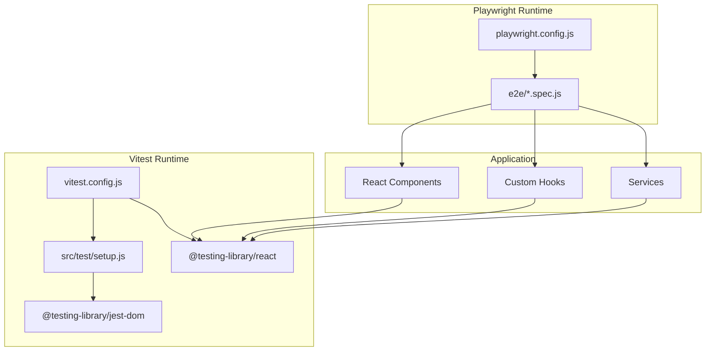

**Diagram sources**
- [vitest.config.js:1-34](file://frontend/vitest.config.js#L1-L34)
- [playwright.config.js:1-48](file://frontend/playwright.config.js#L1-L48)
- [setup.js:1-2](file://frontend/src/test/setup.js#L1-L2)

**Section sources**
- [vitest.config.js:1-34](file://frontend/vitest.config.js#L1-L34)
- [playwright.config.js:1-48](file://frontend/playwright.config.js#L1-L48)
- [package.json:1-62](file://frontend/package.json#L1-L62)

## Core Components
- Vitest configuration defines aliases for application modules, JSX automatic runtime, global test environment (JSDOM), and inclusion/exclusion patterns for test discovery. It also sets up a shared setup file to register DOM matchers.
- Playwright configuration defines test directory, worker and retry policies, browser device projects, and a local dev server lifecycle for E2E runs.
- Test setup registers @testing-library/jest-dom matchers globally for Vitest, enabling readable assertions in component tests.
- Example tests demonstrate:
  - Component-level tests for AppShell and AuthGuard redirection logic
  - Hook-level tests for useGeneratorState with mocked services and timers
  - Service-level tests for API utilities including retry logic and sanitization
  - Analytics wrapper tests validating PostHog initialization and event capture

**Section sources**
- [vitest.config.js:1-34](file://frontend/vitest.config.js#L1-L34)
- [playwright.config.js:1-48](file://frontend/playwright.config.js#L1-L48)
- [setup.js:1-2](file://frontend/src/test/setup.js#L1-L2)
- [AppShell.auth-redirect.test.jsx:1-88](file://frontend/src/test/AppShell.auth-redirect.test.jsx#L1-L88)
- [AuthGuard.test.jsx:1-75](file://frontend/src/test/AuthGuard.test.jsx#L1-L75)
- [useGeneratorState.test.js:1-202](file://frontend/src/test/useGeneratorState.test.js#L1-L202)
- [analytics.test.js:1-56](file://frontend/src/lib/analytics.test.js#L1-L56)
- [api.core.test.js:1-79](file://frontend/src/services/api.core.test.js#L1-L79)

## Architecture Overview
The testing architecture separates concerns:
- Unit/component tests isolate UI logic and hooks using JSDOM and React Testing Library
- E2E tests run against a real browser via Playwright, validating user flows and integrations

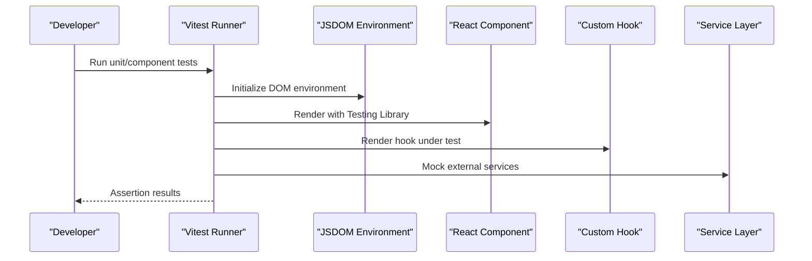

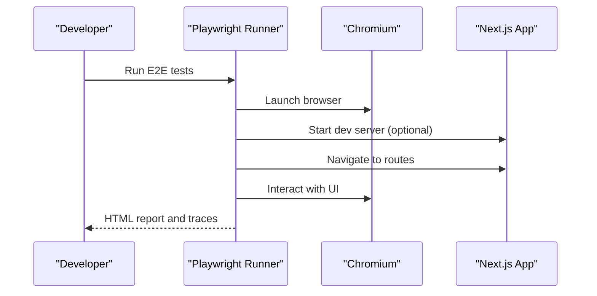

**Diagram sources**
- [vitest.config.js:16-26](file://frontend/vitest.config.js#L16-L26)
- [playwright.config.js:39-46](file://frontend/playwright.config.js#L39-L46)

## Detailed Component Analysis

### Vitest Configuration and Setup
- Aliases enable importing application modules and React Testing Library packages directly
- JSDOM environment simulates browser APIs for component rendering and DOM queries
- Global setup registers jest-dom matchers for intuitive assertions
- Test include pattern targets src/**/*.{test,spec}.{js,jsx,ts,tsx}, excluding legacy archives

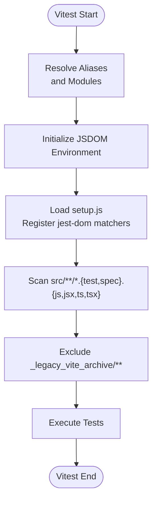

**Diagram sources**
- [vitest.config.js:4-26](file://frontend/vitest.config.js#L4-L26)
- [setup.js:1-2](file://frontend/src/test/setup.js#L1-L2)

**Section sources**
- [vitest.config.js:1-34](file://frontend/vitest.config.js#L1-L34)
- [setup.js:1-2](file://frontend/src/test/setup.js#L1-L2)

### Playwright Configuration and E2E Execution
- Projects define Chromium device configuration
- Workers and retries are tuned for CI stability
- Web server lifecycle starts the Next.js app locally during E2E runs
- Trace collection on first retry aids failure investigation

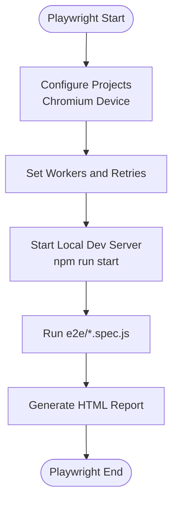

**Diagram sources**
- [playwright.config.js:9-47](file://frontend/playwright.config.js#L9-L47)

**Section sources**
- [playwright.config.js:1-48](file://frontend/playwright.config.js#L1-L48)

### Component Tests: AppShell Authentication Redirect
- Demonstrates mocking Next.js navigation APIs and internal contexts
- Verifies redirect behavior for authenticated users and guest mode overrides
- Uses Testing Library’s render and waitFor for asynchronous navigation

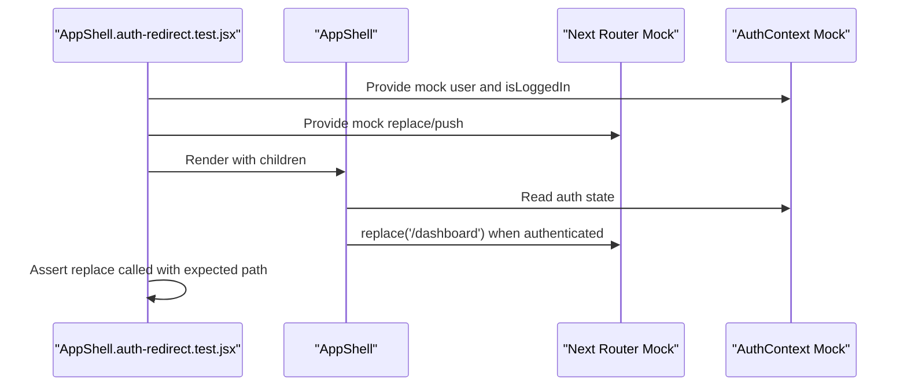

**Diagram sources**
- [AppShell.auth-redirect.test.jsx:48-66](file://frontend/src/test/AppShell.auth-redirect.test.jsx#L48-L66)

**Section sources**
- [AppShell.auth-redirect.test.jsx:1-88](file://frontend/src/test/AppShell.auth-redirect.test.jsx#L1-L88)

### Component Tests: AuthGuard Protection
- Validates redirect to login for unauthenticated users
- Ensures children render when authenticated
- Enforces admin-only route protection and redirects non-admin users appropriately

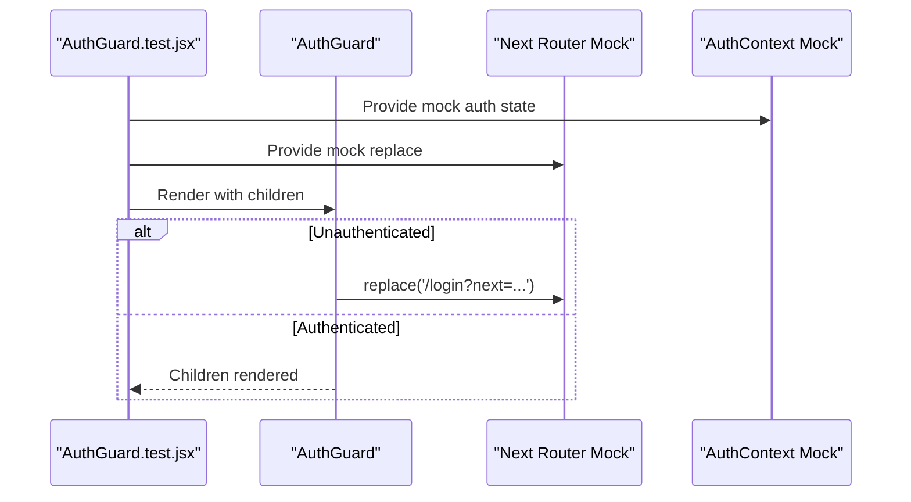

**Diagram sources**
- [AuthGuard.test.jsx:28-41](file://frontend/src/test/AuthGuard.test.jsx#L28-L41)

**Section sources**
- [AuthGuard.test.jsx:1-75](file://frontend/src/test/AuthGuard.test.jsx#L1-L75)

### Hook Tests: useGeneratorState
- Comprehensive tests for step navigation, template filtering, generation streaming, and download flow
- Uses hoisted mocks for services and contexts, fake timers for async flows, and DOM spies for anchor clicks
- Exercises stream event handling, state transitions, and cleanup routines

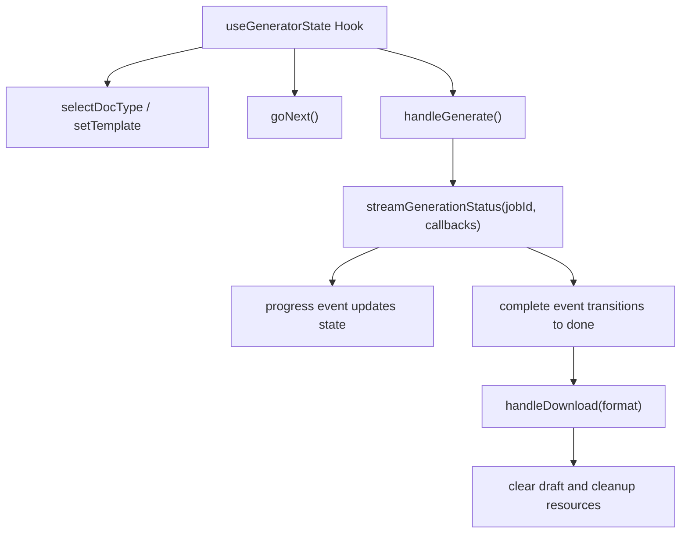

**Diagram sources**
- [useGeneratorState.test.js:64-133](file://frontend/src/test/useGeneratorState.test.js#L64-L133)

**Section sources**
- [useGeneratorState.test.js:1-202](file://frontend/src/test/useGeneratorState.test.js#L1-L202)

### Service Tests: API Utilities
- Sanitizes payloads while preserving sensitive values
- Implements retry logic for transient GET failures with fake timers
- Prevents retries for non-idempotent requests and provides friendly error messages

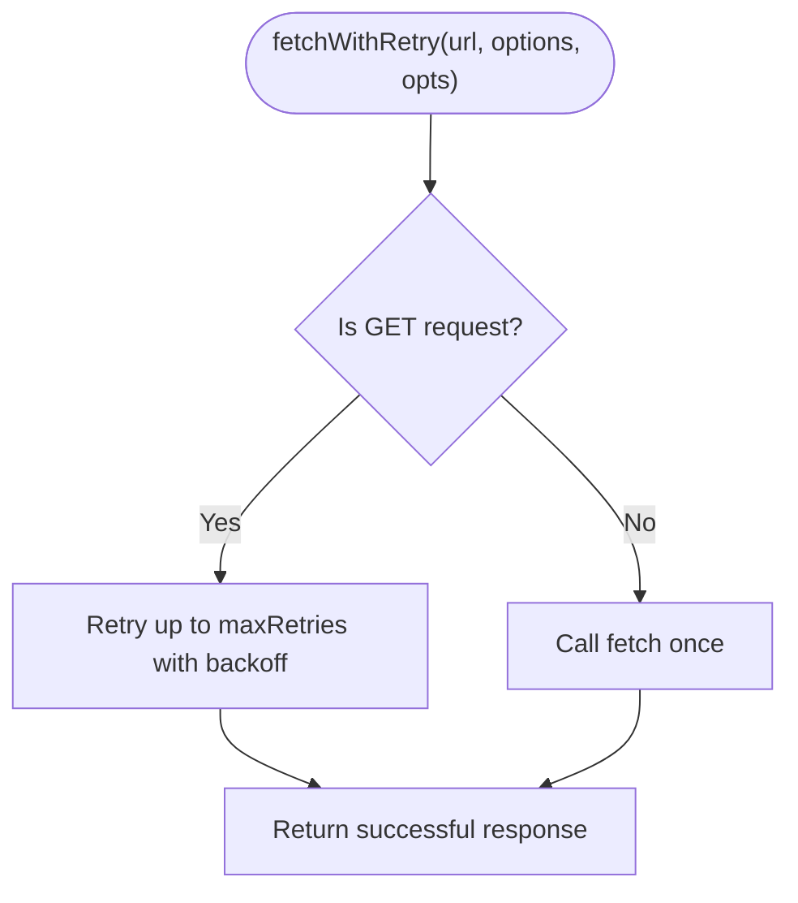

**Diagram sources**
- [api.core.test.js:40-54](file://frontend/src/services/api.core.test.js#L40-L54)

**Section sources**
- [api.core.test.js:1-79](file://frontend/src/services/api.core.test.js#L1-L79)

### Analytics Wrapper Tests
- Validates event capture behavior and lazy initialization of analytics SDK
- Ensures proper queuing of events when SDK is not yet ready

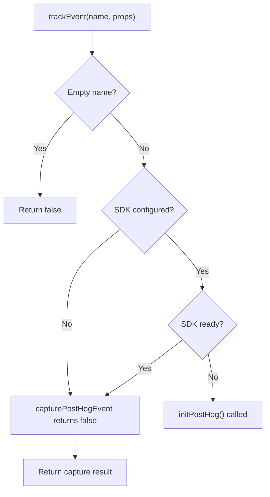

**Diagram sources**
- [analytics.test.js:28-54](file://frontend/src/lib/analytics.test.js#L28-L54)

**Section sources**
- [analytics.test.js:1-56](file://frontend/src/lib/analytics.test.js#L1-L56)

### Custom Hooks Underlying Tests
- useAgent: Manages agent session state, message fetching, document sections, and lifecycle operations (start, send, stop, approve)
- useUpload: Orchestrates file upload, progress tracking, status polling, quota checks, and completion notifications

These hooks are central to the application’s interactivity and can be tested by mocking their dependencies and asserting state transitions and side effects.

**Section sources**
- [useAgent.js:1-292](file://frontend/src/hooks/useAgent.js#L1-L292)
- [useUpload.js:1-361](file://frontend/src/hooks/useUpload.js#L1-L361)

## Dependency Analysis
Testing libraries and their roles:
- @testing-library/react: renders components and provides queries for assertions
- @testing-library/jest-dom: adds DOM-specific matchers for readability
- @testing-library/user-event: simulates user interactions
- jsdom: provides browser-like DOM APIs for Vitest
- vitest: test runner and assertion library
- @playwright/test and @playwright/browser-chromium: E2E framework and Chromium browser

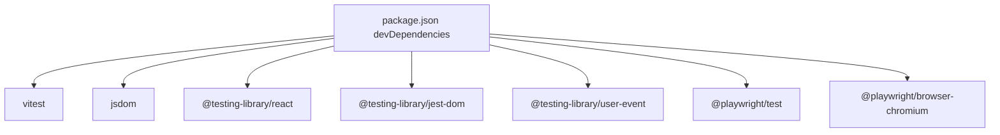

**Diagram sources**
- [package.json:38-59](file://frontend/package.json#L38-L59)

**Section sources**
- [package.json:1-62](file://frontend/package.json#L1-L62)

## Performance Considerations
- Prefer Vitest for fast, isolated unit/component tests to validate logic and state transitions without browser overhead
- Use Playwright for E2E tests that require real browser behavior, focusing on critical user journeys
- Keep E2E tests scoped to high-value flows to minimize CI duration
- Utilize Playwright’s trace collection on first retry to reduce debugging cycles

## Troubleshooting Guide
Common issues and resolutions:
- Missing DOM matchers in Vitest: Ensure setup.js is loaded and registers @testing-library/jest-dom
- Next.js navigation mocks: Mock next/navigation APIs in component tests to avoid runtime errors
- Asynchronous flows: Use Testing Library’s waitFor or fake timers for predictable assertions
- E2E flakiness: Reduce parallelism in CI, enable retries, and collect traces on first retry
- Debugging E2E failures: Use Playwright’s HTML report and trace viewer; run tests with headed mode for visual debugging

**Section sources**
- [setup.js:1-2](file://frontend/src/test/setup.js#L1-L2)
- [playwright.config.js:14-28](file://frontend/playwright.config.js#L14-L28)

## Conclusion
The project’s frontend testing setup combines Vitest for rapid, isolated tests and Playwright for robust browser-based E2E validation. With 93 test files currently in place, the focus should be on converting stubs into meaningful DOM assertions and expanding coverage for critical user flows. By following the guidelines and leveraging the provided patterns, teams can improve confidence in the frontend while maintaining efficient CI performance.